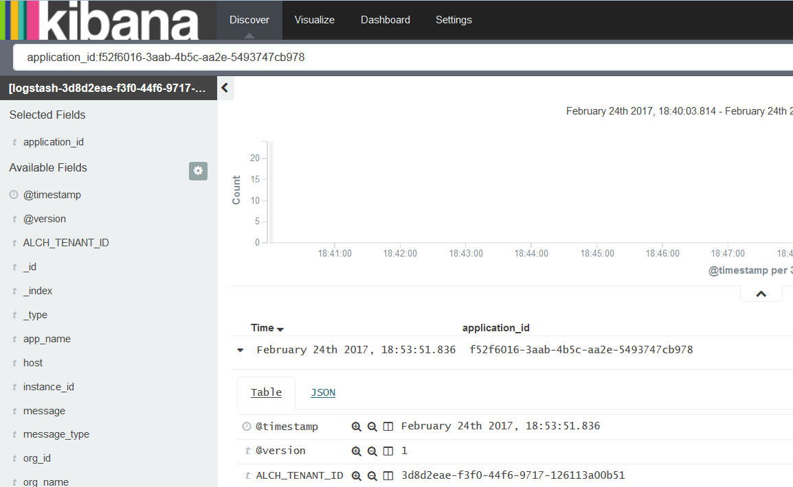
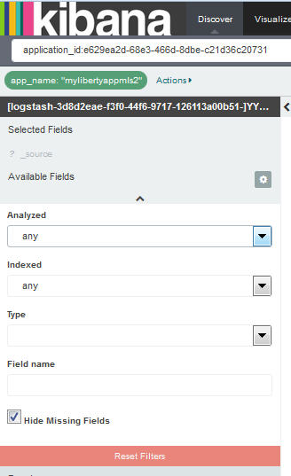

---

copyright:
  years: 2015, 2017

lastupdated: "2017-03-16"

---

{:shortdesc: .shortdesc}
{:new_window: target="_blank"}
{:codeblock: .codeblock}
{:screen: .screen}

# Analisando logs interativamente no Kibana
{:#kibana_analize_logs_interactively}

Na página Descobrir, é possível visualizar e analisar seus logs do
{{site.data.keyword.Bluemix}}. É possível definir consultas de procura para filtrar estes dados usando a linguagem de
consulta Lucene. Para cada consulta de procura, é possível aplicar filtros para refinar as entradas que
estão disponíveis para análise. É possível salvar uma procura para reutilização futura.
{:shortdesc}

No {{site.data.keyword.Bluemix_notm}}, por padrão, o conjunto de dados que é exibido na
página Descobrir ao ativar o Kibana por meio da IU do {{site.data.keyword.Bluemix_notm}} é
configurado para mostrar somente as entradas para o aplicativo ou contêiner Cloud Foundry (CF) no
qual o Kibana é ativado. Para obter mais informações sobre como ver qual subconjunto de seus dados a
página Descobrir exibe, consulte
[Identificando os dados que são
exibidos](logging_kibana_analize_logs_interactively.html#k4_identify_data).

A tabela a seguir mostra a consulta padrão por recurso ao ativar o Kibana no
{{site.data.keyword.Bluemix_notm}}:

| Recurso | Consulta de procura padrão do Kibana |
|---------------|---------------|
| Aplicativo CF   | `application_id:<app_GUID>`    |
| Contêiner do Docker único | `instance:<instance_GUID>`    |
| Grupo de contêiner com duas instâncias | `instance:<instance_GUID> OR instance:<instance_GUID>` |

**Nota:** 
* Toda vez que você ativa o Kibana na IU do {{site.data.keyword.Bluemix_notm}}, os dados que
podem ser vistos correspondem à consulta que é predefinida por padrão e são baseados no padrão de índice.
* Um máximo de 500 entradas, que correspondem às entradas mais recentes, é exibido na página
Descobrir. É possível modificar esse valor na página Configurações.

Ao ativar o Kibana em um navegador, os dados que são exibidos na página Descobrir incluem todos
os dados do log que estiverem disponíveis no espaço no qual você efetuou login. A página não é limitada a
contêineres ou apps específicos. 

A página Descobrir inclui um histograma e uma tabela que podem ser customizados para que
os dados possam ser analisados interativamente. 

É possível executar qualquer uma das tarefas a seguir para customizar a tabela na página Descobrir:

| Atividade | Descrição | 
|------|-------------|
| [Incluir uma
coluna de campo](logging_kibana_analize_logs_interactively.html#kibana_discover_add_fields_to_table)  | Inclua campos para ver os dados específicos que são necessários para análise em vez
da mensagem completa. |
| [Reorganizar
uma coluna de campo](logging_kibana_analize_logs_interactively.html#kibana_discover_rearrange_fields_in_table) | Mova a posição de um campo na tabela para a posição desejada. |
| [Visualizar
uma entrada](logging_kibana_analize_logs_interactively.html#kibana_discover_view_entry_in_table) | Expanda uma entrada na tabela para ver os detalhes da entrada analisada por campo ou como
JSON. |
| [Remover
uma coluna de campo](logging_kibana_analize_logs_interactively.html#kibana_discover_remove_fields_from_table) | Remova um campo quando ele não for necessário na visualização para análise. |
| [Ordenar entradas por
valor de um campo indexado](logging_kibana_analize_logs_interactively.html#kibana_discover_sort_by_table) | Reordene as entradas para facilitar a análise. |
| [Atualizar
os dados automaticamente](logging_kibana_analize_logs_interactively.html#kibana_discover_view_refresh_interval) | Atualize os dados exibidos na tabela com as entradas mais recentes. Por
padrão, a atualização é **OFF**. |

 

A figura a seguir exibe uma amostra de uma tabela na página Descobrir:

É possível definir outras procuras. Para obter mais informações, consulte
[Filtrando logs definindo procuras
customizadas](k4_filter_queries.html#k4_filter_queries). Ao definir uma nova procura, os dados que são exibidos no histograma e na tabela são
atualizados automaticamente.

Para definir uma nova procura, use a consulta de procura padrão como seu ponto de início e, em seguida,
refine a procura executando as seguintes tarefas:

* Aplique filtros de campo para refinar o conjunto de dados que pode ser visto. É possível alternar cada
filtro, fixá-lo na página, ativá-lo ou desativá-lo, conforme necessário, e configurá-lo para incluir ou
excluir o valor. Para obter mais informações, consulte
[Filtrando logs no Kibana](logging_kibana_filtering_logs.html#kibana_filtering_logs).

    **Dica:** se não for possível localizar um campo na *Lista de campos*
que você espera ver ou se algumas das lupas nos campos listados estiverem desativadas na
página Descobrir, recarregue a lista de campos atualizando o padrão de índice na página Configurações. Para
obter mais informações, consulte
[Recarregando a
lista de campos](logging_kibana_analize_logs_interactively.html#kibana_discover_add_reload_fields).

    Por exemplo, se seu app CF tiver múltiplas instâncias, talvez você queira analisar dados para uma
instância específica. É possível definir um filtro de campo para o valor do ID da instância específico que
deseja analisar. 
    
* Customize o *Selecionador de tempo* para dados baseados em tempo. É possível definir um
intervalo de tempo absoluto para uma consulta, um relativo ou escolher por meio de um conjunto de valores
predefinidos. Para obter mais informações, consulte
[Configurando um filtro de tempo](logging_kibana_set_time_filter.html#set_time_filter).

Depois de configurar a procura que define o subconjunto de dados que deseja analisar, é possível
salvá-la para reutilização posterior.

É possível executar qualquer uma das tarefas a seguir com procuras que você define na página
Descobrir:

| Atividade | Descrição |
|------|-------------|
| [Salvar uma procura](logging_kibana_filtering_logs.html#k4_save_search) | Salve a procura
para reutilização posterior.  |
| [Excluir uma procura](logging_kibana_filtering_logs.html#k4_delete_search) | Exclua uma
procura quando ela não for mais necessária. |
| [Exportar uma procura](logging_kibana_filtering_logs.html#k4_export_search) | Exporte uma
procura para compartilhá-la.  |
| [Recarregar uma procura](logging_kibana_filtering_logs.html#k4_reload_search)  | Faça
upload de uma procura existente para analisar um conjunto de dados novamente. |
| [Atualizar os dados de uma procura](logging_kibana_filtering_logs.html#k4_refresh_search) | 
Configure atualização automática dos dados que são exibidos por meio da procura.  |
| [Importar uma procura](logging_kibana_filtering_logs.html#k4_import_search) | Importe uma
procura.  |

 

Também é possível consultar estatísticas na página Descobrir:
* É possível ver as estatísticas por campo. 
* É possível ver estatísticas no histograma por `@timestamp` que você configurou.

Para obter mais informações, consulte
[Visualizando
estatísticas de dados do campo](logging_kibana_analize_logs_interactively.html#kibana_discover_view_fields_stats).

**Nota:** os dados que são mostrados na tabela e no histograma são estáticos. Para
continuar visualizando as entradas mais recentes, deve-se configurar um intervalo de atualização. 

## Identificando os dados que são exibidos na página Descobrir
{:#k4_identify_data}

Ao usar o Kibana para analisar logs do {{site.data.keyword.Bluemix_notm}}, os dados que podem
ser vistos dependem de como você ativa o Kibana, do padrão de índice que é configurado e da consulta
e dos filtros customizados que possam ter sido aplicados.

Considere as seguintes informações para identificar os dados que estão disponíveis na tabela e
no histograma da página Descobrir:

1. Verifique o padrão de índice na página Configurações.

    O padrão de índice define a consulta de procura que é aplicada por padrão para mostrar entradas em
suas páginas do Kibana. Por padrão, o padrão de índice é pré-configurado e definido para todos os dados que
estiverem disponíveis em um espaço do {{site.data.keyword.Bluemix_notm}}. Por exemplo,

    * Se você ativar o Kibana na IU do {{site.data.keyword.Bluemix_notm}}, ou seja, na seção
*Log* das páginas da IU de um recurso específico, como um aplicativo ou contêiner Cloud Foundry
(CF), o padrão de índice aplicado incluirá todas as entradas que estiverem disponíveis no espaço.
    
    * Se você ativar o Kibana por meio de um navegador, o padrão de índice que é aplicado incluirá todas
as entradas que estiverem disponíveis no espaço que o Kibana mostra no qual você está com login
efetuado.
        
2. Verifique a consulta na página Descobrir.  

    A consulta que é exibida na página Descobrir é usada para filtrar as entradas que estiverem
disponíveis por padrão para análise. Por
exemplo:

    * Se você digitar qualquer sequência na barra de procura, a consulta varrerá todos os campos para
essa sequência.
    
    * Se a consulta for configurada como `application_id:<GUID>`, em que
*GUID* é o ID de um app CF, as entradas que podem ser vistas corresponderão a todas as entradas
que estiverem disponíveis para esse app CF no espaço que estiver configurado no padrão de índice.
    
    * Se a consulta for configurada como `instance_id:<GUID>`, em que
*GUID* é o ID de uma instância de contêiner, as entradas que podem ser vistas corresponderão a
todas as entradas que estiverem disponíveis para esse contêiner no espaço que estiver configurado no padrão de
índice.
    
    * Se a consulta for configurada como `instance_id:<GUID> AND instance_id:<GUID>`, em que
*GUID* é o ID de uma instância de contêiner, as entradas que podem ser vistas corresponderão a
todas as entradas que estiverem disponíveis para esse grupo de contêiner no espaço que estiver configurado no
padrão de índice.
   
    * Se a consulta for configurada como `*`, os dados serão configurados para todas as
entradas que estiverem disponíveis no espaço que estiver configurado no padrão de índice.
    
    * Se a consulta for configurada como `application_id:<GUID> AND
message:"MY_search_text"`, em que *GUID* é o ID de um app CF e
*My_search_text* é a sequência que você deseja procurar, as entradas que podem ser vistas
corresponderão a todas as entradas que incluírem *My_search_text* no campo de mensagem para as
entradas do app CF que estiverem disponíveis no espaço que estiver configurado no padrão de índice.
    
3. Verifique os filtros de campo que são aplicados à sua consulta na página Descobrir.

    É possível definir 0 ou mais filtros de campo para alternar entradas com base no valor de campo. Por exemplo, se um filtro de campo for ativado, as entradas que podem ser vistas corresponderão às
entradas nas quais o valor desse campo corresponde.
    

## Incluindo colunas de campo na tabela
{: #kibana_discover_add_fields_to_table}

A tabela que está disponível para analisar dados na página Descobrir inclui os seguintes campos por
padrão:
* **time:** esse campo indica quando a entrada foi capturada e registrada no
{{site.data.keyword.Bluemix_notm}}.
* **_source:** esse campo inclui os dados originais da entrada.

É possível incluir uma coluna de campo na tabela escolhendo qualquer uma das opções a seguir:

* Incluir uma coluna de campo na lista Campo que está disponível na página.

    1. Na página Descobrir, identifique o campo na seção `Campos selecionados`.
    2. Passe o mouse sobre um campo na lista Campos.
    
        

    
    3. Para incluir um campo, clique em **Incluir**.
    
 * Incluir uma coluna de campo na visualização de tabela de uma entrada expandida.

    1. Expanda uma entrada na tabela.
    2. Na Visualização de tabela, identifique o campo que deseja incluir.
    
        

    
    3. Clique no ícone **Alternar coluna na tabela**
.
    

**Nota:** ao incluir uma coluna de campo na tabela pela primeira vez, a
coluna de campo *_source* que é exibida na tabela é ocultada. O campo *_source*
mostra o valor de cada campo para cada entrada de log. Para ver outros valores de campo para uma entrada de
log na tabela após incluir uma coluna na tabela, consulte a guia de visualização de tabela ou a guia JSON
de cada entrada.

Por exemplo, se você incluir o campo *application_id* na tabela, a tabela mudará para a
aparência a seguir:

## Reorganizando colunas de campo na tabela
{: #kibana_discover_rearrange_fields_in_table}

É possível reorganizar as colunas de campo na tabela. Passe o mouse sobre o cabeçalho da coluna que
deseja mover e clique no botão **Mover coluna para a esquerda** ou no botão **Mover
coluna para a direita**.
 

## Removendo colunas de campo da tabela
{: #kibana_discover_remove_fields_from_table}

Para remover campos da tabela, conclua as etapas a seguir:

1. Na tabela, identifique o campo que deseja remover da visualização de tabela.
2. Clique em **Remover coluna**.
    
    

## Visualizando uma entrada na tabela
{: #kibana_discover_view_entry_in_table}

Para ver os dados de uma entrada na tabela, clique no botão Expandir
 da entrada que
deseja analisar. 

 	

Em seguida, escolha uma das opções a seguir para ver os dados:

* Para ver os dados em um formato de tabela, clique em **Tabela**. É possível ver o
valor de cada campo que estiver disponível para análise em um formato de tabela. Para cada campo, também
há botões de filtro e um botão de alternância.
* Para ver os dados em formato JSON, clique em **JSON**.

## Ordenando entradas por valor de um campo indexado 
{: #kibana_discover_sort_by_table}

É possível classificar entradas na tabela somente para os campos que estiverem indexados.

Para descobrir quais campos estão indexados, conclua as etapas a seguir:

1. Na página Descobrir, clique no ícone de configuração
. A seção na
qual é possível filtrar campos na seção **Campos selecionados** da página é exibida.

    

    
2. Para identificar os campos que estiverem indexados, selecione **Sim** para o
campo de procura **Indexados**.

    
    
 A lista de campos indexados é mostrada. 
 
 
  	
 
Para classificar as entradas em uma tabela pelos valores de um campo indexado, conclua as etapas a
seguir: 

1. Passe o mouse sobre o nome do campo que está na tabela pelo qual deseja classificar os dados. Botões
de ação diferentes aparecem.
2. Clique no botão de classificação para o campo pelo qual deseja classificar dados. Clique no ícone de
classificação de campo uma segunda vez para inverter a ordem de classificação.

**Nota:** ao classificar por um campo de tempo, as entradas são
classificadas em ordem cronológica reversa por padrão. As entradas mais recentes aparecem primeiro.

## Atualizando os dados automaticamente
{: #kibana_discover_view_refresh_interval}

Por padrão, no {{site.data.keyword.Bluemix_notm}}, o período de *Atualização
automática* é configurado como **OFF** e os dados que podem ser vistos no Kibana
correspondem aos últimos 15 minutos desde que você ativou o Kibana. Os 15 minutos correspondem ao filtro de
tempo que é pré-configurado. É possível mudá-lo configurando um período de tempo diferente. Para obter mais
informações, consulte [Configurando um filtro
de tempo](logging_kibana_set_time_filter.html#set_time_filter).

Conclua as etapas a seguir para configurar um período de *Atualização automática*:

1. Na barra de menus da página Descobrir, clique no Selecionador de tempo
.

2. Selecione o botão de atualização automática
.

3. Escolha um intervalo de atualização.

    

É possível pausar o intervalo de atualização clicando no botão de pausa
 

## Recarregando a lista de campos
{: #kibana_discover_view_reload_fields}

Conclua as etapas a seguir para recarregar a lista de campos que são exibidos no Kibana:

1. Selecione a categoria Configurações.

    Ao selecionar a página Configurações, a guia *Índices* é aberta.
   
2. Selecione o padrão de índice para ver cada campo no tipo de núcleo associado do campo conforme
registrado pelo Elasticsearch. 

3. Clique no botão *Recarregar lista de campo*
 para recarregar os campos de padrão de índice. 

A lista de campos é atualizada.

## Visualizando Estatísticas de Dados do Campo
{: #kibana_discover_view_fields_stats}

Na página Descobrir, é possível visualizar estatísticas para cada campo na *Lista de
campos* e no *histograma*. 

É possível ver as seguintes informações na lista Campos:
* Quantas entradas na tabela contêm um campo específico?
* Quais são os 5 principais valores?
* Que porcentagem de entradas contém cada valor.

É possível ver as seguintes informações no histograma:
* Número de entradas em um intervalo de tempo.

Para ver as estatísticas do histograma, clique em um registro de data e hora para ver as estatísticas
para esse período. Por exemplo, 

   	
 	
Para ver as estatísticas em um campo na lista Campos, clique no nome. Por exemplo,

