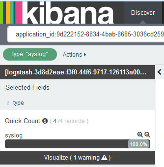

---

copyright:
  years: 2015, 2017

lastupdated: "2017-03-01"

---

{:shortdesc: .shortdesc}
{:new_window: target="_blank"}
{:codeblock: .codeblock}
{:screen: .screen}

# 按日志类型过滤日志
{:#k4_filter_logs_by_log_type}

按日志类型查看和过滤 {{site.data.keyword.Bluemix}} 日志。
{:shortdesc}

要搜索包含特定日志类型的条目，请完成以下步骤：

1. 查看 Kibana 的“发现”页面，以确定它显示的数据子集。有关更多信息，请参阅[确定在 Kibana 的“发现”页面中显示的数据](logging_kibana_analize_logs_interactively.html#k4_identify_data)。

2. 在*字段列表*中，选择 **type** 字段。

    例如，在下图中，只有一种日志类型可用：*syslog*
    
    
   
3. 要添加过滤器以搜索特定日志类型，请选择要分析的日志类型的放大按钮 。

    例如，要添加过滤器以包含 *syslog* 的日志条目，请选择*字段列表*部分中可用于值 *syslog* 的“放大镜”按钮 。下图显示了包含日志类型 *syslog* 的条目的过滤器。

    

    要添加过滤器以搜索不包含特定日志类型的条目，请选择该值的放大按钮 。

     例如，要添加过滤器以排除 *syslog* 的日志条目，请选择*字段列表*部分中可用于值 *syslog* 的“放大镜”按钮 。下图显示了排除日志类型 *syslog* 的条目的过滤器。
     
     

