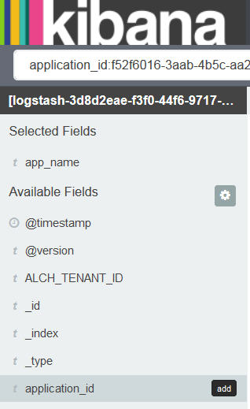

---

copyright:
  years: 2015, 2017

lastupdated: "2017-03-16"

---

{:shortdesc: .shortdesc}
{:new_window: target="_blank"}
{:codeblock: .codeblock}
{:screen: .screen}

# 在 Kibana 中以交互方式分析日志
{:#kibana_analize_logs_interactively}

在“发现”页面中，可以通过交互方式查看和分析 {{site.data.keyword.Bluemix}} 日志。可以使用 Lucene 查询语言来定义搜索查询以过滤这些数据。对于每个搜索查询，可以应用过滤器来优化可供分析的条目。可以保存搜索以供未来复用。
{:shortdesc}

在 {{site.data.keyword.Bluemix_notm}} 中，缺省情况下，通过 {{site.data.keyword.Bluemix_notm}} UI 启动 Kibana 时在“发现”页面中显示的数据集配置为仅显示从中启动 Kibana 的 Cloud Foundry (CF) 应用程序或容器的条目。有关如何查看“发现”页面显示的数据子集的更多信息，请参阅[确定显示的数据](logging_kibana_analize_logs_interactively.html#k4_identify_data)。

下表显示了通过 {{site.data.keyword.Bluemix_notm}} 启动 Kibana 时，每种资源的缺省查询：

| 资源 | 缺省 Kibana 搜索查询 |
|---------------|---------------|
| CF 应用程序   | `application_id:<app_GUID>`    |
| 单 Docker 容器 | `instance:<instance_GUID>`    |
| 具有 2 个实例的容器组 | `instance:<instance_GUID> OR instance:<instance_GUID>` |

**注：** 
* 每次通过 {{site.data.keyword.Bluemix_notm}} UI 启动 Kibana 时，可以查看的数据对应于缺省情况下已预定义且基于索引模式的查询。
* 在“发现”页面上最多显示 500 个条目，这些条目对应于最新的条目。可以在“设置”页面中修改此值。

通过浏览器启动 Kibana 时，“发现”页面中显示的数据包含在您登录到的空间中可用的所有日志数据。该页面不限于特定容器或应用程序。

“发现”页面包含直方图和表，可以对其进行定制，以便以交互方式分析数据。 

要在“发现”页面中定制表，可以执行以下任一任务：

| 任务 | 描述 | 
|------|-------------|
| [添加字段列](logging_kibana_analize_logs_interactively.html#kibana_discover_add_fields_to_table) | 添加字段以查看分析所需的特定数据，而不查看完整消息。 |
| [重新排列字段列](logging_kibana_analize_logs_interactively.html#kibana_discover_rearrange_fields_in_table) | 将表中字段的位置移至所需的位置。 |
| [查看条目](logging_kibana_analize_logs_interactively.html#kibana_discover_view_entry_in_table) | 展开表中的条目，以查看按字段解析或解析为 JSON 的条目的详细信息。 |
| [除去字段列](logging_kibana_analize_logs_interactively.html#kibana_discover_remove_fields_from_table) | 除去视图中分析不需要的字段。 |
| [按已建立索引的字段的值对条目排序](logging_kibana_analize_logs_interactively.html#kibana_discover_sort_by_table) | 对条目重新排序以更轻松地进行分析。 |
| [自动刷新数据](logging_kibana_analize_logs_interactively.html#kibana_discover_view_refresh_interval) | 使用最新的条目刷新表中显示的数据。缺省情况下，刷新为**关闭**。 |

 

下图显示了“发现”页面中表的样本：

可以定义其他搜索。有关更多信息，请参阅[通过定义定制搜索来过滤日志](k4_filter_queries.html#k4_filter_queries)。定义新搜索时，直方图和表中显示的数据会自动更新。

要定义新搜索，请将缺省搜索查询用作起点，然后通过执行以下任务来优化搜索：

* 应用字段过滤器，以优化可以查看的数据集。可以切换每个过滤器，将过滤器锁定到页面，根据需要启用或禁用过滤器，以及配置过滤器以包含或排除值。有关更多信息，请参阅[在 Kibana 中过滤日志](logging_kibana_filtering_logs.html#kibana_filtering_logs)。

    **提示：**如果在*字段列表*中找不到希望查看的字段，或者在“发现”页面中所列出字段旁的某些放大镜处于禁用状态，请通过刷新“设置”页面中的索引模式来重新装入字段列表。有关更多信息，请参阅[重新装入字段列表](logging_kibana_analize_logs_interactively.html#kibana_discover_add_reload_fields)。

    例如，如果 CF 应用程序具有多个实例，您可能会希望分析特定实例的数据。您可以针对要分析的特定实例标识值定义字段过滤器。 
    
* 为基于时间的数据定制*时间选取器*。可以定义查询的绝对时间范围或相对时间范围，也可以从一组预定义的值中进行选择。有关更多信息，请参阅[设置时间过滤器](logging_kibana_set_time_filter.html#set_time_filter)。

配置了用于定义要分析的数据子集的搜索后，可以将其保存以供日后复用。

可以使用在“发现”页面中定义的搜索来执行以下任一任务：

| 任务 | 描述 |
|------|-------------|
| [保存搜索](logging_kibana_filtering_logs.html#k4_save_search) | 保存搜索以供日后复用。  |
| [删除搜索](logging_kibana_filtering_logs.html#k4_delete_search) | 删除不再需要的搜索。 |
| [导出搜索](logging_kibana_filtering_logs.html#k4_export_search) | 导出搜索以进行共享。  |
| [重新装入搜索](logging_kibana_filtering_logs.html#k4_reload_search)  | 上传现有搜索以重新分析一组数据。 |
| [刷新搜索的数据](logging_kibana_filtering_logs.html#k4_refresh_search) | 针对通过搜索显示的数据配置自动刷新。  |
| [导入搜索](logging_kibana_filtering_logs.html#k4_import_search) | 导入搜索。  |

 

您还可以在“发现”页面中查看统计信息：
* 可以按字段查看统计信息。 
* 可以按已配置的 `@timestamp` 在直方图中查看统计信息。

有关更多信息，请参阅[查看字段数据统计信息](logging_kibana_analize_logs_interactively.html#kibana_discover_view_fields_stats)。

**注：**表和直方图中显示的数据是静态的。要始终查看最新的条目，必须设置刷新时间间隔。 

## 确定在“发现”页面中显示的数据
{:#k4_identify_data}

使用 Kibana 分析 {{site.data.keyword.Bluemix_notm}} 日志时，可以查看的数据取决于 Kibana 的启动方式、配置的索引模式以及可能已应用的定制查询和过滤器。

要确定“发现”页面的表和直方图中可用的数据，请考虑以下信息：

1. 在“设置”页面中检查索引模式。

    索引模式定义缺省情况下应用以在 Kibana 页面中显示条目的搜索查询。缺省情况下，索引模式已预配置，并设置为 {{site.data.keyword.Bluemix_notm}} 空间中可用的所有数据。例如：

    * 如果是通过 {{site.data.keyword.Bluemix_notm}} UI 启动 Kibana，即通过特定资源（如 Cloud Foundry (CF) 应用程序或容器）的 UI 页面的*日志*部分启动 Kibana，那么应用的索引模式会包含空间中可用的所有条目。
    
    * 如果是通过浏览器启动 Kibana，那么应用的索引模式包含 Kibana 显示的您登录到的空间中可用的所有条目。
        
2. 在“发现”页面中检查查询。  

    “发现”页面中显示的查询用于过滤缺省情况下可供分析的条目。例如：

    * 如果在搜索栏中输入任意字符串，那么查询会扫描所有字段以查找该字符串。
    
    * 如果查询设置为 `application_id:<GUID>`（其中，*GUID* 是 CF 应用程序的标识），那么可以查看的条目对应于在索引模式中配置的空间中该 CF 应用程序可用的所有条目。
    
    * 如果查询设置为 `instance_id:<GUID>`（其中，*GUID* 是容器实例的标识），那么可以查看的条目对应于在索引模式中配置的空间中该容器可用的所有条目。
    
    * 如果查询设置为 `instance_id:<GUID> AND instance_id:<GUID>`（其中，*GUID* 是容器实例的标识），那么可以查看的条目对应于在索引模式中配置的空间中该容器组可用的所有条目。
   
    * 如果查询设置为 `*`，那么数据会设置为在索引模式中配置的空间中可用的所有条目。
    
    * 如果查询设置为 `application_id:<GUID> AND message:"MY_search_text"`（其中，*GUID* 是 CF 应用程序的标识，*My_search_text* 是要搜索的字符串），那么可以查看的条目对应于在索引模式中配置的空间中可用的该 CF 应用程序条目的 message 字段中包含 *My_search_text* 的所有条目。
    
3. 在“发现”页面中检查应用于查询的字段过滤器。

    可以定义 0 个或更多个字段过滤器以基于字段值来切换条目。例如，如果启用了字段过滤器，那么可以查看的条目对应于与该字段的值匹配的条目。
    

## 向表添加字段列
{: #kibana_discover_add_fields_to_table}

缺省情况下，在“发现”页面中可用于分析数据的表包含以下字段：
* **time：**此字段指示在 {{site.data.keyword.Bluemix_notm}} 中捕获和记录条目的时间。
* **_source：**此字段包含条目的原始数据。

可以通过选择以下任一选项向表添加字段列：

* 通过页面上可用的“字段列表”添加字段列。

    1. 在“发现”页面的“`所选字段`”部分中确定字段。
    2. 将鼠标悬停在“字段列表”中的字段上。
    
        
    
    3. 要添加字段，请单击**添加**。
    
 * 从已展开条目的表视图中添加字段列。

    1. 在表中展开条目。
    2. 在表视图中，确定要添加的字段。
    
        
    
    3. 单击**切换表中的列**图标 。
    

**注：**首次向表添加一个字段列时，表中显示的 *_source* 字段列会隐藏。*_source* 字段显示每个日志条目的每个字段的值。向表添加列后，要查看该表中日志条目的其他字段值，请查看每个条目的“表视图”选项卡或 JSON 选项卡。

例如，如果向表添加 *application_id* 字段，那么表会更改为类似于下图：

## 重新排列表中的字段列
{: #kibana_discover_rearrange_fields_in_table}

可以重新排列表中的字段列。将鼠标悬停在要移动的列的标题上，然后单击**左移列**按钮或**右移列**按钮。
 

## 从表中除去字段列
{: #kibana_discover_remove_fields_from_table}

要从表中除去字段，请完成以下步骤：

1. 在表中，确定要从表视图中除去的字段。
2. 单击**除去列**。
    
    

## 查看表中的条目
{: #kibana_discover_view_entry_in_table}

要查看表中条目的数据，请单击要分析的条目的“展开”按钮 。 

 	

然后，选择以下其中一个选项来查看数据：

* 要以表格式查看数据，请单击**表**。可以通过表格式查看可供分析的每个字段的值。对于每个字段，还有过滤器按钮和切换按钮。
* 要以 JSON 格式查看数据，请单击 **JSON**。

## 按已建立索引的字段的值对条目排序 
{: #kibana_discover_sort_by_table}

只能对表中已建立索引的字段的条目进行排序。

要了解哪些字段已建立索引，请完成以下步骤：

1. 在“发现”页面中，单击“配置”图标 。这将显示可以过滤页面的**所选字段**部分中字段的部分。

    
    
2. 要确定已建立索引的字段，请在搜索字段**已建立索引**中选择**是**。

    
    
 这将显示已建立索引的字段的列表。
 
 
  	
 
要按已建立索引的字段的值对表中条目排序，请完成以下步骤： 

1. 将鼠标悬停在表中要按其对数据排序的字段的名称上。这将显示不同的操作按钮。
2. 单击要按其对数据排序的字段的“排序”按钮。再次单击字段排序图标可按逆向顺序排序。

**注：**按时间字段排序时，缺省情况下条目按从新到旧的时间顺序排序。最新的条目最先显示。

## 自动刷新数据
{: #kibana_discover_view_refresh_interval}

缺省情况下，在 {{site.data.keyword.Bluemix_notm}} 中，*自动刷新*时间段设置为**关闭**，因此在 Kibana 中可以查看的数据对应于自启动 Kibana 以来最近 15 分钟的数据。15 分钟对应于预配置的时间过滤器。可以通过设置其他时间段来更改此时间。有关更多信息，请参阅[设置时间过滤器](logging_kibana_set_time_filter.html#set_time_filter)。

要设置*自动刷新*时间段，请完成以下步骤：

1. 在“发现”页面的菜单栏中，单击时间选取器 。

2. 选择“自动刷新”按钮 。

3. 选择刷新时间间隔。

    

可以通过单击“暂停”按钮  来暂停刷新时间间隔。 

## 重新装入字段列表
{: #kibana_discover_view_reload_fields}

要重新装入 Kibana 中显示的字段列表，请完成以下步骤：

1. 选择“设置”页面。

    选择“设置”页面时，*索引*选项卡将打开。
   
2. 选择索引模式以查看 Elasticsearch 记录的每个字段及其关联的核心类型。 

3. 单击*重新装入字段列表*按钮  以重新装入索引模式字段。 

这将刷新字段列表。

## 查看字段数据统计信息
{: #kibana_discover_view_fields_stats}

在“发现”页面中，可以通过*字段列表*和*直方图*来查看每个字段的统计信息。 

可以在“字段列表”中查看以下信息：
* 表中包含特定字段的条目数。
* 排名前 5 位的值。
* 包含每个值的条目的百分比。

可以在直方图中查看以下信息：
* 某个时间范围内的条目数。

要在直方图中查看统计信息，请单击时间戳记以查看该时间段的统计信息。例如： 

   	
 	
要在“字段列表”中查看字段的统计信息，请单击该字段的名称。例如：

