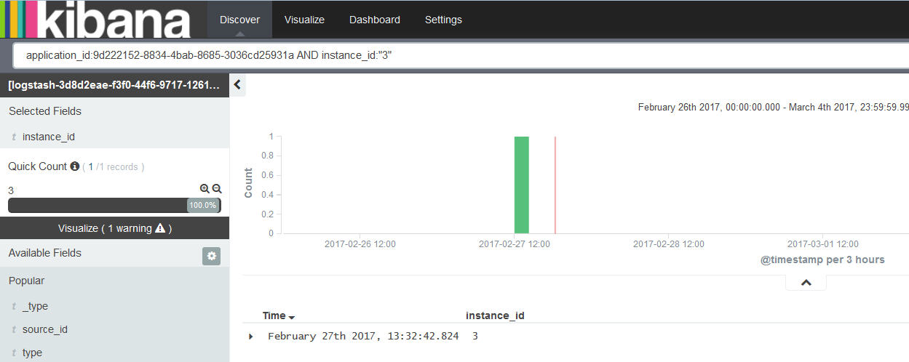

---

copyright:
  years: 2015, 2017

lastupdated: "2017-04-06"

---

{:shortdesc: .shortdesc}
{:new_window: target="_blank"}
{:codeblock: .codeblock}
{:screen: .screen}

# 在 Kibana 中過濾日誌
{:#k4_filter_logs}

在「探索」頁面中，您可以建立搜尋查詢及套用過濾器，以限制顯示用來進行分析的資訊。{:shortdesc}

* 您可以在「探索」頁面的搜尋列中，定義一個以上的搜尋查詢。搜尋查詢會定義一個日誌項目子集。請使用 Lucene 查詢語言來定義搜尋查詢。 

* 您可以從*欄位清單* 或表格項目中新增過濾器。而過濾器可以透過包含或排除資訊的方式來修正資料選取項目。您可以啟用或停用過濾器、反轉過濾動作、將過濾器切換為開啟或關閉，或是將它整個移除。 

定義新搜尋之後，請儲存它，以供日後在「探索」頁面中重複使用來進行分析，或是建立視覺化，以用在自訂儀表板中。如需相關資訊，請參閱[儲存搜尋](logging_kibana_filtering_logs.html#k4_save_search)。

當您執行新搜尋時，直方圖、表格及「欄位」清單會自動更新，以顯示搜尋結果。若要瞭解會顯示哪些資料，請參閱[識別探索頁面中顯示的資料](k4_identify_data.html#k4_identify_data)。

下列清單概述如何過濾日誌資料的情境：

* 您可以建立自訂搜尋來過濾日誌。如需相關資訊，請參閱[透過定義自訂查詢過濾日誌](k4_filter_queries.html#k4_filter_queries)。

* 您可以在日誌中搜尋欄位值中包括特定文字的項目。如需相關資訊，請參閱[針對欄位值中的特定文字過濾日誌](k4_filter_logs_spec_text.html#k4_filter_logs_spec_text)。
 
* 您可以在日誌中搜尋特定欄位值，或排除日誌中特定欄位值的項目。如需相關資訊，請參閱[針對特定欄位值過濾日誌](k4_filter_logs_spec_field.html#k4_filter_logs_spec_field)。
 
* 您可以過濾日誌，以顯示某時段內的項目。如需相關資訊，請參閱[設定時間過濾器](logging_kibana_set_time_filter.html#set_time_filter)。
     

## 新增過濾器以尋找未列在*欄位清單* 中的值
{:#k4_add_filter_out_value}

若要新增過濾器以尋找未顯示在*欄位清單* 中的值，請透過查詢來搜尋包括該值的記錄。然後，從「探索」頁面中可用的表格項目中新增過濾器。
 

請完成下列步驟，新增過濾器以尋找*欄位清單* 區段所顯示的清單中沒有的值：

1. 在 Kibana 的「探索」頁面中，查看其顯示哪些資料子集。如需相關資訊，請參閱[識別 Kibana 探索頁面中顯示的資料](logging_kibana_analize_logs_interactively.html#k4_identify_data)。

    例如，下圖顯示*欄位清單* 中 CF 應用程式的實例值。 
    
    
    
    您對實例號碼 *3* 感興趣，但它不在您可以看到的清單中。

2. 在「探索」頁面中修改查詢，以搜尋特定欄位值。

    例如，若要搜尋實例 *3*，則您輸入的查詢如下：
   `application_id:9d222152-8834-4bab-8685-3036cd25931a AND instance_id:"3"`
    
    
    
    您可以在表格中看到符合查詢的所有記錄。 
    
 3. 展開某筆記錄，然後選取放大鏡按鈕 ，以新增過濾器。
 
     例如，若要新增過濾器，以尋找包含值 *3* 的實例 ID，請按一下 *instance_id* 欄位旁的放大鏡按鈕 。
     
     
     
4. 確認已新增過濾器。

    例如，下圖顯示您自表格新增過濾器之後，已啟用的過濾器。
    
    
    
    

## 針對特定欄位值過濾日誌
{:#k4_filter_logs_spec_field}

您可以搜尋包括特定欄位值的項目。
 

請完成下列步驟，以搜尋包括特定欄位值的項目：

1. 在 Kibana 的「探索」頁面中，查看其顯示哪些資料子集。如需相關資訊，請參閱[識別 Kibana 探索頁面中顯示的資料](logging_kibana_analize_logs_interactively.html#k4_identify_data)。

2. 在*欄位清單* 中，識別您要為其定義過濾器的欄位，然後按一下該欄位。

    針對該欄位，最多可顯示 5 個值。每一個值都有兩個放大鏡按鈕。 
    
    如果您看不到該值，請參閱[新增過濾器以尋找未列在「欄位清單」中的值](k4_add_filter_out_value.html#k4_add_filter_out_value)。

3. 若要新增過濾器，以搜尋包含欄位值的項目，請選擇該值的放大鏡按鈕 。

    

    若要新增過濾器，以搜尋不包括該欄位值的項目，請選擇該值的放大鏡按鈕 。

    

4. 選擇下列任何選項，以用於 Kibana 中的過濾器：

    <table>
      <caption>表 1. 使用過濾器的方法</caption>
      <tbody>
        <tr>
          <th align="center">選項</th>
          <th align="center">說明</th>
          <th align="center">其他資訊</th>
        </tr>
        <tr>
          <td align="left">啟用</td>
          <td align="left">選取此選項可啟用過濾器。</td>
          <td align="left">當您新增過濾器時，會自動予以啟用。  如果過濾器停用，按一下該過濾器即可啟用。</td>
        </tr>
        <tr>
          <td align="left">停用</td>
          <td align="left">選取此選項可停用過濾器。</td>
          <td align="left">新增過濾器之後，如果您想要隱藏欄位值的項目，請按一下**停用**。</td>
        </tr>
        <tr>
          <td align="left">固定</td>
          <td align="left">選取此選項可將過濾器持續保存在所有 Kibana 頁面上。</td>
          <td align="left">您可以將過濾器固定在*探索*頁面、*視覺化*頁面或*儀表板*頁面。</td>
        </tr>
        <tr>
          <td align="left">切換</td>
          <td align="left">選取此選項可切換過濾器。</td>
          <td align="left">依預設，會顯示符合過濾器的項目。若要顯示不相符的項目，請切換過濾器。</td>
        </tr>
        <tr>
          <td align="left">移除</td>
          <td align="left">選取此選項可移除過濾器。</td>
          <td align="left"></td>
        </tr>
      </tbody>
    </table>

## 依來源過濾 CF 應用程式日誌
{:#k4_filter_logs_by_source}

請完成下列步驟，以搜尋包括特定日誌來源的項目：

1. 在 Kibana 的「探索」頁面中，查看其顯示哪些資料子集。如需相關資訊，請參閱[識別 Kibana 探索頁面中顯示的資料](logging_kibana_analize_logs_interactively.html#k4_identify_data)。

2. 在*欄位清單* 中，選取 **source_id** 欄位。

         

3. 若要新增過濾器，以搜尋包括特定 source_id 的項目，請選擇該值的放大鏡按鈕 。

    如需 CF 應用程式可用的日誌來源清單，請參閱 [CF 應用程式的日誌來源](../logging_cf_apps.html#logging_bluemix_cf_apps_log_sources)。

    例如，若要新增過濾器，以包括關於 CF 應用程式啟動、停止或當機的日誌項目，請在*欄位清單* 區段中，選取值 *CELL* 可用的放大鏡按鈕 。下圖顯示已啟用 source_id 值 *CELL* 的過濾器。
    
    

    若要新增過濾器，以搜尋不包括特定 source_id 的項目，請選擇該值的放大鏡按鈕 。
    
    例如，若要新增過濾器，以排除關於 CF 應用程式啟動、停止或當機的日誌項目，請在*欄位清單* 區段中，選取值 *CELL* 可用的放大鏡按鈕 。下圖顯示排除 source_id 值 *CELL* 項目的過濾器。

    

## 依日誌類型過濾日誌
{:#k4_filter_logs_by_log_type}

請完成下列步驟，以搜尋包括特定日誌類型的項目：

1. 在 Kibana 的「探索」頁面中，查看其顯示哪些資料子集。如需相關資訊，請參閱[識別 Kibana 探索頁面中顯示的資料](logging_kibana_analize_logs_interactively.html#k4_identify_data)。

2. 在*欄位清單* 中，選取**類型**欄位。

    例如，在下圖中，只有一個日誌類型可供使用：*syslog*
    
    
   
3. 若要新增過濾器，以搜尋特定日誌類型，請針對您要分析的日誌類型選擇放大鏡按鈕 。

    例如，若要新增過濾器，以包括 *syslog* 的日誌項目，請在*欄位清單* 區段中，選取值 *syslog* 可用的放大鏡按鈕 。下圖顯示包括日誌類型 *syslog* 項目的過濾器。

    

    若要新增過濾器，以搜尋不包括特定日誌類型的項目，請選擇該值的放大鏡按鈕 。

     例如，若要新增過濾器，以排除 *syslog* 的日誌項目，請在*欄位清單* 區段中，選取值 *syslog* 可用的放大鏡按鈕 。下圖顯示排除日誌類型 *syslog* 項目的過濾器。
     
     

## 依實例 ID 過濾日誌
{:#k4_filter_logs_by_instance_id}

請完成下列步驟，以在 Kibana 儀表板上，依實例 ID 檢視及過濾日誌：

1. 在 Kibana 的「探索」頁面中，查看其顯示哪些資料子集。如需相關資訊，請參閱[識別 Kibana 探索頁面中顯示的資料](logging_kibana_analize_logs_interactively.html#k4_identify_data)。

2. 在*欄位清單* 中，選取下列其中一個欄位，以搜尋特定實例 ID：

    * **instance_ID**：此欄位列出 Cloud Foundry 應用程式的日誌中可用的不同實例 ID。 
    * **instance**：此欄位列出所有容器群組實例的不同 GUID。 

    例如，下圖顯示 CF 應用程式的不同實例值：
    
    
   
3. 若要新增過濾器，以搜尋特定日誌類型，請針對您要分析的日誌類型選擇放大鏡按鈕 。

   例如，若要新增過濾器，以包括 CF 應用程式實例 *2* 的項目，請在「欄位清單」區段中，選取值 *2* 可用的放大鏡按鈕 。下圖顯示包括實例 *2* 項目的過濾器。
    
    

    若要新增過濾器，以搜尋不包括特定實例 ID 的項目，請選擇該值的放大鏡按鈕 。

     例如，若要新增過濾器，以排除 CF 應用程式實例 *2* 的項目，請在「欄位清單」區段中，選取值 *2* 可用的放大鏡按鈕 。下圖顯示排除實例 *2* 項目的過濾器。
     
      

## 依訊息類型過濾 CF 應用程式日誌
{:#k4_filter_cf_logs_by_msg_type}

請完成下列步驟，以搜尋包括特定訊息類型的項目：

1. 在 Kibana 的「探索」頁面中，查看其顯示哪些資料子集。如需相關資訊，請參閱[識別 Kibana 探索頁面中顯示的資料](logging_kibana_analize_logs_interactively.html#k4_identify_data)。

2. 在*欄位清單* 中，選取 **message_type** 欄位。

    下圖顯示在 CF 應用程式日誌中找到的 *message_type* 欄位的值：
    
         

3. 若要新增過濾器，以搜尋包括特定 *message_type* 的項目，請選擇該值的放大鏡按鈕 。

    例如，若要新增過濾器，以包括 message_type 值 *OUT* 的日誌項目，請在*欄位清單* 區段中，選取值 *OUT* 可用的放大鏡按鈕 。下圖顯示已啟用 message_type 值 *OUT* 的過濾器。
    
    

    若要新增過濾器，以搜尋不包括特定 *message_type* 的項目，請選擇該值的放大鏡按鈕 。
    
    例如，若要新增過濾器，以排除 message_type 值 *OUT* 的日誌項目，請在*欄位清單* 區段中，選取值 *CELL* 可用的放大鏡按鈕 。下圖顯示排除 message_type 值 *OUT* 項目的過濾器。

    

## 針對欄位值中的特定文字過濾日誌
{:#k4_filter_logs_spec_text}

檢視及搜尋欄位值中包括特定文字的項目。 

**注意：**您只能對由 Elasticsearch 分析器分析的字串欄位，進行任意文字搜尋。 
    
當 Elasticsearch 分析字串欄位的值時，它會依單字界限分割文字（如 Unicode Consortium 所定義）、移除標點符號，並將所有單字變成小寫。
    
請完成下列步驟，以搜尋欄位值中包括特定文字的項目：

1. 在 Kibana 的「探索」頁面中，查看其顯示哪些資料子集。如需相關資訊，請參閱[識別 Kibana 探索頁面中顯示的資料](logging_kibana_analize_logs_interactively.html#k4_identify_data)。

2. 識別 ElasticSearch 中依預設分析的欄位。

    若要顯示可用來搜尋及過濾日誌資料的分析欄位完整清單，請[重新載入欄位清單](logging_kibana_analize_logs_interactively.html#kibana_discover_view_reload_fields)。然後，在「探索」頁面可用的*欄位清單*中，完成下列步驟：
    
    1. 按一下配置圖示 。即會顯示**選取的欄位** 區段，您可以在這裡過濾欄位。

        
    
    2. 若要識別已分析的欄位，請針對**已分析**搜尋欄位選取**是**。

        
    
        即會顯示已分析欄位的清單。
    
        
        
         
    3. 檢查您要在其中尋找任意文字的欄位，是否為 ElasticSearch 依預設分析的欄位。
    
3. 如果已分析該欄位，請修改查詢，以在日誌中搜尋欄位值中包括該任意文字的項目。

    
**範例**

如果您從 {{site.data.keyword.Bluemix}} 使用者介面為 Cloud Foundry (CF) 應用程式啟動 Kibana，而且您想要尋找包括訊息 ID *CWWKT0016I:* 的特定訊息，請修改搜尋為包括該任意文字。
    
1. 檢查所載入的搜尋查詢，以及顯示在「探索」頁面中的資料。
       
    
        
2. 若要搜尋訊息 ID *CWWKT0016I*，請修改搜尋查詢，然後按 **Enter** 鍵：
    
    <pre class="pre">application_id:f52f6016-3aab-4b5c-aa2e-5493747cb978 AND message:"CWWKT0016I:" 
	</pre>
        
    
      
此表格顯示 CF 應用程式中，*message* 欄位值中包含文字 *CWWKT0016I* 的項目。
    
     	
        

## 設定時間過濾器
{: #set_time_filter}

配置*時間選取器*，以檢視及過濾某個時段內的 {{site.data.keyword.Bluemix_notm}} 日誌。

您可以在「探索」頁面中配置*時間選取器*。依預設，其設定為前 15 分鐘。 

請完成下列步驟，以搜尋包括特定時間的項目：

1. 在「探索」頁面功能表列中，按一下「時間選取器」。

2. 設定時間間隔。 

    您可以定義下列任何類型的時間間隔：
    
    * 快速：這些是預先定義的時間間隔，包括最常使用的「相對」及「絕對」時間間隔，例如，*今天* 及*這個月*。 
    
        
    
    * 相對：在這些時間間隔中，您可以指定開始日期和時間，以及結束日期和時間。您可以取小時的整數。
    
        
    
    * 絕對：這些是介於開始日期與結束日期之間的時間間隔。
    
        
      

配置時間間隔之後，Kibana 中顯示的資料會對應於該時間範圍內的項目。

