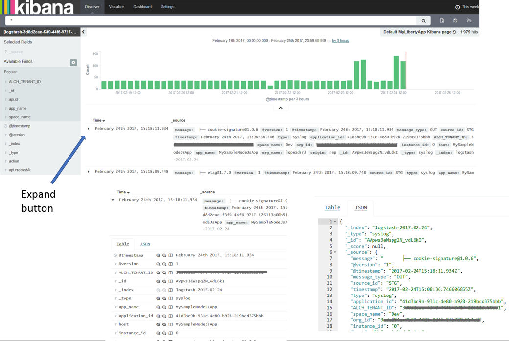

---

copyright:
  years: 2015, 2017

lastupdated: "2017-03-16"

---

{:shortdesc: .shortdesc}
{:new_window: target="_blank"}
{:codeblock: .codeblock}
{:screen: .screen}

# 在 Kibana 中以互動方式分析日誌
{:#kibana_analize_logs_interactively}

您可以在「探索」頁面中，以互動方式檢視及分析 {{site.data.keyword.Bluemix}} 日誌。您可以定義搜尋查詢，使用 Lucene 查詢語言來過濾該資料。您可以為每一個搜尋查詢套用過濾器，以精簡可用於分析的項目。您可以儲存搜尋，以供日後重複使用。{:shortdesc}

在 {{site.data.keyword.Bluemix_notm}} 中，當您從 {{site.data.keyword.Bluemix_notm}} 使用者介面啟動 Kibana 時，「探索」頁面中顯示的資料集預設會配置為只顯示您用來啟動 Kibana 的 Cloud Foundry (CF) 應用程式或容器的項目。如需進一步瞭解如何查看「探索」頁面顯示哪些資料子集，請參閱[識別所顯示的資料](logging_kibana_analize_logs_interactively.html#k4_identify_data)。

下表顯示當您從 {{site.data.keyword.Bluemix_notm}} 啟動 Kibana 時，各項資源的預設查詢：

| 資源 | 預設 Kibana 搜尋查詢 |
|---------------|---------------|
| CF 應用程式   | `application_id:<app_GUID>`    |
| 單一 Docker 容器 | `instance:<instance_GUID>`    |
| 含 2 個實例的容器群組 | `instance:<instance_GUID> OR instance:<instance_GUID>` |

**附註：** 
* 每當您從 {{site.data.keyword.Bluemix_notm}} 使用者介面啟動 Kibana 時，您可以看到的資料會對應於預設已預先定義並以索引型樣為基礎的查詢。
* 「探索」頁面中最多顯示 500 個項目（對應於最新的項目）。您可以在「設定」頁面中修改此值。

當您從瀏覽器啟動 Kibana 時，「探索」頁面中顯示的資料包括您登入之空間中可用的所有日誌資料。該頁面不受限於特定容器或應用程式。

「探索」頁面包括一個直方圖以及一個可自訂的表格，讓您能夠以互動方式來分析資料。 

您可以執行下列任何作業來自訂「探索」頁面中的表格：

| 作業 | 說明 | 
|------|-------------|
| [新增欄位直欄](logging_kibana_analize_logs_interactively.html#kibana_discover_add_fields_to_table) | 新增欄位，以查看分析所需的特定資料，而非完整訊息。 |
| [重新排列欄位直欄](logging_kibana_analize_logs_interactively.html#kibana_discover_rearrange_fields_in_table) | 將表格中的欄位位置移到您想要的位置。 |
| [檢視項目](logging_kibana_analize_logs_interactively.html#kibana_discover_view_entry_in_table) | 將表格中的項目展開，以查看依欄位剖析或剖析成 JSON 的項目詳細資料。 |
| [移除欄位直欄](logging_kibana_analize_logs_interactively.html#kibana_discover_remove_fields_from_table) | 若視圖中有不需要分析的欄位，可以將它移除。 |
| [依索引欄位的值來排列項目](logging_kibana_analize_logs_interactively.html#kibana_discover_sort_by_table) | 將項目重新排序，以方便分析。 |
| [自動重新整理資料](logging_kibana_analize_logs_interactively.html#kibana_discover_view_refresh_interval) | 以最新的項目來重新整理表格中顯示的資料。依預設，重新整理功能為**關閉**。 |

 

下圖顯示「探索」頁面中的表格範例。

您可以定義其他搜尋。如需相關資訊，請參閱[透過定義自訂搜尋過濾日誌](k4_filter_queries.html#k4_filter_queries)。當您定義新搜尋時，會自動更新直方圖及表格中顯示的資料。

若要定義新搜尋，請使用預設搜尋查詢作為起始點，然後執行下列作業來精簡搜尋：

* 套用欄位過濾器，以精簡您可以看到的資料集。您可以切換每一個過濾器、將其固定至頁面、依需要予以啟用或停用，以及將它配置為包括值或排除值。如需相關資訊，請參閱[在 Kibana 中過濾日誌](logging_kibana_filtering_logs.html#kibana_filtering_logs)。

    **提示：**如果在*欄位清單* 中找不到您預期會看到的欄位，或是在「探索」頁面中，列出欄位旁的部分放大鏡已停用，請重新整理「設定」頁面中的索引型樣，以重新載入欄位清單。如需相關資訊，請參閱[重新載入欄位清單](logging_kibana_analize_logs_interactively.html#kibana_discover_add_reload_fields)。

    例如，如果 CF 應用程式有多個實例，您可能會想要分析特定實例的資料。您可以針對想要分析的特定實例 ID 值，定義欄位過濾器。 
    
* 自訂時間型資料的*時間選取器*。您可以為查詢定義絕對時間範圍、相對時間範圍，或從一組預先定義的值中選擇。如需相關資訊，請參閱[設定時間過濾器](logging_kibana_set_time_filter.html#set_time_filter)。

配置搜尋來定義您要分析的資料子集之後，可以儲存它，以供稍後重複使用。

您可以使用在「探索」頁面中定義的搜尋來執行下列任何作業：

| 作業 | 說明 |
|------|-------------|
| [儲存搜尋](logging_kibana_filtering_logs.html#k4_save_search) | 儲存搜尋，以供稍後重複使用。  |
| [刪除搜尋](logging_kibana_filtering_logs.html#k4_delete_search) | 刪除不再需要的搜尋。 |
| [匯出搜尋](logging_kibana_filtering_logs.html#k4_export_search) | 匯出搜尋以進行共用。  |
| [重新載入搜尋](logging_kibana_filtering_logs.html#k4_reload_search)  | 上傳現有的搜尋，以重新分析資料集。 |
| [重新整理搜尋的資料](logging_kibana_filtering_logs.html#k4_refresh_search) | 針對透過搜尋而顯示的資料，配置自動重新整理。  |
| [匯入搜尋](logging_kibana_filtering_logs.html#k4_import_search) | 匯入搜尋。  |

 

您也可以在「探索」頁面中查看統計資料：
* 您可以查看每個欄位的統計資料。 
* 您可以針對所配置的每個 `@timestamp`，以直方圖查看統計資料。

如需相關資訊，請參閱[檢視欄位資料的統計資料](logging_kibana_analize_logs_interactively.html#kibana_discover_view_fields_stats)。

**附註：**表格及直方圖中顯示的資料是靜態的。若要持續檢視最新項目，您必須設定重新整理間隔。 

## 識別探索頁面中顯示的資料
{:#k4_identify_data}

當您使用 Kibana 來分析 {{site.data.keyword.Bluemix_notm}} 日誌時，您可以看到的資料，取決於您啟動 Kibana 的方式、所配置的索引型樣，以及您可能已套用的自訂查詢和過濾器。

請考量下列資訊，以識別「探索」頁面的表格及直方圖中可用的資料：

1. 在「設定」頁面中，檢查索引型樣。

    索引型樣可定義搜尋查詢，在 Kibana 頁面中顯示項目時，預設會套用此搜尋查詢。依預設，索引型樣會預先配置，並設定至 {{site.data.keyword.Bluemix_notm}} 空間中可用的所有資料。例如，

    * 如果您是從 {{site.data.keyword.Bluemix_notm}} 使用者介面啟動 Kibana（亦即，從 Cloud Foundry (CF) 應用程式或容器等特定資源的使用者介面頁面中的*日誌* 區段），則套用的索引型樣包括空間中可用的所有項目。
    
    * 如果您是從瀏覽器啟動 Kibana，則套用的索引型樣包括 Kibana 顯示您登入之空間中可用的所有項目。
        
2. 在「探索」頁面中，檢查查詢。  

    「探索」頁面中顯示的查詢，用來過濾預設可用的項目，以進行分析。例如：

    * 如果您在搜尋列中鍵入任何字串，則查詢會掃描所有欄位以尋找該字串。
    
    * 如果查詢設為 `application_id:<GUID>`（其中 *GUID* 是 CF 應用程式的 ID），則您可以看到的項目，對應於索引型樣配置的空間中，可用於該 CF 應用程式的所有項目。
    
    * 如果查詢設為 `instance_id:<GUID>`（其中 *GUID* 是容器實例的 ID），則您可以看到的項目，對應於索引型樣配置的空間中，可用於該容器的所有項目。
    
    * 如果查詢設為 `instance_id:<GUID> AND instance_id:<GUID>`（其中 *GUID* 是容器實例的 ID），則您可以看到的項目，對應於索引型樣配置的空間中，可用於該容器群組的所有項目。
   
    * 如果查詢設為 `*`，則資料設為索引型樣配置的空間中，所有可用的項目。
    
    * 如果查詢設為 `application_id:<GUID> AND message:"MY_search_text"`（其中 *GUID* 是 CF 應用程式的 ID，而 *My_search_text* 是您要搜尋的字串），則您可以看到的項目，對應於索引型樣配置的空間中，可用 CF 應用程式項目的訊息欄位中包括 *My_search_text* 的所有項目。
    
3. 在「探索」頁面中，檢查套用至查詢的欄位過濾器。

    您可以定義 0 個以上的欄位過濾器，以根據欄位值來切換項目。例如，如果已啟用欄位過濾器，您可以看到的項目，對應於該欄位值相符的項目。
    

## 新增欄位直欄至表格
{: #kibana_discover_add_fields_to_table}

依預設，「探索」頁面中可用來分析資料的表格包括下列欄位：
* **time**：此欄位指出在 {{site.data.keyword.Bluemix_notm}} 中擷取及記錄項目的時間。
* **_source**：此欄位包括項目的原始資料。

您可以選擇下列任何選項，以將欄位直欄新增至表格：

* 從頁面上可用的「欄位」清單中新增欄位直欄。

    1. 在「探索」頁面的`選取的欄位`區段中，識別欄位。
    2. 將滑鼠移至「欄位」清單中的欄位上方。
    
        
    
    3. 若要新增欄位，請按一下**新增**。
    
 * 從展開項目的表格視圖中新增欄位直欄。

    1. 展開表格中的項目。
    2. 在「表格」視圖中，識別您要新增的欄位。
    
        
    
    3. 按一下**切換表格中的直欄**圖示 。
    

**附註：**當您第一次將某個欄位直欄新增至表格時，會隱藏表格中顯示的 *_source* 欄位直欄。*_source* 欄位會針對每一個日誌項目，顯示每一個欄位的值。在新增直欄至表格之後，若要在表格中查看日誌項目的其他欄位值，請查看每一個項目的表格視圖標籤或 JSON 標籤。

例如，如果您新增 *application_id* 欄位至表格，則表格會變更如下：

## 將表格中的欄位直欄重新排列
{: #kibana_discover_rearrange_fields_in_table}

您可以將表格中的欄位直欄重新排列。將滑鼠移至您要移動的直欄標頭上方，然後按一下**將直欄向左移**按鈕或**將直欄向右移**按鈕。
 

## 從表格移除欄位直欄
{: #kibana_discover_remove_fields_from_table}

若要從表格移除欄位，請完成下列步驟：

1. 在表格中，識別您要從表格視圖移除的欄位。
2. 按一下**移除直欄**。
    
    

## 在表格中檢視項目
{: #kibana_discover_view_entry_in_table}

若要在表格中查看項目的資料，請按一下您要分析之項目的展開按鈕 。 

 	

然後，選擇下列其中一個選項，以查看資料：

* 若要以表格格式查看資料，請按一下**表格**。您可以在表格格式中查看可用於分析的每一個欄位的值。每一個欄位也都有過濾器按鈕及切換按鈕。
* 若要以 Json 格式查看資料，請按一下 **JSON**。

## 依索引欄位的值來排列項目 
{: #kibana_discover_sort_by_table}

您只能針對已編製索引的欄位，來排序表格中的項目。

若要找出哪些欄位已編製索引，請完成下列步驟：

1. 在「探索」頁面中，按一下「配置」圖示 。即會顯示頁面的**選取的欄位**區段中您可以過濾欄位的區段。

    
    
2. 若要識別已編製索引的欄位，請針對**已編製索引**搜尋欄位選取**是**。

    
    
 即會顯示索引欄位清單。
 
 
  	
 
若要依索引欄位的值來排序表格中的項目，請完成下列步驟： 

1. 將滑鼠橫至表格中要作為資料排序依據的欄位名稱上方。即會出現不同的動作按鈕。
2. 針對要用來作為資料排序依據的欄位，按一下其排序按鈕。再按一次欄位排序圖示，可反向排序。

**附註：**當您依時間欄位排序時，預設會以反向時間順序來排序項目。最新的項目最先出現。

## 自動重新整理資料
{: #kibana_discover_view_refresh_interval}

依預設，在 {{site.data.keyword.Bluemix_notm}} 中，*自動重新整理* 週期設為**關閉**，而您可以在 Kibana 中看到的資料，對應於自 Kibana 啟動後的前 15 分鐘。這 15 分鐘對應於已預先配置的時間過濾器。您可以透過設定不同的時段來進行變更。如需相關資訊，請參閱[設定時間過濾器](logging_kibana_set_time_filter.html#set_time_filter)。

請完成下列步驟，以設定*自動重新整理* 週期：

1. 在「探索」頁面功能表列中，按一下「時間選取器」。

2. 選取「自動重新整理」按鈕 。

3. 選擇重新整理間隔。

    

您可以按一下「暫停」按鈕 來暫停重新整理間隔 

## 重新載入欄位清單
{: #kibana_discover_view_reload_fields}

請完成下列步驟，以重新載入 Kibana 中顯示的欄位清單：

1. 選取「設定」頁面。

    當您選取「設定」頁面時，即會開啟*索引* 標籤。
   
2. 選取索引型樣，以查看每個欄位，以及欄位的關聯核心類型（如 Elasticsearch 所記錄）。 

3. 按一下*重新載入欄位清單* 按鈕 ，以重新載入索引型樣欄位。 

即會重新整理欄位清單。

## 檢視欄位資料的統計資料
{: #kibana_discover_view_fields_stats}

在「探索」頁面中，您可以檢視*欄位清單* 及*直方圖* 中每一個欄位的統計資料。 

您可以在「欄位」清單中查看下列資訊：
* 表格中有多少項目包含特定欄位。
* 前 5 個值為何。
* 包含各個值的項目百分比為何。

您可以在直方圖中查看下列資訊：
* 一段時間範圍內的項目數。

若要查看直方圖中的統計資料，請按一下時間戳記，以查看該時段內的統計資料。例如， 

   	
 	
若要在「欄位」清單中查看欄位的統計資料，請按一下該名稱。例如，

