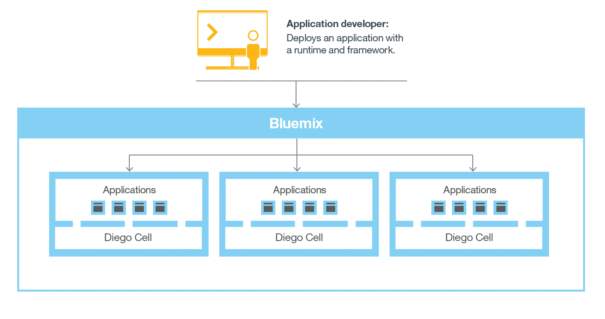

---


copyright:
  years: 2016, 2017
lastupdated: "2017-03-20"

---

{:shortdesc: .shortdesc}
{:new_window: target="_blank"}

# How Bluemix Cloud Foundry works
{: #howwork}

When you deploy an app to {{site.data.keyword.Bluemix_notm}} Cloud Foundry, you must configure {{site.data.keyword.Bluemix_notm}} with enough information to support the app.

* For a mobile app, {{site.data.keyword.Bluemix_notm}} contains an artifact that represents the mobile app's back end, such as the services that the mobile app uses to communicate with a server.
* For a web app, you must ensure that information about the runtime and framework is communicated to {{site.data.keyword.Bluemix_notm}}, so that {{site.data.keyword.Bluemix_notm}} can set up the appropriate execution environment to run the app.

Each execution environment, including both mobile and web, is isolated from the execution environment of other apps. The execution environments are isolated even though these apps are on the same physical machine. The following figure shows the basic flow of how {{site.data.keyword.Bluemix_notm}} Cloud Foundry manages the deployment of apps:



Figure 3. Deploying an app

When you create an app and deploy it to {{site.data.keyword.Bluemix_notm}} Cloud Foundry, the {{site.data.keyword.Bluemix_notm}} environment determines an appropriate virtual server to send the app, or the artifacts that the app represents, to. For a mobile app, a mobile back-end projection is created on {{site.data.keyword.Bluemix_notm}}. Any code for the mobile app running in the cloud eventually runs in the {{site.data.keyword.Bluemix_notm}} environment. For a web app, the code running in the cloud is the app itself that the developer deploys to {{site.data.keyword.Bluemix_notm}}. The determination of the virtual server is based on several factors, including:

* The load already on the machine
* Runtimes or frameworks supported by that virtual server.

After a virtual server is chosen, an application manager on each virtual server installs the appropriate framework and runtime for the app. Then, the app can be deployed into that framework. When the deployment completes, the application artifacts are started.

The following figure shows the structure of a virtual server, also known as Droplet execution agent (DEA), that has multiple apps deployed to it:


Figure 4. Design of a virtual server

In each virtual server, an application manager communicates with the rest of the {{site.data.keyword.Bluemix_notm}} infrastructure, and manages the apps that are deployed to this virtual server. Each virtual server has containers to separate and protect apps. In each container, {{site.data.keyword.Bluemix_notm}} installs the appropriate framework and runtime that are required for each app.

When the app is deployed, if it has a web interface (as for a Java web app), or other REST-based services (such as mobile services exposed publicly to the mobile app), users of the app can communicate with it by using normal HTTP requests.


Figure 5. Invoking a {{site.data.keyword.Bluemix_notm}} app

Each app can have one or more URLs associated with it, but they must all point to the {{site.data.keyword.Bluemix_notm}} endpoint. When a request comes in, {{site.data.keyword.Bluemix_notm}} examines the request, determines which app it is intended for, then selects an instance of the app to receive the request.


## {{site.data.keyword.Bluemix_notm}} Cloud Foundry architecture
{: #architecture}

In general, you don't have to worry about the operating system and infrastructure layers when running apps on {{site.data.keyword.Bluemix_notm}} in Cloud Foundry. Layers such as root filesystems and middleware components are abstracted so that you can focus on your application code. However, you can learn more about these layers if you need specifics on where your app is running.

See [Viewing {{site.data.keyword.Bluemix_notm}} infrastructure layers](/docs/manageapps/infra.html#viewinfra) for details.

As a developer, you can interact with the {{site.data.keyword.Bluemix_notm}} infrastructure by using a browser-based user interface. You can also use a Cloud Foundry command line interface, called cf, to deploy web apps.

Clients--which can be mobile apps, apps that run externally, apps that are built on {{site.data.keyword.Bluemix_notm}}, or developers that are using browsers--interact with the {{site.data.keyword.Bluemix_notm}}-hosted apps. Clients use REST or HTTP APIs to route requests through {{site.data.keyword.Bluemix_notm}} to one of the app instances or the composite services.

The following figure shows the high-level {{site.data.keyword.Bluemix_notm}} Cloud Foundry architecture.


Figure 1. {{site.data.keyword.Bluemix_notm}} Cloud Foundry architecture

You can deploy your apps to different {{site.data.keyword.Bluemix_notm}} regions, for latency or security considerations. You can choose to deploy either to one region or across multiple regions.


Figure 2. Multi-region application deployment


## Regions
{: #ov_intro_reg}

A {{site.data.keyword.Bluemix_notm}} region is a defined geographical territory that you can deploy your apps to. You can create apps and service instances in different regions with the same {{site.data.keyword.Bluemix_notm}} infrastructure for application management and the same usage details view for billing. You can select the region that is nearest to your customers and deploy your apps to this region to get low application latency. You can also select the region where you want to keep the application data to address security issues. When you build apps in multiple regions, if one region becomes unavailable, the apps that are in the other regions continue to run. Your resource allowance is the same for each region that you use.

If you use the {{site.data.keyword.Bluemix_notm}} user interface, you can switch to a different region to work with the spaces in that region. Click the user account preferences link, expand the **Region** selector, then select the region you require from the list.

If you use the cf command line interface, to connect to the {{site.data.keyword.Bluemix_notm}} region that you want to work with, use the cf api command and specify the API endpoint of the region. For example, enter the following command to connect to {{site.data.keyword.Bluemix_notm}} Europe United Kingdom region:

```
cf api https://api.eu-gb.{{site.data.keyword.Bluemix_notm}}.net
```

A unique prefix is assigned to each region. {{site.data.keyword.Bluemix_notm}} provides the following regions and region prefixes.

<!-- PRODUCTION ONLY: Ensure that URLs are production URLs, not stage1-->

| **Region name** | **Geographic location** | **Region prefix** | **cf API endpoint** | **UI console** |
|-----------------|-------------------------|-------------------|---------------------|----------------|
| US South region | Dallas, US | ng | api.ng.bluemix.net | console.ng.bluemix.net |
| United Kingdom region | London, England | eu-gb | api.eu-gb.bluemix.net | console.eu-gb.bluemix.net |
| Sydney region | Sydney, Australia | au-syd | api.au-syd.bluemix.net | console.au-syd.bluemix.net |
| Germany region | Frankfurt, Germany | eu-de | api.eu-de.bluemix.net | console.eu-de.bluemix.net |
{: caption="Table 1. {{site.data.keyword.Bluemix_notm}} region list" caption-side="top"}


## {{site.data.keyword.Bluemix_notm}} resilience
{: #resiliency}

{{site.data.keyword.Bluemix_notm}} is designed to host scalable resilient apps and application artifacts that can scale to meet your needs, remain highly available, and be quick to recover from problems. {{site.data.keyword.Bluemix_notm}} separates components that track the state of interactions (stateful) from components that do not (stateless). This separation allows {{site.data.keyword.Bluemix_notm}} to move apps flexibly as needed to achieve scalability and resilience.

You can have one or more instances running for your app. For multiple instances of a single app, the app is uploaded only once. However, {{site.data.keyword.Bluemix_notm}} deploys the requested number of instances of the app, and distributes them across as many virtual servers as possible.

You must save all persistent data in a stateful data store that is outside of your app, such as on one of the data store services that {{site.data.keyword.Bluemix_notm}} provides. Because anything cached in memory or on disk might not be available even after a restart, you can use the memory space or file system of a single {{site.data.keyword.Bluemix_notm}} instance as a brief single-transaction cache. With a single instance setup, the request to your app might be interrupted because of the stateless nature of {{site.data.keyword.Bluemix_notm}}. A best practice is to use at least three instances for each app to ensure its availability.

All {{site.data.keyword.Bluemix_notm}} infrastructure, Cloud Foundry components, and {{site.data.keyword.IBM_notm}}-specific management components are highly available. Multiple instances of the infrastructure are used to balance the load.

## Integration with systems of record
{: #sor}

{{site.data.keyword.Bluemix_notm}} can help developers by connecting two broad categories of systems in a cloud environment:

* *Systems of record* include apps and databases that store business records and automate standardized processes.
* *Systems of engagement* are capabilities that expand the usefulness of systems of record and make them more engaging to users.

By integrating a system of record with the app that you create in {{site.data.keyword.Bluemix_notm}}, you can perform the following actions:

 * Enable secure communication between the app and the back-end database by downloading and installing a secure connector on premise.
 * Invoke a database in a secure way.
 * Create APIs from integration flows with databases and back-end systems, such as customer relationship management system.
 * Expose only the schemas and tables that you want to be exposed to the app.
 * As a {{site.data.keyword.Bluemix_notm}} organization manager, publish an API as a private service that is visible only to your organization members.

To integrate a system of record with the app that you create in {{site.data.keyword.Bluemix_notm}}, use the Cloud Integration service. By using the Cloud Integration service, you can create a Cloud Integration API and publish the API as a private service for your organization.

<dl>
<dt>Cloud Integration API</dt>
    <dd>A Cloud Integration API provides secured access to the systems of record that reside behind a firewall through web APIs. When you create the Cloud Integration API, you choose the resource that you want to access through the web API, specify the operations that are permitted, and include SDKs and samples to access the API. For more information about how to create a Cloud Integration API, see [Getting started with Cloud Integration](/docs/services/CloudIntegration/CldInt_GetStart.html).</dd>
<dt>Private service</dt>
    <dd>A private service consists of a Cloud Integration API, SDKs, and entitlement policies. The private service might also  contain documentation or other items from the service provider. Only the organization manager can publish a Cloud Integration API as a private service. To see the private services that are available to you, select the Private checkbox in the {{site.data.keyword.Bluemix_notm}} catalog. You can select and bind a private service to an app without connecting to the Cloud Integration service. You bind private services to your app in the same way as you do for other {{site.data.keyword.Bluemix_notm}} services. For information about how to publish an API as a private service, see Publishing an API as a private service.</dd>
</dl>

### Scenario: Creating a rich mobile app to connect with your system of record
{: #scenario}

{{site.data.keyword.Bluemix_notm}} provides a platform where you can integrate your mobile app, cloud services, and enterprise systems of record to provide an app that interacts with your on-premises data.

For example, you can build a mobile app to interact with your customer relationship management system that resides on-premises behind a firewall. You can invoke the system of record in a secure way and leverage the mobile services in {{site.data.keyword.Bluemix_notm}} so that you can build a rich mobile app.

First, your integration developer creates the mobile back-end app in {{site.data.keyword.Bluemix_notm}}. They use the Mobile Cloud boilerplate that uses the Node.js runtime that they are most familiar with.

Then, by using the Cloud Integration service in the {{site.data.keyword.Bluemix_notm}} user interface, they expose an API through a secure connector. Your integration developer downloads the secure connector and installs it on-premises to enable secure communication between his API and the database. After they create the database endpoint, they can look at all the schemas and extract the tables that they want to expose as APIs to the app.

The integration developer adds the Push service to deliver mobile notifications to interested consumers. They also add a business partner service to tweet when a new customer record is created with a Twitter API.

Next, as the application developer, you can log in to {{site.data.keyword.Bluemix_notm}}, download the Android development toolkit, and develop code that invokes the APIs that your integration developer created. You can develop a mobile app that enables users to enter their information on their mobile device. The mobile app then creates a customer record in the customer management system. When the record is created, the app pushes a notification to a mobile device and initiates a tweet about the new record.
