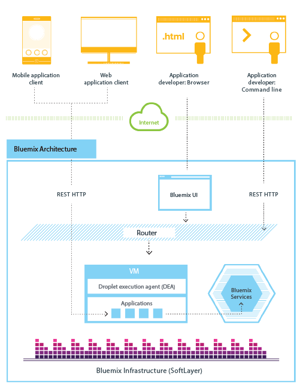
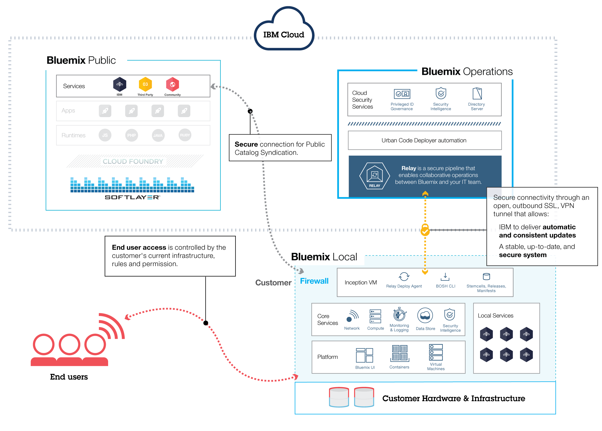

---

 

copyright:

  years: 2014, 2016

 

---

{:shortdesc: .shortdesc} 
{:new_window: target="_blank"}

# {{site.data.keyword.Bluemix_notm}} overview
{: #overview}

*Last updated: 9 May 2016*

{{site.data.keyword.Bluemix}} is the {{site.data.keyword.IBM}} open cloud platform that provides mobile and web developers access to {{site.data.keyword.IBM_notm}} software for integration, security, transaction, and other key functions, as well as software from business partners.
{:shortdesc}

Built on [Cloud Foundry](https://www.cloudfoundry.org/){: new_window} open source technology, {{site.data.keyword.Bluemix_notm}} makes application development easier with Platform as a Service (PaaS). {{site.data.keyword.Bluemix_notm}} also provides pre-built Mobile Backend as a Service (MBaaS) capabilities. The goal is to simplify the delivery of an app by providing services that are ready for immediate use and hosting capabilities to enable internet scale development.

{{site.data.keyword.Bluemix_notm}} also has cloud deployments that fit your needs. Whether you are a small business that plans to scale, or a large enterprise that requires additional isolation, you can develop in a cloud without borders, where you can connect your dedicated services to the public {{site.data.keyword.Bluemix_notm}} services available from {{site.data.keyword.IBM_notm}} and third-party providers. All service instances are managed by {{site.data.keyword.IBM_notm}}. You'll get one bill for only what you choose to use.

With the broad set of services and runtimes in {{site.data.keyword.Bluemix_notm}}, the developer gains control and flexibility, and has access to various data options, from predictive analytics to big data.

{{site.data.keyword.Bluemix_notm}} provides the following features:

- A range of services that enable you to build and extend web and mobile apps fast.
- Processing power for you to deliver application changes continuously.
- Fit-for-purpose programming models and services.
- Manageability of services and apps.
- Optimized and elastic workloads.
- Continuous availability.

{{site.data.keyword.Bluemix_notm}} abstracts and hides most of the complexities that are associated with hosting and managing cloud-based apps. As an application developer, you can focus on developing your app without having to manage the infrastructure that is required to host it. For both mobile and web apps, you can use the pre-built services that are provided by {{site.data.keyword.Bluemix_notm}}. You can upload your web app to {{site.data.keyword.Bluemix_notm}} and indicate how many instances that you want running. After your apps are deployed, you can easily scale them up or down when the usage or load of the apps change.

You can use {{site.data.keyword.Bluemix_notm}} to quickly develop apps in the most popular programming languages. You can develop mobile apps in iOS, Android, and HTML with JavaScript. For web apps, you can use languages such as Ruby, PHP, Java&trade;, Go, and Python. You can also migrate existing apps to {{site.data.keyword.Bluemix_notm}} and use the runtimes that {{site.data.keyword.Bluemix_notm}} provides to run your apps.

{{site.data.keyword.Bluemix_notm}} also provides middleware services for your apps to use. {{site.data.keyword.Bluemix_notm}} acts on the app's behalf when it provisions new service instances, and then binds those services to the app. Your app can perform its real job, leaving the management of the services to the infrastructure.

In general, you don't have to worry about the operating system and infrastructure layers when running apps on {{site.data.keyword.Bluemix_notm}}. Layers such as root filesystems and middleware components are abstracted so that you can focus on your application code. However, you can learn more about these layers if you need specifics on where your app is running. See [Viewing {{site.data.keyword.Bluemix_notm}} infrastructure layers](../cli/vcapsvc.html#viewinfra) for details. 

## {{site.data.keyword.Bluemix_notm}} architecture
{: #ov_arch}

With {{site.data.keyword.Bluemix_notm}}, you can access the public {{site.data.keyword.Bluemix_notm}} platform, set up a dedicated {{site.data.keyword.Bluemix_notm}} platform, or use both.

### {{site.data.keyword.Bluemix_notm}} Public
{: #public}

At its core, {{site.data.keyword.Bluemix_notm}} is an environment for you to develop apps and use services that provide ready-to-use functions. {{site.data.keyword.Bluemix_notm}} also provides an environment to host application artifacts that run on an application server such as Liberty. By using SoftLayer, {{site.data.keyword.Bluemix_notm}} deploys virtual containers that host each deployed app. In this environment, the app can use pre-built services (including third-party services) to make app assembly easy.

As a developer, you can interact with the {{site.data.keyword.Bluemix_notm}} infrastructure by using a browser-based user interface. You can also use a Cloud Foundry command line interface, called cf, to deploy web apps.

Clients---which can be mobile apps, apps that run externally, apps that are built on {{site.data.keyword.Bluemix_notm}}, or developers that are using browsers---interact with the {{site.data.keyword.Bluemix_notm}}-hosted apps. Clients use REST or HTTP APIs to route requests through {{site.data.keyword.Bluemix_notm}} to one of the app instances or the composite services.

The following figure shows the high-level {{site.data.keyword.Bluemix_notm}} architecture.



*Figure 1. {{site.data.keyword.Bluemix_notm}} architecture*

You can deploy your apps to different {{site.data.keyword.Bluemix_notm}} regions, for latency or security considerations. You can choose to deploy either to one region or across multiple regions. For more information, see [Regions](#ov_intro__reg).


*Figure 2. Multi-region application deployment*

### {{site.data.keyword.Bluemix_notm}} Dedicated
{: #dedicated}

{{site.data.keyword.Bluemix_notm}} Dedicated is your own exclusive SoftLayer environment that’s securely connected to both the public {{site.data.keyword.Bluemix_notm}} and your own network. {{site.data.keyword.Bluemix_notm}} Dedicated sits on your network through a VPN or a direct network connection. Your single-tenant hardware can be set up in any SoftLayer data center around the world. {{site.data.keyword.IBM_notm}} manages the dedicated platform and dedicated services, so you can focus on building custom apps. In addition, {{site.data.keyword.IBM_notm}} performs all maintenance to dedicated instances during a maintenance window selected by you.

{{site.data.keyword.IBM_notm}} has several services that are available in your dedicated environment, but you can connect to all public services. All runtimes are available in the dedicated environment.
All dedicated deployments of {{site.data.keyword.Bluemix_notm}} include the following benefits and features at no additional cost: VPN, private VLAN, firewall, connectivity with your LDAP, ability to leverage existing on-premises databases and apps, 24/7 on-site security, dedicated hardware, and standard support. 


*Figure 3. {{site.data.keyword.Bluemix_notm}} Dedicated*

### {{site.data.keyword.Bluemix_notm}} Local
{: #local}

{{site.data.keyword.Bluemix_notm}} Local is your own {{site.data.keyword.Bluemix_notm}} instance that is deployed in your data center, behind the company firewall. With {{site.data.keyword.Bluemix_notm}} Local, you can stay securely connected and in sync with {{site.data.keyword.Bluemix_notm}} Public.

{{site.data.keyword.Bluemix_notm}} Local includes a private, syndicated catalog that displays the local services that are available exclusively to you. It also includes services that are syndicated from and available for your use from {{site.data.keyword.Bluemix_notm}} Public. All runtimes are available in the local environment. Local deployments of {{site.data.keyword.Bluemix_notm}} include the following benefits and features at no additional cost: relay management technology, connectivity with your LDAP, ability to leverage existing on-premises databases and apps, and standard support.

IBM uses relay technology to securely monitor and maintain your environment, so that you can keep focus on the business. Relay is a delivery capability included with {{site.data.keyword.Bluemix_notm}} Local that enables IBM to automatically and consistently deliver updates, so that you always have an up-to-date, stable, and secure system. Relay achieves connectivity through an open, outbound SSL, VPN tunnel that originates from the inception virtual machine. Through this tunnel, IBM serves and maintains the platform, compute resources, and services for your instance. See [{{site.data.keyword.Bluemix_notm}} Local](../local/index.html#local).



*Figure 4. {{site.data.keyword.Bluemix_notm}} Local*

The inception virtual machine runs in a network behind your customer firewall in a network that has outbound connectivity to the IBM operations center through Relay. The {{site.data.keyword.Bluemix_notm}} platform components and core services run in a private, isolated virtual local area network (VLAN). {{site.data.keyword.Bluemix_notm}} Local uses a VLAN for the private subnet. Using a private subnet rather than a public VLAN is more secure and can help avoid routing issues.

DataPower appliances provide access to {{site.data.keyword.Bluemix_notm}} application domains. These appliances connect to the network that is accessible  from your intranet. Users who are deploying apps and services get access from the network that is accessible from your intranet. You must provide seven IP addresses that have outbound internet access. DataPower appliances route from these customer IP addresses to the isolated {{site.data.keyword.Bluemix_notm}} deployment. For information about the network specifications and infrastructure requirements, see [{{site.data.keyword.Bluemix_notm}} Local infrastructure requirements](../local/index.html#localinfra).

### How {{site.data.keyword.Bluemix_notm}} works
{: #howwork}

When you deploy an app to {{site.data.keyword.Bluemix_notm}}, you must configure {{site.data.keyword.Bluemix_notm}} with enough information to support the app.

* For a mobile app, {{site.data.keyword.Bluemix_notm}} contains an artifact that represents the mobile app's back end, such as the services that are used by the mobile app to communicate with a server.
* For a web app, you must ensure that information about the proper runtime and framework is communicated to {{site.data.keyword.Bluemix_notm}}, so that it can set up the proper execution environment to run the app.

Each execution environment, including both mobile and web, is isolated from the execution environment of other apps. The execution environments are isolated even though these apps are on the same physical machine. The following figure shows the basic flow of how {{site.data.keyword.Bluemix_notm}} manages the deployment of apps: 


*Figure 5. Deploying an app*

When you create an app and deploy it to {{site.data.keyword.Bluemix_notm}}, the {{site.data.keyword.Bluemix_notm}} environment determines an appropriate virtual machine (VM) to which the app or artifacts that the app represents is sent. For a mobile app, a mobile back-end projection is created on {{site.data.keyword.Bluemix_notm}}. Any code for the mobile app running in the cloud eventually runs in the {{site.data.keyword.Bluemix_notm}} environment. For a web app, the code running in the cloud is the app itself that the developer deploys to {{site.data.keyword.Bluemix_notm}}. The determination of the VM is based on several factors, including:

* The load already on the machine
* Runtimes or frameworks supported by that VM.

After a VM is chosen, an application manager on each VM installs the proper framework and runtime for the app. Then the app can be deployed into that framework. When the deployment is completed, the application artifacts are started.

The following figure shows the structure of a VM, also known as Droplet execution agent (DEA), that has multiple apps deployed to it: 


*Figure 6. Design of a VM*

In each VM, an application manager communicates with the rest of the {{site.data.keyword.Bluemix_notm}} infrastructure, and manages the apps that are deployed to this VM. Each VM has containers to separate and protect apps. In each container, {{site.data.keyword.Bluemix_notm}} installs the appropriate framework and runtime that are required for each app.

When the app is deployed, if it has a web interface (as for a Java web app), or other REST-based services (such as mobile services exposed publicly to the mobile app), users of the app can communicate with it by using normal HTTP requests.


*Figure 7. Invoking a {{site.data.keyword.Bluemix_notm}} app*

Each app can have one or more URLs associated with it, but all of them must point to the {{site.data.keyword.Bluemix_notm}} endpoint. When a request comes in, {{site.data.keyword.Bluemix_notm}} examines the request, determines which app it is intended for, and then selects one of the instances of the app to receive the request. 

### {{site.data.keyword.Bluemix_notm}} resiliency
{: #resiliency}

{{site.data.keyword.Bluemix_notm}} is designed to host scalable, resilient apps and application artifacts that can both scale to meet your needs, and remain highly available and quick to recover from problems. {{site.data.keyword.Bluemix_notm}} separates those components that track the state of interactions (stateful) from those that do not (stateless). This separation allows {{site.data.keyword.Bluemix_notm}} to move apps flexibly as needed to achieve scalability and resiliency.

You can have one or more instances running for your app. When you have multiple instances for one app, the app is uploaded only once. However, {{site.data.keyword.Bluemix_notm}} deploys the number of instances of the app requested, and distributes them across as many VMs as possible.

You must save all persistent data in a stateful data store that is outside of your app, such as on one of the data store services that are provided by {{site.data.keyword.Bluemix_notm}}. Because anything cached in memory or on disk might not be available even after a restart, you can use the memory space or filesystem of a single {{site.data.keyword.Bluemix_notm}} instance as a brief, single-transaction cache. With a single instance setup, the request to your app might be interrupted because of the stateless nature of {{site.data.keyword.Bluemix_notm}}. A best practice is to use at least three instances for each app to ensure the availability of your app.

All {{site.data.keyword.Bluemix_notm}} infrastructure, Cloud Foundry components, and {{site.data.keyword.IBM_notm}}-specific management components are highly available. Multiple instances of the infrastructure are used to balance the load.

## {{site.data.keyword.Bluemix_notm}} concepts
{: #ov_intro}

{{site.data.keyword.Bluemix_notm}} consists of apps, services, buildpacks, and other components. You can deploy apps to different {{site.data.keyword.Bluemix_notm}} regions by using one {{site.data.keyword.IBM_notm}} ID.

### Regions
{: #ov_intro__reg}

A {{site.data.keyword.Bluemix_notm}} region is a defined geographical territory that you can deploy your apps to. You can create apps and service instances in different regions with the same {{site.data.keyword.Bluemix_notm}} infrastructure for application management and the same usage details view for billing. You can select the region that is nearest to your customers and deploy your apps to this region to get low application latency. You can also select the region where you want to keep the application data to address security issues. When you build apps in multiple regions, if one region goes down, the apps that are in the other regions continue to run. Your resource allowance is the same for each region that you use.

If you are using the {{site.data.keyword.Bluemix_notm}} user interface, you can switch to a different region to work with the spaces in that region.

If you are using the cf command line interface, you must connect to the {{site.data.keyword.Bluemix_notm}} region that you want to work with by using the cf api command and specifying the API endpoint of the region. For example, enter the following command to connect to {{site.data.keyword.Bluemix_notm}} Europe United Kingdom region:

```
cf api https://api.eu-gb.{{site.data.keyword.Bluemix_notm}}.net
```

If you are using the Eclipse tools, you must connect to the {{site.data.keyword.Bluemix_notm}} region that you want to work with by creating a {{site.data.keyword.Bluemix_notm}} server and specifying the API endpoint of the region. For more information about using the Eclipse tools, see [Deploying apps with {{site.data.keyword.IBM_notm}} Eclipse Tools for {{site.data.keyword.Bluemix_notm}}](../manageapps/eclipsetools/eclipsetools.html#toolsinstall).

A unique prefix is assigned to each region. {{site.data.keyword.Bluemix_notm}} provides the following regions and region prefixes. 

<!-- PRODUCTION ONLY: Ensure that URLs are production URLs, not stage1-->

| **Region name** | **Geographic location** | **Region prefix** | **cf API endpoint** | **UI console** |       
|-----------------|-------------------------|-------------------|---------------------|----------------|
| US South region | Dallas, US | ng | api.ng.bluemix.net | console.ng.bluemix.net |
| United Kingdom region | London, England | eu-gb | api.eu-gb.bluemix.net | console.eu-gb.bluemix.net |
| Sydney region | Sydney, Australia | au-syd | api.au-syd.bluemix.net | console.au-syd.bluemix.net |


*Table 1. {{site.data.keyword.Bluemix_notm}} region list*

### Infrastructure
{: #infrastructure}

{{site.data.keyword.Bluemix_notm}} offers three ways for you to run your code: Cloud Foundry, {{site.data.keyword.IBM_notm}} Containers, and Virtual Machines. The {{site.data.keyword.IBM_notm}} Containers and Virtual Machines are available in only the US South and Europe United Kingdom region. You can pick the right infrastructure for deploying your apps. 

<dl>
<dt>Cloud Foundry</dt>
    <dd>Apps running in the Cloud Foundry infrastructure work with existing Cloud Foundry apps and can bind to any of the services available in the {{site.data.keyword.Bluemix_notm}} Catalog. With this infrastructure, you develop and manage your application code and {{site.data.keyword.Bluemix_notm}} takes care of the management and maintenance of the infrastructure that powers those apps.</dd>
<dt>{{site.data.keyword.IBM_notm}} Containers</dt>
    <dd>With the {{site.data.keyword.IBM_notm}} Containers infrastructure, you can run your web app anywhere that supports container deployment. A *container* is an object that holds everything that is needed for an app to run. This infrastructure includes a private registry for your trusted images, so that you can upload, store, and retrieve them. You can then make those images available in {{site.data.keyword.Bluemix_notm}} and manage your containers in the platform. The {{site.data.keyword.IBM_notm}} Containers infrastructure scales both horizontally and vertically. You can use all of the images that are available in the public Docker Hub and use the docker API and command line interface to manage your containers on {{site.data.keyword.Bluemix_notm}}. {{site.data.keyword.IBM_notm}} also provides some public images in the Containers Registry that you can use and extend.

    {{site.data.keyword.IBM_notm}} Containers are used to run Docker containers in a hosted cloud environment. Docker adds an engine that deploys an app to the virtual environment that you use for running your containers. Docker also provides an environment that you can use to run your code. When you're ready, it provides the means by which you can transfer the code from your development environment, to your test environment, and then to your production environment.

    To find out more about {{site.data.keyword.IBM_notm}} Containers, see [{{site.data.keyword.IBM_notm}} Containers](../containers/container_index.html).</dd>
<dt>{{site.data.keyword.IBM_notm}} {{site.data.keyword.virtualmachinesshort}} (BETA)</dt>
    <dd><p>{{site.data.keyword.IBM_notm}} {{site.data.keyword.virtualmachinesshort}} is a hosted cloud environment, part of {{site.data.keyword.IBM_notm}} {{site.data.keyword.Bluemix_notm}}, that you can use to build, run, manage, and monitor your applications, while maintaining the most control over your apps and the middleware on which they run. Use {{site.data.keyword.virtualmachinesshort}} to isolate your business solutions, especially when you deploy your apps in a public cloud. </p>
<p>    
You can run and manage virtual servers in public and private (on-premises) clouds that use OpenStack software. You can create, launch, and manage your virtual servers by using either the {{site.data.keyword.Bluemix_notm}} UI or the OpenStackClient (OSC) client. You can use virtual server images that are provided by {{site.data.keyword.IBM_notm}}, or create virtual servers from your own custom images. You can use {{site.data.keyword.IBM_notm}} {{site.data.keyword.Bluemix_notm}} capabilities to remove most of the complexities that are associated with hosting and managing cloud-based applications such as logging, auto-scaling, and monitoring. You can use OpenStack services and {{site.data.keyword.Bluemix_notm}} services together to build and run hybrid applications. You can provision infrastructure resources as needed based on operational policies and workload demand. </p>
<p>
To find out more about {{site.data.keyword.IBM_notm}} {{site.data.keyword.virtualmachinesshort}}, see [{{site.data.keyword.IBM_notm}} {{site.data.keyword.virtualmachinesshort}}](../virtualmachines/vm_index.html).</p> </dd>
</dl>

### Applications
{: #applications}

In {{site.data.keyword.Bluemix_notm}}, an application, or *app*, represents the artifact that a developer is building. The application lifecycle in {{site.data.keyword.Bluemix_notm}} and Cloud Foundry are identical, regardless of how you push the app to the {{site.data.keyword.Bluemix_notm}}. For more information, see [How Applications Are Staged](https://docs.cloudfoundry.org/concepts/how-applications-are-staged.html).

<dl>
<dt>Mobile apps</dt>
    <dd>Mobile apps run outside of the {{site.data.keyword.Bluemix_notm}} environment and use services that the mobile apps are exposed to. These services typically act in concert, and represent the back-end projection of that app. {{site.data.keyword.Bluemix_notm}} can also host app code that the developer would rather run on a back-end server in a container-based environment.</dd>
<dt>Web apps</dt>
    <dd>Web apps consist of all the code that is required to be run or referenced at run time. Web apps are uploaded to {{site.data.keyword.Bluemix_notm}} to host the app.</dd>
</dl>

For languages such as Java, where the source code is compiled into runtime binary files, only the binary files are required to be uploaded.

### Services
{: #services}

A *service* is a cloud extension that is hosted by {{site.data.keyword.Bluemix_notm}}. The service provides functionality that is ready-for-use by the app's running code. The predefined services that are provided by {{site.data.keyword.Bluemix_notm}} include database, messaging, push notifications for mobile apps, and elastic caching for web apps.

You can create your own services in {{site.data.keyword.Bluemix_notm}}. These services can vary in complexity. They can be simple utilities, such as the functions you might see in a runtime library. Alternatively, they can be complex business logic that you might see in a business process modeling service or a database.

{{site.data.keyword.Bluemix_notm}} simplifies the use of services by provisioning new instances of the service, and binding those service instances to your app. The management of the service is handled automatically by {{site.data.keyword.Bluemix_notm}}. For all available services in {{site.data.keyword.Bluemix_notm}}, see the catalog in the {{site.data.keyword.Bluemix_notm}} user interface.

### Starters
{: #starters}

A *starter* is a template that includes predefined services and app code that is configured with a particular buildpack. There are two types of starters: boilerplates and runtimes. A starter might be app code that is written in a specific programming language, or a combination of app code and a set of services.

### Boilerplates
{: #boilerplates}

In {{site.data.keyword.Bluemix_notm}}, a *boilerplate* contains an app and its associated runtime environment and predefined services for a particular domain. You can use a boilerplate to quickly get up and running. For example, you can select the Mobile Cloud boilerplate to host mobile and web apps and accelerate development time of server-side scripts by using the mobile app template and SDK.

### Runtimes
{: #runtimes}

A *runtime* is the set of resources that is used to run an app. {{site.data.keyword.Bluemix_notm}} provides runtime environments as containers for different types of apps. The runtime environments are integrated as buildpacks into {{site.data.keyword.Bluemix_notm}}, and are automatically configured for use.

### Buildpacks
{: #buildpacks}

A buildpack is a collection of scripts that prepare your code for execution on the target PaaS. A buildpack gathers the runtime and framework dependencies of an app. Then, it packages them with the app into a droplet that can be deployed to the cloud.

If you do not specify a buildpack when you deploy your app to {{site.data.keyword.Bluemix_notm}}, built-in buildpacks are used by default.

<dl class="dl"><dt class="dt dlterm">Built-in {{site.data.keyword.IBM_notm}} buildpacks</dt>
<dd class="dd"><div class="p">
<!-- begin PRODUCTION ONLY -->
The following list is the built-in buildpacks that
are created by {{site.data.keyword.IBM_notm}}. 
<ul>
<li>Liberty for Java</li>
<li>Node.js</li>
</ul>
<!-- end PRODUCTION ONLY -->
</div>
</div>
</dd>
<dt class="dt dlterm">Built-in community buildpacks</dt>
<dd class="dd"><p class="p">In {{site.data.keyword.Bluemix_notm}},
you can also use built-in buildpacks that are provided by the Cloud
Foundry community. To list built-in community buildpacks run the <span class="keyword cmdname">cf
buildpacks</span> command.</p>
</dd>
<dt class="dt dlterm">External buildpacks</dt>
<dd class="dd"><div class="p">If you cannot find the runtime or framework you want in the
built-in buildpacks that are provided by {{site.data.keyword.Bluemix_notm}},
you can bring an external, existing buildpack to use for your app.
External buildpacks are provided by the Cloud Foundry community for
you to use as your own buildpacks. You specify the buildpack when
you deploy your app by using the <span class="keyword cmdname">cf push</span> command. <div class="note note"><span class="notetitle">Note:</span> External
buildpacks are not supported by {{site.data.keyword.IBM_notm}};
therefore, you might need to contact the Cloud Foundry community for
support.</div>
</div>
</dd>
</dl>


## Integration with systems of record
{: #sor}

{{site.data.keyword.Bluemix_notm}} can help developers by connecting two broad categories of systems in a cloud environment: systems of record and systems of engagement.

*Systems of record* include apps and databases that store business records and automate standardized processes. *Systems of engagement* are capabilities that expand the usefulness of systems of record and make them more engaging to users.
By integrating a system of record with the app that you create in {{site.data.keyword.Bluemix_notm}}, you can perform the following actions:

 * Enable secure communication between the app and the backend database by downloading and installing a secure connector on premise.
 * Invoke a database in a secure way.
 * Create APIs from integration flows with databases and backend systems, such as customer relationship management system.
 * Expose only the schemas and tables that you want to be exposed to the app.
 * As a {{site.data.keyword.Bluemix_notm}} organization manager, publish an API as a private service that is visible only to your organization members.

To integrate a system of record with the app that you create in {{site.data.keyword.Bluemix_notm}}, use the Cloud Integration service. By using the Cloud Integration service, you can create a Cloud Integration API and publish the API as a private service for your organization.

<dl>
<dt>Cloud Integration API</dt>
    <dd>A Cloud Integration API provides secured access to the systems of record that reside behind a firewall through web APIs. When you create the Cloud Integration API, you choose the resource that you want to access through the web API, specify the operations that are permitted, and include SDKs and samples to access the API. For more information about how to create a Cloud Integration API, see [Creating Cloud Integration APIs](../services/CloudIntegration/index.html#cloudint_add_service).</dd>
<dt>Private service</dt>
    <dd>A private service consists of a Cloud Integration API, SDKs, and entitlement policies. In addition, the private service might contain documentation or other items from the service provider. Only the organization manager can publish a Cloud Integration API as a private service. To see the private services that are available to you, select the Private checkbox in the {{site.data.keyword.Bluemix_notm}} catalog. You can select and bind a private service to an app without connecting to the Cloud Integration service. You bind private services to your app in the same way as you do for other {{site.data.keyword.Bluemix_notm}} services. For information about how to publish an API as a private service, see Publishing an API as a private service.</dd>
</dl>

### Scenario: Creating a rich mobile app to connect with your system of record
{: #scenario}

{{site.data.keyword.Bluemix_notm}} provides a platform where you can integrate your mobile app, cloud services, and enterprise systems of record to provide an app that interacts with your on-premises data.

For example, you can build a mobile app to interact with your customer relationship management system that resides on-premises behind a firewall. You can invoke the system of record in a secure way and leverage the mobile services in {{site.data.keyword.Bluemix_notm}} so that you can build a rich mobile app.

First, your integration developer creates the mobile back-end app in {{site.data.keyword.Bluemix_notm}}. He uses the Mobile Cloud boilerplate that uses the Node.js runtime that he is most familiar with.

Then, by using the Cloud Integration service in the {{site.data.keyword.Bluemix_notm}} user interface, he exposes an API through a secure connector. Your integration developer downloads the secure connector and installs it on-premises to enable secure communication between his API and the database. After he creates the database endpoint, he can look at all the schemas and extract the tables that he wants to expose as APIs to the app.

Your integration developer adds the Push service to deliver mobile notifications to interested consumers. He also adds a business partner service to tweet when a new customer record is created with a Twitter API.

Next, as the application developer, you can log in to {{site.data.keyword.Bluemix_notm}}, download the Android development toolkit, and develop code that invokes the APIs that your integration developer created. You can develop a mobile app that enables users to enter their information on their mobile device. The mobile app then creates a customer record in the customer management system. When the record is created, the app pushes a notification to a mobile device and initiates a tweet about the new record.

## National language support for {{site.data.keyword.Bluemix_notm}}
{: #lang}

{{site.data.keyword.Bluemix_notm}} supports national languages other than English. However, not all of the content that is provided with {{site.data.keyword.Bluemix_notm}} is translated.
The following table lists the supported national languages and language codes for {{site.data.keyword.Bluemix_notm}}.

| **National language** | **Language code** |
|-------------------|---------------|
| Brazilian Portuguese | pt_BR |
| English | en |
| French | fr |
| German | de |
| Japanese | ja |
| Korean | ko |
| Italian | it |
| Spanish | es |
| Simplified Chinese | zh_CN |
| Traditional Chinese | zh_TW |

*Table 2. Supported national languages and language codes*

# Related Links
{: #rellinks}

## Related Links
{: #general}

* [{{site.data.keyword.Bluemix_notm}} Prerequisites](https://developer.ibm.com/bluemix/support/#prereqs)
* [What's new in {{site.data.keyword.Bluemix_notm}}](../whatsnew/index.html)
* [{{site.data.keyword.Bluemix_notm}} known issues](https://developer.ibm.com/bluemix/support/#issues)
* [{{site.data.keyword.Bluemix_notm}} glossary](glossary/index.html)
* [{{site.data.keyword.Bluemix_notm}} Pricing Sheet](https://console.{DomainName}/pricing/)
* [{{site.data.keyword.Bluemix_notm}} DevOps Services](https://hub.jazz.net)
* [Cloud Foundry](http://cloudfoundry.org/)
* [SoftLayer, an {{site.data.keyword.IBM_notm}} Company](http://www.softlayer.com/)
