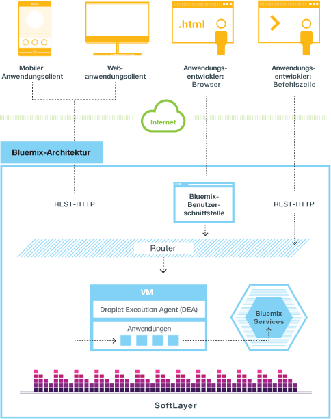
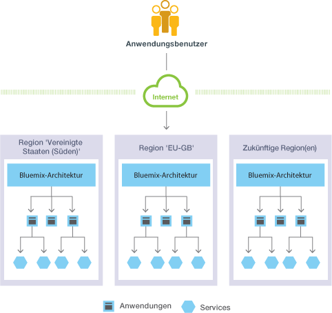
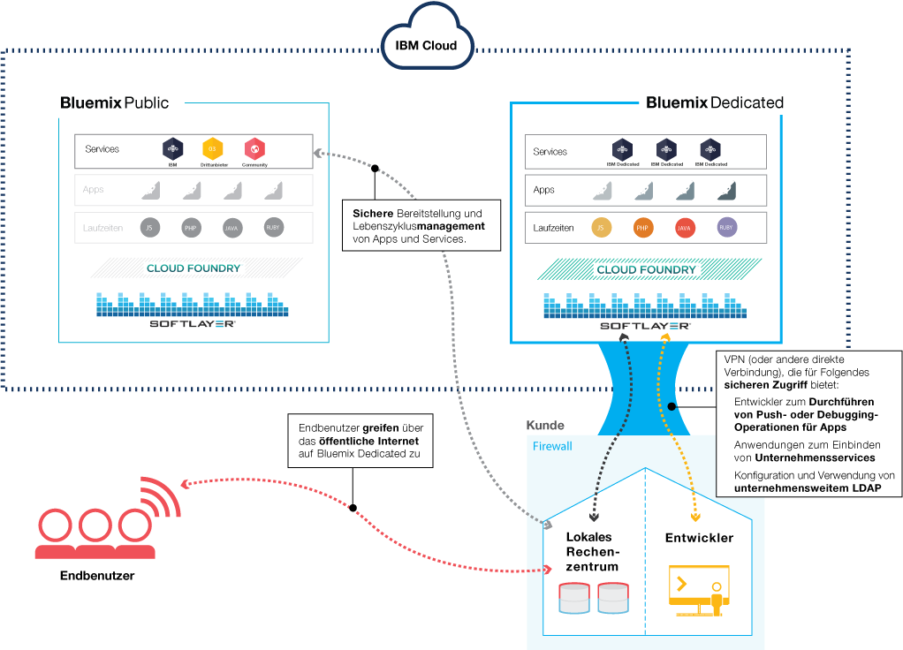
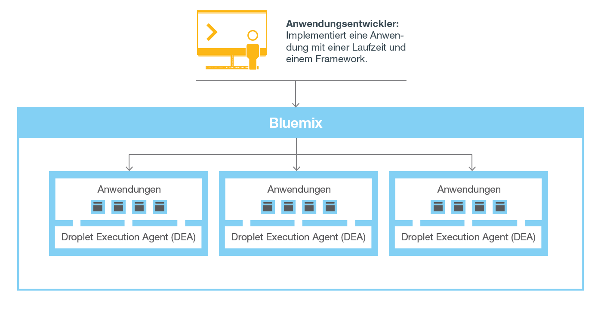
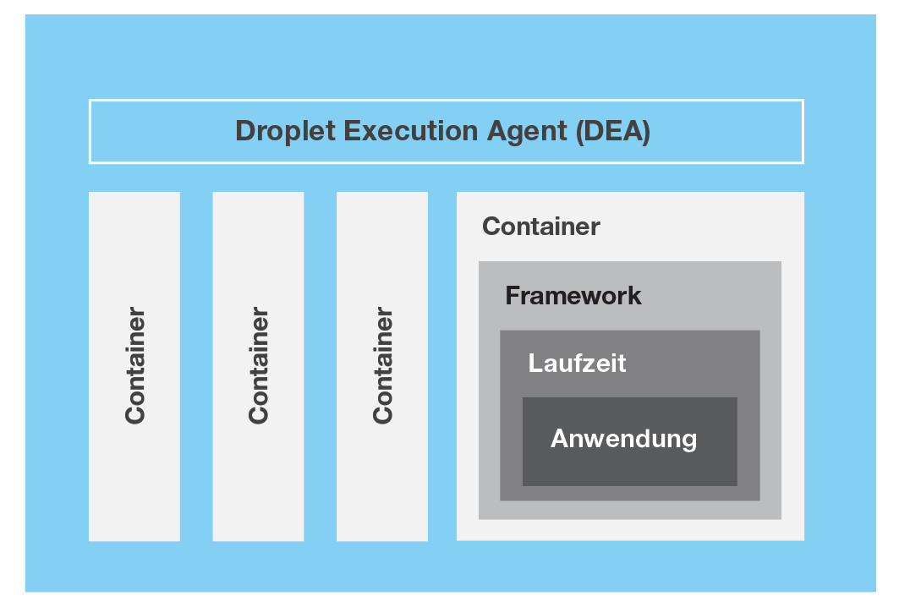
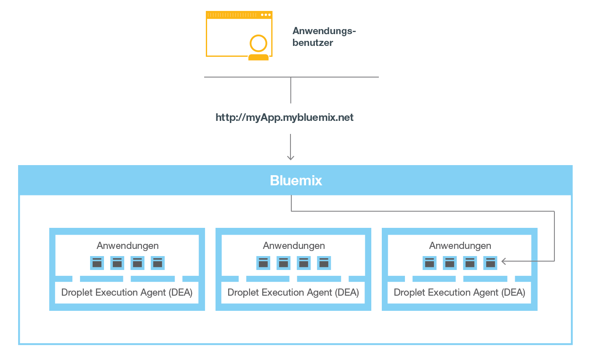

---

 

copyright:

  years: 2014, 2016

 

---

{:shortdesc: .shortdesc} 
{:new_window: target="_blank"}

# Übersicht über {{site.data.keyword.Bluemix_notm}}
{: #overview}

*Letzte Aktualisierung: 9. Mai 2016*

{{site.data.keyword.Bluemix}} ist die offene {{site.data.keyword.IBM}} Cloudplattform, die Entwicklern von mobilen Anwendungen und Webanwendungen Zugriff auf {{site.data.keyword.IBM_notm}} Software für Integration, Sicherheit, Transaktion und andere Schlüsselfunktionen sowie auf Software von Geschäftspartnern zur Verfügung stellt.
{:shortdesc}

Auf der Basis der Open-Source-Technologie von [Cloud
Foundry](https://www.cloudfoundry.org/){: new_window} bietet {{site.data.keyword.Bluemix_notm}} mehr
Steuerungsmöglichkeiten für Anwendungsentwickler, die das Platform as a Service-Angebot (PaaS-Angebot) nutzen. Zudem stellt {{site.data.keyword.Bluemix_notm}} vorgefertigte
Funktionen für Mobile Backend as a Service (MBaaS) bereit. Ziel ist es, die Bereitstellung einer App durch ein Angebot an Services für den sofortigen Gebrauch und an Hosting-Funktionen zu vereinfachen und so eine auf das Internet bezogene Entwicklung zu ermöglichen.

{{site.data.keyword.Bluemix_notm}} bietet darüber hinaus
Cloudbereitstellungen, die Ihren Anforderungen entsprechen. Ob Sie als Kleinunternehmen eine Skalierung
planen oder als Großunternehmen eine zusätzliche Schutzisolierung benötigen, Sie können in einer Cloud praktisch
grenzenlos entwickeln und Ihre dedizierten Services mit den öffentlichen
{{site.data.keyword.Bluemix_notm}}-Services verbinden, die über
{{site.data.keyword.IBM_notm}} und Drittanbieter zur Verfügung gestellt werden. Alle Serviceinstanzen werden
von {{site.data.keyword.IBM_notm}} verwaltet und Sie erhalten nur eine Rechnung über die Leistungen, die Sie in Anspruch genommen haben.

Durch das breite Angebot an Services und Laufzeiten in {{site.data.keyword.Bluemix_notm}} gewinnt der Entwickler mehr Steuerungsmöglichkeiten und Flexibilität. Er erhält Zugang zu verschiedenen Datenoptionen, von Vorhersageanalysen bis hin zu Big Data.

{{site.data.keyword.Bluemix_notm}} stellt die folgenden Funktionen bereit:

- Eine Auswahl von Services, die eine schnelle Erstellung und Erweiterung von mobilen Apps und Web-Apps ermöglichen
- Verarbeitungskapazität, die eine kontinuierliche Bereitstellung von Anwendungsänderungen ermöglicht
- Zweckmäßige Programmiermodelle und Services
- Verwaltungskomfort für Services und Apps
- Optimierte und elastische Workloads
- Kontinuierliche Verfügbarkeit

{{site.data.keyword.Bluemix_notm}} abstrahiert und verbirgt den weitaus größten Teil
der Komplexität, die mit dem Hosten und Verwalten von cloudbasierten Apps verbunden ist. Als Anwendungsentwickler können Sie sich
auf die Entwicklung Ihrer App konzentrieren und müssen sich nicht um die Verwaltung der Infrastruktur kümmern, die für den Betrieb
der App erforderlich ist. Für mobile Apps und Web-Apps können Sie die vordefinierten Services verwenden, die von
{{site.data.keyword.Bluemix_notm}} bereitgestellt werden. Sie können Ihre Web-App in {{site.data.keyword.Bluemix_notm}} hochladen
und angeben, wie viele Instanzen ausgeführt werden sollen. Nach der Bereitstellung Ihrer Apps können Sie sie ohne großen Aufwand
herauf- oder herabskalieren, wenn sich die Nutzung oder die Auslastung der Apps ändert.

{{site.data.keyword.Bluemix_notm}} kann für eine rasche Entwicklung von Apps
in den gängigsten Programmiersprachen genutzt werden. Mobile Apps können Sie in iOS, Android und HTML
mit JavaScript entwickeln. Für Web-Apps können Sie Sprachen wie
Ruby, PHP, Java&trade;, Go und Python verwenden. Darüber hinaus können Sie vorhandene Apps nach {{site.data.keyword.Bluemix_notm}} migrieren und die von {{site.data.keyword.Bluemix_notm}} bereitgestellten Laufzeiten verwenden, um Ihre
Apps auszuführen.

{{site.data.keyword.Bluemix_notm}} stellt auch Middleware-Services für den Gebrauch
durch Ihre Apps bereit. {{site.data.keyword.Bluemix_notm}} agiert beim Bereitstellen
neuer Serviceinstanzen anstelle der App und bindet anschließend diese Services an die App. Auf diese Weise kann die App
ihre eigentlichen Aufgaben erledigen und die Verwaltung der Services der Infrastruktur überlassen.

Im Allgemeinen müssen Sie sich bei der Ausführung von Apps in
{{site.data.keyword.Bluemix_notm}} keine Gedanken über die Betriebssystem- und
Infrastrukturebenen machen. Die Ebenen wie Stammdateisysteme und
Middlewarekomponenten sind so abstrahiert, dass Sie sich auf Ihren Anwendungscode
konzentrieren können. Es gibt jedoch noch weitere Informationen zu diesen Ebenen, wenn Sie
spezielle Angaben dazu benötigen, wo Ihre App ausgeführt wird. Details finden Sie im Abschnitt zum [Anzeigen von {{site.data.keyword.Bluemix_notm}}-Infrastrukturebenen](../cli/vcapsvc.html#viewinfra). 

## {{site.data.keyword.Bluemix_notm}}-Architektur
{: #ov_arch}

Mit {{site.data.keyword.Bluemix_notm}} können Sie auf die öffentliche {{site.data.keyword.Bluemix_notm}}-Plattform zugreifen, eine dedizierte {{site.data.keyword.Bluemix_notm}}-Plattform einrichten oder beide Möglichkeiten nutzen.

### {{site.data.keyword.Bluemix_notm}} öffentlich
{: #public}

Im
Wesentlichen ist {{site.data.keyword.Bluemix_notm}} eine Umgebung, in der Sie
Apps entwickeln und Services nutzen können, die gebrauchsfertige Funktionen bereitstellen. Zudem bietet {{site.data.keyword.Bluemix_notm}} eine Umgebung zum Betreiben von Anwendungsartefakten, die auf Anwendungsservern wie z. B. Liberty ausgeführt werden. Unter
Verwendung von SoftLayer setzt {{site.data.keyword.Bluemix_notm}} virtuelle
Container ein, um die einzelnen bereitgestellten Apps zu hosten. In dieser Umgebung kann die App
vorgefertigte Services (einschließlich Services von Drittanbietern) verwenden und die App-Assemblierung
somit vereinfachen.

Als Entwickler haben Sie die Möglichkeit, über eine browserbasierte Benutzerschnittstelle mit der
{{site.data.keyword.Bluemix_notm}}-Infrastruktur zu interagieren. Zum
Bereitstellen von Web-Apps können Sie außerdem die Cloud
Foundry-Befehlszeilenschnittstelle 'cf' verwenden.

Clients - mobile Apps, extern ausgeführte Apps,
auf {{site.data.keyword.Bluemix_notm}} aufbauende Apps oder auch Entwickler,
die gerade einen Browser verwenden -
können mit den von {{site.data.keyword.Bluemix_notm}} gehosteten
Apps interagieren. Mithilfe von REST- oder HTTP-APIs leiten Clients Anforderungen über
{{site.data.keyword.Bluemix_notm}} an eine der
App-Instanzen oder an die zusammengesetzten Services weiter.

Die folgende Abbildung stellt die allgemeine {{site.data.keyword.Bluemix_notm}}-Architektur dar.



*Abbildung 1. {{site.data.keyword.Bluemix_notm}}-Architektur*

Sie können
Ihre Apps im Hinblick auf Latenz- und Sicherheitsaspekte für unterschiedliche
{{site.data.keyword.Bluemix_notm}}-Regionen
bereitstellen. Eine Bereitstellung
kann entweder in einer Region oder in mehreren Regionen stattfinden. Weitere Informationen finden Sie unter [Regionen](#ov_intro__reg).



*Abbildung 2. Anwendungsbereitstellung in mehreren Regionen*

### {{site.data.keyword.Bluemix_notm}} Dedicated
{: #dedicated}

{{site.data.keyword.Bluemix_notm}} Dedicated
ist Ihre eigene exklusive SoftLayer-Umgebung, die sicher mit der öffentlichen
{{site.data.keyword.Bluemix_notm}}-Plattform und
Ihrem eigenen Netz verbunden ist. Die {{site.data.keyword.Bluemix_notm}} Dedicated
ist über ein VPN (privates VLAN) oder über eine direkte Netzverbindung mit Ihrem Netz verbunden. Ihre Single-Tenant-Hardware kann in einem beliebigen SoftLayer-Rechenzentrum
auf der Welt eingerichtet sein. {{site.data.keyword.IBM_notm}} verwaltet die dedizierte Plattform und dedizierte Services,
sodass Sie sich auf die Erstellung von angepassten Apps konzentrieren können. Darüber hinaus führt {{site.data.keyword.IBM_notm}} alle
Wartungsoperationen an dedizierten Instanzen während eines von Ihnen ausgewählten
Wartungszeitraums durch.

{{site.data.keyword.IBM_notm}} hat verschiedene Services, die in Ihrer dedizierten Umgebung
verfügbar sind, Sie können jedoch eine Verbindung zu allen öffentlichen Services herstellen. Alle Laufzeiten sind in der dedizierten Umgebung verfügbar.
Alle dedizierten Bereitstellungen
von {{site.data.keyword.Bluemix_notm}} beinhalten
die folgenden Leistungen und Funktionen ohne gesonderte Berechnung: VPN, privates VLAN,
Firewall, Konnektivität mit Ihrem LDAP, Möglichkeit zur Nutzung lokal (d. h. am eigenen Standort)
vorhandener Datenbanken und Apps, 24/7-Sicherheit vor Ort, dedizierte Hardware und Standardunterstützung. 



*Abbildung 3. {{site.data.keyword.Bluemix_notm}} Dedicated*

### {{site.data.keyword.Bluemix_notm}} Local
{: #local}

{{site.data.keyword.Bluemix_notm}} Local ist Ihre eigene {{site.data.keyword.Bluemix_notm}}-Instanz, die in Ihrem Rechenzentrum hinter der Firewall des Unternehmens bereitgestellt wird. Mit {{site.data.keyword.Bluemix_notm}} Local ist eine sichere Verbindung zu und eine Synchronisation mit {{site.data.keyword.Bluemix_notm}} Public gegeben.

{{site.data.keyword.Bluemix_notm}} Local umfasst einen privaten, syndizierten Katalog, in dem die lokalen Services angezeigt werden, die ausschließlich Ihnen zur Verfügung stehen. Er umfasst
außerdem Services, die aus {{site.data.keyword.Bluemix_notm}} Public
syndiziert werden und die Sie verwenden können. Alle Laufzeiten sind in der lokalen Umgebung verfügbar. Lokale Bereitstellungen von {{site.data.keyword.Bluemix_notm}} beinhalten
die folgenden Leistungen und Funktionen ohne gesonderte Berechnung: Relay-Management-Technologie, Konnektivität mit Ihrem LDAP, Möglichkeit zur Nutzung lokal (d. h. am eigenen Standort)
vorhandener Datenbanken und Apps und Standardunterstützung.

IBM nutzt die Relay-Technologie für eine sichere Überwachung und Pflege Ihrer Umgebung, damit Sie Ihren Fokus auf das Geschäftliche richten können. Relay ist eine in {{site.data.keyword.Bluemix_notm}} Local integrierte Zustellungsfunktion, mit der IBM automatisch und konsistent Aktualisierungen bereitstellt und Sie somit stets ein aktuelles, stabiles und sicheres System haben. Relay erreicht die Konnektivität mittels eines offenen VPN-Tunnels mit ausgehender SSL, der von der virtuellen Konzeptionsmaschine stammt. Über diesen Tunnel stellt IBM die Plattform, Rechenressourcen und Services für Ihre Instanz bereit und verwaltet sie. Weitere Informationen finden Sie unter [{{site.data.keyword.Bluemix_notm}} Local](../local/index.html#local).


*Abbildung 4. {{site.data.keyword.Bluemix_notm}} Local*

Die virtuelle Konzeptionsmaschine wird in einem Netz hinter Ihrer Kundenfirewall ausgeführt, das eine abgehende Konnektivität zum IBM Operations Center über Relay hat. Die Komponenten der {{site.data.keyword.Bluemix_notm}}-Plattform und die Kernservices werden in einem privaten, isolierten VLAN (virtuelles LAN) ausgeführt. {{site.data.keyword.Bluemix_notm}} Local verwendet ein VLAN für das private Teilnetz. Die Verwendung eines privaten Teilnetzes ist sicherer als ein öffentliches VLAN und kann helfen, Routingprobleme zu vermeiden.

DataPower-Appliances stellen den Zugriff auf {{site.data.keyword.Bluemix_notm}}-Anwendungsdomänen bereit. Diese Appliances stellen eine Verbindung zu dem Netz her, das über Ihr Intranet zugänglich ist. Benutzer, die Apps und Services bereitstellen, erhalten Zugriff über das Netz, das über Ihr Intranet zugänglich ist. Sie müssen sieben IP-Adressen bereitstellen, die einen abgehenden Internetzugriff haben. DataPower-Appliances leiten über diese Kunden-IP-Adressen zu der isolierten {{site.data.keyword.Bluemix_notm}}-Bereitstellung weiter. Informationen zu den Netzspezifikationen und den Infrastrukturanforderungen finden Sie in [{{site.data.keyword.Bluemix_notm}} Local-Infrastrukturanforderungen](../local/index.html#localinfra).

### Funktionsweise von {{site.data.keyword.Bluemix_notm}}
{: #howwork}

Wenn Sie
auf {{site.data.keyword.Bluemix_notm}} eine App bereitstellen, muss
{{site.data.keyword.Bluemix_notm}} mit genügend Informationen
konfiguriert sein, um die App unterstützen zu können.

* Für mobile Apps enthält {{site.data.keyword.Bluemix_notm}} ein
Artefakt, welches das Back-End für die mobilen Apps darstellt, z. B. die Services, die von
den mobilen Apps genutzt werden, um mit einem Server zu kommunizieren.
* Für Web-Apps muss sichergestellt werden, dass {{site.data.keyword.Bluemix_notm}}
Informationen zur geeigneten Laufzeit und zum geeigneten Framework enthält, sodass es die richtige Ausführungsumgebung
einrichten kann, in der die App ausgeführt wird.

Beide Ausführungsumgebungen, die für die mobile App
wie auch die für die Web-App, sind von den Ausführungsumgebungen anderer Apps isoliert. Die Ausführungsumgebungen werden isoliert, obwohl sich diese Apps auf derselben physischen Maschine befinden. Die folgende
Abbildung stellt die grundlegenden Abläufe für die Verwaltung der App-Bereitstellung durch
{{site.data.keyword.Bluemix_notm}} dar: 



*Abbildung 5. App bereitstellen*

Wenn Sie eine App erstellen und auf
{{site.data.keyword.Bluemix_notm}} bereitstellen,
bestimmt die {{site.data.keyword.Bluemix_notm}}-Umgebung
eine geeignete virtuelle Maschine (VM), an die die App oder die Artefakte gesendet werden,
die die App darstellt. Für mobile Apps wird auf {{site.data.keyword.Bluemix_notm}}
eine mobile Back-End-Projektion erstellt. Jeder Code für die in der Cloud ausgeführte mobile Anwendung wird letztendlich in der {{site.data.keyword.Bluemix_notm}}-Umgebung ausgeführt. Für Web-Apps ist der Code, der in der Cloud ausgeführt wird, die App selbst, die der Entwickler
auf {{site.data.keyword.Bluemix_notm}} bereitstellt. Welche virtuelle Maschine dafür ausgesucht wird, basiert auf mehreren Faktoren, wie zum Beispiel:

* Die bestehende Auslastung der Maschine
* Von dieser virtuellen Maschine unterstützte Laufzeiten oder Frameworks

Nachdem eine
virtuelle Maschine ausgesucht wurde, installiert ein Anwendungsmanager auf jeder virtuellen Maschine
das passende Framework und die passende Laufzeit für die App. Anschließend kann die App in diesem
Framework bereitgestellt werden. Sobald die Bereitstellung erfolgt ist, werden die Anwendungsartefakte gestartet.

Die
folgende Abbildung zeigt die Struktur einer virtuellen Maschine, auch als
Droplet Execution Agent (DEA) bezeichnet, auf der mehrere Apps bereitgestellt wurden: 



*Abbildung 6. Entwurf einer virtuellen Maschine*

In jeder virtuellen Maschine kommuniziert
ein Anwendungsmanager mit der übrigen {{site.data.keyword.Bluemix_notm}}-Infrastruktur
und verwaltet die Apps, die auf dieser virtuellen Maschine bereitgestellt sind. Jede virtuelle Maschine
verfügt über Container zum Trennen und Schützen der Apps. In jedem dieser Container
installiert {{site.data.keyword.Bluemix_notm}} das geeignete
Framework und die geeignete Laufzeit, die für die einzelnen Apps erforderlich sind.

Wenn die
App bereitgestellt wurde und über eine Webschnittstelle (wie für eine Java-Web-App)
oder andere REST-basierte Services (z. B. mobile Services, die für die mobile Anwendung öffentlich zugänglich sind)
verfügt, können Benutzer der App durch normale HTTP-Anforderungen mit ihr kommunizieren.



*Abbildung 7. Eine {{site.data.keyword.Bluemix_notm}}-App aufrufen*

Jeder App
kann mindestens eine URL zugeordnet sein, aber jede dieser URLs muss auf den {{site.data.keyword.Bluemix_notm}}-Endpunkt
verweisen. Wenn eine Anforderung eintrifft, prüft {{site.data.keyword.Bluemix_notm}} diese
Anforderung, stellt fest, an welche App sie gerichtet ist, und wählt eine der
Instanzen der App für den Empfang der Anforderung aus. 

### {{site.data.keyword.Bluemix_notm}}-Ausfallsicherheit
{: #resiliency}

{{site.data.keyword.Bluemix_notm}}
wurde zum Hosten skalierbarer, ausfallsicherer Apps und Anwendungsartefakte
entworfen, die eine bedarfsorientierte Skalierung ermöglichen und gleichzeitig eine hohe Verfügbarkeit
sowie eine rasche Wiederherstellbarkeit nach Problemen bieten. {{site.data.keyword.Bluemix_notm}} unterscheidet zwischen
Komponenten, die den Zustand von Interaktionen verfolgen (mit Zustandsüberwachung) und Komponenten,
die den Zustand von Interaktionen nicht verfolgen (ohne Zustandsüberwachung). Diese Unterscheidung
ermöglicht es {{site.data.keyword.Bluemix_notm}}, Apps so flexibel
wie nötig zu versetzen, um Skalierbarkeit und Ausfallsicherheit zu erreichen.

Sie können für Ihre App
eine oder mehrere Instanzen ausführen. Bei mehreren Instanzen für eine App wird die App nur einmal
hochgeladen. {{site.data.keyword.Bluemix_notm}} implementiert
jedoch die Anzahl der erforderlichen App-Instanzen und verteilt sie an so viele VMs wie möglich.

Sie müssen
alle persistenten Daten in einem Datenspeicher mit Zustandsüberwachung speichern, der sich außerhalb Ihrer App
befindet, wie z. B. einer der von {{site.data.keyword.Bluemix_notm}}
bereitgestellten Datenspeicherservices. Da alle im Hauptspeicher oder auf Platte zwischengespeicherten Daten selbst nach einem Neustart möglicherweise
nicht verfügbar sind, können Sie die Hauptspeicherkapazität oder das Dateisystem
einer einzelnen {{site.data.keyword.Bluemix_notm}}-Instanz als
Kurzzeitcache für eine einzelne Transaktion verwenden. Bei einem Einzelinstanzsetup wird die Anforderung
an Ihre App aufgrund der Tatsache, dass es für {{site.data.keyword.Bluemix_notm}}
keine Zustandsüberwachung gibt, möglicherweise unterbrochen. Bewährt hat sich die Verwendung von mindestens drei Instanzen für jede App, um die Verfügbarkeit
Ihrer App sicherzustellen.

Die gesamte
{{site.data.keyword.Bluemix_notm}}-Infrastruktur, die Cloud
Foundry-Komponenten und für {{site.data.keyword.IBM_notm}} spezifische Verwaltungskomponenten stellen eine hohe Verfügbarkeit sicher. Zum Lastausgleich
werden mehrere Instanzen der Infrastruktur verwendet.

## {{site.data.keyword.Bluemix_notm}}-Konzepte
{: #ov_intro}

{{site.data.keyword.Bluemix_notm}} setzt sich aus Apps, Services, Buildpacks und anderen Komponenten zusammen. Sie können Apps mit nur einer einzigen {{site.data.keyword.IBM_notm}} ID in unterschiedlichen {{site.data.keyword.Bluemix_notm}}-Regionen bereitstellen.

### Regionen
{: #ov_intro__reg}

Eine {{site.data.keyword.Bluemix_notm}}-Region
ist ein definiertes geografisches Gebiet, in dem Sie Ihre Apps bereitstellen können. Sie können Apps und
Serviceinstanzen in unterschiedlichen Regionen mit
derselben {{site.data.keyword.Bluemix_notm}}-Infrastruktur
für das Anwendungsmanagement und dieselbe Ansicht mit den Nutzungsdetails zur Gebührenabrechnung erstellen. Sie können die Region auswählen, die Ihren Kunden am nächsten ist, und Ihre
Anwendungen in dieser Region bereitstellen, um so eine geringe Anwendungslatenz zu erreichen. Es ist auch möglich,
die Region, in der Sie die Anwendungsdaten aufbewahren möchten, auszuwählen, um Sicherheitsproblemen
Rechnung zu tragen. Wenn Sie Apps in mehreren Regionen erstellen, werden
die Apps in den anderen Regionen weiter ausgeführt, falls eine Region ausfällt. Die verfügbaren Ressourcen
sind für jede verwendete Region gleich.

Wenn Sie mit der {{site.data.keyword.Bluemix_notm}}-Benutzerschnittstelle
arbeiten, können Sie in eine andere Region wechseln, um mit den Bereichen
in dieser Region zu arbeiten.

Wenn Sie mit der Befehlszeilenschnittstelle cf
arbeiten, müssen Sie eine Verbindung zu der {{site.data.keyword.Bluemix_notm}}-Region
herstellen, mit der Sie arbeiten möchten. Verwenden Sie hierzu den Befehl cf api und geben Sie den API-Endpunkt
der Region an. Geben Sie beispielsweise den folgenden Befehl ein, um eine Verbindung zu der
{{site.data.keyword.Bluemix_notm}}-Region 'Europe
United Kingdom' herzustellen:

```
cf api https://api.eu-gb.{{site.data.keyword.Bluemix_notm}}.net
```

Wenn Sie mit den Eclipse-Tools arbeiten,
müssen Sie eine Verbindung zu der {{site.data.keyword.Bluemix_notm}}-Region herstellen, mit der Sie
arbeiten möchten. Erstellen Sie hierzu einen {{site.data.keyword.Bluemix_notm}}-Server und geben Sie den
API-Endpunkt der Region an. Weitere Informationen zur Verwendung
der Eclipse-Tools finden Sie unter [Apps mit {{site.data.keyword.IBM_notm}} Eclipse Tools for {{site.data.keyword.Bluemix_notm}} bereitstellen](../manageapps/eclipsetools/eclipsetools.html#toolsinstall).

Jeder Region wird ein eindeutiges Präfix zugewiesen. Für {{site.data.keyword.Bluemix_notm}}
stehen die folgenden Regionen und Regionspräfixe zur Verfügung. 

<!-- PRODUCTION ONLY: Ensure that URLs are production URLs, not stage1-->

| **Regionsname** | **Standort** | **Regionspräfix** | **cf-API-Endpunkt** | **Benutzerschnittstellenkonsole** |       
|-----------------|-------------------------|-------------------|---------------------|----------------|
| Region 'Vereinigte Staaten (Süden)' | Dallas, US | ng | api.ng.bluemix.net | console.ng.bluemix.net |
| Region 'United Kingdom' | London, England | eu-gb | api.eu-gb.bluemix.net | console.eu-gb.bluemix.net |
| Region 'Sydney' | Sydney, Australia | au-syd | api.au-syd.bluemix.net | console.au-syd.bluemix.net |


*Tabelle 1. Liste der {{site.data.keyword.Bluemix_notm}}-Regionen*

### Infrastruktur
{: #infrastructure}

{{site.data.keyword.Bluemix_notm}} bietet Ihnen drei Möglichkeiten zur Ausführung Ihres Codes: Cloud Foundry, {{site.data.keyword.IBM_notm}} Containers und Virtual Machines. {{site.data.keyword.IBM_notm}} Containers und Virtual Machines sind nur im Süden der USA (US South) und in der Region 'Europa Vereinigtes Königreich' (Europe United Kingdom) verfügbar. Sie können die richtige Infrastruktur für die Bereitstellung Ihrer Apps auswählen. 

<dl>
<dt>Cloud Foundry</dt>
    <dd>Apps, die in der Cloud Foundry-Infrastruktur ausgeführt werden, arbeiten mit
vorhandenen Cloud Foundry-Apps und können Bindungen mit beliebigen der im
{{site.data.keyword.Bluemix_notm}}-Katalog verfügbaren
Services haben. Bei Verwendung dieser Infrastruktur entwickeln und verwalten Sie Ihren Anwendungscode und
{{site.data.keyword.Bluemix_notm}} sorgt für die
Verwaltung und Wartung der Infrastruktur, die diese Apps stützt.</dd>
<dt>{{site.data.keyword.IBM_notm}} Containers</dt>
    <dd>Bei Verwendung der {{site.data.keyword.IBM_notm}} Containers-Infrastruktur können
Sie Ihre Web-App überall dort ausführen, wo die Containerbereitstellung unterstützt wird. Ein *Container* ist ein Objekt, das alle Elemente enthält, die zur Ausführung
einer App erforderlich sind. Diese Infrastruktur beinhaltet eine private Registry für Ihre vertrauenswürdigen Images, sodass
Sie sie hochladen, speichern und abrufen können. Sie können diese Images in
{{site.data.keyword.Bluemix_notm}} verfügbar machen und
Ihre Container auf der Plattform verwalten. Die {{site.data.keyword.IBM_notm}} Containers-Infrastruktur
lässt sich sowohl horizontal als auch vertikal skalieren. Sie können alle Images verwenden, die im öffentlichen Docker Hub
verfügbar sind, und Sie können die Docker-API und die Befehlszeilenschnittstelle zur Verwaltung Ihrer
Container in {{site.data.keyword.Bluemix_notm}} verwenden. {{site.data.keyword.IBM_notm}} stellt außerdem
einige öffentlich zugängliche Images in der Containers-Registry
bereit, die Sie nutzen und erweitern können.

    {{site.data.keyword.IBM_notm}} Containers wird
zur Ausführung von Docker-Containern in einer gehosteten Cloudumgebung verwendet. Docker fügt eine Engine hinzu,
die eine App für die virtuelle Umgebung bereitstellt, die Sie zur Ausführung Ihrer Container verwenden. Docker stellt
außerdem eine Umgebung bereit, in der Sie Ihren Code ausführen können. Wenn Sie so weit sind, stellt Docker die
Mittel zur Verfügung, mit denen Sie den Code aus Ihrer Entwicklungsumgebung in Ihre Testumgebung und später
in Ihre Produktionsumgebung übertragen können.

    Weitere Informationen zu {{site.data.keyword.IBM_notm}} Containers finden Sie unter [{{site.data.keyword.IBM_notm}} Containers](../containers/container_index.html).</dd>
<dt>{{site.data.keyword.IBM_notm}} {{site.data.keyword.virtualmachinesshort}} (BETA)</dt>
    <dd><p>{{site.data.keyword.IBM_notm}} {{site.data.keyword.virtualmachinesshort}} ist eine gehostete Cloudumgebung, die zu {{site.data.keyword.IBM_notm}} {{site.data.keyword.Bluemix_notm}} gehört und die Sie nutzen können, um Ihre Anwendungen zu erstellen, auszuführen, zu verwalten und zu überwachen, während Sie gleichzeitig die größtmögliche Kontrolle über Ihre Apps und die Middleware, auf der sie ausgeführt werden, behalten. Verwenden Sie {{site.data.keyword.virtualmachinesshort}}, um Ihre Geschäftslösungen zu isolieren, insbesondere wenn Sie Ihre Apps in einer öffentlichen Cloud bereitstellen. </p>
<p>    
Sie können virtuelle Server in öffentlichen und privaten (lokalen) Clouds ausführen und verwalten, die mit OpenStack-Software arbeiten. Sie können Ihre virtuellen Server über die {{site.data.keyword.Bluemix_notm}}-Benutzerschnittstelle oder über den OSC-Client (OpenStackClient) erstellen, starten und verwalten. Sie können die Images für virtuelle Server verwenden, die von {{site.data.keyword.IBM_notm}} bereitgestellt werden, oder virtuelle Server aus eigenen angepassten Images erstellen. Mithilfe von {{site.data.keyword.IBM_notm}} {{site.data.keyword.Bluemix_notm}}-Funktionalität können den weitaus größten Teil der Komplexität auslagern, die mit dem Hosting und der Verwaltung von cloudbasierten Apps verbunden ist, wie zum Beispiel Protokollierung, Autoskalierung und Überwachung. Sie können OpenStack-Services und {{site.data.keyword.Bluemix_notm}}-Services zusammen verwenden, um Hybridanwendungen zu erstellen und auszuführen. Sie können Infrastrukturressourcen nach Bedarf auf der Basis von Betriebsrichtlinien und Workloadanforderungen bereitstellen. </p>
<p>
Weitere Informationen zu {{site.data.keyword.IBM_notm}} {{site.data.keyword.virtualmachinesshort}} finden Sie unter [{{site.data.keyword.IBM_notm}} {{site.data.keyword.virtualmachinesshort}}](../virtualmachines/vm_index.html).</p> </dd>
</dl>

### Anwendungen
{: #applications}

In {{site.data.keyword.Bluemix_notm}} stellt eine Anwendung
oder *App* das Artefakt dar, das der Entwickler derzeit erstellt. Die Anwendungslebenszyklen in
{{site.data.keyword.Bluemix_notm}} und in Cloud Foundry sind identisch,
unabhängig davon, wie Sie die App an {{site.data.keyword.Bluemix_notm}} übertragen (Push-Operation). Weitere Informationen finden Sie in dem Abschnitt zum [Staging von Anwendungen](https://docs.cloudfoundry.org/concepts/how-applications-are-staged.html).

<dl>
<dt>Mobile Apps</dt>
    <dd>Mobile Apps werden außerhalb der {{site.data.keyword.Bluemix_notm}}-Umgebung ausgeführt und
nutzen die Services, für die sie zugänglich gemacht wurden. Diese Services agieren konzertiert und
stellen die Back-End-Projektion dieser App dar. {{site.data.keyword.Bluemix_notm}} kann auch
App-Code hosten, den der Entwickler lieber auf einem Back-End-Server in einer containerbasierten
Umgebung ausführen möchte.</dd>
<dt>Web-Apps</dt>
    <dd>Web-Apps bestehen aus allem Code, der für die Ausführung erforderlich ist oder zur Ausführungszeit referenziert wird. Web-Apps werden
in {{site.data.keyword.Bluemix_notm}} hochgeladen, um die App zu
hosten.</dd>
</dl>

Für Sprachen wie Java, in denen der Quellcode in binäre Laufzeitdateien kompiliert wird, müssen nur die Binärdateien hochgeladen werden.

### Services
{: #services}

Als *Service* wird eine Cloud-Erweiterung bezeichnet, die von
{{site.data.keyword.Bluemix_notm}} gehostet wird. Der Service stellt Funktionalitäten für die sofortige Verwendung durch den Ausführungscode der Anwendung bereit. Zu den von {{site.data.keyword.Bluemix_notm}} bereitgestellten
vordefinierten Services gehören Datenbanken, Messaging, Push-Benachrichtigungen für mobile Apps sowie
elastisches Caching für Web-Apps.

In {{site.data.keyword.Bluemix_notm}} können Sie auch Ihre eigenen Services einrichten. Diese Services können in ihrer Komplexität variieren. Es kann sich um einfache Dienstprogramme wie z. B. die Funktionen handeln, die vielleicht
in einer Laufzeitbibliothek enthalten sind. Es kann sich aber auch um komplexe Geschäftslogik handeln, die in einem Prozessmodellierungsservice
oder in einer Datenbank enthalten ist.

{{site.data.keyword.Bluemix_notm}} vereinfacht die
Verwendung von Services durch das Einrichten neuer Instanzen des Service, die an Ihre App gebunden werden. Die Verwaltung des Service wird automatisch von {{site.data.keyword.Bluemix_notm}} übernommen. Eine Auflistung aller in {{site.data.keyword.Bluemix_notm}} verfügbaren Services finden Sie im Katalog der {{site.data.keyword.Bluemix_notm}}-Benutzerschnittstelle.

### Starter
{: #starters}

Bei einem *Starter* handelt es sich um eine Vorlage, die vordefinierte
Services sowie App-Code enthält, der mit einem bestimmten Buildpack konfiguriert ist. Es gibt zwei Arten von Startern: Boilerplates und Laufzeiten.  Ein Starter kann App-Code sein, der in einer bestimmten
Programmiersprache geschrieben ist, oder eine Kombination aus App-Code und einer Gruppe von Services.

### Boilerplates
{: #boilerplates}

In {{site.data.keyword.Bluemix_notm}} enthält eine
*Boilerplate* eine App und die zugehörige Laufzeitumgebung sowie vordefinierte Services für eine
bestimmte Domäne. Mithilfe einer Boilerplate ist Ihre Anwendung sofort betriebsbereit. Sie können z. B. die Boilerplate
"Mobile Cloud" auswählen, um mobile Apps und Web-Apps zu betreiben und um die Entwicklungszeit serverseitiger Scripts
zu beschleunigen, indem Sie die Vorlage und das Software Development Kit (SDK) verwenden.

### Laufzeiten
{: #runtimes}

Mit *Laufzeit* wird die Ressourcengruppe bezeichnet, die für die
Ausführung einer App verwendet wird. {{site.data.keyword.Bluemix_notm}} stellt
Laufzeitumgebungen als Container für verschiedene Apptypen bereit. Die Laufzeitumgebungen werden als Buildpacks in {{site.data.keyword.Bluemix_notm}} integriert und automatisch für die Verwendung konfiguriert.

### Buildpacks
{: #buildpacks}

Ein Buildpack ist eine Sammlung von Scripts, die Ihren Code für die Ausführung
auf der Ziel-PaaS vorbereiten. Ein Buildpack erfasst die Laufzeit- und Frameworkabhängigkeiten einer App. Anschließend paketiert
es diese zusammen mit der App in ein Droplet, das in der Cloud bereitgestellt werden kann.

Wenn Sie bei der Bereitstellung
Ihrer App in {{site.data.keyword.Bluemix_notm}} kein Buildpack angeben,
werden standardmäßig integrierte Buildpacks verwendet.

<dl class="dl"><dt class="dt dlterm">Integrierte {{site.data.keyword.IBM_notm}} Buildpacks</dt>
<dd class="dd"><div class="p">
<!-- begin PRODUCTION ONLY -->
In der folgenden Liste werden die integrierten Buildpacks aufgeführt,
die von {{site.data.keyword.IBM_notm}} erstellt werden. 
<ul>
<li>Liberty for Java</li>
<li>Node.js</li>
</ul>
<!-- end PRODUCTION ONLY -->
</div>
</div>
</dd>
<dt class="dt dlterm">Integrierte Community-Buildpacks</dt>
<dd class="dd"><p class="p">{{site.data.keyword.Bluemix_notm}} ermöglicht auch die Verwendung integrierter Buildpacks, die von der Cloud Foundry-Community bereitgestellt werden. Eine Liste der integrierten Community-Buildpacks erhalten Sie durch Ausführung des Befehls <span class="keyword cmdname">cf buildpacks</span>.</p>
</dd>
<dt class="dt dlterm">Externe Buildpacks</dt>
<dd class="dd"><div class="p">Wenn Sie in den von {{site.data.keyword.Bluemix_notm}} bereitgestellten integrierten
Buildpacks die gewünschte Laufzeit oder das gewünschte Framework nicht finden, können Sie auch ein vorhandenes externes Buildpack
einbringen, das Sie für Ihre Apps verwenden wollen.
Externe Buildpacks werden Ihnen von der Cloud Foundry-Community für die Verwendung
als eigene Buildpacks zur Verfügung gestellt. Das Buildpack geben Sie an, wenn Sie Ihre App mithilfe des Befehls
<span class="keyword cmdname">cf push</span> bereitstellen. <div class="note note"><span class="notetitle">Anmerkung:</span> Externe Buildpacks werden von {{site.data.keyword.IBM_notm}}
nicht unterstützt. Für eine Unterstützung sollten Sie sich deshalb an die Cloud Foundry-Community wenden.</div>
</div>
</dd>
</dl>


## Integration mit Systems of Record (Kerndatensystemen)
{: #sor}

{{site.data.keyword.Bluemix_notm}} kann Entwicklern durch die Verbindung zweier Systemkategorien in einer Cloudumgebung Hilfestellung leisten: Systems of Record (Kerndatensysteme) und Systems of Engagement (mobile Interaktionssysteme).

*Systems of Record* umfassen Apps und Datenbanken, die Geschäftsberichte speichern und
standardisierte Prozesse automatisieren. *Systems of Engagement* sind Funktionen, die den Nutzen
von Systems of Record erweitern und für Benutzer attraktiver machen.
Durch die Integration eines System of Record in die App, die Sie in
{{site.data.keyword.Bluemix_notm}} erstellen,
können Sie die folgenden Aktionen durchführen:

 * Einrichten einer sicheren Kommunikation zwischen der App und der Back-End-Datenbank durch
Herunterladen und Installation eines lokalen sicheren Connectors
 * Aufrufen einer Datenbank mit einer sicheren Methode
 * Erstellen von APIs aus Integrationsflüssen mit Datenbanken und Back-End-Systemen wie z. B. einem System für Customer-Relationship-Management
 * Zugänglichmachen nur derjenigen Schemas und Tabellen, die Sie der App zugänglich machen wollen
 * Als {{site.data.keyword.Bluemix_notm}}-Organisationsmanager:
Veröffentlichen einer API als privaten Service, der nur für die Mitglieder Ihrer Organisation sichtbar ist

Um ein System of Record in die App zu integrieren, die Sie in {{site.data.keyword.Bluemix_notm}} erstellen,
können Sie den Cloud Integration-Service verwenden. Wenn Sie den Cloud Integration-Service
verwenden, können Sie eine Cloud Integration-API erstellen
und die API als privaten Service für Ihre Organisation veröffentlichen.

<dl>
<dt>Cloud Integration-API</dt>
    <dd>Mit einer Cloud Integration-API haben Sie über Web-APIs sicheren Zugriff auf die Systems of Record, die sich hinter einer Firewall befinden. Bei der Erstellung der
Cloud Integration-API wählen Sie die Ressource aus,
auf die Sie über die Web-API zugreifen möchten, geben die zulässigen Operationen
an und beziehen die SDKs und Beispiele für den Zugriff auf die API ein. Weitere Informationen zur Erstellung
einer Cloud Integration-API finden Sie
unter [Cloud Integration-APIs erstellen](../services/CloudIntegration/index.html#cloudint_add_service).</dd>
<dt>Privater Service</dt>
    <dd>Ein privater Service besteht aus einer Cloud Integration-API,
SDKs und Berechtigungsrichtlinien. Außerdem enthält der private Service
möglicherweise die Dokumentation oder andere Elemente des Service-Providers. Eine Cloud Integration-API kann nur vom Organisationsmanager als privater Service veröffentlicht werden. Wenn Sie die
für Sie zur Verfügung stehenden privaten Services anzeigen möchten, wählen Sie
im {{site.data.keyword.Bluemix_notm}}-Katalog das Kontrollkästchen 'Privat' aus. Sie können einen privaten Service auswählen und ihn an eine App binden, ohne dass eine Verbindung zum
Cloud Integration-Service erforderlich wäre. Private Services werden wie andere
{{site.data.keyword.Bluemix_notm}}-Services auch
an Ihre App gebunden. Weitere Informationen zur Veröffentlichung einer API als privaten Service finden Sie im Thema zur Veröffentlichung einer API als privaten Service.</dd>
</dl>

### Szenario: Erstellen einer umfangreichen mobilen App, die mit Ihrem System of Record verbunden werden soll
{: #scenario}

{{site.data.keyword.Bluemix_notm}} bietet eine Plattform,
auf der Sie ihre mobile App, Cloud-Services und Systems of Record von Unternehmen integrieren können, um eine App einzurichten,
die mit Ihren lokalen Daten interagiert.

Sie können beispielsweise eine mobile Anwendung aufbauen, die
mit Ihrem Customer-Relationship-Managementsystem interagiert, welches sich lokal hinter einer Firewall
befindet. Sie können auf sicherem Weg ein System of Record aufrufen und die mobilen Services in
{{site.data.keyword.Bluemix_notm}} zum Aufbau
einer umfangreichen mobilen App nutzen.

Zunächst erstellt Ihr Integrationsentwickler in {{site.data.keyword.Bluemix_notm}} die mobile Back-End-App. Er verwendet die Boilerplate aus Mobile Cloud mit der Node.js-Laufzeit, mit der er am besten vertraut ist.

Unter Verwendung des Cloud Integration-Service in der
{{site.data.keyword.Bluemix_notm}}-Benutzerschnittstelle
macht er über einen sicheren Connector eine API zugänglich. Ihr Integrationsentwickler lädt den sicheren
Connector herunter und installiert ihn lokal, um eine sichere Kommunikation zwischen seiner API und der
Datenbank zu ermöglichen. Nachdem er den Datenbankendpunkt erstellt hat, kann er sich alle Schemas ansehen
und diejenigen Tabellen extrahieren, die er der App als APIs zugänglich machen will.

Um
interessierten Kunden mobile Benachrichtigungen senden zu können, fügt der Integrationsentwickler den
Push-Service hinzu. Außerdem nimmt er
einen Geschäftspartnerservice auf, der über eine Twitter-API einen Tweet versendet, sobald ein neuer Satz von
Kundenstammdaten erstellt wird.

Als Nächstes können Sie sich als Anwendungsentwickler bei
{{site.data.keyword.Bluemix_notm}} anmelden,
das Android-Entwicklungstoolkit herunterladen und Code entwickeln, mit dem die APIs aufgerufen werden, die
Ihr Integrationsentwickler eingerichtet hat. Sie können eine mobile App entwickeln, die es dem Benutzer
ermöglicht, über sein mobiles Gerät Informationen einzugeben. Die mobile Anwendung erstellt daraufhin im
Customer-Managementsystem einen Kundenstammdatensatz. Nachdem der Datensatz erstellt ist, übermittelt die
App per Push-Operation eine Benachrichtigung an ein mobiles Gerät und leitet einen Tweet zu dem neuen
Datensatz ein.

## Unterstützung landessprachlicher Versionen für {{site.data.keyword.Bluemix_notm}}
{: #lang}

{{site.data.keyword.Bluemix_notm}}
unterstützt neben Englisch noch weitere Landessprachen. Es sind jedoch nicht alle Inhalte übersetzt, die mit
{{site.data.keyword.Bluemix_notm}} bereitgestellt werden.
In der folgenden Tabelle sind die unterstützten Landessprachen und die Sprachencodes für
{{site.data.keyword.Bluemix_notm}} aufgelistet.

| **Landessprache** | **Sprachencode** |
|-------------------|---------------|
| Portugiesisch (Brasilien) | pt_BR |
| Englisch | en |
| Französisch | fr |
| Deutsch | de |
| Japanisch | ja |
| Koreanisch | ko |
| Italienisch | it |
| Spanisch | es |
| Vereinfachtes Chinesisch | zh_CN |
| Traditionelles Chinesisch | zh_TW |

*Tabelle 2. Unterstützte Landessprachen und Sprachencodes*

# Zugehörige Links
{: #rellinks}

## Zugehörige Links
{: #general}

* [Voraussetzungen für {{site.data.keyword.Bluemix_notm}}](https://developer.ibm.com/bluemix/support/#prereqs)
* [Neuerungen in {{site.data.keyword.Bluemix_notm}}](../whatsnew/index.html)
* [Bekannte Probleme in {{site.data.keyword.Bluemix_notm}}](https://developer.ibm.com/bluemix/support/#issues)
* [{{site.data.keyword.Bluemix_notm}}-Glossar](glossary/index.html)
* [{{site.data.keyword.Bluemix_notm}} - Preisliste](https://console.{DomainName}/pricing/)
* [{{site.data.keyword.Bluemix_notm}}DevOps-Services](https://hub.jazz.net)
* [Cloud Foundry](http://cloudfoundry.org/)
* [SoftLayer, ein {{site.data.keyword.IBM_notm}} Unternehmen](http://www.softlayer.com/)
