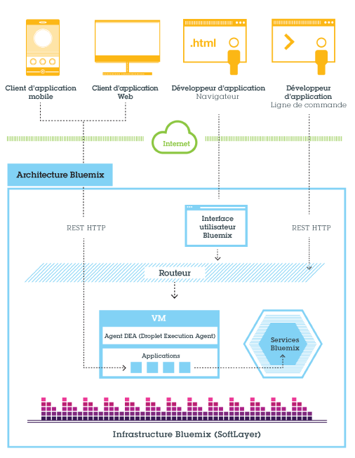
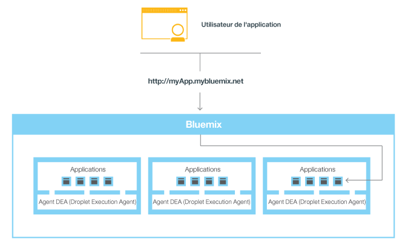

---

 

copyright:

  2014, 2016

 

---

{:shortdesc: .shortdesc} 
{:new_window: target="_blank"}

# Présentation de {{site.data.keyword.Bluemix_notm}}
{: #overview}

*Dernière mise à jour : 9 mai 2016*

{{site.data.keyword.Bluemix}} est la plateforme de cloud ouverte d'{{site.data.keyword.IBM}} qui offre aux développeurs
d'applications mobiles et Web un accès aux logiciels {{site.data.keyword.IBM_notm}} proposant des fonctions d'intégration, de sécurité, de
transaction, etc., ainsi qu'à l'environnement logiciel de partenaires commerciaux.
{:shortdesc}

{{site.data.keyword.Bluemix_notm}} s'appuie sur la technologie open source
[Cloud
Foundry](https://www.cloudfoundry.org/){: new_window} et facilite le développement des applications via la plateforme
sous forme de services (PaaS). {{site.data.keyword.Bluemix_notm}} propose également des capacités préconfigurées de système de back end
mobile sous forme de services (MBaas). Son objectif est de simplifier la livraison d'une application en fournissant des services prêts à l'emploi et en
hébergeant
des capacités permettant un développement à l'échelle d'Internet.

{{site.data.keyword.Bluemix_notm}} propose également des déploiements de cloud qui répondent à vos besoins. Que vous fassiez partie d'une
petite entreprise en pleine évolution ou d'une grande entreprise qui a besoin d'un isolement supplémentaire, vous pouvez vous développer dans un cloud sans
limite, dans lequel vous pouvez connecter vos services dédiés aux services {{site.data.keyword.Bluemix_notm}} publics mis à disposition par
{{site.data.keyword.IBM_notm}} et
des fournisseurs tiers. Toutes les instances de service sont gérées par {{site.data.keyword.IBM_notm}}. Vous recevez une seule facture,
uniquement pour les éléments que vous choisissez d'utiliser.

Avec le large ensemble de services et de contextes d'exécution de {{site.data.keyword.Bluemix_notm}}, le
développeur dispose d'un contrôle et d'une flexibilité accrus, ainsi que d'un accès à diverses options de données, de l'analyse prédictive aux mégadonnées.

{{site.data.keyword.Bluemix_notm}} fournit les fonctionnalités suivantes :

- Une gamme de services pour générer et étendre rapidement des applications Web et mobiles.
- Une puissance de traitement pour distribuer en continu des modifications d'application.
- Des services et des modèles de programmation adaptés au besoin.
- Des services et des applications d'une grande maniabilité.
- Des charges de travail optimisées et élastiques.
- Une disponibilité continue.

{{site.data.keyword.Bluemix_notm}} fait abstraction de la plupart des aspects complexes associés à l'hébergement et à la gestion des
applications basées sur le
cloud et les masque. En tant que développeur d'applications, vous pouvez vous consacrer au développement de votre application sans avoir à gérer l'infrastructure
requise pour son
hébergement. Pour les applications mobiles et Web, vous pouvez utiliser les services préconfigurés fournis par
{{site.data.keyword.Bluemix_notm}}. Pour les applications Web, vous pouvez télécharger votre application web dans {{site.data.keyword.Bluemix_notm}} et
indiquer le
nombre d'instances que vous souhaitez exécuter. Lorsque vos applications sont déployées, vous pouvez facilement les redimensionner en fonction des
changements
d'utilisation ou de charge.

{{site.data.keyword.Bluemix_notm}} permet de développer rapidement des applications dans la plupart des langages
de programmation les plus courants. Vous pouvez développer des applications mobiles dans iOS, Android et HTML avec JavaScript. Pour les applications Web,
vous pouvez utiliser des langages tels que Ruby, PHP, Java&trade;, Go et Python. Vous pouvez aussi migrer des applications existantes vers {{site.data.keyword.Bluemix_notm}} et utiliser les
contextes d'exécution fournis par {{site.data.keyword.Bluemix_notm}} pour exécuter vos applications.

{{site.data.keyword.Bluemix_notm}} fournit également des services middleware pour vos applications. {{site.data.keyword.Bluemix_notm}} agit au nom de l'application lorsqu'il provisionne des instances de service, puis lie ces services à
l'application. Votre
application peut effectuer son véritable travail tout en laissant la gestion des services à l'infrastructure.

En général, il est inutile de se préoccuper des couches du système d'exploitation et de l'infrastructure lorsque vous exécutez des applications dans
{{site.data.keyword.Bluemix_notm}}. Les
couches, telles que les systèmes de fichiers racine et les composants de
middleware, sont masquées pour que vous puissiez vous concentrer sur le code de
votre application. Cependant, vous pouvez obtenir plus de détails sur ces couches si vous avez besoin d'informations spécifiques sur
l'emplacement d'exécution de votre application. Pour plus d'informations, voir [Affichage des couches de l'infrastructure {{site.data.keyword.Bluemix_notm}}](../cli/vcapsvc.html#viewinfra). 

## Architecture {{site.data.keyword.Bluemix_notm}}
{: #ov_arch}

Avec {{site.data.keyword.Bluemix_notm}},
vous pouvez accéder à la plateforme {{site.data.keyword.Bluemix_notm}} publique, configurer une plateforme
{{site.data.keyword.Bluemix_notm}} dédiée, ou les deux.

### {{site.data.keyword.Bluemix_notm}} public
{: #public}

{{site.data.keyword.Bluemix_notm}}
est essentiellement un environnement dans lequel vous pouvez développer des applications et
utiliser des services qui fournissent des fonctions prêtes à l'emploi. {{site.data.keyword.Bluemix_notm}} fournit également un environnement pour héberger des artefacts s'exécutant sur un serveur d'applications tel que Liberty. En utilisant SoftLayer, {{site.data.keyword.Bluemix_notm}} déploie des conteneurs virtuels qui hébergent chaque
application déployée. Dans cet environnement, l'application peut utiliser des services préconfigurés (incluant des services de tiers) pour faciliter
l'assemblage d'applications.

En tant que développeur, vous pouvez interagir avec l'infrastructure {{site.data.keyword.Bluemix_notm}} via une interface utilisateur basée sur un navigateur. Vous pouvez également utiliser une interface de ligne de commande Cloud Foundry, appelée cf, pour déployer des applications Web.

Les clients, qui peuvent être des applications mobiles, des applications exécutées en externe, des applications construites dans
{{site.data.keyword.Bluemix_notm}} ou des développeurs qui utilisent des navigateurs, interagissent avec les applications hébergées par
{{site.data.keyword.Bluemix_notm}}. Ils utilisent des API REST OU HTTP pour
router les demandes via {{site.data.keyword.Bluemix_notm}} vers l'une des
instances d'application ou des services composites.

La figure suivante présente l'architecture de haut niveau {{site.data.keyword.Bluemix_notm}}.



*Figure 1. Architecture {{site.data.keyword.Bluemix_notm}}*

Vous pouvez déployer vos
applications dans différentes régions {{site.data.keyword.Bluemix_notm}}, pour des raisons de sécurité ou pour
réduire le temps d'attente. Vous pouvez procéder au déploiement dans une région ou dans plusieurs régions. Pour plus d'informations, voir
[Régions](#ov_intro__reg).


*Figure 2. Développement d'applications dans plusieurs régions*

### {{site.data.keyword.Bluemix_notm}} dédié
{: #dedicated}

{{site.data.keyword.Bluemix_notm}}
dédié constitue votre environnement SoftLayer exclusif qui est connecté de façon sécurisée à la plateforme
{{site.data.keyword.Bluemix_notm}} publique et à votre propre réseau. {{site.data.keyword.Bluemix_notm}} dédié réside sur votre réseau via une connexion de réseau privé virtuel ou
une connexion réseau directe. Votre matériel à service exclusif peut être configuré dans n'importe quel centre de données SoftLayer, n'importe où dans le
monde. {{site.data.keyword.IBM_notm}} gère la plateforme dédiée et les services dédiés pour que vous puissiez vous consacrer à la construction d'applications personnalisées. De plus, {{site.data.keyword.IBM_notm}} se charge de l'intégralité de la maintenance des instances dédiées au cours d'une fenêtre de maintenance
que vous choisissez.

{{site.data.keyword.IBM_notm}} met à disposition plusieurs services dans votre environnement dédié, mais vous pouvez vous connecter à tous les services publics. Tous les environnements d'exécution sont
disponibles dans l'environnement dédié.
Tous les déploiements dédiés de {{site.data.keyword.Bluemix_notm}}
incluent les fonctions et les avantages suivants gratuitement : réseau virtuel privé, réseau local virtuel privé, connectivité avec votre protocole LDAP,
possibilité d'optimiser des applications et des bases de données sur site existantes, sécurité sur site 24 heures sur 24 et 7 jours sur 7, matériel dédié
et
support standard. 


*Figure 3. {{site.data.keyword.Bluemix_notm}} dédié*

### {{site.data.keyword.Bluemix_notm}} local
{: #local}

L'environnement {{site.data.keyword.Bluemix_notm}} local est votre propre instance {{site.data.keyword.Bluemix_notm}} qui est
déployée dans votre centre de données, derrière le pare-feu de la société. Avec l'environnement {{site.data.keyword.Bluemix_notm}} local, vous
pouvez rester connecté de façon sécurisée à
l'environnement {{site.data.keyword.Bluemix_notm}} public et synchronisé.

L'environnement {{site.data.keyword.Bluemix_notm}} local inclut un catalogue privé mixte qui affiche les services locaux disponibles
exclusivement pour vous. Il inclut également des services qui sont à votre disposition depuis l'environnement
{{site.data.keyword.Bluemix_notm}} public. Tous les environnements d'exécution sont disponibles dans l'environnement local. Les déploiements
locaux de {{site.data.keyword.Bluemix_notm}} présentent les fonctions et les avantages suivants gratuitement : technologie de gestion de relais,
connectivité LDAP, possibilité d'optimiser des applications et des bases de données sur site existantes et support standard.

IBM utilise la technologie de relais pour surveiller et gérer votre environnement de façon sécurisée de sorte que vous puissiez vous consacrer à
votre activité. Le relais est une fonction de distribution incluse dans l'environnement {{site.data.keyword.Bluemix_notm}} local qui permet à IBM
de distribuer les mises à jour automatiquement et de façon cohérente, pour que vous disposiez toujours d'un système à jour, stable et sécurisé. Le relais
assure la connectivité via un tunnel de réseau privé virtuel ouvert, avec configuration SSL sortante, provenant de la machine virtuelle de création. Par le biais de ce tunnel, IBM sert et gère la plateforme, les ressources de traitement et les services pour votre instance. Voir
[{{site.data.keyword.Bluemix_notm}} local](../local/index.html#local).


*Figure 4. {{site.data.keyword.Bluemix_notm}} local*

La machine virtuelle de création s'exécute sur un réseau protégé par le pare-feu de votre client sur un réseau avec une connectivité sortante vers le centre des opérations IBM via un relais. Les composants de la plateforme {{site.data.keyword.Bluemix_notm}} et les services de base s'exécutent dans un réseau local virtuel (VLAN) isolé et privé. L'environnement {{site.data.keyword.Bluemix_notm}} local utilise un réseau VLAN pour le sous-réseau privé. L'utilisation d'un sous-réseau privé à la place d'un réseau VLAN public est plus sécurisée et peut vous aider à éviter les problèmes de routage.

Les dispositifs DataPower fournissent l'accès aux domaines d'application {{site.data.keyword.Bluemix_notm}}. Ces dispositifs se connectent au réseau accessible à partir de votre intranet. Les utilisateurs qui déploient des applications et des services obtiennent l'accès à partir du réseau accessible à partir de votre intranet. Vous devez fournir sept adresses IP ayant un accès Internet sortant. Les dispositifs DataPower effectuent le routage à partir de ces adresses IP client vers le déploiement {{site.data.keyword.Bluemix_notm}} isolé. Pour plus d'informations sur les spécifications de réseau et les exigences en matière d'infrastructure, voir [Exigences de l'infrastructure d'un environnement {{site.data.keyword.Bluemix_notm}} local](../local/index.html#localinfra).

### Fonctionnement de {{site.data.keyword.Bluemix_notm}}
{: #howwork}

Lorsque vous
déployez une application dans {{site.data.keyword.Bluemix_notm}}, vous devez configurer
{{site.data.keyword.Bluemix_notm}} avec les informations nécessaires à la prise en charge de celle-ci.

* Dans le cas d'une application mobile, {{site.data.keyword.Bluemix_notm}} contient un artefact qui représente
le système de back end de l'application mobile, comme les services utilisés par l'application mobile pour communiquer avec un serveur.
* Dans le cas d'une application Web, vous devez vous assurer que les informations appropriées sur l'environnement d'exécution et l'infrastructure sont
communiquées à
{{site.data.keyword.Bluemix_notm}}, de sorte que l'application puisse être exécutée.

Chaque
environnement d'exécution, y compris mobile et web, est distinct de celui des autres applications. Les environnements d'exécution sont isolés, même si les applications sont sur la même machine physique. La figure suivante présente le flux de base suivi par {{site.data.keyword.Bluemix_notm}} pour gérer le
déploiement des applications : 


*Figure 5. Déploiement d'une application*

Lorsque vous créez une application et que vous la déployez sur
{{site.data.keyword.Bluemix_notm}}, l'environnement
{{site.data.keyword.Bluemix_notm}} choisit la machine virtuelle appropriée vers laquelle l'application ou les
artefacts représentés par l'application sont envoyés. Pour une application mobile, une projection de back end mobile est créée dans {{site.data.keyword.Bluemix_notm}}. Tout code de l'application mobile exécuté sur le cloud l'est finalement dans l'environnement {{site.data.keyword.Bluemix_notm}}. Pour une application Web, le code exécuté sur le cloud correspond à
l'application elle-même, que le développeur déploie dans {{site.data.keyword.Bluemix_notm}}. Le choix de la machine virtuelle dépend de plusieurs facteurs, dont :

* La charge actuelle de la machine
* Les environnements d'exécution et les infrastructures pris en charge par la machine virtuelle

Lorsque le choix de la machine virtuelle est
fait, un gestionnaire d'application installe l'infrastructure et l'environnement d'exécution requis pour l'application. Celle-ci peut alors être déployée
dans cette infrastructure. Ensuite, les artefacts d'application sont démarrés.

La figure suivante présente la structure d'une machine virtuelle,
aussi appelée agent DEA (Droplet Execution Agent), sur laquelle plusieurs applications sont déployées : 


*Figure 6. Conception d'une machine virtuelle*

Dans chaque machine virtuelle, un gestionnaire d'application communique avec le reste de l'infrastructure {{site.data.keyword.Bluemix_notm}}
et gère les applications déployées. Chaque machine virtuelle
dispose de conteneurs pour séparer et protéger les applications. Dans chaque conteneur,
{{site.data.keyword.Bluemix_notm}} installe l'infrastructure et l'environnement d'exécution requis pour chaque
application.

Si l'application déployée dispose d'une interface Web (par exemple, une application Web Java) ou de services REST (par exemple, des services mobiles
exposés publiquement à l'application mobile), les utilisateurs de cette application peuvent communiquer avec elle via des demandes HTTP normales.



*Figure 7. Appel d'une application {{site.data.keyword.Bluemix_notm}}*

Chaque application
peut être associée à une ou plusieurs adresses URL, mais elles doivent toutes désigner le noeud final
{{site.data.keyword.Bluemix_notm}}. Lorsqu'une demande arrive,
{{site.data.keyword.Bluemix_notm}} l'examine, détermine l'application à laquelle elle est adressée, puis
sélectionne l'instance de l'application qui recevra la demande. 

### Résilience dans {{site.data.keyword.Bluemix_notm}}
{: #resiliency}

{{site.data.keyword.Bluemix_notm}} a été conçu pour héberger des applications et des artefacts d'application
évolutifs
et résilients pouvant s'adapter à vos besoins, rester hautement disponibles et
assurer une reprise rapide en cas de problème. {{site.data.keyword.Bluemix_notm}} sépare les composants qui assurent le suivi de l'état des interactions (avec état) de ceux qui n'effectuent
pas de suivi (sans état). Cette
distinction permet à {{site.data.keyword.Bluemix_notm}} de déplacer des applications de façon souple en fonction des besoins
pour
assurer l'évolutivité et la résilience.

Vous pouvez disposer d'une ou de plusieurs instances de votre application. Dans les deux cas, l'application
est chargée une seule fois. Toutefois, {{site.data.keyword.Bluemix_notm}} déploie le nombre d'instances de
l'application demandé et distribue ces instances sur autant de machines virtuelles que possible.

Vous devez sauvegarder toutes les données
persistantes dans un magasin de données avec état qui se trouve hors de votre application, par exemple dans un magasin de données des services de magasin de
données fournis par {{site.data.keyword.Bluemix_notm}}. Etant donné que les éléments mis en cache dans la mémoire ou sur le disque peuvent ne pas être disponibles même après un redémarrage, vous pouvez
utiliser l'espace
mémoire ou le système de fichiers d'une instance {{site.data.keyword.Bluemix_notm}} unique comme cache de
transaction unique temporaire. Dans le cas de la configuration d'une instance unique, la demande envoyée à votre application peut être interrompue en raison
de la nature sans état de {{site.data.keyword.Bluemix_notm}}. Il est recommandé d'utiliser au moins trois instances pour chaque application afin d'assurer la disponibilité de votre application.

L'ensemble de l'infrastructure {{site.data.keyword.Bluemix_notm}}, les composants Cloud Foundry et les composants de gestion propres à {{site.data.keyword.IBM_notm}} sont hautement disponibles. Plusieurs instances de l'infrastructure sont utilisées pour équilibrer la charge.

## Concepts {{site.data.keyword.Bluemix_notm}}
{: #ov_intro}

{{site.data.keyword.Bluemix_notm}} est composé d'applications, de services, de packs de construction, et d'autres composants. Vous pouvez
déployer des applications dans différentes régions {{site.data.keyword.Bluemix_notm}} avec un seul ID {{site.data.keyword.IBM_notm}}.

### Régions
{: #ov_intro__reg}

Une région {{site.data.keyword.Bluemix_notm}} est un territoire géographique défini sur lequel vous pouvez déployer vos applications. Vous
pouvez créer des instances d'application et de service dans différentes régions avec la même infrastructure {{site.data.keyword.Bluemix_notm}} pour
la gestion des applications et la même vue de détails de l'utilisation pour la facturation. Vous pouvez sélectionner la région la plus proche de vos clients et y déployer vos applications pour avoir un temps d'attente faible. Vous pouvez également sélectionner la région où vous voulez garder les données d'application permettant d'adresser les problèmes de sécurité. Lorsque vous construisez des applications dans plusieurs régions et que l'une des régions s'arrête, les applications des autres régions continuent de
fonctionner. La franchise de ressources est la même dans toutes les régions que vous utilisez.

Si
vous employez l'interface utilisateur
{{site.data.keyword.Bluemix_notm}}, vous pouvez basculer vers une région différente et travailler avec les
espaces de cette région.

Si vous utilisez l'interface de ligne de commande cf, vous devez vous connecter à la région {{site.data.keyword.Bluemix_notm}} avec laquelle vous voulez travailler en entrant la
commande cf api et en spécifiant le noeud final d'API de la région. Par exemple, entrez la commande suivante pour vous connecter à la région {{site.data.keyword.Bluemix_notm}}
Europe et Royaume-Uni :

```
cf api https://api.eu-gb.{{site.data.keyword.Bluemix_notm}}.net
```

Si vous utilisez les outils Eclipse, vous devez vous connecter à la région
{{site.data.keyword.Bluemix_notm}} avec laquelle vous voulez travailler en créant un serveur
{{site.data.keyword.Bluemix_notm}} et en spécifiant le noeud final d'API de la région. Pour plus d'informations sur l'utilisation des outils
Eclipse, voir [Déploiement d'applications avec {{site.data.keyword.IBM_notm}} Eclipse
Tools for {{site.data.keyword.Bluemix_notm}}](../manageapps/eclipsetools/eclipsetools.html#toolsinstall).

Un préfixe unique est affecté à chaque région. {{site.data.keyword.Bluemix_notm}} fournit les régions et les préfixes suivants : 

<!-- PRODUCTION ONLY: Ensure that URLs are production URLs, not stage1-->

| **Nom de région** | **Zone géographique** | **Préfixe de région** | **cf API endpoint** | **Console d'interface utilisateur** |       
|-----------------|-------------------------|-------------------|---------------------|----------------|
| Région Sud des Etats-Unis | Dallas, US | ng | api.ng.bluemix.net | console.ng.bluemix.net |
| Région Royaume-Uni | Londres, Angleterre | eu-gb | api.eu-gb.bluemix.net | console.eu-gb.bluemix.net |
| Région Sydney | Sydney, Australie | au-syd | api.au-syd.bluemix.net | console.au-syd.bluemix.net |


*Tableau 1. Liste des régions {{site.data.keyword.Bluemix_notm}}*

### Infrastructure
{: #infrastructure}

{{site.data.keyword.Bluemix_notm}} propose trois façons d'exécuter votre code : avec Cloud Foundry, avec
{{site.data.keyword.IBM_notm}} Containers et avec Virtual Machines. {{site.data.keyword.IBM_notm}} Containers et Virtual Machines sont
disponibles dans les régions Sud des Etats-Unis et Europe et Royaume-Uni seulement. Vous pouvez choisir l'infrastructure appropriée pour le déploiement
de vos applications. 

<dl>
<dt>Cloud Foundry</dt>
    <dd>Les applications qui s'exécutent dans l'infrastructure Cloud Foundry fonctionnent avec des applications Cloud Foundry existantes et peuvent être
liées à n'importe quel service disponible dans le catalogue {{site.data.keyword.Bluemix_notm}}. Avec cette infrastructure, vous
développez et gérez le code de votre application, et {{site.data.keyword.Bluemix_notm}} se charge de la gestion
et de la maintenance de l'infrastructure qui optimise ces applications.</dd>
<dt>{{site.data.keyword.IBM_notm}}Containers</dt>
    <dd>Avec l'infrastructure {{site.data.keyword.IBM_notm}} Containers, vous pouvez exécuter votre application Web n'importe où, à condition que le
déploiement de conteneur soit pris en charge. Un *conteneur* est un objet qui contient tous les éléments nécessaires à l'exécution d'une application. Cette
infrastructure inclut un registre privé pour vos images sécurisées, afin que vous puissiez les télécharger, les
stocker et les extraire. Ensuite, vous pouvez mettre ces images à disposition dans
{{site.data.keyword.Bluemix_notm}} et gérer vos conteneurs sur la plateforme. L'infrastructure d'{{site.data.keyword.IBM_notm}} Containers
peut être
mise à l'échelle horizontalement et verticalement. Vous pouvez
utiliser toutes les images qui sont disponibles dans le concentrateur Docker public et utiliser l'API Docker et l'interface de ligne de commande pour gérer
vos
conteneurs dans {{site.data.keyword.Bluemix_notm}}. {{site.data.keyword.IBM_notm}} met également à disposition des images publiques dans le
registre Containers que vous pouvez utiliser et étendre.

    {{site.data.keyword.IBM_notm}} Containers est utilisé pour exécuter des
conteneurs Docker
dans un environnement de cloud hébergé. Docker ajoute un moteur qui déploie une application dans l'environnement virtuel que vous utilisez pour exécuter vos
conteneurs. Il fournit également un environnement que vous pouvez utiliser pour exécuter
votre code. Lorsque vous êtes prêt, il vous permet de transférer le code de votre environnement de développement à votre environnement de test, puis à
votre environnement de production.

    Pour en savoir plus sur {{site.data.keyword.IBM_notm}} Containers, voir
[{{site.data.keyword.IBM_notm}} Containers](../containers/container_index.html).</dd>
<dt>{{site.data.keyword.IBM_notm}} {{site.data.keyword.virtualmachinesshort}} (bêta)</dt>
    <dd><p>{{site.data.keyword.IBM_notm}} {{site.data.keyword.virtualmachinesshort}} est un environnement de cloud hébergé qui fait partie
d'{{site.data.keyword.IBM_notm}} {{site.data.keyword.Bluemix_notm}} et que vous pouvez utiliser pour générer, exécuter et surveiller vos
applications, tout en gardant un contrôle optimal sur vos applications et le middleware sur lequel elles s'exécutent. Utilisez
{{site.data.keyword.virtualmachinesshort}} pour isoler vos solutions d'entreprise, en particulier lorsque vous déployez vos applications dans
un cloud public. </p>
<p>    
Vous pouvez exécuter et gérer des serveurs virtuels dans des clouds publics et privés (sur site) qui utilisent le logiciel OpenStack. Vous pouvez créer,
lancer et gérer vos serveurs virtuels via l'interface utilisateur {{site.data.keyword.Bluemix_notm}} ou le client OpenStackClient (OSC). Vous
pouvez utiliser des images de serveur virtuel mises à disposition par {{site.data.keyword.IBM_notm}} ou créer des serveurs virtuels à partir de vos
propres images personnalisées. Vous pouvez utiliser les fonctions d'{{site.data.keyword.IBM_notm}} {{site.data.keyword.Bluemix_notm}} pour
masquer la plupart des aspects complexes associés à l'hébergement et à la gestion des applications reposant sur le cloud, comme la journalisation, la mise
à l'échelle automatique et la surveillance. Vous pouvez combiner les services OpenStack et les services {{site.data.keyword.Bluemix_notm}} pour générer et exécuter des applications
hybrides. Vous pouvez mettre à disposition des ressources d'infrastructure en fonction des besoins, selon des stratégies d'exploitation et la demande en
charge de travail. </p>
<p>
Pour en savoir plus sur {{site.data.keyword.IBM_notm}} {{site.data.keyword.virtualmachinesshort}}, voir [{{site.data.keyword.IBM_notm}} {{site.data.keyword.virtualmachinesshort}}](../virtualmachines/vm_index.html).</p> </dd>
</dl>

### Applications
{: #applications}

Dans {{site.data.keyword.Bluemix_notm}}, une application, ou *appli*, représente l'artefact que le développeur génère. Le cycle de vie de l'application dans {{site.data.keyword.Bluemix_notm}} et dans Cloud Foundry est identique,
quelle que soit la manière dont l'application est déployée dans {{site.data.keyword.Bluemix_notm}}. Pour plus d'informations, voir [How Applications Are Staged](https://docs.cloudfoundry.org/concepts/how-applications-are-staged.html).

<dl>
<dt>Applications mobiles</dt>
    <dd>Les applications mobiles sont exécutées en dehors de l'environnement {{site.data.keyword.Bluemix_notm}}  et utilisent les services auxquels elles sont exposées. Ces services agissent ensemble et représentent la projection de back end de cette application. {{site.data.keyword.Bluemix_notm}} peut également héberger le code d'application, que le développeur préférera
exécuter sur un serveur de back end dans un environnement de conteneur.</dd>
<dt>Applications Web</dt>
    <dd>Les applications Web se composent de l'ensemble du code requis pour une exécution ou un référencement pendant la phase d'exécution. Les applications Web sont
téléchargées dans {{site.data.keyword.Bluemix_notm}} pour héberger l'application.</dd>
</dl>

Pour les langages tels que Java, où le code source est compilé dans des fichiers binaires d'exécution, seuls ces fichiers binaires doivent être
téléchargés.

### Services
{: #services}

Un *service* est une extension de cloud hébergée par {{site.data.keyword.Bluemix_notm}}. Le service fournit des fonctionnalités prêtes à l'emploi par le code en cours d'exécution de l'application. Les services prédéfinis qui sont fournis par {{site.data.keyword.Bluemix_notm}} incluent une base de données, un
système
de messagerie, des notifications push et une mise en cache élastique pour applications Web.

Vous pouvez créer vos propres services dans {{site.data.keyword.Bluemix_notm}}. Ces services peuvent varier en termes de complexité. Ils peuvent constituer de simples utilitaires, telles que les fonctions que l'on peut trouver dans une bibliothèque d'exécution. Mais ils peuvent aussi constituer une logique métier complexe comme on en trouve dans un service de modélisation de processus métier ou dans une base de données.

{{site.data.keyword.Bluemix_notm}} simplifie l'utilisation des services en mettant à disposition de nouvelles
instances de service et en liant celles-ci à votre application. La gestion du service est effectué automatiquement par {{site.data.keyword.Bluemix_notm}}. Pour prendre connaissance des services disponibles dans {{site.data.keyword.Bluemix_notm}}, consultez le catalogue dans l'interface utilisateur {{site.data.keyword.Bluemix_notm}}.

### Modules de démarrage
{: #starters}

Un *module de démarrage* est un modèle qui inclut des services prédéfinis et du code
d'application configuré avec un pack de construction particulier. Il
existe deux types de module de démarrage : les conteneurs boilerplate et les environnements d'exécution.  Un module de démarrage peut se composer d'un code
d'application écrit dans un langage de programmation spécifique, ou d'une combinaison de code d'application et d'un ensemble de services.

### Conteneurs boilerplate
{: #boilerplates}

Dans {{site.data.keyword.Bluemix_notm}}, un conteneur
*boilerplate* contient une application ainsi que son environnement d'exécution associé et ses services prédéfinis, pour un domaine
particulier. Un conteneur boilerplate permet une mise ne exécution rapide. Par exemple, vous pouvez sélectionner le conteneur boilerplate Mobile Cloud pour
héberger des applications mobiles et Web et accélérer les temps de développement de scripts côté serveur en utilisant le modèle d'application mobile et
le logiciel SDK.

### Environnements d'exécution
{: #runtimes}

Un *environnement d'exécution* est un ensemble de ressources utilisé pour exécuter
une
application. {{site.data.keyword.Bluemix_notm}} fournit des environnements d'exécution sous forme de conteneurs pour
différents types d'application. Les environnements d'exécution sont intégrés en tant que packs de construction dans
{{site.data.keyword.Bluemix_notm}},
et sont automatiquement configurés en vue de leur utilisation.

### Packs de construction
{: #buildpacks}

Un pack de construction est une collection de scripts qui prépare l'exécution de votre code sur la plateforme sous forme de services (PaaS) cible. Il regroupe les dépendances d'exécution et d'infrastructure d'une application. Puis, il les intègre
à l'application dans une gouttelette qui peut être déployée dans le cloud.

Si vous ne spécifiez pas de pack de construction lorsque vous déployez votre
application dans {{site.data.keyword.Bluemix_notm}}, les packs de construction intégrés sont utilisés par défaut.

<dl class="dl"><dt class="dt dlterm">Packs de construction {{site.data.keyword.IBM_notm}} intégrés</dt>
<dd class="dd"><div class="p">
<!-- begin PRODUCTION ONLY -->
La liste suivante est la liste des packs de construction intégrés créés par {{site.data.keyword.IBM_notm}} : 
<ul>
<li>Liberty for Java</li>
<li>Node.js</li>
</ul>
<!-- end PRODUCTION ONLY -->
</div>
</div>
</dd>
<dt class="dt dlterm">Packs de construction de communauté intégrés</dt>
<dd class="dd"><p class="p">Dans {{site.data.keyword.Bluemix_notm}}, vous pouvez également utiliser des packs de construction intégrés fournis par la communauté Cloud Foundry. Pour afficher la liste des packs de construction de communauté intégrés, exécutez la commande <span class="keyword cmdname">cf buildpacks</span>.</p>
</dd>
<dt class="dt dlterm">Packs de construction externes</dt>
<dd class="dd"><div class="p">Si vous ne trouvez pas l'environnement d'exécution ou l'infrastructure nécessaire dans les packs de construction intégrés fournis par
{{site.data.keyword.Bluemix_notm}}, vous pouvez utiliser un pack de construction externe pour votre application.
Ces packs, fournis par la communauté Cloud Foundry, peuvent être utilisés comme vos propres packs. Le pack de construction doit être spécifié lorsque vous
déployez votre application avec la commande <span class="keyword cmdname">cf push</span>. <div class="note note"><span class="notetitle">Remarque :</span> les packs de construction externes ne sont
pas pris en charge par {{site.data.keyword.IBM_notm}} ; en cas de besoin, prenez contact avec la communauté Cloud Foundry.</div>
</div>
</dd>
</dl>


## Intégration avec les systèmes d'enregistrement
{: #sor}

{{site.data.keyword.Bluemix_notm}} peut aider les développeurs en connectant deux grandes catégories de systèmes dans un environnement de cloud : les systèmes d'enregistrement et les systèmes d'engagement.

Les *systèmes d'enregistrement* incluent les applications et les bases de données qui stockent des enregistrements métier et automatisent
des
processus standardisés. Des *systèmes d'engagement* permettent de développer l'utilité des systèmes d'enregistrement en les rendant
plus attractifs pour les utilisateurs.
En intégrant un système d'enregistrement à l'application que vous créez dans {{site.data.keyword.Bluemix_notm}}, vous pouvez :

 * Activer une communication sécurisée entre l'application et la base de données dorsale, via le téléchargement et l'installation d'un connecteur
sécurisé sur site.
 * Appeler une base de données de manière sécurisée.
 * Créer des interfaces de programme d'application à partir des flux d'intégration avec les bases de données et les systèmes expéditeurs, par exemple, un système de gestion de la relation client.
 * Exposer uniquement les schémas et les tables de votre choix à l'application.
 * En tant que responsable d'organisation {{site.data.keyword.Bluemix_notm}}, publier une interface de programme d'application sous forme de service privé, visible uniquement des membres de votre organisation.

Utiliser le service Cloud Integration pour intégrer un système d'enregistrement à l'application que vous créez dans {{site.data.keyword.Bluemix_notm}}. Le service Cloud Integration permet de créer et de publier une API Cloud Integration en tant que service privé pour
votre
organisation.

<dl>
<dt>API Cloud Integration</dt>
    <dd>Une API Cloud Integration fournit un accès sécurisé aux systèmes d'enregistrement résidant derrière un pare-feu
via des API Web. Lorsque vous créez l'API Cloud Integration, vous choisissez la ressource à laquelle vous voulez accéder via l'API Web, spécifiez les
opérations qui sont autorisées et incluez les logiciels SDK et les exemples pour accéder à l'API. Pour plus d'informations sur la création d'une API Cloud
Integration, voir [Création d'une API Cloud Integration](../services/CloudIntegration/index.html#cloudint_add_service).</dd>
<dt>Service privé</dt>
    <dd>Un service privé est composé d'une API Cloud Integration, de logiciels SDK et de règles de droits. De plus, le service privé peut contenir de la documentation ou d'autres éléments appartenant au fournisseur de services. Seul le responsable de l'organisation peut publier une API Cloud Integration en tant que service privé. Pour connaître les services privés à votre
disposition, cochez la case Privé dans le catalogue {{site.data.keyword.Bluemix_notm}}. Vous pouvez sélectionner et lier un service privé à une application sans vous connecter au service Cloud Integration. Pour lier un service privé à votre
application, procédez de la même façon que pour les services {{site.data.keyword.Bluemix_notm}}. Pour des informations sur la publication d'une API en tant que service privé, voir Publication d'une API en tant que service privé.</dd>
</dl>

### Scénario : Création d'une application mobile riche pour la connexion avec votre système d'enregistrement
{: #scenario}

{{site.data.keyword.Bluemix_notm}} fournit une plateforme dans laquelle vous pouvez intégrer votre application mobile, des services de cloud et
des
systèmes d'entreprise d'enregistrement pour générer une application qui interagit avec vos données sur site.

Par exemple, vous pouvez concevoir une application mobile pour interagir avec votre système de gestion de la relation client résidant sur site, derrière un pare-feu. Vous pouvez appeler le système d'enregistrement de manière sécurisée et optimiser les services mobiles dans {{site.data.keyword.Bluemix_notm}} afin
de générer une application mobile riche.

Tout d'abord, votre développeur d'intégration crée l'application de back end mobile dans {{site.data.keyword.Bluemix_notm}}. Il fait appel au conteneur boilerplate Mobile Cloud utilisant le contexte d'exécution Node.js qu'il connaît le mieux.

Puis, en utilisant le service Cloud Integration dans l'interface utilisateur {{site.data.keyword.Bluemix_notm}}, il expose une API via un connecteur
sécurisé. Le développeur d'application télécharge le connecteur sécurisé et l'installe sur site, afin d'activer la communication sécurisée entre son interface de programme d'application et la base de données. Après avoir créé le noeud final de base de données, il peut consulter tous les schémas et extraire les tables qu'il veut exposer à l'application en tant
qu'API.

Il ajoute ensuite le service Push pour distribuer des notifications mobiles aux clients intéressés. Il ajoute également un service de partenaire commercial pour écrire un tweet lorsqu'un nouvel enregistrement client est créé avec une interface de programme d'application Twitter.

En tant que développeur d'application, vous pouvez ensuite vous connecter à {{site.data.keyword.Bluemix_notm}}, télécharger le kit d'outils de développement Android et développer le code appelant les interfaces de programme d'application créées par le développeur d'intégration. Vous pouvez développer une application mobile qui permet aux utilisateurs d'entrer des informations sur leur périphérique mobile. Cette application crée alors un enregistrement client dans le système de gestion client. Lorsque l'enregistrement est créé, l'application crée une notification push pour périphérique mobile et un tweet pour signaler le nouvel enregistrement.

## Support de langue nationale pour {{site.data.keyword.Bluemix_notm}}
{: #lang}

{{site.data.keyword.Bluemix_notm}} prend en charge des langues autres que
l'anglais. Cependant, le contenu fourni avec {{site.data.keyword.Bluemix_notm}} n'est pas
entièrement traduit.
Le tableau ci-dessous répertorie les langues nationales prises en charge ainsi que les codes de langue pour {{site.data.keyword.Bluemix_notm}}.

| **Langue nationale** | **Code de langue** |
|-------------------|---------------|
| Portugais (Brésil) | pt_BR |
| Anglais | en |
| Français | fr |
| Allemand | de |
| Japonais | ja |
| Coréen | ko |
| Italien | it |
| Espagnol | es |
| Chinois simplifié | zh_CN |
| Chinois traditionnel | zh_TW |

*Tableau 2. Langues nationales prises en charge et codes de langue*

# Liens connexes
{: #rellinks}

## Liens connexes
{: #general}

* [Configuration requise pour {{site.data.keyword.Bluemix_notm}}](https://developer.ibm.com/bluemix/support/#prereqs)
* [Nouveautés de {{site.data.keyword.Bluemix_notm}}](../whatsnew/index.html)
* [Problèmes {{site.data.keyword.Bluemix_notm}} connus](https://developer.ibm.com/bluemix/support/#issues)
* [Glossaire {{site.data.keyword.Bluemix_notm}}](glossary/index.html)
* [Fiche des prix {{site.data.keyword.Bluemix_notm}}](https://console.{DomainName}/pricing/)
* [{{site.data.keyword.Bluemix_notm}} DevOps Services](https://hub.jazz.net)
* [Cloud Foundry](http://cloudfoundry.org/)
* [SoftLayer, une société {{site.data.keyword.IBM_notm}}](http://www.softlayer.com/)
