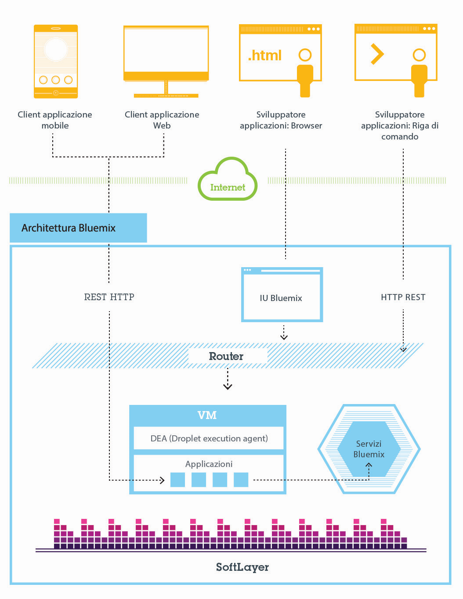
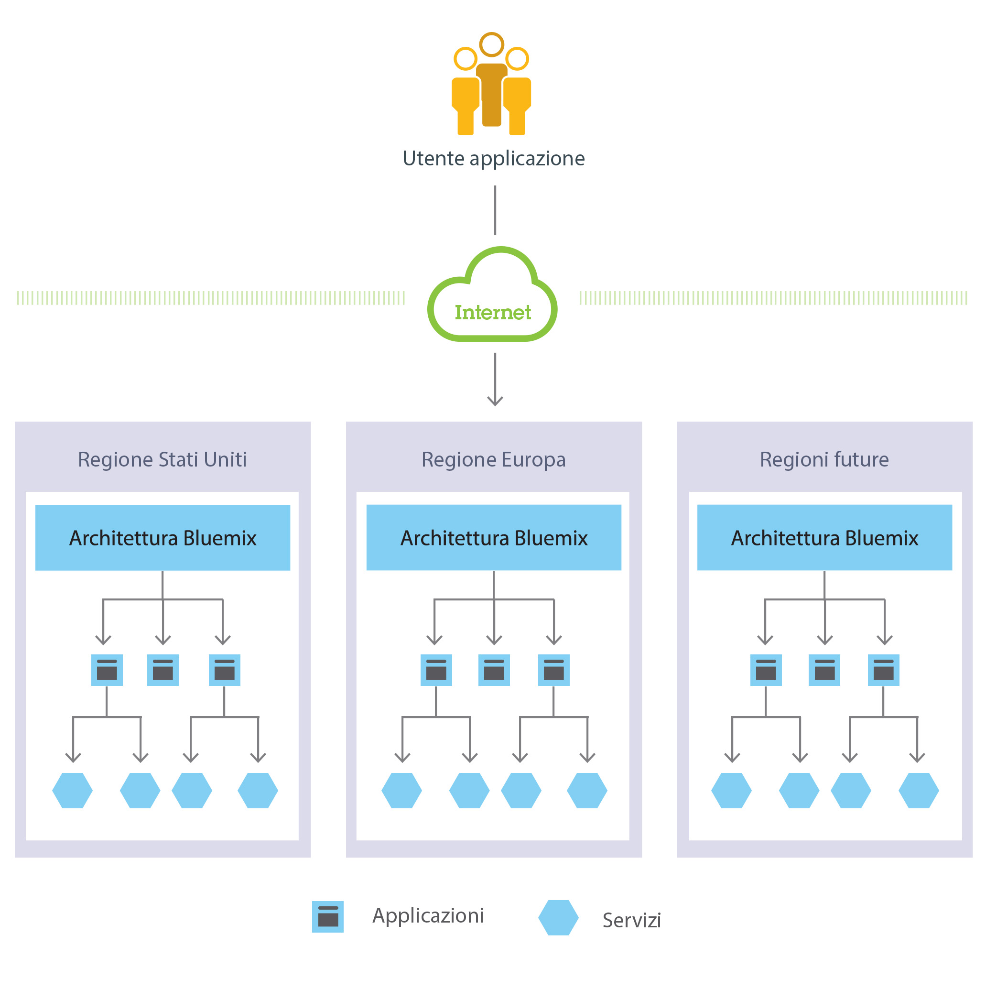
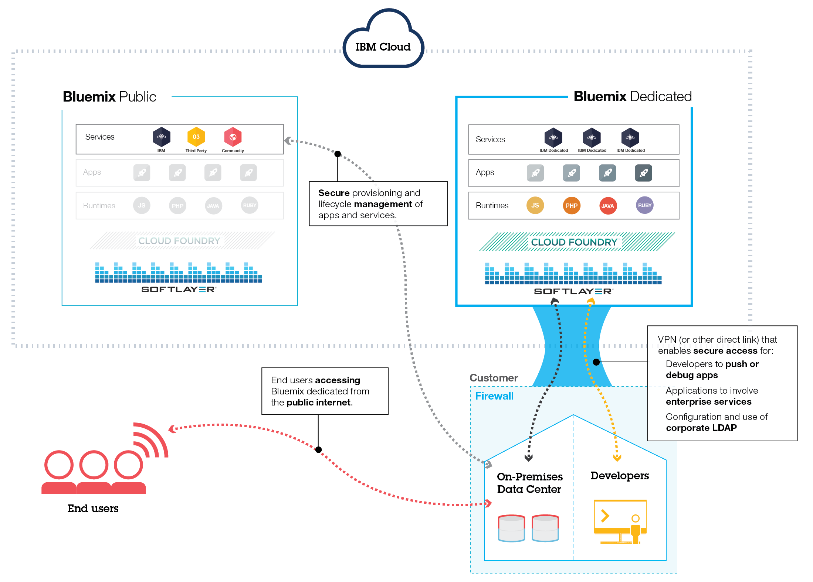
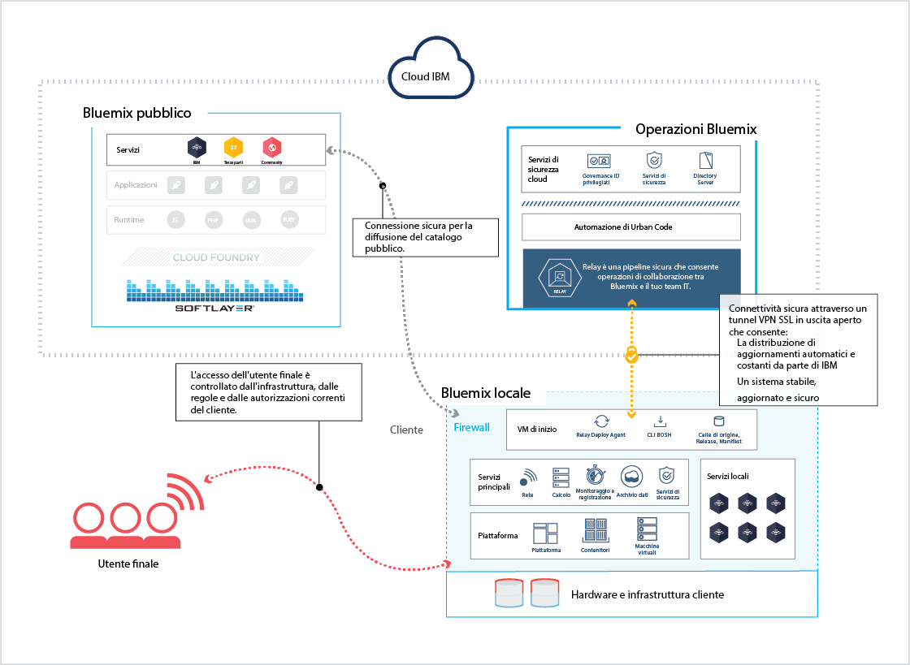
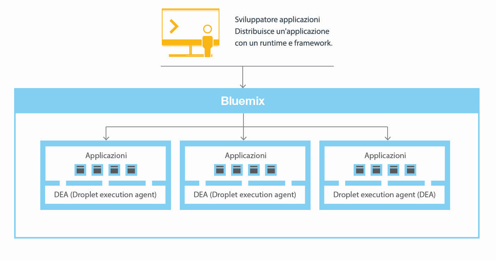
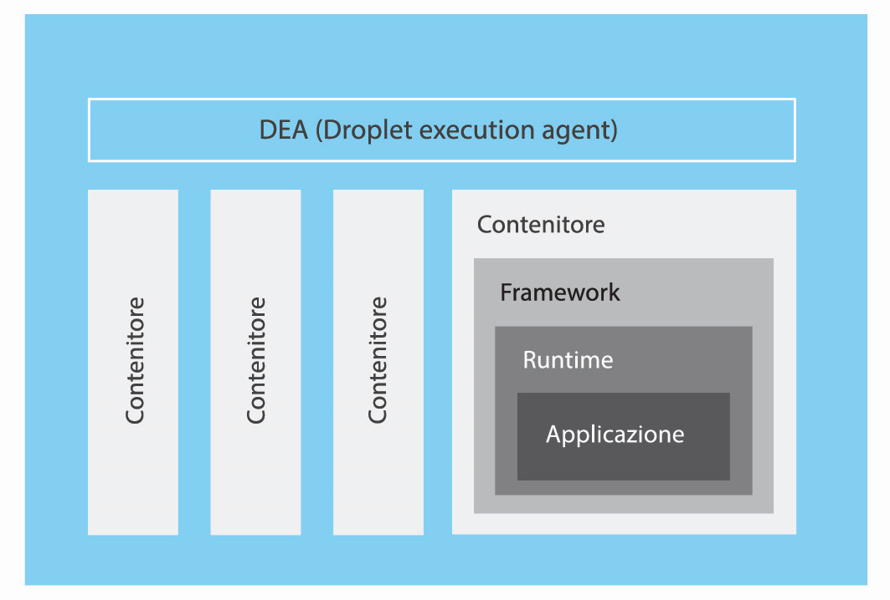

---

 

copyright:

  years: 2014, 2016

 

---

{:shortdesc: .shortdesc} 
{:new_window: target="_blank"}

# Panoramica di {{site.data.keyword.Bluemix_notm}}
{: #overview}

*Ultimo aggiornamento: 9 maggio 2016*

{{site.data.keyword.Bluemix}} è la piattaforma open cloud {{site.data.keyword.IBM}} che fornisce agli sviluppatori web e mobili l'accesso
al software {{site.data.keyword.IBM_notm}} per le funzioni di integrazione, sicurezza, transazione e ad altre funzioni chiave, oltre che al software dai business partner.
{:shortdesc}

Basato sulla tecnologia open source [Cloud
Foundry](https://www.cloudfoundry.org/){: new_window}, {{site.data.keyword.Bluemix_notm}} rende
più semplice lo sviluppo di applicazioni con PaaS (Platform as a Service). {{site.data.keyword.Bluemix_notm}} fornisce
anche funzioni MBaaS (Mobile Backend as a Service) pre-costruite. L'obiettivo è quello di semplificare l'offerta di un'applicazione mettendo a disposizione servizi pronti
per un uso immediato e funzionalità di host per abilitare uno sviluppo di scala internet.

{{site.data.keyword.Bluemix_notm}} dispone anche di distribuzioni
cloud adatte alle tue esigenze. Non importa se rappresenti una piccola attività di business che intende ingrandirsi oppure una grande azienda che ha bisogno di un ulteriore livello di isolamento, con un cloud puoi sviluppare la tua attività senza limiti, connettendo i tuoi servizi dedicati ai servizi pubblici {{site.data.keyword.Bluemix_notm}} disponibili da {{site.data.keyword.IBM_notm}} e terzi provider. Tutte le istanze del servizio sono gestite da {{site.data.keyword.IBM_notm}}. Riceverai una singola fattura solo per quello che sceglierai di usare.

Con l'ampia gamma di servizi e runtime in {{site.data.keyword.Bluemix_notm}}, lo sviluppatore acquisisce controllo e flessibilità e ha accesso a diverse opzioni di dati, dall'analisi predittiva ai Big Data.

{{site.data.keyword.Bluemix_notm}} fornisce le
seguenti funzioni:

- Una gamma di servizi che ti consente di creare ed estendere rapidamente applicazioni mobili e web.
- Potenza di elaborazione per offrire modifiche delle applicazioni in modo continuo.
- Servizi e modelli di programmazione adatti allo scopo.
- Gestibilità di servizi e applicazioni.
- Carichi di lavoro ottimizzati e flessibili.
- Disponibilità continua.

{{site.data.keyword.Bluemix_notm}} astrae e nasconde la maggior parte delle complessità associate al fungere da host e al gestire applicazioni basate sul cloud. In qualità di sviluppatore dell'applicazione, puoi concentrarti sullo sviluppo dell'applicazione senza dover gestire l'infrastruttura richiesta per fungere da host per essa. Sia per le applicazioni mobili che per quelle web, puoi
utilizzare i servizi pre-costruiti forniti da {{site.data.keyword.Bluemix_notm}}. Puoi caricare la tua applicazione web su {{site.data.keyword.Bluemix_notm}} e indicare quante istanze desideri eseguire. Una volta distribuite le tue applicazioni, puoi facilmente eseguirne il ridimensionamento,
a crescere o a decrescere, quando l'utilizzo o il carico delle applicazioni variano.

Puoi utilizzare {{site.data.keyword.Bluemix_notm}} per sviluppare rapidamente applicazioni nei linguaggi di programmazione più diffusi. Puoi sviluppare le applicazioni mobili in iOS, Android e HTML con JavaScript. Per le applicazioni web, puoi utilizzare linguaggi quali Ruby, PHP, Java&trade;, Go e Python. Inoltre, puoi migrare le applicazioni
esistenti a {{site.data.keyword.Bluemix_notm}} e utilizzare i runtime forniti da {{site.data.keyword.Bluemix_notm}} per eseguire le tue applicazioni.

{{site.data.keyword.Bluemix_notm}} fornisce anche servizi middleware che possono essere utilizzati dalle tue applicazioni. {{site.data.keyword.Bluemix_notm}} opera per conto dell'applicazione quando esegue il provisioning di nuove istanze di servizio ed esegue quindi il bind di tali servizi all'applicazione. La tua applicazione può eseguire il suo compito effettivo, lasciando che sia l'infrastruttura a gestire i servizi.

In generale, non devi preoccuparti dei livelli di infrastruttura e sistema operativo durante l'esecuzione delle applicazioni su {{site.data.keyword.Bluemix_notm}}. I livelli
quali, ad esempio, i file system root e i componenti middleware vengono astratti e pertanto puoi concentrarti sul
codice della tua applicazione. Tuttavia, se hai bisogno di specifiche su dove è in esecuzione
la tua applicazione, puoi consultare ulteriori informazioni su questi livelli. Per i dettagli, vedi [Visualizzazione dei livelli dell'infrastruttura {{site.data.keyword.Bluemix_notm}}](../cli/vcapsvc.html#viewinfra). 

## Architettura di {{site.data.keyword.Bluemix_notm}}
{: #ov_arch}

Con {{site.data.keyword.Bluemix_notm}},
puoi accedere alla piattaforma {{site.data.keyword.Bluemix_notm}} pubblica,
configurare una piattaforma {{site.data.keyword.Bluemix_notm}} dedicata o
utilizzare entrambe.

### {{site.data.keyword.Bluemix_notm}} pubblico
{: #public}

Di base,
{{site.data.keyword.Bluemix_notm}} è un ambiente che
ti consente di sviluppare applicazioni e utilizzare servizi che forniscono funzioni
pronte per l'uso. {{site.data.keyword.Bluemix_notm}} fornisce anche un ambiente per ospitare risorse utente delle applicazioni che sono eseguite su
server delle applicazioni come Liberty. Utilizzando SoftLayer, {{site.data.keyword.Bluemix_notm}} distribuisce contenitori virtuali che ospitano ciascuna applicazione distribuita. In questo ambiente, l'applicazione può utilizzare servizi pre-costruiti
(compresi i servizi di terze parti) per rendere semplice l'assemblaggio di applicazioni.

In qualità di sviluppatore, puoi interagire con l'infrastruttura {{site.data.keyword.Bluemix_notm}} utilizzando un'interfaccia utente basata sul browser. Puoi anche utilizzare un'interfaccia riga di comando Cloud Foundry, denominata cf, per distribuire applicazioni
web.

I client, che possono essere applicazioni mobili, applicazioni che vengono eseguite esternamente, applicazioni basate su {{site.data.keyword.Bluemix_notm}} o sviluppatori che stanno utilizzando dei browser, interagiscono con le applicazioni ospitate da {{site.data.keyword.Bluemix_notm}}. I client utilizzano API REST o HTTP per instradare le richieste tramite {{site.data.keyword.Bluemix_notm}} a una delle istanze dell'applicazione o ai servizi compositi.

La seguente figura mostra l'architettura di alto livello di {{site.data.keyword.Bluemix_notm}}.



*Figura 1. Architettura di {{site.data.keyword.Bluemix_notm}}*

Puoi distribuire le
tue applicazioni a regioni {{site.data.keyword.Bluemix_notm}} differenti, per
considerazioni di sicurezza o di latenza. Puoi scegliere di effettuare la distribuzione su una singola regione o tra più regioni. Per ulteriori informazioni, vedi [Regioni](#ov_intro__reg).



*Figura 2. Distribuzione di applicazioni a più regioni*

### {{site.data.keyword.Bluemix_notm}} dedicato
{: #dedicated}

{{site.data.keyword.Bluemix_notm}} dedicato è l'ambiente SoftLayer tutto per te che è connesso in modo protetto sia a {{site.data.keyword.Bluemix_notm}} pubblico sia
alla tua rete. {{site.data.keyword.Bluemix_notm}} dedicato
si inserisce nella tua rete tramite una VPN o una connessione di rete diretta. Il tuo hardware a singolo tenant può essere configurato in qualsiasi data center SoftLayer
in tutto il mondo. {{site.data.keyword.IBM_notm}} gestisce la piattaforma dedicata e i servizi dedicati, così tu puoi concentrarti sullo sviluppo di applicazioni personalizzate. Inoltre, {{site.data.keyword.IBM_notm}} esegue tutta la manutenzione per le istanze dedicate durante una finestra di manutenzione che stabilisci tu.

{{site.data.keyword.IBM_notm}} dispone di diversi servizi disponibili nel tuo ambiente dedicato, ma puoi connetterti a tutti i servizi pubblici. Tutti i runtime sono disponibili nell'ambiente dedicato.
Tutte le distribuzioni
dedicate di {{site.data.keyword.Bluemix_notm}} includono
i seguenti vantaggi e le seguenti funzioni senza alcun costo aggiuntivo: VPN, VLAN privata,
firewall, connettività al tuo LDAP, possibilità di avvalerti dei database e delle applicazioni
installati in loco già esistenti, sicurezza in loco 24 ore al giorno, 7 giorni su 7, hardware
dedicato e supporto standard. 



*Figura 3. {{site.data.keyword.Bluemix_notm}} dedicato*

### {{site.data.keyword.Bluemix_notm}} locale
{: #local}

{{site.data.keyword.Bluemix_notm}} locale è la tua istanza {{site.data.keyword.Bluemix_notm}} distribuita nel data center, dietro il firewall aziendale. Con {{site.data.keyword.Bluemix_notm}} locale, puoi essere connesso in modo sicuro e sincronizzato con {{site.data.keyword.Bluemix_notm}} pubblico.

{{site.data.keyword.Bluemix_notm}} locale include un catalogo diffuso privato che visualizza i servizi locali disponibili in esclusiva per te. Sono compresi inoltre dei servizi che vengono diffusi e messi a tua disposizione da {{site.data.keyword.Bluemix_notm}} pubblico. Tutti i runtime sono disponibili nell'ambiente locale. Le distribuzioni locali di {{site.data.keyword.Bluemix_notm}} includono i seguenti vantaggi e le seguenti funzioni senza alcun costo aggiuntivo: tecnologia di gestione relay, connettività al tuo LDAP, possibilità di avvalerti dei database e delle applicazioni installati in loco già esistenti e supporto standard.

IBM utilizza la tecnologia relay per monitorare e gestire in modo sicuro il tuo ambiente, consentendoti così di concentrarti sulla tua attività di business. Relay è una funzionalità di consegna inclusa in {{site.data.keyword.Bluemix_notm}} locale che consente a IBM di offrire aggiornamenti in modo automatico e congruente, in modo che tu abbia sempre un sistema aggiornato, stabile e sicuro. Relay ottiene la connettività tramite un tunnel VPN SSL in uscita e aperto che ha origine dalla macchina virtuale di inizio. Tramite questo tunnel, IBM gestisce la piattaforma, le risorse di elaborazione e i servizi per la tua istanza. Vedi [{{site.data.keyword.Bluemix_notm}} locale](../local/index.html#local).



*Figura 4. {{site.data.keyword.Bluemix_notm}} locale*

La macchina virtuale di inizio viene eseguita in una rete protetta dal firewall del cliente, una rete che dispone di connettività in uscita al centro operativo di IBM attraverso Relay. I componenti della piattaforma e i servizi principali {{site.data.keyword.Bluemix_notm}} vengono eseguiti in una VLAN (virtual local area network) privata e isolata. {{site.data.keyword.Bluemix_notm}} locale utilizza una VLAN per la sottorete privata. L'utilizzo di una sottorete privata anziché di una VLAN pubblica è più sicuro e può contribuire a evitare problemi di instradamento.

Le applicazioni DataPower forniscono accesso ai domini dell'applicazione {{site.data.keyword.Bluemix_notm}}. Queste applicazioni si connettono alla rete accessibile mediante la tua Intranet. Gli utenti che distribuiscono le applicazioni e i servizi ottengono l'accesso dalla rete accessibile dalla tua Intranet. Devi fornire sette indirizzi IP che abbiano l'accesso Internet in uscita. Le applicazioni DataPower vengono instradate da questi indirizzi IP del cliente alla distribuzione {{site.data.keyword.Bluemix_notm}} isolata. Per informazioni sulle specifiche di rete e sui requisiti dell'infrastruttura, vedi [Requisiti dell'infrastruttura {{site.data.keyword.Bluemix_notm}} locale](../local/index.html#localinfra).

### Modalità di funzionamento di {{site.data.keyword.Bluemix_notm}}
{: #howwork}

Quando
distribuisci un'applicazione a {{site.data.keyword.Bluemix_notm}},
devi configurare {{site.data.keyword.Bluemix_notm}} con una quantità
sufficiente di informazioni per supportare l'applicazione.

* Per un'applicazione mobile, {{site.data.keyword.Bluemix_notm}} contiene una risorsa utente che rappresenta il back-end dell'applicazione mobile, come i servizi utilizzati dalla applicazione mobile per comunicare con un server.
* Per un'applicazione web, devi assicurarti che le informazioni sul runtime e sul framework corretti siano comunicate a {{site.data.keyword.Bluemix_notm}} in modo che possa configurare l'ambiente di esecuzione corretto per eseguire l'applicazione.

Ogni ambiente di esecuzione, compresi sia quello mobile sia quello web, è isolato dall'ambiente di esecuzione di altre applicazioni. Gli ambienti di esecuzione sono isolati anche se tali applicazioni si trovano sulla stessa macchina fisica. La seguente figura mostra il flusso di base del modo in cui {{site.data.keyword.Bluemix_notm}} gestisce la distribuzione di applicazioni: 



*Figura 5. Distribuzione di un'applicazione*

Quando crei un'applicazione e la distribuisci a {{site.data.keyword.Bluemix_notm}}, l'ambiente {{site.data.keyword.Bluemix_notm}} determina una macchina virtuale (VM) appropriata a cui vengono inviate l'applicazione o le risorse utente da essa rappresentate. Per un'applicazione mobile, su {{site.data.keyword.Bluemix_notm}} viene creata una proiezione di back-end mobile. Tutto il codice per l'applicazione mobile in esecuzione nel cloud alla fine viene eseguito nell'ambiente {{site.data.keyword.Bluemix_notm}}. Per un'applicazione web, il codice in esecuzione nel cloud è l'applicazione stessa che lo sviluppatore distribuisce a {{site.data.keyword.Bluemix_notm}}. La determinazione della VM è basata su diversi fattori, tra cui:

* Il carico già sulla macchina
* I runtime o i framework supportati da tale VM.

Una volta selezionata una VM, un gestore dell'applicazione su ciascuna VM installa il framework e il runtime corretti per l'applicazione. L'applicazione può quindi essere distribuita in tale framework. Una volta completata la distribuzione, le risorse utente dell'applicazione vengono avviate.

La seguente figura mostra la struttura di una VM, nota anche come DEA (Droplet Execution Agent), su cui sono distribuite più applicazioni: 



*Figura 6. Progettazione di una macchina virtuale*

In ciascuna macchina virtuale, un gestore dell'applicazione comunica con il resto dell'infrastruttura {{site.data.keyword.Bluemix_notm}} e gestisce le applicazioni distribuite a tale macchina virtuale. Ogni
macchina virtuale ha dei contenitori per separare e proteggere le applicazioni. In ogni contenitore, {{site.data.keyword.Bluemix_notm}} installa il framework e il runtime appropriati richiesti per ogni applicazione.

Quando l'applicazione viene distribuita, se ha un'interfaccia web (come per un'applicazione web Java), o altri servizi basati su REST (come i servizi mobili presentati pubblicamente all'applicazione mobile), gli utenti dell'applicazione possono comunicare con essa utilizzando normali richieste HTTP.


*Figura 7. Chiamata di un'applicazione {{site.data.keyword.Bluemix_notm}}*

A ogni applicazione può essere associato uno o più URL, ma tutti devono puntare all'endpoint {{site.data.keyword.Bluemix_notm}}. Quando viene ricevuta una richiesta, {{site.data.keyword.Bluemix_notm}} la esamina, determina qual è l'applicazione a cui è destinata e seleziona quindi una delle istanze dell'applicazione per la ricezione della richiesta. 

### Resilienza di {{site.data.keyword.Bluemix_notm}}
{: #resiliency}

{{site.data.keyword.Bluemix_notm}} è progettato per ospitare applicazioni e risorse utente dell'applicazione resilienti, con capacità di scalabilità per rispondere alle tue esigenze e in grado di rimanere altamente disponibili e di riprendere rapidamente la normale operatività dopo eventuali problemi. {{site.data.keyword.Bluemix_notm}} separa i componenti che tracciano lo stato delle interazioni (con stato) da quelli che invece non lo fanno (senza stato). Questa separazione consente a {{site.data.keyword.Bluemix_notm}} di spostare la flessibilità delle applicazioni come necessario per ottenere scalabilità e resilienza.

Puoi avere una o più istanze in esecuzione per la tua applicazione. Quando hai più istanze per una singola applicazione, l'applicazione viene caricata una sola volta. Tuttavia, {{site.data.keyword.Bluemix_notm}} distribuisce il numero di istanze dell'applicazione richieste e le distribuisce sul maggior numero possibile di VM.

Devi salvare tutti i dati persistenti in un archivio dati con stato che sia esterno alla tua applicazione, come ad esempio su uno dei servizi di archivio dati forniti da {{site.data.keyword.Bluemix_notm}}. Poiché i dati contenuti nella cache in memoria o su un disco potrebbero non essere disponibili anche dopo un riavvio, puoi utilizzare lo spazio di memoria o il filesystem di una singola istanza di {{site.data.keyword.Bluemix_notm}} come una breve cache per singola transazione. Con una configurazione a istanza singola, la richiesta alla tua applicazione potrebbe essere interrotta a causa della natura senza stato di {{site.data.keyword.Bluemix_notm}}. Una procedura consigliata consiste nell'utilizzare almeno tre istanze per ciascuna applicazione per garantire la disponibilità della tua applicazione.

Tutta l'infrastruttura {{site.data.keyword.Bluemix_notm}}, i componenti Cloud Foundry e i componenti di gestione specifici per {{site.data.keyword.IBM_notm}} sono altamente disponibili. Per bilanciare il carico vengono utilizzate più istanze dell'infrastruttura.

## Concetti di {{site.data.keyword.Bluemix_notm}}
{: #ov_intro}

{{site.data.keyword.Bluemix_notm}} è costituito da applicazioni, servizi, pacchetti di build e altri componenti. Puoi distribuire le applicazioni a diverse regioni {{site.data.keyword.Bluemix_notm}} utilizzando un singolo ID {{site.data.keyword.IBM_notm}}.

### Regioni
{: #ov_intro__reg}

Una regione {{site.data.keyword.Bluemix_notm}} è un territorio geografico definito a cui puoi distribuire le applicazioni. Puoi creare applicazioni e istanze di servizio in regioni differenti con la stessa infrastruttura {{site.data.keyword.Bluemix_notm}} per la gestione di applicazioni e la stessa vista dei dettagli di utilizzo per la fatturazione. Puoi selezionare la regione più vicina ai tuoi clienti e distribuire le tue applicazioni a tale regione per ottenere una bassa latenza di applicazione. Puoi anche selezionare la regione dove desideri conservare i dati delle applicazioni per far fronte ai problemi di sicurezza. Quando crei applicazioni in più regioni, se una regione diventa
inattiva, le applicazioni che si trovano nelle altre regioni continuano a essere eseguite. La disponibilità di risorse è la stessa per ogni regione che usi.

Se stai utilizzando l'interfaccia utente {{site.data.keyword.Bluemix_notm}}, puoi passare a una regione differente per operare con gli spazi in tale regione.

Se stai utilizzando l'interfaccia riga di comando cf, devi connetterti alla regione {{site.data.keyword.Bluemix_notm}} su cui vuoi
operare utilizzando il comando cf api e specificando l'endpoint API della regione. Ad esempio, immetti il seguente comando per stabilire una connessione alla regione {{site.data.keyword.Bluemix_notm}} Europa Regno Unito:

```
cf api https://api.eu-gb.{{site.data.keyword.Bluemix_notm}}.net
```

Se stai utilizzando gli strumenti Eclipse, devi connetterti alla regione {{site.data.keyword.Bluemix_notm}} con la quale vuoi lavorare creando un server {{site.data.keyword.Bluemix_notm}} e specificando l'endpoint API della regione. Per ulteriori informazioni sull'utilizzo degli strumenti Eclipse, consulta [Distribuzione di applicazioni con {{site.data.keyword.IBM_notm}} Eclipse Tools for {{site.data.keyword.Bluemix_notm}}](../manageapps/eclipsetools/eclipsetools.html#toolsinstall).

A
ciascuna regione viene assegnato un prefisso univoco. {{site.data.keyword.Bluemix_notm}} fornisce le
seguenti regioni e i seguenti prefissi di regione. 

<!-- PRODUCTION ONLY: Ensure that URLs are production URLs, not stage1-->

| **Nome della regione** | **Ubicazione geografica** | **Prefisso della regione** | **Endpoint API cf** | **Console Interfaccia grafica** |       
|-----------------|-------------------------|-------------------|---------------------|----------------|
| Regione Stati Uniti Sud | Dallas, Stati Uniti | ng | api.ng.bluemix.net | console.ng.bluemix.net |
| Regione Regno Unito | Londra, Inghilterra | eu-gb | api.eu-gb.bluemix.net | console.eu-gb.bluemix.net |
| Regione Sydney | Sydney, Australia | au-syd | api.au-syd.bluemix.net | console.au-syd.bluemix.net |


*Tabella 1. Elenco di regioni {{site.data.keyword.Bluemix_notm}}*

### Infrastruttura
{: #infrastructure}

{{site.data.keyword.Bluemix_notm}} mette a tua disposizione tre modi per eseguire il tuo codice: Cloud Foundry, {{site.data.keyword.IBM_notm}} Containers e Virtual Machines. {{site.data.keyword.IBM_notm}} Containers e Virtual Machines sono disponibili solo nelle regioni Stati Uniti Sud e Europa Regno Unito. Puoi scegliere l'infrastruttura giusta per la distribuzione delle tue applicazioni. 

<dl>
<dt>Cloud Foundry</dt>
    <dd>Le applicazioni in esecuzione nell'infrastruttura Cloud Foundry operano con le applicazioni Cloud Foundry esistenti e possono associarsi a tutti i servizi disponibili nel catalogo {{site.data.keyword.Bluemix_notm}}. Con questa infrastruttura, tu sviluppi e gestisci il tuo codice applicativo e {{site.data.keyword.Bluemix_notm}} si
occupa della gestione e della manutenzione dell'infrastruttura alla base di tali applicazioni.</dd>
<dt>{{site.data.keyword.IBM_notm}}Containers</dt>
    <dd>Con l'infrastruttura {{site.data.keyword.IBM_notm}} Containers, puoi eseguire la tua applicazione web dovunque sia supportata la distribuzione contenitore. Un *contenitore* è un oggetto che contiene tutto quanto occorre per l'esecuzione
di un'applicazione. Questa infrastruttura include un registro privato per le tue immagini
ritenute attendibili, così puoi caricarle, memorizzarle e richiamarle. Puoi rendere tali immagini disponibili
in {{site.data.keyword.Bluemix_notm}} e gestire i tuoi
contenitori nella piattaforma. L'infrastruttura {{site.data.keyword.IBM_notm}} Containers può essere ingrandita sia orizzontalmente sia verticalmente. Puoi usare tutte le immagini
disponibili nel Docker Hub pubblico e servirti dell'interfaccia riga di comando e della API docker
per gestire i tuoi contenitori su {{site.data.keyword.Bluemix_notm}}. {{site.data.keyword.IBM_notm}} fornisce anche delle immagini pubbliche nel registro Containers che puoi utilizzare ed estendere.

    {{site.data.keyword.IBM_notm}} Containers viene utilizzato per eseguire contenitori Docker in un ambiente cloud ospitato. Docker
aggiunge un motore che distribuisce un'applicazione all'ambiente virtuale che usi per
eseguire i tuoi contenitori. Docker fornisce anche un ambiente che puoi usare per eseguire
il tuo codice. Quando sei pronto, ti offre gli strumenti con i quali puoi trasferire il codice
dal tuo ambiente di sviluppo al tuo ambiente di test e, quindi, al tuo ambiente di produzione.

    Per ulteriori informazioni su {{site.data.keyword.IBM_notm}} Containers, vedi [{{site.data.keyword.IBM_notm}} Containers](../containers/container_index.html).</dd>
<dt>{{site.data.keyword.IBM_notm}} {{site.data.keyword.virtualmachinesshort}} (BETA)</dt>
    <dd><p>{{site.data.keyword.IBM_notm}} {{site.data.keyword.virtualmachinesshort}} è un ambiente cloud ospitato, appartenente a {{site.data.keyword.IBM_notm}} {{site.data.keyword.Bluemix_notm}}, che puoi utilizzare per creare, eseguire, gestire e monitorare le tue applicazioni, pur mantenendo il massimo controllo sulle tue applicazioni e sul middleware su cui vengono eseguite. Utilizza {{site.data.keyword.virtualmachinesshort}} per isolare le tue soluzioni aziendali, soprattutto quando distribuisci le tue applicazioni in un cloud pubblico. </p>
<p>    
Puoi eseguire e gestire i server virtuali in cloud pubblici e privati (in loco) che utilizzano software OpenStack. Puoi creare, avviare e gestire i tuoi server virtuali attraverso l'interfaccia utente {{site.data.keyword.Bluemix_notm}} o il client OSC (OpenStackClient). Puoi utilizzare le immagini del server virtuale fornite da {{site.data.keyword.IBM_notm}} o creare server virtuali partendo dalle tue immagini personalizzate. Puoi utilizzare le funzioni {{site.data.keyword.IBM_notm}} {{site.data.keyword.Bluemix_notm}} per eliminare gran parte delle complessità associate all'ospitare e gestire applicazioni basate sul cloud, quali la registrazione,il ridimensionamento automatico e il monitoraggio. Puoi utilizzare i servizi OpenStack e servizi {{site.data.keyword.Bluemix_notm}} insieme, per creare ed eseguire applicazioni ibride. Puoi eseguire il provisioning di risorse di infrastruttura come necessario in base alle politiche operative a alla domanda di carico di lavoro. </p>
<p>
Per ulteriori informazioni su {{site.data.keyword.IBM_notm}} {{site.data.keyword.virtualmachinesshort}}, vedi [{{site.data.keyword.IBM_notm}} {{site.data.keyword.virtualmachinesshort}}](../virtualmachines/vm_index.html).</p> </dd>
</dl>

### Applicazioni
{: #applications}

In {{site.data.keyword.Bluemix_notm}},
un'applicazione, o *app*, rappresenta la risorsa utente che uno sviluppatore sta
creando. Il ciclo di vita dell'applicazione in {{site.data.keyword.Bluemix_notm}} e Cloud Foundry è identico, indipendentemente da come distribuisci l'applicazione a {{site.data.keyword.Bluemix_notm}}. Per ulteriori informazioni,
vedi [How Applications Are Staged](https://docs.cloudfoundry.org/concepts/how-applications-are-staged.html).

<dl>
<dt>Applicazioni mobili</dt>
    <dd>Le applicazioni mobili vengono eseguite esternamente all'ambiente {{site.data.keyword.Bluemix_notm}} e utilizzano i servizi a cui sono presentate. Tali servizi di norma operano di concerto, e rappresentano una proiezione di back-end di tale applicazione. {{site.data.keyword.Bluemix_notm}} può anche ospitare del codice applicazione che lo sviluppatore preferirebbe piuttosto eseguire su un server di back-end in un ambiente basato sui contenitori.</dd>
<dt>Applicazioni web</dt>
    <dd>Le applicazioni web sono costituite da tutto il codice di cui è richiesta l'esecuzione o il riferimento al runtime. Le applicazioni web sono caricate su {{site.data.keyword.Bluemix_notm}} per ospitare l'applicazione.</dd>
</dl>

Per linguaggi quali Java, dove il codice sorgente viene compilato in file binari di runtime, è richiesto il caricamento dei soli file binari.

### Servizi
{: #services}

Un *servizio* è un'estensione cloud ospitata da {{site.data.keyword.Bluemix_notm}}. Il servizio fornisce funzionalità pronta per l'uso da parte del codice in esecuzione dell'applicazione. I servizi predefiniti forniti da {{site.data.keyword.Bluemix_notm}} includono
database, messaggistica, notifiche di push per le applicazioni mobili e memorizzazione
in cache flessibile per le applicazioni web.

Puoi creare dei tuoi servizi in {{site.data.keyword.Bluemix_notm}}. Tali servizi possono avere una complessità variabile. Può trattarsi di semplici programmi di utilità, tipo le funzioni che puoi vedere
in una libreria di runtime. In alternativa, si può trattare della complessa logica di business che puoi osservare in un servizio di modellazione dei processi aziendali o in un database.

{{site.data.keyword.Bluemix_notm}} semplifica l'utilizzo di servizi eseguendo il provisioning di nuove istanze del servizio e associando tali istanze del servizio alla tua applicazione. La gestione del servizio è gestita automaticamente da {{site.data.keyword.Bluemix_notm}}. Per tutti i servizi disponibili in {{site.data.keyword.Bluemix_notm}},
consulta il catalogo nell'interfaccia utente {{site.data.keyword.Bluemix_notm}}.

### Starter
{: #starters}

Uno *starter* è un template che include servizi predefiniti
e codice applicativo configurato con uno specifico pacchetto di build. Ci sono due tipi di starter: contenitori tipo e runtime. Uno starter può essere del codice applicativo
scritto in uno specifico linguaggio di programmazione oppure una combinazione di
codice applicativo e di una serie di servizi.

### Contenitori tipo
{: #boilerplates}

In {{site.data.keyword.Bluemix_notm}},
un *contenitore tipo* contiene un'applicazione e il suo ambiente di runtime associato e i servizi predefiniti per uno specifico dominio. Puoi usare un contenitore tipo per essere operativo in pochissimo tempo. Puoi ad esempio, selezionare il contenitore tipo Mobile Cloud perché funga da host ad applicazioni web e mobili e accelerare il tempo di sviluppo di script lato server utilizzando SDK e il template di applicazioni mobili.

### Runtime
{: #runtimes}

Un *runtime* è la serie di risorse utilizzata per eseguire un'applicazione. {{site.data.keyword.Bluemix_notm}} fornisce ambienti di runtime come contenitori per diversi tipi di applicazioni. Gli ambienti di runtime sono integrati come pacchetti di build in {{site.data.keyword.Bluemix_notm}}, e sono configurati automaticamente per l'utilizzo.

### Pacchetti di build
{: #buildpacks}

Un pacchetto di build è una raccolta di script che preparano il tuo codice per l'esecuzione sul PaaS di destinazione. Un pacchetto di build raccoglie le dipendenze di runtime e framework di un'applicazione. Li impacchetta quindi con l'applicazione in un droplet che può essere distribuito al cloud.

Se non specifichi un pacchetto di build quando distribuisci la tua applicazione a {{site.data.keyword.Bluemix_notm}}, vengono utilizzati per impostazione predefinita i pacchetti di build integrati.

<dl class="dl"><dt class="dt dlterm">Pacchetti di build {{site.data.keyword.IBM_notm}} integrati</dt>
<dd class="dd"><div class="p">
<!-- begin PRODUCTION ONLY -->
Il seguente elenco consiste nei pacchetti di build integrati creati da {{site.data.keyword.IBM_notm}}. 
<ul>
<li>Liberty for Java</li>
<li>Node.js</li>
</ul>
<!-- end PRODUCTION ONLY -->
</div>
</div>
</dd>
<dt class="dt dlterm">Pacchetti di build della community integrati</dt>
<dd class="dd"><p class="p">In {{site.data.keyword.Bluemix_notm}},
puoi anche utilizzare i pacchetti di build integrati forniti dalla community di
Cloud Foundry. Per elencare i pacchetti di build integrati della community, esegui il comando <span class="keyword cmdname">cf buildpacks</span>.</p>
</dd>
<dt class="dt dlterm">Pacchetti di build esterni</dt>
<dd class="dd"><div class="p">Se non riesci a trovare il runtime o il framework che vuoi nei
pacchetti di build integrati forniti da {{site.data.keyword.Bluemix_notm}},
puoi portare un pacchetto di build esterno esistente da utilizzare per la tua applicazione.
La community Cloud Foundry fornisce dei pacchetti di build esterni che puoi utilizzare come tuoi pacchetti di build. Specifichi il pacchetto di build quando distribuisci la tua applicazione utilizzando il comando <span class="keyword cmdname">cf push</span>. <div class="note note"><span class="notetitle">Nota:</span> i pacchetti
di build esterni non sono supportati da {{site.data.keyword.IBM_notm}};
pertanto, potresti dover contattare la community Cloud Foundry per assistenza.</div>
</div>
</dd>
</dl>


## Integrazione con i system of record
{: #sor}

{{site.data.keyword.Bluemix_notm}}
può aiutare gli sviluppatori connettendo due ampie categorie di sistemi in un ambiente cloud: system of record e system of engagement.

I *system of record* includono le applicazioni e i database che memorizzano i record di business e automatizzano i processi standardizzati. I
*system of engagement* sono funzionalità che espandono l'utilità dei system of record e li rendono più interessanti per gli utenti.
Integrando un system of record con l'applicazione che crei in {{site.data.keyword.Bluemix_notm}}, puoi eseguire queste azioni:

 * Abilitare delle comunicazioni protette tra l'applicazione e il database di backend scaricando e installando in loco un connettore sicuro.
 * Richiamare un database in modo sicuro.
 * Creare delle API dai flussi di integrazione con i database e i
sistemi di backend, come ad esempio un sistema di gestione delle
relazioni con la clientela.
 * Presentare solo gli schemi e le tabelle che desideri siano presentati all'applicazione.
 * In qualità di gestore organizzazione di {{site.data.keyword.Bluemix_notm}},
pubblicare una API come un servizio privato visibile solo ai membri della tua organizzazione.

Per integrare un system of record con le applicazioni che hai creato in {{site.data.keyword.Bluemix_notm}}, utilizza il servizio Cloud Integration. Utilizzando il servizio Cloud Integration, puoi creare una API Cloud Integration e pubblicarla come un servizio privato per la tua organizzazione.

<dl>
<dt>API Cloud Integration</dt>
    <dd>Una API Cloud Integration fornisce un accesso protetto ai system of record che si trovano dietro un firewall tramite le API web. Quando
crei la API Cloud Integration, scegli la risorsa a cui si desideri accedere tramite la API web, specifichi le operazioni consentite e includi SDK ed esempi per accedere alla API. Per ulteriori informazioni su come creare una API Cloud Integration, consulta [Creazione delle API Cloud Integration](../services/CloudIntegration/index.html#cloudint_add_service).</dd>
<dt>Servizio privato</dt>
    <dd>Un servizio privato consiste in una API Cloud Integration, degli SDK e delle politiche di titolarità. Inoltre, il servizio privato può contenere della
documentazione o altri elementi dal provider di servizi. Solo il gestore dell'organizzazione può pubblicare una API Cloud Integration come un servizio privato. Per visualizzare i servizi privati a tua disposizione, seleziona la casella di spunta Privato nel catalogo {{site.data.keyword.Bluemix_notm}}. Puoi selezionare un servizio privato ed eseguire il bind a un'applicazione senza stabilire una connessione al servizio Cloud Integration. Puoi eseguire il bind di servizi privati alla tua applicazione nello stesso modo che adotti per altri servizi {{site.data.keyword.Bluemix_notm}}. Per informazioni su come pubblicare una API come un servizio privato, vedi Pubblicazione di una API come un servizio privato.</dd>
</dl>

### Scenario: creazione di una completa applicazione mobile per stabilire una connessione al tuo system of record
{: #scenario}

{{site.data.keyword.Bluemix_notm}} fornisce una piattaforma dove puoi integrare l'applicazione mobile, i servizi cloud e i system of record aziendali per fornire un'applicazione che interagisce con i tuoi dati in loco.

Ad esempio, puoi
creare un'applicazione mobile per interagire con il tuo sistema di gestione delle relazioni con la clientela installato in loco dietro un firewall. Puoi richiamare il system of record in modo sicuro e avvalerti dei servizi mobili in {{site.data.keyword.Bluemix_notm}} in modo da poter creare un'applicazione mobile completa.

Innanzitutto, il tuo sviluppatore dell'integrazione crea l'applicazione di back-end mobile in {{site.data.keyword.Bluemix_notm}}. Utilizza il contenitore tipo Mobile Cloud che utilizza il runtime Node.js con cui ha maggiore dimestichezza.

Quindi, utilizzando il servizio  nell'interfaccia utente {{site.data.keyword.Bluemix_notm}}, presenta una API tramite un connettore sicuro. Il tuo sviluppatore dell'integrazione scarica il
connettore sicuro e lo installa in loco per abilitare le comunicazioni protette tra la sua API e il database. Dopo che ha creato l'endpoint database, consulta tutti gli schemi ed estrae le tabelle che intende presentare
come delle API all'applicazione.

Il tuo sviluppatore dell'integrazione aggiunge il servizio Push per offrire notifiche mobili agli utenti interessati. Aggiunge anche un servizio di
business partner per generare un tweet quando viene creato un nuovo record
cliente con una API Twitter.

Quindi, in qualità di sviluppatore dell'applicazione,
puoi effettuare il login a {{site.data.keyword.Bluemix_notm}},
scaricare il toolkit di sviluppo Android e sviluppare del codice che richiama le API create
dallo sviluppatore dell'integrazione. Puoi sviluppare un'applicazione mobile che consente agli utenti di immettere le loro informazioni sul loro dispositivo mobile. L'applicazione mobile crea quindi un record cliente nel sistema di gestione dei clienti. Quando viene creato il record, l'applicazione esegue il push di una notifica a un dispositivo mobile e avvia un tweet relativo al nuovo record.

## Supporto di lingua nazionale per {{site.data.keyword.Bluemix_notm}}
{: #lang}

{{site.data.keyword.Bluemix_notm}} supporta
lingue nazionali diverse dall'inglese. Tuttavia, non tutto il contenuto fornito con {{site.data.keyword.Bluemix_notm}}
è tradotto.
La seguente tabella elenca le lingue nazionali supportate e i codici lingua per {{site.data.keyword.Bluemix_notm}}.

| **Lingua nazionale** | **Codice lingua** |
|-------------------|---------------|
| Portoghese (Brasile) | pt_BR |
| Inglese | en |
| Francese | fr |
| Tedesco | de |
| Giapponese | ja |
| Coreano | ko |
| Italiano | it |
| Spagnolo | es |
| Cinese semplificato | zh_CN |
| Cinese tradizionale | zh_TW |

*Tabella 2. Lingue nazionali supportate e codici lingua*

# Link correlati
{: #rellinks}

## Link correlati
{: #general}

* [Prerequisiti di {{site.data.keyword.Bluemix_notm}}](https://developer.ibm.com/bluemix/support/#prereqs)
* [Novità in {{site.data.keyword.Bluemix_notm}}](../whatsnew/index.html)
* [Problemi noti di {{site.data.keyword.Bluemix_notm}}](https://developer.ibm.com/bluemix/support/#issues)
* [{{site.data.keyword.Bluemix_notm}} glossario](glossary/index.html)
* [Listino prezzi di {{site.data.keyword.Bluemix_notm}}](https://console.{DomainName}/pricing/)
* [{{site.data.keyword.Bluemix_notm}}DevOps Services](https://hub.jazz.net)
* [Cloud Foundry](http://cloudfoundry.org/)
* [SoftLayer, una società {{site.data.keyword.IBM_notm}}](http://www.softlayer.com/)
