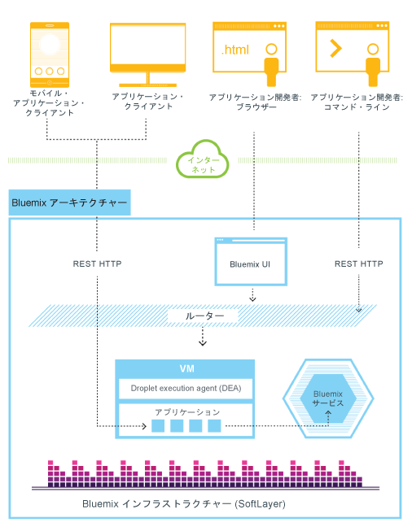
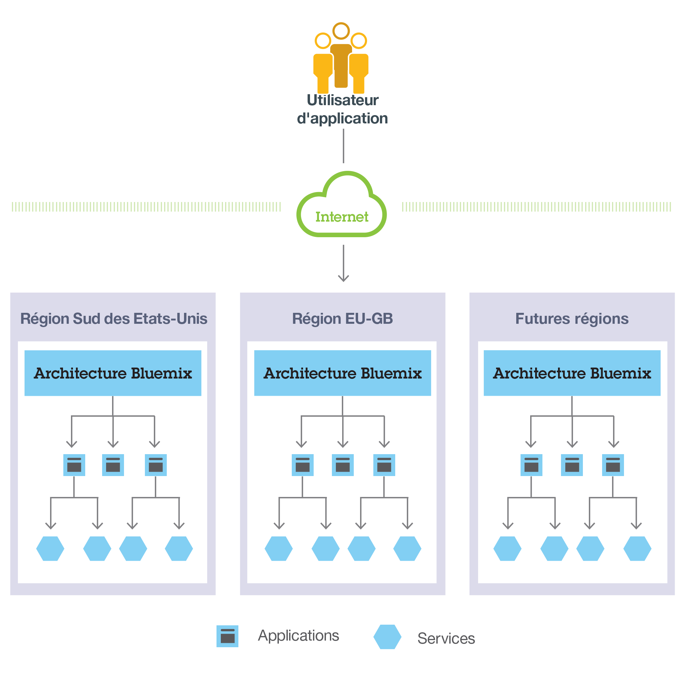
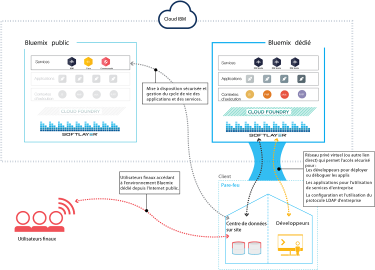
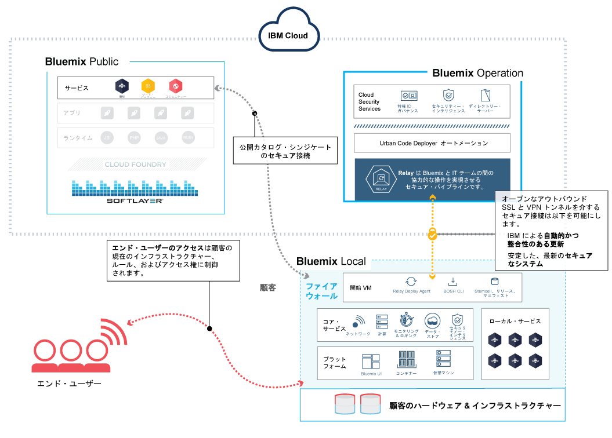
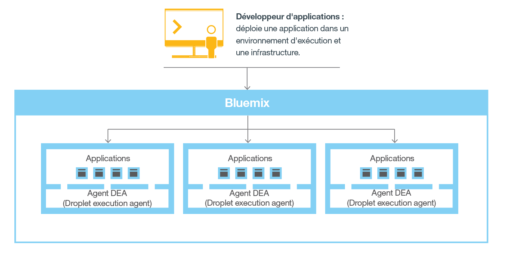
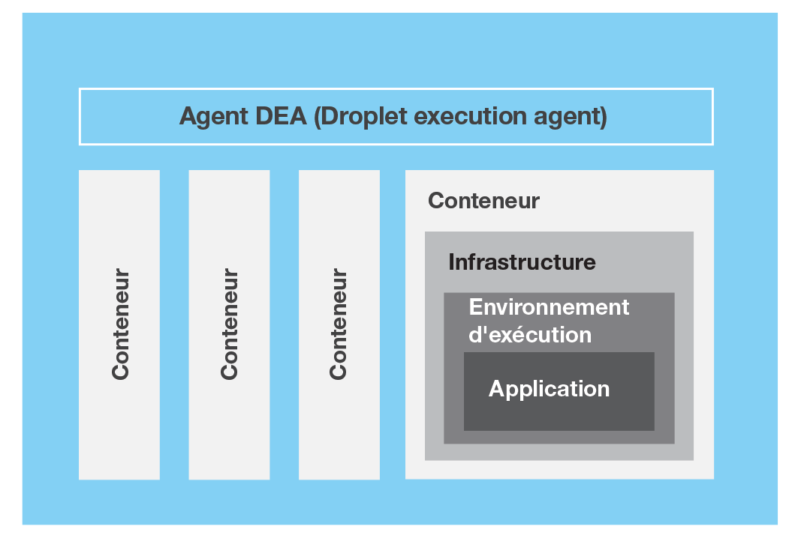
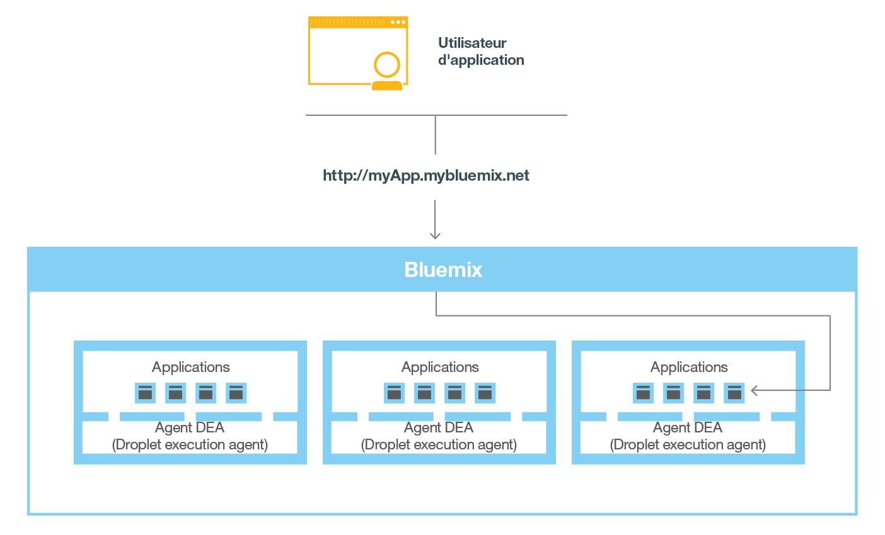

---

 

copyright:

  years: 2014, 2016

 

---

{:shortdesc: .shortdesc} 
{:new_window: target="_blank"}

# {{site.data.keyword.Bluemix_notm}} の概要
{: #overview}

*最終更新日: 2016 年 5 月 9 日*

{{site.data.keyword.Bluemix}} は {{site.data.keyword.IBM}} のオープン・クラウド・プラットフォームであり、モバイルおよび Web の開発者はこれにより、統合、セキュリティー、トランザクション、およびその他の主要な機能のために {{site.data.keyword.IBM_notm}} ソフトウェアにアクセスするほか、ビジネス・パートナーのソフトウェアにもアクセスすることができます。
{:shortdesc}

[Cloud Foundry](https://www.cloudfoundry.org/){: new_window} オープン・ソース・テクノロジーに基づいて構築された {{site.data.keyword.Bluemix_notm}} は、Platform as a Service (PaaS) を使用したアプリケーション開発をより容易にします。{{site.data.keyword.Bluemix_notm}} では、事前構築済みの Mobile Backend as a Service (MBaaS) 機能も提供されています。その目的は、すぐに使用可能なサービスを提供し、インターネット規模の開発を可能にする機能をホストすることで、アプリの配信を単純化することにあります。

また、{{site.data.keyword.Bluemix_notm}} は、ユーザーのニーズに合ったクラウド・デプロイメントも提供します。ユーザーがこれから規模を拡大する予定の中小企業であっても、さらに分離を必要とする大企業であっても、境界線のないクラウド内で開発を行うことが可能です。ユーザーはこのクラウドで、{{site.data.keyword.IBM_notm}} またはサード・パーティー・プロバイダーが提供する Public {{site.data.keyword.Bluemix_notm}} サービスに独自の専用サービスを接続することができます。すべてのサービス・インスタンスは、{{site.data.keyword.IBM_notm}} によって管理されます。ユーザーが受け取るのは、ユーザーが使用すると選択したサービスのみに対する 1 通の請求書になります。

{{site.data.keyword.Bluemix_notm}} に用意された一連の広範なサービスおよびランタイムにより、開発者は柔軟に制御できるようになり、また、予測分析からビッグデータまでさまざまなデータ・オプションを利用できるようになります。

{{site.data.keyword.Bluemix_notm}} には以下の機能が用意されています。


- Web アプリやモバイル・アプリの迅速なビルドおよび拡張を可能にする広範囲なサービス。
- アプリケーションの変更を継続的に配信するための処理能力。
- 目的に合ったプログラミング・モデルおよびサービス。
- サービスおよびアプリの管理の容易性。
- 最適化された柔軟なワークロード。
- 継続的な可用性。

{{site.data.keyword.Bluemix_notm}} は、クラウド・ベースのアプリのホスティングおよび管理に関連する複雑性の大部分を抽象化し、見えなくします。アプリケーション開発者は、アプリをホストするのに必要なインフラストラクチャーを管理せずに済み、アプリの開発に集中することができます。モバイル・アプリと Web アプリの両方で、{{site.data.keyword.Bluemix_notm}} で提供されている事前構築済みサービスを使用することができます。Web アプリを {{site.data.keyword.Bluemix_notm}} にアップロードし、実行するインスタンスの数を指定することができます。アプリのデプロイ後は、アプリの使用量や負荷が変わったときに、簡単にそのアプリをスケールアップまたはスケールダウンすることができます。

{{site.data.keyword.Bluemix_notm}} を使用すると、最もよく使用されているプログラミング言語でアプリを素早く開発することができます。モバイル・アプリは、iOS、Android、および JavaScript を使用した HTML での開発が可能です。Web アプリの場合、Ruby、PHP、Java&trade;、Go、および Python などの言語を使用できます。また、既存のアプリを {{site.data.keyword.Bluemix_notm}} にマイグレーションし、{{site.data.keyword.Bluemix_notm}} が提供しているランタイムを使用してアプリを実行することもできます。

また、{{site.data.keyword.Bluemix_notm}} は、アプリが使用するミドルウェア・サービスも提供します。{{site.data.keyword.Bluemix_notm}} は、新規サービス・インスタンスをプロビジョンする際にアプリの代わりに機能し、それらのサービスをアプリにバインドします。サービスの管理をインフラストラクチャーにまかせ、ユーザーのアプリはそのアプリ本来の仕事を実行できます。

一般に、{{site.data.keyword.Bluemix_notm}} でアプリを実行する際にオペレーティング・システムやインフラストラクチャー層について気にする必要はありません。ルート・ファイル・システムやミドルウェア・コンポーネントなどの層は抽象化されているため、ユーザーはアプリケーション・コードに集中できます。ただし、アプリケーションがどこで実行されているか詳細を知る必要がある場合は、これらの層について詳しく学ぶことができます。
詳しくは、『[{{site.data.keyword.Bluemix_notm}} のインフラストラクチャー層の表示 (Viewing [ infrastructure layers)](../cli/vcapsvc.html#viewinfra)(../cli/vcapsvc.html#viewinfra)]』を参照してください。 

## {{site.data.keyword.Bluemix_notm}} アーキテクチャー
{: #ov_arch}

{{site.data.keyword.Bluemix_notm}} では、パブリック {{site.data.keyword.Bluemix_notm}} プラットフォームにアクセスすることも、専用の {{site.data.keyword.Bluemix_notm}} プラットフォームをセットアップすることも、あるいはその両方を使用することもできます。

### {{site.data.keyword.Bluemix_notm}} Public
{: #public}

根本的に、{{site.data.keyword.Bluemix_notm}} は、ユーザーがアプリを開発し、すぐに使用できる機能を提供するサービスを使用するための環境です。また、{{site.data.keyword.Bluemix_notm}} は、Liberty などのアプリケーション・サーバー上で実行されるアプリケーション成果物をホストする環境も提供します。{{site.data.keyword.Bluemix_notm}} は SoftLayer を使用して、デプロイされた各アプリをホストする仮想コンテナーをデプロイします。この環境では、アプリは事前構築済みのサービス (サード・パーティーのサービスを含む) を使用して、アプリのアセンブリーを容易にすることができます。

開発者は、ブラウザー・ベースのユーザー・インターフェースを使用して {{site.data.keyword.Bluemix_notm}} のインフラストラクチャーと対話することができます。また、cf という、Cloud Foundry コマンド・ライン・インターフェースを使用して、Web アプリをデプロイすることもできます。

クライアント (モバイル・アプリ、外部で稼動するアプリ、{{site.data.keyword.Bluemix_notm}} でビルドされるアプリ、あるいはブラウザーを使用している開発者) は {{site.data.keyword.Bluemix_notm}} でホストされているアプリと対話します。クライアントは、REST API または HTTP API を使用し、{{site.data.keyword.Bluemix_notm}} を経由して要求をアプリ・インスタンスまたはコンポジット・サービスのいずれかに経路指定します。

次の図は、{{site.data.keyword.Bluemix_notm}} アーキテクチャーの概要を示したものです。



*図 1. {{site.data.keyword.Bluemix_notm}} アーキテクチャー*

待ち時間またはセキュリティーを考慮して、アプリはさまざまな {{site.data.keyword.Bluemix_notm}} の地域にデプロイすることができます。1 つの地域にデプロイすることも、複数地域にまたがってデプロイすることも選択できます。
詳しくは、『[地域](#ov_intro__reg)』を参照してください。



*図 2. 複数地域のアプリケーション・デプロイメント*

### {{site.data.keyword.Bluemix_notm}} Dedicated
{: #dedicated}

{{site.data.keyword.Bluemix_notm}} Dedicated は、パブリック {{site.data.keyword.Bluemix_notm}} およびユーザー独自のネットワークの両方に対してセキュアに接続された、ユーザー専用の SoftLayer 環境です。{{site.data.keyword.Bluemix_notm}} Dedicated は、VPN または直接のネットワーク接続によってご使用のネットワーク上に置かれます。
単一テナントのハードウェアは、世界中のどの SoftLayer データ・センターでもセットアップできます。専用プラットフォームと専用サービスの管理は {{site.data.keyword.IBM_notm}} が行うので、ユーザーはカスタム・アプリの作成に集中することができます。また、{{site.data.keyword.IBM_notm}} は、ユーザーが選択したメンテナンス期間中に専用インスタンスのすべてのメンテナンスを実行します。

{{site.data.keyword.IBM_notm}} はご使用の専用環境で使用可能なサービスをいくつか用意していますが、ユーザーはすべてのパブリック・サービスに接続することができます。すべてのランタイムは専用環境で使用できます。{{site.data.keyword.Bluemix_notm}} のすべての専用デプロイメントには、追加コストなしで次の利点およびフィーチャーが含まれています。VPN、プライベート VLAN、ファイアウォール、ご使用の LDAP との接続性、既存のオンプレミス・データベースおよびアプリを利用する機能、 週 7 日 24 時間体制のオンサイト・セキュリティー、専用ハードウェア、および標準サポート。 



*図 3. {{site.data.keyword.Bluemix_notm}} Dedicated*

### {{site.data.keyword.Bluemix_notm}} Local
{: #local}

{{site.data.keyword.Bluemix_notm}} Local は、自社ファイアウォールの内側にあるデータ・センターにデプロイされる、お客様自身の {{site.data.keyword.Bluemix_notm}} インスタンスです。{{site.data.keyword.Bluemix_notm}} Local を使用すれば、{{site.data.keyword.Bluemix_notm}} Public とセキュアに接続して同期をとり続けることができます。

{{site.data.keyword.Bluemix_notm}} Local には、自分だけが使用できるローカル・サービスを表示する、プライベートのシンジケートされたカタログが含まれています。また、{{site.data.keyword.Bluemix_notm}} Public からシンジケートされて使用できるサービスも含まれています。すべてのランタイムがローカル環境で使用できます。{{site.data.keyword.Bluemix_notm}} のローカル・デプロイメントには、追加のコストがかからない次の利点とフィーチャーが含まれています: リレー管理テクノロジー、ご使用の LDAP との接続性、既存のオンプレミス・データベースとアプリの活用力、および標準のサポート。

IBM はリレー・テクノロジーを使用してお客様の環境のモニターと保守を確実に行います。その結果、お客様はビジネスに専念し続けることができます。リレーというのは、{{site.data.keyword.Bluemix_notm}} Local に同梱されている配信機能のことで、これにより、IBM は、更新を自動的かつ一貫して配信することが可能になるため、お客様は、最新で安定したセキュアなシステムを維持することができます。リレーは、開始仮想マシンを起点とするオープンなアウトバウンド SSL VPN トンネルを介して接続を達成します。このトンネルを使用して、IBM は、プラットフォーム、計算リソース、およびご使用のインスタンス向けサービスを提供し保守します。『[{{site.data.keyword.Bluemix_notm}} Local](../local/index.html#local)』を参照してください。



*図 4. {{site.data.keyword.Bluemix_notm}} Local*

開始仮想マシンは、リレーを介して IBM 運用センターにアウトバウンド接続されているネットワーク内にある、カスタマー・ファイアウォールの内側のネットワーク内で稼働します。{{site.data.keyword.Bluemix_notm}} プラットフォームのコンポーネントとコア・サービスは、専用の、分離された仮想ローカル・エリア・ネットワーク (VLAN) 内で実行されます。{{site.data.keyword.Bluemix_notm}} Local は、プライベート・サブネットに VLAN を使用します。パブリック VLAN ではなくプライベート・サブネットを使用した方がより安全であり、経路指定の問題を回避するのに役立ちます。

DataPower アプライアンスは、{{site.data.keyword.Bluemix_notm}} アプリケーション・ドメインへのアクセスを提供します。これらのアプライアンスは、ユーザーのイントラネットからアクセス可能なネットワークに接続します。アプリおよびサービスをデプロイするユーザーは、ユーザーのイントラネットからアクセス可能なネットワークからアクセスします。ユーザーは、アウトバウンド・インターネット・アクセスが可能な、7 つの IP アドレスを提供する必要があります。DataPower アプライアンスは、これらの顧客の IP アドレスから、分離された {{site.data.keyword.Bluemix_notm}} デプロイメントに経路指定します。ネットワークの仕様およびインフラストラクチャーの要件について詳しくは、『[{{site.data.keyword.Bluemix_notm}} Local のインフラストラクチャー要件](../local/index.html#localinfra)』を参照してください。

### {{site.data.keyword.Bluemix_notm}} の動作
{: #howwork}

アプリを {{site.data.keyword.Bluemix_notm}} にデプロイする場合は、そのアプリをサポートするのに十分な情報を使用して {{site.data.keyword.Bluemix_notm}} を構成する必要があります。

* モバイル・アプリの場合、{{site.data.keyword.Bluemix_notm}} には、モバイル・アプリがサーバーとの通信に使用するサービスなどの、モバイル・アプリケーションのバックエンドを表す成果物が含まれています。
* Web アプリの場合、適切なランタイムおよびフレームワークに関する情報が {{site.data.keyword.Bluemix_notm}} に伝達されるようにする必要があります。それにより、そのアプリを実行するのに適した実行環境をセットアップすることができます。

モバイルおよび Web の両方を含め、各実行環境は他のアプリの実行環境から分離されています。実行環境は、これらのアプリが同じ物理マシン上にあったとしても互いに分離されます。以下の図は、{{site.data.keyword.Bluemix_notm}} でのアプリのデプロイメント管理方法の基本的なフローを示しています。 



*図 5. アプリのデプロイ*

アプリを作成し、{{site.data.keyword.Bluemix_notm}} にデプロイすると、{{site.data.keyword.Bluemix_notm}} 環境は、そのアプリ、またはそのアプリが表す成果物の送信先となる適切な仮想マシン (VM) を決定します。モバイル・アプリの場合、モバイル・バックエンド・プロジェクションが {{site.data.keyword.Bluemix_notm}} 上に作成されます。クラウドで実行されるモバイル・アプリのコードはすべて、結局は {{site.data.keyword.Bluemix_notm}} 環境で実行されます。
Web アプリの場合、クラウドで実行されるコードは、開発者が {{site.data.keyword.Bluemix_notm}} にデプロイするアプリ自体です。VM の決定は、以下を含むいくつかの要因に基づいて行われます。

* マシン上に既に存在する負荷
* その VM がサポートするランタイムまたはフレームワーク

VM が選択された後、各 VM 上のアプリケーション・マネージャーは、そのアプリに適切なフレームワークとランタイムをインストールします。その後、アプリをそのフレームワークにデプロイすることができます。デプロイメントが完了すると、アプリケーション成果物が開始されます。

以下の図は、複数のアプリがデプロイされている VM (Droplet Execution Agent (DEA) とも呼ばれる) の構造を示しています。 



*図 6. VM の設計*

各 VM で、アプリケーション・マネージャーは {{site.data.keyword.Bluemix_notm}} インフラストラクチャーの残りの部分と通信し、この VM にデプロイされたアプリを管理します。各 VM には、アプリを分離し保護するためのコンテナーがあります。それぞれのコンテナーに、{{site.data.keyword.Bluemix_notm}} は各アプリに必要な、適切なフレームワークとランタイムをインストールします。

アプリがデプロイされた時、そのアプリに Web インターフェース (Java Web アプリ用など)、またはその他の REST ベースのサービス (モバイル・アプリに公開されているモバイル・サービスなど) が含まれている場合、そのアプリのユーザーは、通常の HTTP 要求を使用してそのインターフェースまたはサービスと通信することができます。



*図 7. {{site.data.keyword.Bluemix_notm}} アプリの呼び出し*

各アプリは、そのアプリに関連付けられた 1 つ以上の URL を持つことができますが、それらはすべて {{site.data.keyword.Bluemix_notm}} エンドポイントを指していなければなりません。要求が着信すると、{{site.data.keyword.Bluemix_notm}} はその要求を調べ、対象のアプリを判別し、要求を受け取るためのアプリのインスタンスのいずれか 1 つを選択します。 

### {{site.data.keyword.Bluemix_notm}} の回復力
{: #resiliency}

{{site.data.keyword.Bluemix_notm}} は、ユーザーのニーズに応じて拡張が容易であり、問題からの復旧する場合にも依然として可用性が高く、復旧速度も速い、スケーラブルで回復力のあるアプリおよびアプリケーション成果物をホストするよう設計されています。{{site.data.keyword.Bluemix_notm}} は、相互作用の状態をトラッキングするコンポーネント (ステートフル) とトラッキングしないコンポーネント (ステートレス) を分離します。この分離により、{{site.data.keyword.Bluemix_notm}} は必要に応じてアプリを柔軟に移動し、スケーラビリティーと回復力を確保できます。

アプリの 1 つ以上のインスタンスを実行させることができます。1 つのアプリに対して複数のインスタンスがある場合、そのアプリがアップロードされるのは 1 回のみです。ただし、{{site.data.keyword.Bluemix_notm}} は、要求された数のアプリ・インスタンスをデプロイし、それらをできる限り多くの VM に分散します。

アプリの外のステートフル・データ・ストア (例えば {{site.data.keyword.Bluemix_notm}} で提供されているいずれかのデータ・ストア・サービス上のステートフル・データ・ストア) にすべての永続データを保存する必要があります。メモリー内またはディスク上にキャッシュされたデータはすべて再始動後も使用できない可能性があるので、単一の {{site.data.keyword.Bluemix_notm}} インスタンスのメモリー・スペースまたはファイル・システムを、短い単一トランザクション・キャッシュとして使用できます。単一インスタンスのセットアップの場合、{{site.data.keyword.Bluemix_notm}} のステートレスな性質により、アプリへの要求が中断される可能性があります。ベスト・プラクティスは、アプリの可用性を確保するために、各アプリケーションに少なくとも 3 個のインスタンスを使用することです。

すべての {{site.data.keyword.Bluemix_notm}} インフラストラクチャー、Cloud Foundry コンポーネント、および {{site.data.keyword.IBM_notm}} 固有の管理コンポーネントが高い可用性を持っています。インフラストラクチャーの複数インスタンスを使用して、負荷のバランスが保たれます。

## {{site.data.keyword.Bluemix_notm}} の概念
{: #ov_intro}

{{site.data.keyword.Bluemix_notm}} は、アプリ、サービス、ビルドパック、およびその他のコンポーネントで構成されています。1 つの {{site.data.keyword.IBM_notm}} ID を使用して、アプリケーションを複数の異なる {{site.data.keyword.Bluemix_notm}} 地域にデプロイすることができます。

### 地域
{: #ov_intro__reg}

{{site.data.keyword.Bluemix_notm}} の地域は、アプリをデプロイ可能な定義済みの地理上の区域です。異なる地域で、
アプリケーション管理に同じ {{site.data.keyword.Bluemix_notm}} インフラストラクチャー、
課金に同じ使用量詳細ビューを使用して、アプリおよびサービス・インスタンスを作成できます。顧客に最も近い地域を選択して、この地域にアプリをデプロイすることで、アプリケーションの待ち時間を短くすることができます。
また、セキュリティー問題に対応するために、アプリケーション・データを保存しておく地域を選択することも可能です。
複数地域でアプリを構築すると、1 つの地域がダウンしても、別の地域にあるアプリが稼働し続けます。使用する各地域で、リソースの割当量は同じです。

{{site.data.keyword.Bluemix_notm}} ユーザー・インターフェースを使用すると、
別の地域に切り替えて、その地域のスペースで作業することができます。


cf コマンド・ライン・インターフェースを使用する場合は、cf api コマンドを使用して地域の API エンドポイントを指定し、作業する {{site.data.keyword.Bluemix_notm}} 地域に接続する必要があります。
例えば、
{{site.data.keyword.Bluemix_notm}} ヨーロッパ・英国地域に接続するには、次のコマンドを入力します。


```
cf api https://api.eu-gb.{{site.data.keyword.Bluemix_notm}}.net
```

Eclipse ツールを使用する場合は、{{site.data.keyword.Bluemix_notm}} サーバーを作成して地域の API エンドポイントを指定し、作業する {{site.data.keyword.Bluemix_notm}} 地域に接続する必要があります。
Eclipse ツールの使用について詳しくは、「[Deploying apps with IBM {{site.data.keyword.IBM_notm}} Eclipse Tools for {{site.data.keyword.Bluemix_notm}}](../manageapps/eclipsetools/eclipsetools.html#toolsinstall)」を参照してください。

各地域に固有の接頭部が割り当てられています。
{{site.data.keyword.Bluemix_notm}} には、次の地域と、地域接頭部が用意されています。
 

<!-- PRODUCTION ONLY: Ensure that URLs are production URLs, not stage1-->

| **地域名** | **地理的位置** | **地域接頭部** | **cf API エンドポイント** | **UI コンソール** |       
|-----------------|-------------------------|-------------------|---------------------|----------------|
| 米国南部地域 | ダラス、米国 | ng | api.ng.bluemix.net | console.ng.bluemix.net |
| 英国地域 | ロンドン、イングランド | eu-gb | api.eu-gb.bluemix.net | console.eu-gb.bluemix.net |
| シドニー地域 | シドニー、オーストラリア | au-syd | api.au-syd.bluemix.net | console.au-syd.bluemix.net |


*表 1. {{site.data.keyword.Bluemix_notm}} の地域リスト*

### インフラストラクチャー
{: #infrastructure}

{{site.data.keyword.Bluemix_notm}} では、コードを実行する方法として、Cloud Foundry、{{site.data.keyword.IBM_notm}} Containers、および Virtual Machines という 3 つを提供しています。{{site.data.keyword.IBM_notm}} Containers と Virtual Machines は、米国南部地域とヨーロッパ・英国地域のみで利用可能です。アプリをデプロイするための適切なインフラストラクチャーを選択することができます。 

<dl>
<dt>Cloud Foundry</dt>
    <dd>Cloud Foundry インフラストラクチャーで稼働しているアプリは、既存の Cloud Foundry アプリと連携し、{{site.data.keyword.Bluemix_notm}} カタログで使用可能な、どのサービスにもバインドすることができます。このインフラストラクチャーでは、アプリケーション・コードの作成および管理をユーザーが行い、それらのアプリを作動させるインフラストラクチャーの管理と保守については {{site.data.keyword.Bluemix_notm}} が対処します。</dd>
<dt>{{site.data.keyword.IBM_notm}}Containers</dt>
    <dd>{{site.data.keyword.IBM_notm}} Containers インフラストラクチャーを使用すれば、コンテナー・デプロイメントがサポートされている所ならどこでも Web アプリを実行することができます。*コンテナー* は、アプリを実行するために必要なすべてのものを保持するオブジェクトです。このインフラストラクチャーには、信頼できるイメージの専用レジストリーが含まれており、それらのイメージをアップロード、保管、および取得できるようになっています。その後、それらのイメージを {{site.data.keyword.Bluemix_notm}} で使用できるようにして、このプラットフォームでコンテナーを管理することができます。{{site.data.keyword.IBM_notm}} Containers インフラストラクチャーは、水平方向にも垂直方向にもスケーリングします。パブリック Docker ハブで提供されているすべてのイメージを使用することができ、Docker API およびコマンド・ライン・インターフェースを使用して、{{site.data.keyword.Bluemix_notm}} 上のコンテナーを管理できます。{{site.data.keyword.IBM_notm}} は、Containers レジストリーに、使用したり拡張したりできるパブリック・イメージも用意しています。
    {{site.data.keyword.IBM_notm}} Containers は、ホストされたクラウド環境で Docker コンテナーを実行するために使用されます。Docker は、コンテナーを実行するために使用する仮想環境にアプリをデプロイするエンジンを追加します。Docker は、コードの実行に使用できる環境も提供します。また、ユーザーの準備が整ったときに、コードを開発環境からテスト環境へ転送し、次に実稼働環境へ転送するための手段を提供します。

    {{site.data.keyword.IBM_notm}} Containers について詳しくは、『[{{site.data.keyword.IBM_notm}} Containers](../containers/container_index.html)』を参照してください。</dd>
<dt>{{site.data.keyword.IBM_notm}} {{site.data.keyword.virtualmachinesshort}} (ベータ版)</dt>
    <dd><p>{{site.data.keyword.IBM_notm}} {{site.data.keyword.virtualmachinesshort}} は {{site.data.keyword.IBM_notm}} {{site.data.keyword.Bluemix_notm}} に含まれるホストされたクラウド環境で、アプリケーションやそれらが実行されるミドルウェアを最大限に制御しながら、アプリケーションをビルド、実行、管理、およびモニターすることができます。{{site.data.keyword.virtualmachinesshort}} を使用すると、特にパブリック・クラウドにアプリケーションをデプロイした場合に、お客様のビジネス・ソリューションが他から分離されます。</p>
<p>    
OpenStack ソフトウェアを使用するパブリック・クラウドとプライベート (オンプレミス) クラウドで、仮想サーバーの実行と管理を行えます。{{site.data.keyword.Bluemix_notm}} UI または OpenStackClient (OSC) クライアントを使用することで、仮想サーバーを作成、起動、および管理できます。{{site.data.keyword.IBM_notm}} 提供の仮想サーバー・イメージを使用することも、独自のカスタム・イメージから仮想サーバーを作成することも可能です。{{site.data.keyword.IBM_notm}} {{site.data.keyword.Bluemix_notm}} 機能を使用することで、ロギング、自動スケーリング、モニタリングなど、クラウド・ベースのアプリケーションのホスティングおよび管理に関連する複雑性の大部分を取り除けます。OpenStack サービスと {{site.data.keyword.Bluemix_notm}} サービスを一緒に使用して、ハイブリッド・アプリケーションを構築して実行することができます。運用ポリシーとワークロード要求に基づき、必要に応じてインフラストラクチャー・リソースをプロビジョンできます。</p>
<p>
{{site.data.keyword.IBM_notm}} {{site.data.keyword.virtualmachinesshort}} について詳しくは、『[{{site.data.keyword.IBM_notm}} {{site.data.keyword.virtualmachinesshort}}](../virtualmachines/vm_index.html)』を参照してください。</p> </dd>
</dl>

### アプリケーション
{: #applications}

{{site.data.keyword.Bluemix_notm}} において、
アプリケーションまたは*アプリ* は開発者が作成中の成果物を表します。{{site.data.keyword.Bluemix_notm}} へのアプリのプッシュ方法に関係なく、{{site.data.keyword.Bluemix_notm}} と Cloud Foundry でのアプリケーション・ライフサイクルは同一です。詳しくは、「[How Applications Are Staged](https://docs.cloudfoundry.org/concepts/how-applications-are-staged.html)」を参照してください。

<dl>
<dt>モバイル・アプリ</dt>
    <dd>モバイル・アプリは {{site.data.keyword.Bluemix_notm}} 環境の外側で実行され、そのモバイル・アプリが公開されている対象のサービスを使用します。通常、これらのサービスは連携して動作し、そのアプリのバックエンド・プロジェクションを表します。また、{{site.data.keyword.Bluemix_notm}} は、コンテナー・ベース環境内のバックエンド・サーバーで実行した方がよいと開発者が考えるようなアプリ・コードもホストできます。</dd>
<dt>Web アプリ</dt>
    <dd>Web アプリは、ランタイムで実行または参照する必要があるすべてのコードで構成されています。Web アプリは、アプリをホストするために {{site.data.keyword.Bluemix_notm}} にアップロードされます。</dd>
</dl>

Java など、ソース・コードがランタイム・バイナリー・ファイルにコンパイルされる言語では、アップロードする必要があるのはバイナリー・ファイルのみです。

### サービス
{: #services}

*サービス* は、{{site.data.keyword.Bluemix_notm}} によってホストされるクラウド拡張機能です。サービスは、アプリの実行中のコードがすぐに使用できる機能を提供します。{{site.data.keyword.Bluemix_notm}} によって提供される事前定義サービスには、データベース、メッセージング、モバイル・アプリ用プッシュ通知、Web アプリ用 Elastic Caching などがあります。

{{site.data.keyword.Bluemix_notm}} で独自のサービスを作成することも可能です。
こうしたサービスの複雑性はさまざまです。ランタイム・ライブラリー内にある機能などの単純なユーティリティーである場合もあります。あるいは、ビジネス・プロセスのモデリング・サービスまたはデータベースで見られるような複雑なビジネス・ロジックである場合もあります。

{{site.data.keyword.Bluemix_notm}} は、サービスの新規インスタンスをプロビジョニングし、それらのサービス・インスタンスをアプリにバインドすることにより、サービスの使用を簡素化します。サービスの管理は {{site.data.keyword.Bluemix_notm}} によって自動的に処理されます。
{{site.data.keyword.Bluemix_notm}} で使用可能なすべてのサービスについては、{{site.data.keyword.Bluemix_notm}} ユーザー・インターフェース内のカタログをご覧ください。

### スターター
{: #starters}

*スターター* は、特定のビルドパックによって構成された、事前定義サービスとアプリ・コードを含むテンプレートです。スターターには、ボイラープレートとランタイムの 2 つのタイプがあります。スターターは、特定のプログラミング言語で書かれたアプリ・コード、またはアプリ・コードとサービス・セットの組み合わせの場合があります。

### ボイラープレート
{: #boilerplates}

{{site.data.keyword.Bluemix_notm}} で、*ボイラープレート* は、アプリとその関連ランタイム環境、および特定ドメイン用の事前定義サービスを含んでいます。ボイラープレートを使用すると、迅速に稼働中の状態にすることができます。例えば、「モバイル・クラウド」ボイラープレートを選択してモバイル・アプリと Web アプリをホストし、モバイル・アプリケーション・テンプレートと SDK を使用して、サーバー・サイド・スクリプトの開発時間を加速することができます。

### ランタイム
{: #runtimes}

*ランタイム* は、アプリを実行するために使用されるリソース・セットです。{{site.data.keyword.Bluemix_notm}} は、さまざまなタイプのアプリのコンテナーとしてランタイム環境を提供します。ランタイム環境は、ビルドパックとして {{site.data.keyword.Bluemix_notm}} 内に統合され、使用できるように自動的に構成されます。

### ビルドパック
{: #buildpacks}

ビルドパック は、ターゲット PaaS 上で実行するためのコードを作成するスクリプトのコレクションです。ビルドパックは、アプリのランタイム依存関係とフレームワーク依存関係を収集します。次に、それらをアプリと共にパッケージし、クラウドへのデプロイが可能なドロップレットを作成します。

アプリを {{site.data.keyword.Bluemix_notm}} にデプロイする時にビルドパックを指定しないと、組み込みビルドパックがデフォルトで使用されます。

<dl class="dl"><dt class="dt dlterm">組み込みの {{site.data.keyword.IBM_notm}} ビルドパック</dt>
<dd class="dd"><div class="p">
<!-- begin PRODUCTION ONLY -->
以下のリストは、{{site.data.keyword.IBM_notm}} が作成した組み込みビルドパックです。
<ul>
<li>Liberty for Java</li>
<li>Node.js</li>
</ul>
<!-- end PRODUCTION ONLY -->
</div>
</div>
</dd>
<dt class="dt dlterm">組み込みのコミュニティー・ビルドパック</dt>
<dd class="dd"><p class="p">{{site.data.keyword.Bluemix_notm}} では、Cloud Foundry コミュニティーにより提供される組み込みビルドパックを使用することもできます。組み込みのコミュニティー・ビルドパックのリストを表示するには、<span class="keyword cmdname">cf
buildpacks</span> コマンドを実行してください。</p>
</dd>
<dt class="dt dlterm">外部ビルドパック</dt>
<dd class="dd"><div class="p">{{site.data.keyword.Bluemix_notm}} が提供する組み込みビルドパックの中に必要なランタイムまたはフレームワークが見つからない場合は、外部から既存のビルドパックを調達して自分のアプリで使用することも可能です。外部ビルドパックは、ユーザーが独自のビルドパックとして使用できるよう、Cloud Foundry コミュニティーによって提供されます。<span class="keyword cmdname">cf push</span> コマンドを使用してアプリをデプロイする時にビルドパックを指定します。<div class="note note"><span class="notetitle">注:</span> 外部ビルドパックは {{site.data.keyword.IBM_notm}} によるサポートの対象とはなりません。このため、Cloud Foundry コミュニティーに連絡を取ってサポートを依頼することが必要になる場合があります。</div>
</div>
</dd>
</dl>


## SoR との統合
{: #sor}

{{site.data.keyword.Bluemix_notm}} は、クラウド環境内にある、SoR と SoE という 2 つの広範なカテゴリーのシステムを接続することで、開発者を支援します。

*SoR* にはビジネス・レコードを保管するアプリとデータベースが含まれており、標準化されたプロセスを自動化します。*SoE* は SoR の有用性を拡張する機能で、これによりユーザーが SoR をより有効に活用できるようになります。{{site.data.keyword.Bluemix_notm}} で作成するアプリと SoR を統合することで、ユーザーは次のアクションを実行できます。

 * セキュア・コネクターをオンプレミスにダウンロードしてインストールすることで、アプリとバックエンド・データベースとの間のセキュア通信を可能にする。
 * セキュアな方法でデータベースを呼び出す。
 * データベースとカスタマー・リレーションシップ・マネジメント・システムなどのバックエンド・システムとの統合フローから API を作成する。
 * アプリに対して公開したいスキーマおよびテーブルのみを公開する。
 * {{site.data.keyword.Bluemix_notm}} 組織管理者として、
自分の組織メンバーのみに表示されるプライベート・サービスとして API を公開する。

SoRを {{site.data.keyword.Bluemix_notm}} で作成するアプリと統合するには、Cloud Integration サービスを使用します。Cloud Integration サービスを使用すれば、Cloud Integration API を作成し、その API を組織のプライベート・サービスとして公開できます。

<dl>
<dt>Cloud Integration API</dt>
    <dd>Cloud Integration API により、Web API を通してファイアウォールの後ろにある SoR への保護されたアクセスが提供されます。Cloud Integration API を作成する際には、Web API を通してアクセスしたいリソースを選択し、許可されたオペレーションを指定し、API にアクセスするための SDK とサンプルを組み込みます。Cloud Integration API の作成方法について詳しくは、『[Cloud Integration API の作成 (Creating Cloud Integration APIs)](../services/CloudIntegration/index.html#cloudint_add_service)』を参照してください。</dd>
<dt>プライベート・サービス</dt>
    <dd>プライベート・サービスは、 Cloud Integration API、SDK、およびライセンス・ポリシーから構成されます。さらに、サービス・プロバイダーからのドキュメンテーションや他の項目がプライベート・サービスに含まれる場合もあります。
Cloud Integration API をプライベート・サービスとして公開できるのは、組織管理者のみです。自分が利用できるプライベート・サービスを表示するには、{{site.data.keyword.Bluemix_notm}} カタログで「プライベート (Private)」チェック・ボックスを選択します。
Cloud Integration サービスに接続せずに、プライベート・サービスを選択してアプリにバインドすることができます。プライベート・サービスのアプリへのバインドは、他の {{site.data.keyword.Bluemix_notm}} サービスの場合と同じ方法で行います。プライベート・サービスとして API を公開する方法については、プライベート・サービスとしての API の公開を参照してください。</dd>
</dl>

### シナリオ: SoR と接続するための機能豊富なモバイル・アプリを作成する
{: #scenario}

{{site.data.keyword.Bluemix_notm}} は、オンプレミス・データをやりとりするアプリを提供するために、モバイル・アプリ、クラウド・サービス、およびエンタープライズ SoR を統合できるプラットフォームを提供します。

例えば、ファイアウォールの背後のオンプレミスに存在するカスタマー・リレーションシップ・マネジメント・システムと対話するモバイル・アプリを作成することができます。ユーザーは、機能豊富なモバイル・アプリを作成できるように、SoR をセキュアな方法で呼び出して、{{site.data.keyword.Bluemix_notm}} のモバイル・サービスを活用することができます。

まず、統合開発者が、モバイル・バックエンド・アプリを {{site.data.keyword.Bluemix_notm}} で作成します。統合開発者は、自分が一番熟知している Node.js ランタイムを使用するモバイル・クラウド・ボイラープレートを使用します。

次に、{{site.data.keyword.Bluemix_notm}} ユーザー・インターフェース内で  サービスを使用し、セキュア・コネクターを介して Cloud Integration API を公開します。統合開発者はセキュア・コネクターをダウンロードし、オンプレミスにインストールして、API とデータベースとの間のセキュアな通信を可能にします。データベース・エンドポイントの作成後、すべてのスキーマを調べて、API としてアプリで使用できるようにしたいテーブルを抽出することができます。

統合開発者は、関心のある利用者にモバイル通知を送信するために  プッシュ・サービスを追加します。また、Twitter API で新規顧客のレコードが作成された際にツイートするために、ビジネス・パートナー・サービスも追加します。

次に、アプリケーション開発者が {{site.data.keyword.Bluemix_notm}} にログインし、Android 開発ツールキットをダウンロードして、統合開発者が作成した API を呼び出すコードを作成します。ユーザーが自分のモバイル・デバイスに情報を入力できるようにするモバイル・アプリを開発できます。その後、そのモバイル・アプリは顧客管理システムで顧客のレコードを作成します。レコードの作成時に、アプリはモバイル・デバイスに対して通知をプッシュし、その新規レコードに関するツイートを開始します。

## {{site.data.keyword.Bluemix_notm}} の各国語サポート
{: #lang}

{{site.data.keyword.Bluemix_notm}} は、英語以外の各国語をサポートします。ただし、{{site.data.keyword.Bluemix_notm}} で提供されるすべてのコンテンツが翻訳されるわけではありません。次の表は、{{site.data.keyword.Bluemix_notm}} でサポートされる各国語と言語コードをリストしています。

| **各国語** | **言語コード** |
|-------------------|---------------|
| ブラジル・ポルトガル語 | pt_BR |
| 英語 | en |
| フランス語  | fr |
| ドイツ語  | de |
| 日本語 | ja |
| 韓国語  | ko |
| イタリア語 | it |
| スペイン語 | es |
| 中国語 (簡体字) | zh_CN |
| 中国語 (繁体字) | zh_TW |

*表 2. サポートされる各国語と言語コード*

# 関連リンク
{: #rellinks}

## 関連リンク
{: #general}

* [{{site.data.keyword.Bluemix_notm}} の前提条件](https://developer.ibm.com/bluemix/support/#prereqs)
* [{{site.data.keyword.Bluemix_notm}} の新機能](../whatsnew/index.html)
* [{{site.data.keyword.Bluemix_notm}} の既知の問題](https://developer.ibm.com/bluemix/support/#issues)
* [{{site.data.keyword.Bluemix_notm}} 用語集](glossary/index.html)
* [{{site.data.keyword.Bluemix_notm}} 価格設定シート](https://console.{DomainName}/pricing/)
* [{{site.data.keyword.Bluemix_notm}}DevOps Services](https://hub.jazz.net)
* [Cloud Foundry](http://cloudfoundry.org/)
* [SoftLayer, an {{site.data.keyword.IBM_notm}} Company](http://www.softlayer.com/)
