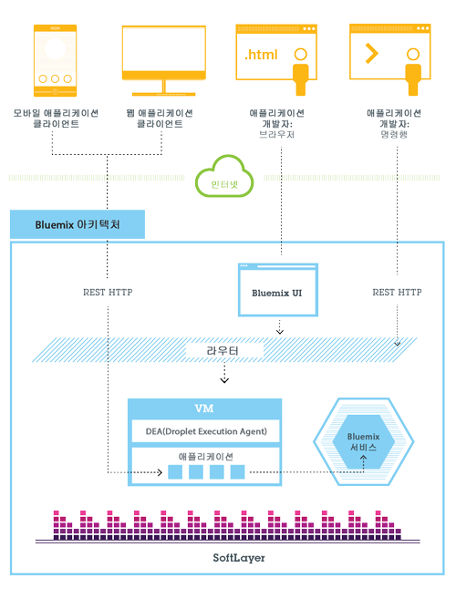
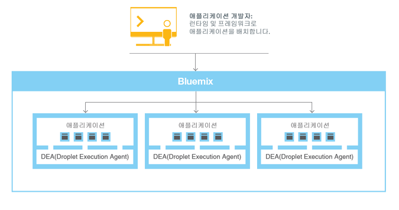
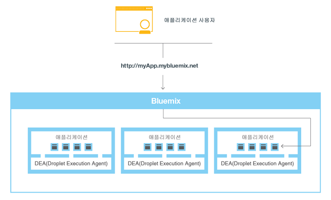

---


copyright:
  years: 2016, 2017
lastupdated: "2017-03-21"
---

{:shortdesc: .shortdesc}
{:new_window: target="_blank"}

# {{site.data.keyword.Bluemix_notm}} 개념
{: #bluemixoverview}

{{site.data.keyword.Bluemix}}는 PaaS(Platform as a Service)와 IaaS(Infrastructure as a Service)를 결합하는 {{site.data.keyword.IBM_notm}}의 혁신적인 클라우드 컴퓨팅 플랫폼입니다. 또한 {{site.data.keyword.Bluemix_notm}}에는 비즈니스 애플리케이션을 빠르게 빌드하기 위해 PaaS 및 IaaS와 쉽게 통합할 수 있는 클라우드 서비스의 강력한 카탈로그가 있습니다.
{:shortdesc}

{{site.data.keyword.Bluemix_notm}}에는 확장을 계획 중인 소기업이든 추가적인 분리가 필요한 대기업이든 규모에 관계없이 비즈니스의 요구사항에 적합한 클라우드 배치가 있습니다. 클라우드에서 경계 없이 개발할 수 있으며, 이를 통해 개인 서비스를 {{site.data.keyword.IBM_notm}}에서 제공하는 퍼블릭 {{site.data.keyword.Bluemix_notm}} 서비스에 연결할 수 있습니다. 사용자 및 사용자의 팀은 {{site.data.keyword.Bluemix_notm}}의 앱, 서비스 및 인프라에 액세스할 수 있으며 기존 데이터, 시스템, 프로세스, PaaS 도구 및 IaaS 도구를 사용할 수 있습니다. 개발자는 사용 가능한 서비스 및 런타임 프레임워크의 빠르게 성장하는 에코시스템을 활용하여 여러 언어로 쓰인 프로그래밍 접근을 통해 애플리케이션을 빌드할 수 있습니다.
 
{{site.data.keyword.Bluemix_notm}}를 사용하면 더 이상 하드웨어에 막대한 금액을 투자하여 새로운 앱을 테스트하거나 실행할 필요가 없습니다. 대신에 IBM이 모든 것을 관리하며 실제 사용량에 대해서만 금액을 청구합니다. {{site.data.keyword.Bluemix_notm}}는 퍼블릭, [데디케이티드](/docs/dedicated/index.html) 및 [로컬](/docs/local/index.html) 통합 배치 모델을 제공합니다.  

도입/인식(Inception)에서부터 개발 샌드박스, 글로벌하게 분배된 환경까지 {{site.data.keyword.IBM_notm}}, Watson 등에서 제공하는 컴퓨팅 및 스토리지 인프라, 오픈 소스 플랫폼 및 컨테이너 및 소프트웨어 서비스 및 도구를 사용하여 의견을 제시할 수 있습니다. 플랫폼 자체의 기능을 넘어 {{site.data.keyword.Bluemix}}는 유연한 배치를 제공합니다. 데디케이티드 프라이빗 클라우드 환경 또는 퍼블릭 클라우드에서 온프레미스 {{site.data.keyword.Bluemix}} 리소스를 프로비저닝하고 단일 대시보드의 세 가지 환경 모두에서 리소스를 관리하십시오. 
 
퍼블릭 및 데디케이티드 환경에 배치되는 모든 {{site.data.keyword.IBM_notm}} 클라우드 리소스는 사용자가 원하는 전세계의 {{site.data.keyword.CloudDataCent}} 위치에서 호스팅됩니다. {{site.data.keyword.CloudDataCents_notm}}는 지역 중복성, 모든 데이터 센터 및 PoP(Point of Presence)를 연결하는 글로벌 네트워크 백본, 엄격한 보안 제어 및 보고를 제공합니다. {{site.data.keyword.CloudDataCents_notm}}를 통해 {{site.data.keyword.IBM_notm}}은 가장 까다로운 확장, 보안, 규제 준수 및 데이터 주거성(residency) 요구사항을 충족시킬 수 있습니다.  

{{site.data.keyword.IBM_notm}}를 사용하면 다음을 수행할 수 있습니다.

* 전세계의 보안 {{site.data.keyword.CloudDataCents_notm}}에서 고성능 컴퓨팅 및 스토리지 인프라를 배치합니다.
* {{site.data.keyword.IBM_notm}}, 오픈 소스 커뮤니티 및 써드파티 개발자로부터 광범위한 클라우드 서비스 및 기능을 테스트하고 채택합니다. 
* 사설 네트워크 및 API 기능을 통해 단일, 확장, 클라우드 플랫폼에서 모든 레거시 시스템 및 앱에 연결합니다. 
* 비즈니스 또는 워크로드 요구사항이 변화하는 데 따라 실시간으로 리소스를 강화하거나 약화시킬 수 있습니다. 

### 앱
{: #bluemixoverviewapplications}

앱 대시보드는 앱을 시작 및 실행하고 앱 실행 중에 관리하는 데 필요한 모든 것을 제공합니다. {{site.data.keyword.Bluemix_notm}}는 다양한 표준 유형 및 런타임을 제공합니다.

* 표준 유형은 특정 도메인에 대한 애플리케이션 및 그 연관된 런타임 환경과 사전 정의된 서비스의 템플리트입니다.  
* 런타임은 앱 실행에 사용되고 다른 유형의 앱을 위한 컨테이너로 제공되는 리소스 세트입니다. 

{{site.data.keyword.Bluemix_notm}}에서는 앱을 실행할 수 있도록 다양한 방법을 제공합니다(예: Cloud Foundry 및 {{site.data.keyword.containerlong}}). {{site.data.keyword.containerlong}}를 사용하여 {{site.data.keyword.Bluemix_notm}}의 호스팅된 클라우드 환경에 Docker 컨테이너를 실행하십시오.  

분산형, 이벤트 구동 컴퓨팅에 {{site.data.keyword.openwhisk}}를 사용할 수 있습니다. {{site.data.keyword.openwhisk_short}}는 HTTP를 통한 웹 또는 모바일 앱에서의 직접 호출이나 이벤트에 응답하여 애플리케이션 로직을 실행합니다. 
 
{{site.data.keyword.Bluemix_notm}} Mobile 서비스를 사용하여 미리 빌드되고 관리되며 확장 가능한 클라우드 서비스를 사용자의 모바일 앱에 통합할 수 있습니다.  

### 서비스
{: #bluemixoverviewservices}

서비스 대시보드는 {{site.data.keyword.IBM}} 및 써드파티 제공업체에서 사용 가능한 {{site.data.keyword.Bluemix_notm}} 서비스에 대한 액세스 권한을 제공합니다. Watson, Internet of Things, Analytics, Mobile 및 DevOps 서비스가 여기에 해당됩니다. 

* {{site.data.keyword.IBM_notm}} DevOps 서비스 및 {{site.data.keyword.Bluemix_notm}} Garage Method를 사용하여 필요한 기능이 포함된 혁신적인 새 애플리케이션을 더욱 빠르고 저렴하게 제공합니다. DevOps 사례를 채택하고 혁신과 민첩성이 요구되는 문화를 조성하는 경우 반복적으로 시행하여 시장 상황에 따라 방향을 바꿀 수 있습니다. 
* 블록체인은 비즈니스 프로세스를 간소화하면서 신뢰, 책임 및 투명성을 확립하는 차세대 트랜잭션 애플리케이션을 위한 피어 투 피어 분산 원장 기술입니다.   
* Watson은 사용자의 앱에 음성, 영상 및 데이터 API의 전체 세트로 코그너티브 컴퓨팅의 강력함을 제공합니다. Watson 서비스를 통해 코그너티브 플랫폼을 배치하여 가장 복잡한 비즈니스 문제점을 해결하십시오. 
* {{site.data.keyword.IBM_notm}}를 통해 풍부한 통합 클라우드 데이터베이스, Data & Analytics 서비스로 더 많은 작업을 수행할 수 있습니다. 
* {{site.data.keyword.IBM_notm}} Internet of Things 서비스를 사용하여 앱은 연결된 디바이스, 센서 및 게이트웨이와 통신하고 여기서 수집한 데이터를 이용할 수 있습니다. IBM이 제안하는 방법을 사용하여 Internet of Things 클라우드에 연결된 디바이스를 쉽게 얻을 수 있습니다. 그러면 앱에서 실시간 및 REST API를 사용하여 디바이스와 통신하고 수집하도록 설정된 데이터를 이용할 수 있습니다.  
* {{site.data.keyword.IBM_notm}}는 멀티플랫폼, 기본 또는 하이브리드 앱을 모니터하고 테스트하는 동시에 이들을 빌드할 수 있는 모바일 백엔드 인프라를 제공합니다. 또한 분석, 보안, 사용자 통찰력 및 Continuous Delivery를 사용하여 앱을 개선시킬 수도 있습니다.  
 
{{site.data.keyword.Bluemix_notm}}는 사용해 볼 수 있는 시범 서비스도 제공합니다. 서비스 유형 및 가용성에 대한 자세한 정보는 [{{site.data.keyword.Bluemix_notm}} 서비스](/docs/services/index.html)를 참조하십시오.


### 인프라
{: #bluemixoverviewinfrastructure}

인프라 대시보드는 클라우드 인프라 요구사항을 충족시킬 수 있도록 다양한 서비스를 제공합니다. 

{{site.data.keyword.Bluemix_notm}} 인프라는 사용 가능한 고성능 클라우드 인프라를 제공합니다. {{site.data.keyword.Bluemix_notm}} 인프라는 광범위한 클라우드 컴퓨팅 옵션으로 전세계의 데이터 센터를 가져온 후 모든 것을 통합하고 자동화하는 플랫폼입니다. {{site.data.keyword.CloudDataCents_notm}}는 첫 번째 클래스 컴퓨팅, 스토리지 및 네트워킹 장비로 구성됩니다. 각 위치는 동일한 방식으로 빌드되고 공급되고 작동되므로 모든 영역에서 동일한 기능 및 가용성을 정확하게 얻을 수 있습니다. 위치는 개별 퍼블릭, 사설 및 내부 관리 네트워크를 통합하여 더 낮은 전체 네트워킹 비용, 더 나은 액세스 및 더 빠른 속도를 제공하는 산업의 가장 고급 네트워크 내 네크워크로 연결됩니다. 또한 데이터 센터 및 네트워크는 단일 개인 기업 관리 시스템을 공유합니다. 하나의 관리 도구를 사용하면 모든 베어메탈 서버, 가상 서버 및 API로 액세스 가능한 스토리지 디바이스 및 모바일 애플리케이션을 모두 제어할 수 있습니다. 

{{site.data.keyword.Bluemix_notm}} 인프라는 완벽한 단일 플랫폼에서 강력한 베어메탈 서버 및 유연한 가상 서버를 제공합니다. 모든 것은 요청 시 제공되며 월별 및 시간별로 빌드됩니다. 베어메탈 서버는 프로세서 중심 및 디스크 I/O 중심 워크로드에 대한 원시 마력을 제공하며 사용자의 정확한 스펙으로 구성될 수 있습니다. 가상 서버는 배치의 빠른 속도, 유연한 확장성 및 종량과금제 청구를 허용합니다. 고성능 컴퓨팅을 위해 시간별 또는 월별로 사용 가능한 GPU(Graphics Processing Unit) 서버를 사용하여 클라우드의 효과를 증대시키십시오.  

{{site.data.keyword.Bluemix_notm}} 인프라 오퍼링은 3계층 네트워크, 퍼블릭, 사설 및 관리 트래픽 세분화에 연결됩니다. 고객의 {{site.data.keyword.Bluemix_notm}} 계정에 대한 인프라는 무료로 사설 네트워크에서 데이터를 서로 전송할 수 있습니다. 베어메탈 서버, 가상 서버 및 클라우드 스토리지와 같은 인프라 오퍼링은 퍼블릭 네트워크를 통해 {{site.data.keyword.Bluemix_notm}} 카탈로그(예: Watson 서비스, 컨테이너 또는 런타임)의 다른 애플리케이션 및 서비스에 연결합니다. 두 유형의 오퍼링 간의 데이터 전송은 표준 퍼블릭 네트워크 대역폭 비율로 측정되고 청구됩니다. 

## {{site.data.keyword.Bluemix_notm}} 콘솔 사용
{: #bluemixoverviewui}

{{site.data.keyword.Bluemix_notm}} 콘솔에 액세스하는 경우 메뉴 표시줄은 둥록, 로그인, 문서 액세스 및 카탈로그 액세스에 필요한 링크 및 단추를 표시합니다. 로그인 후 메뉴 표시줄에는 계정 유형에 따라 햄버거 메뉴  및 추가 링크가 포함됩니다. 

* 새 {{site.data.keyword.Bluemix_notm}} 사용자인 경우 햄버거 메뉴 를 사용하여 앱, 서비스 및 인프라 대시보드 간에 전환할 수 있습니다. **카탈로그** 링크를 사용하여 플랫폼과 인프라 서비스에 액세스할 수 있습니다. 지원 및 계정, 청구 및 사용, 보안 관리 옵션 링크도 표시됩니다.
* {{site.data.keyword.Bluemix_notm}} 계정이 있는 기존 사용자인 경우 햄버거 메뉴 를 사용하여 앱, 서비스 또는 인프라 대시보드 간에 전환할 수 있습니다. **카탈로그**를 사용하여 플랫폼과 인프라 서비스에 액세스할 수 있으며, 플랫폼 레벨 지원 및 계정, 청구 및 사용, 보안 관리 옵션 링크가 표시됩니다.
* 기존 사용자이며 사용자의 {{site.data.keyword.Bluemix_notm}} 및 {{site.data.keyword.BluSoftlayer}} 계정이 연결되어 있는 경우 햄버거 메뉴 를 사용하여 앱, 서비스 및 인프라 대시보드 간에 전환할 수 있습니다. **카탈로그** 링크를 사용하여 플랫폼과 인프라 서비스에도 액세스할 수 있습니다. 
  * 앱과 서비스 대시보드에 있는 경우 메뉴 표시줄에는 {{site.data.keyword.Bluemix_notm}} 문서, 지원과 계정 및 보안 관리 옵션과 같은 플랫폼 레벨 리소스에 대한 링크가 포함되어 있습니다. 인프라 레벨 청구 옵션에 대한 링크에도 액세스할 수 있습니다. 
  * 인프라 대시보드에 있는 경우 메뉴 표시줄에는 KnowledgeLayer 도움말, 연락처 옵션, 알림, 열린 티켓 및 지원과 계정 관리 옵션 등의 인프라 레벨 리소스에 대한 링크가 표시됩니다.
* {{site.data.keyword.Bluemix_notm}}에 링크되지 않은 {{site.data.keyword.BluSoftlayer}} 계정을 사용하는 기존 사용자인 경우 햄버거 메뉴 을 사용하여 인프라 대시보드에 액세스하고 **카탈로그** 링크를 사용하여 인프라 서비스에 액세스할 수 있습니다. 메뉴 표시줄에는 KnowledgeLayer 도움말, 연락처 옵션, 알림, 열린 티켓 및 지원과 계정 옵션에 대한 링크도 포함됩니다.

## {{site.data.keyword.Bluemix_notm}} Cloud Foundry 아키텍처
{: #architecture}

일반적으로 Cloud Foundry의 {{site.data.keyword.Bluemix_notm}}에서 앱을 실행할 때 운영 체제 및 인프라 계층에 대해서는 우려할 필요가 없습니다. 사용자가 자신의 애플리케이션 코드에 집중할 수 있도록 루트 파일 시스템 및 미들웨어 컴포넌트 등의 계층은 추상화됩니다. 단, 앱이 실행되는 특정 계층에 대한 지식이 필요한 경우에는 해당 계층에 대해 자세히 볼 수 있습니다.  

세부사항은 [{{site.data.keyword.Bluemix_notm}} 인프라 계층 보기](/docs/manageapps/infra.html#viewinfra)를 참조하십시오. 

개발자는 브라우저 기반 사용자 인터페이스를 사용하여 {{site.data.keyword.Bluemix_notm}} 인프라와 상호 작용할 수 있습니다. 또한 cf라는 Cloud Foundry 명령행 인터페이스를 사용하여 웹 앱을 배치할 수도 있습니다. 

모바일 앱, 외부에서 실행되는 앱, {{site.data.keyword.Bluemix_notm}}에서 빌드된 앱 또는 브라우저를 사용하는 개발자일 수 있는 클라이언트는 {{site.data.keyword.Bluemix_notm}}에서 호스팅되는 앱과 상호 작용합니다. 클라이언트는 REST 또는 HTTP API를 사용하여 {{site.data.keyword.Bluemix_notm}}를 통해 앱 인스턴스 또는 복합 서비스 중 하나로 요청을 라우팅합니다.

다음 그림은 상위 레벨 {{site.data.keyword.Bluemix_notm}} Cloud Foundry 아키텍처를 보여줍니다. 



그림 1. {{site.data.keyword.Bluemix_notm}} Cloud Foundry 아키텍처

대기 시간이나 보안을 고려하여 앱을 다른 {{site.data.keyword.Bluemix_notm}} 지역에 배치할 수 있습니다. 한 지역에 배치하거나 여러 지역에 걸쳐 배치할지 선택할 수 있습니다. 자세한 정보는 [지역](whatisbluemix.html#ov_intro_reg)을 참조하십시오.


그림 2. 다중 지역 애플리케이션 배치

## {{site.data.keyword.Bluemix_notm}} Cloud Foundry 작동 방법
{: #howwork}

앱을 {{site.data.keyword.Bluemix_notm}} Cloud Foundry에 배치할 때 앱을 지원하는 데 충분한 정보로 {{site.data.keyword.Bluemix_notm}}를 구성해야 합니다. 

* 모바일 앱의 경우 {{site.data.keyword.Bluemix_notm}}에는 모바일 앱의 백엔드(예: 모바일 앱이 서버와 통신하는 데 사용하는 서비스)를 나타내는 아티팩트가 포함됩니다. 
* 웹 앱의 경우 런타임 및 프레임워크 관련 정보가 {{site.data.keyword.Bluemix_notm}}에 전달되는지 확인하여 {{site.data.keyword.Bluemix_notm}}가 앱을 실행하기 위한 적절한 실행 환경을 설정할 수 있도록 해야 합니다. 

모바일 및 웹 모두를 포함하여, 각 실행 환경은 다른 앱의 실행 환경에서 격리됩니다. 이러한 실행 환경은 앱이 동일한 물리적 시스템에 있더라도 격리됩니다. 다음 그림은 {{site.data.keyword.Bluemix_notm}} Cloud Foundry가 앱의 배치를 관리하는 방법에 대한 기본 플로우를 보여줍니다. 



그림 3. 앱 배치

앱을 작성하고 이를 {{site.data.keyword.Bluemix_notm}} Cloud Foundry에 배치할 때 {{site.data.keyword.Bluemix_notm}} 환경에 따라 앱 및 이 앱이 나타내는 아티팩트를 보낼 적절한 가상 서버가 결정됩니다. 모바일 앱의 경우 모바일 백엔드 투영이 {{site.data.keyword.Bluemix_notm}}에 작성됩니다. 클라우드에서 실행 중인 모바일 앱의 코드는 {{site.data.keyword.Bluemix_notm}} 환경에서 실행됩니다. 웹 앱의 경우 클라우드에서 실행 중인 코드는 개발자가 {{site.data.keyword.Bluemix_notm}}에 배치하는 앱 자체입니다. 가상 서버는 다음을 포함하여 여러 요인을 기반으로 결정됩니다.

* 시스템의 기존 로드
* 해당 가상 서버에서 지원되는 런타임 또는 프레임워크

가상 서버를 선택한 후 각 가상 서버의 애플리케이션 관리자에서 앱에 적절한 프레임워크 및 런타임을 설치합니다. 그런 다음 앱이 해당 프레임워크로 배치될 수 있습니다. 배치가 완료되면 애플리케이션 아티팩트가 시작됩니다.

다음 그림은 여러 앱이 배치되어 있고 DEA(Droplet Execution Agent)라고도 하는 가상 서버의 구조를 보여줍니다.


그림 4. 가상 서버 디자인

각 가상 서버에서 애플리케이션 관리자는 {{site.data.keyword.Bluemix_notm}} 인프라의 나머지 부분과 통신하고 이 가상 서버에 배치되는 앱을 관리합니다. 각 가상 서버는 앱을 분리하고 보호하기 위한 컨테이너를 가지고 있습니다. 각 컨테이너에서 {{site.data.keyword.Bluemix_notm}}는 각 앱에 필요한 적절한 프레임워크 및 런타임을 설치합니다. 

앱을 배치할 때 웹 인터페이스(예: Java 웹 앱) 또는 다른 REST 기반 서비스(예: 모바일 앱에 공개적으로 노출된 모바일 서비스)가 있으면 앱의 사용자가 일반적인 HTTP 요청을 사용하여 앱과 통신할 수 있습니다. 



그림 5. {{site.data.keyword.Bluemix_notm}} 앱 호출

각 앱은 하나 이상의 URL과 연관될 수 있지만 이 URL은 모두 {{site.data.keyword.Bluemix_notm}} 엔드포인트를 가리켜야 합니다. 요청이 들어오면 {{site.data.keyword.Bluemix_notm}}는 요청을 검사하고, 이 요청이 사용되는 앱을 결정한 다음, 요청을 수신할 앱 인스턴스를 선택합니다. 


### 지역
{: #ov_intro_reg}

{{site.data.keyword.Bluemix_notm}} 지역은 앱을 배치할 수 있는 정의된 지리적 영역입니다. 애플리케이션 관리를 위한 동일한 {{site.data.keyword.Bluemix_notm}} 인프라 및 요금 청구를 위한 동일한 사용량 세부사항을 사용하여 다른 지역에 앱 및 서비스 인스턴스를 작성할 수 있습니다. 고객과 가장 가까이에 있는 지역을 선택하고 이 지역에 앱을 배치하여 애플리케이션 대기 시간을 단축할 수 있습니다. 또한 보안 문제를 해결하기 위해 애플리케이션 데이터를 보관할 지역을 선택할 수도 있습니다. 앱을 여러 지역에서 빌드할 경우 이 중 한 지역의 사용 불가능하면 다른 지역에 있는 앱은 계속 실행됩니다. 허용되는 리소스 양은 사용하는 각 지역마다 동일합니다.

{{site.data.keyword.Bluemix_notm}} 사용자 인터페이스를 사용하는 경우 다른 지역으로 전환하여 해당 지역의 영역에 대해 작업할 수 있습니다. 사용자 계정 환경 설정 링크를 클릭하고 **지역** 선택기를 펼친 후 목록에서 필요한 지역을 선택하십시오. 

cf 명령행 인터페이스를 사용하여 작업하려는 {{site.data.keyword.Bluemix_notm}} 지역에 연결하는 경우 cf api 명령을 사용하고 지역의 API 엔드포인트를 지정하십시오. 예를 들어, {{site.data.keyword.Bluemix_notm}} 유럽 영국 지역에 연결하려면 다음 명령을 입력하십시오.

```
cf api https://api.eu-gb.{{site.data.keyword.Bluemix_notm}}.net
```

각 지역에 고유한 접두부가 지정됩니다. {{site.data.keyword.Bluemix_notm}}는 다음과 같은 지역 및 지역 접두부를 제공합니다. 

<!-- PRODUCTION ONLY: Ensure that URLs are production URLs, not stage1-->

| **지역 이름** | **지리적 위치** | **지역 접두부** | **cf API 엔드포인트** | **UI 콘솔** |       
|-----------------|-------------------------|-------------------|---------------------|----------------|
| 미국 남부 지역 | 댈러스, 미국 | ng | api.ng.bluemix.net | console.ng.bluemix.net |
| 영국 지역 | 런던, 영국 | eu-gb | api.eu-gb.bluemix.net | console.eu-gb.bluemix.net |
| 시드니 지역 | 시드니, 호주 | au-syd | api.au-syd.bluemix.net | console.au-syd.bluemix.net |
| 독일 지역 | 프랑크푸르트, 독일 | eu-de | api.eu-de.bluemix.net | console.eu-de.bluemix.net |
{: caption="표 1. {{site.data.keyword.Bluemix_notm}} 지역 목록" caption-side="top"}


### {{site.data.keyword.Bluemix_notm}} 복원성
{: #resiliency}

{{site.data.keyword.Bluemix_notm}}는 사용자 요구사항을 충족할 수 있도록 확장하고 고가용성을 유지하며 문제점에서 빠르게 복구할 수 있는, 확장 가능한 복원성을 갖춘 앱 및 애플리케이션 아티팩트를 호스팅하도록 디자인되었습니다. {{site.data.keyword.Bluemix_notm}}는 상호작용의 상태를 추적하는 컴포넌트(stateful)를 그렇지 않은 컴포넌트(stateless)와 구분합니다. 이러한 구분을 통해 {{site.data.keyword.Bluemix_notm}}는 확장성과 복원성을 달성하는 데 필요한 만큼 앱을 유연하게 이동할 수 있습니다.

앱에 대해
실행 중인 인스턴스가 하나 이상 있을 수 있습니다. 단일 앱이 여러 개 있는 경우 앱은 한 번만 업로드됩니다. 하지만 {{site.data.keyword.Bluemix_notm}}는 요청된 수의 앱 인스턴스를 배치하고 가능한 한 많은 가상 서버에 앱을 분배합니다.

앱 외부에 있는 Stateful 데이터 저장소(예: {{site.data.keyword.Bluemix_notm}}에서 제공하는 데이터 저장소 서비스 중 하나)에 모든 지속적 데이터를 저장해야 합니다. 다시 시작한 후에도 메모리 또는 디스크에 캐시된 항목을 사용하지 못할 수 있으므로 단일 {{site.data.keyword.Bluemix_notm}} 인스턴스의 메모리 공간 또는 파일 시스템을 간단한 단일 트랜잭션 캐시로 사용할 수 있습니다. 단일 인스턴스 설정을 사용하면 {{site.data.keyword.Bluemix_notm}}의 Stateless 특성 때문에 앱에 대한 요청이 중단될 수 있습니다. 앱의 가용성을 보장하기 위해 각 앱에 대해 3개 이상의 인스턴스를 사용하는 것이 좋습니다. 

모든 {{site.data.keyword.Bluemix_notm}} 인프라, Cloud Foundry 컴포넌트 및 {{site.data.keyword.IBM_notm}} 특정 관리 컴포넌트는 가용성이 높습니다. 인프라의 여러 인스턴스는 로드의 균형을 유지하는 데 사용됩니다.

### SOR(System of Record)과 통합
{: #sor}

{{site.data.keyword.Bluemix_notm}}는 클라우드 환경의 두 가지 광범위한 시스템 카테고리를 연결함으로써 개발자를 지원할 수 있습니다. 

* *SOR(System of Record)*에는 비즈니스 레코드를 저장하고 표준화된 프로세스를 자동화하는 앱 및 데이터베이스가 포함됩니다.  
* *SOE(System of Engagement)*는 SOR(System of Record)의 유용성을 확장하고 사용자에게 보다 광범위하게 적용할 수 있도록 만드는 기능입니다. 

{{site.data.keyword.Bluemix_notm}}에서 작성한 앱과 SOR(System of Record)을 통합하여 다음 조치를 수행할 수 있습니다.

 * 보안 커넥터 온프레미스를 다운로드하고 설치하여 앱과 백엔드 데이터베이스 간 보안 통신을 사용합니다. 
 * 데이터베이스를 안전한 방식으로 호출합니다.
 * 고객 관계 관리 시스템과 같은 데이터베이스와 백엔드 시스템이 있는 통합 플로우에서 API를 작성합니다. 
 * 앱에 노출할 스키마 및 테이블만 노출합니다.
 * {{site.data.keyword.Bluemix_notm}} 조직 관리자로서 조직 구성원에게만 표시되는 개인 서비스로 API를 공개합니다.
 
{{site.data.keyword.Bluemix_notm}}에서 작성한 앱과 SOR(System of Record)을 통합하려면 클라우드 통합 서비스를 사용합니다. 클라우드 통합 서비스를 사용하여 Cloud Integration API를 작성하고 API를 조직의 개인 서비스로 공개할 수 있습니다.

<dl>
<dt>Cloud Integration API</dt>
    <dd>Cloud Integration API는 웹 API를 통해 방화벽 뒤에 있는 SOR(System of Record)에 대한 보안 액세스를 제공합니다. Cloud Integration API를 작성할 때 웹 API를 통해 액세스하려는 리소스를 선택하고 허용되는 오퍼레이션을 지정하고 API에 액세스하기 위해 SDK와 샘플을 포함합니다. Cloud Integration API 작성 방법에 대한 자세한 정보는 [클라우드 통합 시작하기](/docs/services/CloudIntegration/CldInt_GetStart.html)를 참조하십시오. </dd>
<dt>개인 서비스</dt>
    <dd>개인 서비스는 Cloud Integration API, SDK 및 자격부여 정책으로 구성됩니다. 개인 서비스에는 서비스 제공업체가 제공하는 문서 또는 기타 항목도 포함될 수 있습니다. 조직 관리자만 Cloud Integration API를 개인 서비스로 공개할 수 있습니다. 사용자에게 제공되는 개인 서비스를 보려면 {{site.data.keyword.Bluemix_notm}} 카탈로그에서 개인 선택란을 선택하십시오. 클라우드 통합 서비스에 연결하지 않고 개인 서비스를 선택하고 앱에 바인딩할 수 있습니다. 다른 {{site.data.keyword.Bluemix_notm}} 서비스에서와 동일한 방식으로 개인 서비스를 앱에 바인딩합니다. API를 개인 서비스로 공개하는 방법에 대한 자세한 정보는 API를 개인 서비스로 공개를 참조하십시오. </dd>
</dl>

#### 시나리오: SOR(System of Record)에 연결할 RMA(Rich Mobile Application) 작성
{: #scenario}

{{site.data.keyword.Bluemix_notm}}는 온프레미스 데이터와 상호 작용하는 앱을 제공하기 위해 엔터프라이즈 SOR(System of Record), 모바일 앱 및 클라우드 서비스를 통합할 수 있는 플랫폼을 제공합니다.

예를 들어, 방화벽 뒤의 온프레미스에 있는 고객 관계 관리 시스템과 상호 작용하는 모바일 앱을 빌드할 수 있습니다. SOR(System of Record)을 안전한 방식으로 호출하고 RMA(Rich Mobile Application)를 빌드할 수 있도록 {{site.data.keyword.Bluemix_notm}}에서 모바일 서비스를 활용할 수 있습니다. 

먼저 통합 개발자가 {{site.data.keyword.Bluemix_notm}}에서 모바일 백엔드 앱을 작성합니다. 가장 친숙한 Node.js 런타임을 사용하는 모바일 클라우드 표준 유형을 사용합니다.

그런 다음 {{site.data.keyword.Bluemix_notm}} 사용자 인터페이스에서 클라우드 통합 서비스를 사용하여 보안 커넥터를 통해 API를 노출합니다. 통합 개발자는 보안 커넥터를 다운로드하고 이를 온프레미스로 설치하여 API와 데이터베이스 사이의 보안 통신을 지원합니다. 데이터베이스 엔드포인트를 작성한 후 모든 스키마를 보고 앱에 API로 노출할 테이블을 추출할 수 있습니다. 

통합 개발자는 푸시 서비스를 추가하여 모바일 알림을 관심 있는 이용자에게 제공합니다. 또한 새 고객 레코드가 Twitter API를 사용하여 작성된 경우 비즈니스 파트너 서비스도 트윗에 추가합니다.

그런 다음 애플리케이션 개발자가 {{site.data.keyword.Bluemix_notm}}에 로그인하고 Android 개발 툴킷을 다운로드하고 통합 개발자가 작성한 API를 호출하는 코드를 개발할 수 있습니다. 사용자가 모바일 디바이스에 관련 정보를 입력할 수 있는 모바일 앱을 개발할 수 있습니다. 그런 다음 모바일 앱이 고객 관리 시스템에서 고객 레코드를 작성합니다. 레코드가 작성되면 앱이 알림을 모바일 디바이스로 푸시하고 새 레코드에 대해 트윗을 시작합니다. 

## {{site.data.keyword.Bluemix_notm}} 전제조건
{: #prereqs}

{{site.data.keyword.Bluemix_notm}} 플랫폼 사용에 대한 전제조건은 제한되어 있으나 일부는 갖추고 있습니다.
{:shortdesc}

### 브라우저
{: #browsers}

다음 목록은 {{site.data.keyword.Bluemix_notm}}에 필요한 최소한의 브라우저 소프트웨어입니다. 

 * Chrome: 운영 체제용 최신 버전
 * Firefox: 운영 체제 및 ESR 45용 최신 버전
 * Internet Explorer: 버전 11
 * Safari: Mac용 최신 버전

### Cloud Foundry
{: #cf}

Cloud Foundry 명령행 인터페이스, 버전 6.5.1 이상 

# rellinks
{: #rellinks}
## general
{: #general}
* [{{site.data.keyword.Bluemix_notm}}의 개념 ](http://www.ibm.com/cloud-computing/bluemix/what-is-bluemix/){:new_window}
* [시작하기 ](http://www.ibm.com/cloud-computing/bluemix/getting-started/){:new_window}
* [{{site.data.keyword.Bluemix_notm}}의 새로운 기능](/docs/whatsnew/index.html)
* [하이브리드 모델 자세히 보기 ](http://www.ibm.com/cloud-computing/bluemix/hybrid/){:new_window}
* [계정 관리](/docs/admin/adminpublic.html#mngacct)
* [{{site.data.keyword.Bluemix_notm}} 용어집](/docs/overview/glossary/index.html)
