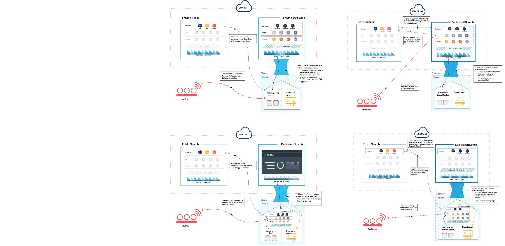
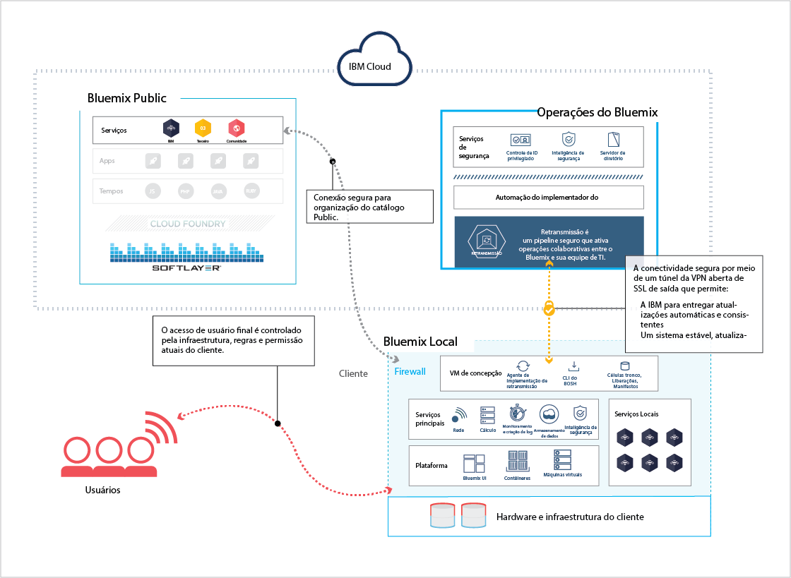
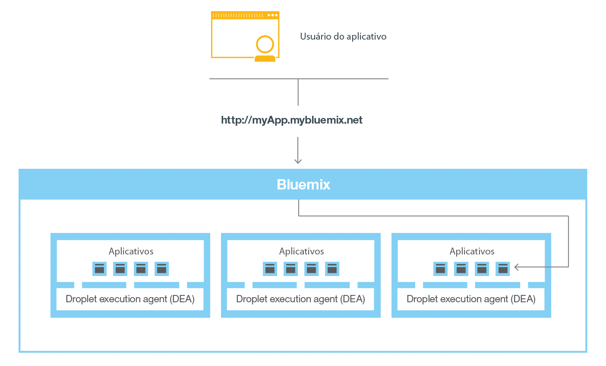

---

 

copyright:

  years: 2014, 2016

 

---

{:shortdesc: .shortdesc} 
{:new_window: target="_blank"}

# Visão geral do {{site.data.keyword.Bluemix_notm}}
{: #overview}

*Última atualização: 9 de maio de 2016*

{{site.data.keyword.Bluemix}} é a plataforma em nuvem
aberta da {{site.data.keyword.IBM}} que fornece aos
desenvolvedores móveis e da web acesso ao software
{{site.data.keyword.IBM_notm}} para integração,
segurança, transação e outras funções principais, como software de
parceiros de negócios.
{:shortdesc}

Baseado na tecnologia de software livre do [Cloud
Foundry](https://www.cloudfoundry.org/){: new_window}, o {{site.data.keyword.Bluemix_notm}} torna o desenvolvimento de aplicativos mais fácil com a plataforma como serviço (PaaS). O {{site.data.keyword.Bluemix_notm}} também fornece recursos de backend móvel como serviço (MBaaS) pré-integrados. O
objetivo é simplificar a entrega de um app fornecendo serviços que
estão prontos para uso imediato e recursos de hospedagem para
ativar o desenvolvimento de escala da Internet.

O {{site.data.keyword.Bluemix_notm}} também
possui implementações de nuvem que se ajustam às suas necessidades. Se
você é uma pequena empresa que pretende escalar ou uma grande empresa
que requer isolamento adicional, é possível o desenvolvimento
ilimitado em uma nuvem, na qual é possível conectar seus serviços
dedicados aos serviços públicos do {{site.data.keyword.Bluemix_notm}}
disponíveis a partir de fornecedores
{{site.data.keyword.IBM_notm}} e de terceiros. Todas as instâncias de serviço são gerenciadas pela {{site.data.keyword.IBM_notm}}. Você obterá uma fatura para somente o que escolher usar.

Com o amplo conjunto de serviços e tempos de execução no {{site.data.keyword.Bluemix_notm}},
o desenvolvedor obtém controle e flexibilidade, além de acesso a diversas
opções de dados, da análise preditiva a big data.

O {{site.data.keyword.Bluemix_notm}} fornece
os recursos a seguir:

- Um intervalo de serviços que permitem construir e estender apps da web
e móveis rapidamente.
- O poder de processamento para a entrega de mudanças
contínuas no aplicativo.
- Modelos de programação e serviços adequados para o propósito.
- Capacidade de gerenciamento de serviços e apps.
- Cargas de trabalho otimizadas e elásticas.
- Disponibilidade contínua.

O {{site.data.keyword.Bluemix_notm}} sumariza e oculta
a maioria das complexidades que estão associadas à hospedagem e
ao gerenciamento de apps baseados em nuvem. Como desenvolvedor de
aplicativos, é possível concentrar-se no desenvolvimento de seu app sem precisar gerenciar a infraestrutura que é necessária para hospedá-lo. Para apps móveis e da web, é possível usar os serviços pré-integrados que são fornecidos pelo {{site.data.keyword.Bluemix_notm}}. É possível fazer upload do app da web para o {{site.data.keyword.Bluemix_notm}} e
indicar quantas instâncias você deseja executar. Após a implementação dos apps, é possível facilmente aumentar ou reduzir
sua capacidade quando o uso ou o carregamento dos apps mudar.

É possível usar o {{site.data.keyword.Bluemix_notm}} para
desenvolver rapidamente apps nas linguagens de programação mais populares. É possível desenvolver apps móveis em iOS, Android e HTML com JavaScript. Para
apps da web, é possível usar linguagens como Ruby, PHP, Java&trade;,
Go e Python. Também é possível migrar apps existentes para o
{{site.data.keyword.Bluemix_notm}} e usar os tempos de
execução que o {{site.data.keyword.Bluemix_notm}}
fornece para executar seus apps.

O {{site.data.keyword.Bluemix_notm}} também fornece
serviços de middleware para uso por seus apps. O {{site.data.keyword.Bluemix_notm}}
age em nome do app quando ele fornece novas instâncias de serviço e, em
seguida, liga esses serviços ao app. O seu app pode executar sua tarefa real, deixando o gerenciamento dos serviços para a infraestrutura.

Em geral, você não precisa se preocupar com o sistema
operacional e as camadas de infraestrutura ao executar apps no {{site.data.keyword.Bluemix_notm}}. Camadas
como sistemas de arquivos raiz e componentes de middleware são abstraídas para que você possa focar em seu
código do aplicativo. No entanto, é possível saber mais sobre estas camadas se precisar de informações específicas sobre onde seu
app está sendo executado. Veja [Visualizando camadas de infraestrutura do {{site.data.keyword.Bluemix_notm}}](../cli/vcapsvc.html#viewinfra) para obter detalhes. 

## Arquitetura do {{site.data.keyword.Bluemix_notm}}
{: #ov_arch}

Com o {{site.data.keyword.Bluemix_notm}},
é possível acessar a plataforma {{site.data.keyword.Bluemix_notm}} pública, configurar uma plataforma {{site.data.keyword.Bluemix_notm}} dedicada ou ambas.

### {{site.data.keyword.Bluemix_notm}} Público
{: #public}

Em seu núcleo, o {{site.data.keyword.Bluemix_notm}} é
um ambiente para desenvolver apps e usar serviços que forneçam funções prontas para usar. O {{site.data.keyword.Bluemix_notm}} também
fornece um ambiente para hospedar artefatos de aplicativo que são executados em
um servidor de aplicativos, como o Liberty. Ao usar o SoftLayer, o {{site.data.keyword.Bluemix_notm}} implementa
contêineres virtuais que hospedam cada app implementado. Nesse ambiente,
o aplicativo pode usar serviços pré-integrados (incluindo serviços de
terceiros) para facilitar a montagem do app.

Como desenvolvedor, é possível interagir com a infraestrutura do {{site.data.keyword.Bluemix_notm}},
usando uma interface com o usuário baseada no navegador. Também é possível usar uma interface de linha de comandos Cloud Foundry, chamada cf, para implementar apps da web.

Os clientes---que podem ser apps móveis, apps executados
externamente, apps que são construídos no
{{site.data.keyword.Bluemix_notm}} ou desenvolvedores que
estejam usando navegadores---interagem com os apps hospedados pelo
{{site.data.keyword.Bluemix_notm}}. Os clientes usam APIs REST ou HTTP para rotear solicitações por meio do {{site.data.keyword.Bluemix_notm}} para
uma das instâncias do app ou para os serviços compostos.

A figura a seguir mostra a arquitetura de alto nível do {{site.data.keyword.Bluemix_notm}}.


*Figura 1.
Arquitetura do {{site.data.keyword.Bluemix_notm}}*

É possível implementar seus apps em diferentes regiões do {{site.data.keyword.Bluemix_notm}}, para considerações de latência ou segurança. É possível optar por implementar para uma região ou entre várias regiões. Para obter mais informações, consulte [Regiões](#ov_intro__reg).


*Figura 2. Implementação do aplicativo multiregion*

### {{site.data.keyword.Bluemix_notm}} Dedicated
{: #dedicated}

O {{site.data.keyword.Bluemix_notm}} Dedicated
é o seu próprio ambiente SoftLayer exclusivo que é seguramente conectado a ambos o {{site.data.keyword.Bluemix_notm}} público e sua
própria rede. O {{site.data.keyword.Bluemix_notm}} Dedicated
é colocado em sua rede através de uma VPN ou uma conexão de rede direta. Seu hardware com locatário único pode ser configurado em qualquer datacenter SoftLayer ao redor
do mundo. A {{site.data.keyword.IBM_notm}} gerencia a
plataforma dedicada e os serviços dedicados, para que você possa se concentrar na construção de apps customizados. Além
disso, a {{site.data.keyword.IBM_notm}} executa toda a manutenção às instâncias dedicadas durante uma janela de manutenção selecionada por você.

A {{site.data.keyword.IBM_notm}} possui diversos serviços que estão disponíveis em seu ambiente dedicado, mas é possível conectar-se a todos os serviços públicos. Todos os tempos de execução estão disponíveis no ambiente dedicado.
Todas as implementações dedicadas do {{site.data.keyword.Bluemix_notm}} incluem os benefícios e recursos a seguir sem nenhum custo adicional: VPN, LAN privada, firewall, conectividade com seu LDAP,
capacidade de aproveitar bancos de dados e apps existentes no local, segurança no local 24/7,
hardware dedicado e suporte padrão. 



*Figura 3. {{site.data.keyword.Bluemix_notm}}
Dedicated*

### {{site.data.keyword.Bluemix_notm}} Local
{: #local}

O {{site.data.keyword.Bluemix_notm}} Local é sua
própria instância do {{site.data.keyword.Bluemix_notm}}
implementada em seu datacenter, além do firewall da empresa. Com o
{{site.data.keyword.Bluemix_notm}} Local, é possível
permanecer conectado de forma segura e em sincronia
com o {{site.data.keyword.Bluemix_notm}} Public.

O {{site.data.keyword.Bluemix_notm}} Local inclui um
catálogo privado, organizado, que exibe os serviços locais que estão
disponíveis exclusivamente para você. Ele também inclui serviços que são organizados e estão disponíveis para uso a partir do {{site.data.keyword.Bluemix_notm}} Public. Todos
os tempos de execução estão disponíveis no ambiente local. As
implementações locais do {{site.data.keyword.Bluemix_notm}}
incluem os benefícios e recursos a seguir sem nenhum custo adicional: a tecnologia de gerenciamento de retransmissão, conectividade com seu LDAP, capacidade de aproveitar bancos de dados e apps existentes e suporte padrão.

A IBM usa a tecnologia de retransmissão para monitorar e
manter seu ambiente em segurança, para que você possa se conectar
nos negócios. A retransmissão é um recurso de entrega incluído com o
{{site.data.keyword.Bluemix_notm}} Local que permite que a IBM
entregue atualizações automática e consistentemente, para que você
sempre tenha um sistema atualizado, estável e seguro. A retransmissão obtém
conectividade por meio de uma saída, SSL de saída e um túnel
VPN que se origina da máquina virtual de concepção. Por meio
desse túnel, a IBM entrega e mantém a plataforma, recursos de
cálculo e serviços para sua instância. Consulte
[{{site.data.keyword.Bluemix_notm}}
Local](../local/index.html#local).



*Figura 4. {{site.data.keyword.Bluemix_notm}} Local*

A máquina virtual de concepção é executada em uma rede por trás do firewall do cliente em uma rede que possui conectividade de saída com o centro de operações IBM por meio de Retransmissão. Os componentes de plataforma e os serviços principais do {{site.data.keyword.Bluemix_notm}} são executados em uma rede local virtual (VLAN) privada e isolada. O {{site.data.keyword.Bluemix_notm}} Local usa uma VLAN para a sub-rede privada. O uso de uma sub-rede privada em vez de uma VLAN pública é mais seguro e pode ajudar a evitar problemas de roteamento.

Os dispositivos do DataPower fornecem acesso aos domínios de aplicativos {{site.data.keyword.Bluemix_notm}}. Esses dispositivos conectam à rede que é acessível a partir de sua intranet. Os usuários que estão implementando apps e serviços obtêm acesso a partir da rede que é acessível a partir de sua intranet. Deve-se fornecer sete endereços IP que tenham acesso à Internet de saída. Os dispositivos do DataPower são roteados a partir desses endereços IP do cliente para a implementação isolada do {{site.data.keyword.Bluemix_notm}}. Para obter informações sobre as especificações de rede e os requisitos de infraestrutura, veja [Requisitos de infraestrutura do {{site.data.keyword.Bluemix_notm}} Local](../local/index.html#localinfra).

### Como o {{site.data.keyword.Bluemix_notm}} funciona
{: #howwork}

Ao
implementar um aplicativo no {{site.data.keyword.Bluemix_notm}},
deve-se configurar o {{site.data.keyword.Bluemix_notm}} com
informações suficientes para suportar o app.

* Para um app móvel, o {{site.data.keyword.Bluemix_notm}} contém
um artefato que representa o backend do app móvel, tal como os serviços usados pelo app móvel para se comunicar com
um servidor.
* Para um app da web, deve-se assegurar que as informações sobre o tempo de execução
e a estrutura adequados sejam comunicadas ao {{site.data.keyword.Bluemix_notm}},
para que ele possa configurar o ambiente de execução adequado para executar o app.

Cada ambiente de execução, incluindo o ambiente móvel e
o ambiente da web, é isolado do ambiente de execução de outros apps. Os ambientes de execução são isolados embora esses apps estejam
na mesma máquina física. A figura a seguir mostra o fluxo
básico de como o {{site.data.keyword.Bluemix_notm}} gerencia
a implementação de apps: 


*Figura 5. Implementando um app*

Ao criar um app e implementá-lo no {{site.data.keyword.Bluemix_notm}},
o ambiente do {{site.data.keyword.Bluemix_notm}}
determina uma máquina virtual (MV) apropriada para a qual o app ou os artefatos que o app representa são enviados. Para um aplicativo móvel, uma projeção de backend móvel é criada no {{site.data.keyword.Bluemix_notm}}. Qualquer código para o app móvel em execução na nuvem finalmente é executado
no ambiente do {{site.data.keyword.Bluemix_notm}}. Para um app da web, o código em execução na nuvem é o próprio app que o desenvolvedor implementa no {{site.data.keyword.Bluemix_notm}}. A determinação da VM baseia-se em diversos fatores, incluindo:

* A carga que já está na máquina
* Tempos de execução ou estruturas suportados por essa VM.

Depois que uma MV é escolhida, um gerente de aplicativos em cada MV instala
a estrutura e o tempo de execução adequados para o app. Em seguida, o app pode ser implementado nessa estrutura. Quando a implementação é concluída,
os artefatos de aplicativo são iniciados.

A figura a seguir
mostra a estrutura de uma MV, também conhecida como Droplet Execution Agent
(DEA), que possui vários apps implementados: 


*Figura 6. Design de uma VM*

Em cada VM, um gerente de aplicativos se comunica com o
restante da infraestrutura do
{{site.data.keyword.Bluemix_notm}} e gerencia os apps que estão
implementados nesta VM. Cada MV possui contêineres para separar e proteger os apps. Em cada contêiner, o {{site.data.keyword.Bluemix_notm}} instala
a estrutura e o tempo de execução apropriados necessários para cada app.

Quando o app for implementado, se ele tiver uma interface da web
(como um app da web Java) ou outros serviços baseados em REST (como
serviços móveis expostos publicamente para o app móvel), os usuários do app poderão se comunicar com ele usando solicitações normais de HTTP.



*Figura 7. Chamando um app do
{{site.data.keyword.Bluemix_notm}}*

Cada app pode ter uma ou mais URLs associadas
a ele, mas todas elas devem apontar para o terminal do {{site.data.keyword.Bluemix_notm}}. Quando chega uma solicitação, o {{site.data.keyword.Bluemix_notm}} a examina,
determina para qual app ela se destina e, em seguida, seleciona uma das instâncias do app para receber a solicitação. 

### Resiliência do {{site.data.keyword.Bluemix_notm}}
{: #resiliency}

O {{site.data.keyword.Bluemix_notm}} é projetado para hospedar apps resilientes escaláveis pelo host e artefatos de aplicativos que podem ambos escalar para atender às necessidades e permanecer altamente disponíveis e rápidos para recuperar de problemas. O
{{site.data.keyword.Bluemix_notm}}
separa os componentes que controlam o estado das interações (stateful)
daqueles que não o controlam (stateless). Essa separação permite que o {{site.data.keyword.Bluemix_notm}}
mova apps flexivelmente conforme necessário, para obter escalabilidade e resiliência.

Pode haver uma ou mais
instâncias em execução para seu app. Quando há várias instâncias para um app, o app é transferido por upload somente uma vez. No entanto, o {{site.data.keyword.Bluemix_notm}} implementa
o número de instâncias do app solicitadas e as distribui entre o maior número possível de MVs.

Devem-se salvar todos os dados persistentes em um armazenamento de dados stateful que esteja fora de seu app, como em um dos serviços de armazenamento de dados que são fornecidos pelo {{site.data.keyword.Bluemix_notm}}. Como qualquer coisa armazenada em cache na memória ou em disco pode não estar disponível
ainda após uma reinicialização, é possível usar o espaço de memória ou sistema de arquivos de
uma única instância do {{site.data.keyword.Bluemix_notm}}
como um cache de transação única sintetizada. Com uma configuração de instância única, a solicitação para seu app pode ser interrompida por causa da
natureza stateless do {{site.data.keyword.Bluemix_notm}}. A melhor prática é usar pelo menos três instâncias para cada app para assegurar a disponibilidade de seu app.

Toda a infraestrutura do
{{site.data.keyword.Bluemix_notm}},
os componentes do Cloud Foundry e os componentes de gerenciamento
específicos da {{site.data.keyword.IBM_notm}} são altamente
disponíveis. Várias instâncias da infraestrutura são usadas
para equilibrar a carga.

## Conceitos do {{site.data.keyword.Bluemix_notm}}
{: #ov_intro}

O {{site.data.keyword.Bluemix_notm}} consiste de
aplicativos, buildpacks e outros componentes. É possível implementar
apps em diferentes regiões do
{{site.data.keyword.Bluemix_notm}} usando um ID da {{site.data.keyword.IBM_notm}}.

### Regiões
{: #ov_intro__reg}

Uma região do {{site.data.keyword.Bluemix_notm}} é um
território geográfico definido no qual você pode  implementar
seus apps. Você pode criar apps e instâncias de serviço em diferentes
regiões com a mesma infraestrutura do
{{site.data.keyword.Bluemix_notm}} para gerenciamento de
aplicativos e a mesma visualização de detalhes de uso para faturamento. É possível selecionar a região mais próxima aos seus clientes e implementar seus
apps nessa região para obter baixa latência do aplicativo. Também é possível selecionar a
região em que você deseja manter os dados do aplicativo por questões de segurança de endereço. Ao construir apps em diversas regiões, se uma região ficar inativa, os apps que estão nas outras regiões continuarão a executar. A concessão de seu recurso é a mesma para cada região que você usa.

Se estiver usando a interface com o usuário do {{site.data.keyword.Bluemix_notm}},
poderá alternar para uma região diferente para trabalhar com os espaços dessa região.

Se você estiver utilizando a interface de linha de comandos do
cf, deverá se conectar à região do
{{site.data.keyword.Bluemix_notm}} com a qual deseja
trabalhar usando o comando api e especificando o terminal de API
da região. Por exemplo, insira o comando a seguir para conectar-se à região do Reino Unido na Europa
{{site.data.keyword.Bluemix_notm}}:

```
cf api https://api.eu-gb.{{site.data.keyword.Bluemix_notm}}.net
```

Se
você estiver usando as ferramentas Eclipse, deve-se conectar à região do {{site.data.keyword.Bluemix_notm}}
com a qual deseja trabalhar criando um servidor {{site.data.keyword.Bluemix_notm}}
e especificando o terminal da API da região. Para obter informações
adicionais sobre como usar as ferramentas Eclipse, consulte
[Implementando
apps com {{site.data.keyword.IBM_notm}} Eclipse Tools for {{site.data.keyword.Bluemix_notm}}](../manageapps/eclipsetools/eclipsetools.html#toolsinstall).

Um prefixo exclusivo é designado a cada região. O {{site.data.keyword.Bluemix_notm}} fornece
as regiões e os prefixos de regiões a seguir. 

<!-- PRODUCTION ONLY: Ensure that URLs are production URLs, not stage1-->

| **Nome da região** | **Localização geográfica
** | **Prefixo da região** | **Terminal
de API cf** | **Console da interface com o usuário** |       
|-----------------|-------------------------|-------------------|---------------------|----------------|
| Região Sul dos EUA | Dallas, EUA | ng | api.ng.bluemix.net | console.ng.bluemix.net |
| Região do Reino Unido | Londres, Inglaterra | eu-gb | api.eu-gb.bluemix.net | console.eu-gb.bluemix.net |
| Região de Sydney | Sydney, Austrália | au-syd | api.au-syd.bluemix.net | console.au-syd.bluemix.net |


*Tabela 1. Lista
de regiões do {{site.data.keyword.Bluemix_notm}}*

### Infraestrutura
{: #infrastructure}

O {{site.data.keyword.Bluemix_notm}} oferece três maneiras de executar seu código: Cloud Foundry, {{site.data.keyword.IBM_notm}} Containers e máquinas virtuais. O {{site.data.keyword.IBM_notm}} Containers e as máquinas virtuais estão disponíveis somente na região Sul dos EUA e Reino Unido na Europa. É
possível selecionar a infraestrutura certa para implementar seus
apps. 

<dl>
<dt>Cloud
Foundry</dt>
    <dd>Os apps executando na infraestrutura do Cloud Foundry trabalham
com apps Cloud Foundry existentes e podem se vincular a qualquer um
dos serviços disponíveis no catálogo do {{site.data.keyword.Bluemix_notm}}. Com esta infraestrutura, você desenvolve e gerencia seu código de aplicativo e o
{{site.data.keyword.Bluemix_notm}} cuida do
gerenciamento e da manutenção da infraestrutura que aciona tais apps.</dd>
<dt>{{site.data.keyword.IBM_notm}}Containers</dt>
    <dd>Com a infraestrutura do
{{site.data.keyword.IBM_notm}} Containers, é possível executar seu app da web em qualquer lugar que suporte implementação de contêiner. Um *contêiner* é um objeto que contém tudo o que é necessário para um app ser executado. Esta infraestrutura inclui um registro privado para sua imagens confiáveis, para que você possa fazer upload, armazenar e recuperá-las. É possível, então, tornar tais imagens disponíveis no
{{site.data.keyword.Bluemix_notm}} e gerenciar seus contêineres na plataforma. A
infraestrutura do
{{site.data.keyword.IBM_notm}} Containers escala horizontalmente e verticalmente. É possível usar todas as imagens disponíveis no Docker Hub público e usar a API do docker e a interface de linha de comandos para gerenciar seus contêineres no {{site.data.keyword.Bluemix_notm}}. A
{{site.data.keyword.IBM_notm}}
também fornece algumas imagens públicas no Registro de contêineres que podem ser usadas e estendidas.

    O {{site.data.keyword.IBM_notm}} Containers é
usado para executar contêineres de Docker em um ambiente em
nuvem hospedado. O Docker inclui um mecanismo que implementa um app no ambiente virtual que você usa para executar seus contêineres. O Docker também fornece um ambiente que pode ser usado para executar seu código. Quando você estiver pronto, ele fornece os meios pelos quais é possível transferir o código do seu ambiente de ambiente de desenvolvimento para o seu ambiente de teste e, então, para o seu ambiente de produção.

    Para saber mais sobre {{site.data.keyword.IBM_notm}} Containers, consulte [{{site.data.keyword.IBM_notm}} Containers](../containers/container_index.html).</dd>
<dt>{{site.data.keyword.IBM_notm}} {{site.data.keyword.virtualmachinesshort}} (BETA)</dt>
    <dd><p>{{site.data.keyword.IBM_notm}} {{site.data.keyword.virtualmachinesshort}} é um ambiente de nuvem hospedado, parte do {{site.data.keyword.IBM_notm}} {{site.data.keyword.Bluemix_notm}}, que você pode usar para construir, executar, gerenciar e monitorar seus aplicativos, enquanto mantém o máximo de controle sobre seus apps e o middleware no qual eles são executados. Use {{site.data.keyword.virtualmachinesshort}} para isolar suas soluções de negócios, principalmente ao implementar seus apps em uma nuvem pública. </p>
<p>    
É possível executar e gerenciar servidores virtuais em nuvens públicas e privadas (no local) que usam o software OpenStack. É possível criar, ativar e gerenciar seus servidores virtuais usando a UI do {{site.data.keyword.Bluemix_notm}} ou o cliente OpenStackClient (OSC). É possível usar imagens de servidor virtual que são fornecidas pela {{site.data.keyword.IBM_notm}} ou criar servidores virtuais a partir de suas próprias imagens customizadas. É possível usar recursos do {{site.data.keyword.IBM_notm}} {{site.data.keyword.Bluemix_notm}} para remover a maioria das complexidades associadas ao hosting e ao gerenciamento de aplicativos baseados na nuvem, como criação de log, ajuste automático de escala e monitoramento. É possível usar serviços do OpenStack e serviços do {{site.data.keyword.Bluemix_notm}} juntos para construir e executar aplicativos híbridos. É possível provisionar recursos de infraestrutura conforme necessário com base nas políticas operacionais e na demanda de carga de trabalho. </p>
<p>
Para saber mais sobre {{site.data.keyword.IBM_notm}} {{site.data.keyword.virtualmachinesshort}}, consulte [{{site.data.keyword.IBM_notm}} {{site.data.keyword.virtualmachinesshort}}](../virtualmachines/vm_index.html).</p> </dd>
</dl>

### Aplicativos
{: #applications}

No {{site.data.keyword.Bluemix_notm}},
um aplicativo, ou *app*, representa o artefato que
um desenvolvedor está construindo. O ciclo de vida do aplicativo no {{site.data.keyword.Bluemix_notm}} e
no Cloud Foundry é idêntico, independentemente de como você envia por push o app ao {{site.data.keyword.Bluemix_notm}}. Para obter mais informações, consulte [Como os aplicativos são mantidos temporariamente](https://docs.cloudfoundry.org/concepts/how-applications-are-staged.html).

<dl>
<dt>Apps móveis</dt>
    <dd>Os apps móveis são executados fora do ambiente do {{site.data.keyword.Bluemix_notm}}
e usam serviços aos quais são expostos. Esses serviços agem geralmente em conjunto e representam a projeção de backend desse app. O {{site.data.keyword.Bluemix_notm}} também
pode hospedar código do app que o desenvolvedor certamente executaria em um servidor de backend em um ambiente baseado em contêiner.</dd>
<dt>Apps da web</dt>
    <dd>Os apps da web consistem em todo o código necessário para execução ou
referenciado no tempo de execução. Os apps da web são transferidos por upload para o {{site.data.keyword.Bluemix_notm}} para
hospedar o aplicativo.</dd>
</dl>

Para linguagens como Java, em que o código-fonte é compilado em arquivos binários de tempo de execução, somente o upload dos arquivos binários é necessário.

### Serviços
{: #services}

Um *serviço* é uma extensão da
nuvem que é hospedada pelo {{site.data.keyword.Bluemix_notm}}. O serviço fornece funcionalidade que está pronta para uso pelo código em
execução do aplicativo. Os serviços predefinidos fornecidos pelo {{site.data.keyword.Bluemix_notm}} incluem
banco de dados, sistema de mensagens, notificações push para apps móveis e armazenamento em cache
flexível para apps da web.

É possível criar seus próprios serviços no {{site.data.keyword.Bluemix_notm}}. A complexidade desses serviços pode variar. Podem ser utilitários simples,
como as funções que podem ser vistas em uma biblioteca de tempo de execução. Alternativamente,
podem ser lógica de negócios complexa que pode ser vista em um serviço de
modelagem de processo de negócios ou em um banco de dados.

O {{site.data.keyword.Bluemix_notm}} simplifica
o uso de serviços, fornecendo novas instâncias do serviço e ligando essas instâncias de serviço ao aplicativo. O gerenciamento
do serviço é manipulado automaticamente pelo {{site.data.keyword.Bluemix_notm}}. Para obter todos os serviços disponíveis no {{site.data.keyword.Bluemix_notm}},
consulte o catálogo na interface com o usuário do {{site.data.keyword.Bluemix_notm}}.

### Iniciadores
{: #starters}

Um *iniciador* é um modelo
que inclui serviços predefinidos e código do app que é configurado com um buildpack específico. Há
dois tipos de iniciadores: modelos
e tempos de execução. Um iniciador pode ser código do app que é gravado em uma linguagem de programação específica ou uma combinação de código do app e um conjunto de serviços.

### Modelos
{: #boilerplates}

No {{site.data.keyword.Bluemix_notm}},
um *modelo* contém um app e seu ambiente de tempo de
execução associado e serviços predefinidos para um domínio
específico. É possível usar um modelo para instalação e execução
rápidas. Por
exemplo, é possível selecionar o modelo Nuvem para dispositivo móvel
para hospedar apps
móveis e da web e acelerar o tempo de desenvolvimento de scripts do lado do
servidor usando o modelo de app móvel e o SDK.

### Tempos de execução
{: #runtimes}

Um *tempo de execução* é o conjunto
de recursos usado para executar um app. O {{site.data.keyword.Bluemix_notm}} fornece
ambientes de tempo de execução como contêineres para diferentes tipos de apps. Os ambientes de tempo de execução são integrados como buildpacks ao {{site.data.keyword.Bluemix_notm}}
e são configurados automaticamente para uso.

### Buildpacks
{: #buildpacks}

Um buildpack é uma coleção de scripts que preparam o código para execução no
PaaS de destino. Um buildpack reúne as dependências de tempo de execução e de estrutura de um app. Em seguida, ele os compacta com o app em
um droplet que pode ser implementado na nuvem.

Se você não especificar
um buildpack ao implementar o app no {{site.data.keyword.Bluemix_notm}},
buildpacks integrados serão usados por padrão.

<dl class="dl"><dt class="dt dlterm">Buildpacks
{{site.data.keyword.IBM_notm}} integrados</dt>
<dd class="dd"><div class="p">
<!-- begin PRODUCTION ONLY -->
A lista a seguir é de buildpacks integrados que são criados pela {{site.data.keyword.IBM_notm}}. 
<ul>
<li>Liberty for Java</li>
<li>Node.js</li>
</ul>
<!-- end PRODUCTION ONLY -->
</div>
</div>
</dd>
<dt class="dt dlterm">Buildpacks integrados da comunidade</dt>
<dd class="dd"><p class="p">No {{site.data.keyword.Bluemix_notm}},
também é possível usar buildpacks integrados fornecidos pela comunidade do
Cloud Foundry. Para listar buildpacks integrados da comunidade, execute o comando <span class="keyword cmdname">cf
buildpacks</span>.</p>
</dd>
<dt class="dt dlterm">Buildpacks externos</dt>
<dd class="dd"><div class="p">Se não for possível localizar o tempo de execução ou a estrutura desejada nos
buildpacks integrados fornecidos pelo {{site.data.keyword.Bluemix_notm}},
é possível trazer um buildpack existente externo para usar para o app.
São fornecidos buildpacks externos pela comunidade do Cloud Foundry para
utilização como seus próprios buildpacks. O buildpack é especificado quando
você implementa o app usando o comando <span class="keyword cmdname">cf push</span>. <div class="note note"><span class="notetitle">Nota:</span>
Buildpacks externos não são suportados pelo
{{site.data.keyword.IBM_notm}}; portanto, você pode precisar entrar em contato com a comunidade do Cloud Foundry para obter suporte.</div>
</div>
</dd>
</dl>


## Integração com sistemas de registro
{: #sor}

O {{site.data.keyword.Bluemix_notm}} pode
ajudar os desenvolvedores conectando duas categorias amplas de sistemas em um
ambiente de nuvem: sistemas de registro e sistemas de engajamento.

*Sistemas de registro* inclui apps e bancos de dados que armazenam registros de negócios e automatizam processos padronizados. *Sistemas
de engajamento* são recursos que expandem a utilidade dos
sistemas de registro e os tornam mais envolventes para os usuários.
Ao integrar um sistema de registro ao app que você cria no
{{site.data.keyword.Bluemix_notm}}, pode executar as
seguintes ações:

 * Ativar a comunicação segura entre o app e o banco de dados
backend, fazendo o download e instalando um conector seguro no local.
 * Chamar um banco de dados de uma maneira segura.
 * Criar APIs a partir de fluxos de integração com bancos de dados e sistemas
backend, como o sistema de gerenciamento de relacionamento com o cliente.
 * Expor somente os esquemas e as tabelas que você deseja que
sejam expostos ao app.
 * Como gerente da organização {{site.data.keyword.Bluemix_notm}},
publique uma API como um serviço privado que seja visível somente aos membros de sua organização.

Para integrar um sistema de registro com o app que você cria no
{{site.data.keyword.Bluemix_notm}}, use o serviço Cloud
Integration. Com o serviço Cloud Integration, é possível criar uma API de Cloud Integration e publicar a API como um serviço privado para sua organização.

<dl>
<dt>API de Cloud Integration</dt>
    <dd>Uma API de Cloud Integration fornece acesso seguro para os sistemas de registro que residem por trás de um firewall por meio das APIs da web. Ao criar a API de Cloud Integration, escolha o recurso que deseja acessar por meio da API da web, especifique as operações que são permitidas e inclua SDKs e amostras para acessar a API. Para obter mais informações sobre como criar uma API de Cloud Integration, consulte [Criando APIs de Cloud Integration](../services/CloudIntegration/index.html#cloudint_add_service).</dd>
<dt>Serviço privado</dt>
    <dd>Um serviço privado consiste em uma API de Cloud Integration, SDKs e políticas de autorização. Além disso, o serviço privado pode conter documentação ou outros itens do
provedor de serviços. Somente o gerenciador de organização pode publicar uma API de Cloud Integration como um serviço privado. Para
ver os serviços privados que estão disponíveis para você,
marque a caixa de seção Privado no catálogo do {{site.data.keyword.Bluemix_notm}}. É
possível selecionar e ligar um serviço privado a um app sem se conectar ao serviço Cloud Integration. Você
liga serviços privados ao seu app da mesma maneira que faz com outros
serviços {{site.data.keyword.Bluemix_notm}}. Para obter informações sobre como publicar uma API como um serviço privado,
consulte Publicando uma API como um serviço privado.</dd>
</dl>

### Cenário: Criando um app móvel avançado para conexão
com o sistema de registro
{: #scenario}

O {{site.data.keyword.Bluemix_notm}} fornece uma
plataforma na qual é possível integrar seu app móvel, os serviços de
nuvem e os sistemas corporativos de registro para fornecer um app que interaja com os dados no local.

Por exemplo, é possível construir um app
móvel para interagir com o sistema de gerenciamento de relacionamento com o cliente
que reside no local protegido por um firewall. É possível chamar o
sistema de registro de uma maneira segura e alavancar os serviços móveis no {{site.data.keyword.Bluemix_notm}} para que seja possível construir um app móvel avançado.

Primeiro, seu desenvolvedor de integração cria o app de backend
móvel no {{site.data.keyword.Bluemix_notm}}. Ele usa o modelo
Nuvem para dispositivo móvel que usa o tempo de execução Node.js
com o qual ele está mais familiarizado.

Depois, usando o serviço Cloud Integration na
interface com o usuário do
{{site.data.keyword.Bluemix_notm}}, ele expõe uma API por meio de um conector seguro. Seu desenvolvedor de
integração faz o download do conector seguro e instala-o no local
para permitir uma comunicação segura entre sua API e o banco de dados. Depois
de criar o terminal de banco de dados, é possível examinar todos os esquemas e extrair as tabelas que ele deseja expor como APIs para o app.

Seu desenvolvedor de integração inclui o serviço de push para entregar notificações móveis aos consumidores interessados. Ele também inclui
um serviço de parceiro de negócios para publicar um tweet quando um novo registro de cliente for
criado com uma API do Twitter.

Em seguida, como desenvolvedor de aplicativos,
é possível efetuar login no {{site.data.keyword.Bluemix_notm}},
fazer o download do kit de ferramentas de desenvolvimento do Android e desenvolver código que chame
as APIs criadas pelo desenvolvedor de integração. É possível
desenvolver um app móvel que permita aos usuários inserir suas
informações em seus dispositivos móveis. O app móvel cria então um registro do cliente
no sistema de gerenciamento do cliente. Quando o registro é criado, o
app envia uma notificação para um dispositivo móvel e inicia
um tweet sobre o novo registro.

## Suporte ao idioma nacional para o {{site.data.keyword.Bluemix_notm}}
{: #lang}

O {{site.data.keyword.Bluemix_notm}} suporta idiomas nacionais que não o inglês. Entretanto, nem todo o conteúdo que é fornecido com o
{{site.data.keyword.Bluemix_notm}} é traduzido.
A tabela a seguir lista os idiomas nacionais suportados e os códigos de idioma para o
{{site.data.keyword.Bluemix_notm}}.

| **Idioma nacional** | **Código de idioma** |
|-------------------|---------------|
| Português do Brasil | pt_BR |
| Inglês | en |
| Francês | fr |
| Alemão | de |
| Japonês | ja |
| Coreano | ko |
| Italiano | it |
| Espanhol | es |
| Chinês Simplificado | zh_CN |
| Chinês Tradicional | zh_TW |

*Tabela 2. Idiomas nacionais suportados e códigos de idioma*

# Links Relacionados
{: #rellinks}

## Links Relacionados
{: #general}

* [Pré-requisitos do {{site.data.keyword.Bluemix_notm}}](https://developer.ibm.com/bluemix/support/#prereqs)
* [O que há de novo no {{site.data.keyword.Bluemix_notm}}](../whatsnew/index.html)
* [Problemas conhecidos do {{site.data.keyword.Bluemix_notm}}](https://developer.ibm.com/bluemix/support/#issues)
* [{{site.data.keyword.Bluemix_notm}} glossário](glossary/index.html)
* [{{site.data.keyword.Bluemix_notm}} Folha de precificação](https://console.{DomainName}/pricing/)
* [{{site.data.keyword.Bluemix_notm}}DevOps Services](https://hub.jazz.net)
* [Cloud Foundry](http://cloudfoundry.org/)
* [SoftLayer, uma empresa da {{site.data.keyword.IBM_notm}}](http://www.softlayer.com/)
