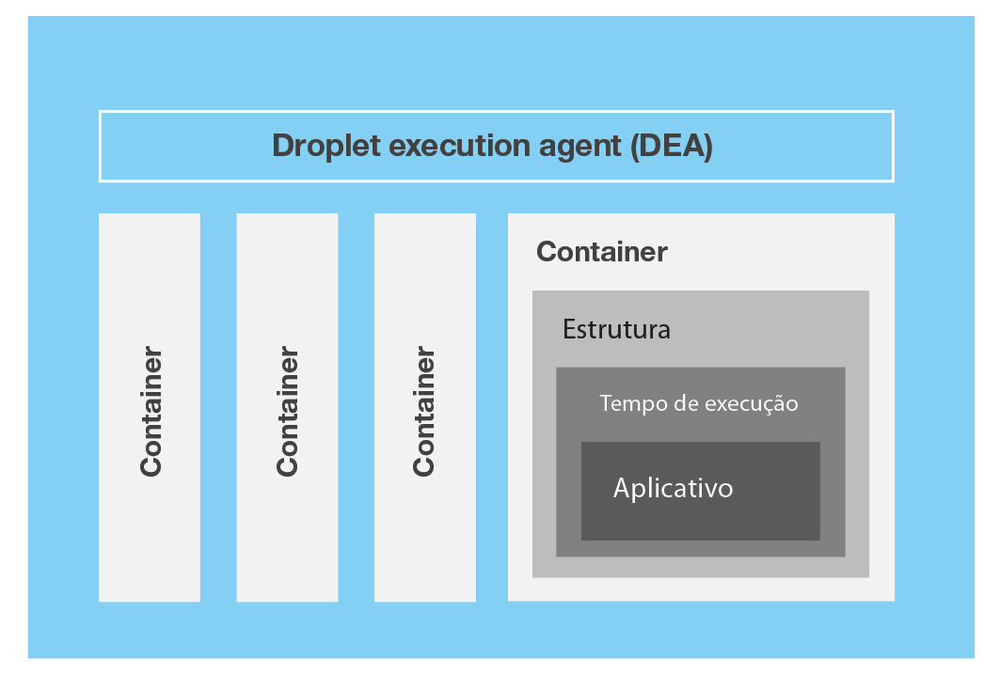

---


copyright:
  years: 2016, 2017
lastupdated: "2017-03-21"
---

{:shortdesc: .shortdesc}
{:new_window: target="_blank"}

# O que é o {{site.data.keyword.Bluemix_notm}}?
{: #bluemixoverview}

O {{site.data.keyword.Bluemix}} é uma plataforma de computação em nuvem inovador do {{site.data.keyword.IBM_notm}} que combina plataforma como serviço (PaaS) com infraestrutura como serviço (IaaS). Além disso, o {{site.data.keyword.Bluemix_notm}} tem um catálogo de serviços em nuvem rico, que pode ser facilmente integrado com PaaS e IaaS para construir aplicativos de negócios rapidamente.
{:shortdesc}

O {{site.data.keyword.Bluemix_notm}} possui implementações de nuvem que se ajustam às suas necessidades, independentemente de se você é uma pequena empresa que planeja escalar ou uma grande empresa que requer isolamento adicional. É possível desenvolver em uma nuvem sem fronteiras, na qual é possível conectar seus serviços privados aos serviços públicos do {{site.data.keyword.Bluemix_notm}} disponíveis a partir {{site.data.keyword.IBM_notm}}. Você e sua equipe podem acessar os aplicativos, serviços e infraestrutura no {{site.data.keyword.Bluemix_notm}} e usar dados existentes, sistemas, processos, ferramentas PaaS e ferramentas IaaS. Os desenvolvedores podem acessar o ecossistema de rápido crescimento de serviços e estruturas de tempo de execução disponíveis para construir aplicativos usando abordagens de programação poliglota.
 
Com o {{site.data.keyword.Bluemix_notm}}, não será mais necessário fazer grandes investimentos em hardware para testar ou executar um novo app. Em vez
disso, nós gerenciamos tudo para você e cobramos apenas pelo que você usa. O {{site.data.keyword.Bluemix_notm}} fornece modelos de implementação integrados públicos, [dedicados](/docs/dedicated/index.html) e [locais](/docs/local/index.html). 

É possível ter uma ideia de iniciação para um ambiente de simulação de desenvolvimento, para um ambiente de produção distribuído globalmente com a infraestrutura de cálculo e armazenamento, serviços e contêineres de plataforma de software livre, além de serviços de software e ferramentas do
{{site.data.keyword.IBM_notm}}, Watson e muito mais. Além dos próprios recursos da plataforma, o {{site.data.keyword.Bluemix}} também fornece implementação flexível. Forneça recursos do {{site.data.keyword.Bluemix}} no local, em ambientes dedicados de nuvem particular ou na nuvem pública e gerencie os recursos de todos os três tipos de ambientes em um único painel.
 
Todos os recursos em nuvem do {{site.data.keyword.IBM_notm}} que são implementados em ambientes públicos e dedicados são hospedados a partir de sua opção de locais de {{site.data.keyword.CloudDataCent}} no mundo todo. O {{site.data.keyword.CloudDataCents_notm}} fornece redundância regional, um backbone de rede global que conecta todos os datacenters, pontos de presença, controles rigorosos de segurança e relatórios. Com o {{site.data.keyword.CloudDataCents_notm}}, o {{site.data.keyword.IBM_notm}} pode atender suas necessidades mais exigentes de expansão, segurança, conformidade e residência de dados. 

O {{site.data.keyword.IBM_notm}} permite:

* Implemente a infraestrutura de cálculo e de armazenamento de alto desempenho em {{site.data.keyword.CloudDataCents_notm}} seguros no mundo todo.
* Teste e adote uma ampla variedade de serviços em nuvem e recursos do {{site.data.keyword.IBM_notm}}, comunidades de software livre e desenvolvedores de terceiros.
* Conecte todos os seus sistemas legados e apps a partir de uma única e escalável plataforma de nuvem por meio dos recursos de rede privada e API.
* Movimente recursos em tempo real conforme suas necessidades de negócios ou demandas de carga de trabalho mudam.

### Apps
{: #bluemixoverviewapplications}

O painel Apps fornece tudo o que é necessário para que seus apps funcionem e para gerenciar esses apps enquanto eles são executados. O {{site.data.keyword.Bluemix_notm}} fornece vários modelos e tempos de execução:

* Um modelo é um template para um aplicativo e seu ambiente de tempo de execução associado e serviços predefinidos para um domínio específico. 
* Um tempo de execução é o conjunto de recursos que é usado para executar um app, fornecido como contêineres para diferentes tipos de apps.

O {{site.data.keyword.Bluemix_notm}} fornece várias maneiras de executar seus apps, por exemplo, Cloud Foundry e {{site.data.keyword.containerlong}}. Use o {{site.data.keyword.containerlong}} para executar contêineres Docker em um ambiente de nuvem hospedado no {{site.data.keyword.Bluemix_notm}}. 

É possível usar {{site.data.keyword.openwhisk}} para computação distribuída, orientada a evento. O {{site.data.keyword.openwhisk_short}} executa a lógica de aplicativo em
resposta a eventos ou chamadas diretas de apps da web ou móveis sobre HTTP.
 
É possível usar os serviços do {{site.data.keyword.Bluemix_notm}} Mobile para incorporar serviços de nuvem pré-construídos, gerenciados e escaláveis em seus apps móveis. 

### Serviços
{: #bluemixoverviewservices}

O painel Serviços fornece acesso aos serviços do {{site.data.keyword.Bluemix_notm}} disponíveis a partir do{{site.data.keyword.IBM}} e de provedores de terceiros. Eles incluem serviços do Watson, Internet das coisas, Analytics, Mobile e DevOps:

* Entregue novos aplicativos inovadores mais rápido e mais barato com os recursos exatos, usando os serviços do {{site.data.keyword.IBM_notm}} DevOps e o método Garage do {{site.data.keyword.Bluemix_notm}}. Ao adotar práticas de DevOps e criar uma cultura de inovação e agilidade, é possível usar práticas iterativas e mudar a direção em resposta ao mercado.
* Cadeia de blocos é uma tecnologia de contabilidade distribuída ponto a ponto para uma nova geração de aplicativos transacionais que estabelece confiança, responsabilidade e transparência enquanto aperfeiçoa os processos de negócios.  
* O Watson fornece aos seus apps o poder da computação cognitiva com um conjunto completo de APIs de expressão, visão e dados.  Resolva seus problemas de negócios mais complexos implementando uma plataforma cognitiva com os serviços do Watson.
* O {{site.data.keyword.IBM_notm}} permite fazer mais com bancos de dados em nuvem integrados ais ricos e serviços de Dados & Analítica. 
* O serviço Internet das Coisas do {{site.data.keyword.IBM_notm}} permite que seus apps se comuniquem com seus dispositivos, sensores e gateways conectados, além de consumir dados que são coletados por eles. Nossas orientações facilitam a obtenção de dispositivos conectados à nossa nuvem da Internet das Coisas. Seus apps podem, então, usar nossas APIs em tempo real e REST para se comunicar com seus dispositivos e consumir os dados que você definiu que eles consumissem. 
* O {{site.data.keyword.IBM_notm}} oferece uma infraestrutura de backend móvel na qual você pode construir apps multiplataforma, nativos ou híbridos enquanto também é capaz de monitorá-los e testá-los. Também é possível aprimorar seu app com analítica, segurança, insight do usuário e entrega contínua. 
 
O {{site.data.keyword.Bluemix_notm}} também fornece serviços experimentais que você pode experimentar. Para aprender sobre os tipos de serviço e sobre a disponibilidade, consulte [Serviços do {{site.data.keyword.Bluemix_notm}}](/docs/services/index.html).


### Infraestrutura
{: #bluemixoverviewinfrastructure}

O painel Infraestrutura fornece vários serviços para atender às suas necessidades de infraestrutura em nuvem.

A infraestrutura do {{site.data.keyword.Bluemix_notm}} fornece o maior desempenho disponível da infraestrutura em nuvem. A infraestrutura do {{site.data.keyword.Bluemix_notm}} é uma plataforma, que captura datacenters ao redor do mundo que estão cheios da mais ampla variedade de opções de computação em nuvem e, então, integra e automatiza todos. Os {{site.data.keyword.CloudDataCents_notm}} são preenchidos com computação de primeira classe, armazenamento e equipamento de rede. Cada local é construído, equipado e operado da mesma maneira, para que você obtenha exatamente os mesmos recursos e disponibilidade em qualquer lugar em que eles estiverem presentes. Os locais são conectados pela rede em uma rede mais avançada do segmento de mercado, que integra diferentes redes de gerenciamento públicas, privadas e internas para entregar custos totais de rede mais baixos, melhor acesso e velocidade mais alta. Além disso, os datacenters e a rede compartilham um único sistema de gerenciamento de propriedade. Uma ferramenta de gerenciamento permite controlar tudo, cada servidor bare metal, servidor virtual e dispositivo de armazenamento, todos acessíveis por API, portal e aplicativos móveis.

A infraestrutura do {{site.data.keyword.Bluemix_notm}} oferece servidores bare metal poderosos e servidores virtuais flexíveis em uma plataforma única integrada. Todos são fornecidos sob demanda e faturados por mês ou por hora. Os servidores bare metal fornecem a potência bruta para suas cargas de trabalho intensivas do processador e intensivas de E/S de disco e podem ser configurados para suas especificações exatas. Os servidores virtuais permitem alta velocidade de implementação, escalabilidade flexível e faturamento pay-as-you-go. Para obter um cálculo de alto desempenho, impulsione sua nuvem com servidores de Unidade de Processamento Gráfico (GPU), disponíveis por hora ou por mês. 

As ofertas de infraestrutura do {{site.data.keyword.Bluemix_notm}} estão conectadas a uma rede de três camadas, segmentando o tráfego público, privado e de gerenciamento. A infraestrutura na conta do {{site.data.keyword.Bluemix_notm}} de um cliente pode transferir dados nessa infraestrutura através da rede privada, sem nenhum custo. As ofertas de infraestrutura, como servidores bare metal, servidores virtuais e armazenamento em nuvem, conectam-se a outros aplicativos e serviços no catálogo do {{site.data.keyword.Bluemix_notm}}, como serviços, contêineres ou tempos de execução do Watson, através
da rede pública. A transferência de dados entre esses dois tipos de ofertas é medida e cobrada em taxas padrão de largura da banda da rede pública.

## Usando o console {{site.data.keyword.Bluemix_notm}}
{: #bluemixoverviewui}

Ao acessar o console do {{site.data.keyword.Bluemix_notm}}, a barra de menus exibe links ou botões para se inscrever, efetuar login, acessar a documentação e acessar o catálogo. Depois de efetuar login, a barra de menus contém um menu de hambúrguer  e links adicionais, dependendo do seu tipo de conta:

* Se você for um novo usuário do {{site.data.keyword.Bluemix_notm}}, será possível usar o menu
de hambúrguer  para alternar entre os
painéis Apps, Serviços e Infraestrutura. É possível usar o link **Catálogo** para
acessar os serviços da plataforma e da infraestrutura. Links para opções de gerenciamento de suporte e conta,
de faturamento e uso e de segurança também são exibidos.
* Se você for um usuário existente com uma conta do {{site.data.keyword.Bluemix_notm}}, poderá usar o menu de hambúrguer  para alternar entre os painéis Apps, Serviços ou
Infraestrutura. É possível usar o **Catálogo** para acessar os serviços da plataforma e
da infraestrutura e links para opções de gerenciamento de suporte e conta, de faturamento e uso e de
segurança de nível de plataforma são exibidos.
* Se você for um usuário existente e tiver vinculado a conta do
{{site.data.keyword.Bluemix_notm}} e a conta {{site.data.keyword.BluSoftlayer}}, será possível
usar o menu de hambúrguer  para alternar
entre os painéis Apps, Serviços e Infraestrutura. Também é possível usar o link **Catálogo**
para acessar os serviços da plataforma e da infraestrutura. 
  * Quando você está nos painéis Apps e Serviços, a barra de menus inclui links para recursos
de nível de plataforma, como opções de gerenciamento de documentação, de suporte e conta e de
segurança do {{site.data.keyword.Bluemix_notm}}. Também é possível acessar links para
opções de faturamento de nível de infraestrutura. 
  * Quando você está no painel de Infraestrutura, a barra de menus exibe links para recursos de nível
de infraestrutura, como ajuda do KnowledgeLayer, opções de contato, notificações, chamados abertos e opções
de gerenciamento de suporte e de conta.
* Se você for um usuário existente com uma conta do {{site.data.keyword.BluSoftlayer}} que não
esteja vinculada ao {{site.data.keyword.Bluemix_notm}}, será possível
usar o menu de hambúrguer  para
acessar o painel de Infraestrutura e o link **Catálogo** para acessar os serviços de
infraestrutura. A barra de menus também inclui links para ajuda do KnowledgeLayer, opções de contato,
notificações, chamados abertos e opções de suporte e de conta.

## Arquitetura do {{site.data.keyword.Bluemix_notm}} Cloud Foundry
{: #architecture}

Em geral, você não precisa se preocupar com o sistema operacional e as camadas de infraestrutura ao executar apps no {{site.data.keyword.Bluemix_notm}} no Cloud Foundry. Camadas
como sistemas de arquivos raiz e componentes de middleware são abstraídas para que você possa focar em seu
código do aplicativo. No entanto, é possível saber mais sobre estas camadas se precisar de informações específicas sobre onde seu
app está sendo executado. 

Consulte [Visualizando camadas de infraestrutura do {{site.data.keyword.Bluemix_notm}}](/docs/manageapps/infra.html#viewinfra) para obter detalhes.

Como desenvolvedor, é possível interagir com a infraestrutura do {{site.data.keyword.Bluemix_notm}},
usando uma interface com o usuário baseada no navegador. Também é possível usar uma interface de linha de comandos Cloud Foundry, chamada cf, para implementar apps da web.

Os clientes, que podem ser apps móveis, apps executados externamente, apps que são construídos no {{site.data.keyword.Bluemix_notm}} ou desenvolvedores que
estão usando navegadores, interagem com os aplicativos hospedados no {{site.data.keyword.Bluemix_notm}}. Os clientes usam APIs REST ou HTTP para rotear solicitações por meio do {{site.data.keyword.Bluemix_notm}} para
uma das instâncias do app ou para os serviços compostos.

A figura a seguir mostra a arquitetura de alto nível do {{site.data.keyword.Bluemix_notm}} Cloud Foundry.


Figura 1. Arquitetura do {{site.data.keyword.Bluemix_notm}} Cloud Foundry

É possível implementar seus apps em diferentes regiões do {{site.data.keyword.Bluemix_notm}}, para considerações de latência ou segurança. É possível optar por implementar para uma região ou entre várias regiões. Para obter mais informações, consulte [Regiões](whatisbluemix.html#ov_intro_reg).


Figura 2. Implementação do aplicativo multiregion

## Como o {{site.data.keyword.Bluemix_notm}} Cloud Foundry funciona
{: #howwork}

Ao implementar um aplicativo no {{site.data.keyword.Bluemix_notm}} Cloud Foundry, deve-se configurar o {{site.data.keyword.Bluemix_notm}} com informações suficientes para suportar o app.

* Para um app móvel, o {{site.data.keyword.Bluemix_notm}} contém um artefato que representa o backend do app móvel, tal como os serviços que o app móvel usa para se comunicar com um servidor.
* Para um app da web, deve-se assegurar que as informações sobre o tempo de execução e a estrutura sejam comunicadas ao {{site.data.keyword.Bluemix_notm}}, para que o {{site.data.keyword.Bluemix_notm}} possa configurar o
ambiente de execução adequado para executar o app.

Cada ambiente de execução, incluindo o ambiente móvel e
o ambiente da web, é isolado do ambiente de execução de outros apps. Os ambientes de execução são isolados embora esses apps estejam
na mesma máquina física. A figura a seguir mostra o fluxo básico de como o {{site.data.keyword.Bluemix_notm}} Cloud Foundry gerencia a implementação de apps:


Figura 3. Implementando um app

Ao criar um app e implementá-lo no {{site.data.keyword.Bluemix_notm}} Cloud Foundry, o ambiente do {{site.data.keyword.Bluemix_notm}} determina um servidor virtual apropriado para o qual enviar o app ou os artefatos que o app representa. Para um aplicativo móvel, uma projeção de backend móvel é criada no {{site.data.keyword.Bluemix_notm}}. Qualquer código para o app móvel em execução na nuvem finalmente é executado
no ambiente do {{site.data.keyword.Bluemix_notm}}. Para um app da web, o código em execução na nuvem é o próprio app que o desenvolvedor implementa no {{site.data.keyword.Bluemix_notm}}. A determinação do servidor virtual é baseada em vários fatores, incluindo:

* A carga que já está na máquina
* Tempos de execução ou estruturas suportados por esse servidor virtual.

Após um servidor virtual ser escolhido, um gerente de aplicativos em cada servidor virtual instala a estrutura e o tempo de execução apropriados para o app. Em
seguida, o app poderá ser implementado nessa estrutura. Quando a implementação é concluída, os artefatos de aplicativo são iniciados.

A figura a seguir mostra a estrutura de um servidor virtual, também conhecida como Droplet Execution Agent (DEA), que possui vários apps implementados nele:



Figura 4. Design de um servidor virtual

Em cada servidor virtual, um gerente de aplicativos se comunica com o restante da infraestrutura do {{site.data.keyword.Bluemix_notm}} e gerencia os apps implementados nesse servidor virtual. Cada servidor virtual possui contêineres para separar e proteger os apps. Em cada contêiner, o {{site.data.keyword.Bluemix_notm}} instala
a estrutura e o tempo de execução apropriados necessários para cada app.

Quando o app for implementado, se ele tiver uma interface da web
(como um app da web Java) ou outros serviços baseados em REST (como
serviços móveis expostos publicamente para o app móvel), os usuários do app poderão se comunicar com ele usando solicitações normais de HTTP.


Figura 5. Chamando um app do {{site.data.keyword.Bluemix_notm}}

Cada app pode ter uma ou mais URLs associadas a ele, mas todas elas devem apontar para o terminal do {{site.data.keyword.Bluemix_notm}}. Quando uma solicitação entra, o {{site.data.keyword.Bluemix_notm}} a examina, determina para qual app ela se destina e, em seguida, seleciona uma instância do app para recebê-la.


### Regiões
{: #ov_intro_reg}

Uma região do {{site.data.keyword.Bluemix_notm}} é um
território geográfico definido no qual você pode  implementar
seus apps. Você pode criar apps e instâncias de serviço em diferentes
regiões com a mesma infraestrutura do
{{site.data.keyword.Bluemix_notm}} para gerenciamento de
aplicativos e a mesma visualização de detalhes de uso para faturamento. É possível selecionar a região mais próxima aos seus clientes e implementar seus
apps nessa região para obter baixa latência do aplicativo. Também é possível selecionar a
região em que você deseja manter os dados do aplicativo por questões de segurança de endereço. Ao construir apps em diversas regiões, se uma região se tornar indisponível, os apps que estão nas outras regiões continuarão executando. A concessão de seu recurso é a mesma para cada região que você usa.

Se você usar a interface com o usuário do {{site.data.keyword.Bluemix_notm}}, poderá alternar para uma região diferente para trabalhar com os espaços dessa região. Clique no link de preferências da conta do usuário, expanda o seletor **Região** e, em seguida, selecione na lista a região que você precisa.

Se você usar a interface da linha de comandos cf para se conectar à região do {{site.data.keyword.Bluemix_notm}} com a qual você deseja trabalhar, use o comando cf api e especifique o terminal da API da região. Por exemplo, insira o comando a seguir para conectar-se à região do Reino Unido na Europa
{{site.data.keyword.Bluemix_notm}}:

```
cf api https://api.eu-gb.{{site.data.keyword.Bluemix_notm}}.net
```

Um prefixo exclusivo é designado a cada região. O {{site.data.keyword.Bluemix_notm}} fornece
as regiões e os prefixos de regiões a seguir.

<!-- PRODUCTION ONLY: Ensure that URLs are production URLs, not stage1-->

| **Nome da região** | **Localização geográfica
** | **Prefixo da região** | **Terminal
de API cf** | **Console da interface com o usuário** |       
|-----------------|-------------------------|-------------------|---------------------|----------------|
| Região Sul dos EUA | Dallas, EUA | ng | api.ng.bluemix.net | console.ng.bluemix.net |
| Região do Reino Unido | Londres, Inglaterra | eu-gb | api.eu-gb.bluemix.net | console.eu-gb.bluemix.net |
| Região de Sydney | Sydney, Austrália | au-syd | api.au-syd.bluemix.net | console.au-syd.bluemix.net |
| Região da Alemanha | Frankfurt, Alemanha | eu-de | api.eu-de.bluemix.net | console.eu-de.bluemix.net |
{: caption="Table 1. {{site.data.keyword.Bluemix_notm}} region list" caption-side="top"}


### Resiliência do {{site.data.keyword.Bluemix_notm}}
{: #resiliency}

O {{site.data.keyword.Bluemix_notm}} é projetado para hospedar apps e artefatos de aplicativos resilientes e escaláveis que podem escalar para atender às suas necessidades, permanecer altamente disponível e ser rápido para recuperar-se de problemas. O {{site.data.keyword.Bluemix_notm}} separa os componentes que controlam o estado das interações (stateful) daqueles que não controlam (stateless). Essa separação permite que o {{site.data.keyword.Bluemix_notm}} mova apps flexivelmente, conforme necessário, para obter escalabilidade e resiliência.

É possível ter uma ou mais instâncias em execução para o seu app. Para múltiplas instâncias de um único app, o app é transferido por upload somente uma vez. No entanto, o {{site.data.keyword.Bluemix_notm}} implementa o número solicitado de instâncias do app e as distribui entre quantos servidores virtuais for possível.

Deve-se salvar todos os dados persistentes em um armazenamento de dados stateful que esteja fora de seu app, tal como em um dos serviços de armazenamento de dados que o {{site.data.keyword.Bluemix_notm}} fornece. Como qualquer coisa armazenada em cache na memória ou no disco pode ainda não estar disponível após uma reinicialização, é possível usar o espaço de memória ou o sistema de arquivos de uma única instância do {{site.data.keyword.Bluemix_notm}} como um cache de breve transação única. Com uma configuração de instância única, a solicitação para seu app pode ser interrompida por causa da
natureza stateless do {{site.data.keyword.Bluemix_notm}}. Uma melhor prática é usar pelo menos três instâncias para cada app para assegurar sua disponibilidade.

Toda a infraestrutura do
{{site.data.keyword.Bluemix_notm}},
os componentes do Cloud Foundry e os componentes de gerenciamento
específicos da {{site.data.keyword.IBM_notm}} são altamente
disponíveis. Várias instâncias da infraestrutura são usadas
para equilibrar a carga.

### Integração com sistemas de registro
{: #sor}

O {{site.data.keyword.Bluemix_notm}} pode ajudar os desenvolvedores, conectando duas categorias amplas de sistemas em um ambiente de nuvem: 

* *Sistemas de registro* inclui apps e bancos de dados que armazenam registros de negócios e automatizam processos padronizados. 
* *Sistemas
de engajamento* são recursos que expandem a utilidade dos
sistemas de registro e os tornam mais envolventes para os usuários.

Ao integrar um sistema de registro ao app que você cria no
{{site.data.keyword.Bluemix_notm}}, pode executar as
seguintes ações:

 * Ativar a comunicação segura entre o app e o banco de dados de backend, fazendo
o download e instalando um conector seguro no local.
 * Chamar um banco de dados de uma maneira segura.
 * Criar APIs a partir de fluxos de integração com bancos de dados e sistemas de
backend, como o sistema de gerenciamento de relacionamento com o cliente.
 * Expor somente os esquemas e as tabelas que você deseja que
sejam expostos ao app.
 * Como gerente da organização {{site.data.keyword.Bluemix_notm}},
publique uma API como um serviço privado que seja visível somente aos membros de sua organização.
 
Para integrar um sistema de registro com o app que você cria no
{{site.data.keyword.Bluemix_notm}}, use o serviço Cloud
Integration. Com o serviço Cloud Integration, é possível criar uma API de Cloud Integration e publicar a API como um serviço privado para sua organização.

<dl>
<dt>API de Cloud Integration</dt>
    <dd>Uma API de Cloud Integration fornece acesso seguro para os sistemas de registro que residem por trás de um firewall por meio das APIs da web. Ao criar a API de Cloud Integration, escolha o recurso que deseja acessar por meio da API da web, especifique as operações que são permitidas e inclua SDKs e amostras para acessar a API. Para obter mais informações sobre como criar uma API de Cloud Integration, veja [Introdução ao Cloud Integration](/docs/services/CloudIntegration/CldInt_GetStart.html).</dd>
<dt>Serviço privado</dt>
    <dd>Um serviço privado consiste em uma API de Cloud Integration, SDKs e políticas de autorização. O serviço privado também pode conter documentação ou outros itens do provedor de serviços. Somente o gerenciador de organização pode publicar uma API de Cloud Integration como um serviço privado. Para
ver os serviços privados que estão disponíveis para você,
marque a caixa de seção Privado no catálogo do {{site.data.keyword.Bluemix_notm}}. É
possível selecionar e ligar um serviço privado a um app sem se conectar ao serviço Cloud Integration. Você
liga serviços privados ao seu app da mesma maneira que faz com outros
serviços {{site.data.keyword.Bluemix_notm}}. Para obter informações sobre como publicar uma API como um serviço privado,
consulte Publicando uma API como um serviço privado.</dd>
</dl>

#### Cenário: Criando um app móvel avançado para conexão
com o sistema de registro
{: #scenario}

O {{site.data.keyword.Bluemix_notm}} fornece uma
plataforma na qual é possível integrar seu app móvel, os serviços de
nuvem e os sistemas corporativos de registro para fornecer um app que interaja com os dados no local.

Por exemplo, é possível construir um app
móvel para interagir com o sistema de gerenciamento de relacionamento com o cliente
que reside no local protegido por um firewall. É possível chamar o
sistema de registro de uma maneira segura e alavancar os serviços móveis no {{site.data.keyword.Bluemix_notm}} para que seja possível construir um app móvel avançado.

Primeiro, seu desenvolvedor de integração cria o app de backend
móvel no {{site.data.keyword.Bluemix_notm}}. Eles usam o modelo de Nuvem para dispositivo móvel que usa o tempo de execução Node.js com o qual estão mais familiarizados.

Em seguida, usando o serviço Cloud Integration na interface com o usuário do {{site.data.keyword.Bluemix_notm}}, eles expõem uma API por meio de um conector seguro. Seu desenvolvedor de
integração faz o download do conector seguro e instala-o no local
para permitir uma comunicação segura entre sua API e o banco de dados. Após criar o terminal de banco de dados, podem examinar todos os esquemas e extrair as tabelas que desejam expor como APIs para o app.

O desenvolvedor de integração inclui o serviço de push para entregar notificações móveis aos consumidores interessados. Eles também incluem um serviço de parceiro de negócios para publicar um tweet quando um novo registro de cliente é criado com uma API do Twitter.

Em seguida, como desenvolvedor de aplicativos,
é possível efetuar login no {{site.data.keyword.Bluemix_notm}},
fazer o download do kit de ferramentas de desenvolvimento do Android e desenvolver código que chame
as APIs criadas pelo desenvolvedor de integração. É possível
desenvolver um app móvel que permita aos usuários inserir suas
informações em seus dispositivos móveis. O app móvel cria então um registro do cliente
no sistema de gerenciamento do cliente. Quando o registro é criado, o
app envia uma notificação para um dispositivo móvel e inicia
um tweet sobre o novo registro.

## Pré-requisitos do {{site.data.keyword.Bluemix_notm}}
{: #prereqs}

Os pré-requisitos para usar a plataforma do {{site.data.keyword.Bluemix_notm}} são limitados, mas temos alguns.
{:shortdesc}

### 
{: #browsers}

A lista a seguir especifica o software do navegador mínimo necessário para o {{site.data.keyword.Bluemix_notm}}:

 * Chrome: versão mais recente para seu sistema operacional
 * Firefox: versão mais recente para seu sistema operacional e ESR 45
 * Internet Explorer: versão 11
 * Safari: versão mais recente para Mac

### Cloud
Foundry
{: #cf}

Interface da linha de comandos do Cloud Foundry, Versão 6.5.1 ou mais recente 

# rellinks
{: #rellinks}
## gerais
{: #general}
* [O que é {{site.data.keyword.Bluemix_notm}} ](http://www.ibm.com/cloud-computing/bluemix/what-is-bluemix/){:new_window}
* [Introdução ao ](http://www.ibm.com/cloud-computing/bluemix/getting-started/){:new_window}
* [O que há de novo no {{site.data.keyword.Bluemix_notm}}](/docs/whatsnew/index.html)
* [Aprenda sobre o modelo híbrido ](http://www.ibm.com/cloud-computing/bluemix/hybrid/){:new_window}
* [Gerenciando sua conta](/docs/admin/adminpublic.html#mngacct)
* [{{site.data.keyword.Bluemix_notm}} glossário](/docs/overview/glossary/index.html)
