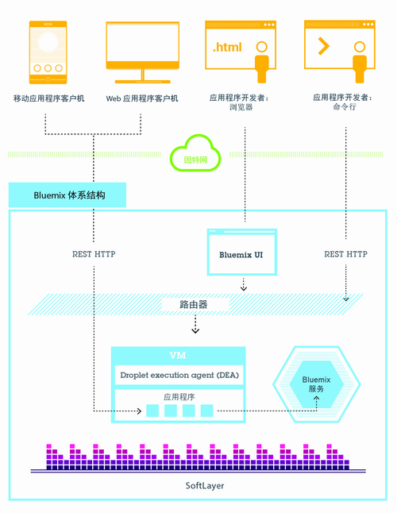
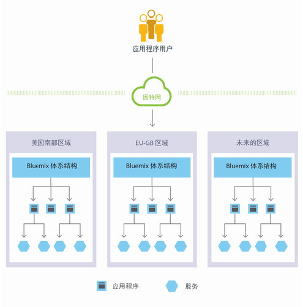
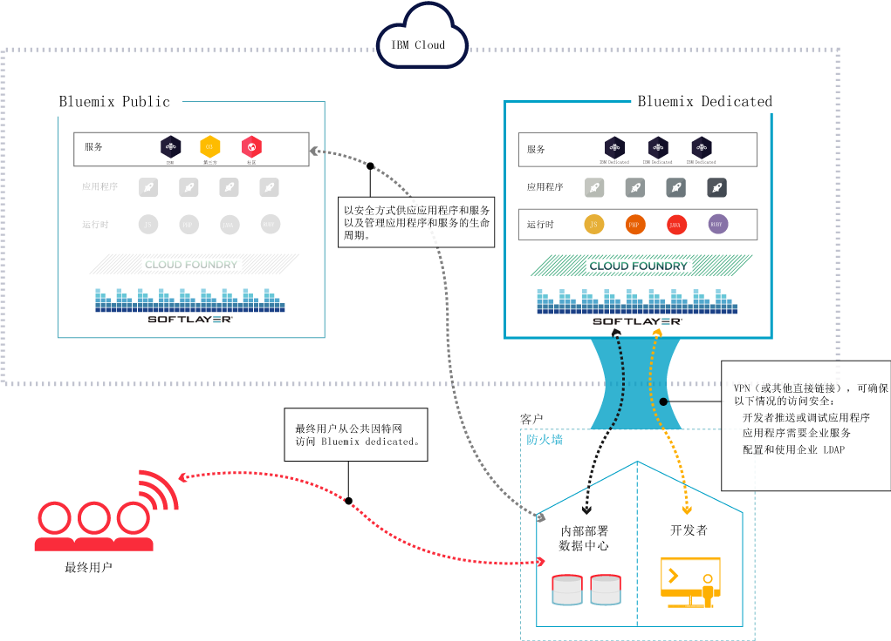
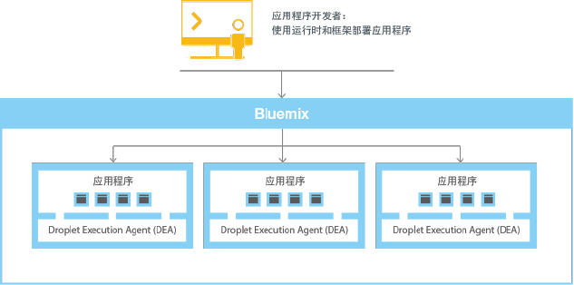
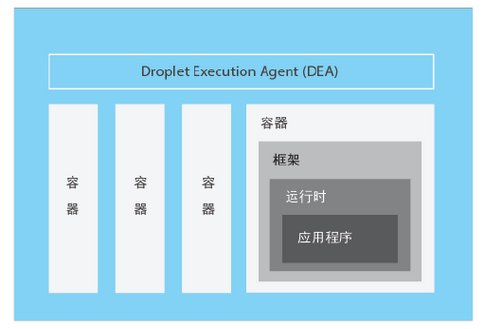

---

 

copyright:

  years: 2014, 2016

 

---

{:shortdesc: .shortdesc} 
{:new_window: target="_blank"}

# {{site.data.keyword.Bluemix_notm}} 概述
{: #overview}

*上次更新时间：2016 年 5 月 9 日*

{{site.data.keyword.Bluemix}} 是一种 {{site.data.keyword.IBM}} 开放云平台。通过该平台，移动应用程序和 Web 应用程序开发者可以访问 {{site.data.keyword.IBM_notm}} 软件来执行集成、安全、事务以及其他关键功能，还可以访问业务合作伙伴提供的软件。
{:shortdesc}

{{site.data.keyword.Bluemix_notm}} 基于 [Cloud Foundry](https://www.cloudfoundry.org/){: new_window} 开放式源代码技术构建，通过平台即服务 (PaaS) 使开发者能够更轻松地进行应用程序开发。另外，{{site.data.keyword.Bluemix_notm}} 还提供预构建的移动后端即服务 (MBaaS) 功能。目标是通过提供各种可随时立即使用的服务以及托管功能来实现互联网大规模开发，从而简化应用程序的交付过程。

{{site.data.keyword.Bluemix_notm}} 还具有可满足您需求的云部署。无论是计划扩大规模的小企业，还是需要额外隔离机制的大企业，都可以在云中进行无边界开发，在这里您可以将专用服务连接到 {{site.data.keyword.IBM_notm}} 以及第三方供应商提供的公共 {{site.data.keyword.Bluemix_notm}} 服务。所有服务实例均由 {{site.data.keyword.IBM_notm}} 管理，而您只需要为自己选择使用的服务付费。

通过 {{site.data.keyword.Bluemix_notm}} 中的一系列服务和运行时，开发者不仅可以获得控制力和灵活性，还可以选择使用从预测性分析到大数据等各种数据。

{{site.data.keyword.Bluemix_notm}} 提供了以下功能：

- 一系列服务，支持快速构建和扩展 Web 应用程序和移动应用程序。
- 可持续交付应用程序更改的处理能力。
- 有针对性的编程模型和服务。
- 可管理服务和应用程序。
- 经过优化的弹性工作负载。
- 持续可用性。

{{site.data.keyword.Bluemix_notm}} 剥离与托管和管理基于云的应用程序相关的大部分复杂性并隐藏起来。作为应用程序开发者，您可以只关注应用程序开发，而不必管理托管应用程序所需的基础架构。对于移动应用程序和 Web 应用程序，可以使用 {{site.data.keyword.Bluemix_notm}} 提供的预构建服务。可以将 Web 应用程序上传到 {{site.data.keyword.Bluemix_notm}}，并指示要运行的实例数。部署应用程序后，可以在应用程序的使用情况或负载发生变化时，轻松地增加或减少应用程序数。

通过 {{site.data.keyword.Bluemix_notm}}，您可以使用最流行的编程语言来快速开发应用程序。可以使用 iOS、Android 以及 HTML 搭配 JavaScript 来开发移动应用程序。对于 Web 应用程序，可以使用 Ruby、PHP、Java&trade;、Go 和 Python 等语言。还可以将现有应用程序迁移到 {{site.data.keyword.Bluemix_notm}}，并使用 {{site.data.keyword.Bluemix_notm}} 提供的运行时来运行应用程序。

{{site.data.keyword.Bluemix_notm}} 还提供了中间件服务，供应用程序使用。{{site.data.keyword.Bluemix_notm}} 会在供应新服务实例并将这些服务与应用程序绑定时代表应用程序执行操作。这样，应用程序就可以执行其真正的工作，而将服务的管理留给基础架构来执行。

通常，在 {{site.data.keyword.Bluemix_notm}} 上运行应用程序时，您不必担心操作系统和基础架构层。诸如根文件系统和中间件组件这样的层已进行抽象化，以便您可以重点关注自己的应用程序代码。但是，如果需要有关应用程序运行位置的具体信息，可以了解有关这些层的更多信息。有关详细信息，请参阅[查看 {{site.data.keyword.Bluemix_notm}} 基础架构层](../cli/vcapsvc.html#viewinfra)。 

## {{site.data.keyword.Bluemix_notm}} 体系结构
{: #ov_arch}

利用 {{site.data.keyword.Bluemix_notm}}，您既可以访问公共 {{site.data.keyword.Bluemix_notm}} 平台，也可以设置专用 {{site.data.keyword.Bluemix_notm}} 平台，还可以两者同时使用。


### {{site.data.keyword.Bluemix_notm}} Public
{: #public}

{{site.data.keyword.Bluemix_notm}} 的核心是一个环境，供您开发应用程序和使用服务（服务可提供即取即用的功能）。针对 Liberty 等应用程序服务器上运行的应用程序工件，{{site.data.keyword.Bluemix_notm}} 还提供了托管环境。{{site.data.keyword.Bluemix_notm}} 通过使用 SoftLayer 来部署虚拟容器，用于托管每个部署的应用程序。在此环境中，应用程序可以使用预构建的服务（包括第三方服务），这使得组装应用程序变得更容易。

作为开发者，您可以使用基于浏览器的用户界面与 {{site.data.keyword.Bluemix_notm}} 基础架构进行交互。还可以使用名为 cf 的 Cloud Foundry 命令行界面来部署 Web 应用程序。

不管是客户机（移动应用程序、外部运行的应用程序、基于 {{site.data.keyword.Bluemix_notm}} 构建的应用程序等）还是使用浏览器的开发者，都可以与 {{site.data.keyword.Bluemix_notm}} 托管的应用程序进行交互。客户机使用 REST 或 HTTP API 通过 {{site.data.keyword.Bluemix_notm}} 将请求路由到某个应用程序实例或组合服务。

下图显示了高层次的 {{site.data.keyword.Bluemix_notm}} 体系结构。



*图 1. {{site.data.keyword.Bluemix_notm}} 体系结构*

出于等待时间或安全考虑，可以将应用程序部署到不同的 {{site.data.keyword.Bluemix_notm}} 区域。您可以选择部署到一个区域或跨多个区域部署。有关更多信息，请参阅[区域](#ov_intro__reg)。



*图 2. 多区域应用程序部署*

### {{site.data.keyword.Bluemix_notm}} Dedicated
{: #dedicated}

{{site.data.keyword.Bluemix_notm}} Dedicated 是属于您自己的专用 SoftLayer 环境，它安全地连接到公共 {{site.data.keyword.Bluemix_notm}} 以及您自己的网络。{{site.data.keyword.Bluemix_notm}} Dedicated 通过 VPN 或直接网络连接参与您的网络活动。您的单租户硬件可以在全世界的任何一个 SoftLayer 数据中心内进行设置。{{site.data.keyword.IBM_notm}} 负责对专用平台和专用服务进行管理，所以您可以专注于构建定制应用程序。不仅如此，{{site.data.keyword.IBM_notm}} 还会在您所选择的维护时段内执行专用实例的所有维护工作。

{{site.data.keyword.IBM_notm}} 为您的专用环境提供了几种服务，但您可以连接到所有公共服务。在专用环境中，所有运行时均可用。无需额外付费，{{site.data.keyword.Bluemix_notm}} 的所有专用部署中都包含以下优势和功能：VPN、专用 VLAN、防火墙、与 LDAP 的连接、利用现有内部部署数据库和应用程序的能力、全天候现场安全防护、专用硬件以及标准支持。 



*图 3. {{site.data.keyword.Bluemix_notm}} Dedicated*

### {{site.data.keyword.Bluemix_notm}} Local
{: #local}

{{site.data.keyword.Bluemix_notm}} Local 是您自己的 {{site.data.keyword.Bluemix_notm}} 实例，部署在公司防火墙后的数据中心内。通过 {{site.data.keyword.Bluemix_notm}} Local，可以与 {{site.data.keyword.Bluemix_notm}} Public 保持安全连接并与之同步。

{{site.data.keyword.Bluemix_notm}} Local 包含专用的联合目录，其中显示只供您使用的本地服务。此外，还包含从 {{site.data.keyword.Bluemix_notm}} Public 联合的服务，供您使用。在本地环境中，所有运行时均可用。无需额外付费，{{site.data.keyword.Bluemix_notm}} 的本地部署中包含以下优势和功能：中继管理技术、与 LDAP 的连接、利用现有内部部署数据库和应用程序的能力以及标准支持。

IBM 使用中继技术来安全地监视和维护环境，让您可以始终专注于业务。中继是 {{site.data.keyword.Bluemix_notm}} Local 随附的一项交付功能，能够使 IBM 以一致的方式自动交付更新，以便您始终都能有一个稳定、安全的最新系统。中继通过开放式出站 SSL VPN 隧道来实现连接，该隧道源自先启虚拟机。通过此隧道，IBM 可以为您实例的平台、计算资源和服务提供服务并进行维护。请参阅 [{{site.data.keyword.Bluemix_notm}} Local](../local/index.html#local)。


*图 4. {{site.data.keyword.Bluemix_notm}} Local*

先启虚拟机在客户防火墙后面的网络中运行，该网络使用出站连接通过中继技术连接到 IBM 操作中心。{{site.data.keyword.Bluemix_notm}} 平台组件和核心服务在一个独立的专用虚拟局域网 (VLAN) 中运行。{{site.data.keyword.Bluemix_notm}} Local 将 VLAN 用于专用子网。使用专用子网（而不使用公用 VLAN）不但更为安全，而且还有助于避免路由问题。

DataPower 设备提供对 {{site.data.keyword.Bluemix_notm}} 应用程序域的访问。这些设备所连接到的网络从您的内部网即可进行访问。用户可从这个网络中获取相应访问权来部署应用程序和服务。您必须提供 7 个 IP 地址，以用于出站因特网访问。DataPower 设备会从这些客户 IP 地址路由到独立的 {{site.data.keyword.Bluemix_notm}} 部署。有关网络规范和基础架构需求的信息，请参阅 [{{site.data.keyword.Bluemix_notm}} Local 基础架构需求](../local/index.html#localinfra)。

### {{site.data.keyword.Bluemix_notm}} 的工作方式
{: #howwork}

将某个应用程序部署到 {{site.data.keyword.Bluemix_notm}} 时，必须使用足够的信息来配置 {{site.data.keyword.Bluemix_notm}} 才能支持该应用程序。

* 对于移动应用程序，{{site.data.keyword.Bluemix_notm}} 包含表示移动应用程序后端的工件，例如移动应用程序用于与服务器进行通信的服务。
* 对于 Web 应用程序，必须确保将正确的运行时和框架相关信息传递给 {{site.data.keyword.Bluemix_notm}}，以便其能够设置正确的执行环境来运行应用程序。

每个执行环境（包括移动应用程序和 Web 应用程序）都与其他应用程序的执行环境相隔离。即使这些应用程序位于同一物理机器上，其执行环境也相互隔离。下图显示了 {{site.data.keyword.Bluemix_notm}} 如何管理应用程序部署的基本流程： 



*图 5. 部署应用程序*

创建应用程序并将其部署到 {{site.data.keyword.Bluemix_notm}} 时，{{site.data.keyword.Bluemix_notm}} 环境会确定将应用程序或应用程序所表示的工件发送到哪个相应的虚拟机 (VM)。对于移动应用程序，将在 {{site.data.keyword.Bluemix_notm}} 上创建移动后端投影。在云中运行的移动应用程序的任何代码最终都会在 {{site.data.keyword.Bluemix_notm}} 环境中运行。对于 Web 应用程序，在云中运行的代码是开发者部署到 {{site.data.keyword.Bluemix_notm}} 的应用程序本身。VM 的确定基于若干因素，包括：

* 机器上的已有负载
* 该 VM 支持的运行时或框架。

选择 VM 后，每个 VM 上的应用程序管理器都会为应用程序安装正确的框架和运行时。然后，可以将应用程序部署到该框架。部署完成后，将启动应用程序工件。

下图显示部署了多个应用程序的 VM（也称为 Droplet Execution Agent (DEA)）的结构： 



*图 6. VM 的设计*

在每个 VM 中，应用程序管理器都会与 {{site.data.keyword.Bluemix_notm}} 基础架构的其余部分进行通信，并会对部署到此 VM 的应用程序进行管理。每个 VM 都具有容器，用于隔离和保护应用程序。在每个容器中，{{site.data.keyword.Bluemix_notm}} 会安装每个应用程序所需的相应框架和运行时。

部署应用程序后，如果该应用程序具有 Web 接口（例如 Java Web 应用程序）或其他基于 REST 的服务（例如向移动应用程序公开的移动服务），那么该应用程序的用户可以使用正常的 HTTP 请求与其进行通信。


*图 7. 调用 {{site.data.keyword.Bluemix_notm}} 应用程序*

每个应用程序都可以有一个或多个 URL 与之相关联，但所有这些 URL 都必须指向 {{site.data.keyword.Bluemix_notm}} 端点。当请求到达时，{{site.data.keyword.Bluemix_notm}} 会检查该请求，确定该请求针对的是哪个应用程序，然后选择某个应用程序实例来接收该请求。 

### {{site.data.keyword.Bluemix_notm}} 弹性
{: #resiliency}

{{site.data.keyword.Bluemix_notm}} 能够托管可扩展的弹性应用程序和应用程序工件，它们不但可根据您的需求进行扩展，而且还可以始终保持高度可用且可从问题中快速恢复。{{site.data.keyword.Bluemix_notm}} 将那些跟踪交互状态（有状态）的组件与那些不跟踪交互状态（无状态）的组件分隔开来。通过这种分隔，{{site.data.keyword.Bluemix_notm}} 可以根据需要灵活地移动应用程序，从而实现可扩展性和弹性。

您的应用程序可以有一个或多个实例正在运行。当一个应用程序具有多个实例时，仅会将该应用程序上传一次。不过，{{site.data.keyword.Bluemix_notm}} 会部署所请求数目的应用程序实例，并将它们分布到尽可能多的 VM 上。

您必须在应用程序外部的有状态数据存储（例如，在 {{site.data.keyword.Bluemix_notm}} 提供的某个数据存储服务上）中保存所有持久数据。因为内存中或磁盘上高速缓存的任何内容即使在重启后也可能不可用，所以您可以将单个 {{site.data.keyword.Bluemix_notm}} 实例的内存空间或文件系统用作短暂的单个事务高速缓存。设置单个实例时，对应用程序的请求可能会由于 {{site.data.keyword.Bluemix_notm}} 的无状态性质而中断。最佳做法是每个应用程序至少使用三个实例，以确保应用程序的可用性。

所有 {{site.data.keyword.Bluemix_notm}} 基础架构、Cloud Foundry 组件和特定于 {{site.data.keyword.IBM_notm}} 的管理组件都具有高可用性。通过使用多个基础架构实例来平衡负载。

## {{site.data.keyword.Bluemix_notm}} 概念
{: #ov_intro}

{{site.data.keyword.Bluemix_notm}} 由应用程序、服务、buildpack 和其他组件构成。您可以使用一个 {{site.data.keyword.IBM_notm}} 标识将应用程序部署到不同的 {{site.data.keyword.Bluemix_notm}} 区域。

### 区域
{: #ov_intro__reg}

{{site.data.keyword.Bluemix_notm}} 区域是可将您应用程序部署到的已定义地理地域。您可以在不同的区域中创建应用程序和服务实例，但前提是这些区域使用相同的 {{site.data.keyword.Bluemix_notm}} 基础架构来进行应用程序管理，并使用相同的使用情况详细信息视图来进行记帐。您可以选择离客户最近的区域，并将应用程序部署到此区域以缩短应用程序等待时间。还可选择希望在其中保留应用程序数据以解决安全问题的区域。在多个区域中构建应用程序后，如果一个区域发生故障，其他区域中的应用程序会继续运行。您的资源限额对于您使用的每个区域都是相同的。

如果您使用的是 {{site.data.keyword.Bluemix_notm}} 用户界面，那么可以切换到其他区域来使用该区域中的空间。

如果您使用的是 cf 命令行界面，那么必须通过使用 cf api 命令并指定区域的 API 端点来连接到要使用的 {{site.data.keyword.Bluemix_notm}} 区域。例如，输入以下命令来连接到 {{site.data.keyword.Bluemix_notm}} 欧洲英国区域：

```
cf api https://api.eu-gb.{{site.data.keyword.Bluemix_notm}}.net
```

如果您使用的是 Eclipse 工具，那么必须通过创建 {{site.data.keyword.Bluemix_notm}} 服务器并指定区域的 API 端点来连接到要使用的 {{site.data.keyword.Bluemix_notm}} 区域。有关使用 Eclipse 工具的更多信息，请参阅[使用 {{site.data.keyword.IBM_notm}} Eclipse Tools for {{site.data.keyword.Bluemix_notm}} 部署应用程序](../manageapps/eclipsetools/eclipsetools.html#toolsinstall)。

每个区域都分配有唯一前缀。{{site.data.keyword.Bluemix_notm}} 提供了以下区域和区域前缀。 

<!-- PRODUCTION ONLY: Ensure that URLs are production URLs, not stage1-->

| **区域名称** | **地理位置** | **区域前缀** | **cf API 端点** | **UI 控制台** |       
|-----------------|-------------------------|-------------------|---------------------|----------------|
| 美国南部区域 | 美国达拉斯 | ng | api.ng.bluemix.net | console.ng.bluemix.net |
| 英国区域 | 英国伦敦 | eu-gb | api.eu-gb.bluemix.net | console.eu-gb.bluemix.net |
| 悉尼区域 | 澳大利亚悉尼 | au-syd | api.au-syd.bluemix.net | console.au-syd.bluemix.net |


*表 1. {{site.data.keyword.Bluemix_notm}} 区域列表*

### 基础架构
{: #infrastructure}

{{site.data.keyword.Bluemix_notm}} 为您提供了三种运行代码的方式：Cloud Foundry、{{site.data.keyword.IBM_notm}} Containers 和虚拟机。{{site.data.keyword.IBM_notm}} Containers 和虚拟机仅在美国南部和欧洲英国区域可用。您可以选取适用的基础架构来部署应用程序。 

<dl>
<dt>Cloud Foundry</dt>
    <dd>在 Cloud Foundry 基础架构中运行的应用程序可与现有的 Cloud Foundry 应用程序一起工作，并且可绑定到 {{site.data.keyword.Bluemix_notm}}“目录”中提供的任何服务。利用此基础架构，您只需开发和管理应用程序代码，而 {{site.data.keyword.Bluemix_notm}} 会负责管理和维护为这些应用程序提供支持的基础架构。</dd>
<dt>{{site.data.keyword.IBM_notm}} Containers</dt>
    <dd>利用 {{site.data.keyword.IBM_notm}} Containers 基础架构，您可以在支持容器部署的任何位置运行 Web 应用程序。*容器*是一个对象，用于容纳应用程序运行所需的所有内容。此基础架构中包含用于可信映像的专用注册表，方便您上传、存储和检索这些映像。然后，您可以让这些映像可用于 {{site.data.keyword.Bluemix_notm}} 中，并在平台中管理容器。{{site.data.keyword.IBM_notm}} Containers 基础架构可水平和垂直扩展。您可以使用公共 Docker Hub 中提供的所有映像，还可以使用 Docker API 和命令行界面来管理 {{site.data.keyword.Bluemix_notm}} 上的容器。{{site.data.keyword.IBM_notm}} 还在 Containers 注册表中提供一些公共映像，供您使用和扩展。    {{site.data.keyword.IBM_notm}} Containers 用于在托管的云环境中运行 Docker 容器。Docker 会添加一个引擎，该引擎会将应用程序部署到用于运行容器的虚拟环境中。Docker 还会提供一个环境，供您用于运行代码。当您准备就绪后，它会提供相应的工具，让您可以将代码从开发环境转移到测试环境，然后再转移到生产环境。

    要了解有关 {{site.data.keyword.IBM_notm}} Containers 的更多信息，请参阅 [{{site.data.keyword.IBM_notm}} Containers](../containers/container_index.html)。</dd>
<dt>{{site.data.keyword.IBM_notm}} {{site.data.keyword.virtualmachinesshort}} (BETA)</dt>
    <dd><p>{{site.data.keyword.IBM_notm}} {{site.data.keyword.virtualmachinesshort}} 是一种托管的云环境，属于 {{site.data.keyword.IBM_notm}} {{site.data.keyword.Bluemix_notm}} 的一部分，可用于构建、运行、管理和监视您的应用程序，同时保持对应用程序以及运行应用程序的中间件的最大控制权。使用 {{site.data.keyword.virtualmachinesshort}} 来隔离您的业务解决方案，尤其是在公共云中部署应用程序时。</p>
<p>    
可以在使用 OpenStack 软件的公共和私有（内部部署）云中运行和管理虚拟服务器。您可以使用 {{site.data.keyword.Bluemix_notm}} UI 或 OpenStackClient (OSC) 客户机来创建、启动和管理虚拟服务器。可以使用 {{site.data.keyword.IBM_notm}} 提供的虚拟服务器映像，也可以基于您自己的定制映像来创建虚拟服务器。您可以使用 {{site.data.keyword.IBM_notm}} {{site.data.keyword.Bluemix_notm}} 的各种功能，最大限度地降低与托管和管理基于云的应用程序相关的复杂性，例如日志记录、自动扩展和监视。可将 OpenStack 服务与 {{site.data.keyword.Bluemix_notm}} 服务一起使用来构建和运行混合应用程序。根据运行策略和工作负载需求，可按需供应基础架构资源。</p>
<p>
要了解有关 {{site.data.keyword.IBM_notm}} {{site.data.keyword.virtualmachinesshort}} 的更多信息，请参阅 [{{site.data.keyword.IBM_notm}} {{site.data.keyword.virtualmachinesshort}}](../virtualmachines/vm_index.html)。</p> </dd>
</dl>

### 应用程序
{: #applications}

在 {{site.data.keyword.Bluemix_notm}} 中，应用程序 (*app*) 表示开发者正在构建的工件。无论采用何种方式将应用程序推送到 {{site.data.keyword.Bluemix_notm}}，{{site.data.keyword.Bluemix_notm}} 和 Cloud Foundry 中的应用程序生命周期完全相同。有关更多信息，请参阅 [How Applications Are Staged](https://docs.cloudfoundry.org/concepts/how-applications-are-staged.html)。

<dl>
<dt>移动应用程序</dt>
    <dd>移动应用程序在 {{site.data.keyword.Bluemix_notm}} 环境外部运行，并且使用已向其公开的服务。这些服务的操作方式通常协调一致，它们代表移动应用程序的后端投影。在基于容器的环境中，{{site.data.keyword.Bluemix_notm}} 还可以托管开发者更希望在后端服务器上运行的应用程序代码。</dd>
<dt>Web 应用程序</dt>
    <dd>Web 应用程序由需要运行的所有代码或在运行时引用的所有代码构成。要托管 Web 应用程序，需要将 Web 应用程序上传到 {{site.data.keyword.Bluemix_notm}}。</dd>
</dl>

对于要将源代码编译成运行时二进制文件的语言（例如 Java），只需上传二进制文件即可。

### 服务
{: #services}

*服务*是一种由 {{site.data.keyword.Bluemix_notm}} 托管的云扩展。服务所提供的功能可供应用程序的运行代码随时使用。{{site.data.keyword.Bluemix_notm}} 提供的预定义服务包括数据库、消息传递、用于移动应用程序的推送通知以及用于 Web 应用程序的弹性高速缓存。

您可以在 {{site.data.keyword.Bluemix_notm}} 中创建自己的服务。这些服务的复杂性可能各不相同。它们可以是简单的实用程序，例如可在运行时库中看到的功能。也可以是复杂的业务逻辑，您可以在业务流程建模服务或数据库中看到。

{{site.data.keyword.Bluemix_notm}} 会供应新的服务实例，并将这些服务实例绑定到应用程序，从而简化服务的使用。服务的管理由 {{site.data.keyword.Bluemix_notm}} 自动处理。有关 {{site.data.keyword.Bluemix_notm}} 中的所有可用服务，请参阅 {{site.data.keyword.Bluemix_notm}} 用户界面中的目录。

### 入门模板
{: #starters}

*入门模板*是一种模板，其中包含预定义的服务以及使用特定 buildpack 配置的应用程序代码。入门模板有两种类型：样板和运行时。入门模板可以是用特定编程语言编写的应用程序代码，也可以是应用程序代码和一组服务的组合。

### 样板
{: #boilerplates}

在 {{site.data.keyword.Bluemix_notm}} 中，*样板*包含应用程序及其关联的运行时环境以及为特定域预定义的服务。您可以使用样板来实现快速启动和运行。例如，可以选择“移动云”样板来托管移动应用程序和 Web 应用程序，并使用移动应用程序模板和 SDK 来缩短服务器端脚本的开发时间。

### 运行时
{: #runtimes}

*运行时*是用于运行应用程序的一组资源。{{site.data.keyword.Bluemix_notm}} 提供了多种运行时环境，用于包含不同类型的应用程序。运行时环境是以 buildpack 的形式集成到 {{site.data.keyword.Bluemix_notm}} 中，由系统自动配置使用。

### buildpack
{: #buildpacks}

buildpack 是脚本的集合，用于预编译代码以便在目标 PaaS 上执行。buildpack 会收集应用程序的运行时和框架依赖项。然后，它会将这些项与应用程序一起打包成可部署到云的 Droplet。

如果将应用程序部署到 {{site.data.keyword.Bluemix_notm}} 时未指定 buildpack，那么缺省情况下将使用内置 buildpack。

<dl class="dl"><dt class="dt dlterm">内置 {{site.data.keyword.IBM_notm}} buildpack</dt>
<dd class="dd"><div class="p">
<!-- begin PRODUCTION ONLY -->
下面列出的是 {{site.data.keyword.IBM_notm}} 创建的内置 buildpack。
<ul>
<li>Liberty for Java</li>
<li>Node.js</li>
</ul>
<!-- end PRODUCTION ONLY -->
</div>
</div>
</dd>
<dt class="dt dlterm">内置社区 buildpack</dt>
<dd class="dd"><p class="p">在 {{site.data.keyword.Bluemix_notm}} 中，您还可以使用 Cloud Foundry 社区提供的内置 buildpack。要列出内置社区 buildpack，请运行 <span class="keyword cmdname">cf buildpacks</span> 命令。</p>
</dd>
<dt class="dt dlterm">外部 buildpack</dt>
<dd class="dd"><div class="p">如果在 {{site.data.keyword.Bluemix_notm}} 提供的内置 buildpack 中找不到所需的运行时或框架，您可以装入外部现有的 buildpack 以供应用程序使用。外部 buildpack 由 Cloud Foundry 社区提供，可用作您自己的 buildpack。使用 <span class="keyword cmdname">cf push</span> 命令部署应用程序时，需要指定 buildpack。<div class="note note"><span class="notetitle">注：</span>{{site.data.keyword.IBM_notm}} 不支持外部 buildpack；因此，您可能需要联系 Cloud Foundry 社区来获得支持。</div>
</div>
</dd>
</dl>


## 与记录系统集成
{: #sor}

在云环境中，{{site.data.keyword.Bluemix_notm}} 可以通过连接以下两大类别的系统来为开发者提供帮助：记录系统和全接触系统。

*记录系统*包含用于存储业务记录和自动执行标准化过程的应用程序和数据库。*全接触系统*是用于扩展记录系统用途并使其更吸引用户的功能。通过将记录系统与在 {{site.data.keyword.Bluemix_notm}} 中创建的应用程序集成，可以执行以下操作：

 * 通过下载并安装内部部署的安全连接器，启用应用程序与后端数据库之间的安全通信。
 * 以安全方式调用数据库。
 * 根据包含数据库和后端系统（例如客户关系管理系统）的集成流创建 API。
 * 仅公开要向应用程序公开的模式和表。
 * 以 {{site.data.keyword.Bluemix_notm}} 组织管理员身份，将 API 发布为仅供您的组织成员查看的私有服务。

要将记录系统与在 {{site.data.keyword.Bluemix_notm}} 中创建的应用程序集成，请使用 Cloud Integration 服务。通过使用 Cloud Integration 服务，您可以创建 Cloud Integration API，并将 API 发布为您组织的私有服务。

<dl>
<dt>Cloud Integration API</dt>
    <dd>通过 Cloud Integration API，可以经由 Web API 安全访问位于防火墙后的记录系统。创建 Cloud Integration API 时，请选择要通过 Web API 访问的资源，指定允许的操作，并包括用于访问 API 的 SDK 和样本。有关如何创建 Cloud Integration API 的更多信息，请参阅[创建 Cloud Integration API](../services/CloudIntegration/index.html#cloudint_add_service)。</dd>
<dt>私有服务</dt>
    <dd>私有服务由 Cloud Integration API、SDK 和权利政策构成。此外，私有服务可能包含来自服务提供者的文档或其他项。只有组织管理员可以将 Cloud Integration API 发布为私有服务。要查看可供您使用的私有服务，请选中 {{site.data.keyword.Bluemix_notm}}“目录”中的“私有”复选框。您可以选择私有服务，并将其绑定到应用程序，而无需连接 Cloud Integration 服务。您可以使用与其他 {{site.data.keyword.Bluemix_notm}} 服务相同的方式，将私有服务绑定到应用程序。有关如何将 API 发布为私有服务的信息，请参阅“将 API 发布为私有服务”。</dd>
</dl>

### 场景：创建富移动应用程序以与记录系统相连接
{: #scenario}

{{site.data.keyword.Bluemix_notm}} 提供了一个平台，在该平台中可以集成移动应用程序、云服务和企业记录系统，从而提供可与内部部署数据进行交互的应用程序。

例如，可以构建移动应用程序来与客户关系管理系统进行交互，该系统位于防火墙后的内部部署中。您可以通过安全方式调用记录系统，并利用 {{site.data.keyword.Bluemix_notm}} 中的移动服务来构建富移动应用程序。

首先，集成开发者会在 {{site.data.keyword.Bluemix_notm}} 中创建移动后端应用程序。他会使用“移动云”样板，该样板使用了他最熟悉的 Node.js 运行时。

接着，他会在 {{site.data.keyword.Bluemix_notm}} 用户界面中使用 Cloud Integration 服务，通过安全连接器公开 API。集成开发者会下载安全连接器，并将其安装在内部部署中，以实现其 API 与数据库之间的安全通信。创建数据库端点后，他可以查看所有模式，并抽取要作为 API 向应用程序公开的表。

集成开发者会添加 Push 服务，用于向相关使用者发送移动通知。此外，他还会添加业务合作伙伴服务，用于在使用 Twitter API 创建新的客户记录后发布推特。

接着，作为应用程序开发者，您可以登录到 {{site.data.keyword.Bluemix_notm}}，下载 Android 开发工具箱，然后开发用于调用集成开发者所创建 API 的代码。您可以开发一个移动应用程序，使用户能够在其移动设备上输入信息。然后，该移动应用程序会在客户管理系统中创建客户记录。创建记录后，该应用程序会向移动设备推送通知，然后发布有关新记录的推特。

## {{site.data.keyword.Bluemix_notm}} 的本地语言支持
{: #lang}

{{site.data.keyword.Bluemix_notm}} 支持除英语以外的其他本地语言。不过，并非 {{site.data.keyword.Bluemix_notm}} 随附的所有内容都已翻译。下表列出了 {{site.data.keyword.Bluemix_notm}} 所支持的本地语言和语言代码。

| **本地语言** | **语言代码** |
|-------------------|---------------|
| 巴西葡萄牙语 | pt_BR |
| 英语 | en |
| 法语 | fr |
| 德语 | de |
| 日语 | ja |
| 朝鲜语 | ko |
| 意大利语 | it |
| 西班牙语 | es |
| 简体中文 | zh_CN |
| 繁体中文 | zh_TW |

*表 2. 支持的本地语言和语言代码*

# 相关链接
{: #rellinks}

## 相关链接
{: #general}

* [{{site.data.keyword.Bluemix_notm}} 先决条件](https://developer.ibm.com/bluemix/support/#prereqs)
* [{{site.data.keyword.Bluemix_notm}} 中的新增功能](../whatsnew/index.html)
* [{{site.data.keyword.Bluemix_notm}} 已知问题](https://developer.ibm.com/bluemix/support/#issues)
* [{{site.data.keyword.Bluemix_notm}} 词汇表](glossary/index.html)
* [{{site.data.keyword.Bluemix_notm}} 价格表](https://console.{DomainName}/pricing/)
* [{{site.data.keyword.Bluemix_notm}}DevOps Services](https://hub.jazz.net)
* [Cloud Foundry](http://cloudfoundry.org/)
* [SoftLayer（{{site.data.keyword.IBM_notm}} 下属公司）](http://www.softlayer.com/)
