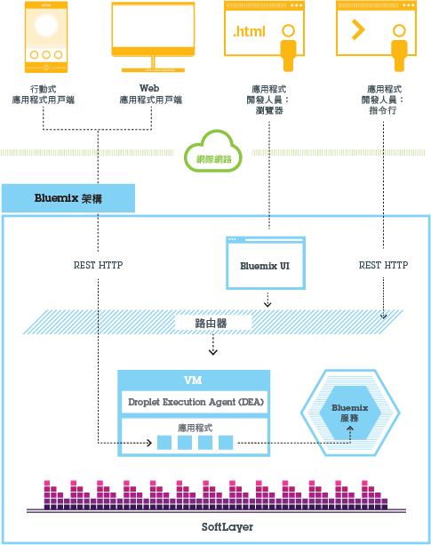
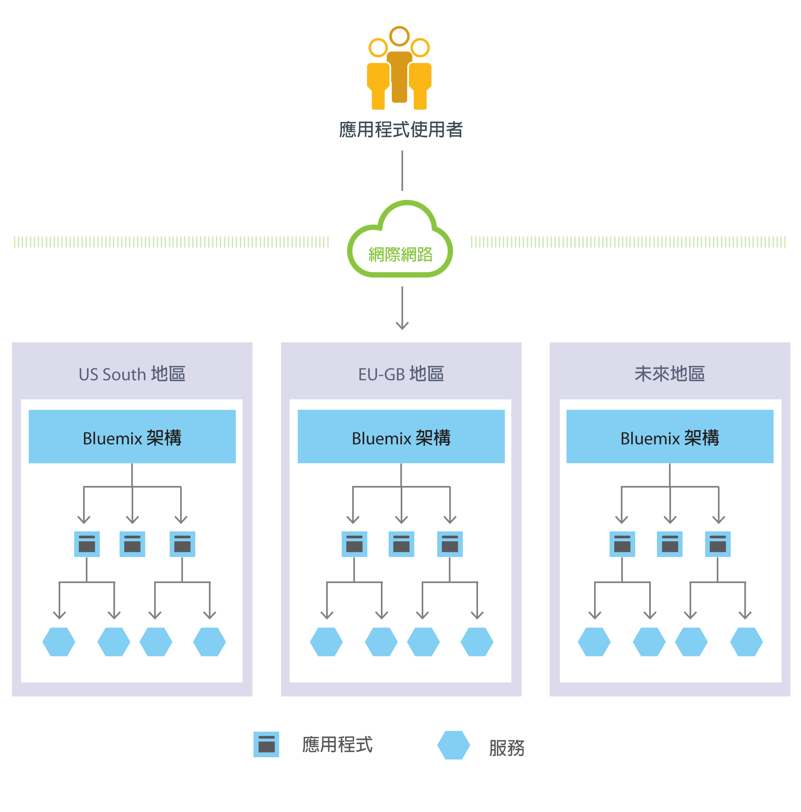
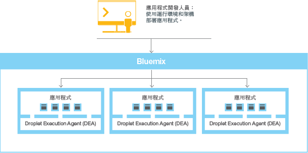
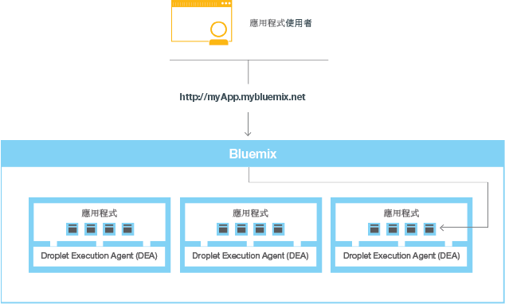

---


copyright:
  years: 2016, 2017
lastupdated: "2017-01-11"
---

{:shortdesc: .shortdesc}
{:new_window: target="_blank"}

# 何謂 {{site.data.keyword.Bluemix_notm}}？
{: #bluemixoverview}

{{site.data.keyword.Bluemix}} 是 {{site.data.keyword.IBM_notm}} 的創新雲端運算平台，結合平台即服務 (PaaS) 與基礎架構即服務 (IaaS)。此外，{{site.data.keyword.Bluemix_notm}} 還具有豐富的雲端服務型錄，可以輕鬆地與 PaaS 及 IaaS 整合，以快速地建置商業應用程式。
{:shortdesc}

不論您是計劃擴充的小型企業，還是需要額外隔離的大型企業，{{site.data.keyword.Bluemix_notm}} 都有符合您需求的雲端部署。您可以自由地在雲端中進行開發，在雲端中，您可以將專用服務連接至 {{site.data.keyword.IBM_notm}} 所提供的公用 {{site.data.keyword.Bluemix_notm}} 服務。您及您的團隊可以存取 {{site.data.keyword.Bluemix_notm}} 中的應用程式、服務及基礎架構，以及使用現有資料、系統、程序、PaaS 工具及 IaaS 工具。開發人員可以點選快速成長的可用服務及運行環境架構生態系統，以使用多國語言進行程式設計方式來建置應用程式。
 
使用 {{site.data.keyword.Bluemix_notm}}，就不再需要對測試或執行新應用程式的硬體進行大量投資。相反地，我們會為您進行所有管理，但只向您收取所使用部分的費用。{{site.data.keyword.Bluemix_notm}} 提供公用、[專用](/docs/dedicated/index.html)及[本端](/docs/local/index.html)整合式部署模型。 

您可以從頭開始構想、到開發沙盤推演，再到具有運算及儲存基礎架構、開放程式碼平台服務和容器以及 {{site.data.keyword.IBM_notm}}、Watson 等軟體服務及工具的廣域分散式正式作業環境。除了平台本身的功能之外，{{site.data.keyword.Bluemix}} 也提供彈性部署。在內部部署、專用的專用雲端環境或公用雲端中佈建 {{site.data.keyword.Bluemix}} 資源，以及在單一儀表板中管理來自這三種類型環境的資源。
 
部署在公用及專用環境中的所有 {{site.data.keyword.IBM_notm}} 雲端資源都是在您選擇的全球 {{site.data.keyword.CloudDataCent}} 位置進行管理。{{site.data.keyword.CloudDataCents_notm}} 提供地理備援（連接所有資料中心與存在點的廣域網路骨幹），以及嚴格安全控制和報告。透過 {{site.data.keyword.CloudDataCents_notm}}，{{site.data.keyword.IBM_notm}} 可以符合您的大部分需求擴充、安全、相符性及資料常駐需求。 

{{site.data.keyword.IBM_notm}} 可讓您：

* 在全球的安全 {{site.data.keyword.CloudDataCents_notm}} 中部署高效能運算及儲存基礎架構。
* 測試及採用 {{site.data.keyword.IBM_notm}}、開放程式碼社群及協力廠商開發人員的大範圍雲端服務及功能。
* 透過專用網路及 API 功能，從單一可擴充雲端平台連接至所有舊式系統及應用程式。
* 根據您的商業需求或工作負載需求變更，即時加快及調降資源。

### 應用程式
{: #bluemixoverviewapplications}

「應用程式」儀表板提供開始進行應用程式以及管理這些執行中應用程式所需的一切項目。{{site.data.keyword.Bluemix_notm}} 提供各種樣板及運行環境：

* 樣板是一種範本，適用於應用程式及其關聯的運行環境，以及特定網域的預先定義服務。 
* 運行環境是用來執行應用程式的資源集，可作為不同類型應用程式的容器。

{{site.data.keyword.Bluemix_notm}} 提供各種讓您執行應用程式的方法，例如，Cloud Foundry 及 {{site.data.keyword.containerlong}}。請使用 {{site.data.keyword.containerlong}}，以在 {{site.data.keyword.Bluemix_notm}} 上的管理雲端環境中執行 Docker 容器。 

您可以使用 {{site.data.keyword.openwhisk}} 進行分散式事件驅動運算。{{site.data.keyword.openwhisk_short}} 會執行應用程式邏輯，以回應來自 Web 或透過 HTTP 的行動應用程式的事件或直接呼叫。
 
您可以使用 {{site.data.keyword.Bluemix_notm}} Mobile 服務，以將預先建置、受管理且可擴充的雲端服務併入行動應用程式。 

### 服務
{: #bluemixoverviewservices}

「服務」儀表板可以存取 {{site.data.keyword.IBM}} 及協力廠商提供者提供的 {{site.data.keyword.Bluemix_notm}} 服務。這些服務包括 Watson、Internet of Things、Analytics、Mobile 及 DevOps Services：

* 只要使用 {{site.data.keyword.IBM_notm}} DevOps Services 及 {{site.data.keyword.Bluemix_notm}} Garage Method 的正確特性，即可透過更快速且更便宜的方式提供創新的應用程式。當您採用 DevOps 作法，並建立創新且靈活的文化，即可使用反覆運算作法，並因應市場而改變方向。
* 區塊鏈是新一代交易式應用程式的對等式分散式分類帳技術，可建立信任、可究責性及透明度，同時簡化商業程序。  
* Watson 讓您的應用程式具有一組完整語音、願景及資料 API 套組的認知運算。使用 Watson 服務部署認知平台，即可解決大部分複雜的商業問題。
* {{site.data.keyword.IBM_notm}} 可讓您利用豐富的整合式雲端資料庫以及「資料及分析」服務來執行其他作業。 
* {{site.data.keyword.IBM_notm}} Internet of Things 服務可讓您的應用程式與已連接的裝置、感應器及閘道進行通訊，並且使用這些項目所收集的資料。我們的秘訣是簡化裝置連接至 Internet of Things 雲端的方式。然後，您的應用程式即可使用我們的即時 API 及 REST API 來與裝置通訊，並且使用裝置所設定收集的資料。 
* {{site.data.keyword.IBM_notm}} 提供行動後端基礎架構，以讓您建置多平台、原生或混合式應用程式，同時也可以對其進行監視及測試。您也可以使用分析、安全、使用者觀點及持續交付來加強應用程式。 
 
{{site.data.keyword.Bluemix_notm}} 也提供您可以試用的實驗性服務。若要瞭解服務類型及可用性，請參閱 [{{site.data.keyword.Bluemix_notm}} 服務](/docs/services/index.html)。


### 基礎架構
{: #bluemixoverviewinfrastructure}

「基礎架構」儀表板提供各種服務以符合您的雲端基礎架構需求。

{{site.data.keyword.Bluemix_notm}} 基礎架構提供可用的最高執行雲端基礎架構。{{site.data.keyword.Bluemix_notm}} 基礎架構是一個平台，它會納入全球具有最多雲端運算選項的資料中心，然後整合並自動化所有項目。{{site.data.keyword.CloudDataCents_notm}} 充滿了頂級的運算、儲存及網路設備。每一個位置都是使用相同的方式進行建置、裝備及操作，因此，您在我們有提供服務的任何位置，都能得到完全相同的功能及可用性。位置是透過業界最先進的網中網所連接，這種網路會整合不同的公用、專用及內部管理網路，以提供較低的總網路成本、更好的存取，以及更快的速度。此外，資料中心及網路共用單一的專有管理系統。一項管理工具即可讓您控制一切－每部裸機伺服器、虛擬伺服器及儲存裝置，這些項目全都可以透過 API、入口網站及行動應用程式進行存取。

{{site.data.keyword.Bluemix_notm}} 基礎架構透過單一無縫式平台提供功能強大的裸機伺服器及彈性的虛擬伺服器。全部都是視需求提供，並按月或小時計費。裸機伺服器提供處理器密集及磁碟 I/O 密集工作負載的原始處理能力，而且可以配置成您的確切規格。虛擬伺服器則容許高速部署、彈性可擴充性及隨收隨付制計費。針對高效能運算，使用圖形處理裝置 (GPU) 伺服器來提高雲端的運算能力，頻率為每小時或每月。 

{{site.data.keyword.Bluemix_notm}} 基礎架構供應項目是連接至分成公用、專用及管理資料流量的三層網路。客戶 {{site.data.keyword.Bluemix_notm}} 帳戶的基礎架構可能會跨專用網路在這類基礎架構之間傳送資料，而無需任何成本。基礎架構供應項目（例如裸機伺服器、虛擬伺服器及雲端儲存空間）會跨公用網路連接至 {{site.data.keyword.Bluemix_notm}} 型錄中的其他應用程式及服務（例如 Watson 服務、容器或運行環境）。這兩種類型供應項目之間的資料傳送是依標準公用網路頻寬速率進行計量及收費。

## 使用 {{site.data.keyword.Bluemix_notm}} 主控台
{: #bluemixoverviewui}

當您存取 {{site.data.keyword.Bluemix_notm}} 主控台時，功能表列會顯示用來註冊、登入、存取文件及存取型錄的鏈結或按鈕。登入之後，功能表列會包含漢堡式功能表  及其他鏈結（視帳戶類型而定）：

* 如果您是不熟悉 {{site.data.keyword.Bluemix_notm}} 的使用者，則可以使用漢堡式功能表  來切換「應用程式」、「服務」或「基礎架構」儀表板。會顯示支援及帳戶選項的鏈結，而且您可以使用**型錄**鏈結來存取 {{site.data.keyword.Bluemix_notm}}、運算及基礎架構服務。 
* 如果您是現有使用者，並且已鏈結 {{site.data.keyword.Bluemix_notm}} 及 {{site.data.keyword.BluSoftlayer}} 帳戶，則可以使用漢堡式功能表  來切換「應用程式」、「服務」或「基礎架構」儀表板。會顯示支援及帳戶選項的鏈結，而且您可以使用**型錄**鏈結來存取 {{site.data.keyword.Bluemix_notm}}、運算及基礎架構服務。 
* 如果您是具有 {{site.data.keyword.Bluemix_notm}} 帳戶的現有使用者，則可以使用漢堡式功能表  來切換「應用程式」與「服務」儀表板。會顯示支援及帳戶選項的鏈結，而且您可以使用**型錄**鏈結來存取 {{site.data.keyword.Bluemix_notm}} 及運算服務。 
* 如果您是具有 {{site.data.keyword.BluSoftlayer}} 帳戶的現有使用者，但尚未將帳戶鏈結至 {{site.data.keyword.Bluemix_notm}}，則功能表列會顯示先前已在 {{site.data.keyword.BluSoftlayer}} 中提供的鏈結（例如 KnowledgeLayer 說明的存取、聯絡選項、通知、未解決問題單及登入）。此外，還會顯示「基礎架構」儀表板的鏈結，以及支援及帳戶選項的鏈結。 

## {{site.data.keyword.Bluemix_notm}} Cloud Foundry 架構
{: #architecture}

一般而言，您在 {{site.data.keyword.Bluemix_notm}} 的 Cloud Foundry 中執行應用程式時，不需要擔心作業系統及基礎架構層。例如根檔案系統及中介軟體元件等層會抽象化，因此您可以專注於應用程式碼。不過，如果您需要應用程式執行位置的明確資訊，可以進一步瞭解這些層。 

如需詳細資料，請參閱[檢視 {{site.data.keyword.Bluemix_notm}} 基礎架構層](/docs/manageapps/infra.html#viewinfra)。

身為開發人員，您可以利用以瀏覽器為基礎的使用者介面，來與 {{site.data.keyword.Bluemix_notm}} 基礎架構互動。您也可以使用 Cloud Foundry 指令行介面（稱為 cf）來部署 Web 應用程式。

用戶端（可以是行動應用程式、外部執行的應用程式、以 {{site.data.keyword.Bluemix_notm}} 為建置基礎的應用程式，或使用瀏覽器的開發人員）可以與 {{site.data.keyword.Bluemix_notm}} 管理的應用程式互動。用戶端會使用 REST 或 HTTP API，透過 {{site.data.keyword.Bluemix_notm}} 將要求遞送到其中一個應用程式實例或複合式服務。

下圖顯示高階 {{site.data.keyword.Bluemix_notm}} Cloud Foundry 架構。



圖 1. {{site.data.keyword.Bluemix_notm}} Cloud Foundry 架構

基於延遲或安全考量，您可以將應用程式部署至不同的 {{site.data.keyword.Bluemix_notm}} 地區。您可以選擇部署至一個地區，或是部署至多個地區。如需相關資訊，請參閱[地區](whatisbluemix.html#ov_intro_reg)。




圖 2. 多地區應用程式部署

## {{site.data.keyword.Bluemix_notm}} Cloud Foundry 的運作方式
{: #howwork}

將某個應用程式部署至 {{site.data.keyword.Bluemix_notm}} Cloud Foundry 時，您必須使用足夠的資訊來配置 {{site.data.keyword.Bluemix_notm}}，才能支援該應用程式。

* 對於行動應用程式，{{site.data.keyword.Bluemix_notm}} 包含代表行動應用程式後端的構件，例如行動應用程式用來與伺服器進行通訊的服務。
* 對於 Web 應用程式，您必須確保將運行環境及架構的相關資訊傳遞給 {{site.data.keyword.Bluemix_notm}}，讓 {{site.data.keyword.Bluemix_notm}} 可以設定適當的執行環境來執行應用程式。

每一個執行環境（包括行動及 Web）都與其他應用程式的執行環境相隔離。即使這些應用程式位在相同的實體機器上，也一樣會隔離執行環境。下圖顯示 {{site.data.keyword.Bluemix_notm}} Cloud Foundry 如何管理應用程式部署的基本流程：



圖 3. 部署應用程式

當您建立應用程式並將其部署至 {{site.data.keyword.Bluemix_notm}} Cloud Foundry 時，{{site.data.keyword.Bluemix_notm}} 環境會判定傳送應用程式的適當虛擬伺服器，或將應用程式所代表的構件傳送至其中的適當虛擬伺服器。對於行動應用程式，將在 {{site.data.keyword.Bluemix_notm}} 上建立行動後端投射。在雲端中執行的行動應用程式的任何程式碼最終都會在 {{site.data.keyword.Bluemix_notm}} 環境中執行。對於 Web 應用程式，在雲端中執行的程式碼是開發人員部署至 {{site.data.keyword.Bluemix_notm}} 的應用程式本身。虛擬伺服器的判定是根據數個因素，包括：

* 機器上已有的負載。
* 該虛擬伺服器支援的運行環境或架構。

選擇虛擬伺服器之後，每一部虛擬伺服器上的應用程式管理程式都會為應用程式安裝適當的架構及運行環境。然後，即可將應用程式部署至該架構。部署完成之後，即會啟動應用程式構件。

下圖顯示已部署多個應用程式的虛擬伺服器結構（也稱為 Droplet Execution Agent，DEA）：


圖 4. 虛擬伺服器的設計

在每一台虛擬伺服器中，應用程式管理程式都會與 {{site.data.keyword.Bluemix_notm}} 基礎架構的其餘部分進行通訊，並管理部署至此虛擬伺服器的應用程式。每一台虛擬伺服器都具有容器，用以隔離及保護應用程式。在每一個容器中，{{site.data.keyword.Bluemix_notm}} 會安裝每一個應用程式所需的適當架構及運行環境。

部署應用程式時，如果該應用程式具有 Web 介面（例如，Java Web 應用程式）或其他 REST 型服務（例如，向行動應用程式公開的行動服務），則應用程式的使用者就可利用正常的 HTTP 要求與其進行通訊。



圖 5. 呼叫 {{site.data.keyword.Bluemix_notm}} 應用程式

每一個應用程式都可以有一個以上的相關聯 URL，但是它們必須全部指向 {{site.data.keyword.Bluemix_notm}} 端點。要求到達時，{{site.data.keyword.Bluemix_notm}} 會檢查該要求，並判定其適用的應用程式，然後選取用來接收該要求的應用程式實例。


### 地區
{: #ov_intro_reg}

{{site.data.keyword.Bluemix_notm}} 地區是您可以在其中部署應用程式的已定義地理區。您可以在不同地區建立應用程式及服務實例，使用相同
{{site.data.keyword.Bluemix_notm}} 基礎架構以進行應用程式管理，以及使用相同的用量詳細資料視圖來處理計費。您可以選取最接近客戶的地區，並將應用程式部署至此地區，以縮短應用程式的延遲時間。您也可以選取您要保留應用程式資料以處理安全問題的地區。在多個地區中建置應用程式時，如果某個地區變成無法使用，則位於其他地區中的應用程式會繼續執行。您使用的每個地區的資源額度都相同。

如果您使用 {{site.data.keyword.Bluemix_notm}} 使用者介面，則可以切換至不同地區，以使用該地區中的空間。按一下使用者帳戶喜好設定鏈結，展開**地區**選取器，然後從清單中選取您需要的地區。

如果您使用 cf 指令行介面連接至要使用的 {{site.data.keyword.Bluemix_notm}} 地區，請使用 cf api 指令，並指定地區的 API 端點。例如，輸入下列指令以連接至 {{site.data.keyword.Bluemix_notm}} 歐洲英國地區：

```
cf api https://api.eu-gb.{{site.data.keyword.Bluemix_notm}}.net
```

唯一字首會指派給每一個地區。{{site.data.keyword.Bluemix_notm}} 提供下列地區及地區字首。

<!-- PRODUCTION ONLY: Ensure that URLs are production URLs, not stage1-->

| **地區名稱** | **地理位置** | **地區字首** | **cf API 端點** | **使用者介面主控台** |       
|-----------------|-------------------------|-------------------|---------------------|----------------|
| 美國南部地區 | 美國達拉斯 | ng | api.ng.bluemix.net | console.ng.bluemix.net |
| 英國地區 | 英國倫敦 | eu-gb | api.eu-gb.bluemix.net | console.eu-gb.bluemix.net |
| 雪梨地區 | 澳洲雪梨 | au-syd | api.au-syd.bluemix.net | console.au-syd.bluemix.net |
{: caption="Table 1. {{site.data.keyword.Bluemix_notm}} region list" caption-side="top"}


### {{site.data.keyword.Bluemix_notm}} 備援
{: #resiliency}

{{site.data.keyword.Bluemix_notm}} 的設計旨在於管理可擴充且具復原力的應用程式及應用程式構件，這些應用程式與應用程式構件可擴充以符合您的需要、維持高度可用性，而且可以快速從問題中回復。{{site.data.keyword.Bluemix_notm}} 會隔開追蹤互動狀態的元件（有狀態）與不追蹤互動狀態的元件（無狀態）。這項分隔容許 {{site.data.keyword.Bluemix_notm}} 視需要彈性地移動應用程式，以達到可擴充性與備援。

您的應用程式可以有一個以上的實例處於執行中狀態。如果單一應用程式有多個實例，則該應用程式只會上傳一次。不過，{{site.data.keyword.Bluemix_notm}} 會部署所要求的應用程式實例數，並將它們盡可能地分散至眾多虛擬伺服器。

您必須將所有持續性資料儲存在應用程式之外的有狀態資料儲存庫，例如 {{site.data.keyword.Bluemix_notm}} 所提供的其中一個資料儲存庫服務上。因為記憶體中或磁碟上快取的任何內容即使在重新啟動之後可能還是無法使用，所以您可以使用單一 {{site.data.keyword.Bluemix_notm}} 實例的記憶體空間或檔案系統，作為簡要的單一交易快取。使用單一實例設定，對您應用程式的要求可能會因為 {{site.data.keyword.Bluemix_notm}} 的無狀態本質而受到中斷。最佳作法是針對每一個應用程式至少使用三個實例，以確保其可用性。

所有 {{site.data.keyword.Bluemix_notm}} 基礎架構、Cloud Foundry 元件及 {{site.data.keyword.IBM_notm}} 特有的管理元件都具有高可用性。使用基礎架構的多個實例來平衡負載。

### 與記錄系統整合
{: #sor}

在雲端環境中，{{site.data.keyword.Bluemix_notm}} 可以透過連接以下兩個廣義種類的系統來協助開發人員： 

* *記錄系統* 包括用於儲存商業記錄及自動執行標準化處理程序的應用程式及資料庫。 
* *參與系統* 是指延伸記錄系統的實用性並使其更吸引使用者的功能。

透過整合記錄系統與在 {{site.data.keyword.Bluemix_notm}} 中建立的應用程式，您可以執行下列動作：

 * 透過下載並安裝內部部署的安全連接器，讓應用程式與後端資料庫之間能安全地通訊。
 * 以安全的方式呼叫資料庫。
 * 從含有資料庫及後端系統（例如客戶關係管理系統）的整合流程中建立 API。
 * 僅公開要向應用程式公開的綱目及表格。
 * {{site.data.keyword.Bluemix_notm}} 組織管理員可以將 API 發佈為只有組織成員才能看到的專用服務。
 
若要整合記錄系統與在 {{site.data.keyword.Bluemix_notm}} 中建立的應用程式，請使用 Cloud Integration 服務。利用 Cloud Integration 服務，您可以建立 Cloud Integration API 並將 API 發佈為組織的專用服務。

<dl>
<dt>Cloud Integration API</dt>
    <dd>使用 Cloud Integration API，可以透過 Web API 對位於防火牆後方的記錄系統進行安全存取。建立 Cloud Integration API 時，您可以選擇要透過 Web API 存取的資源、指定允許的作業，並包含 SDK 和範例來存取 API。如需如何建立 Cloud Integration API 的相關資訊，請參閱[開始使用 Cloud Integration](/docs/services/CloudIntegration/CldInt_GetStart.html)。</dd>
<dt>專用服務</dt>
    <dd>專用服務包含 Cloud Integration API、SDK 及授權原則。專用服務也可能包含來自服務提供者的文件或其他項目。只有組織管理員才能將 Cloud Integration API 發佈為專用服務。若要查看您可以使用的專用服務，請選取 {{site.data.keyword.Bluemix_notm}}「型錄」中的「專用」勾選框。您可以選取專用服務，並將其連結至應用程式，而不需要連接至 Cloud Integration 服務。將專用服務連結至應用程式的方式與其他 {{site.data.keyword.Bluemix_notm}} 服務相同。如需如何將 API 發佈為專用服務的相關資訊，請參閱「將 API 發佈為專用服務」。</dd>
</dl>

#### 情境：建立複合的行動應用程式以與記錄系統相連接
{: #scenario}

{{site.data.keyword.Bluemix_notm}} 提供了一個平台，您可以在該平台中整合行動應用程式、雲端服務及企業記錄系統，以提供與內部部署資料互動的應用程式。

例如，您可以建置行動應用程式，與位於防火牆後內部部署的客戶關係管理系統互動。您可以透過安全的方式呼叫記錄系統，並運用 {{site.data.keyword.Bluemix_notm}} 中的行動服務，以建置複合的行動應用程式。

首先，整合開發人員會在 {{site.data.keyword.Bluemix_notm}} 中建立行動後端應用程式。他們會使用「行動雲」樣板，該樣板使用他們最熟悉的 Node.js 運行環境。

然後，在 {{site.data.keyword.Bluemix_notm}} 使用者介面中利用 Cloud Integration 服務，透過安全連接器公開 API。整合開發人員會下載安全連接器，並以內部部署方式安裝它，以啟用其 API 與資料庫之間的安全通訊。建立資料庫端點之後，即可查看所有綱目，並擷取要以 API 形式向應用程式公開的表格。

整合開發人員會新增 Push 服務，以將行動通知提供給感興趣的客戶。此外，他們還會新增事業夥伴服務，以在使用 Twitter API 建立新的客戶記錄後發佈推文。

接著，身為應用程式開發人員，您可以登入 {{site.data.keyword.Bluemix_notm}}，下載 Android 開發工具箱，然後開發用於呼叫整合開發人員所建立 API 的程式碼。您可以開發一個行動應用程式，讓使用者可以在其行動裝置上輸入資訊。接著，行動應用程式會在客戶管理系統中建立客戶記錄。建立記錄後，該應用程式會向行動裝置推送通知，並開始一則關於新記錄的推文。

## {{site.data.keyword.Bluemix_notm}} 必要條件
{: #prereqs}

使用 {{site.data.keyword.Bluemix_notm}} 平台的必要條件有限，但我們提供一些。
{:shortdesc}

### 瀏覽器
{: #browsers}

下列清單指定 {{site.data.keyword.Bluemix_notm}} 所需的最低瀏覽器軟體：

 * Chrome：適用於您作業系統的最新版本
 * Firefox：適用於您作業系統及 ESR 45 的最新版本
 * Internet Explorer：第 11 版
 * Safari：適用於 Mac 的最新版本

### Cloud Foundry
{: #cf}

Cloud Foundry 指令行介面 6.5.1 版或更新版本 

# rellinks
{: #rellinks}
## general
{: #general}
* [何謂 {{site.data.keyword.Bluemix_notm}} ](http://www.ibm.com/cloud-computing/bluemix/what-is-bluemix/){:new_window}
* [開始使用 ](http://www.ibm.com/cloud-computing/bluemix/getting-started/){:new_window}
* [{{site.data.keyword.Bluemix_notm}} 新增功能](/docs/whatsnew/index.html)
* [瞭解混合式模型 ](http://www.ibm.com/cloud-computing/bluemix/hybrid/){:new_window}
* [管理帳戶](/docs/admin/adminpublic.html#mngacct)
* [{{site.data.keyword.Bluemix_notm}} 名詞解釋](/docs/overview/glossary/index.html)
