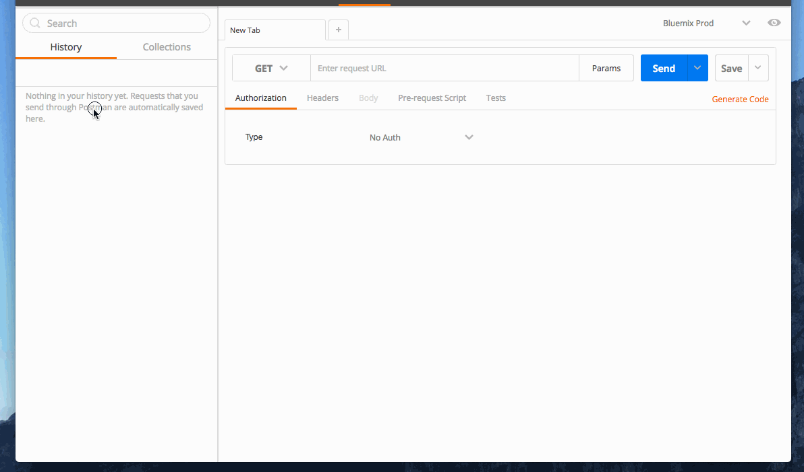
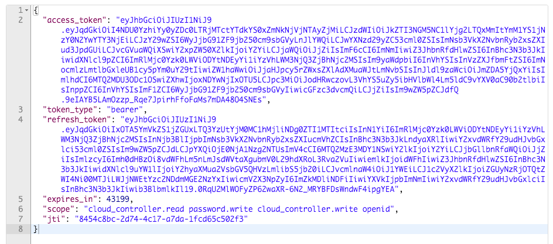
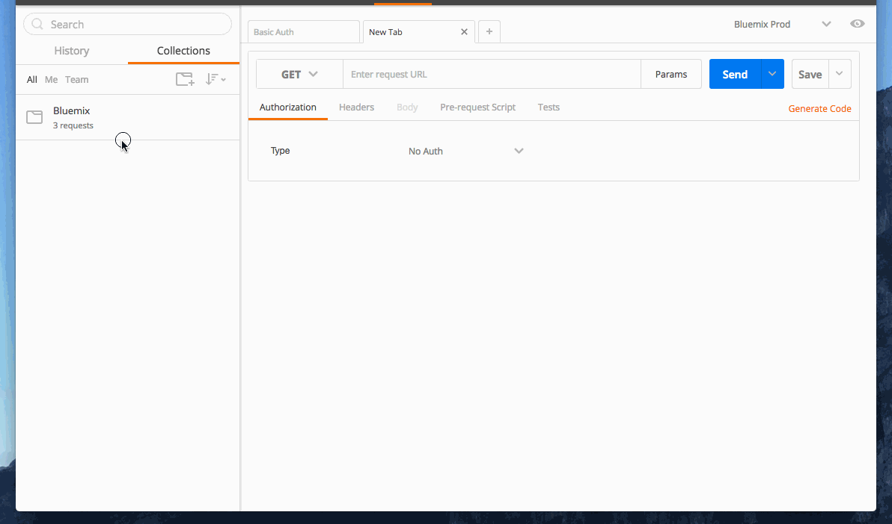

---

 

copyright:

  years: 2016

 

---

{:shortdesc: .shortdesc} 
{:new_window: target="_blank"}

# Basic Authentication Guide
*Last updated: 9 May 2016*

This guide will help you obtain an access token, include it in the header of your first API call, and refresh the access token when it expires.

## Quick Start

Here’s a collection of sample queries in Postman that’ll help you get up to speed with our APIs faster.

[](https://app.getpostman.com/run-collection/1ec341709b16d923b7f5)

#### Important Note
* You must update the {{USERNAME}} and {{PASSWORD}} fields within the Basic Auth sample query.




## Basic Authentication Overview

Some requests to the Bluemix API require authorization; that is, the user must have granted permission for an application to access the requested data. To prove that the user has granted permission, the request header sent by the application must include a valid **access token**.

This requires:

1. Requesting an access token
2. Using the access token to make an API call
3. Refreshing the token

### 1. Request an access token

You will need to request an access and refresh tokens by making a POST request to the Bluemix UAA Login Server’s /oath/token endpoint.

#### Example Request

cURL

```
curl -X POST -H "Authorization: Basic Y2Y6" -H "Accept: application/json" -H "Content-Type: application/x-www-form-urlencoded" -d 'grant_type=password&username={{USERNAME}}&password={{PASSWORD}}' "https://login.ng.bluemix.net/UAALoginServerWAR/oauth/token"
```
#### Important Note
You must replace `{{USERNAME}}` and `{{PASSWORD}}` with your Bluemix credentials.

#### Request Parameters

##### Endpoint

POST
```
https://login.ng.bluemix.net/UAALoginServerWAR/oauth/token
```


##### Body Parameters

| Key | Value |
|------- |-----------|
| grant_type | Required. This field must contain the value `password`. |
|username | Required. A valid Bluemix username. |
|password | Required. A valid Bluemix password. |

##### Header Parameters

| Key | Value |
|------- |-----------|
| Authorization | Required. This field must contain the value `Basic Y2Y6`. |
| Accept | Required. This field must contain the value `application/json`. |
|Content-Type | This field must contain the value `application/x-www-form-urlencoded`. |


#### Response

| Key | Type | Value |
|------- |-----------|
| access_token | String | An access token that can be provided in subsequent calls to the Cloud Foundry API. |
|token_type | String | How the access token may be used: always “bearer”. |
|refresh_token | String | A token that can be sent to the ____ in place of a username/password. When the access token expires, send a POST request to the Cloud Foundry /api/token endpoint, but use this code in place of a username/password. A new access token will be returned. A new refresh token might be returned too. |
|expires_in | Int | The time period (in seconds) for which the access token is valid. |

### 2. Use the access token to make an API call

The access token from Step 1 allows you to make requests to the Cloud Foundry API on a behalf of a user, for example, to get a list of the user's organizations:


### Example Request

cURL

```
curl -H "Authorization: bearer {{ACCESS_TOKEN}}" https://api.ng.bluemix.net/v2/organizations
```

###   Example Endpoint

GET
```
https://api.ng.bluemix.net/v2/organizations
```

### Header Parameters

| Key | Value |
|------- |-----------|
| Authorization | Required. This field must contain the value `bearer [ACCESS_TOKEN]` |


### 3. Refreshing your token

Your access token expires after 12 hours. In order to extend the session and not have to reauthorize, you will need to refresh your token.

When you made your authentication request, you received a refresh token.



Use this token to get a new access token.

####   Example Request

cURL
```
curl -X POST -H "Authorization: Basic Y2Y6" -H "Accept: application/json" -H "Content-Type: application/x-www-form-urlencoded" -d 'grant_type=refresh_token&refresh_token={{REFRESH_TOKEN}}' "https://login.ng.bluemix.net/UAALoginServerWAR/oauth/token"
```

#### Request Parameters

##### Endpoint

POST
```
https://login.ng.bluemix.net/UAALoginServerWAR/oauth/token
```

##### Body Parameters

| Key | Value |
|------- |-----------|
| grant_type | Required. This field must contain the value `refresh_token`. |
| refresh_token | Required. Your refresh token from your authentication response. |

##### Header Parameters

| Key | Value |
|------- |-----------|
| Authorization | Required. This field must contain the value `Basic Y2Y6`. |
| Accept | Required. This field must contain the value `application/json`. |
|Content-Type | This field must contain the value `application/x-www-form-urlencoded`. |



Now you have a new set of tokens and a new session.

## Conclusion

Now that you have obtained an access token and know how to refresh it from the UAA Login Server, you are all set to start using the Cloud Foundry API and more.

For more information on the API, visit the [CloudFoundry API Reference](https://apidocs.cloudfoundry.org).
