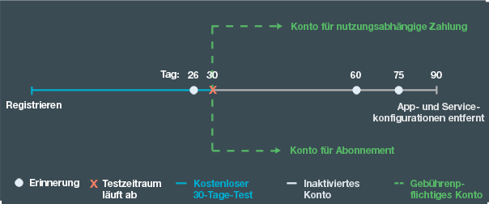

---

 

copyright:

  years: 2015, 2016

 

---

{:codeblock: .codeblock}
{:screen: .screen}
{:shortdesc: .shortdesc}
{:generic: data-hd-programlang="generic"}
{:java: data-hd-programlang="java"}
{:ruby: data-hd-programlang="ruby"}
{:c#: data-hd-programlang="c#"}
{:objectc data-hd-programlang="objectc"}
{:python: data-hd-programlang="python"}
{:javascript: data-hd-programlang="javascript"}
{:php: data-hd-programlang="php"}
{:swift: data-hd-programlang="swift"}
{:generic: data-hd-operatingsystem="generic"}
{:ios: data-hd-operatingsystem="ios"}
{:android: data-hd-operatingsystem="android"}
{:DomainName: data-hd-keyref="APPDomain"}
{:DomainName: data-hd-keyref="DomainName"}
{:app_name: data-hd-keyref="app_name"}
{:app_key: data-hd-keyref="app_key"}
{:app_secret: data-hd-keyref="app_secret"}
{:app_url: data-hd-keyref="app_url"}
{:org_name: data-hd-keyref="org_name"}
{:route: data-hd-keyref="route"}
{:space_name: data-hd-keyref="space_name"}
{:service_name: data-hd-keyref="service_name"}
{:service_instance_name: data-hd-keyref="service_instance_name"}
{:user_ID: data-hd-keyref="user_ID"}
{:subsection: outputclass="subsection"}
{:service: architecture="service"}
{:runtime: architecture="runtime"}
{:runtimeIconList: .runtimeIconList}
{:runtimeIcon: .runtimeIcon}
{:runtimeTitle: .runtimeTitle}
{:runtimeLink: .runtimeLink}
{:tsSymptoms: .tsSymptoms}
{:tsCauses: .tsCauses}
{:tsResolve: .tsResolve}

# Preisstruktur
{: #pricing}

*Letzte Aktualisierung: 16. Mai 2016*

Sie können kostenfrei Anwendungen in {{site.data.keyword.Bluemix}} ausführen und {{site.data.keyword.Bluemix_notm}}-Services testen. Sie können sich für einen kostenfreien 30-Tage-Test anmelden, bei dem Sie zusätzliche Leistungen, einschließlich kostenloser Unterstützung, erhalten. Nach 30 Tagen können Sie einen Kontotyp auswählen und nur für das bezahlen, was Sie über die kostenfreien Leistungen hinaus nutzen. Bluemix stellt Ihnen eine Berechnungsfunktion zur Verfügung, sodass Sie die Kosten im Voraus einschätzen können, sowie die Ansicht 'Nutzungsdashboard', in der Sie die tatsächlichen Kosten nach dem Erstellen Ihrer Apps überprüfen können.
{:shortdesc}

## Kostenloser Test
{: #trial}
Sie können sich für einen kostenfreien 30-Tage-Test mit Ihrer {{site.data.keyword.Bluemix_notm}}-ID registrieren. Während des Testzeitraums können Sie in {{site.data.keyword.Bluemix_notm}} Anwendungen entwickeln und Services nutzen.

Ihr Konto wird gebührenfrei mit den folgenden Ressourcen ausgestattet:

* Maximal 2 GB Speicher
* 10 Services
* 1 SSL-Zertifikat

Ihr kostenloser Testzeitraum läuft 30 Tage nach Ihrer Registrierung ab. Nach Ablauf des 30-Tage-Tests
werden die Anwendungen in Ihrem Konto gestoppt. Sie erhalten keine weitere Möglichkeit mehr, sich für einen
Test in {{site.data.keyword.Bluemix_notm}} zu registrieren. Sie können jedoch weiterhin auf Ihr Konto und die Konten zugreifen, in die Sie eingeladen wurden. Zum erneuten Starten Ihrer Anwendungen müssen Sie entweder Ihre Kreditkarteninformationen für ein Konto vom Typ Nutzungsabhängige Zahlung angeben oder ein Konto vom Typ Abonnement erstellen. Nach dem Konvertieren Ihres Kontos können Sie mit der Verwendung der kostenlosen Rechen- und Serviceressourcen fortfahren. Sie zahlen nur für die Nutzung von Services, Containern und Laufzeiten, die nicht durch die kostenlosen Monatsleistungen abgedeckt ist.

Wenn Sie Ihr Konto nach Ablauf des kostenlosen Testzeitraums nicht konvertieren, empfangen
Sie E-Mail-Benachrichtigungen über Ihren Kontostatus nach Ablauf des Tests. Die Benachrichtigungen
erinnern Sie daran, ein gebührenpflichtiges Konto zu erstellen, damit Ihre Anwendungseinstellungen
und -konfigurationen nicht verloren gehen. Wenn Sie diese Benachrichtigungen von {{site.data.keyword.Bluemix_notm}} nicht empfangen möchten, können Sie das Abonnement jederzeit beenden.
Einen Monat nach Ablauf des Testzeitraums werden Ihre Anwendungen und Servicekonfigurationen entfernt. In der folgenden Abbildung ist der allgemeine Prozess der
{{site.data.keyword.Bluemix_notm}}-Kontenverwaltung dargestellt.




*Abbildung 1. Prozessablaufdiagramm für die {{site.data.keyword.Bluemix_notm}}-Kontenverwaltung*


Wenn Sie Ihr Konto während Ihres kostenlosen Testzeitraums konvertieren, werden Ihre kostenlosen
Leistungen auf diejenigen begrenzt, die normalerweise von jedem Service bereitgestellt werden. Die kostenlosen
Leistungen sind keine Leistungen mit unbegrenzter Nutzung mehr, die von vielen IBM Services
während der kostenlosen Testperiode angeboten werden.


##Kosten
{: #what_it_costs}

Die Höhe der Gebühren hängt von den jeweiligen Ressourcen ab, die von einem bestimmten Service oder Container bzw. einer bestimmten Laufzeit, einem virtuellen Server oder einer Unterstützungsoption verwendet werden. Bei den Ressourcen kann es sich um die Anzahl der API-Aufrufe, die Anzahl der Instanzen, die Hauptspeichermenge, den Speicherplatz, usw. handeln. {{site.data.keyword.Bluemix_notm}} stellt auch eine detaillierte Kostenschätzungsfunktionen und eine Kostenberechnungsfunktion bis auf den letzten Cent bereit, die Ihnen beim Planen der Gebühren behilflich sein können. Sie können die tatsächlichen Kosten nach dem Erstellen der Apps in der Ansicht *Nutzungsdashboard* überprüfen. Genauere Informationen zu den Gebühren finden Sie unter [Berechnung der Gebühren](index.html#charges).
 

##Werbecode
{: #promo}

Gelegentlich erhalten Sie vom {{site.data.keyword.Bluemix_notm}}-Vertrieb oder einem anderen {{site.data.keyword.Bluemix_notm}}-Ansprechpartner Werbecodes. Wenn Sie einen solchen
Code anwenden, haben Sie die Möglichkeit, zusätzliche Ressourcen oder Funktionen zu erhalten,
die durch {{site.data.keyword.Bluemix_notm}} für
Ihr Testkonto bereitgestellt werden.

Die Ressourcen oder Funktionen variieren in Abhängigkeit vom jeweiligen Code,
doch sie können mehr oder weniger Folgendes umfassen:

* Vergrößern des Hauptspeicherkontingents auf eine durch den Werbecode angegebene Anzahl an GB
* Hinzufügen einer Organisation mit einem durch den Werbecode angegebenen Hauptspeicherkontingent
* Hinzufügen einer unbegrenzten Zahl an Organisationen
* Hochladen einer durch den Werbecode angegebenen weiteren Anzahl an SSL-Zertifikaten
* Verwenden von Prämienserviceplänen

**Hinweis:** Sie können mehrere Werbecodes auf Ihr Testkonto anwenden. Jeder Werbecode kann vor Ablauf seines Verfallsdatums
nur ein einziges Mal eingelöst werden.
Klicken Sie zum Verwenden eines Werbecodes auf das Symbol **Profileinstellungen**, wählen Sie **Konto** aus und klicken anschließend in der {{site.data.keyword.Bluemix_notm}}-Benutzerschnittstelle auf **Kontotyp**.

##Rechnungsabwicklung
{: #pay-accounts}

Wenn Sie sich für einen abrechnungsfähigen {{site.data.keyword.Bluemix_notm}}-Plan registrieren, können Sie eines der folgenden Konten auswählen:
* Nutzungsabhängig
* Abonnement
* {{site.data.keyword.Bluemix_notm}} Dedicated
* {{site.data.keyword.Bluemix_notm}} Local

Bei einem Konto für nutzungsabhängige Zahlung werden Ihnen die Kosten auf der Grundlage Ihrer Nutzung der {{site.data.keyword.Bluemix_notm}}-Berechnungen
und -Services in Rechnung gestellt. Bei einem Abonnementkonto können Sie einen monatlichen Rabatt auf der Basis einer verbindlichen Mindestausgabeverpflichtung erhalten. Die Gebühren für {{site.data.keyword.Bluemix_notm}} Dedicated und {{site.data.keyword.Bluemix_notm}} Local werden über Jahresverträge abgerechnet.

Sie können Ihre kostenlose Testversion jederzeit in ein belastbares Konto konvertieren. Die gesamten Kontoinformationen der kostenlosen, nicht fakturierbaren Testversion sowie die {{site.data.keyword.Bluemix_notm}}-Lösungen werden ohne Reibungsverluste in das neue belastbares Konto übernommen.

Nach der Erstellung eines belastbaren Kontos können Sie die von Ihnen angegebenen Informationen bearbeiten. Klicken Sie auf das Symbol **Profileinstellungen** in der rechten oberen Ecke der {{site.data.keyword.Bluemix_notm}}-Benutzerschnittstelle und klicken Sie anschließend auf **Konto &gt; Kontotyp**, um Ihre Informationen zu bearbeiten.

Falls während der Verwendung eines Kontos vom Typ Nutzungsabhängige Zahlung oder Abonnement Probleme mit {{site.data.keyword.Bluemix_notm}} auftreten, finden Sie weitere Informationen unter [Onlinehilfe abrufen](https://www.ng.bluemix.net/docs/troubleshoot/getting_customer_support.html#online_help).

###Nutzungsabhängiges Konto
{: #pay-as-you-go}

Wenn Sie sich für ein Konto für nutzungsabhängige Zahlung registrieren, bezahlen Sie nur für die {{site.data.keyword.Bluemix_notm}}-Ressourcen, die Sie nutzen. Sie haben außerdem die Möglichkeit, zusätzliche kostenlose Laufzeit- und Serviceleistungen zu nutzen.

In vielen Ländern und Regionen können Sie sich für ein Konto für nutzungsabhängige Zahlung über die {{site.data.keyword.Bluemix_notm}}-Benutzerschnittstelle registrieren. Klicken Sie auf das Symbol **Kostenlose Testversion** und anschließend auf **Bestätigen Sie Ihr kostenloses Konto** und wählen Sie **Option 1** aus. Geben Sie Ihr Land oder Ihre Region ein und klicken Sie auf **Kreditkarte hinzufügen**, um Ihre Kreditkarteninformationen anzugeben. Akzeptieren Sie nach der Angabe Ihrer Abrechnungs- und Kreditkarteninformationen die Vertragsbedingungen und schicken Sie Ihre Anforderung ab. Ihre Kreditkarteninformationen werden geprüft. Es wird auch eine Bestätigungs-E-Mail für die Kontoinformationen gesendet. Einige Minuten nach Empfang der Bestätigungs-E-Mail können Sie zu {{site.data.keyword.Bluemix_notm}} zurückkehren, um mit der Erstellung Ihrer Apps fortzufahren. Wenn {{site.data.keyword.Bluemix_notm}} Ihre Onlineanforderung für Ihr Land oder Ihre Region nicht verarbeiten kann, können Sie sich an den {{site.data.keyword.Bluemix_notm}}-Vertrieb wenden. Verwenden Sie den Link, der auf der Seite für die [Bluemix-Kontaktaufnahme](https://console.ng.bluemix.net/#/contactUs/cloudOEPaneId=contactUs) aufgelistet ist, um sich für Ihr Konto für nutzungsabhängige Zahlung zu registrieren.

Sie können Ihr Konto für nutzungsabhängige Zahlung jederzeit in ein Abonnementkonto konvertieren. Mit einem Abonnementkonto verpflichten
Sie sich zu einem monatlichen Mindestausgabebetrag. Wenn Sie Ihr Konto in ein Abonnementkonto konvertieren möchten, wenden Sie sich an den {{site.data.keyword.Bluemix_notm}}-Vertrieb, indem Sie den Link verwenden, der auf der Seite für die [Bluemix-Kontaktaufnahme](https://console.ng.bluemix.net/#/contactUs/cloudOEPaneId=contactUs) aufgelistet ist.

###Abonnementkonto
{: #subscription}

Wenn Sie sich für ein Abonnementkonto registrieren, verpflichten Sie sich zu einem Mindestausgabebetrag pro Monat und erhalten einen Abonnementrabatt, der auf diese Mindestgebühr angewendet wird. Außerdem müssen Sie jede Nutzung bezahlen, die über den Mindestausgabebetrag hinausgeht.

Um sich für ein Abonnementkonto anzumelden oder um weitere Informationen zu Abonnementgebühren und -nachlässen zu erhalten, wenden Sie sich an den {{site.data.keyword.Bluemix_notm}}-Vertrieb. Verwenden Sie dazu den Link, der auf der Seite für die [Bluemix-Kontaktaufnahme](https://console.ng.bluemix.net/#/contactUs/cloudOEPaneId=contactUs) aufgelistet ist.

###Zugeordnetes {{site.data.keyword.Bluemix_notm}}-Konto
{: #dedicated}

{{site.data.keyword.Bluemix_notm}} erfordert eine Mindestlaufzeit von einem Jahr und umfasst Folgendes:

* VPN-Anbindung zurück zu Ihrer Infrastruktur
* Vollständige redundante Umgebung in einem SoftLayer-Rechenzentrum
* Alle unterstützten Laufzeiten (IBM Java Liberty, Node.js sowie integrierte Open-Source-Laufzeiten)
* Alle dedizierten Services, die Sie ausgewählt haben, und alle öffentlichen {{site.data.keyword.Bluemix_notm}}-Services
* Standard-{{site.data.keyword.Bluemix_notm}}-Unterstützung

Es können auch optionale Elemente wie z. B. SoftLayer DirectLink oder Premium-Support-Optionen bestellt werden. Weitere Informationen erhalten Sie vom [Bluemix-Vertrieb](https://console.ng.bluemix.net/?direct=classic/#/contactUs/cloudOEPaneId=contactUs).

Bei
{{site.data.keyword.Bluemix_notm}} Dedicated müssen Sie sich für eine Mindestlaufzeit von
einem Jahr anmelden. Die monatlichen Kosten während dieser Laufzeit sind von den von Ihnen gewünschten
dedizierten Services plus einem Abonnementkonto abhängig, mit dem Sie auf alle öffentlichen Services zugreifen können. Die Nutzungsgebühren der Services in {{site.data.keyword.Bluemix_notm}} Public
werden auf der Grundlage Ihrer Abonnementkontovereinbarung berechnet. Sie erhalten für sämtliche Services, die Sie
über die Abonnementvereinbarung hinaus nutzen, eine Rechnung. Für Informationen zu Ihrer Vereinbarung wenden Sie sich an Ihren
zuständigen IBM Kundenbeauftragten bzw. an den
[Bluemix-Vertrieb](https://console.ng.bluemix.net/#/contactUs/cloudOEPaneId=contactUs).


###{{site.data.keyword.Bluemix_notm}} Local-Konto
{: #local}

{{site.data.keyword.Bluemix_notm}} erfordert eine Mindestlaufzeit von einem Jahr und umfasst Folgendes:

* Eine Zustellungsfunktion, die als Relay bezeichnet wird, mit deren Hilfe IBM eine Verbindung zu Ihrer lokalen Bereitstellung
herstellen und Aktualisierungen automatisch und unterbrechungsfrei übermitteln kann
* Alle unterstützten Laufzeiten (IBM Java Liberty, Node.js sowie integrierte Open-Source-Laufzeiten)
* Alle lokalen Services, die Sie ausgewählt haben, und Zugriff auf alle öffentlichen {{site.data.keyword.Bluemix_notm}}-Services
* Standard-{{site.data.keyword.Bluemix_notm}}-Unterstützung

Bei
{{site.data.keyword.Bluemix_notm}} Local müssen Sie sich für eine Mindestlaufzeit von
einem Jahr anmelden. Die monatlichen Kosten während dieser Laufzeit sind von den von Ihnen gewünschten
lokalen Services plus einem Abonnementkonto abhängig, mit dem Sie auf alle öffentlichen Services zugreifen können. Die Nutzungsgebühren der Services in {{site.data.keyword.Bluemix_notm}} Public
werden auf der Grundlage Ihrer Abonnementkontovereinbarung berechnet. Sie erhalten für sämtliche Services, die Sie
über die Abonnementvereinbarung hinaus nutzen, eine Rechnung. Für Informationen zu Ihrer Vereinbarung wenden Sie sich an Ihren
zuständigen IBM Kundenbeauftragten bzw. an den
[{{site.data.keyword.Bluemix_notm}}-Vertrieb](https://console.ng.bluemix.net/#/contactUs/cloudOEPaneId=contactUs).

##Berechnung der Gebühren
{: #charges}

Über ein belastbares {{site.data.keyword.Bluemix_notm}}-Konto werden die Gebühren für Berechnungen, Container und Services erhoben, die von Ihrer Organisation in Anspruch genommen werden. Es kann vorkommen, dass Sie von anderen {{site.data.keyword.Bluemix_notm}}-Benutzern eingeladen werden, unter einem anderen Konto an Organisationen teilzunehmen. Wenn Sie in den Organisationen, in die Sie eingeladen wurden, Anwendungen erstellen oder Services verwenden, werden die Gebühren, die für diese Nutzung anfallen, dem Konto in Rechnung gestellt, das die betreffenden Organisationen enthält. Weitere Informationen zu bestimmten Gebühren können Sie über die Detailseite einer Ressource im {{site.data.keyword.Bluemix_notm}}-Katalog oder über den Preisrechner auf der {{site.data.keyword.Bluemix_notm}}-Seite 'Preisstruktur' aufrufen.

Die Gebühren werden abhängig von den von Ihnen verwendeten Komponenten von {{site.data.keyword.Bluemix_notm}} berechnet. In der folgenden Tabelle wird eine allgemeine Übersicht bereitgestellt:

| Gebührentyp | Beschreibung | {{site.data.keyword.Bluemix_notm}}-Features, die diesen Gebührentyp verwenden | Beispiel |
|------------------|------------------|--------------------------|--------------------------|
| Fest | Die Festpreisgestaltung basiert auf einer vereinbarten monatlichen Gebühr, die nicht angepasst wird. | Services  | Für den Datencache wird ein fester Plan verwendet, der als feste monatliche Rate abgerechnet wird. |
| Nutzungsabhängig | Die nutzungsabhängige Preisgestaltung basiert auf der Anzahl der GB-Stunden, die für Laufzeiten verbraucht werden, der Anzahl der GB-Stunden, die verbraucht wurden und der Anzahl der IP-Adressen und des Speichers für die Container. | Services, Berechnen und Container | Beim Push-Service wird jede Nutzung in Rechnung gestellt, die über die kostenlose monatliche Leistung hinausgeht. |
|  Preisstufen   |  Manche Pläne basieren auf einem Preisstufenmodell, das einen dem tatsächlichen Nutzungsvolumen entsprechenden Nachlass ermöglicht. Für Services können Preistarife für einfache, gestaffelte oder Blockpreisstufen angeboten werden. | Services | Die gestaffelte Preisstruktur wird in der Regel für Gebührenmetriken verwendet, wenn große Mengen pro Monat erwartet werden, zum Beispiel für API-Aufrufe. |
| Reserviert | Die Preisgestaltung für Reservierungen basiert auf einer langfristigen Zusage für einen Service; dafür erhalten Sie einen reduzierten Preis. Bei einem Reservierungsplan erhalten Sie eine dedizierte Serviceinstanz, die sich in der öffentlichen {{site.data.keyword.Bluemix_notm}}-Umgebung leicht einrichten, implementieren und bereitstellen lässt. | Services | Für DB2 on Cloud werden Reservierungspläne bereitgestellt.|

###Gebühren für Rechenressourcen
{: #compute}

Ihnen werden die Zeit, die Ihre Anwendungen
aktiv sind, und der Speicher, der verwendet wird, in Form von berechneten *GB-Stunden* in Rechnung
gestellt. GB-Stunden berechnen sich aus der Anzahl der Anwendungsinstanzen multipliziert mit dem genutzten
Speicher pro Instanz multipliziert mit den Stunden, die die Instanzen aktiv sind. Sie können die Anzahl
der Instanzen und die Speicherkapazität pro Instanz nach Bedarf anpassen. Sie können darüber hinaus
Speicher oder Instanzen hinzufügen, um eine Skalierung auf weitere Benutzer zu realisieren. Die endgültige
Gebühr basiert auf GB-Stunden: Ihre Anwendungsinstanzen multipliziert mit der Speicherkapazität
pro Instanz multipliziert mit den Stunden, die sie aktiv waren.

Beispiel: Nehmen Sie eine Laufzeit an, die pro GB-Stunde einen Preis
von $0,07 in zwei 512-MB-Instanzen kostet und 30 Tage (720 Stunden)
aktiv ist. Diese Ressourcen würden nach den folgenden Berechnungen
$24,15 USD kosten, wobei eine kostenfreie Leistung von 375 GB-Stunden
berücksichtigt wird: 

```
2 Instanzen x 0,5 GB x 720 Stunden = 720 GB-Stunden.
(720 - 375) GB-Stunden x $0,07 pro GB-Stunde = $24,15
```

###Gebühren für Services
{: #services}

Viele Services schließen monatliche kostenlose
Leistungen ein. Die Nutzung von Services, die nicht von den kostenlosen Leistungen abgedeckt ist, wird auf eine der beiden
folgenden Arten in Rechnung gestellt:
<dl>
<dt>Feste Gebühren</dt>
    <dd>Sie wählen einen Plan aus und bezahlen einen Pauschalbetrag. Beispiel: Für den Datencacheservice wird ein Pauschalbetrag berechnet.</dd>
<dt>Nutzungsabhängige Gebühren</dt>
    <dd>Sie bezahlen entsprechend Ihrer Laufzeit- und Servicenutzung. Beispiel: Beim Push-Service wird
jede Nutzung in Rechnung gestellt, die über die kostenlose monatliche Leistung hinausgeht.</dd>
<dt>Reservierungsgebühren</dt>
    <dd><p>Als Eigner eines Kontos für nutzungsabhängige Zahlung oder eines Abonnementkontos können Sie sich eine Serviceinstanz bei einer langfristigen Verpflichtung zu einem reduzierten Preis reservieren lassen. Beispiel: Sie können sich das Angebot 'DB2 on Cloud' in der herkömmlichen Größe für 12 Monate reservieren lassen.</p> 
    <p>Für manche {{site.data.keyword.Bluemix_notm}}-Services werden Reservierungspläne angeboten. Sie können einen Reservierungsplan im {{site.data.keyword.Bluemix_notm}}-<strong>Katalog</strong> durch Klicken auf die Kachel des Service anfordern. Wählen Sie anschließend den Serviceplan aus, der Ihren Anforderungen am ehesten entspricht. Wenn ein Reservierungsplan verfügbar ist, klicken Sie auf <strong>Anfordern</strong> und gehen gemäß den Eingabeaufforderungen vor, um Ihre Anforderung zu senden. Sie erhalten eine E-Mail, in der die Preisinformationen für den Reservierungsplan enthalten sind. Außerdem wird sich bald ein {{site.data.keyword.Bluemix_notm}}-Vertriebsbeauftragter mit Ihnen in Verbindung setzen, um den Kauf durchzuführen.</p></dd>
<dt>Gestaffelte Preise</dt>
    <dd>Ähnlich wie bei den nutzungsabhängigen Gebühren bezahlen Sie die Gebühren entsprechend Ihrer Laufzeit- und Servicenutzung. Bei gestaffelten Preisen werden jedoch zusätzliche Preisstufen hinzugefügt, wobei oft reduzierte Gebühren in Stufen mit hohem Verbrauch angeboten werden. Gestaffelte Preise werden einfach, gestaffelt oder als Block angeboten.</dd>
</dl>


####Einfache Preisstufe
{: #simple_tier}

Im Modell mit einer einfachen Preisstufe wird der Einzelpreis durch die Preisstufe bestimmt,
in die Ihr Nutzungsvolumen fällt. Der Gesamtpreis besteht aus der Menge multipliziert mit dem Einzelpreis in dieser Preisstufe. Beispiel:

| Menge der Posten | Einzelpreis für alle Posten |
|-------------------|--------------------------|
| Stufe 1: 1 - 1000  | $ 1 USD                   |
| Preisstufe 2: 1001 - 2000    |    $ 0,90 USD                      |
| Preisstufe 3: 2001 - 3000                  |   $ 0,75 USD                       |
| Preisstufe 4: 3001 - 4000           |      $ 0,60 USD                    |
|Preisstufe 5: &gt; 4000 | $ 0,40 USD | 

*Tabelle 1. Preistabelle für einfache Preisstufe*

In der folgenden Tabelle sind die Gebühren dargestellt, die im Rahmen eines Plans anfallen, der auf dem Preismodell mit einfacher Preisstufe basiert:

| Menge der Posten | Gebührenberechnung | Gesamtpreis |
|-------------------|--------------------|-------------|
|500 |	500 × 1 = 500 |	$ 500 USD|
|1500 |	1500 × 0,90 = 1350 |	$ 1350 USD|
|2500 |	2500 × 0,75 = 1875 |	$ 1875 USD|
|... |	... |	...|
|5200 |	5200 × 0,40 = 2080 |$ 2080 USD|
*Tabelle 2. Gebührenberechnung anhand des Preismodells mit einfacher Preisstufe*

####Gestaffelte Preisstufe
{: #graduated_tier}

Im Modell mit gestaffelter Preisstufe sinkt der Einzelpreis bei einer höheren Nutzungsrate. Der Gesamtpreis besteht aus den kumulativen Gebühren für die einzelnen Nutzungsstufen,
bestehend aus der Menge multipliziert mit dem Einzelpreis für die jeweilige Preisstufe. Beispiel:

| Menge der Posten |	Einzelpreis für Posten in dieser Preisstufe|
|-------------------|------------------------------------|
|    Stufe 1: 1 - 1000 |	$ 1 USD |
|   Preisstufe 2: 1001 - 2000 |	$ 0,90 USD |
|    Preisstufe 3: 2001 - 3000 |	$ 0,75 USD |
|    Preisstufe 4: 3001 - 4000 |	$ 0,60 USD |
|    Preisstufe 5: &gt; 4000 |	$ 0,40 USD |
*Tabelle 3. Preisstruktur mit gestaffelter Preisstufe*

In der folgenden Tabelle sind die Gebühren dargestellt, die im Rahmen eines Plans anfallen, der auf dem Preismodell mit gestaffelter Preisstufe basiert:

|Menge der Posten | Gebührenberechnung | Gesamtpreis|
|------------------|--------------------|------------|
|500 |	500 × 1 (Einzelpreis für Preisstufe 1) = 500 |	$ 500 USD|
|1500 |	(1000 × 1 (Einzelpreis für Preisstufe 1)) + (500 × 0,90 (Einzelpreis für Preisstufe 2)) = 1450 |	$ 1450 USD|
|2500 |	(1000 × 1 (Einzelpreis für Preisstufe 1)) + (1000 × 0,90 (Einzelpreis für Preisstufe 2)) + (500 × 0,75 (Einzelpreis für Preisstufe 3)) = 2275 |	$ 2275 USD |
|... |	... |	...|
|5200 |	(1000 × 1 (Einzelpreis für Preisstufe 1)) + (1000 × 0,90 (Einzelpreis für Preisstufe 2)) + (1000 × 0,75 (Einzelpreis für Preisstufe 3)) + (1000 × 0,60 (Einzelpreis für Preisstufe 4)) + (1200 × 0,40 (Einzelpreis für Preisstufe 5)) = 3730 |	$ 3730 USD|
*Tabelle 4. Gebührenberechnung anhand des Preismodells mit gestaffelter Preisstufe*

####Blockpreisstufe
{: #block_tier}

Im Preismodell mit Blockpreisstufen ist der Preis eine feste Gebühr
für die genutzte Menge innerhalb einer Nutzungsstufe. Der Gesamtpreis besteht aus der Gebühr für die jeweilige Nutzungsstufe,
unabhängig von der tatsächlichen Nutzung. Jede nachfolgende Preisstufe bietet ein niedrigeres Preis-Menge-Verhältnis. Beispiel:

|Menge der Posten |	Gesamtpreis für alle Posten|
|------------------|-----------------------------|
| Preisstufe 1: &lt;= 1000 |	$ 1000 USD|
| Preisstufe 2: &lt;= 2000 |	$ 1900 USD|
| Preisstufe 3: &lt;= 3000 |	$ 2800 USD|
| Preisstufe 4: &lt;= 4000 |	$ 3500 USD|
| Preisstufe 5: &lt;= 10000 |	$ 5000 USD|
*Tabelle 5. Tabelle der Preisstruktur mit Blockpreisstufe*

In der folgenden Tabelle sind die Gebühren dargestellt,
die im Rahmen eines Plans anfallen, der auf dem Preismodell mit Blockpreisstufe basiert:

|Menge der Posten |	Gebührenberechnung |	Gesamtpreis|
|------------------|-----------------------|---------------|
|500 |	Die Anzahl der Posten fällt in die Preisstufe 1, d. h., der Gesamtpreis beträgt $ 1000 USD. |	$ 1000 USD|
|1500 |	Die Anzahl der Posten fällt in die Preisstufe 2, d. h., der Gesamtpreis beträgt $ 1900 USD. |	$ 1900 USD|
|... |	... |	...|
|5200 |	Die Anzahl der Posten fällt in die Preisstufe 5, d. h., der Gesamtpreis beträgt $ 5000 USD. |	$ 5000 USD|
*Tabelle 6. Gebührenberechnung anhand des Preismodells mit Blockpreisstufe*

### Kostenfreie Leistungen für virtuelle Server
{: #vms}

Sie können die virtuellen {{site.data.keyword.Bluemix_notm}}-Server in der öffentlichen IBM Cloud als kostenlose Beta-Features nutzen. Kostenlose Leistungen werden für die Anzahl der von Ihnen erstellten
Images virtueller Server, für die Anzahl der zugeordneten IP-Adressen und für die nutzbare Speichermenge zur Verfügung gestellt.

Im Folgenden sind die kostenlosen Leistungen für
die Betaversion der virtuellen {{site.data.keyword.Bluemix_notm}}-Server aufgeführt:

* 8 Instanzen
* 8 virtuelle CPUs
* 12 GB Speicher
* 200 GB Blockspeicher
* 4 öffentliche IP-Adressen

Sie können zudem mithilfe der Infrastruktur virtueller Server
in Ihren nicht öffentlichen {{site.data.keyword.Bluemix_notm}}-Clouds
virtuelle Server bereitstellen, wobei nur die Einschränkungen und Quoten Ihrer nicht öffentlichen Clouds zu berücksichtigen sind.


##Vorgehensweise zum Schätzen der Kosten
{: #cost}

Es gibt unterschiedliche Methoden
zur Ermittlung der Kosten für die Nutzung von {{site.data.keyword.Bluemix_notm}},
um Ihre App zu erstellen und zu hosten.

* Von den Kostenschätzern auf der Seite für die Preisstruktur von {{site.data.keyword.Bluemix_notm}} wird eine grobe Einschätzung der Kosten auf der Grundlage der Größe Ihrer App bereitgestellt.
* Mit dem Kostenrechner auf der Seite für die Preisstruktur von {{site.data.keyword.Bluemix_notm}} werden auf der Grundlage Ihrer Eingabe zu Laufzeit und Servicenutzung genaue App-Preise ermittelt.
* Sie können Ihre Kosten auch manuell berechnen.

###Kostenrechner verwenden
{: #calculator}

Sie können den Preis für Ihre App mithilfe der von {{site.data.keyword.Bluemix_notm}} bereitgestellten Kostenrechner rasch ermitteln.

1. Rufen Sie die {{site.data.keyword.Bluemix_notm}}-[Seite für die Preisstruktur](https://console.{DomainName}/pricing/) auf. 
2. Verwenden Sie eines der Widgets **Schätzen Sie Ihre Kosten ein** oder klicken Sie auf **Rechner öffnen**, um den **centgenauen Preisrechner** zu verwenden.

Zur Verwendung der Berechnungsfunktion geben Sie Ihre projizierte monatliche Nutzung der aufgelisteten
Ressourcen ein, z. B. die Anzahl der Instanzen oder Push-Benachrichtigungen. Klicken Sie
in das Feld **Monatliche Nutzung**, um Hinweise zu den Einheiten zu erhalten,
die in dem Feld erwartet werden. Die Berechnungsfunktion zeigt die Kosten für Ihre Eingabe sofort an. Sie können die Berechnungsfunktion auch anpassen, um jährliche Kosten anstelle von monatlichen Kosten anzuzeigen.

###Kosten manuell schätzen
{: #manual}

Sie wollen zum Beispiel Ihre
{{site.data.keyword.Bluemix_notm}}-Kosten selbst schätzen oder
besser verstehen, wie sich {{site.data.keyword.Bluemix_notm}}-Kosten
errechnen. Sie können den Gesamtpreis für die Nutzung von
{{site.data.keyword.Bluemix_notm}}
für das Erstellen und Hosting Ihrer App berechnen, indem Sie die Preise
der Laufzeit und der von der Laufzeit verwendeten Services betrachten. Die Preise der Laufzeiten und Services
ändern sich manchmal, sodass Sie jeweils die neuesten Informationen auf der
{{site.data.keyword.Bluemix_notm}}-Preisliste
für die Berechnung des Gesamtpreises verwenden müssen.

###Beispiel: Preis für eine Beispielanwendung ermitteln
{: #sample}

Nehmen Sie an, Sie
haben eine Node.js-Webanwendung mit Skalierbarkeitsfunktionalität und die Anwendung nutzt verschiedene Services,
die von {{site.data.keyword.Bluemix_notm}} bereitgestellt werden. Dieses Beispiel zeigt, wie die tatsächlichen Kosten Ihrer Anwendung berechnet werden. Die Webanwendung
nutzt die folgenden {{site.data.keyword.Bluemix_notm}}-Services
und -Elemente:

* Vier Node.js-Laufzeitinstanzen mit jeweils 256 MB
* Zwei {{site.data.keyword.autoscaling}}-Richtlinien (Prozessor und Speicher)
* 2 GB {{site.data.keyword.datacshort}} pro Monat
* 150 GB NoSQL-Datenbank pro Monat, 100.000 komplexe API-Aufrufe und 500.000 einfache API-Aufrufe
* 8 GB {{site.data.keyword.sqldb}}-Datenbankkapazität pro Monat
* 20 GB Datenvolumen für ein- und ausgehenden Netzverkehr

###Preise für {{site.data.keyword.Bluemix_notm}}-Ressourcen
{: #sample_resources}

Nehmen Sie an, um das Beispiel einfach zu halten, dass die Preise in der
folgenden Tabelle innerhalb eines Zeitrahmens oder zwischen zwei Perioden zum Beispiel eines Monats
nicht schwanken. Alle Preisangaben in diesem Beispiel erfolgen in US-Währung.

|Service |	Features |	Preis |
|--------|-----------|--------|
|SDK for Node.js |	375 GB-Stunden pro Monat kostenlos (für alle Laufzeiten gemeinsam) |	$0,07 USD/GB-Stunde|
|Auto-Scaling |	Kostenloser Serviceplan für den Auto-Scaling-Service |	Kostenlos|
|Datencache - Starter |	1 GB Cachebereich und ein Replikat |	$55,00 USD/Instanz |
|Datencache - Standard |	5 GB Cachebereich und ein Replikat |	$155,00 USD/Instanz |
|Datencache - Premium |	25 GB Cachebereich und ein Replikat |	$505,00 USD/Instanz|
|IBM Cloudant® NoSQL DB for {{site.data.keyword.Bluemix_notm}} |	2 GB freier Speicher<br/>50.000 einfache API-Aufrufe pro Monat kostenlos<br/>10.000 komplexe API-Aufruf pro Monat kostenlos | $1,00 USD/GB<br/>0,03 USD/1000 einfache API-Aufrufe<br/>$0,15 USD/1000 komplexe API-Aufrufe |
|SQL Database 	| 2 GB pro Instanz kostenlos<br/>Maximal 10 GB pro Instanz |	$30,00 USD/Instanz |
*Tabelle 7. Preisliste*

###Berechnung des Anwendungspreises

Der Preis der Anwendung kann auf die folgende Weise berechnet werden:

<dl>
<dt>Vier Node.js-Laufzeitinstanzen mit jeweils 256 MB</dt>
<dd>Bluemix rechnet für eine Laufzeit nach GB-Stunden ab. Die Anzahl der genutzten GB pro Monat beträgt <code>4 x 256 = 1024 MB oder 1 GB pro Monat</code>. Nehmen Sie an, dass <code>ein Monat 24 x 30 = 720 Stunden</code> hat, sodass für die Anwendung <code>1 x 720 = 720 GB-Stunden</code> berechnet werden.
<p>
375 GB-Stunden gehören zu den kostenlosen Leistungen eines Monats, die für alle
{{site.data.keyword.Bluemix_notm}}-Laufzeiten genutzt werden können. Daher betragen die Gesamtkosten für die Laufzeit <code>$0,07 x (720-375) = $24,15</code>.</p></dd>

<dt>Zwei Auto-Scaling-Richtlinien (Prozessor und Speicher)</dt>
<dd>Die Auto-Scaling-Richtlinien sind gebührenfrei.</dd>

<dt>2 GB Datencache pro Monat</dt>
<dd>Der 50-MB-Plan, der vom Auto-Scaling-Service bereitgestellt wird, ist gebührenfrei. Ihr gebührenfreier Plan würde jedoch nicht Ihre projektierte Nutzung von 2 GB pro Monat
abdecken. Die drei gebührenpflichtigen Pläne für Datencache kosten einen festen Betrag für eine bestimmte Speichergröße unabhängig davon, wie viel Speicher Sie tatsächlich nutzen. Daher ist es
sinnvoll, den Minimalplan zu wählen, der Ihre projektierte Nutzung abdeckt. Dies ist der Standardplan von 5
GB. Die Gesamtkosten betragen $155 pro Monat.</dd>

<dt>150 GB NoSQL-Datenbank pro Monat</dt>
<dd>Die Gebühren für den IBM Cloudant NoSQL DB for {{site.data.keyword.Bluemix_notm}}-Service basieren auf der Speicherung von Daten und der Möglichkeit, auf diese Daten mit verschiedenen API-Methoden zuzugreifen. Die Befehle <strong>PUT</strong> und <strong>POST</strong>
werden als komplexe API-Aufrufe betrachtet, während Befehle <strong>GET</strong>
als einfache API-Aufrufe betrachtet werden.
<p>
Addieren
Sie die Anzahl GB und ziehen Sie 2 GB für kostenlos nutzbaren Speicher ab. 148 GB werden pro Monat in Rechnung gestellt. Subtrahieren Sie die kostenlos nutzbaren 50.000 einfachen API-Aufrufe und die 10.000 komplexen API-Aufrufe. Der
Gesamtspeicherpreis setzt sich dann wie folgt zusammen:</p>
<pre class="codeblock">
<codeblock>
    148 x 1 = $148
    (450.000 / 1000) x 0,03 = $13,5
    (90.000 / 1000) x 0,15 = $13,5
</codeblock>
</pre>
<p>
Der Gesamtpreis beträgt 148 + 13,5 + 13,5 = $175.</p></dd>

<dt>8 GB SQL-Datenbankkapazität pro Monat</dt>
<dd>Der Gesamtpreis beläuft sich auf $30 pro Instanz.</dd>

<dt>20 GB Datenvolumen für ein- und ausgehenden Netzverkehr</dt>
<dd>Eingehender und ausgehender Netzdatenverkehr ist gebührenfrei.</dd>

</dl>

Wenn alle Positionen addiert werden, beträgt der Gesamtpreis
der Anwendung $384,15.

##Nutzungsdashboard
{: #usage}

Als Kontoeigner oder Abrechnungsmanager können Sie die Ansicht 'Nutzungsdashboard' verwenden, um die Gebühren für die Laufzeiten und Services, die monatlich in Ihrer Organisation genutzt werden, anzuzeigen. Sie können die GB-Stunden für Laufzeiten und die Servicenutzung in allen Regionen anzeigen oder eine bestimmte Region und einen bestimmten Bereich für die Anzeige der vergangenen 12 Stunden auswählen.

Um die Ansicht 'Nutzungsdashboard' zu öffnen, klicken Sie auf das Symbol **Konto und Unterstützung** &gt; **Konto** &gt; *ihr_kontoname* &gt; **Nutzungsdashboard**. In dieser Ansicht finden Sie eine Zusammenfassung der Laufzeit- und Servicenutzung für das Konto. Abrechnungsmanager können nur die Details für die Organisationen anzeigen, in denen ihnen die Rolle des Abrechnungsmanagers zugewiesen ist.

Dem Kontoeigner werden die Gebühren für die Gesamtnutzung, die für alle Organisationen anfallen, am Ende jedes Abrechnungszyklus in Rechnung gestellt. Jeder Abrechnungszyklus dauert einen Monat.

Kontoeigner können die Nutzungszusammenfassung nach Region und Organisation filtern. Wenn Sie ein Kontoeigner sind, legen Sie unter **Organisation** die Auswahl **Alle Organisationen** fest, um die Nutzung für das gesamte Konto für einen zwölfmonatigen Zeitraum anzuzeigen. Klicken Sie auf einen bestimmten Monat, um die Nutzung für diesen Monat anzuzeigen. Die angezeigten Gebühren stellen den Betrag dar, der Ihnen als Kontoeigner für diesen Monat in Rechnung gestellt wird.

Wenn Sie unter **Organisation** eine bestimmte Organisation auswählen, können Sie die gesamte Nutzung für diese Organisation, einschließlich der Nutzung als Teil eines gebührenfreien Nutzungskontingents anzeigen. Die für die Organisation angezeigten Gebühren sind nicht die Gebühren, die Ihnen in Rechnung gestellt werden. Die Nutzung des gebührenfreien Nutzungskontingents wird auf Kontoebene als kostenlos angezeigt, aber nicht auf Organisationsebene. Aus diesem Grund wird beim Anzeigen der Nutzung der Organisation die tatsächliche Nutzung für diese Organisation einschließlich der kostenlosen und der gebührenpflichtigen Nutzung angezeigt. Beim Anzeigen der Nutzung aller Organisationen wird die Nutzung für das Konto aufsummiert, nachdem das gebührenfreie Nutzungskontingent entfernt wurde.

##Benachrichtigungen
{: #notifications}

Als Manager eines Kontos vom Typ Nutzungsabhängige Zahlung können Sie Benachrichtigungen über Ausgaben für die Gesamtkosten Ihres Kontos, für Laufzeit, Services und für individuelle Services einrichten, mit Ausnahme von Services anderer Anbieter. Sie erhalten Benachrichtigungen, wenn Sie 80 %, 90 % und 100 % des angegebenen Schwellenwerts für die Ausgaben erreicht haben.

Um die Ansicht **Benachrichtigungen** zu öffnen, klicken Sie auf das Symbol **Konto und Unterstützung** &gt; **Konto** &gt; *ihr_kontoname* &gt; **Benachrichtigungen über Ausgaben**. Geben Sie einen numerischen Wert ein, um bei Bedarf das Ausgabelimit für das Auslösen einer Benachrichtigung für jeden Typ der Benachrichtigung über Ausgaben festzulegen. Sie können auch Benachrichtigungen
für einzelne Services hinzufügen und löschen.

##Vorgehensweise zum Ändern des Plans
{: #changing}

Sie können Ihren Serviceplan in {{site.data.keyword.Bluemix_notm}} im Dashboard für den Service ändern, falls diese Funktion für den betreffenden Service aktiviert ist.

Nur bestimmte Services ermöglichen Ihnen das Ändern des Serviceplans. Wenn Planänderungen für den Service aktiviert sind, wird im Dashboard für den Service die Option **Plan** im linken Navigationsbereich angezeigt. Für jeden Service müssen unterschiedliche weitere Schritte ausgeführt werden, wenn Sie Ihren Plan ändern.

1. Klicken Sie zum Ändern des Plans im Dashboard für den Service auf **Plan**. Normalerweise können Sie ein Upgrade oder eine Herabstufung für Ihren Plan vornehmen.
2. Nach dem Ändern des Plans müssen Sie eine Reihe weiterer Schritte ausführen. Die Schritte variieren abhängig von der Art der Planänderung und vom Service. Wenn Sie Ihren Plan beispielsweise herabstufen, ist möglicherweise ein erneutes Staging für Ihre App erforderlich. Wenn Sie für Ihren Plan ein Upgrade durchführen, müssen Sie möglicherweise ein erneutes Staging für Ihre App sowie weitere Aktionen durchführen.<br/><br/>Für ein erneutes Staging Ihrer App rufen Sie das {{site.data.keyword.Bluemix_notm}}-Dashboard auf und suchen Sie nach der App, an die der Service gebunden ist. Wählen Sie im Menü der App **Anwendung erneut starten** aus.<br/><br/>Weitere nachfolgende Aktionen sind vom Service abhängig. In der folgenden Tabelle sind bestimmte Aktionen aufgeführt.

|Service |	Informationen|
|--------|-------------|
|Presence Insights 	|Wenn Sie einen Lite-Plan verwenden und das kostenfreie Kontingent überschreiten, wird die Nachricht 403 angezeigt oder protokolliert, um anzugeben, dass Sie nicht mehr über die entsprechende Berechtigung verfügen und dass Ihre Serviceinstanz inaktiviert ist. Darüber hinaus werden REST-API-Aufrufe des Typs POST mit der Antwort 403 zurückgewiesen.<br/><br/>Wenn der Service inaktiviert wurde, weil Sie das kostenfreie Kontingent überschritten haben, können Sie ein Upgrade von einem Lite-Plan auf einen Paid-Plan durchführen. Der Service wird innerhalb von 2 Stunden erneut aktiviert.<br/><br/>Wenn Sie einen Paid-Plan verwenden, können Sie eine Herabstufung auf einen Lite-Plan durchführen, vorausgesetzt, Ihre Nutzungsrate für Ereignisse und Gesamtspeicher bleibt innerhalb des Lite-Kontingents für diese Posten.<br/><br/>Wenn Sie ein Upgrade oder eine Herabstufung des Plans vornehmen, müssen Sie kein erneutes Staging und keinen Neustart für Ihre Apps durchführen.|
*Tabelle 8. Die nächsten Schritte für die Änderung Ihres Plans*

###Verwendungshinweise zum Ändern des Plans über die Befehlszeilenschnittstelle

Optional können Sie den Serviceplan auch über die Befehlszeilenschnittstelle ändern.
Geben Sie zum Aktualisieren des Serviceplans den folgenden Befehl ein:
```
cf update-service <Servicename> [-p <neuer Plan>]
```
# Zugehörige Links
## Allgemein 
* [{{site.data.keyword.Bluemix_notm}} - Preisliste](https://console.{DomainName}/pricing/)
* [{{site.data.keyword.Bluemix_notm}} Developers Community Forum](https://developer.ibm.com/bluemix/)
* [Onlinehilfe abrufen](https://www.{DomainName}/docs/troubleshoot/getting_customer_support.html#online_help)
* [Kontaktaufnahme](https://console.{DomainName}/#/contactUs/cloudOEPaneId=contactUs)
