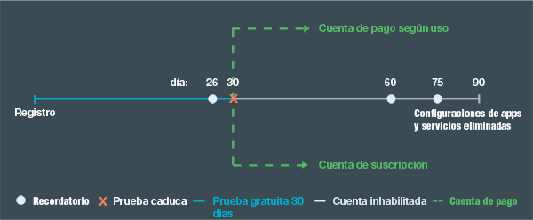

---

 

copyright:

  years: 2015, 2016

 

---

{:codeblock: .codeblock}
{:screen: .screen}
{:shortdesc: .shortdesc}
{:generic: data-hd-programlang="generic"}
{:java: data-hd-programlang="java"}
{:ruby: data-hd-programlang="ruby"}
{:c#: data-hd-programlang="c#"}
{:objectc data-hd-programlang="objectc"}
{:python: data-hd-programlang="python"}
{:javascript: data-hd-programlang="javascript"}
{:php: data-hd-programlang="php"}
{:swift: data-hd-programlang="swift"}
{:generic: data-hd-operatingsystem="generic"}
{:ios: data-hd-operatingsystem="ios"}
{:android: data-hd-operatingsystem="android"}
{:DomainName: data-hd-keyref="APPDomain"}
{:DomainName: data-hd-keyref="DomainName"}
{:app_name: data-hd-keyref="app_name"}
{:app_key: data-hd-keyref="app_key"}
{:app_secret: data-hd-keyref="app_secret"}
{:app_url: data-hd-keyref="app_url"}
{:org_name: data-hd-keyref="org_name"}
{:route: data-hd-keyref="route"}
{:space_name: data-hd-keyref="space_name"}
{:service_name: data-hd-keyref="service_name"}
{:service_instance_name: data-hd-keyref="service_instance_name"}
{:user_ID: data-hd-keyref="user_ID"}
{:subsection: outputclass="subsection"}
{:service: architecture="service"}
{:runtime: architecture="runtime"}
{:runtimeIconList: .runtimeIconList}
{:runtimeIcon: .runtimeIcon}
{:runtimeTitle: .runtimeTitle}
{:runtimeLink: .runtimeLink}
{:tsSymptoms: .tsSymptoms}
{:tsCauses: .tsCauses}
{:tsResolve: .tsResolve}

# Tarifas
{: #pricing}

*Última actualización: 16 de mayo de 2016*

Puede ejecutar apps en {{site.data.keyword.Bluemix}} y probar los servicios de {{site.data.keyword.Bluemix_notm}} de forma gratuita. Puede realizar una prueba gratuita de 30 días que le otorga concesiones adicionales, incluido soporte gratuito. Transcurridos 30 días, puede elegir un tipo de cuenta y pagar sólo según uso superadas las concesiones gratuitas. Bluemix proporciona una calculadora de costes para estimar con anticipación los costes y una vista Panel de control de uso para comprobar el coste real después de crear las apps.
{:shortdesc}

## Prueba gratuita
{: #trial}
Puede realizar una prueba gratuita de 30 días con su ID de {{site.data.keyword.Bluemix_notm}}. Durante el periodo de prueba, puede desarrollar aplicaciones y utilizar servicios en {{site.data.keyword.Bluemix_notm}}.

Su cuenta se proporciona con los recursos siguientes, sin coste adicional alguno:

* Un máximo de 2 GB de memoria
* 10 servicios
* 1 certificado SSL

El periodo de prueba gratuito vence 30 días después de registrarse. Cuando venza el periodo de prueba de 30 días, las apps de la cuenta se detendrán. No podrá registrarse para disponer de otra prueba en {{site.data.keyword.Bluemix_notm}}. No obstante, podrá seguir accediendo a su cuenta y a las demás cuentas a las que ha sido invitado. Para reiniciar las apps, debe proporcionar la información de su tarjeta de crédito para una cuenta de pago según uso o crear una cuenta de Suscripción. Tras convertir la cuenta, puede continuar utilizando concesiones y servicio gratuitos. Sólo paga por el uso de servicios, contenedores y tiempos de ejecución que no están incluidos como parte de la concesión mensual gratuita.

Si no convierte la cuenta una vez que venza el periodo de prueba gratuito, recibirá notificaciones por correo electrónico sobre el estado de su cuenta después del vencimiento del periodo de prueba. Las notificaciones le recuerdan que debe crear la cuenta de pago para que los valores de la app y las configuraciones no se pierdan. Si no desea recibir estas notificaciones de {{site.data.keyword.Bluemix_notm}}, puede anular la suscripción en cualquier momento.
Un mes después del vencimiento del periodo de prueba, las configuraciones de las apps y el servicio se eliminarán. En la figura siguiente se muestra el proceso general de gestión de cuentas de {{site.data.keyword.Bluemix_notm}}.




*Figura 1. Diagrama de flujo del proceso de gestión de cuentas de {{site.data.keyword.Bluemix_notm}}*


Si convierte la cuenta durante el periodo de prueba gratuito, las concesiones gratuitas se verán limitadas a concesiones proporcionadas normalmente por cada servicio. Las concesiones ya no son concesiones de uso ilimitado que ofrecen muchos de los servicios de IBM durante el periodo de prueba gratuito.


##Coste
{: #what_it_costs}

Los cargos varían en función de los recursos utilizados por un servicio concreto, el tiempo de ejecución, el contenedor, el servidor virtual o la opción de soporte. Los recursos pueden ser el número de llamadas de API, el número de instancias,
memoria, almacenamiento, etc. {{site.data.keyword.Bluemix_notm}} también proporciona estimadores de coste detallado, y una calculadora de coste hasta el último céntimo para ayudarle a planificar los cargos. Puede comprobar el coste real tras crear las apps utilizando la vista *Panel de control de uso*. Para obtener información más detallada sobre los cargos, consulte [Cómo se le carga](index.html#charges).
 

##Código promocional
{: #promo}

En ocasiones, el representante de ventas de {{site.data.keyword.Bluemix_notm}} u otros representantes {{site.data.keyword.Bluemix_notm}} ofrecen códigos promocionales. Si aplica un código promocional, puede obtener recursos o funciones adicionales que ofrece {{site.data.keyword.Bluemix_notm}} para la cuenta de prueba.

Los recursos o funciones varían en función del código en particular, pero pueden incluir uno o varios de los siguientes elementos:

* Aumentar la cuota de memoria a un número determinado de GB especificado por el código promocional
* Añadir una organización, con una cuota de memoria especificada por el código promocional
* Añadir un número ilimitado de organizaciones
* Cargar un número adicional de certificados SSL, especificado por el código promocional
* Utilizar los planes de servicio premium

**Nota:** Puede aplicar varios códigos promocionales a la cuenta. Cada código promocional se puede canjear una sola vez antes de la fecha de caducidad del código.
Para utilizar un código promocional, pulse el icono **Configuración de perfil**, seleccione **Cuenta** y, a continuación, pulse **Tipo de cuenta** en la interfaz de usuario de {{site.data.keyword.Bluemix_notm}}.

##Cómo se le factura
{: #pay-accounts}

Cuando se registra en un plan facturable de {{site.data.keyword.Bluemix_notm}}, puede seleccionar a partir de las cuentas siguientes:
* Pago según uso
* Suscripción
* {{site.data.keyword.Bluemix_notm}} dedicado
* {{site.data.keyword.Bluemix_notm}} local

Con una cuenta Pago según uso, se le factura en función del uso del cálculo y los servicios de {{site.data.keyword.Bluemix_notm}}. Con una cuenta de Suscripción, puede obtener un descuento mensual en función del compromiso de gasto mensual mínimo. {{site.data.keyword.Bluemix_notm}} dedicado y {{site.data.keyword.Bluemix_notm}} local se cargarán por contratos anuales.

Puede convertir la cuenta gratuita en una cuenta facturable en cualquier momento. Toda la información de la cuenta no facturable de prueba gratuita y las soluciones de {{site.data.keyword.Bluemix_notm}} se fusionarán de forma transparente en la nueva cuenta facturable.

Tras crear una cuenta facturable, puede editar la información que ha proporcionado. Pulse el **icono Configuración de perfil** en la esquina superior derecha de la interfaz de usuario de {{site.data.keyword.Bluemix_notm}} y, a continuación, pulse **Cuenta &gt; Tipo de cuenta** para editar la información.

Si surgen problemas con {{site.data.keyword.Bluemix_notm}} cuando vaya a utilizar una cuenta de Pago según uso o una Suscripción, consulte [Obtención de ayuda en línea](https://www.ng.bluemix.net/docs/troubleshoot/getting_customer_support.html#online_help) para obtener más información.

###Cuenta Pago según uso
{: #pay-as-you-go}

Si se registra para una cuenta Pago según uso, sólo pagará por los recursos de {{site.data.keyword.Bluemix_notm}} que utilice. También puede optar a concesiones de tiempo de ejecución y de servicio gratuitas.

En muchos países y regiones, puede registrarse para una cuenta Pago según uso desde la interfaz de usuario de {{site.data.keyword.Bluemix_notm}}. Pulse el icono **Prueba gratuita** y, a continuación, pulse **Confirmar cuenta gratuita** y seleccione **Opción 1**. Especifique el país o región y pulse **Añadir tarjeta de crédito** para proporcionar la información de la tarjeta de crédito. Tras proporcionar la información de la tarjeta de crédito y la facturación, aceptar los términos y condiciones y enviar una solicitud de cuenta, la tarjeta de crédito será validada. También se envía un correo electrónico de confirmación de la información de la cuenta. Transcurridos algunos minutos tras la recepción del correo electrónico de confirmación, puede volver a {{site.data.keyword.Bluemix_notm}} para continuar creando sus apps. Si {{site.data.keyword.Bluemix_notm}} no puede procesar la solicitud en línea para su país o región, puede ponerse en contacto con el equipo de ventas de {{site.data.keyword.Bluemix_notm}}, utilizando el enlace listado en la página de [Póngase en contacto con nosotros](https://console.ng.bluemix.net/#/contactUs/cloudOEPaneId=contactUs) para registrarse para una cuenta Pago según uso.

Puede convertir la cuenta Pago según uso en una cuenta Suscripción en cualquier momento. Con una cuenta Suscripción, se compromete a gastar una cantidad mínima cada mes. Si desea convertir en una cuenta Suscripción, póngase en contacto con el equipo de ventas de {{site.data.keyword.Bluemix_notm}}, utilizando el enlace listado en la página [ Póngase en contacto con nosotros](https://console.ng.bluemix.net/#/contactUs/cloudOEPaneId=contactUs).

###Cuenta de suscripción
{: #subscription}

Si se registra para una cuenta Suscripción, se compromete a una cantidad de gasto mínimo al mes y recibirá un descuento de suscripción que se aplica a dicho cargo mínimo. También puede pagar cualquier uso que exceda la cantidad de gasto mínimo.

Para registrarse para una cuenta Suscripción y para obtener más información sobre las tarifas y descuentos de suscripción, debe ponerse en contacto con el equipo de ventas de {{site.data.keyword.Bluemix_notm}}, utilizando el enlace listado en la página de [ Póngase en contacto con nosotros](https://console.ng.bluemix.net/#/contactUs/cloudOEPaneId=contactUs).

###Cuenta dedicada a {{site.data.keyword.Bluemix_notm}}
{: #dedicated}

{{site.data.keyword.Bluemix_notm}} requiere un periodo mínimo de un año que incluya:

* Conectividad VPN para volver a su infraestructura
* Entorno completo y redundante en un centro de datos de SoftLayer
* Todos los tiempos de ejecución soportados (IBM Java Liberty, Node.js y ejecuciones de código abierto)
* Todos los servicios dedicados que ha seleccionado y todos los servicios públicos de {{site.data.keyword.Bluemix_notm}}
* Soporte de {{site.data.keyword.Bluemix_notm}} estándar

También puede pedir elementos opcionales como
SoftLayer DirectLink u opciones de soporte premium. Póngase en contacto con el [equipo de ventas de Bluemix](https://console.ng.bluemix.net/?direct=classic/#/contactUs/cloudOEPaneId=contactUs) para obtener más información.

Con {{site.data.keyword.Bluemix_notm}} dedicado, debe registrarse para un plazo mínimo de un año. Lo que deberá abonar cada mes durante dicho plazo dependerá de los servicios dedicados que desee, más una cuenta de suscripción que le ofrece acceso a todos los servicios públicos. Los cargos por uso de los servicios de {{site.data.keyword.Bluemix_notm}} público se calculan en función del acuerdo de la cuenta de suscripción. Recibirá una factura correspondiente a los servicios que utilice por encima del acuerdo de suscripción. Póngase en contacto con el representante designado de la cuenta de IBM o con el [equipo de ventas de Bluemix](https://console.ng.bluemix.net/#/contactUs/cloudOEPaneId=contactUs) para empezar a trabajar en su acuerdo.


###Cuenta local de {{site.data.keyword.Bluemix_notm}}
{: #local}

{{site.data.keyword.Bluemix_notm}} requiere un periodo mínimo de un año que incluya:

* Una función de entrega denominada retransmisión que permite a IBM conectarse a su despliegue local y entregar actualizaciones de forma automática y coherente.
* Todos los tiempos de ejecución soportados (IBM Java Liberty, Node.js y ejecuciones de código abierto)
* Todos los servicios locales que ha seleccionado y acceso a todos los servicios públicos de {{site.data.keyword.Bluemix_notm}}
* Soporte de {{site.data.keyword.Bluemix_notm}} estándar

Con {{site.data.keyword.Bluemix_notm}} local, debe registrarse para un plazo mínimo de un año. Lo que deberá abonar cada mes durante dicho plazo dependerá de los servicios locales que desee, más una cuenta de suscripción que le ofrece acceso a todos los servicios públicos. Los cargos por uso de los servicios de {{site.data.keyword.Bluemix_notm}} público se calculan en función del acuerdo de la cuenta de suscripción. Recibirá una factura correspondiente a los servicios que utilice por encima del acuerdo de suscripción. Póngase en contacto con el representante designado de la cuenta de IBM o póngase en contacto con el equipo de ventas de [{{site.data.keyword.Bluemix_notm}}](https://console.ng.bluemix.net/#/contactUs/cloudOEPaneId=contactUs) para empezar a trabajar en su acuerdo.

##Cómo se le carga
{: #charges}

Con una cuenta facturable de {{site.data.keyword.Bluemix_notm}}, se le facturará por el cálculo, los contenedores y los servicios que se utilicen en su organización. Es posible que otros usuarios de {{site.data.keyword.Bluemix_notm}} le inviten a participar en organizaciones en una cuenta diferente. Si crea apps o utiliza servicios en las organizaciones las que está invitado, el uso que se produce se factura a la cuenta que contenga dichas organizaciones. Puede ver más información sobre unos cargos específicos en una página de detalles de recurso en el Catálogo de {{site.data.keyword.Bluemix_notm}}, o en la calculadora de precios en la página {{site.data.keyword.Bluemix_notm}} Precios.

Se aplicarán distintos tipos de cargos en función de las características de {{site.data.keyword.Bluemix_notm}} que utilice. En la tabla siguiente se proporciona una visión general de alto nivel:

| Tipo de cargo | Descripción | Características de {{site.data.keyword.Bluemix_notm}} que utilizan este tipo de cargo | Ejemplo |
|------------------|------------------|--------------------------|--------------------------|
| Corregido | El precio de tasa fija se basa en un acuerdo sobre el cargo mensual que no está ajustado. | Servicios  | La memoria caché de datos tiene un plan fijo que se cargará en una tasa mensual fija. |
| Medido | El precio de uso medido se basa en el número de GB hora consumidos para los entornos de ejecución, y en el número de GB hora consumidos y en el número de direcciones IP y el almacenamiento para contenedores. | Servicios, cálculo y contenedores | Para el servicio Push, cualquier uso que supere la concesión mensual gratuita se factura. |
|  Por niveles   |  Algunos planes también están basados en un modelo de precios por niveles, para poder acceder a descuentos por volumen, según su uso actual. Los servicios pueden ofrecer planes de precios de capas de bloques, graduados y simples. | Servicios | El precio escalonado se utiliza normalmente para medidas de carga que tienen previsto tener cantidades muy altas por mes, tales como llamadas a la API. |
| Reservado | El precio reservado se basa en un compromiso a largo plazo para un servicio, por lo que puede obtener un precio de descuento. Con un plan reservado, obtendrá una instancia de servicio dedicada que es fácil de configurar, desplegar y entregar en el entorno {{site.data.keyword.Bluemix_notm}} público. | Servicios | DB2 on Cloud tiene planes reservados.|

###Cargos por recursos de cálculo
{: #compute}

Se le facturará por el tiempo que las apps se ejecuten y la memoria que se utilice, calculados como *GB por hora*. GB por hora es el cálculo del número de instancias de la app, multiplicado por la memoria por instancia, multiplicado por las horas que se ejecutaron las instancias. Puede personalizar el número de instancias y la cantidad de memoria por instancia según sus necesidades. Posteriormente puede añadir memoria o instancias para escalar a más usuarios. La carga final es por GB por hora: las instancias de app, multiplicado por memoria por instancia, multiplicado por horas de ejecución.

Por ejemplo, supongamos que tenemos un tiempo de ejecución que cuesta 0,07 dólares por GB por hora en dos instancias de 512 MB que se ejecutan durante 30 días (720 horas). Estos recursos costarían unos 24,15 dólares, incluida la concesión gratuita de 375 GB por hora, según el siguiente cálculo: 

```
2 instancias x 0,5 GB x 720 horas = 720 GB hora.
(720 - 375) GB por hora x 0,07 dólares por GB por hora = 24,15 dólares
```

###Cargos por servicios
{: #services}

Muchos servicios incluyen concesiones gratuitas mensuales. El uso de servicios que no está incluido como parte de la concesión gratuita se factura de una de las maneras siguientes:
<dl>
<dt>Cargos fijos</dt>
    <dd>Selecciona un plan y paga en función de una tarifa plana. Por ejemplo, el servicio de memoria caché de datos se cargará a una tarifa plana.</dd>
<dt>Cargos con medición</dt>
    <dd>Paga en función del consumo de tiempo de ejecución y de servicio. Por ejemplo, con el servicio Push, cualquier uso que supere la concesión mensual gratuita se factura.</dd>
<dt>Cargos reservados</dt>
    <dd><p>Como propietario de la cuenta de una cuenta de Pago según uso o una cuenta de Suscripción, puede reservar una instancia de servicio, con un compromiso a largo plazo, para obtener un precio con descuento. Por ejemplo, puede reservar la oferta de DB2 on Cloud grande estándar para 12 meses.</p> 
    <p>Algunos servicios de {{site.data.keyword.Bluemix_notm}} ofrecen planes reservados. Puede solicitar un plan reservado desde el {{site.data.keyword.Bluemix_notm}} <strong>Catálogo</strong> pulsando el icono del servicio. A continuación, seleccione el plan de servicio que se ajuste mejor a sus necesidades. Si hay disponible un plan reservado, pulse <strong>Solicitud</strong>, y siga las instrucciones para enviar la solicitud. Recibirá un correo electrónico que contiene la información del precio del plan reservado. Un representante de ventas de {{site.data.keyword.Bluemix_notm}} también se pondrá en contacto con usted pronto para finalizar la compra.</p></dd>
<dt>Cargos escalonados</dt>
    <dd>De forma similar a los cargos con medición, pagará en función del consumo de servicios y de tiempo de ejecución. Sin embargo, los cargos por capas añaden capas de precios adicionales, ofreciendo a menudo cargos descontados en capas con un consumo más grande. El precio por niveles se ofrece de forma simple, graduada o de bloque.</dd>
</dl>


####Nivel sencillo
{: #simple_tier}

En el modelo de nivel sencillo, el precio unitario se determina
mediante el nivel al que corresponde la cantidad que utilice. El precio
total es su cantidad multiplicado por el precio unitario de dicho nivel. Por ejemplo:

| Cantidad de elementos | Precio unitario para todos los elementos |
|-------------------|--------------------------|
| Nivel 1: 1 - 1000  | $1 USD                   |
| Nivel 2: 1001 - 2000    |    $0,90 USD                      |
| Nivel 3: 2001 - 3000                  |   $0,75 USD                       |
| Nivel 4: 3001 - 4000           |      $0,60 USD                    |
|Nivel 5: &gt; 4000 | $0,40 USD | 

*Tabla 1. Tabla de pecios del nivel sencillo*

En la tabla siguiente se muestra lo que
se pagaría con un plan basado en un modelo de precios de nivel sencillo:

| Cantidad de elementos | Cálculo del cargo | Precio total |
|-------------------|--------------------|-------------|
|500 |	500 × 1 = 500 |	$500 USD|
|1500 |	1500 × 0,90 = 1350 |	$1350 USD|
|2500 |	2500 × 0,75 = 1875 |	$1875 USD|
|... |	... |	...|
|5200 |	5200 × 0,40 = 2080 |$2080 USD|
*Tabla 2. Cálculo de cargos usando el modelo de precios del nivel sencillo*

####Nivel graduado
{: #graduated_tier}

En el modelo de nivel graduado, el precio de unidad por nivel disminuye
según aumenta su nivel de uso. El precio total son los cargos acumulados para
cada nivel de uso, y consta de su cantidad multiplicado por el precio unitario
de dicho nivel. Por ejemplo:

| Cantidad de elementos |	Precio unitario para los elementos en el nivel|
|-------------------|------------------------------------|
|    Nivel 1: 1 - 1000 |	$1 USD |
|   Nivel 2: 1001 - 2000 |	$0,90 USD |
|    Nivel 3: 2001 - 3000 |	$0,75 USD |
|    Nivel 4: 3001 - 4000 |	$0,60 USD |
|    Nivel 5: &gt; 4000 |	$0,40 USD |
*Tabla 3. Tabla de precios del nivel graduado*

En la tabla siguiente se muestra lo que
se pagaría con un plan basado en un modelo de precios de nivel graduado:

|Cantidad de elementos | Cálculo del cargo | Precio total|
|------------------|--------------------|------------|
|500 |	500 × 1 (precio unitario para Nivel 1) = 500 |	$500 USD|
|1500 |	(1000 × 1 (precio unitario para Nivel 1)) + (500 × 0,90 (precio unitario para Nivel 2)) = 1450 |	$1450 USD|
|2500 |	(1000 × 1 (precio unitario para Nivel 1)) + (1000 × 0,90 (precio unitario para Nivel 2)) + (500 × 0,75 (precio unitario para Nivel 3)) = 2275 |	$2275 USD |
|... |	... |	...|
|5200 |	(1000 × 1 (precio unitario para Nivel 1)) + (1000 × 0,90 (precio unitario para Nivel 2)) + (1000 × 0,75 (precio unitario para Nivel 3)) + (1000 × 0,60 (precio unitario para Nivel 4)) + (1200 × 0,40 (precio unitario para Nivel 5)) = 3730 |	$3730 USD|
*Tabla 4. Cálculo de cargos usando el modelo de precios del nivel graduado*

####Nivel Bloque
{: #block_tier}

En el modelo de nivel por bloque, el precio es un cargo establecido
para la cantidad que utilicen dentro de un nivel de uso. El precio total
es el cargo de su nivel de uso, independientemente del uso real. Cada nivel
sucesivo proporciona una tasa menor entre precio y cantidad. Por ejemplo:

|Cantidad de elementos |	Precio total para todos los elementos|
|------------------|-----------------------------|
| Nivel 1: &lt;= 1000 |	$1000 USD|
| Nivel 2: &lt;= 2000 |	$1900 USD|
| Nivel 3: &lt;= 3000 |	$2800 USD|
| Nivel 4: &lt;= 4000 |	$3500 USD|
| Nivel 5: &lt;= 10000 |	$5000 USD|
*Tabla 5. Tabla de precios del nivel por bloques*

En la tabla siguiente se muestra lo que
se pagaría con un plan basado en un modelo de precios de nivel por bloque:

|Cantidad de elementos |	Cálculo del cargo |	Precio total|
|------------------|-----------------------|---------------|
|500 |	El número de elementos cae en el Nivel 1, por lo que el precio
total es $1000 USD. |	$1000 USD|
|1500 |	El número de elementos cae en el Nivel 2, por lo que el precio
total es $1900 USD. |	$1900 USD|
|... |	... |	...|
|5200 |	El número de elementos cae en el Nivel 5, por lo que el precio
total es $5000 USD. |	$5000 USD|
*Tabla 6. Cálculo de cargos usando el modelo de precios del nivel por bloque*

### Concesiones gratuitas para servidores virtuales
{: #vms}

Puede utilizar servidores virtuales de {{site.data.keyword.Bluemix_notm}} en la nube pública de IBM como características beta gratuitas. Se proporcionan concesiones gratuitas para el número de imágenes de servidor virtual que puede crear, el número de direcciones IP que tiene asignadas y la cantidad de memoria que se utiliza.

Las siguientes elementos son las concesiones gratuitas
para los servidores virtuales de {{site.data.keyword.Bluemix_notm}} beta:

* 8 instancias
* 8 CPU virtuales
* 12 GB de memoria
* 200 GB de almacenamiento en bloque
* 4 direcciones IP públicas

Además, puede utilizar la infraestructura de servidores virtuales para suministrar servidores virtuales en sus nubes privadas de {{site.data.keyword.Bluemix_notm}}, siempre de acuerdo con los límites y cuotas de sus nubes privadas.


##Cómo estimar sus costes
{: #cost}

Puede utilizar distintos métodos para saber lo que debe pagar por utilizar {{site.data.keyword.Bluemix_notm}} para crear y alojar su app.

* Los estimadores de costes de la página de Precios de {{site.data.keyword.Bluemix_notm}} ofrecen una estimación aproximada del coste en función del tamaño de la app.
* La calculadora de costes de la página {{site.data.keyword.Bluemix_notm}} Precios contiene precios precisos de la app en función de la entrada del tiempo de ejecución y del uso de los servicios.
* También puede calcular el coste manualmente.

###Utilización de las calculadoras de costes
{: #calculator}

Puede calcular rápidamente el precio de la app utilizando las calculadoras de costes que se proporcionan en la página {{site.data.keyword.Bluemix_notm}}.

1. Vaya a la {{site.data.keyword.Bluemix_notm}} [página de precios](https://console.{DomainName}/pricing/). 
2. Utilice uno de los widgets **Estime los costes** o pulse **Abrir calculadora** para utilizar la **Calculadora de tarifas de gran precisión**.

Para utilizar la calculadora, escriba el uso mensual proyectado de los recursos listados; por ejemplo, el número de instancias o notificaciones por push. Pulse dentro el campo **Uso mensual** para obtener sugerencias sobre las unidades que están previstas en el campo. La calculadora muestra inmediatamente el precio de la entrada. También puede ajustar la calculadora para que muestre costes anuales en lugar de costes mensuales.

###Cálculo manual de los costes
{: #manual}

Es posible que desee calcular los costes {{site.data.keyword.Bluemix_notm}} usted mismo, o bien saber mejor cómo se calculan los costes en {{site.data.keyword.Bluemix_notm}}. Puede calcular el precio total derivado de utilizar {{site.data.keyword.Bluemix_notm}} para crear y alojar su app teniendo en cuenta los precios de tiempo de ejecución y los servicios que utiliza. Los precios de los tiempos de ejecución y de los servicios pueden cambiar a veces; por consiguiente, debe hacer referencia a la información más reciente en el precio de hoja de precios de {{site.data.keyword.Bluemix_notm}} a la hora de calcular el precio de la hoja total.

###Ejemplo: Cálculo de precios de una app de muestra
{: #sample}

Suponga que tiene una app web de Node.js con prestaciones de escalabilidad y que la app utilizar varios servicios que suministra {{site.data.keyword.Bluemix_notm}}. En este ejemplo, podrá aprender a calcular el coste real de la app. La app web utilizar los servicios y elementos de {{site.data.keyword.Bluemix_notm}} siguientes:

* Cuatro instancias de tiempo de ejecución de 256 MB de Node.js.
* Dos políticas, un procesador y una memoria de {{site.data.keyword.autoscaling}}.
* 2 GB al mes de {{site.data.keyword.datacshort}}
* 150 GB al mes de base de datos NoSQL, 100.000 llamadas de API pesadas y 500.000 llamadas de API ligeras.
* 8 GB al mes de {{site.data.keyword.sqldb}} Database
* 20 GB de tráfico de red de entrada o de salida

###Precios para recursos de {{site.data.keyword.Bluemix_notm}}
{: #sample_resources}

Para dar un ejemplo sencillo, suponga que los precios en la tabla siguiente no fluctúan en un intervalo de tiempo, por ejemplo, en un mes. En este ejemplo, todos los precios se indican en moneda de EE. UU.

|Servicio |	Características |	Precio |
|--------|-----------|--------|
|SDK for Node.js |	375 GB por hora gratuito al mes (compartido entre todos los tiempos de ejecución) |	0,07 USD/GB por hora|
|Auto-Scaling |	Plan de servicio gratuito para el servicio Auto-Scaling |	Gratuito|
|Memoria caché de datos - Iniciador |	1 GB de memoria caché y una réplica |	55,00 USD/instancia |
|Memoria caché de datos - Estándar |	5 GB de memoria caché y una réplica |	155,00 USD/instancia |
|Memoria caché de datos - Premium |	25 GB de memoria caché y una réplica |	505,00 USD/instancia|
|IBM Cloudant® NoSQL DB para {{site.data.keyword.Bluemix_notm}} |	2 GB de almacenamiento gratuito de datos<br/>50.000 llamadas de API ligeras gratuitas al mes<br/>10.000 llamadas de API pesadas gratuitas al mes | 1,00 USD/GB<br/>0,03 USD/1000 llamadas de API ligeras<br/>0,15 USD/1000 llamadas de API pesadas |
|SQL Database 	| 2 GB gratuitos por instancia<br/>Un máximo de 10 GB por instancia |	30,00 USD/instancia |
*Tabla 7. Hoja de precios*

###Cálculo del precio de la app

El precio de la app se puede calcular de la forma siguiente:

<dl>
<dt>Cuatro instancias de tiempo de ejecución de 256 MB de Node.js.</dt>
<dd>Cargos de Bluemix para un tiempo de ejecución por GB por hora. El número de GB utilizados al mes es de <code>4 x 256 = 1024 MB o 1 GB al mes</code>. Suponga que hay <code>24 x 30 = 720 horas en un mes</code>, por consiguiente la app ha facturado <code>1 x 720 = 720 GB por hora</code>.
<p>
375 GB por hora están incluidos en la concesión gratuita al mes, compartidos en todos los tiempos de ejecución de {{site.data.keyword.Bluemix_notm}}. Por consiguiente, el coste total para el tiempo de ejecución es de
                     <code>0,07 dólares x (720-375) = 24,15 dólares</code>.</p></dd>

<dt>Dos políticas de Auto-Scaling (procesador y memoria)</dt>
<dd>Las políticas de Auto-Scaling no tienen ningún coste.</dd>

<dt>2 GB al mes de Data Cache</dt>
<dd>El plan de 50 MB proporcionado por el servicio de Data Cache es gratuito. Sin embargo, el plan gratuito no cubriría su uso proyectado de 2 GB al mes. Los tres planes de pago para Data Cache cuestan una cantidad fija por una cantidad de espacio específica, independientemente de cuánto espacio utilice realmente. Por lo tanto, le interesa elegir el plan mínimo que satisfaga su uso proyectado, que es el plan estándar de 5 GB. El coste total es de 155 dólares al mes.</dd>

<dt>Una base de datos NoSQL de 150 GB al mes</dt>
<dd>Los cargos de servicio de IBM Cloudant NoSQL DB for {{site.data.keyword.Bluemix_notm}} se basan en el almacenamiento de datos y en la posibilidad de acceder a dichos datos mediante diferentes métodos de API. Los mandatos <strong>PUT</strong> y <strong>POST</strong> se consideran llamadas de API pesadas, pero
los mandatos <strong>GET</strong> se consideran llamadas de API ligeras.
<p>
Añada el número de GB y deduzca 2 GB de concesión gratuita. Se cargan 148 GB al mes. Sustraiga la concesión gratuita de 50.000 para llamadas de api ligeras y 10.000 para llamadas de api pesadas. El precio de almacenamiento total incluye las partes siguientes:</p>
<pre class="codeblock">
<codeblock>
    148 x 1 = 148 dólares
    (450.000 / 1000) x 0,03 = 13,5 dólares
    (90.000 / 1000) x 0,15 = 13,5 dólares
</codeblock>
</pre>
<p>
El precio total es 148 + 13.5 + 13.5 = 175 dólares.</p></dd>

<dt>8 GB al mes de SQL Database</dt>
<dd>El precio total es de 30 dólares por instancia.</dd>

<dt>20 GB de tráfico de red de entrada o de salida</dt>
<dd>El tráfico de red de entrada y salida está libre de cargo adicional.</dd>

</dl>

Cuando se añaden todos los elementos, el precio total de la app es de 384,15 dólares.

##Panel de control de uso
{: #usage}

Como propietario de cuenta o gestor de facturación, puede utilizar la vista Panel de control de uso para ver los cargos en tiempo real del tiempo de ejecución y servicios utilizados cada mes en sus organizaciones. Puede ver el consumo de GB por hora y de servicio de tiempo de ejecución en todas las regiones o seleccionar para ver una región y espacio determinados durante los últimos 12 meses.

Para abrir la vista Panel de control de uso, pulse el icono **Cuenta y soporte** &gt; **Cuenta** &gt; *su_nombre_cuenta* &gt; **Panel de control de uso**. En esta vista, puede ver un resumen del tiempo de ejecución y del uso del servicio para la cuenta. Los gestores de facturación pueden ver los detalles sólo para las organizaciones en las que hay gestores de facturación.

La cuenta se factura al propietario por el uso total en el que han incurrido todas las organizaciones al final de cada ciclo de facturación. Cada ciclo de factura dura un mes.

Los propietarios de las cuentas pueden filtrar el resumen de uso por región y organización. Si usted es el propietario de una cuenta, establezca **Organización** como **Todas las organizaciones** para ver el uso en toda la cuenta para un período de 12 meses. Pulse un mes concreto para ver el uso para ese mes. Los cargos mostrados representan la cantidad que se le factura a usted, como propietario de cuenta, para dicho mes.

Si selecciona una organización específica para la **Organización**, puede ver la utilización total para esa organización, incluido cualquier uso como parte de un nivel libre. Los cargos que se muestran para la organización no son los cargos que se le facturan. El uso de la capa libre se muestra como gratuita en el nivel de cuenta, pero no a nivel organizativo. Por lo tanto, cuando se ve el uso de la organización, verá el uso real para esa organización incluido el uso gratuito y de pago. Todo el uso organizativo se despliega en el uso de la cuenta una vez que se haya eliminado la capa libre.

##Notificaciones
{: #notifications}

Como gestor de cuentas de una cuenta Pago según uso, puede establecer notificaciones de gasto relativas al coste total de su cuenta, para su tiempo de ejecución, servicios y para los servicios individuales, excluidos los servicios de terceros. Recibe notificaciones al alcanzar el 80%, 90%, y 100% de los umbrales de gasto que especifique.

Para abrir la vista **Notificaciones**, pulse el icono **Cuenta y soporte** &gt; **Cuenta** &gt; *su_nombre_cuenta* &gt; **Notificaciones de gasto**. Entre un valor numérico para establecer el umbral de gasto para desencadenar una notificación para cada tipo de notificación de gasto según sea necesario. También puede añadir y suprimir notificaciones para servicios individuales.

##Cómo cambiar el plan
{: #changing}

Puede cambiar su plan de servicios en {{site.data.keyword.Bluemix_notm}} en el Panel de control del servicio, si los cambios de plan están habilitados para dicho servicio.

Sólo determinados servicios le proporcionan la capacidad de cambiar el plan de servicios. Si los cambios de plan están habilitados para el servicio, el Panel de control de servicio muestra una opción **Plan** en la navegación de la izquierda. Cada servicio tiene un conjunto distinto de pasos siguientes a seguir
si cambia su plan.

1. Para cambiar el plan, en el Panel de control del servicio, pulse **Plan**. Por lo general, puede actualizar su plan o reducirlo.
2. Tras cambiar su plan, debe completar un conjunto de pasos a seguir. Los pasos varían según el tipo de cambio
de plan y del servicio. Por ejemplo, si ha reducido su plan, es posible que tenga que volver a transferir su
app. O, si ha actualizado su plan, es posible que deba volver a transferir su app y realizar otras acciones.<br/><br/>Para volver a transferir su app, vaya al Panel de control de {{site.data.keyword.Bluemix_notm}} y busque la app a la que está vinculado el servicio. En el menú de la app, seleccione **Reiniciar app**.<br/><br/>Otros acciones de paso siguiente dependen del servicio. Para acciones específicas, consulte la tabla siguiente.

|Servicio |	Información|
|--------|-------------|
|Presence Insights 	|Si tiene un plan Lite y supera el permitido gratis, se mostrará un mensaje 403 o se registra para indicar que ya no tiene autorización, y su instancia de servicio se inhabilita. Además, las llamadas POST REST API se rechazan con la respuesta 403.<br/><br/>Si su servicio está inhabilitado porque no supera el permiso gratuito, puede actualizar de un plan Lite a un plan Paid. El servicio se reanudará dentro de las dos siguientes horas.<br/><br/>Si tiene un plan Paid, puede reducir el plan al plan Lite, siempre que su uso permanezca dentro de lo permitido en el plan Lite para sucesos y almacenamiento total.<br/><br/>Cuando actualice o reduzca el plan, no tiene que volver a transferir ni a reiniciar las apps.|
*Tabla 8. Pasos siguientes para cambiar su plan*

###Cómo cambiar el plan por medio de la interfaz de línea de mandatos

Si lo prefiere, puede cambiar su plan de servicio por medio de la interfaz de línea de mandatos.
Para actualizar
el plan de servicio, especifique el mandato siguiente:
```
cf update-service <nombre_servicio> [-p <plan_nuevo>]
```
# rellinks
## general 
* Hoja de precios de [{{site.data.keyword.Bluemix_notm}}](https://console.{DomainName}/pricing/)
* Foro de comunidades de desarrolladores [{{site.data.keyword.Bluemix_notm}}](https://developer.ibm.com/bluemix/)
* [Obtención de ayuda en línea](https://www.{DomainName}/docs/troubleshoot/getting_customer_support.html#online_help)
* [Póngase en contacto con nosotros](https://console.{DomainName}/#/contactUs/cloudOEPaneId=contactUs)
