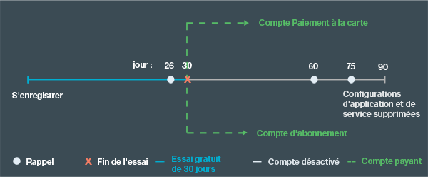

---

 

copyright:

  2015, 2016

 

---

{:codeblock: .codeblock}
{:screen: .screen}
{:shortdesc: .shortdesc}
{:generic: data-hd-programlang="generic"}
{:java: data-hd-programlang="java"}
{:ruby: data-hd-programlang="ruby"}
{:c#: data-hd-programlang="c#"}
{:objectc data-hd-programlang="objectc"}
{:python: data-hd-programlang="python"}
{:javascript: data-hd-programlang="javascript"}
{:php: data-hd-programlang="php"}
{:swift: data-hd-programlang="swift"}
{:generic: data-hd-operatingsystem="generic"}
{:ios: data-hd-operatingsystem="ios"}
{:android: data-hd-operatingsystem="android"}
{:DomainName: data-hd-keyref="APPDomain"}
{:DomainName: data-hd-keyref="DomainName"}
{:app_name: data-hd-keyref="app_name"}
{:app_key: data-hd-keyref="app_key"}
{:app_secret: data-hd-keyref="app_secret"}
{:app_url: data-hd-keyref="app_url"}
{:org_name: data-hd-keyref="org_name"}
{:route: data-hd-keyref="route"}
{:space_name: data-hd-keyref="space_name"}
{:service_name: data-hd-keyref="service_name"}
{:service_instance_name: data-hd-keyref="service_instance_name"}
{:user_ID: data-hd-keyref="user_ID"}
{:subsection: outputclass="subsection"}
{:service: architecture="service"}
{:runtime: architecture="runtime"}
{:runtimeIconList: .runtimeIconList}
{:runtimeIcon: .runtimeIcon}
{:runtimeTitle: .runtimeTitle}
{:runtimeLink: .runtimeLink}
{:tsSymptoms: .tsSymptoms}
{:tsCauses: .tsCauses}
{:tsResolve: .tsResolve}

# Tarification
{: #pricing}

*Dernière mise à jour : 16 mai 2016*

Vous pouvez exécuter des applications dans {{site.data.keyword.Bluemix}} et essayer des services
{{site.data.keyword.Bluemix_notm}} gratuitement. Vous pouvez vous inscrire pour bénéficier d'un essai gratuit de
30 jours offrant des franchises supplémentaires, notamment un support gratuit. Au bout de 30 jours, vous pouvez choisir un type de compte et ne payer que ce que vous utilisez au-delà des franchises. 
Bluemix met à disposition une calculatrice des coûts pour que vous puissiez estimer le coût à l'avance, ainsi que la vue Tableau de bord de l'utilisation pour que
vous puissiez vérifier le coût réel après avoir construit vos applications.
{:shortdesc}

## Essai gratuit
{: #trial}
Vous pouvez vous inscrire pour bénéficier d'un essai gratuit de 30 jours avec votre ID {{site.data.keyword.Bluemix_notm}}. Au cours de
l'essai, vous pouvez développer des applications et utiliser des services dans {{site.data.keyword.Bluemix_notm}}.

Les ressources gratuites suivantes sont mises à disposition sur votre compte :

* 2 Go de mémoire maximum
* 10 services
* 1 certificat SSL

Votre essai gratuit prend fin 30 jours après votre inscription. A la fin de votre essai de 30 jours, les applications de
votre
compte sont arrêtées. Vous ne pouvez pas vous inscrire pour un autre essai dans {{site.data.keyword.Bluemix_notm}}. Toutefois, vous pouvez continuer d'accéder à votre compte et aux comptes sur lesquels vous êtes invités. Pour redémarrer vos applications, vous devez fournir vos informations de carte de crédit pour un compte de type Paiement à la carte ou créer un compte de
type Abonnement. Une fois que vous avez converti votre compte, vous pouvez continuer d'utiliser les franchises pour les ressources de traitement et les
services. Vous ne payez que pour l'utilisation des services, des conteneurs et des contextes d'exécution qui ne font pas partie de la franchise mensuelle.

Si vous ne convertissez pas votre compte à la fin de l'essai gratuit, vous recevez des notifications par courrier électronique sur le statut de votre
compte une fois votre essai terminé. Elles vous rappellent de créer votre compte payant pour que vos configurations et paramètres d'application ne soient pas perdus. Pour ne plus recevoir ces notifications de {{site.data.keyword.Bluemix_notm}}, vous pouvez vous désabonner à tout moment.
Un mois après la fin de l'essai, vos applications et vos configurations de service sont supprimées. La figure ci-dessous illustre
le processus général de gestion des comptes {{site.data.keyword.Bluemix_notm}}.




*Figure 1. Organigramme du processus de gestion des comptes {{site.data.keyword.Bluemix_notm}}*


Si vous convertissez votre compte au cours de votre essai gratuit, les franchises sont celles normalement proposées par chaque service. Elles
ne sont plus illimitées comme celles proposées par de nombreux services IBM au cours de l'essai gratuit.


##Coût
{: #what_it_costs}

Le prix varie selon les ressources utilisées par un service, un contexte d'exécution, un conteneur, un serveur virtuel ou une option de support
spécifique. Les ressources peuvent correspondre au nombre d'appels d'API, au nombre d'instances, à la mémoire, à l'espace de stockage, etc. {{site.data.keyword.Bluemix_notm}} met également à disposition des estimateurs de coût détaillé ainsi qu'une calculatrice de prix au centime près pour vous aider à planifier vos frais. 
Vous pouvez vérifier le coût réel une fois que vous avez construit vos applications dans la vue *Tableau de bord de l'utilisation*. Pour des informations
plus détaillées sur les frais, voir [Paiement](index.html#charges).
 

##Code promotionnel
{: #promo}

Parfois, le service commercial {{site.data.keyword.Bluemix_notm}} ou d'autres représentants de {{site.data.keyword.Bluemix_notm}}
fournissent des codes promotionnels. En appliquant un code promotionnel, vous pouvez obtenir des ressources ou des capacités supplémentaires qui sont mises à disposition par
{{site.data.keyword.Bluemix_notm}} pour votre compte d'essai.

Les ressources ou les capacités varient selon le code, mais peuvent inclure un ou plusieurs des éléments suivants :

* Augmentation du quota de mémoire d'un certain nombre de Go spécifié par le code promotionnel
* Ajout d'une organisation, avec un quota de mémoire spécifié par le code promotionnel
* Ajout d'un nombre illimité d'organisations
* Téléchargement d'un certain nombre de certificats SSL supplémentaires, comme spécifié par le code promotionnel
* Utilisation de plans de service premium

**Remarque :** vous pouvez appliquer plusieurs codes promotionnels à votre compte. Chaque code
promotionnel ne peut être utilisé qu'une fois avant sa date d'expiration.
Pour utiliser un code promotionnel, cliquez sur l'icône **Paramètres de profil**, sélectionnez **Compte**, puis
cliquez sur **Type de compte** dans l'interface utilisateur {{site.data.keyword.Bluemix_notm}}.

##Facturation
{: #pay-accounts}

Lorsque vous souscrivez à un plan de facturation {{site.data.keyword.Bluemix_notm}}, vous pouvez effectuer votre sélection parmi les comptes suivants :
* Paiement à la carte
* Abonnement
* {{site.data.keyword.Bluemix_notm}} dédié
* {{site.data.keyword.Bluemix_notm}} local

Avec un compte de type Paiement à la carte, vous êtes facturé en fonction de votre utilisation des ressources de traitement et des services
{{site.data.keyword.Bluemix_notm}}. Avec un compte de type Abonnement, vous pouvez bénéficier d'une remise mensuelle contre un engagement financier
mensuel minimum. L'environnement {{site.data.keyword.Bluemix_notm}} dédié et l'environnement {{site.data.keyword.Bluemix_notm}} local sont facturés selon des contrats annuels.

Vous pouvez convertir à tout moment votre version d'évaluation en compte facturable. Toutes les informations du compte sans facturation dans le cadre de votre essai gratuit, ainsi que les solutions {{site.data.keyword.Bluemix_notm}} seront fusionnées directement dans le nouveau compte de facturation.

Après avoir créé un compte de facturation, vous pouvez éditer les informations que vous avez indiquées. Cliquez sur l'icône **Paramètres de
profil** dans le coin supérieur droit de l'interface utilisateur {{site.data.keyword.Bluemix_notm}}, puis cliquez sur **Compte &gt; Type de compte** pour éditer
vos informations.

Si vous rencontrez des problèmes liés à {{site.data.keyword.Bluemix_notm}} lorsque vous utilisez un compte de type Paiement à la carte ou
Abonnement, lisez la page [Comment obtenir de
l'aide](https://www.ng.bluemix.net/docs/troubleshoot/getting_customer_support.html#online_help) pour plus d'informations.

###Compte Paiement à la carte
{: #pay-as-you-go}

Si vous créez un compte de type Paiement à la carte, vous ne payez que pour les ressources {{site.data.keyword.Bluemix_notm}} que vous utilisez. Vous bénéficiez également de franchises pour les services et les contextes d'exécution.

Dans de nombreux pays et régions, vous pouvez créer un compte de type Paiement à la carte depuis l'interface utilisateur {{site.data.keyword.Bluemix_notm}}. Cliquez sur l'icône **Essai gratuit**, puis cliquez sur **Confirmation de votre compte gratuit** et sélectionnez **Option 1**. Entrez votre pays ou région et cliquez sur **Ajouter une carte de crédit** pour fournir les informations relatives à votre carte de crédit. Une fois que vous avez indiqué vos informations de facturation et de carte
de crédit, accepté les dispositions et envoyé votre demande de compte, votre carte de crédit est validée. Un courrier électronique de confirmation des
informations de compte est également envoyé. Quelques minutes après la réception du courrier électronique de confirmation, vous pouvez revenir dans
{{site.data.keyword.Bluemix_notm}} pour continuer de construire vos applications. Si {{site.data.keyword.Bluemix_notm}} ne parvient pas à traiter votre demande en ligne pour votre pays ou région, vous pouvez prendre contact avec le service commercial {{site.data.keyword.Bluemix_notm}} via le lien apparaissant dans la
page [Contactez-nous de Bluemix](https://console.ng.bluemix.net/#/contactUs/cloudOEPaneId=contactUs) pour souscrire un compte de paiement à la carte.

Vous pouvez convertir votre compte Paiement à la carte en compte Abonnement à tout moment. Avec un compte Abonnement, vous vous engagez à dépenser
une somme minimale par mois. Pour passer à un compte Abonnement, prenez contact avec le service commercial {{site.data.keyword.Bluemix_notm}} via
le lien apparaissant dans la page
[Contactez-nous de Bluemix](https://console.ng.bluemix.net/#/contactUs/cloudOEPaneId=contactUs).

###Compte d'abonnement
{: #subscription}

Si vous créez un compte de type Abonnement, vous vous engagez à dépenser un montant minimal par mois et bénéficiez d'une remise sur votre abonnement
qui est appliquée à ce montant minimal. Vous payez également toute utilisation dépassant le montant minimal.

Pour créer un compte de type Abonnement et pour plus d'informations sur les tarifs des abonnements et les remises dont vous pouvez bénéficier, vous
devez contacter le service commercial {{site.data.keyword.Bluemix_notm}} via le lien apparaissant dans la page
[Contactez-nous de Bluemix](https://console.ng.bluemix.net/#/contactUs/cloudOEPaneId=contactUs).

###Compte {{site.data.keyword.Bluemix_notm}} dédié
{: #dedicated}

{{site.data.keyword.Bluemix_notm}} exige un engagement minimal d'un an qui
inclut :

* Une connectivité du réseau privé virtuel vers votre infrastructure
* Un environnement entièrement redondant dans un centre de données SoftLayer
* Tous les contextes d'exécution pris en charge (IBM Java Liberty, Node.js et des contextes d'exécution open source intégrés)
* Tous les services dédiés que vous avez sélectionnés et tous les services {{site.data.keyword.Bluemix_notm}}
publics
* Le support {{site.data.keyword.Bluemix_notm}} standard

Vous pouvez aussi
commander des éléments facultatifs tels que SoftLayer DirectLink ou des options de support premium. Prenez contact avec le
[service commercial Bluemix](https://console.ng.bluemix.net/?direct=classic/#/contactUs/cloudOEPaneId=contactUs) pour plus d'informations.

Avec
l'environnement {{site.data.keyword.Bluemix_notm}} dédié, vous devez vous engager pour un an au moins. Le prix que vous payez
chaque mois au cours de cet engagement dépend des services dédiés que vous choisissez, et inclut un compte d'abonnement qui vous permet d'accéder à tous
les
services publics. Le prix de l'utilisation des services dans l'environnement {{site.data.keyword.Bluemix_notm}}
public est calculé selon votre contrat de compte d'abonnement. Vous recevez une facture pour tous les services que vous utilisez au-delà de la franchise
définie dans le contrat d'abonnement. Prenez contact avec votre représentant de compte désigné par IBM ou avec le
[service commercial Bluemix](https://console.ng.bluemix.net/#/contactUs/cloudOEPaneId=contactUs) pour
des informations sur votre contrat.


###Compte {{site.data.keyword.Bluemix_notm}} local
{: #local}

{{site.data.keyword.Bluemix_notm}} exige un engagement minimal d'un an qui
inclut :

* Une fonction de distribution appelée relais qui permet à IBM de se connecter à votre déploiement local et de distribuer des mises à jour
automatiquement et de manière cohérente
* Tous les contextes d'exécution pris en charge (IBM Java Liberty, Node.js et des contextes d'exécution open source intégrés)
* Tous les services locaux que vous avez sélectionnés, ainsi que l'accès à tous
les services {{site.data.keyword.Bluemix_notm}} publics
* Le support {{site.data.keyword.Bluemix_notm}} standard

Avec
l'environnement {{site.data.keyword.Bluemix_notm}} local, vous devez vous engager pour un an au moins. Le prix
que vous payez chaque mois au cours de cet engagement dépend des services locaux que vous choisissez, et inclut un compte d'abonnement qui vous permet
d'accéder à tous les services publics. Le prix de l'utilisation des services dans l'environnement {{site.data.keyword.Bluemix_notm}}
public est calculé selon votre contrat de compte d'abonnement. Vous recevez une facture pour tous les services que vous utilisez au-delà de la franchise
définie dans le contrat d'abonnement. Prenez contact avec votre représentant de compte désigné par IBM ou avec le
[service commercial {{site.data.keyword.Bluemix_notm}}](https://console.ng.bluemix.net/#/contactUs/cloudOEPaneId=contactUs) pour
des informations sur votre contrat.

##Paiement
{: #charges}

Avec un compte de facturation {{site.data.keyword.Bluemix_notm}}, vous êtes facturé pour les ressources de traitement, les conteneurs et les services que
vous utilisez dans votre organisation. Vous pouvez être invité par d'autres utilisateurs
{{site.data.keyword.Bluemix_notm}} à participer à des organisations sur un compte différent. Si vous créez des
applications ou utilisez des services dans les organisations dans lesquelles vous êtes invité, cette utilisation est facturée au compte sur lequel
se trouvent ces organisations. Vous pouvez afficher davantage d'informations sur un tarif spécifique dans la page des détails du catalogue {{site.data.keyword.Bluemix_notm}} ou dans la calculatrice des prix sur la page Tarification de {{site.data.keyword.Bluemix_notm}}.

Différents types de frais s'appliquent selon les fonctions de {{site.data.keyword.Bluemix_notm}} que vous utilisez. Le tableau suivant
propose une présentation générale :

| Type de frais | Description | Fonctions {{site.data.keyword.Bluemix_notm}} utilisant ce type de frais | Exemple |
|------------------|------------------|--------------------------|--------------------------|
| Fixe | La tarification fixe repose sur un prix mensuel convenu qui n'est pas ajusté. | Services  | Data Cache propose un plan fixe dont le prix est un
montant mensuel fixe. |
| Au compteur | La tarification au compteur repose sur le nombre de Go/heure consommés pour les contextes d'exécution ainsi que sur le nombre de Go/heure, le nombre d'adresses IP et le stockage consommés pour les conteneurs. | Services,
ressources de traitement et conteneurs | Pour le service Push, toute utilisation dépassant la franchise mensuelle est facturée. |
|  Différenciée   |  Certains plans de tarification s'appuient sur un modèle de tarification différenciée ; ainsi, vous pouvez obtenir une remise
selon le
volume en fonction de votre utilisation réelle. Les services peuvent proposer des plans de tarification par tranches simples, graduées ou fixes. | Services | En
général, la tarification différenciée est utilisée pour les paramètres de calcul des frais pour lesquels des quantités élevées par mois sont prévues, comme
les appels d'API. |
| Réservé | La tarification réservée repose sur un engagement à long terme pour un service, qui permet d'obtenir une remise. Avec un plan réservé, vous
obtenez une instance de service dédiée facile à configurer, à déployer et à distribuer dans l'environnement {{site.data.keyword.Bluemix_notm}} public. | Services | DB2 on Cloud propose des plans réservés.|

###Prix des ressources de traitement
{: #compute}

Vous êtes facturé pour la durée pendant laquelle vos applications s'exécutent et
pour la mémoire qui est utilisée, en *Go/heure*. La quantité de Go/heure correspond au nombre d'instances d'application, multiplié par
la quantité de mémoire par instance, multiplié par le nombre d'heures pendant lequel les instances s'exécutent. Vous pouvez personnaliser le nombre
d'instances et la quantité de mémoire par instance selon vos besoins. Vous pouvez aussi ajouter de la mémoire ou des instances afin de pouvoir satisfaire un
plus
grand nombre d'utilisateurs. Le prix final est calculé par Go/heure : le nombre de vos instances d'application, multiplié par la quantité de mémoire par
instance, multiplié par les heures d'exécution.

Par exemple, imaginez que vous disposez d'un contexte d'exécution qui coûte 0,07 $ par
Go/heure dans deux instances de 512 Mo, qui s'exécutent pendant 30 jours (720 heures). Ces ressources coûtent 24,15 $, avec une franchise de 375 Go/heure,
selon le calcul suivant : 

```
2 instances x
0,5 Go x 720 heures = 720 Go/heure.
(720 - 375) Go/heure x 0,07 $ par Go/heure = 24,15 $
```

###Prix des services
{: #services}

De nombreux services incluent des franchises mensuelles. L'utilisation des services qui dépasse la franchise est facturée de l'une des façons suivantes :
<dl>
<dt>Tarification fixe</dt>
    <dd>Vous sélectionnez un plan et payez un forfait. Par exemple, le service Data Cache est facturé au forfait.</dd>
<dt>Tarification au compteur</dt>
    <dd>Vous payez en fonction de la consommation que vous faites des contextes d'exécution et des services. Par exemple, avec le service Push, toute utilisation dépassant
la franchise mensuelle est facturée.</dd>
<dt>Tarification réservée</dt>
    <dd><p>En tant que propriétaire d'un compte de type Paiement à la carte ou Abonnement, vous pouvez réserver une instance de service avec un engagement à
long terme en échange d'une remise. Par exemple, vous pouvez réserver l'offre DB2 on Cloud de grande taille standard pour 12 mois.</p> 
    <p>Certains services {{site.data.keyword.Bluemix_notm}} offrent des plans réservés. Vous pouvez demander un plan réservé à partir du <strong>Catalogue</strong> {{site.data.keyword.Bluemix_notm}} en cliquant sur le titre du service. Ensuite, sélectionnez le plan de service le mieux adapté à vos besoins. Si un plan réservé est disponible, cliquez sur <strong>Demande</strong> et suivez les invites pour envoyer votre demande. Vous
recevrez un courrier électronique contenant les informations sur le prix du plan réservé. Un ingénieur commercial {{site.data.keyword.Bluemix_notm}} prendra également contact avec vous rapidement pour finaliser l'achat.</p></dd>
<dt>Tarification différenciée</dt>
    <dd>A l'instar de la tarification au compteur, le prix que vous payez dépend de la consommation que vous faites des contextes d'exécution et des
services. Toutefois, la tarification différenciée propose des tranches de tarification supplémentaires et permet souvent de bénéficier de remises dans les tranches de consommation élevée. La tarification différenciée peut être par tranches simples, graduées ou fixes.</dd>
</dl>


####Tranche simple
{: #simple_tier}

Dans le modèle à tranches simples, le prix unitaire est déterminé par la tranche représentant la quantité que vous utilisez. Le prix total est la quantité que vous utilisez multipliée par le prix unitaire dans cette tranche. Par exemple :

| Quantité d'éléments | Prix unitaire pour tous les éléments |
|-------------------|--------------------------|
| Tranche 1 : 1 à 1000  | 1 $                   |
| Tranche 2 : 1001 à 2000    |    0,90 $                      |
| Tranche 3 : 2001 à 3000                  |   0,75 $                       |
| Tranche 4 : 3001 à 4000           |      0,60 $                    |
|Tranche 5 : &gt; 4000 | 0,40 $ | 

*Tableau 1. Tableau de la tarification différenciée par tranches simples*

Le tableau suivant indique le montant que vous payez avec un plan qui s'appuie
sur un modèle de tarification à tranches simples :

| Quantité d'éléments | Calcul du prix | Prix total |
|-------------------|--------------------|-------------|
|500 |	500 × 1 = 500 |	500 $|
|1500 |	1500 × 0,90 = 1350 |	1350 $|
|2500 |	2500 × 0,75 = 1875 |	1875 $|
|... |	... |	...|
|5200 |	5200 × 0,40 = 2080 |2080 $|
*Tableau 2. Calcul du prix avec le modèle de tarification à tranches simples*

####Tranche graduée
{: #graduated_tier}

Dans le modèle à tranches graduées, le prix unitaire par tranche diminue à mesure que votre niveau d'utilisation augmente. Le prix total
correspond aux frais cumulés pour chaque niveau d'utilisation, c'est-à-dire la quantité que vous utilisez multipliée par le prix unitaire de chaque tranche. Par exemple :

| Quantité d'éléments |	Prix unitaire pour les éléments dans la tranche|
|-------------------|------------------------------------|
|    Tranche 1 : 1 à 1000 |	1 $ |
|   Tranche 2 : 1001 à 2000 |	0,90 $ |
|    Tranche 3 : 2001 à 3000 |	0,75 $ |
|    Tranche 4 : 3001 à 4000 |	0,60 $ |
|    Tranche 5 : &gt; 4000 |	0,40 $ |
*Tableau 3. Tableau de tarification par tranches graduées*

Le tableau suivant indique le montant que vous payez avec un plan qui s'appuie
sur un modèle de tarification à tranches graduées :

|Quantité d'éléments | Calcul du prix | Prix total|
|------------------|--------------------|------------|
|500 |	500 × 1 (prix unitaire pour la tranche 1) = 500 |	500 $|
|1500 |	(1000 × 1 (prix unitaire pour la tranche 1)) + (500 × 0.90 (prix unitaire pour la tranche 2)) = 1450 |	1450 $|
|2500 |	(1000 × 1 (prix unitaire pour la tranche 1)) + (1000 × 0.90 (prix unitaire pour la tranche 2)) + (500 × 0.75 (prix unitaire pour la tranche 3)) =
2275 |	2275 $ |
|... |	... |	...|
|5200 |	(1000 × 1 (prix unitaire pour la tranche 1)) + (1000 × 0.90 (prix unitaire pour la tranche 2)) + (1000 × 0.75 (prix unitaire pour la tranche 3)) +
(1000 × 0.60 (prix unitaire pour la tranche 4)) + (1200 × 0.40 (prix unitaire pour la tranche 5)) = 3730 |	3730 $|
*Tableau 4. Calcul du prix avec le modèle de tarification à tranches graduées*

####Tranche fixe
{: #block_tier}

Dans le modèle à tranches fixes, le prix est fixe pour la quantité que vous utilisez dans le cadre d'un niveau d'utilisation. Le prix total
correspond aux frais pour votre niveau d'utilisation, quelle que soit votre utilisation réelle. Chaque tranche suivante propose un rapport prix/quantité inférieur. Par exemple :

|Quantité d'éléments |	Prix total pour tous les éléments|
|------------------|-----------------------------|
| Tranche 1 : &lt;= 1000 |	1000 $|
| Tranche 2 : &lt;= 2000 |	1900 $|
| Tranche 3 : &lt;= 3000 |	2800 $|
| Tranche 4 : &lt;= 4000 |	3500 $|
| Tranche 5 : &lt;= 10000 |	5000 $|
*Tableau 5. Tableau de tarification par tranches fixes*

Le tableau suivant indique le montant que vous payez avec un plan qui s'appuie
sur un modèle de tarification à tranches fixes :

|Quantité d'éléments |	Calcul du prix |	Prix total|
|------------------|-----------------------|---------------|
|500 |	Le nombre d'éléments correspond à la tranche 1 ; par conséquent, le prix total est 1000 $. |	1000 $|
|1500 |	Le nombre d'éléments correspond à la tranche 2 ; par conséquent, le prix total est 1900 $. |	1900 $|
|... |	... |	...|
|5200 |	Le nombre d'éléments correspond à la tranche 5 ; par conséquent, le prix total est 5000 $. |	5000 $|
*Tableau 6. Calcul du prix avec le modèle de tarification à tranches fixes*

### Franchises pour les serveurs virtuels 
{: #vms}

Vous pouvez utiliser des serveurs virtuels {{site.data.keyword.Bluemix_notm}} dans le cloud public IBM sous forme de fonctions bêta
gratuites. Des franchises sont proposées pour le nombre d'images de serveur virtuel que vous pouvez créer, le nombre d'adresses IP qui sont affectées,
ainsi que la quantité de mémoire pouvant être utilisée.

Voici les franchises dont vous bénéficiez avec les serveurs virtuels {{site.data.keyword.Bluemix_notm}} bêta :

* 8 instances
* 8 unités centrales virtuelles
* 12 Go de mémoire
* 200 Go de stockage de bloc
* 4 adresses IP publiques

De plus, vous pouvez utiliser l'infrastructure des serveurs virtuels pour mettre à disposition des serveurs virtuels dans vos clouds privés
{{site.data.keyword.Bluemix_notm}}, conformément aux limites et aux quotas de vos clouds privés.


##Estimation des coûts
{: #cost}

Vous pouvez utiliser différentes méthodes pour estimer le prix de l'utilisation de
{{site.data.keyword.Bluemix_notm}} pour la construction et l'hébergement de votre application.

* Les estimateurs de coût dans la page Tarification de {{site.data.keyword.Bluemix_notm}} fournissent une estimation approximative du coût
en fonction de la taille de votre
application.
* La calculatrice des coûts dans la page Tarification de {{site.data.keyword.Bluemix_notm}} fournit les prix précis des applications en fonction des données d'utilisation des
contextes d'exécution et des services que vous avez entrées.
* Vous pouvez aussi calculer votre coût manuellement.

###Utilisation des calculatrices de coût
{: #calculator}

Vous pouvez évaluer rapidement la tarification de votre application en utilisant les calculatrices de coût fournies par
{{site.data.keyword.Bluemix_notm}}.

1. Accédez à la page {{site.data.keyword.Bluemix_notm}} [Tarification](https://console.{DomainName}/pricing/). 
2. Utilisez l'un des widgets **Estimez vos coûts** ou cliquez sur **Ouvrir la calculatrice** pour utiliser
la **calculatrice de prix au centime près**.

Pour utiliser la calculatrice, entrez votre utilisation mensuelle prévue pour les ressources répertoriées, par exemple le nombre d'instances ou de
notifications push. Cliquez dans la zone **Utilisation mensuelle**
pour des astuces sur les unités attendues dans la zone. La calculatrice affiche immédiatement le prix pour les données entrées. Vous pouvez aussi
paramétrer la calculatrice pour qu'elle affiche les coûts annuels au lieu des coûts mensuels.

###Calcul manuel de vos coûts
{: #manual}

Vous pouvez décider d'estimer le coût de {{site.data.keyword.Bluemix_notm}} vous-même ou vouloir
mieux comprendre comment les coûts relatifs à {{site.data.keyword.Bluemix_notm}} sont calculés. Vous pouvez calculer le prix total de l'utilisation de {{site.data.keyword.Bluemix_notm}} pour la construction
et l'hébergement de votre application, en tenant compte des prix du contexte d'exécution et des services qu'il utilise. Les prix des contextes d'exécution et des
services peuvent changer ; par conséquent, vous devez vous référer aux informations les plus récentes dans la feuille des prix
{{site.data.keyword.Bluemix_notm}} lorsque vous calculez le prix total.

###Exemple : Estimation du prix d'un modèle d'application
{: #sample}

Supposez que vous avez une application Web Node.js comportant des capacités d'évolutivité et que l'application utilise
plusieurs services mis à disposition par {{site.data.keyword.Bluemix_notm}}. Cet exemple explique comment le
coût réel de votre application est calculé. L'application Web utilise les services et les éléments
{{site.data.keyword.Bluemix_notm}} suivants :

* Quatre instances d'exécution Node.js de 256 Mo
* Deux stratégies {{site.data.keyword.autoscaling}}, un processeur et de la mémoire
* 2 Go par mois pour {{site.data.keyword.datacshort}}
* 150 Go par mois pour NoSQL Database, 100 000 appels API lourds et 500 000 appels API légers
* 8 Go par mois pour {{site.data.keyword.sqldb}} Database
* 20 Go pour le trafic réseau entrant et sortant

###Prix des ressources {{site.data.keyword.Bluemix_notm}}
{: #sample_resources}

Pour que cet exemple reste simple, supposez que les prix figurant dans le tableau suivant ne fluctuent pas sur une période de
temps, par exemple sur un mois. La tarification dans cet exemple est en dollar.

|Service |	Fonctions |	Prix |
|--------|-----------|--------|
|SDK for Node.js |	375 Go/heure gratuits par mois (partagés entre tous les contextes d'exécution) |	0,07 $/Go/heure|
|Auto-Scaling |	Plan de service gratuit pour le service Auto-Scaling |	Gratuit|
|Data Cache - Starter |	1 Go d'espace en cache et une réplique |	55,00 $/instance |
|Data Cache - Standard |	5 Go d'espace en cache et une réplique |	155,00 $/instance |
|Data Cache - Premium |	25 Go d'espace en cache et une réplique |	505,00 $/instance|
|IBM Cloudant® NoSQL DB for {{site.data.keyword.Bluemix_notm}} |	2 Go de stockage de données gratuits<br/>50 000 appels d'API légers
gratuits par mois<br/>10 000 appels d'API lourds gratuits par mois | 1,00 $/Go<br/>0,03 $/1000 appels d'API légers<br/>0,15 $/1000
appels d'API lourds |
|SQL Database 	| 2 Go gratuits par instance<br/>10 Go maximum par instance |	30,00 $/instance |
*Tableau 7. Fiche des prix*

###Calcul du prix de l'application

Le prix de l'application peut être calculé comme suit :

<dl>
<dt>Quatre instances d'exécution Node.js de 256 Mo</dt>
<dd>Bluemix facture un contexte d'exécution par Go/heure. Le nombre de Go utilisés par mois est <code>4 x 256 = 1024 Mo ou 1 Go par mois</code>. Supposez que vous utilisez <code>24 x 30
= 720 heures par mois</code> ; l'application est facturée <code>1 x 720 = 720 Go/heure</code>.
<p>
375 Go/heure sont inclus dans une franchise par mois et partagés entre tous les contextes d'exécution
{{site.data.keyword.Bluemix_notm}}. Par conséquent, le coût total du contexte d'exécution est <code>0,07 $ x
(720-375) = 24,15 $</code>.</p></dd>

<dt>Deux stratégies Auto-Scaling (processeur et mémoire)</dt>
<dd>Les stratégies Auto-Scaling sont gratuites.</dd>

<dt>2 Go par mois pour Data Cache</dt>
<dd>Le plan de 50 Mo fourni par le service Data Cache est gratuit. Toutefois, il ne peut pas couvrir votre
utilisation
prévue de 2 Go par mois. Les trois plans payants pour Data Cache coûtent une somme définie pour une quantité spécifique d'espace, quelle que soit la
quantité
d'espace que vous utilisez réellement. Par conséquent, il est judicieux de
choisir le plan le plus petit correspondant à l'utilisation que vous prévoyez, c'est-à-dire le plan standard de 5 Go. Le coût total est de 155 $ par mois.</dd>

<dt>150 Go par mois pour NoSQL Database</dt>
<dd>Le prix du service {{site.data.keyword.Bluemix_notm}} dépend du stockage des données et de la possibilité d'accéder à ces données par différentes méthodes d'API. Les commandes <strong>PUT</strong> et
<strong>POST</strong> sont considérées comme des appels API lourds alors, que les commandes <strong>GET</strong> sont considérées comme des appels API
légers.
<p>
Additionnez le nombre de Go et déduisez une franchise gratuite de 2 Go. 148 Go sont facturés par
mois. Soustrayez la franchise gratuite de 50 000 appels API légers et de 10 000 appels API lourds. Le prix du stockage total inclut les éléments suivants :</p>
<pre class="codeblock">
<codeblock>
    148 x 1 = 148 $
    (450 000 / 1000) x 0,03 = 13,5 $
    (90 000 / 1000) x 0,15 = 13,5 $
</codeblock>
</pre>
<p>
Le prix total est de 148 + 13,5 + 13,5 = 175 $.</p></dd>

<dt>8 Go par mois pour SQL Database</dt>
<dd>Le prix total est de 30 $ par instance.</dd>

<dt>20 Go pour le trafic réseau entrant et sortant</dt>
<dd>Le trafic réseau entrant et sortant n'est pas facturé.</dd>

</dl>

Une fois tous les éléments additionnés, le prix total de l'application est 384,15 $.

##Tableau de bord de l'utilisation 
{: #usage}

En tant que propriétaire de compte ou responsable de la facturation, vous pouvez vous servir de la vue Tableau de bord de l'utilisation afin d'afficher
les
frais en temps réel pour les contextes d'exécution et les services que vous utilisez par mois dans vos organisations. Vous pouvez afficher le nombre de Go/heure utilisés pour le contexte d'exécution, ainsi que la consommation des services dans toutes les
régions, ou sélectionner une région et un espace particuliers, pour les 12 derniers mois.

Pour ouvrir la vue Tableau de bord de l'utilisation, cliquez sur l'icône **Compte et support** &gt; **Compte**
&gt;
*nom_de_votre_compte* &gt; **Tableau de bord de l'utilisation**. Dans la vue, vous pouvez afficher un
récapitulatif de l'utilisation des contextes d'exécution et des services pour le compte. Les responsables de la facturation ne peuvent afficher les détails que pour les organisations pour lesquelles ils sont responsables de la
facturation.

Le propriétaire de compte est facturé pour l'utilisation totale occasionnée dans toutes les organisations à la fin de chaque cycle de
facturation. Chaque
cycle de facturation dure un mois.

Les propriétaires de compte peuvent filtrer le récapitulatif de l'utilisation par région et organisation. Si vous êtes propriétaire de compte,
définissez **Toutes les organisations** pour **Organisation** afin d'afficher l'utilisation pour le compte entier pour une
période de 12 mois. Cliquez sur un mois particulier afin d'afficher l'utilisation pour ce mois. Les prix affichés représentent la somme qui vous sera facturée pour ce mois, en
tant que propriétaire de compte.

Si vous sélectionnez une organisation spécifique pour **Organisation**, vous pouvez afficher l'utilisation totale pour cette
organisation, y compris l'utilisation dans le cadre d'une tranche gratuite. Le prix affiché pour l'organisation n'est pas le prix qui vous est facturé. L'utilisation d'une tranche gratuite apparaît comme gratuite au niveau du compte, mais pas au niveau de l'organisation. Par conséquent, lorsque
vous affichez l'utilisation au niveau de l'organisation, vous consultez l'utilisation réelle pour cette organisation, incluant l'utilisation
gratuite et l'utilisation facturée. L'utilisation au niveau de l'organisation correspond à l'utilisation au niveau de compte une fois la
tranche gratuite retirée.

##Notifications
{: #notifications}

En tant que responsable d'un compte de type Paiement à la carte, vous pouvez définir des notifications relatives aux dépenses en fonction du coût
total de votre compte, pour votre contexte d'exécution et vos services et pour des services individuels, à l'exception des services de tiers. Vous recevez des
notifications lorsque vous atteignez 80 %, 90 % et 100 % des seuils que vous avez spécifiés pour les dépenses.

Pour ouvrir la vue **Notifications**, cliquez sur l'icône **Compte et support** &gt; **Compte**
&gt; *nom_de_votre_compte* &gt; **Notifications relatives aux dépenses**. Entrez une valeur numérique afin de définir un
seuil pour les dépenses, en fonction duquel une notification sera déclenchée, pour chaque type de notification relative aux dépenses, si nécessaire. Vous pouvez aussi ajouter et supprimer des notifications pour des services individuels.

##Changement de plan
{: #changing}

Vous pouvez changer de plan de service dans {{site.data.keyword.Bluemix_notm}} dans le tableau de bord du service, si le changement de plan est possible pour ce service.

Certains services seulement vous permettent de changer de plan de service. Si le changement de plan est possible pour le service, le tableau de bord
du service affiche l'option **Plan** dans la navigation de gauche. Chaque service propose un
ensemble différent d'étapes à suivre si vous changez de plan.

1. Pour changer de plan, dans le tableau de bord du service, cliquez sur **Plan**. En général, vous pouvez mettre à niveau votre plan ou passer à un plan de niveau inférieur.
2. Après avoir changé de plan, vous devez effectuer un certain nombre d'étapes. Celles-ci varient selon le type de changement de plan et le service. Par
exemple, si vous êtes passé à un plan de niveau inférieur, il peut être nécessaire de reconstituer votre application. Ou bien, si vous avez mis à niveau
votre plan, il peut être nécessaire de reconstituer votre application et de prendre d'autres mesures.<br/><br/>Pour reconstituer votre
application, accédez au tableau de bord {{site.data.keyword.Bluemix_notm}} et recherchez l'application à laquelle le service est lié. Dans le menu
de l'application, sélectionnez **Redémarrer l'application**.<br/><br/>Les actions à effectuer ensuite dépendent du service. Reportez-vous au tableau ci-dessous pour prendre connaissance des actions spécifiques à
exécuter.

|Service |	Information|
|--------|-------------|
|Presence Insights 	|Si vous avez choisi un plan léger et que vous dépassez les franchises, un message 403 s'affiche ou est consigné afin
d'indiquer que vous ne disposez plus des autorisations, et votre instance de service est désactivée. De plus, les appels d'API REST POST sont rejetés avec
une réponse 403.<br/><br/>Si votre service est désactivé car vous avez dépassé les franchises, vous pouvez procéder à la mise à niveau du plan
léger vers un plan payant. Votre service est réactivé dans les deux heures.<br/><br/>Si vous disposez d'un plan payant, vous pouvez passer à un
plan inférieur, c'est-à-dire au plan léger, tant que votre utilisation ne dépasse pas la franchise du plan léger pour les événements et l'espace de
stockage total.<br/><br/>Lorsque vous mettez un plan à niveau ou passez à un plan inférieur, il n'est pas nécessaire de reconstituer ou de
redémarrer vos applications.|
*Tableau 8. Etapes à effectuer pour changer de plan*

###Changement de plan via l'interface de ligne de commande

Si vous le souhaitez, vous pouvez changer de plan de service via l'interface de ligne de commande.
Pour mettre à jour le plan du service, entrez la commande suivante :
```
cf update-service <nom_service> [-p <nouveau_plan>]
```
# rellinks
## general 
* [Fiche des prix {{site.data.keyword.Bluemix_notm}}](https://console.{DomainName}/pricing/)
* [Forum de la communauté des développeurs {{site.data.keyword.Bluemix_notm}}](https://developer.ibm.com/bluemix/)
* [Obtention d'aide en ligne](https://www.{DomainName}/docs/troubleshoot/getting_customer_support.html#online_help)
* [Contactez-nous](https://console.{DomainName}/#/contactUs/cloudOEPaneId=contactUs)
