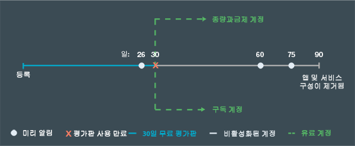

---

 

copyright:

  years: 2015, 2016

 

---

{:codeblock: .codeblock}
{:screen: .screen}
{:shortdesc: .shortdesc}
{:generic: data-hd-programlang="generic"}
{:java: data-hd-programlang="java"}
{:ruby: data-hd-programlang="ruby"}
{:c#: data-hd-programlang="c#"}
{:objectc data-hd-programlang="objectc"}
{:python: data-hd-programlang="python"}
{:javascript: data-hd-programlang="javascript"}
{:php: data-hd-programlang="php"}
{:swift: data-hd-programlang="swift"}
{:generic: data-hd-operatingsystem="generic"}
{:ios: data-hd-operatingsystem="ios"}
{:android: data-hd-operatingsystem="android"}
{:DomainName: data-hd-keyref="APPDomain"}
{:DomainName: data-hd-keyref="DomainName"}
{:app_name: data-hd-keyref="app_name"}
{:app_key: data-hd-keyref="app_key"}
{:app_secret: data-hd-keyref="app_secret"}
{:app_url: data-hd-keyref="app_url"}
{:org_name: data-hd-keyref="org_name"}
{:route: data-hd-keyref="route"}
{:space_name: data-hd-keyref="space_name"}
{:service_name: data-hd-keyref="service_name"}
{:service_instance_name: data-hd-keyref="service_instance_name"}
{:user_ID: data-hd-keyref="user_ID"}
{:subsection: outputclass="subsection"}
{:service: architecture="service"}
{:runtime: architecture="runtime"}
{:runtimeIconList: .runtimeIconList}
{:runtimeIcon: .runtimeIcon}
{:runtimeTitle: .runtimeTitle}
{:runtimeLink: .runtimeLink}
{:tsSymptoms: .tsSymptoms}
{:tsCauses: .tsCauses}
{:tsResolve: .tsResolve}

# 가격 책정
{: #pricing}

*마지막 업데이트 날짜: 2016년 5월 16일*

{{site.data.keyword.Bluemix}}에서 애플리케이션을
실행하고 {{site.data.keyword.Bluemix_notm}} 서비스를 무료로
사용해 볼 수 있습니다. 무료 지원을 포함한 추가 허용량을 제공하는
30일 무료 평가판을 등록할 수 있습니다. 30일 후에는 계정 유형을 선택하고, 무료 사용량을 초과하여 사용하는 항목에 대해서만 비용을 지불할 수 있습니다. Bluemix비용을 미리 추정할 수 있는 비용 계산기 및 앱 빌드 후 실제 비용을 확인할 수 있는 사용량 대시보드 보기를 제공합니다.
{:shortdesc}

## 무료 평가판
{: #trial}
{{site.data.keyword.Bluemix_notm}} ID를 사용하여 30일 무료 평가판을 등록할 수 있습니다. 평가판 사용 중 {{site.data.keyword.Bluemix_notm}}에서
애플리케이션을 개발하고 서비스를 사용할 수 있습니다. 

사용자 계정에 다음과 같은 자원이 무료로 제공됩니다. 

* 최대 2GB 메모리
* 서비스 10개
* SSL 인증서 1개

무료 평가판은 등록 후 30일이 경과하면 만료됩니다. 30일 무료 평가판이 만료되면
사용자 계정의 애플리케이션이 중지되며, {{site.data.keyword.Bluemix_notm}}에서
다른 평가판을 등록할 수 없습니다. 그러나 자신의 계정과 초대받은 계정에는
계속 액세스할 수 있습니다. 애플리케이션을 다시 시작하려면 종량과금제 계정에 대한 신용카드 정보를 제공하거나, 구독 계정을 작성하십시오. 계정을 변환한 후 무료 컴퓨팅 및 서비스 허용량을 계속 사용할 수 있습니다. 매월 무료 사용량의 일부로 포함되지 않은 서비스, 컨테이너 및 런타임 사용량에 대해서만 비용이 청구됩니다. 

무료 평가판이 만료된 후 계정을 변환하지 않을 경우 무료 평가판 만료 후
계정 상태에 대한 이메일 알림을 받게 됩니다. 애플리케이션 설정 및
구성이 손실되지 않도록 지불 계정을 작성하라는 내용의 알림입니다.
{{site.data.keyword.Bluemix_notm}}로부터 이러한 알림을 받지 않으려는 경우 언제든지 등록을 해지할 수 있습니다.
평가판 사용이 만료된 후 1개월이 경과하면 애플리케이션과 서비스 구성이
제거됩니다. 다음 그림은 {{site.data.keyword.Bluemix_notm}}
계정 관리의 일반적인 프로세스를 보여줍니다. 




*그림 1. {{site.data.keyword.Bluemix_notm}} 계정 관리의 프로세스 순서도*


무료 평가판 사용 중 계정을 변환할 경우 무료 사용량이 각 서비스에서 일반적으로 제공하는
허용량으로 제한됩니다. 이 허용량은 무료 평가판 사용 중 여러 IBM 서비스에서 제공하는
무제한 사용 허용량이 아닙니다. 


##요금
{: #what_it_costs}

특정 서비스, 런타임, 컨테이너, 가상 서버 또는 지원 옵션에서 사용되는 자원에 따라 요금이 달라집니다. 자원은 API 호출 수, 인스턴스 수, 메모리, 스토리지 등일 수
있습니다. {{site.data.keyword.Bluemix_notm}}에서 요금을 계획하는 데 도움이 되도록 세부 비용 추정기 및 최소 단위까지 계산 가능한 비용 계산기를 제공합니다. *사용량 대시보드* 보기를 사용하여 앱을 빌드한 후 실제 비용을 확인할 수 있습니다. 비용에 대한 자세한 정보는 [비용 청구 방식](index.html#charges)을 참조하십시오.
 

##프로모션 코드
{: #promo}

때로는 {{site.data.keyword.Bluemix_notm}} 영업 팀이나 다른 {{site.data.keyword.Bluemix_notm}} 담당자가 프로모션 코드를 제공하기도 합니다. 프로모션 코드를
적용하면 {{site.data.keyword.Bluemix_notm}}에서
해당 평가판 계정에 제공하는 추가 자원이나 기능을 이용할 수 있습니다.

이 자원이나 기능은 특정 코드에 따라 달라지지만,
다음 항목 중 한 가지 이상을 포함합니다. 

* 메모리 할당량을 프로모션 코드에 지정된 크기(GB)로
확장
* 프로모션 코드에 지정된 메모리 할당량을 적용하여
하나의 조직 추가
* 무제한의 조직 추가
* 프로모션 코드에 지정된 수의 SSL 인증서를
추가로 업로드
* 프리미엄 서비스 플랜 사용

**참고:** 계정에 여러 개의 프로모션 코드를 적용할 수 있습니다. 각 프로모션 코드는
코드 만기 날짜 이전에 한 번만 등록 가능합니다.프로모션 코드를 사용하려면 **프로파일 설정** 아이콘을 클릭하고 **계정**을 선택한 다음 {{site.data.keyword.Bluemix_notm}} 사용자 인터페이스에서 **계정 유형**을 클릭하십시오. 

##비용 청구 방법
{: #pay-accounts}

{{site.data.keyword.Bluemix_notm}} 청구 가능 플랜을 등록하는 경우 다음 계정에서 선택할 수 있습니다.
* 종량과금제
* 구독
* {{site.data.keyword.Bluemix_notm}} Dedicated
* {{site.data.keyword.Bluemix_notm}} Local

종량과금제 계정을 사용할 경우 {{site.data.keyword.Bluemix_notm}} 컴퓨팅 및 서비스 사용량을 기준으로 비용이 청구됩니다. 구독 계정을 사용할 경우 매월 최소 지출 약정에 따라 월별 할인이 적용됩니다. {{site.data.keyword.Bluemix_notm}} Dedicated 및 {{site.data.keyword.Bluemix_notm}} Local은 연간 계약으로 비용이 청구됩니다.

무료 평가판을 청구 가능한 계정으로 언제든지 변환할 수 있습니다. 청구 대상이 아닌 모든 무료 평가판 계정 정보 및 {{site.data.keyword.Bluemix_notm}} 솔루션이 새로운 청구 가능 계정에 완전히 병합됩니다.

청구 가능 계정을 작성한 후에는 제공한 정보를 편집할 수 있습니다. {{site.data.keyword.Bluemix_notm}} 사용자 인터페이스의 오른쪽 위에 있는 **프로파일 설정** 아이콘을 클릭한 다음 **계정 &gt; 계정 유형**을 클릭하여 정보를 편집하십시오.

종량과금제 또는 구독 계정을 사용할 때 {{site.data.keyword.Bluemix_notm}}에 문제점이 발생할 경우, 자세한 정보는 [온라인으로 도움 얻기](https://www.ng.bluemix.net/docs/troubleshoot/getting_customer_support.html#online_help)를 참조하십시오.

###종량과금제 계정
{: #pay-as-you-go}

종량과금제 계정을 등록할 경우 사용하는 {{site.data.keyword.Bluemix_notm}} 자원에 대해서만 비용이 청구됩니다. 무료 런타임 및 서비스 허용량도 제공받을 수
있습니다. 

대부분의 국가에서는 {{site.data.keyword.Bluemix_notm}} 사용자 인터페이스를 통해 종량과금제 계정을 등록할 수 있습니다. **무료 평가판** 아이콘을 클릭한 다음 **무료 계정 확인**을 클릭하고 **옵션 1**을 선택하십시오. 국가나 지역을 입력하고 **신용카드 추가**를 클릭하여 신용카드 정보를 제공하십시오. 청구 및 신용카드 정보를 입력한 후에는
이용 약관에 동의하고 계정 요청을 제출하십시오. 그러면 신용카드의
유효성이 검증됩니다. 계정 정보 확인 이메일도 전송됩니다. 확인 이메일을 받은 지
몇 분 후 {{site.data.keyword.Bluemix_notm}}로
돌아가 계속해서 앱을 빌드할 수 있습니다. {{site.data.keyword.Bluemix_notm}}에서 사용자 국가나 지역의 온라인 요청을 처리할 수 없는 경우, [Bluemix 문의](https://console.ng.bluemix.net/#/contactUs/cloudOEPaneId=contactUs) 페이지에 나열된 링크를 통해 {{site.data.keyword.Bluemix_notm}} 영업 팀에 문의하여 종량과금제 계정을 등록하십시오.

종량과금제 계정은 언제든지 구독 계정으로 변환할 수 있습니다. 구독 계정을 사용할 경우 매월 최소 금액 지출 약정이 적용됩니다. 구독 계정으로 변환하려는 경우,
[Bluemix 문의](https://console.ng.bluemix.net/#/contactUs/cloudOEPaneId=contactUs) 페이지에 나열된 링크를 사용하여
{{site.data.keyword.Bluemix_notm}} 영업 팀에 문의하십시오.

###구독 계정
{: #subscription}

구독 계정을 등록할 경우 매월 최소 금액 지출 약정에 따라 해당 최소 비용에 적용되는 구독 할인을 받습니다. 최소 지출 금액을 초과하는
사용량에 대해서는 비용이 청구됩니다. 

구독 계정을 등록하고, 구독 요금 및 할인에 대한 자세한 정보를 보려면,
[Bluemix 문의](https://console.ng.bluemix.net/#/contactUs/cloudOEPaneId=contactUs) 페이지에 나열된 링크를 사용해
{{site.data.keyword.Bluemix_notm}} 영업 팀에 문의해야 합니다.

###{{site.data.keyword.Bluemix_notm}}
Dedicated 계정
{: #dedicated}

{{site.data.keyword.Bluemix_notm}}에서
최소 1년의 등록 기간을 요구하며 다음을 포함합니다. 

* 인프라에 대한 VPN 연결
* SoftLayer 데이터 센터의 완전한 중복 환경
* 지원되는 모든 런타임(IBM Java Liberty, Node.js 및 기본 제공
오픈 소스 런타임)
* 선택한 모든 전용 서비스 및 모든 공용 {{site.data.keyword.Bluemix_notm}} 서비스
* 표준 {{site.data.keyword.Bluemix_notm}} 지원


SoftLayer DirectLink 또는 프리미엄 지원 옵션과 같은
선택적 항목을 주문할 수도 있습니다. 자세한 정보는
[ Bluemix 영업 팀](https://console.ng.bluemix.net/?direct=classic/#/contactUs/cloudOEPaneId=contactUs)에 문의하십시오.

{{site.data.keyword.Bluemix_notm}} Dedicated를 사용하는 경우 최소 기간인 1년 동안은 등록해야 합니다. 해당 기간 동안 매월 지불하는 항목은
원하는 전용 서비스 및 모든 공용 서비스에 액세스할 수 있는
구독 계정을 기반으로 합니다.
{{site.data.keyword.Bluemix_notm}} Public의
서비스 사용 비용은 구독 계정 계약을 기반으로 계산됩니다. 해당 구독 계약 외에
추가로 사용하는 모든 서비스에 대해 송장이
발급됩니다. 계약을 체결하려면 IBM 공인 계정 담당자 또는
[ Bluemix 영업 팀](https://console.ng.bluemix.net/#/contactUs/cloudOEPaneId=contactUs)에 문의하십시오.


###{{site.data.keyword.Bluemix_notm}} Local 계정
{: #local}

{{site.data.keyword.Bluemix_notm}}에서
최소 1년의 등록 기간을 요구하며 다음을 포함합니다. 

* 릴레이로 불리며 IBM이 사용자의 로컬 배치에 연결하고 업데이트를 자동적이고 일관적으로
전달할 수 있도록 하는 전달 기능
* 지원되는 모든 런타임(IBM Java Liberty, Node.js 및 기본 제공
오픈 소스 런타임)
* 선택한 모든 로컬 서비스 및 모든 공용 {{site.data.keyword.Bluemix_notm}} 서비스에 대한 액세스
* 표준 {{site.data.keyword.Bluemix_notm}} 지원


{{site.data.keyword.Bluemix_notm}} Local을
사용하는 경우 최소 기간인 1년 동안은 등록해야 합니다. 해당 기간 동안 매월 지불하는 항목은
원하는 로컬 서비스 및 모든 공용 서비스에 액세스할 수 있는
구독 계정을 기반으로 합니다.
{{site.data.keyword.Bluemix_notm}} Public의
서비스 사용 비용은 구독 계정 계약을 기반으로 계산됩니다. 해당 구독 계약 외에
추가로 사용하는 모든 서비스에 대해 송장이
발급됩니다. 계약을 체결하려면
IBM 공인 계정 담당자 또는 [{{site.data.keyword.Bluemix_notm}} 영업 팀](https://console.ng.bluemix.net/#/contactUs/cloudOEPaneId=contactUs)에 문의하십시오.

##비용 청구 방법
{: #charges}

{{site.data.keyword.Bluemix_notm}} 청구 가능 계정을 사용할 경우 조직에서 사용한 컴퓨팅, 컨테이너 및 서비스에 대한 비용이 청구됩니다. 다른 계정에 있는 조직에 참여하도록 다른 {{site.data.keyword.Bluemix_notm}} 
사용자의 초대를 받을 수도 있습니다. 초대받은 조직에서 애플리케이션을 작성하거나
서비스를 사용할 경우 이로 인해 발생한 사용량이 해당 조직이 포함되어 있는 계정에
청구됩니다. {{site.data.keyword.Bluemix_notm}} 카탈로그의 자원 세부사항 페이지 또는 {{site.data.keyword.Bluemix_notm}} 가격 책정 페이지의 가격 계산기에서 구체적인 비용에 대한 자세한 정보를 볼 수 있습니다.

사용하는 {{site.data.keyword.Bluemix_notm}}의 기능에 따라 다양한 유형의 비용이 적용됩니다. 다음 표에 개괄적인 정보가 나와 있습니다.

| 비용 유형 | 설명 | 이 비용 유형을 사용하는 {{site.data.keyword.Bluemix_notm}} 기능 | 예 |
|------------------|------------------|--------------------------|--------------------------|
| 고정 | 고정 가격은 약정된 월별 요금을 기준으로 하며 조정되지 않습니다. | 서비스  | 데이터 캐시에 고정된 월별 요금에 따라 비용이 청구되는 고정 플랜이 적용됩니다. |
| 계량 | 사용량 계량에 따른 가격 책정은 런타임에 소비된 GB-시간 수치 및 컨테이너에 소비된 GB-시간 수치 및 IP 주소와 스토리지 수치를 기준으로 합니다. | 서비스, 컴퓨팅 및 컨테이너 | 푸시 서비스의 경우, 월별 무료 허용량을 초과하는 사용량에 대해 비용이 청구됩니다. |
|  계단식   |  일부 가격 책정 플랜은 계층으로 구분된 가격 책정 모델을 기반으로 하므로 실제 사용에 따라 볼륨 기반 할인을 받을 수 있습니다. 단순, 누진 또는 블록 계층 가격 책정 플랜에 따라 서비스가 제공됩니다.  | 서비스 | 계단식 가격 책정은 일반적으로 API 호출 같이 매월 사용량이 매우 높을 것으로 예상되는 비용 메트릭에 사용됩니다. |
| 예약 | 예약 가격 책정은 서비스에 대한 장기 약정을 기준으로 하므로 할인 가격을 적용 받을 수 있습니다. 예약 플랜을 사용하는 경우, 공용 {{site.data.keyword.Bluemix_notm}} 환경을 통해 간편하게 설정, 배치, 제공되는 전용 서비스 인스턴스를 사용하게 됩니다. | 서비스 | DB2 on Cloud에는 예약 플랜이 적용됩니다.|

###컴퓨팅 자원 비용
{: #compute}

애플리케이션이 실행된
시간과 사용된 메모리에 대해 비용이 청구됩니다(*GB-시간*으로 계산됨).
GB-시간은 애플리케이션 인스턴스 수, 인스턴스당 메모리, 인스턴스가 실행된 시간을
각각 곱한 값입니다. 필요에 따라 인스턴스 수와 인스턴스당 메모리 양을 사용자 정의할
수 있습니다. 더 많은 사용자를 수용하기 위해 메모리 또는 인스턴스를 추가할
수도 있습니다. 최종 비용은 GB-시간 단위입니다. 즉, 애플리케이션 인스턴스 수,
인스턴스당 메모리, 실행 시간을 모두 곱한 값입니다.


두 개의 512MB 인스턴스에서 30일(720시간) 동안 실행 중인
런타임의 비용이 $0.07/GB-시간이라고 간주할 경우, 다음과 같이 계산하여
이러한 자원에 대한 비용은 $24.15 USD입니다(무료 사용량 375GB-시간 포함).
 

```

인스턴스 2개 x 0.5GB x 720시간 = 720GB-시간.
(720 - 375)GB-시간 x $0.07/GB-시간 = $24.15
```

###서비스 비용
{: #services}

대부분의 서비스에는 매월
무료 사용량이 포함됩니다. 무료 사용량의 일부로 포함되지 않은 서비스 사용량은
다음 방법 중 하나로 비용이 청구됩니다. 
<dl>
<dt>고정 요금</dt>
    <dd>요금제를 선택하고 정액으로 지불할 수 있습니다. 예를 들어, 데이터 캐시 서비스는 정액제로 청구됩니다.</dd>
<dt>계량 요금</dt>
    <dd>런타임 및 서비스 사용량에 따라 비용이 청구됩니다. 예를 들어 푸시 서비스의 경우
무료 3개월 허용량을 초과하는 사용량에 대해 비용이 청구됩니다. </dd>
<dt>예약 요금</dt>
    <dd><p>종량과금제 계정 또는 구독 계정의 계정 소유자는 할인된 가격의 장기 약정으로 서비스 인스턴스를 예약할 수 있습니다. 예를 들어, 12개월 동안 표준 대규모 DB2 on Cloud 오퍼링을 예약합니다.</p> 
    <p>일부 {{site.data.keyword.Bluemix_notm}} 서비스는 예약 플랜을 제공합니다.  서비스 타일을 클릭하면 {{site.data.keyword.Bluemix_notm}} <strong>카탈로그</strong>에서 예약 플랜을 요청할 수 있습니다. 그런 다음 요구사항에 가장 부합하는 서비스 플랜을 선택합니다. 예약 플랜이 있는 경우, <strong>요청</strong>을 클릭하고 지시에 따라 요청을 보내십시오. 예약 플랜의 가격 정보가 담겨 있는 이메일이 발송됩니다. {{site.data.keyword.Bluemix_notm}} 영업 담당자가 조만간 연락하여 구매를 완료하게 됩니다.</p></dd>
<dt>계단식 요금</dt>
    <dd>계량 요금과 비슷하게 런타임 및 서비스 사용량에 따라 지불합니다. 하지만, 계단식 요금은 가격 책정 계층이 추가되어 사용량이 높은 계층에 대해 할인을 제공하는 경우가 많습니다. 계단식 가격 책정은 단순, 누진 또는 블록 방식으로 제공됩니다.</dd>
</dl>


####단순 계층
{: #simple_tier}

단순 계층 모델에서 단가는 사용량이 속한 계층에 따라
결정됩니다. 총 가격은 사용량에 이 계층의 단가를
곱한 값입니다. 예를 들어, 다음과 같습니다. 

| 항목 수량 | 모든 항목의 단가 |
|-------------------|--------------------------|
| 계층 1: 1 - 1000  | $1 USD                   |
| 계층 2: 1001 - 2000    |    $0.90 USD                      |
| 계층 3: 2001 - 3000                  |   $0.75 USD                       |
| 계층 4: 3001 - 4000           |      $0.60 USD                    |
|계층 5: &gt; 4000 | $0.40 USD | 

*표 1. 단순 계층 가격 책정표*

다음 표에는 단순 계층 가격 책정 모델을 기반으로 하는
플랜에서 지불해야 하는 금액이 설명되어 있습니다.

| 항목 수량 | 요금 계산 | 총 가격 |
|-------------------|--------------------|-------------|
|500 |	500 × 1 = 500 |	$500 USD|
|1500 |	1500 × 0.90 = 1350 |	$1350 USD|
|2500 |	2500 × 0.75 = 1875 |	$1875 USD|
|... |	... |	...|
|5200 |	5200 × 0.40 = 2080 |$2080 USD|
*표 2. 단순 계층 가격 책정 모델을 사용하여 비용 계산*

####누진 계층
{: #graduated_tier}

누진 계층 모델에서는 사용 레벨이 증가할수록
계층별 단가가 인하됩니다. 총 가격은 각 사용
레벨의 누적 요금으로 해당 계층의 단가와 수량을 곱한
값으로 구성됩니다. 예를 들어, 다음과 같습니다. 

| 항목 수량 |	계층에 있는 항목의 단가|
|-------------------|------------------------------------|
|    계층 1: 1 - 1000 |	$1 USD |
|   계층 2: 1001 - 2000 |	$0.90 USD |
|    계층 3: 2001 - 3000 |	$0.75 USD |
|    계층 4: 3001 - 4000 |	$0.60 USD |
|    계층 5: &gt; 4000 |	$0.40 USD |
*표 3. 누진 계층 가격 책정표*

다음 테이블에는 누진 계층 가격 책정 모델을 기반으로 하는
플랜에서 지불해야 하는 금액이 설명되어 있습니다. 

|항목 수량 | 요금 계산 | 총 가격|
|------------------|--------------------|------------|
|500 |	500 × 1(계층 1의 단가) = 500 |	$500 USD|
|1500 |	(1000 × 1(계층 1의 단가)) + (500 × 0.90(계층 2의 단가)) = 1450 |	$1450 USD|
|2500 |	(1000 × 1(계층 1의 단가)) + (1000 × 0.90(계층 2의 단가)) + (500 × 0.75(계층 3의 단가)) = 2275 |	$2275 USD |
|... |	... |	...|
|5200 |	(1000 × 1(계층 1의 단가)) + (1000 × 0.90(계층 2의 단가)) + (1000 × 0.75(계층 3의 단가)) + (1000 × 0.60(계층 4의 단가)) + (1200 × 0.40(계층 5의 단가)) = 3730 |	$3730 USD|
*표 4. 누진 계층 가격 책정 모델을 사용하여 요금 계산*

####블록 계층
{: #block_tier}

블록 계층 모델에서 가격은 사용 레벨 내에서 사용한
수량별로 설정된 요금입니다. 총 가격은 실제 사용과 상관없이
사용 레벨에 맞게 설정된 요금입니다. 연속된 각 계층에서는
수량비에 따라 낮은 가격을 제공합니다.예를 들어, 다음과 같습니다. 

|항목 수량 |	모든 항목의 총 가격|
|------------------|-----------------------------|
| 계층 1: &lt;= 1000 |	$1000 USD|
| 계층 2: &lt;= 2000 |	$1900 USD|
| 계층 3: &lt;= 3000 |	$2800 USD|
| 계층 4: &lt;= 4000 |	$3500 USD|
| 계층 5: &lt;= 10000 |	$5000 USD|
*표 5. 블록 계층 가격 책정표*

다음 테이블에는 블록 계층 가격 책정 모델을 기반으로 하는
플랜에서 지불해야 하는 금액이 설명되어 있습니다.

|항목 수량 |	요금 계산 |	총 가격|
|------------------|-----------------------|---------------|
|500 |	항목의 수가 계층 1에 속하므로 총 가격은 $1000 USD입니다. |	$1000 USD|
|1500 |	항목의 수가 계층 2에 속하므로 총 가격은 $1900 USD입니다. |	$1900 USD|
|... |	... |	...|
|5200 |	항목의 수가 계층 5에 속하므로 총 가격은 $5000 USD입니다. |	$5000 USD|
*표 6. 블록 계층 가격 책정 모델을 사용하여 요금 계산*

### 가상 서버에 대한 무료 사용량
{: #vms}

IBM 퍼블릭 클라우드에서 {{site.data.keyword.Bluemix_notm}} 가상 서버를 베타 기능으로 비용 청구 없이 사용할 수 있습니다. 무료 사용량은 작성할 수 있는 가상 서버 이미지 수, 지정되는 IP 주소 수, 사용 가능한 메모리 양에 대해 제공됩니다.

{{site.data.keyword.Bluemix_notm}} 가상 서버 베타에 대한 무료 사용량 항목은 다음과 같습니다.

* 인스턴스 8개
* 가상 CPU 8개
* 12GB 메모리
* 200GB 블록 스토리지
* 공용 IP 주소 4개

또한 가상 서버 인프라를 사용하여 {{site.data.keyword.Bluemix_notm}} 프라이빗 클라우드에서 가상 서버를 프로비저닝할 수 있습니다. 단, 이는 프라이빗 클라우드의 한계와 할당량의 영향을 받습니다.


##비용 추정 방법
{: #cost}

다른 방법을 통해 {{site.data.keyword.Bluemix_notm}}를
사용하여 앱을 빌드하고 호스팅하기 위해 지불해야 하는 비용을 확인할 수 있습니다. 

* {{site.data.keyword.Bluemix_notm}} 가격 책정 페이지의 비용 추정기는 앱의 크기를 기반으로 비용의 대략적인 추정값을 제공합니다.
* {{site.data.keyword.Bluemix_notm}} 가격 책정 페이지의 비용 계산기는 런타임 및 서비스 사용에 대한 입력 내용을 기반으로 정확한 앱 가격을 제공합니다.
* 또한 비용을 수동으로 계산할 수도 있습니다.

###비용 계산기 사용
{: #calculator}

{{site.data.keyword.Bluemix_notm}}에서 제공하는 비용 계산기를 사용하면 앱의 비용을 신속하게 계산할 수 있습니다.

1. {{site.data.keyword.Bluemix_notm}} [가격 책정 페이지](https://console.{DomainName}/pricing/)로 이동하십시오. 
2. **비용 추정** 위젯 중 하나를 사용하거나 **계산기 열기**를 사용하여 **정밀 가격 책정 계산기**를 사용하십시오.

계산기를 사용하려면 나열된 자원(예: 인스턴스 수 또는
푸시 알림 수)의 매월 예상 사용량을 입력하십시오.
**월별 사용량** 필드 안쪽을 클릭하면 필드에서 예상되는
단위에 대한 힌트를 볼 수 있습니다. 계산기는 입력 내용에 대한 비용을
즉시 표시합니다. 월간 비용 대신 연간 비용을 표시하도록
계산기를 조정할 수도 있습니다.

###수동으로 비용 계산
{: #manual}

직접 {{site.data.keyword.Bluemix_notm}} 비용을
추정하거나, {{site.data.keyword.Bluemix_notm}} 비용이 계산되는
방식을 보다 잘 파악하고자 할 수 있습니다. 사용되는 런타임과 서비스의 가격을 고려하여
{{site.data.keyword.Bluemix_notm}}를 사용하여
앱을 빌드하고 호스팅하는 데 드는 총 비용을 계산할 수 있습니다. 런타임과 서비스의 가격은
종종 변경되므로, 총 가격을 계산할 경우 {{site.data.keyword.Bluemix_notm}}
가격 책정 시트에서 최신 정보를 참조해야 합니다. 

###예: 샘플 앱 가격 책정
{: #sample}

확장 기능이 있는 Node.js 웹 애플리케이션을
사용하며, 이 애플리케이션은 {{site.data.keyword.Bluemix_notm}}에서
제공하는 여러 개의 서비스를 사용한다고 가정합니다. 이 예에서는 애플리케이션의 실제 비용이
계산되는 방식을 파악할 수 있습니다. 웹 애플리케이션에서 사용하는
{{site.data.keyword.Bluemix_notm}} 서비스와 항목은
다음과 같습니다. 

* 256MB Node.js 런타임 인스턴스 4개
* 2개의 {{site.data.keyword.autoscaling}} 정책, 프로세서 및
메모리
* 매월 2GB의 {{site.data.keyword.datacshort}}
* 매월 150GB의 NoSQL 데이터베이스, Heavy API 호출 100,000개 및
Light API 호출 500,000개
* 매월 8GB의 {{site.data.keyword.sqldb}} 데이터베이스
* 20GB의 인바운드 또는 아웃바운드 네트워크 트래픽

###{{site.data.keyword.Bluemix_notm}} 자원의 가격
{: #sample_resources}

예를 단순화하기 위해 다음 표의 가격은 특정 시간 범위(예: 한 달)
내에서 또는 시간 범위 간에 변동되지 않는다고 가정합니다. 이 예의 모든 가격은
미국 통화입니다. 

|서비스 |	기능 |	가격 |
|--------|-----------|--------|
|SDK for Node.js |	매월 375GB-시간 무료(모든 런타임에서 공유됨) |	$0.07 USD/GB-시간|
|Auto-Scaling |	Auto-Scaling 서비스에 대한 무료 서비스 플랜 |	무료|
|데이터 캐시 - 스타터 |	1GB의 캐시 공간 및 복제본 |	$55.00 USD/인스턴스 |
|데이터 캐시 - 표준 |	5GB의 캐시 공간 및 복제본 |	$155.00 USD/인스턴스 |
|데이터 캐시 - 프리미엄 |	25GB의 캐시 공간 및 복제본 |	$505.00 USD/인스턴스|
|IBM Cloudant® NoSQL DB for {{site.data.keyword.Bluemix_notm}} |	2GB의 무료 데이터 스토리지<br/>매월 무료로 50,000번의 Light API 호출<br/>매월 무료로 10,000번의 Heavy API 호출 | $1.00 USD/GB<br/>$0.03 USD/1000 Light API 호출<br/>$0.15 USD/1000 Heavy API 호출 |
|SQL Database 	| 인스턴스당 무료 2GB<br/>인스턴스당 최대 10GB |	$30.00 USD/인스턴스 |
*표 7. 가격 책정 시트*

###애플리케이션 가격
계산

애플리케이션의 가격은 다음과 같은 방법으로
계산할 수 있습니다. 

<dl>
<dt>256MB Node.js 런타임 인스턴스 4개</dt>
<dd>Bluemix에서는 런타임 비용을 GB-시간 단위로 청구합니다. 매월 사용량(GB)은 <code>월별 4 x 256 = 1024MB 또는 1GB</code>입니다. <code>한 달은 24 x 30 = 720시간</code>으로 가정하므로 애플리케이션의 비용이 <code>1 x 720 = 720GB-시간</code>으로 청구됩니다.
<p>
375GB-시간은 매달 무료 사용량에 포함되며, 모든
{{site.data.keyword.Bluemix_notm}} 런타임에서 공유됩니다.
런타임의 총 비용은 <code>$0.07 x (720-375) = $24.15</code>입니다. </p></dd>

<dt>2개의 Auto-Scaling 정책(프로세서 및 메모리)</dt>
<dd>Auto-Scaling 정책은 무료입니다.</dd>

<dt>매월 2GB의 데이터 캐시</dt>
<dd>데이터 캐시 서비스에서 50MB 플랜을 무료로 제공합니다. 그러나 무료 사용제로는 매달 2GB의 예상 사용량을
충당할 수 없습니다. 데이터 캐시에 대한 3개의 유료 사용제를 사용할 경우 실제로 사용하는 공간의 양에 관계없이 특정 공간량에 대해 정해진 비용이 듭니다. 따라서 예상 사용량을 충족하는 최소 플랜을
선택할 수 있는데, 이것이 표준 플랜(5GB)입니다. 총 비용은 매달 $155입니다. </dd>

<dt>매월 150GB의 NoSQL 데이터베이스</dt>
<dd>IBM Cloudant NoSQL DB for {{site.data.keyword.Bluemix_notm}} 서비스 비용은 데이터 스토리지 및 여러 API 메소드로 데이터에 액세스할 수 있는지에 따라 달라집니다. <strong>PUT</strong> 및 <strong>POST</strong>
명령은 Heavy API 호출로 간주되지만, <strong>GET</strong> 명령은
Light API 호출로 간주됩니다. <p>
GB 수를
더한 다음 2GB 무료 사용량을 빼십시오. 매달 148GB가 청구됩니다.
Light API 호출의 경우 무료 사용량인 50,000을 빼고, Heavy API 호출의 경우
10,000을 빼십시오. 총 스토리지 가격에는 다음과 같은 파트가 포함됩니다.
</p>
<pre class="codeblock">
<codeblock>
    148 x 1 = $148
    (450,000 / 1000) x 0.03 = $13.5
    (90,000 / 1000) x 0.15 = $13.5
</codeblock>
</pre>
<p>
총 가격은 148 + 13.5 + 13.5 = $175입니다. </p></dd>

<dt>매월 8GB의 SQL 데이터베이스</dt>
<dd>총 가격은 인스턴스당 $30입니다. </dd>

<dt>20GB의 인바운드 또는 아웃바운드 네트워크 트래픽</dt>
<dd>인바운드 및 아웃바운드 네트워크 트래픽은 무료입니다. </dd>

</dl>

모든 항목을 더할 경우
총 애플리케이션 가격은 $384.15입니다. 

##사용량 대시보드
{: #usage}

계정 소유자 또는 청구 관리자는 사용량 대시보드 보기를 사용하여 조직에서 매달 사용하는 런타임 및 서비스에 대한 실시간 요금을 확인할 수 있습니다. 모든 지역의 런타임 GB-시간 및 서비스 사용량을 확인하거나,
특정 지역 및 영역을 선택하여 지난 12개월 동안의 사용량을 확인할 수 있습니다. 

사용량 대시보드 보기를 열려면 **계정 및 지원** 아이콘 &gt; **계정** &gt; *your_account_name* &gt; **사용량 대시보드**를 클릭하십시오. 이 보기에서 계정의 런타임 및 서비스 사용량에 대한 요약 정보를
확인할 수 있습니다. 청구 관리자는 청구 관리자를 맡고 있는 조직에 대한 세부사항만 확인할 수 있습니다. 

각 청구 주기가 끝날 때 모든 조직에서 발생한 총 사용량이 계정 소유자에게 청구됩니다. 각 청구 주기는 한 달입니다. 

계정 소유자는 지역 및 조직별로 사용량 요약을 필터링할 수 있습니다.
계정 소유자인 경우 12개월 기간 전체 계정의 사용량을 확인하려면 **조직**을 **모든 조직**으로 설정합니다. 특정 월의 사용량을 확인하려면 해당 월을 클릭합니다. 표시된 비용은 계정 소유자가 해당 월에 지불해야 하는 금액을 나타냅니다.

**조직**에 대해 특정 조직을 선택하면 무료 계층의 사용량을 포함하여 해당 조직의 전체 사용량을 확인할 수 있습니다. 조직에 표시되는 비용이 청구되는 비용은 아닙니다. 무료 계층 사용량은 조직 레벨이 아닌 계정 레벨에서 무료로 표시됩니다. 따라서 조직 사용량을 확인할 때는 무료 사용량과 유료 사용량을 포함한 해당 조직의 실제 사용량이 표시됩니다. 무료 계층이 제거된 후 모든 조직의 사용량이 계정 사용량으로 계산됩니다.

##알림
{: #notifications}

종량과금제 계정의 계정 관리자는 계정의 총 비용, 런타임 및 서비스, 개별 서비스(써드파티 서비스 제외)에 대한 알림을 전송하도록 설정할 수 있습니다. 지정한 지출 임계값의 80%, 90%, 및 100% 에 도달하면 알림을 받게 됩니다.

**알림** 보기를 열려면 **계정 및 지원** 아이콘 &gt; **계정** &gt; *your_account_name* &gt; **지출 알림**을 클릭하십시오. 필요에 따라 각 지출 알림 유형에 대해 알림을 트리거할 지출 임계값을 설정하는 숫자 값을 입력하십시오. 개별 서비스에 대한 알림을 추가 및 삭제할 수도 있습니다. 

##플랜 변경 방법
{: #changing}

해당 서비스의 플랜 변경이 가능한 경우 서비스 대시보드의 {{site.data.keyword.Bluemix_notm}}에서 서비스 플랜을 변경할 수 있습니다.

특정 서비스에서만 서비스 플랜을 변경할 수 있는 기능을 제공합니다. 서비스의 플랜 변경이 가능하면 서비스 대시보드의 왼쪽 탐색에 **플랜** 옵션이 표시됩니다. 플랜을 변경하는 경우
서비스마다 수행할 다음 단계 세트가 다릅니다. 

1. 플랜을 변경하려면 서비스 대시보드에서 **플랜**을 클릭하십시오. 일반적으로 플랜을 업그레이드하거나 플랜을 낮출 수 있습니다.
2. 플랜을 변경한 후 다음 단계 세트를 완료해야 합니다. 플랜 변경 유형과 서비스에 따라 단계는 달라집니다. 예를 들어, 플랜을 낮추는 경우 앱을 다시 스테이징해야 합니다. 또는, 플랜을 업그레이드한 경우 앱을 다시 스테이징하고 다른 조치를 수행해야 할 수 있습니다. <br/><br/>앱을 다시 스테이징하려면 {{site.data.keyword.Bluemix_notm}} 대시보드로 이동하여 서비스가 바인드된 앱을 찾으십시오. 앱 메뉴에서 **앱 다시 시작**을 선택하십시오.<br/><br/>다른 다음 단계 조치는 서비스에 따라 다릅니다. 특정 조치는 다음 테이블을 참조하십시오.

|서비스 |	정보|
|--------|-------------|
|Presence Insights 	|라이트 플랜을 사용하는 중에 무료 사용량을 초과하는 경우, 403 메시지가 표시되거나 사용자에게 더 이상 권한이 없다는 메시지가 로깅되고 서비스 인스턴스 사용이 불가능하게 됩니다. 또한, 403 응답이 나타나고 POST REST API 호출이 거부됩니다.<br/><br/>무료 사용량을 초과하여 서비스가 사용 불가능한 경우 라이트 플랜을 유료 사용제로 업그레이드할 수 있습니다. 서비스는 2시간 이내에 다시 활성화됩니다.<br/><br/>유료 사용제를 사용하는 경우, 이벤트 및 총 스토리지의 사용량이 라이트 플랜 허용량 범위 이내이면 라이트 플랜으로 축소할 수 있습니다.<br/><br/>플랜을 업그레이드하거나 축소할 때 앱을 다시 스테이징하거나 다시 시작할 필요는 없습니다.|
*표 8. 플랜 변경의 다음 단계*

###명령행 인터페이스를 통해 플랜을 변경하는 방법

선택적으로 명령행 인터페이스를 통해 서비스 플랜을 변경할 수 있습니다. 
서비스 플랜을 업데이트하려면 다음 명령을 입력하십시오.
```
cf update-service <service_name> [-p <new_plan>]
```
# 관련 링크
## 일반 
* [{{site.data.keyword.Bluemix_notm}} 가격 책정 시트](https://console.{DomainName}/pricing/)
* [{{site.data.keyword.Bluemix_notm}} 개발자 커뮤니티 포럼](https://developer.ibm.com/bluemix/)
* [온라인으로 도움 얻기](https://www.{DomainName}/docs/troubleshoot/getting_customer_support.html#online_help)
* [문의](https://console.{DomainName}/#/contactUs/cloudOEPaneId=contactUs)
