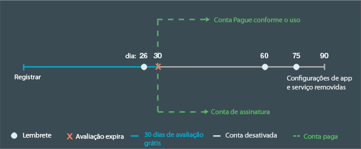

---

 

copyright:

  years: 2015, 2016

 

---

{:codeblock: .codeblock}
{:screen: .screen}
{:shortdesc: .shortdesc}
{:generic: data-hd-programlang="generic"}
{:java: data-hd-programlang="java"}
{:ruby: data-hd-programlang="ruby"}
{:c#: data-hd-programlang="c#"}
{:objectc data-hd-programlang="objectc"}
{:python: data-hd-programlang="python"}
{:javascript: data-hd-programlang="javascript"}
{:php: data-hd-programlang="php"}
{:swift: data-hd-programlang="swift"}
{:generic: data-hd-operatingsystem="generic"}
{:ios: data-hd-operatingsystem="ios"}
{:android: data-hd-operatingsystem="android"}
{:DomainName: data-hd-keyref="APPDomain"}
{:DomainName: data-hd-keyref="DomainName"}
{:app_name: data-hd-keyref="app_name"}
{:app_key: data-hd-keyref="app_key"}
{:app_secret: data-hd-keyref="app_secret"}
{:app_url: data-hd-keyref="app_url"}
{:org_name: data-hd-keyref="org_name"}
{:route: data-hd-keyref="route"}
{:space_name: data-hd-keyref="space_name"}
{:service_name: data-hd-keyref="service_name"}
{:service_instance_name: data-hd-keyref="service_instance_name"}
{:user_ID: data-hd-keyref="user_ID"}
{:subsection: outputclass="subsection"}
{:service: architecture="service"}
{:runtime: architecture="runtime"}
{:runtimeIconList: .runtimeIconList}
{:runtimeIcon: .runtimeIcon}
{:runtimeTitle: .runtimeTitle}
{:runtimeLink: .runtimeLink}
{:tsSymptoms: .tsSymptoms}
{:tsCauses: .tsCauses}
{:tsResolve: .tsResolve}

# Venda
{: #pricing}

*Última atualização: 16 de maio de 2016*

É possível executar aplicativos no {{site.data.keyword.Bluemix}} e
experimentar grátis serviços do {{site.data.keyword.Bluemix_notm}}. É possível assinar para uma avaliação gratuita por 30 dias com abonos adicionais, incluindo suporte grátis. Após 30 dias, é possível escolher um tipo de conta e pagar somente o que usar além dos abonos grátis. O
Bluemix fornece uma calculadora de custo para que você estime o custo antecipadamente e a visualização Detalhes de uso, para verificar o custo real após a construção de seus aplicativos.
{:shortdesc}

## Avaliação grátis
{: #trial}
É possível assinar uma avaliação grátis por 30 dias com seu ID do {{site.data.keyword.Bluemix_notm}}. Durante a avaliação, é possível desenvolver aplicativos
e usar serviços no {{site.data.keyword.Bluemix_notm}}.

Sua conta é fornecida com os recursos a seguir, livre de encargo:

* Máximo de 2 GB de memória
* 10 serviços
* 1 certificado SSL

Sua avaliação grátis expira em 30 dias após sua inscrição. Após a expiração da avaliação de 30 dias, os
aplicativos em sua conta serão interrompidos. Você não poderá se inscrever para outra avaliação em
{{site.data.keyword.Bluemix_notm}}. Porém, ainda é possível acessar sua conta e as contas para as quais é convidado. Para reiniciar seus aplicativos, deve-se fornecer as informações de cartão de crédito para uma conta de Pagamento por uso ou criar uma conta de Assinatura. Depois de converter sua conta, é possível continuar a usar abonos grátis de cálculo e serviço. Você paga somente pelo uso dos serviços, contêineres e tempos de execução que não estiverem incluídos como parte de seu abono mensal grátis.

Se você não converter sua conta após a expiração da sua avaliação gratuita. As notificações
lembram você de criar sua conta de pagamento para que as definições e configurações do
seu aplicativo não sejam perdidas. Se você não desejar receber essas notificações do {{site.data.keyword.Bluemix_notm}}, poderá cancelar a assinatura a qualquer momento.
Um mês após a expiração da avaliação, seus aplicativos e configurações de serviço são
removidos. A figura a seguir mostra o processo geral de gerenciamento de conta do
{{site.data.keyword.Bluemix_notm}}.




*Figura 1. Fluxograma do processo de gerenciamento de conta do {{site.data.keyword.Bluemix_notm}}*


Se você converter sua conta durante a avaliação grátis, seus abonos grátis serão limitados aos abonos normalmente fornecidos por cada serviço. Os
abonos não são mais de uso ilimitado oferecidos por muitos dos serviços IBM durante a
avaliação grátis.


##Qual é o custo
{: #what_it_costs}

Os encargos variam dependendo dos recursos usados por um determinado serviço, tempo de execução, contêiner, servidor virtual ou opção de suporte. O recurso pode ser o número de chamadas API, o número de instâncias, a memória,
o armazenamento e assim por diante. O {{site.data.keyword.Bluemix_notm}} também fornece estimadores de custo detalhados e uma calculadora de custo que não deixa escapar nenhum centavo para ajudar você a planejar os encargos. É
possível verificar o custo real após a construção de seus aplicativos, usando a visualização *Detalhes de uso*. Para obter informações mais detalhadas sobre encargos, veja [Como você é cobrado](index.html#charges).
 

##Código promocional
{: #promo}

Às vezes, o {{site.data.keyword.Bluemix_notm}} Sales ou outros representantes do {{site.data.keyword.Bluemix_notm}} fornecem códigos promocionais. Ao aplicar um código promocional, é possível obter recursos
ou capacidades extras que são fornecidos pelo {{site.data.keyword.Bluemix_notm}} para sua conta para teste.

Os recursos ou capacidades variam dependendo do código específico, mas podem incluir um ou mais dos itens a seguir:

* Aumente a cota de memória a um número de GB especificado pelo código promocional
* Inclua uma organização, com uma cota de memória que seja especificada pelo código promocional
* Inclua um número ilimitado de organizações
* Faça upload de um número adicional de certificados SSL, conforme especificado pelo código promocional
* Use planos de serviços premium

**Nota:** Também é possível aplicar vários códigos promocionais à sua conta. Cada código promocional pode ser resgatado somente uma vez após a data de expiração do código.
Para usar um código promocional, clique no ícone **Configurações do perfil**, selecione **Conta** e, em seguida, clique em **Tipo de conta** na interface com o usuário do {{site.data.keyword.Bluemix_notm}}.

##Como você é faturado
{: #pay-accounts}

Ao inscrever-se para um plano faturável do {{site.data.keyword.Bluemix_notm}}, é possível selecionar a partir das contas a seguir:
* Pagamento por uso
* Inscrição
* {{site.data.keyword.Bluemix_notm}} Dedicated
* {{site.data.keyword.Bluemix_notm}} Local

Com uma conta de Pagamento por uso, você é cobrado com base no uso de cálculo e serviços do {{site.data.keyword.Bluemix_notm}}. Com uma conta de Assinatura, é possível obter um desconto mensal com base no compromisso de gasto mensal mínimo. O {{site.data.keyword.Bluemix_notm}} Dedicated e o {{site.data.keyword.Bluemix_notm}} Local são cobrados por contratos anuais.

É possível converter a sua avaliação grátis em uma conta faturável a qualquer momento. Todos os seus dados da conta não faturável de avaliação grátis e as soluções do {{site.data.keyword.Bluemix_notm}} serão facilmente mescladas na nova conta faturável.

Depois de criar uma conta faturável, é possível editar as informações fornecidas. Clique no **ícone de Configurações de perfil** no canto superior direito da interface com o usuário do {{site.data.keyword.Bluemix_notm}}, em seguida, clique em **Conta e tipo de conta** para editar suas informações.

Se você encontrar algum problema com o {{site.data.keyword.Bluemix_notm}} quando estiver usando uma conta de Pagamento por uso ou de Assinatura, veja [Obtendo ajuda on-line](https://www.ng.bluemix.net/docs/troubleshoot/getting_customer_support.html#online_help) para obter mais informações.

###Conta de Pagamento por uso
{: #pay-as-you-go}

Se você inscrever-se para uma conta de Pagamento por uso, pagará somente pelos recursos do {{site.data.keyword.Bluemix_notm}} que forem usados. Você
também é elegível para abonos grátis de tempo de execução e serviço.

Em muitos países e regiões, é possível assinar uma conta de Pagamento por uso a partir da interface com o usuário do {{site.data.keyword.Bluemix_notm}}. Clique no ícone **Avaliação grátis** e, em seguida, clique em **Confirmar sua conta grátis** e selecione **Opção 1**. Insira seu país ou região e clique em **Incluir cartão de crédito** para fornecer informações do seu cartão de crédito. Depois
de fornecer suas informações de faturamento e cartão de crédito, aceite os termos e
condições e envie sua solicitação de conta; seu cartão de crédito será validado. Um e-mail
de confirmação dos dados da conta também será enviado. Alguns minutos após o recebimento
do e-mail de confirmação, é possível retornar ao
{{site.data.keyword.Bluemix_notm}} para
continuar construindo seus apps. Se o {{site.data.keyword.Bluemix_notm}} não puder processar sua solicitação on-line para seu país ou região, será possível entrar em contato com o {{site.data.keyword.Bluemix_notm}} Sales, usando o link listado na página  [Bluemix - Entre em contato conosco](https://console.ng.bluemix.net/#/contactUs/cloudOEPaneId=contactUs), para assinar sua conta de Pagamento por uso.

É possível converter a sua conta de Pagamento por uso em uma conta de Assinatura a qualquer momento. Com uma conta de Assinatura, você se compromete a gastar uma quantia mínima por mês. Se desejar converter em uma conta Assinatura, entre em contato com o {{site.data.keyword.Bluemix_notm}} Sales usando o link listado na página [Bluemix - Entre em contato conosco](https://console.ng.bluemix.net/#/contactUs/cloudOEPaneId=contactUs).

###Conta Assinatura
{: #subscription}

Se você se inscrever para uma conta de Assinatura, se comprometerá a gastar uma quantia mínima todo mês e receberá um desconto na assinatura que será aplicado a esse encargo mínimo. Você
também paga por qualquer uso que exceda a quantia mínima de gasto.

Para se inscrever em uma conta de Assinatura e para obter mais informações sobre taxas e descontos da assinatura, deve-se entrar em contato com o {{site.data.keyword.Bluemix_notm}} Sales usando o link listado na página [Bluemix - Entre em contato conosco](https://console.ng.bluemix.net/#/contactUs/cloudOEPaneId=contactUs).

###Conta dedicada do {{site.data.keyword.Bluemix_notm}}
{: #dedicated}

O {{site.data.keyword.Bluemix_notm}} requer um termo de no mínimo um ano que
inclui:

* Conectividade VPN de volta para a sua infraestrutura
* Ambiente completamente redundante em um centro de dados SoftLayer
* Todos os tempos de execução suportados (IBM Java Liberty, Node.js e tempos de execução de software livre integrados)
* Todos os serviços dedicados selecionados e todos os serviços públicos do {{site.data.keyword.Bluemix_notm}}
* Suporte {{site.data.keyword.Bluemix_notm}} padrão

Também é possível pedir itens opcionais, tais como
o SoftLayer DirectLink ou opções de suporte premium. Entre em contato com o [Bluemix Sales](https://console.ng.bluemix.net/?direct=classic/#/contactUs/cloudOEPaneId=contactUs) para obter mais informações.

Com o {{site.data.keyword.Bluemix_notm}} Dedicated,
deve-se inscrever para um prazo de um ano, no mínimo. O que é pago todos os meses
durante esse prazo baseia-se nos serviços dedicados desejados,
além de uma conta de assinatura que fornece acesso a todos os serviços públicos. Os encargos de uso dos serviços no {{site.data.keyword.Bluemix_notm}} Public
são calculados com base em seu contrato da conta de assinatura. Você recebe
uma fatura para os serviços usados, além desse contrato de
assinatura. Entre em contato com o representante de conta designado pela IBM ou com o [Bluemix Sales](https://console.ng.bluemix.net/#/contactUs/cloudOEPaneId=contactUs) para iniciar seu contrato.


###Conta do {{site.data.keyword.Bluemix_notm}} Local
{: #local}

O {{site.data.keyword.Bluemix_notm}} requer um termo de no mínimo um ano que
inclui:

* Uma capacidade de entrega denominada retransmissão que permite que a IBM se conecte à implementação local e
entregue atualizações de forma automática e consistente.
* Todos os tempos de execução suportados (IBM Java Liberty, Node.js e tempos de execução de software livre integrados)
* Todos os serviços locais que você selecionou e acesso a todos os serviços públicos do {{site.data.keyword.Bluemix_notm}}
* Suporte {{site.data.keyword.Bluemix_notm}} padrão

Com o {{site.data.keyword.Bluemix_notm}} Local,
você deve se inscrever para um prazo mínimo de um ano. O que é pago todos os meses
durante esse prazo é baseado nos serviços dedicados desejados, além de uma conta de assinatura
que fornece acesso a todos os serviços públicos. Os encargos de uso dos serviços no {{site.data.keyword.Bluemix_notm}} Public
são calculados com base em seu contrato da conta de assinatura. Você recebe
uma fatura para os serviços usados, além desse contrato de
assinatura. Entre em contato com o representante de conta designado pela IBM ou com o [{{site.data.keyword.Bluemix_notm}} Sales](https://console.ng.bluemix.net/#/contactUs/cloudOEPaneId=contactUs) para iniciar seu contrato.

##Como você é cobrado
{: #charges}

Com uma conta faturável do {{site.data.keyword.Bluemix_notm}}, você é cobrado pelo cálculo, os contêineres e os serviços que são usados em sua organização. Você poderá ser convidado por outros usuários do {{site.data.keyword.Bluemix_notm}} a participar
em organizações em uma conta diferente. Se você criar aplicativos ou usar
serviços nas organizações para as quais foi convidado, o uso incorrido será
cobrado na conta que contém essas organizações. É possível obter informações adicionais sobre um encargo específico em uma página de detalhes do recurso a partir do Catálogo do {{site.data.keyword.Bluemix_notm}} ou na calculadora de preços a partir da página Precificação do {{site.data.keyword.Bluemix_notm}}.

Tipos diferentes de encargos se aplicam, dependendo dos recursos do {{site.data.keyword.Bluemix_notm}} que você estiver usando. A tabela a seguir fornece uma visão geral resumida:

| Tipo de encargo | Descrição | Recursos do {{site.data.keyword.Bluemix_notm}} que usam esse tipo de encargo | Exemplo |
|------------------|------------------|--------------------------|--------------------------|
| Ajustado | A precificação com taxa fixa é baseada em um encargo mensal acordado que não é ajustado. | Serviços  | O Cache de Dados tem um plano fixo que é cobrado em uma taxa mensal fixa. |
| Medido | A precificação com uso medido é baseada no número de GB/horas consumidas para tempos de execução e no número de GB/horas consumidas e no número de endereços IP e armazenamento para contêineres. | Serviços, cálculo e contêineres | Para o serviço de Push, todo uso acima do abono mensal grátis é cobrado. |
|  Disposto em camadas   |  Alguns planos de precificação são baseados em um modelo de precificação em camadas, de modo que seja possível obter um desconto baseado em volume de acordo com o seu uso real. O serviços podem oferecer planos de precificação simples, graduados ou de camada de bloco. | Serviços | A precificação em camadas é geralmente usada para métricas de encargo que terão quantidades muito altas por mês, como chamadas API. |
| Reserved | A precificação reservada é baseada em um compromisso a longo prazo para um serviço, portanto, é possível obter um preço com desconto. Com um plano reservado, você obtém uma instância de serviço dedicado que é fácil configurar, implementar e entregar no ambiente público do {{site.data.keyword.Bluemix_notm}}. | Serviços | O DB2 on Cloud tem planos reservados.|

###Encargos para recursos de cálculo
{: #compute}

Você é cobrado
pelo tempo em que seus aplicativos foram executados e pela memória usada, calculado como
*GB/horas*. GB/horas é o cálculo do número de instâncias do aplicativo,
multiplicado pela memória por instância, multiplicado pelas horas de execução das
instâncias. É possível customizar o número de instâncias e a quantia de memória por
instância com base em suas necessidades. Também é possível incluir memória ou instâncias
para escalar mais usuários. O encargo final é por GB/hora: as instâncias do aplicativo,
multiplicado pela memória por instância, multiplicado pelas horas em execução.

Por exemplo, considere um
tempo de execução que custe $0,07 por GB/hora em duas instâncias de 512 MB, em execução por 30 dias (720 horas). Esses  recursos devem custar $24,15 USD, incluindo um abono grátis
de 375 GB/horas, com os cálculos a seguir: 

```
2 instâncias x 0,5 GB x 720 horas = 720 GB/horas.
(720 - 375) GB/horas x $0,07 por GB/hora = $24,15
```

###Encargos para serviços
{: #services}

Vários
serviços incluem abonos grátis mensais. O uso de serviços que não estão
incluídos como parte do abono grátis é cobrado de uma das maneiras a
seguir:
<dl>
<dt>Encargos fixos</dt>
    <dd>Selecione um plano e pague com uma taxa fixa. Por exemplo, o serviço de Cache de Dados é cobrado em uma taxa fixa.</dd>
<dt>Encargos medidos</dt>
    <dd>Você paga com base no consumo de tempo de execução e de serviço. Por exemplo, com o serviço de
Push, qualquer uso acima do abono grátis mensal é cobrado.</dd>
<dt>Encargos reservados</dt>
    <dd><p>Como o proprietário da conta de uma conta Pagamento por uso ou uma conta de Assinatura, é possível reservar uma instância de serviço, com um compromisso a longo prazo, para um preço com desconto. Por exemplo, é possível reservar a grande oferta padrão do DB2 on Cloud para 12 meses.</p> 
    <p>Alguns serviços do {{site.data.keyword.Bluemix_notm}} oferecem planos reservados. É possível solicitar um plano reservado a partir do <strong>Catálogo</strong> do {{site.data.keyword.Bluemix_notm}}, clicando no ladrilho do serviço. Em seguida, selecione o plano de serviço que atenda melhor às suas necessidades. Se um plano reservado estiver disponível, clique em <strong>Solicitar</strong> e siga os prompts para enviar sua solicitação. Você receberá um e-mail que contém as informações de preços do plano reservado. Um representante de vendas do {{site.data.keyword.Bluemix_notm}} entrará em contato com você em breve para concluir a compra.</p></dd>
<dt>Encargos em camadas</dt>
    <dd>Semelhante a encargos medidos, você paga com base em seu consumo de tempo de execução e de serviço. No entanto, os encargos em camadas incluem camadas de precificação adicionais, geralmente oferecendo encargos com desconto em camadas com maior consumo. A precificação em camadas é oferecida em simples, graduada ou bloco.</dd>
</dl>


####Camada simples
{: #simple_tier}

No modelo de camada simples, o preço unitário é determinado pela camada na qual a sua
quantidade de uso se enquadra. O preço total é a sua quantidade multiplicada pelo preço
unitário na respectiva camada. Por
exemplo:

| Quantidade de itens | Preço unitário para todos os itens |
|-------------------|--------------------------|
| Camada 1: 1 - 1.000  | US$ 1                   |
| Camada 2: 1.001 - 2.000    |    US$ 0,90                      |
| Camada 3: 2.001 - 3.000                  |   US$ 0,75                       |
| Camada 4: 3.001 - 4.000           |      US$ 0,60                    |
|Camada 5: &gt; 4.000 | US$ 0,40 | 

*Tabela 1. Tabela de precificação de camada simples*

A tabela a seguir ilustra o quanto do valor que você paga pelo seu plano se
baseia em um modelo de precificação de camada simples:

| Quantidade de itens | Cálculo de encargo | Preço Total |
|-------------------|--------------------|-------------|
|500 |	500 × 1 = 500 |	US$ 500|
|1.500 |	1.500 × 0,90 = 1.350 |	US$ 1.350|
|2.500 |	2.500 × 0,75 = 1.875 |	US$ 1.875|
|... |	... |	...|
|5.200 |	5.200 × 0,40 = 2.080 |US$ 2.080|
*Tabela 2. Cálculo de encargo usando o modelo de precificação de camada simples*

####Camada graduada
{: #graduated_tier}

No modelo de camada graduada, o preço unitário por camada diminui à medida que o seu
nível de uso aumenta. O preço total é o somatório de encargos em cada nível de uso,
compostos pela quantidade multiplicada pelo preço unitário na respectiva camada. Por
exemplo:

| Quantidade de itens |	Preço unitário dos itens na camada|
|-------------------|------------------------------------|
|    Camada 1: 1 - 1.000 |	US$ 1 |
|   Camada 2: 1.001 - 2.000 |	US$ 0,90 |
|    Camada 3: 2.001 - 3.000 |	US$ 0,75 |
|    Camada 4: 3.001 - 4.000 |	US$ 0,60 |
|    Camada 5: &gt; 4.000 |	US$ 0,40 |
*Tabela 3. Tabela de precificação de camada graduada*

A tabela a seguir ilustra o quanto do valor que você paga pelo seu plano se
baseia em um modelo de precificação de camada graduada:

|Quantidade de itens | Cálculo de encargo | Preço total|
|------------------|--------------------|------------|
|500 |	500 × 1 (preço unitário da Camada 1) = 500 |	US$ 500|
|1.500 |	(1000 × 1 (preço unitário da Camada 1) + (500 × 0,90 (preço unitário da Camada 2)) = 1450 |	US$ 1.450|
|2.500 |	(1000 × 1 (preço unitário da Camada 1) + (1000 × 0,90 (preço unitário da Camada 2) + (500 × 0,75 (preço unitário da Camada 3)) = 2275 |	US$ 2.275 |
|... |	... |	...|
|5.200 |	(1000 × 1 (preço unitário da Camada 1) + (1000 × 0,90 (preço unitário da Camada 2) + (1000 × 0,75 (preço unitário da Camada 3) + (1000 × 0,60 (preço unitário da Camada 4) + (1200 × 0,40 (preço unitário da Camada 5)) = 3730 |	US$ 3.730|
*Tabela 4. Cálculo de encargo usando o modelo de precificação de camada graduada*

####Camada em bloco
{: #block_tier}

No modelo de camada em bloco, o preço é um encargo definido pela quantidade
utilizada em um nível de uso. O preço total é o encargo do seu nível de uso,
independentemente do uso real. Cada camada sucessiva resulta em um preço menor para a
razão de quantidade. Por
exemplo:

|Quantidade de itens |	Preço total para todos os itens|
|------------------|-----------------------------|
| Camada 1: &lt;= 1.000 |	US$ 1.000|
| Camada 2: &lt;= 2.000 |	U$ 1.900|
| Camada 3: &lt;= 3.000 |	US$ 2.800|
| Camada 4: &lt;= 4.000 |	US$ 3.500|
| Camada 5: &lt;= 10.000 |	US$ 5.000|
*Tabela 5. Tabela de precificação de camada de bloco*

A tabela a seguir ilustra o quanto do valor que você paga pelo seu plano se
baseia em um modelo de precificação de camada em bloco:

|Quantidade de itens |	Cálculo de encargo |	Preço total|
|------------------|-----------------------|---------------|
|500 |	O número de itens se enquadra na Camada 1, assim o preço total é US$ 1.000. |	US$ 1.000|
|1.500 |	O número de itens se enquadra na Camada 2, assim o preço total é US$ 1.900. |	U$ 1.900|
|... |	... |	...|
|5.200 |	O número de itens se enquadra na Camada 5, assim o preço total é US$ 5.000. |	US$ 5.000|
*Tabela 6. Cálculo de encargo usando o modelo de precificação de camada de bloco*

### Abonos grátis para servidores virtuais
{: #vms}

É possível usar servidores virtuais {{site.data.keyword.Bluemix_notm}} na nuvem pública da IBM como recursos beta sem encargos. Abonos grátis são fornecidos para o número de imagens do servidor
virtual que você pode criar, o número de endereços IP que são designados, bem como a quantia de memória que pode ser usada.

Os itens a seguir são os abonos grátis para os servidores virtuais {{site.data.keyword.Bluemix_notm}} beta:

* 8 instâncias
* 8 CPUs virtuais
* 12 GB de memória
* 200 GB de armazenamento de bloco
* 4 endereços IP públicos

Além disso, é possível usar a infraestrutura de servidores virtuais para provisionar servidores virtuais em suas nuvens particulares do {{site.data.keyword.Bluemix_notm}}, sujeitas apenas aos
limites e cotas de suas nuvens particulares.


##Como estimar seus custos
{: #cost}

É possível usar diferentes métodos para saber quanto você
precisa pagar para usar o {{site.data.keyword.Bluemix_notm}} para construir e hospedar seu app.

* Os estimadores de custo na página Precificação do {{site.data.keyword.Bluemix_notm}} fornecem uma estimativa aproximada do custo com base no tamanho do seu app.
* A calculadora de custo na página Precificação do {{site.data.keyword.Bluemix_notm}} fornece preços de apps precisos com base em sua entrada de usos de tempo de execução e de serviço.
* Também é possível calcular seu custo manualmente.

###Usando os calculadores de custo
{: #calculator}

É possível precificar rapidamente seu app usando os calculadores de custo que são fornecidos pelo {{site.data.keyword.Bluemix_notm}}.

1. Acesse a [página de precificação](https://console.{DomainName}/pricing/) do {{site.data.keyword.Bluemix_notm}}. 
2. Use um dos widgets **Estimar seus custos** ou clique em **Abrir calculadora** para usar a **Calculadora de preços até o último centavo**.

Para usar a calculadora, digite seu uso mensal projetado
dos recursos listados, por exemplo, o número de instâncias ou de notificações push. Clique dentro do campo **Uso
mensal** para obter sugestões sobre as unidades esperadas no campo. A calculadora exibe
o preço de sua entrada imediatamente. Também é possível ajustar a calculadora
para exibir custos anuais, em vez de mensais.

###Calculando seus custos manualmente
{: #manual}

Convém estimar você mesmo seus custos do
{{site.data.keyword.Bluemix_notm}} ou entender
melhor como são calculados os custos do
{{site.data.keyword.Bluemix_notm}}. É possível
calcular o preço total do uso do
{{site.data.keyword.Bluemix_notm}} para
construir e hospedar seu app considerando os preços do tempo de execução e os serviços
que ele usa. Os preços de tempos de execução e serviços às vezes mudam, de modo que
deve-se consultar as últimas informações na planilha de precificação do
{{site.data.keyword.Bluemix_notm}} ao calcular
o preço total.

###Exemplo: Precificando um app de amostra
{: #sample}

Suponha que você tenha um aplicativo da
web Node.js com recursos de escalabilidade e que o aplicativo use diversos serviços
fornecidos pelo {{site.data.keyword.Bluemix_notm}}. É possível aprender a calcular o custo real de seu aplicativo neste exemplo. O aplicativo da
web usa os serviços e itens do
{{site.data.keyword.Bluemix_notm}} a seguir:

* Quatro instâncias de tempo de execução do Node.js de 256 MB
* Duas políticas de
{{site.data.keyword.autoscaling}}, processador
e memória
* 2 GB por mês de {{site.data.keyword.datacshort}}
* 150 GB por mês de banco de dados NoSQL, 100.000 chamadas API pesadas e 500.000
chamadas API leves
* 8 GB por mês de banco de dados {{site.data.keyword.sqldb}}
* 20 GB de tráfego de rede de entrada e saída

###Preços para recursos do {{site.data.keyword.Bluemix_notm}}
{: #sample_resources}

Para manter o exemplo simples, suponha que os preços na tabela
a seguir não flutuem dentro ou entre um prazo, por exemplo, um mês. Toda a precificação
neste exemplo é em moeda dos EUA.

|Serviço |	Recursos |	Preço |
|--------|-----------|--------|
|SDK for Node.js |	375 GB/horas grátis por mês (compartilhados entre todos os tempos de execução) |	$0,07 USD/GB/hora|
|Auto-Scaling |	Plano de serviço grátis para o serviço de ajuste automático de escala |	Grátis|
|Data Cache - Iniciador |	1 GB de espaço em cache e uma réplica |	$55,00 USD/instância |
|Data Cache - Padrão |	5 GB de espaço em cache e uma réplica |	$155,00 USD/instância |
|Data Cache - Premium |	25 GB de espaço em cache e uma réplica |	$505,00 USD/instância|
|IBM Cloudant® NoSQL DB for {{site.data.keyword.Bluemix_notm}} |	2 GB de armazenamento de dados grátis<br/>50.000 chamadas API leves grátis por mês<br/>10.000 chamadas API pesadas grátis por mês | $1,00 USD/GB<br/>$0,03 USD/1000 chamadas API leves<br/>$0,15 USD/1000 chamadas API pesadas |
|SQL Database 	| 2 GB grátis por instância<br/>10 GB no máximo por instância |	$30,00 USD/instância |
*Tabela 7. Folha de precificação*

###Calculando o preço do aplicativo

O
preço do aplicativo pode ser calculado da maneira a seguir:

<dl>
<dt>Quatro instâncias de tempo de execução do Node.js de 256 MB</dt>
<dd>O Bluemix cobra por tempo de execução por GB/horas. O número de GB usado por mês é <code>4 x 256 = 1024 MB ou 1 GB por mês</code>. Suponha que haja <code>24 x 30 = 720 horas em um mês</code>, portanto, o aplicativo é cobrado por <code>1 x 720 = 720 GB/horas</code>.
<p>
375 GB/horas são incluídos em um abono grátis por mês,
compartilhados entre todos os tempos de execução do {{site.data.keyword.Bluemix_notm}}. Assim, o custo total para o tempo de execução é <code>$0,07 x (720-375) = $24,15</code>.</p></dd>

<dt>Duas políticas de ajuste automático de escala (processador e memória)</dt>
<dd>As políticas de ajuste automático de escala são livres de encargos.</dd>

<dt>2 GB por mês de cache de dados</dt>
<dd>O plano de 50 MB que é fornecido pelo serviço de Cache de Dados é livre de encargos. Porém, o plano
livre não cobriria o seu uso projetado de 2 GB por mês. O três planos pagos para o Cache de Dados custam uma quantia configurada para uma quantia de espaço específica, independentemente de quanto espaço você realmente usa. Portanto, você deseja
escolher o plano mínimo que atenda ao seu uso projetado, que é o plano padrão de 5 GB. O custo total é de $155 por mês.</dd>

<dt>150 GB por mês no banco de dados NoSQL</dt>
<dd>Os encargos do serviço IBM Cloudant NoSQL DB for {{site.data.keyword.Bluemix_notm}} são baseados no armazenamento de dados e na capacidade de acessar esses dados por diferentes métodos de API. Os comandos <strong>PUT</strong> e <strong>POST</strong> são considerados
como chamadas API pesadas, mas os comandos <strong>GET</strong> são considerados como
chamadas API leves.
<p>
Inclua o
número de GB e deduza um abono grátis de 2 GB. 148 GB é cobrado por mês. Subtraia o abono grátis de 50.000 para chamadas API leves e 10.000 para chamadas API
pesadas. O preço total do armazenamento inclui as partes a seguir:</p>
<pre class="codeblock">
<codeblock>
    148 x 1 = $148
    (450,000 / 1000) x 0.03 = $13.5
    (90,000 / 1000) x 0.15 = $13.5
</codeblock>
</pre>
<p>
O preço total é 148 + 13,5 + 13,5 = $175.</p></dd>

<dt>8 GB por mês do SQL Database</dt>
<dd>O preço total é de $30 por
instância.</dd>

<dt>20 GB de tráfego de rede de entrada e saída</dt>
<dd>O tráfego de rede de entrada
e saída é livre de encargo.</dd>

</dl>

Quando todos os itens são
incluídos, o preço total do aplicativo é de $384,15.

##Painel de uso
{: #usage}

Como um proprietário da conta ou um gerente de faturamento, é possível usar a visualização Painel de uso para ver os encargos em tempo real para os tempos de execução e serviços que são usados por mês
em suas organizações. É possível ver o consumo de serviço e de GB/horas do tempo de execução em todas as regiões ou é possível selecionar para ver uma região e um espaço específicos, nos últimos 12 meses.

Para abrir a visualização Painel de uso, clique no ícone
**Conta e suporte** &gt; **Conta** &gt; *o_nome_de_sua_conta* &gt; **Painel
de uso**. Na visualização, é possível ver um resumo do tempo de execução e do uso do serviço para a conta. Os gerentes de faturamento podem ver os detalhes somente das organizações nas quais eles são gerentes de faturamento.

O proprietário da conta é cobrado pelo uso total que é incorrido entre todas as organizações no término de cada ciclo de faturamento. Cada ciclo de faturamento dura um mês.

Proprietários de conta podem filtrar o resumo de uso por região e organização. Se você for um proprietário da conta, configure **Organização** como **Todas as organizações** para ver o uso da conta inteira para um período de 12 meses. Clique em um determinado mês para ver o uso para aquele mês. Os encargos mostrados representam a quantia pela qual você, como proprietário da conta, é faturado para aquele mês.

Se você selecionar uma organização específica para a **Organização**, é possível ver o uso total para essa organização, incluindo qualquer uso como parte de uma camada grátis. Os encargos mostrados para a organização não são os encargos pelos quais você é faturado. O uso da camada grátis é mostrado como grátis no nível de conta, mas não no nível organizacional. Portanto, ao visualizar o uso organizacional, você verá o uso real para essa organização, incluindo uso grátis e cobrado. Todo uso organizacional é acumulado para o uso da conta depois que a camada grátis é removida.

##Notificações
{: #notifications}

Como gerente de contas de uma conta Pagamento por uso, é possível configurar as notificações de gastos com relação ao custo total de sua conta, para seu tempo de execução, serviços e para serviços individuais, excluindo serviços de terceiros. Você recebe
notificações ao atingir 80%, 90% e 100 dos limites de gastos
especificados.

Para abrir a visualização **Notificações**,
clique no ícone **Conta e suporte** &gt; **Conta** &gt; *o_nome_de_sua_conta* &gt;
**Notificações de gastos**. Insira um valor numérico para configurar o limite de gastos para acionar uma notificação para cada tipo de notificação de gastos, conforme necessário. Também é possível incluir e
excluir notificações para serviços individuais.

##Como mudar seu plano
{: #changing}

É possível mudar seu plano de serviço no {{site.data.keyword.Bluemix_notm}} no Painel de serviço, se mudanças de plano estiverem ativadas para esse serviço.

Apenas determinados serviços oferecem a possibilidade de mudança de plano de
serviço. Se mudanças de plano estiverem ativadas para o serviço, o Painel de serviço exibirá uma opção **Plano** na navegação à esquerda. Cada serviço terá um conjunto diferente de etapas subsequentes se
você mudar o seu plano.

1. Para mudar seu plano, no Painel de serviço, clique em **Plano**. Normalmente, é possível fazer upgrade do plano ou reduzi-lo.
2. Depois de mudar o plano, você deverá executar um conjunto de etapas subsequentes. As
etapas serão diferentes dependendo do tipo de mudança de plano e do serviço. Por exemplo, se
tiver reduzido o plano, talvez precise remontar seu app. Ou, se você fez upgrade do seu plano, pode precisar remontar o app e tomar outras ações.<br/><br/>Para remontar seu app, acesse o Painel do {{site.data.keyword.Bluemix_notm}} e localize o app ao qual o serviço está ligado. No menu do app, selecione **Reiniciar app**.<br/><br/>Outras ações da próxima etapa dependem do serviço. Veja as ações específicas na
tabela a seguir.

|Serviço |	Informações|
|--------|-------------|
|Presence Insights 	|Se você tiver um plano Lite e exceder os abonos grátis, uma mensagem 403 é exibida ou registrada para indicar que você não está mais autorizado e que a sua instância de serviço está desativada. Além disso, as chamadas API REST do POST são rejeitadas com uma resposta 403.<br/><br/>Se o seu serviço estiver desativado porque o abono grátis foi excedido, é possível fazer upgrade de um plano Lite para um plano Pago. Seu serviço é ativado novamente dentro de 2 horas.<br/><br/>Se você tiver um plano Pago, é possível reduzir seu plano para o plano Lite, desde que seu uso permaneça dentro do respectivo abono do plano Lite para eventos e armazenamento total.<br/><br/>Ao fazer upgrade ou reduzir seu plano, não é necessário remontar ou reiniciar seus apps.|
*Tabela 8. Próximas etapas para mudar seu plano*

###Como mudar seu plano por meio da interface de linha de comandos

Opcionalmente, é possível mudar o seu plano de serviço usando a interface da
linha de comandos.
Para atualizar o plano de serviço, insira o comando a seguir:
```
cf update-service <nome_do_serviço> [-p <novo_plano>]
```
# rellinks
## general 
* [{{site.data.keyword.Bluemix_notm}} Folha de precificação](https://console.{DomainName}/pricing/)
* [{{site.data.keyword.Bluemix_notm}} Fórum do Developers Community](https://developer.ibm.com/bluemix/)
* [Obtendo ajuda on-line](https://www.{DomainName}/docs/troubleshoot/getting_customer_support.html#online_help)
* [Entre em contato conosco](https://console.{DomainName}/#/contactUs/cloudOEPaneId=contactUs)
