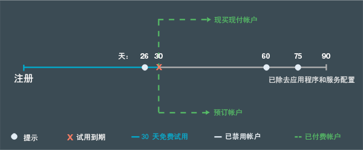

---

 

copyright:

  years: 2015, 2016

 

---

{:codeblock: .codeblock}
{:screen: .screen}
{:shortdesc: .shortdesc}
{:generic: data-hd-programlang="generic"}
{:java: data-hd-programlang="java"}
{:ruby: data-hd-programlang="ruby"}
{:c#: data-hd-programlang="c#"}
{:objectc data-hd-programlang="objectc"}
{:python: data-hd-programlang="python"}
{:javascript: data-hd-programlang="javascript"}
{:php: data-hd-programlang="php"}
{:swift: data-hd-programlang="swift"}
{:generic: data-hd-operatingsystem="generic"}
{:ios: data-hd-operatingsystem="ios"}
{:android: data-hd-operatingsystem="android"}
{:DomainName: data-hd-keyref="APPDomain"}
{:DomainName: data-hd-keyref="DomainName"}
{:app_name: data-hd-keyref="app_name"}
{:app_key: data-hd-keyref="app_key"}
{:app_secret: data-hd-keyref="app_secret"}
{:app_url: data-hd-keyref="app_url"}
{:org_name: data-hd-keyref="org_name"}
{:route: data-hd-keyref="route"}
{:space_name: data-hd-keyref="space_name"}
{:service_name: data-hd-keyref="service_name"}
{:service_instance_name: data-hd-keyref="service_instance_name"}
{:user_ID: data-hd-keyref="user_ID"}
{:subsection: outputclass="subsection"}
{:service: architecture="service"}
{:runtime: architecture="runtime"}
{:runtimeIconList: .runtimeIconList}
{:runtimeIcon: .runtimeIcon}
{:runtimeTitle: .runtimeTitle}
{:runtimeLink: .runtimeLink}
{:tsSymptoms: .tsSymptoms}
{:tsCauses: .tsCauses}
{:tsResolve: .tsResolve}

# 定价
{: #pricing}

*上次更新时间：2016 年 5 月 16 日*

您可以在 {{site.data.keyword.Bluemix}} 中运行应用程序，并免费试用 {{site.data.keyword.Bluemix_notm}} 服务。您可以注册以免费试用 30 天，试用期内可获得额外的限额，包括免费支持。30 天后，您可以选择帐户类型，而且只需要为超出免费限额的使用量付费。Bluemix 为您提供了成本计算器，可用于提前估算成本，还为您提供了“使用情况仪表板”视图，可用于在构建应用程序后检查实际成本。
{:shortdesc}

## 免费试用
{: #trial}
使用您的 {{site.data.keyword.Bluemix_notm}} 标识进行注册后，即可享受 30 天的免费试用。试用期间，您可以在 {{site.data.keyword.Bluemix_notm}} 上开发应用程序和使用服务。

免费为您的帐户提供以下资源：

* 最大值 2 GB 内存
* 10 个服务
* 1 个 SSL 证书

免费试用会在您注册后的 30 天到期。30 天试用到期后，您帐户中的应用程序将停止。您将无法在 {{site.data.keyword.Bluemix_notm}} 上注册获取另一次试用。然而，您仍可以访问您的帐户和您收到邀请的帐户。要重新启动应用程序，必须提供现买现付帐户的信用卡信息，或创建预订帐户。转换帐户之后，可以继续使用免费的计算和服务限额。您只需要为每月免费限额中不包括的服务、容器和运行时的使用量付费。

如果您的免费试用到期后未转换帐户，那么在试用到期后，会收到有关帐户状态的电子邮件通知。通知会提示您创建付费帐户，这样您的应用程序设置和配置不会丢失。如果您不想从 {{site.data.keyword.Bluemix_notm}} 收到这些通知，可以随时取消预订。试用到期后 1 个月，会除去您的应用程序和服务配置。下图显示 {{site.data.keyword.Bluemix_notm}} 帐户管理的一般流程。




*图 1. {{site.data.keyword.Bluemix_notm}} 帐户管理流程图*


如果您在免费试用期间转换您的帐户，那么免费限额限制为每个服务通常提供的限额。限额不再是免费试用期间许多 IBM 服务提供的不受限使用限额。


##成本
{: #what_it_costs}

费用根据特定服务、运行时、容器、虚拟服务器或支持选项所使用的资源而定。资源可以是 API 调用数、实例数、内存、存储器等。{{site.data.keyword.Bluemix_notm}} 还提供了详细的成本估算工具和精确到分的成本计算器，帮助您规划费用。您可以使用*使用情况仪表板*视图来检查构建应用程序后的实际成本。有关费用的更多详细信息，请参阅[收费方式](index.html#charges)。
 

##促销码
{: #promo}

有时，{{site.data.keyword.Bluemix_notm}} 销售人员或其他 {{site.data.keyword.Bluemix_notm}} 代表会为您提供促销码。通过应用促销码，可以获取 {{site.data.keyword.Bluemix_notm}} 为试用帐户提供的额外资源或功能。

资源或功能因特定代码而异，但可能包括以下一项或多项：

* 将内存配额增加至促销码所指定的 GB 数
* 添加一个组织（具有促销码所指定的内存配额）
* 添加无限数量的组织
* 上传促销码所指定的额外数量的 SSL 证书
* 使用高级服务套餐

**注：**可以将多个促销码应用到您的帐户。在促销码的到期日期之前，每个促销码只能兑换一次。要使用促销码，请在 {{site.data.keyword.Bluemix_notm}} 用户界面中单击**概要文件设置**图标，选择**帐户**，然后单击**帐户类型**。

##计费方式
{: #pay-accounts}

注册 {{site.data.keyword.Bluemix_notm}} 计费套餐时，可以选择以下帐户：
* 现买现付
* 预订
* {{site.data.keyword.Bluemix_notm}} Dedicated
* {{site.data.keyword.Bluemix_notm}} Local

使用现买现付帐户时，将根据您所使用的 {{site.data.keyword.Bluemix_notm}} 计算和服务来收费。使用预订帐户时，可享受基于每月最低花费承诺的每月折扣。{{site.data.keyword.Bluemix_notm}} Dedicated 和 {{site.data.keyword.Bluemix_notm}} Local 按一年期合同收费。

您可以随时将免费试用帐户转换为计费帐户。所有免费试用的非计费帐户信息和 {{site.data.keyword.Bluemix_notm}} 解决方案都将无缝合并到新的计费帐户中。

创建计费帐户后，您可以编辑所提供的信息。单击 {{site.data.keyword.Bluemix_notm}} 用户界面右上角的**概要文件设置**图标，然后单击**帐户 &gt; 帐户类型**来编辑您的信息。

如果在使用现买现付或预订帐户时遇到任何 {{site.data.keyword.Bluemix_notm}} 问题，请参阅[获取联机帮助](https://www.ng.bluemix.net/docs/troubleshoot/getting_customer_support.html#online_help)来了解更多信息。

###现买现付帐户
{: #pay-as-you-go}

如果注册现买现付帐户，那么只需要为您所使用的 {{site.data.keyword.Bluemix_notm}} 资源付费。您还有资格获取免费运行时和服务限额。

在许多国家或地区，都可以从 {{site.data.keyword.Bluemix_notm}} 用户界面注册现买现付帐户。单击**免费试用**图标，然后单击**确认您的免费帐户**并选择**选项 1**。输入您所在的国家或地区，然后单击**添加信用卡**来提供您的信用卡信息。在您提供帐单和信用卡信息，接受条款和条件并提交帐户请求之后，将验证您的信用卡。还会发送帐户信息的确认电子邮件。接收确认电子邮件之后的数分钟，您可以返回到 {{site.data.keyword.Bluemix_notm}}，以继续构建您的应用程序。如果 {{site.data.keyword.Bluemix_notm}} 无法处理您所在国家或地区的在线请求，那么您可以联系 {{site.data.keyword.Bluemix_notm}} 销售人员来注册您的现买现付帐户，联系销售人员的方法是使用 [Bluemix 联系我们](https://console.ng.bluemix.net/#/contactUs/cloudOEPaneId=contactUs)页面上列出的链接。

您可以随时将现买现付帐户转换为预订帐户。使用预订帐户时，需要承诺每月最低花费量。如果想要转换为预订帐户，请使用 [Bluemix 联系我们](https://console.ng.bluemix.net/#/contactUs/cloudOEPaneId=contactUs)页面上列出的链接来联系 {{site.data.keyword.Bluemix_notm}} 销售人员。

###预订帐户
{: #subscription}

如果注册预订帐户，那么需要承诺每月最低花费量，您可享受适用于该最低费用的预订折扣。此外，您需要为超出最小花费量的任何使用量付费。

要注册预订帐户以及了解有关预订费率和折扣的更多信息，必须使用 [Bluemix 联系我们](https://console.ng.bluemix.net/#/contactUs/cloudOEPaneId=contactUs)页面上列出的链接来联系 {{site.data.keyword.Bluemix_notm}} 销售人员。

###{{site.data.keyword.Bluemix_notm}} Dedicated 帐户
{: #dedicated}

{{site.data.keyword.Bluemix_notm}} 需要以下项的至少一年使用期限：

* 连回基础架构的 VPN 连接
* SoftLayer 数据中心内完全冗余的环境
* 所有受支持的运行时（IBM Java Liberty、Node.js 和内置开放式源代码运行时）
* 所有您选择的专用服务以及所有公共 {{site.data.keyword.Bluemix_notm}} 服务
* 标准 {{site.data.keyword.Bluemix_notm}} 支持

您还可订购可选项（例如，SoftLayer DirectLink）或高级支持选项。有关更多信息，请与 [Bluemix 销售人员](https://console.ng.bluemix.net/?direct=classic/#/contactUs/cloudOEPaneId=contactUs)联系。

使用 {{site.data.keyword.Bluemix_notm}} Dedicated 时，必须至少注册为期一年的使用期限。在该期限内，您每月所支付的费用取决于所需的专用服务以及预订帐户（通过该帐户，您可以访问所有公共服务）。{{site.data.keyword.Bluemix_notm}} Public 中服务的使用量费用按照您的预订帐户协议进行计算。如果使用了超过该预订协议的服务，那么您会收到相应发票。请联系 IBM 指定的客户代表或联系 [Bluemix 销售人员](https://console.ng.bluemix.net/#/contactUs/cloudOEPaneId=contactUs)来着手处理您的协议。


###{{site.data.keyword.Bluemix_notm}} Local 帐户
{: #local}

{{site.data.keyword.Bluemix_notm}} 需要以下项的至少一年使用期限：

* 一项称为“中继”的交付功能，它能够使 IBM 连接到您的本地部署，并以一致的方式自动交付更新
* 所有受支持的运行时（IBM Java Liberty、Node.js 和内置开放式源代码运行时）
* 所有您选择的本地服务以及所有公共 {{site.data.keyword.Bluemix_notm}} 服务的访问权
* 标准 {{site.data.keyword.Bluemix_notm}} 支持

使用 {{site.data.keyword.Bluemix_notm}} Local 时，必须至少注册为期一年的使用期限。在该期限内，您每月所支付的费用取决于所需的本地服务以及预订帐户（通过该帐户，您可以访问所有公共服务）。{{site.data.keyword.Bluemix_notm}} Public 中服务的使用量费用按照您的预订帐户协议进行计算。如果使用了超过该预订协议的服务，那么您会收到相应发票。请联系 IBM 指定的客户代表或联系 [{{site.data.keyword.Bluemix_notm}} 销售人员](https://console.ng.bluemix.net/#/contactUs/cloudOEPaneId=contactUs)来着手处理您的协议。

##收费方式
{: #charges}

使用 {{site.data.keyword.Bluemix_notm}} 计费帐户时，会针对您组织中使用的计算、容器和服务向您收费。其他 {{site.data.keyword.Bluemix_notm}} 用户可能会邀请您以其他帐户参与组织。如果您在邀请您参与的组织中创建应用程序或使用服务，那么会对包含这些组织的帐户中发生的使用量收费。要查看有关特定费用的更多信息，请转至 {{site.data.keyword.Bluemix_notm}}“目录”中的资源详细信息页面，或者 {{site.data.keyword.Bluemix_notm}}“定价”页面上的价格计算器。

所应用的费用类型会有所不同，具体取决于您所使用的 {{site.data.keyword.Bluemix_notm}} 功能。下表提供了高层次的概述：

| 费用类型 | 描述 | 使用此费用类型的 {{site.data.keyword.Bluemix_notm}} 功能 | 示例 |
|------------------|------------------|--------------------------|--------------------------|
| 固定 | 固定费率定价基于约定的每月费用，此费用不可调整。 | 服务  | Data Cache 具有按每月固定费率收费的固定套餐。 |
| 计量 | 按使用量计量的定价基于运行时的所使用 GB-小时数以及容器的所使用 GB-小时数和 IP 地址数及存储量。 | 服务、计算和容器 | 对于 Push 服务，会对超出每月免费限额的任何使用量收费。 |
|  分层   |  某些定价套餐基于分层定价模型，会根据您的实际使用量为您提供数量折扣。服务可能会提供简单层、累进层或包量层定价套餐。 | 服务 | 分层定价通常用于每月数量预计会非常高的费用度量值，例如 API 调用数。 |
| 保留 | 保留定价基于服务的长期承诺，会为您提供折扣价格。使用保留套餐时，您会得到一个易于在公共 {{site.data.keyword.Bluemix_notm}} 环境中设置、部署和交付的专用服务实例。 | 服务 | DB2 on Cloud 具有保留套餐。|

###计算资源的费用
{: #compute}

对您应用程序运行的时间和使用的内存收费，计算方式为 *GB-小时*。GB-小时的计算方式为应用程序实例数乘以每个实例的内存量，再乘以实例运行的小时数。您可以根据需求定制实例数以及每个实例的内存量。您还可以添加内存或实例以针对更多用户进行扩展。最终费用按每 GB-小时：您的应用程序实例数乘以每个实例的内存，再乘以运行的小时数。

例如，假设一个运行时在两个 512 MB 实例中运行 30 天（720 个小时），每 GB-小时的开销为 0.07 美元。这些资源的成本为 24.15 美元，包括 375 GB-小时的免费限额，计算方式如下： 

```
2 个实例 x 0.5 GB x 720 小时 = 720 GB-小时。(720 - 375) GB-小时 x 每 GB-小时 0.07 美元 = 24.15 美元```

###服务的费用
{: #services}

许多服务包括每月的免费限额。免费限额未包括的服务的使用量通过以下某个方式收费：
<dl>
<dt>固定费用</dt>
    <dd>选择一个套餐并依据统一费率付费。例如，Data Cache 服务按固定费率收费。</dd>
<dt>计量费用</dt>
    <dd>根据运行时和服务的使用量付费。例如，通过使用 Push 服务，对超出每月免费限额的任何使用量收费。</dd>
<dt>保留费用</dt>
    <dd><p>作为现买现付帐户或预订帐户的帐户所有者，您可以保留服务实例，享受基于长期承诺的折扣价格。例如，可以将标准大型 DB2 on Cloud 产品保留 12 个月。</p> 
    <p>某些 {{site.data.keyword.Bluemix_notm}} 服务提供保留套餐。您可以在 {{site.data.keyword.Bluemix_notm}} <strong>目录</strong>中通过单击服务磁贴来请求保留套餐。然后，选择最适合您需求的服务套餐。如果保留套餐可用，请单击<strong>请求</strong>，然后遵循提示发送请求。您将收到一封电子邮件，其中包含保留套餐的价格信息。{{site.data.keyword.Bluemix_notm}} 销售代表也会尽快与您联系，以便完成购买。</p></dd>
<dt>分层费用</dt>
    <dd>与计量费用类似，分层费用也是根据运行时和服务的使用量付费。不同的是，分层费用会添加额外的定价层，通常在使用量较大的层中提供折扣费用。分层定价以简单层、累进层或包量层形式提供。</dd>
</dl>


####简单层
{: #simple_tier}

在简单层模型中，单价由使用量所属的层来决定。总价等于使用量乘以该层的单价。例如：

| 项数 | 所有项的单价 |
|-------------------|--------------------------|
| 第 1 层：1 - 1000  | 1 美元                   |
| 第 2 层：1001 - 2000    |    0.90 美元                      |
| 第 3 层：2001 - 3000                  |   0.75 美元                       |
| 第 4 层：3001 - 4000           |      0.60 美元                    |
|第 5 层：大于 4000 | 0.40 美元 | 

*表 1. 简单层价格表*

下表说明了使用基于简单层定价模型的套餐要支付的费用：

| 项数 | 费用计算 | 总价 |
|-------------------|--------------------|-------------|
|500 |	500 × 1 = 500 |	500 美元|
|1500 |	1500 × 0.90 = 1350 |	1350 美元|
|2500 |	2500 × 0.75 = 1875 |	1875 美元|
|... |	... |	...|
|5200 |	5200 × 0.40 = 2080 |2080 美元|
*表 2. 使用简单层定价模型的费用计算*

####累进层
{: #graduated_tier}

在累进层模型中，每层的单价随着使用量级别的上升而下降。总价是每级使用量的累计费用，每级使用量的费用等于使用量乘以该层的单价。例如：

| 项数 |	层中项的单价|
|-------------------|------------------------------------|
|    第 1 层：1 - 1000 |	1 美元 |
|   第 2 层：1001 - 2000 |	0.90 美元 |
|    第 3 层：2001 - 3000 |	0.75 美元 |
|    第 4 层：3001 - 4000 |	0.60 美元 |
|    第 5 层：大于 4000 |	0.40 美元 |
*表 3. 累进层价格表*

下表说明了使用基于累进层定价模型的套餐要支付的费用：

|项数 | 费用计算 | 总价|
|------------------|--------------------|------------|
|500 |	500 × 1（第 1 层的单价）= 500 |	500 美元|
|1500 |	(1000 × 1 (第 1 层的单价)) + (500 × 0.90 (第 2 层的单价)) = 1450 |	1450 美元|
|2500 |	(1000 × 1 (第 1 层的单价)) + (1000 × 0.90 (第 2 层的单价)) + (500 × 0.75 (第 3 层的单价)) = 2275 |	2275 美元 |
|... |	... |	...|
|5200 |	(1000 × 1 (第 1 层的单价)) + (1000 × 0.90 (第 2 层的单价)) + (1000 × 0.75 (第 3 层的单价)) + (1000 × 0.60 (第 4 层的单价)) + (1200 × 0.40 (第 5 层的单价)) = 3730 |	3730 美元|
*表 4. 使用累进层定价模型的费用计算*

####包量层
{: #block_tier}

在包量层模型中，对于在使用量级别范围内的使用量，价格是固定费用。总价等于使用量级别的费用（无论实际使用量是多少）。后续每一层的价格与数量比率都比前一层低。例如：

|项数 |	所有项的总价|
|------------------|-----------------------------|
| 第 1 层：小于等于 1000 |	1000 美元|
| 第 2 层：小于等于 2000 |	1900 美元|
| 第 3 层：小于等于 3000 |	2800 美元|
| 第 4 层：小于等于 4000 |	3500 美元|
| 第 5 层：小于等于 10000 |	5000 美元|
*表 5. 包量层价格表*

下表说明了使用基于包量层定价模型的套餐要支付的费用：

|项数 |	费用计算 |	总价|
|------------------|-----------------------|---------------|
|500 |	项数属于第 1 层，所以总价是 1000 美元。 |	1000 美元|
|1500 |	项数属于第 2 层，所以总价是 1900 美元。 |	1900 美元|
|... |	... |	...|
|5200 |	项数属于第 5 层，所以总价是 5000 美元。 |	5000 美元|
*表 6. 使用包量层定价模型的费用计算*

### 虚拟服务器的免费限额
{: #vms}

您可以免费使用 IBM 公共云中的 {{site.data.keyword.Bluemix_notm}} 虚拟服务器作为 beta 功能部件。为以下项提供了免费限额：您可创建的虚拟服务器映像数、分配的 IP 地址数以及可使用的内存量。

以下项是 {{site.data.keyword.Bluemix_notm}} 虚拟服务器 beta 的免费限额：

* 8 个实例
* 8 个虚拟 CPU
* 12 GB 内存
* 200 GB 块存储器
* 4 个公共 IP 地址

此外，还可以使用虚拟服务器基础架构在您的 {{site.data.keyword.Bluemix_notm}} 私有云中供应虚拟服务器，具体仅受您私有云的限制和配额影响。


##成本估算方法
{: #cost}

您可以使用不同的方法来了解通过 {{site.data.keyword.Bluemix_notm}} 构建和托管应用程序所需的费用。

* {{site.data.keyword.Bluemix_notm}}“定价”页面上的成本估算工具根据您应用程序的大小来提供粗略的成本估算。
* {{site.data.keyword.Bluemix_notm}}“定价”页面上的成本计算器根据您输入的运行时和服务使用量来提供准确的应用程序价格。
* 您还可以手动计算成本。

###使用成本计算器
{: #calculator}

您可以通过使用 {{site.data.keyword.Bluemix_notm}} 提供的成本计算器，对应用程序进行快速定价。

1. 转至 {{site.data.keyword.Bluemix_notm}} [ 定价页面](https://console.{DomainName}/pricing/)。 
2. 使用其中一个**成本估算**窗口小部件，或者单击**打开计算器**以使用**定价计算器（精确到分）**。

要使用该计算器，请键入所列资源的每月计划使用量；例如，实例数或推送通知数。单击**每月的使用情况**字段，以获取有关字段中预期的单元的提示。计算器会针对您的输入立即显示价格。您还可以调整计算器，以显示每年成本，而不是每月成本。

###手动计算成本
{: #manual}

您可能想要自己估算 {{site.data.keyword.Bluemix_notm}} 成本，或更好地理解 {{site.data.keyword.Bluemix_notm}} 成本的计算方式。您可以考虑运行时和它使用的服务的价格，计算使用 {{site.data.keyword.Bluemix_notm}} 构建和托管应用程序的总价格。由于运行时和服务的价格有时会更改，因此在计算总价格时必须参考 {{site.data.keyword.Bluemix_notm}} 价格表上的最新信息。

###示例：对样本应用程序定价
{: #sample}

假设，您拥有 Node.js Web 应用程序（其具有可扩展功能）且应用程序使用 {{site.data.keyword.Bluemix_notm}} 提供的数个服务。您可以了解此示例中如何计算应用程序的实际成本。Web 应用程序使用以下 {{site.data.keyword.Bluemix_notm}} 服务和项：

* 四个 256 MB Node.js 运行时实例
* 两个 {{site.data.keyword.autoscaling}} 策略、处理器和内存
* 每月 2 GB（针对 {{site.data.keyword.datacshort}}）
* NoSQL 数据库每月 150 GB、100,000 个频繁 API 调用和 500,000 个稀少 API 调用
* 每月 8 GB（针对 {{site.data.keyword.sqldb}} Database）
* 20 GB 入站或出站网络流量

###{{site.data.keyword.Bluemix_notm}} 资源的价格
{: #sample_resources}

为简化示例，假设下表中的价格在某个时间范围（例如，一个月）内不波动。此示例中的所有定价使用美元。

|服务 |	功能 |	价格 |
|--------|-----------|--------|
|SDK for Node.js |	每月 375 GB-小时可用（在所有运行时共享） |	0.07 美元/GB-小时|
|Auto-Scaling |	Auto-Scaling 服务的免费服务套餐 |	免费|
|Data Cache - 入门级 |	1 GB 高速缓存空间和副本 |	55.00 美元/实例 |
|Data Cache - 标准 |	5 GB 高速缓存空间和副本 |	155.00 美元/实例 |
|Data Cache - 高级 |	25 GB 高速缓存空间和副本 |	505.00 美元/实例|
|IBM Cloudant® NoSQL DB for {{site.data.keyword.Bluemix_notm}} |	2 GB 免费数据存储<br/>50,000 个免费稀少 API 调用/月<br/>10,000 个免费频繁 API 调用/月 | 1.00 美元/GB<br/>0.03 美元/1000 个稀少 API 调用<br/>0.15 美元/1000 个频繁 API 调用 |
|SQL Database 	| 免费 2 GB/实例<br/>最多 10 GB/实例 |	30.00 美元/实例 |
*表 7. 价格表*

###计算应用程序价格

可以使用以下方式来计算应用程序的价格：

<dl>
<dt>四个 256 MB Node.js 运行时实例</dt>
<dd>Bluemix 对运行时按 GB-小时收费。每月使用的 GB 数是 <code>4 x 256 = 1024 MB 或 1 GB/月</code>。假设<code>一个月有 24 x 30 = 720 小时</code>，那么应用程序按 <code>1 x 720 = 720 GB-小时</code>收费。<p>
375 GB-小时包括在每月免费限额中，在所有 {{site.data.keyword.Bluemix_notm}} 运行时共享。因此，运行时的总成本为 <code>0.07 美元 x (720-375) = 24.15 美元</code>。</p></dd>

<dt>两个 Auto-Scaling 策略（处理器和内存）</dt>
<dd>Auto-Scaling 策略免费。</dd>

<dt>每月 2 GB（针对 Data Cache）</dt>
<dd>Data Cache 服务提供的 50 MB 套餐免费。然而，免费套餐可能难以满足您每月计划使用的 2 GB。Data Cache 的 3 个付费套餐都是以固定金额购买特定的空间量，而不管您实际使用的空间量是多少。因此，您希望选择符合您计划使用量（标准套餐为 5 GB）的最低限度套餐。每月总开销为 155 美元。</dd>

<dt>NoSQL 数据库每月 150 GB</dt>
<dd>IBM Cloudant NoSQL DB for {{site.data.keyword.Bluemix_notm}} 服务费用基于数据存储和按不同 API 方法访问该数据的能力。<strong>PUT</strong> 和 <strong>POST</strong> 命令被视为频繁 API 调用，但 <strong>GET</strong> 命令被视为稀少 API 调用。<p>
加总 GB 数并减去 2 GB 免费限额。每月对 148 GB 收费。减去 50,000 稀少 API 调用和 10,000 频繁 API 调用的免费限额。存储价格总计包括以下部分：</p>
<pre class="codeblock">
<codeblock>
    148 x 1 = 148 美元
    (450,000 / 1000) x 0.03 = 13.5 美元
    (90,000 / 1000) x 0.15 = 13.5 美元
</codeblock>
</pre>
<p>
总价格为 148 + 13.5 + 13.5 = 175 美元。</p></dd>

<dt>每月 8 GB（针对 SQL Database）</dt>
<dd>每个实例的总价格为 30 美元。</dd>

<dt>20 GB 入站或出站网络流量</dt>
<dd>入站和出站网络流量免费。</dd>

</dl>

加总所有项时，应用程序的总价格为 384.15 美元。

##使用情况仪表板
{: #usage}

作为帐户所有者或记帐管理员，您可通过“使用情况仪表板”视图来查看贵组织中每月使用的运行时和服务的实时费用。您可以查看所有区域中的运行时 GB-小时和服务使用量，也可选择查看过去 12 个月的特定区域和空间。

要打开“使用情况仪表板”视图，请单击**帐户和支持**图标 &gt; **帐户** &gt; *your_account_name* &gt; **使用情况仪表板**。在此视图中，您可以查看帐户的运行时和服务使用情况的摘要。记帐管理员只能查看其作为记帐管理员的组织的详细信息。

在每个记帐周期结束时，将向帐户所有者收取所有组织中发生的总使用量费用。每个记帐周期持续一个月。

帐户所有者可以按区域和组织过滤使用情况摘要。如果您是帐户所有者，将**组织**设置为**所有组织**，即可查看整个帐户 12 个月的使用情况。单击特定的月份可查看该月的使用情况。所显示的费用表示该月对您（即帐户所有者）记帐的金额。

如果在**组织**中选择了特定组织，那么会看到该组织的总使用量，包括免费层中的任何使用量。所显示的该组织的费用不是对您记帐的费用。免费层使用量在帐户级别显示为免费，但在组织级别不会显示为免费。因此，查看组织使用量时，会看到该组织的实际使用量，包括免费使用量和收费使用量。除去免费层后，所有组织使用量都会累积到帐户使用量上。

##通知
{: #notifications}

作为现买现付帐户的帐户管理员，您可以针对运行时和服务以及针对单个服务（排除第三方服务）按帐户总成本设置花费通知。在达到所指定花费阈值的 80%、90% 和 100% 时，您会收到通知。

要打开**通知**视图，请单击**帐户和支持**图标 &gt; **帐户** &gt; *your_account_name* &gt; **花费通知**。输入数字值，以根据需要为每种类型的花费通知设置用于触发通知的花费阈值。还可以添加和删除针对个人服务的通知。

##套餐更改方法
{: #changing}

您可以在 {{site.data.keyword.Bluemix_notm}} 的服务“仪表板”中更改服务套餐，前提是该服务支持套餐更改。

只有特定服务才提供更改服务套餐的功能。如果服务支持套餐更改，那么服务“仪表板”的左侧导航中会显示**套餐**选项。每个服务在套餐更改后都有一组不同的后续步骤要执行。

1. 要更改套餐，请在服务“仪表板”中单击**套餐**。通常，可以升级套餐或降级套餐。
2. 更改套餐后，必须完成一组后续步骤。步骤根据套餐更改和服务的类型而有所不同。例如，如果降级了套餐，那么可能需要重新编译打包应用程序。或者，如果升级了套餐，那么可能需要重新编译打包应用程序以及执行其他操作。<br/><br/>要重新编译打包应用程序，请转至 {{site.data.keyword.Bluemix_notm}}“仪表板”，然后找到与服务绑定的应用程序。在应用程序菜单中，选择**重新启动应用程序**。<br/><br/>其他后续步骤操作根据服务而定。请参阅下表以了解具体的操作。

|服务 |	信息|
|--------|-------------|
|Presence Insights 	|如果您拥有 Lite 套餐，但已超过免费限额，那么会显示或记录 403 消息，指示您不再有权使用，且您的服务实例已禁用。此外，还会拒绝 POST REST API 调用，并返回 403 响应。<br/><br/>如果服务是因为超过免费限额而禁用，那么可以从 Lite 套餐升级到付费套餐。您的服务会在两小时内重新启用。<br/><br/>如果您拥有付费套餐，那么可以将套餐降级到 Lite 套餐，只要您的使用量未超出事件和总存储量的 Lite 套餐限额即可。<br/><br/>升级或降级套餐时，无需重新编译打包或重新启动应用程序。|
*表 8. 更改套餐的后续步骤*

###通过命令行界面更改套餐

（可选）您可以通过命令行界面来更改服务套餐。要更新服务套餐，请输入以下命令：```
cf update-service <service_name> [-p <new_plan>]```
# 相关链接
## 常规 
* [{{site.data.keyword.Bluemix_notm}} 价格表](https://console.{DomainName}/pricing/)
* [{{site.data.keyword.Bluemix_notm}} 开发者社区论坛](https://developer.ibm.com/bluemix/)
* [获取联机帮助](https://www.{DomainName}/docs/troubleshoot/getting_customer_support.html#online_help)
* [联系我们](https://console.{DomainName}/#/contactUs/cloudOEPaneId=contactUs)
