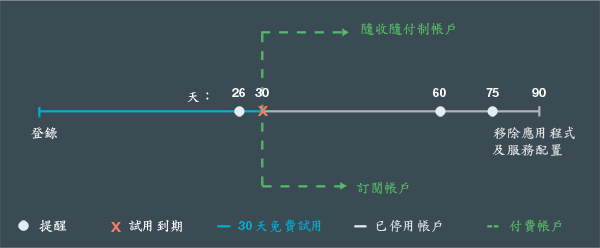

---

 

copyright:

  years: 2015, 2016

 

---

{:codeblock: .codeblock}
{:screen: .screen}
{:shortdesc: .shortdesc}
{:generic: data-hd-programlang="generic"}
{:java: data-hd-programlang="java"}
{:ruby: data-hd-programlang="ruby"}
{:c#: data-hd-programlang="c#"}
{:objectc data-hd-programlang="objectc"}
{:python: data-hd-programlang="python"}
{:javascript: data-hd-programlang="javascript"}
{:php: data-hd-programlang="php"}
{:swift: data-hd-programlang="swift"}
{:generic: data-hd-operatingsystem="generic"}
{:ios: data-hd-operatingsystem="ios"}
{:android: data-hd-operatingsystem="android"}
{:DomainName: data-hd-keyref="APPDomain"}
{:DomainName: data-hd-keyref="DomainName"}
{:app_name: data-hd-keyref="app_name"}
{:app_key: data-hd-keyref="app_key"}
{:app_secret: data-hd-keyref="app_secret"}
{:app_url: data-hd-keyref="app_url"}
{:org_name: data-hd-keyref="org_name"}
{:route: data-hd-keyref="route"}
{:space_name: data-hd-keyref="space_name"}
{:service_name: data-hd-keyref="service_name"}
{:service_instance_name: data-hd-keyref="service_instance_name"}
{:user_ID: data-hd-keyref="user_ID"}
{:subsection: outputclass="subsection"}
{:service: architecture="service"}
{:runtime: architecture="runtime"}
{:runtimeIconList: .runtimeIconList}
{:runtimeIcon: .runtimeIcon}
{:runtimeTitle: .runtimeTitle}
{:runtimeLink: .runtimeLink}
{:tsSymptoms: .tsSymptoms}
{:tsCauses: .tsCauses}
{:tsResolve: .tsResolve}

# 定價
{: #pricing}

*前次更新：2016 年 5 月 16 日*

您可以免費執行 {{site.data.keyword.Bluemix}} 中的應用程式，以及試用 {{site.data.keyword.Bluemix_notm}} 服務。您可以註冊 30 天免費試用，此免費試用提供更多的額度（包括免費支援）。30 天之後，您可以選擇帳戶類型，並且只需要為您使用超過免費額度的部分進行付款。Bluemix 提供成本計算機讓您事先預估成本，以及提供「使用情形儀表板」視圖讓您檢查建置應用程式之後的實際成本。
{:shortdesc}

## 免費試用
{: #trial}
使用您的 {{site.data.keyword.Bluemix_notm}} ID 進行註冊後，即可享受 30 天的免費試用。在試用期間，您可以在 {{site.data.keyword.Bluemix_notm}} 上開發應用程式並且使用服務。

您的帳戶免費具有下列資源：

* 2 GB 記憶體上限
* 10 個服務
* 1 個 SSL 憑證

您的免費試用會在註冊 30 天之後到期。30 天試用到期之後，您帳戶中的應用程式即會停止。您將無法在 {{site.data.keyword.Bluemix_notm}} 上註冊另一次試用。
不過，您還是可以存取帳戶，以及您受邀使用的其他帳戶。若要重新啟動應用程式，您必須為「隨收隨付制」帳戶提供信用卡資訊，或建立一個「訂閱」帳戶。在轉換帳戶之後，就可以繼續使用免費的運算及服務額度。您只需要針對未包括在每月免費額度中的服務、儲存器及執行時期的使用進行付款。

如果您未在免費試用到期之後轉換帳戶，則會在試用到期後收到關於帳戶狀態的電子郵件通知。通知會提醒您建立付款帳戶，因此，將不會遺失應用程式設定及配置。如果您不想從 {{site.data.keyword.Bluemix_notm}} 收到這些通知，可以隨時取消訂閱。
在試用到期的一個月之後，會移除您的應用程式及服務配置。下圖顯示 {{site.data.keyword.Bluemix_notm}} 帳戶管理的一般處理程序。




*圖 1. {{site.data.keyword.Bluemix_notm}} 帳戶管理的處理程序流程圖*


如果您在免費試用期間轉換帳戶，則會將免費額度限制為一般由每一個服務所提供的額度。額度不再是許多 IBM 服務在免費試用期間所提供的無限制使用額度。


##成本
{: #what_it_costs}

費用取決於特定服務、執行時期、儲存器、虛擬伺服器或支援選項所使用的資源。資源可以是 API 呼叫數目、實例數、記憶體、儲存體等。{{site.data.keyword.Bluemix_notm}} 也提供詳細成本預估器，以及計算到分的成本計算機來協助您規劃費用。使用*使用情形儀表板* 視圖建置應用程式之後，即可檢查實際成本。如需費用的其他詳細資訊，請參閱[收費方式](index.html#charges)。
 

##促銷代碼
{: #promo}

有時，{{site.data.keyword.Bluemix_notm}} 業務代表或其他 {{site.data.keyword.Bluemix_notm}} 業務代表會提供促銷代碼。藉由套用促銷代碼，您可以為您的試用帳戶取得 {{site.data.keyword.Bluemix_notm}} 所提供的額外資源或功能。


資源或功能會視特定代碼而改變，但可能包含下列其中一個以上的項目：


* 將記憶體配額提高到促銷代碼指定的 GB 數
* 新增一個組織，並使用促銷代碼指定的記憶體配額
* 新增數目無限制的組織
* 上傳促銷代碼指定的額外數目 SSL 憑證
* 使用高階服務方案

**附註：**您可以套用多個促銷代碼到您的帳戶。每個促銷代碼只能在代碼到期日之前兌換一次。若要使用促銷代碼，請在 {{site.data.keyword.Bluemix_notm}} 使用者介面中按一下**設定檔設定**圖示，選取**帳戶**，然後按一下**帳戶類型**。

##計費方式
{: #pay-accounts}

註冊 {{site.data.keyword.Bluemix_notm}} 可入帳方案時，可以選取下列帳戶：
* 隨收隨付制
* 訂閱
* {{site.data.keyword.Bluemix_notm}} 專用
* {{site.data.keyword.Bluemix_notm}} 本端

使用「隨收隨付制」帳戶，會根據 {{site.data.keyword.Bluemix_notm}} 運算及服務的使用向您收費。使用「訂閱」帳戶，您可以根據最低的每月消費承諾來取得每月折扣。「{{site.data.keyword.Bluemix_notm}} 專用」及「{{site.data.keyword.Bluemix_notm}} 本端」是根據年度合約收費。

您隨時都可以將免費試用轉換為可入帳帳戶。所有免費試用不可入帳帳戶資訊及 {{site.data.keyword.Bluemix_notm}} 解決方案都會密切地合併至新的可入帳帳戶。

建立可入帳帳戶之後，您可以編輯您提供的資訊。按一下 {{site.data.keyword.Bluemix_notm}} 使用者介面右上角的**設定檔設定**圖示，然後按一下**帳戶 &gt; 帳戶類型**即可編輯資訊。

如果在使用「隨收隨付制」或「訂閱」帳戶時遇到任何 {{site.data.keyword.Bluemix_notm}} 問題，請參閱[取得線上說明](https://www.ng.bluemix.net/docs/troubleshoot/getting_customer_support.html#online_help)以取得相關資訊。

###隨收隨付制帳戶
{: #pay-as-you-go}

如果您註冊「隨收隨付制」帳戶，則只會針對所使用的 {{site.data.keyword.Bluemix_notm}} 資源付費。您也有資格使用免費執行時期及服務額度。


在許多國家或地區中，您可以從 {{site.data.keyword.Bluemix_notm}} 使用者介面註冊「隨收隨付制」帳戶。按一下**免費試用**圖示，然後按一下**確認您的免費帳戶**並選取**選項 1**。輸入您所在的國家或地區，然後按一下**新增信用卡**來提供您的信用卡資訊。提供計費及信用卡資訊、接受條款並提交帳戶要求之後，將會驗證您的信用卡。此外也會傳送帳戶資訊的確認電子郵件。等收到確認電子郵件過後幾分鐘，您就可以回到 {{site.data.keyword.Bluemix_notm}} 繼續建置應用程式。如果 {{site.data.keyword.Bluemix_notm}} 無法處理您所在國家或地區的線上申請，您可以聯絡 {{site.data.keyword.Bluemix_notm}} 銷售人員來註冊您的「隨收隨付制」帳戶，聯絡銷售人員的方法是使用 [Bluemix 與我們聯絡](https://console.ng.bluemix.net/#/contactUs/cloudOEPaneId=contactUs)頁面上列出的鏈結。

您隨時都可以將「隨收隨付制」帳戶轉換為「訂閱」帳戶。使用「訂閱」帳戶，您承諾每個月花費一筆最低金額。如果您要轉換為「訂閱」帳戶，請利用 [Bluemix 與我們聯絡](https://console.ng.bluemix.net/#/contactUs/cloudOEPaneId=contactUs)頁面上列出的鏈結，與 {{site.data.keyword.Bluemix_notm}} 業務代表聯絡。

###訂閱帳戶
{: #subscription}

如果您註冊「訂閱」帳戶，即承諾每個月的最低消費金額，並獲得套用至該最低收費的訂閱折扣。您也會針對任何超出最低消費金額的使用付款。


若要註冊「訂閱」帳戶，以及取得訂閱費率及折扣的相關資訊，您必須利用 [Bluemix 與我們聯絡](https://console.ng.bluemix.net/#/contactUs/cloudOEPaneId=contactUs)頁面上列出的鏈結，與 {{site.data.keyword.Bluemix_notm}} 業務代表聯絡。

###{{site.data.keyword.Bluemix_notm}} 專用帳戶
{: #dedicated}

{{site.data.keyword.Bluemix_notm}} 需要最少一年期限，其包括：

* 回到您基礎架構的 VPN 連線功能
* SoftLayer 資料中心內的完整備用環境
* 所有支援的執行時期（IBM Java Liberty、Node.js 及內建開放程式碼執行時期）
* 您選取的所有專用服務及所有公用 {{site.data.keyword.Bluemix_notm}} 服務
* 標準 {{site.data.keyword.Bluemix_notm}} 支援

您也可以訂購選購項目（例如 SoftLayer DirectLink 或高品質支援選項）。如需相關資訊，請與 [Bluemix 業務](https://console.ng.bluemix.net/?direct=classic/#/contactUs/cloudOEPaneId=contactUs)聯絡。

使用「{{site.data.keyword.Bluemix_notm}} 專用」，您必須註冊至少一年期限。您在該期間每個月所支付的金額是根據您想要的專用服務，加上讓您存取所有公用服務的訂閱帳戶。「{{site.data.keyword.Bluemix_notm}} 公用」中的服務使用費用是根據您的訂閱帳戶合約來計算。您會收到關於任何超出訂閱合約之使用服務的發票。請與 IBM 指定客戶業務代表聯絡，或與 [Bluemix 業務](https://console.ng.bluemix.net/#/contactUs/cloudOEPaneId=contactUs)聯絡，以開始您的合約。


###{{site.data.keyword.Bluemix_notm}} 本端帳戶
{: #local}

{{site.data.keyword.Bluemix_notm}} 需要最少一年期限，其包括：

* 稱為轉遞的交付功能，讓 IBM 能連接您的本端部署，並自動且一致地交付更新
* 所有支援的執行時期（IBM Java Liberty、Node.js 及內建開放程式碼執行時期）
* 您選取的所有本端服務，及所有公用 {{site.data.keyword.Bluemix_notm}} 服務的存取
* 標準 {{site.data.keyword.Bluemix_notm}} 支援

使用「{{site.data.keyword.Bluemix_notm}} 本端」，您必須註冊至少一年期限。您在該期間每個月所支付的金額是根據您想要的本端服務，加上讓您存取所有公用服務的訂閱帳戶。「{{site.data.keyword.Bluemix_notm}} 公用」中的服務使用費用是根據您的訂閱帳戶合約來計算。您會收到關於任何超出訂閱合約之使用服務的發票。請與 IBM 指定業務代表聯絡，或與 [{{site.data.keyword.Bluemix_notm}} 業務代表](https://console.ng.bluemix.net/#/contactUs/cloudOEPaneId=contactUs)聯絡，以開始您的合約。

##收費方式
{: #charges}

使用 {{site.data.keyword.Bluemix_notm}} 可入帳帳戶，會依照貴組織中使用的運算、儲存器及服務向您收費。其他 {{site.data.keyword.Bluemix_notm}} 使用者可能會邀請您參與不同帳戶下的組織。如果您在受邀加入的組織中建立應用程式或使用服務，則會向包含那些組織的帳戶收取發生的使用費用。在 {{site.data.keyword.Bluemix_notm}}「型錄」的資源詳細資料頁面上，或 {{site.data.keyword.Bluemix_notm}}「定價」頁面的價格計算機上，您可以查看特定費用的相關資訊。

根據所使用的 {{site.data.keyword.Bluemix_notm}} 特性收取不同類型的費用。下表提供進階概觀：

| 費用類型 | 說明 | 使用此費用類型的 {{site.data.keyword.Bluemix_notm}} 特性 | 範例 |
|------------------|------------------|--------------------------|--------------------------|
| 固定 | 固定費率定價是根據未調整的協議每月費用。 | 服務  | Data Cache 具有依固定每月費率收費的固定方案。 |
| 計量 | 計量使用情形定價是根據針對執行時期所取用的 GB-小時數，以及根據針對儲存器所取用的 GB-小時數以及 IP 位址數目和儲存體數量。 | 服務、運算及儲存器 | 對於 Push 服務，會收取超出每月免費額度的使用費用。 |
|  分層   |  部分定價方案是根據分層定價模型，因此，您可以根據實際使用情形來獲得數量折扣。服務可能會提供簡式層級、提升層級或區塊層級的定價方案。 | 服務 | 分層定價一般用於預期每個月都會有極高數量的費用度量值，例如 API 呼叫。 |
| 保留 | 保留定價是根據服務的長期承諾，因此，您可以取得折扣價格。使用保留方案，您可以取得容易在公用 {{site.data.keyword.Bluemix_notm}} 環境中設定、部署及交付的專用服務實例。 | 服務 | DB2 on Cloud 具有保留方案。|

###運算資源費用
{: #compute}

針對應用程式所執行的時間以及使用的記憶體，會向您收費（計算單位為 *GB-小時*）。GB-小時計算如下：應用程式實例數目乘上每個實例的記憶體，再乘上實例所執行的時數。您可以根據需要來自訂實例數以及每個實例的記憶體數量。您也可以針對更多使用者新增記憶體或實例，以進行擴充。最終費用是根據 GB-小時：應用程式實例（乘上每個實例的記憶體，再乘上執行中時數）。

例如，請考量兩個 512 MB 實例中每個 GB-小時的成本為 $0.07 的執行時期，執行時間為 30 天（720 小時）。使用下列計算，這些資源的成本為 $24.15 USD（包括免費額度 375 GB-小時）： 

```
2 個實例 x 0.5 GB x 720 小時 = 720 GB-小時。
(720 - 375) GB-小時 x 每個 GB-小時 $0.07 = $24.15
```

###服務的費用
{: #services}

許多服務都包括每月免費額度。未包括為免費額度一部分的服務的使用，是使用下列其中一種方式進行收費：
<dl>
<dt>固定費用</dt>
    <dd>您可以選取方案，並根據固定費率付款。例如，Data Cache 服務是根據固定費率收費。</dd>
<dt>計量費用</dt>
    <dd>您可以根據執行時期和服務使用進行付款。例如，使用 Push 服務，會收取超出每月免費額度的使用的費用。</dd>
<dt>保留費用</dt>
    <dd><p>身為「隨收隨付制」帳戶或「訂閱」帳戶的帳戶擁有者，您可以透過長期承諾的折扣價格保留服務實例。例如，您可以保留標準大型 DB2 on Cloud 供應項目 12 個月。</p> 
    <p>部分 {{site.data.keyword.Bluemix_notm}} 服務提供保留方案。按一下服務磚，您可以從 {{site.data.keyword.Bluemix_notm}} <strong>型錄</strong>要求保留方案。然後，選取最符合您需求的服務方案。如果有保留方案可供使用，請按一下<strong>要求</strong>，然後遵循提示來傳送要求。您將收到一封包含保留方案價格資訊的電子郵件。{{site.data.keyword.Bluemix_notm}} 業務代表也會很快與您聯絡，以完成採購。</p></dd>
<dt>分層費用</dt>
    <dd>與計量費用類似，您會根據執行時期及服務使用進行付費。然而，分層費用會新增其他定價層，通常可提供較大使用量之層級的折扣費用。分層定價提供時分為簡式、提升或區塊。</dd>
</dl>


####簡式層級
{: #simple_tier}

在簡式層級模型中，單價是透過您使用數量所在的層級來決定。總價是您的數量乘上該層級的單價。例如：

| 項目數量 | 所有項目的單價 |
|-------------------|--------------------------|
| 層級 1：1 - 1000  | 美金 $1                   |
| 層級 2：1001 - 2000    |    美金 $0.90                      |
| 層級 3：2001 - 3000                  |   美金 $0.75                       |
| 層級 4：3001 - 4000           |      美金 $0.60                    |
|層級 5：&gt; 4000 | 美金 $0.40 | 

*表 1. 簡式層級定價表*

下表說明您要對根據簡式層級定價模型的方案支付多少錢：

| 項目數量 | 費用計算 | 總價 |
|-------------------|--------------------|-------------|
|500 |	500 × 1 = 500 |	美金 $500|
|1500 |	1500 × 0.90 = 1350 |	美金 $1350|
|2500 |	2500 × 0.75 = 1875 |	美金 $1875|
|... |	... |	...|
|5200 |	5200 × 0.40 = 2080 |美金 $2080|
*表 2. 使用簡式層級定價模型的費用計算*

####提升層級
{: #graduated_tier}

在提升層級模型中，每個層級的單價都會隨著使用層次的增加而減少。總價是每一個使用層次的累積費用（包含您的數量乘上該層級的單價）。例如：

| 項目數量 |	層級中項目的單價|
|-------------------|------------------------------------|
|    層級 1：1 - 1000 |	美金 $1 |
|   層級 2：1001 - 2000 |	美金 $0.90 |
|    層級 3：2001 - 3000 |	美金 $0.75 |
|    層級 4：3001 - 4000 |	美金 $0.60 |
|    層級 5：&gt; 4000 |	美金 $0.40 |
*表 3. 提升層級定價表*

下表說明您要對根據提升層級定價模型的方案支付多少錢：

|項目數量 | 費用計算 | 總價|
|------------------|--------------------|------------|
|500 |	500 × 1（層級 1 的單價）= 500 |	美金 $500|
|1500 |	(1000 × 1（層級 1 的單價）) + (500 × 0.90（層級 2 的單價）) = 1450 |	美金 $1450|
|2500 |	(1000 × 1（層級 1 的單價）) + (1000 × 0.90（層級 2 的單價）) + (500 × 0.75（層級 3 的單價）) = 2275 |	美金 $2275 |
|... |	... |	...|
|5200 |	(1000 × 1（層級 1 的單價）) + (1000 × 0.90（層級 2 的單價）) + (1000 × 0.75（層級 3 的單價）) + (1000 × 0.60（層級 4 的單價）) + (1200 × 0.40（層級 5 的單價）) = 3730 |	美金 $3730|
*表 4. 使用提升層級定價模型的費用計算*

####區塊層級
{: #block_tier}

在區塊層級模型中，價格是針對您在某個使用層次內所使用數量所設定的費用。不論實際使用情形為何，總價都是使用層次的費用。每一個後續層級都提供較低的價格與數量比例。例如：

|項目數量 |	所有項目的總價|
|------------------|-----------------------------|
| 層級 1：&lt;= 1000 |	美金 $1000|
| 層級 2：&lt;= 2000 |	美金 $1900|
| 層級 3：&lt;= 3000 |	美金 $2800|
| 層級 4：&lt;= 4000 |	美金 $3500|
| 層級 5：&lt;= 10000 |	美金 $5000|
*表 5. 區塊層級定價表*

下表說明您要對根據區塊層級定價模型的方案支付多少錢：

|項目數量 |	費用計算 |	總價|
|------------------|-----------------------|---------------|
|500 |	此項目數落在層級 1，因此總價為美金 $1000。 |	美金 $1000|
|1500 |	此項目數落在層級 2，因此總價為美金 $1900。 |	美金 $1900|
|... |	... |	...|
|5200 |	此項目數落在層級 5，因此總價為美金 $5000。 |	美金 $5000|
*表 6. 使用區塊層級定價模型的費用計算*

### 虛擬伺服器的免費額度
{: #vms}

您可以透過免費測試版特性的方式，使用 IBM 公用雲端中的 {{site.data.keyword.Bluemix_notm}} 虛擬伺服器。對於您可以建立的虛擬伺服器映像檔數目、指派的 IP 位址數目以及可使用的記憶體數量，提供免費額度。

下列項目是 {{site.data.keyword.Bluemix_notm}} 虛擬伺服器測試版的免費額度：

* 8 個實例
* 8 個虛擬 CPU
* 12 GB 記憶體
* 200 GB 區塊儲存體
* 4 個公用 IP 位址

此外，您也可以使用虛擬伺服器基礎架構，在 {{site.data.keyword.Bluemix_notm}} 專用雲端中佈建虛擬伺服器，且只需遵守專用雲端的限制和配額。


##成本預估方式
{: #cost}

您可以使用不同方法來知道使用
{{site.data.keyword.Bluemix_notm}} 建置及管理您的應用程式，需要支付多少錢。

* {{site.data.keyword.Bluemix_notm}}「定價」頁面上的成本預估器會根據您的應用程式大小提供約略的成本預估。
* {{site.data.keyword.Bluemix_notm}}「定價」頁面上的成本計算機會根據您輸入的執行時期及服務用量來提供正確的應用程式價格。
* 您也可以手動計算成本。

###使用成本計算機
{: #calculator}

您可以使用 {{site.data.keyword.Bluemix_notm}} 所提供的成本計算機快速地為應用程式計算價格。

1. 移至 {{site.data.keyword.Bluemix_notm}} [定價頁面](https://console.{DomainName}/pricing/)。 
2. 使用其中一個**預估成本**小組件，或按一下**開啟計算機**，以使用**計算到分的定價計算機**。

若要使用計算機，請鍵入所列出資源的預測每月使用情形；例如，實例數或推送通知數。按一下**每月使用情形**欄位以取得欄位中所預期單位的提示。計算機會立即顯示輸入值的價格。您也可以調整計算機以顯示每年成本，而非每月成本。

###手動計算成本
{: #manual}

您可能要自行估計 {{site.data.keyword.Bluemix_notm}} 成本，或更充分地瞭解 {{site.data.keyword.Bluemix_notm}} 成本的計算方式。您可以透過考量應用程式所使用執行時期及服務的價格，來計算使用 {{site.data.keyword.Bluemix_notm}} 建置及管理應用程式的總價格。執行時期及服務的價格有時會變更，因此，您必須在計算總價格時參照 {{site.data.keyword.Bluemix_notm}} 定價單的最新資訊。

###範例：定價範例應用程式
{: #sample}

假設您具有含可擴充性功能的 Node.js Web 應用程式，以及應用程式使用 {{site.data.keyword.Bluemix_notm}} 所提供的數個服務。您可以瞭解在此範例中如何計算應用程式的實際成本。Web 應用程式使用下列 {{site.data.keyword.Bluemix_notm}} 服務及項目：

* 四個 256 MB Node.js 執行時期實例
* 兩個 {{site.data.keyword.autoscaling}} 原則：處理器及記憶體
* {{site.data.keyword.datacshort}} 每個月 2 GB
* NoSQL 資料庫每個月 150 GB、100,000 次重量型 API 呼叫，及 500,000 次輕量型 API 呼叫
* {{site.data.keyword.sqldb}} Database 每個月 8 GB
* 20 GB 入埠或出埠網路資料流量

###{{site.data.keyword.Bluemix_notm}} 資源的價格
{: #sample_resources}

為了保持範例的簡單性，假設下表中的價格不會在時間範圍（例如，一個月）內或之間波動。此範例中的所有定價都是美國貨幣。

|服務 |	特性 |	價格 |
|--------|-----------|--------|
|SDK for Node.js |	每個月有 375 GB-小時免費（跨所有執行時期共用） |	$0.07 USD/GB-小時|
|Auto-Scaling |	Auto-Scaling 服務的免費服務方案 |	免費|
|Data Cache - Starter |	1 GB 的快取空間及一個抄本 |	$55.00 USD/實例 |
|Data Cache - Standard |	5 GB 的快取空間及一個抄本  |	$155.00 USD/實例 |
|Data Cache - Premium |	25 GB 的快取空間及一個抄本 |	$505.00 USD/實例|
|IBM Cloudant® NoSQL DB for {{site.data.keyword.Bluemix_notm}} |	2 GB 的免費資料儲存體<br/>每個月有 50,000 次輕量型 API 呼叫免費<br/>每個月有 10,000 次重量型 API 呼叫免費 | $1.00 USD/GB<br/>$0.03 USD/1000 次輕量型 API 呼叫<br/>$0.15 USD/1000 次重量型 API 呼叫 |
|SQL Database 	| 每個實例有 2 GB 免費<br/>每個實例最多 10 GB |	$30.00 USD/實例 |
*表 7. 定價單*

###計算應用程式價格

應用程式的價格可以使用下列方式進行計算：

<dl>
<dt>四個 256 MB Node.js 執行時期實例</dt>
<dd>Bluemix 是依 GB-小時針對執行時期計費。每個月所使用的 GB 數目為 <code>4 x 256 = 1024 MB 或 1 GB（每個月）</code>。假設<code>一個月有 24 x 30 = 720 小時</code>，因此，會依 <code>1 x 720 = 720 GB-小時</code>收取應用程式的費用。
<p>
每個月的免費額度包括 375 GB-小時（跨所有 {{site.data.keyword.Bluemix_notm}} 執行時期共用）。因此，執行時期的總成本是 <code>$0.07 x (720-375) = $24.15</code>。</p></dd>

<dt>兩個 Auto-Scaling 原則（處理器及記憶體）</dt>
<dd>Auto-Scaling 原則是免費的。</dd>

<dt>Data Cache 每個月 2 GB</dt>
<dd>Data Cache 服務提供的 50 MB 方案是免費的。不過，免費方案不包含您的預估每月 2 GB 用量。Data Cache 的三項付費方案會針對特定空間量收取已設定的金額，不論您實際使用多少空間。因此，請選擇符合您預估用量的最低方案，也就是 5 GB 的標準方案。每個月的總成本為 $155。</dd>

<dt>NoSQL 資料庫每個月 150 GB</dt>
<dd>IBM Cloudant NoSQL DB for {{site.data.keyword.Bluemix_notm}} 服務費用是根據資料儲存體以及透過不同 API 方法存取該資料的能力。<strong>PUT</strong> 及 <strong>POST</strong> 指令視為重量型 API 呼叫，但是 <strong>GET</strong> 指令視為輕量型 API 呼叫。<p>
增加 GB 數目並扣除 2 GB 免費額度。每個月收費 148 GB。請扣除免費額度 50,000（針對輕量型 API 呼叫）及 10,000（針對重量型 API 呼叫）。總儲存體價格包括下列部分：</p>
<pre class="codeblock">
<codeblock>
    148 x 1 = $148
    (450,000 / 1000) x 0.03 = $13.5
    (90,000 / 1000) x 0.15 = $13.5
</codeblock>
</pre>
<p>
總價格是 148 + 13.5 + 13.5 = $175。</p></dd>

<dt>SQL Database 每個月 8 GB</dt>
<dd>總價格是每個實例 $30。</dd>

<dt>20 GB 入埠或出埠網路資料流量</dt>
<dd>入埠及出埠網路資料流量免費。</dd>

</dl>

新增所有項目時，應用程式的總價格是 $384.15。

##使用情形儀表板
{: #usage}

身為帳戶擁有者或帳單管理員，您可以使用「使用情形儀表板」視圖，來查看組織中每個月所使用的執行時期及服務的即時費用。您可以查看所有地區的執行時期 GB-小時和服務使用，或選擇查看過去 12 個月的特定地區和空間。

若要開啟「使用情形儀表板」視圖，請按一下**帳戶和支援**圖示 &gt; **帳戶** &gt; *your_account_name* &gt; **使用情形儀表板**。在此視圖中，您可以查看該帳戶的執行時期和服務使用情形的摘要。帳單管理員只能看到他們在其中身為帳單管理員之組織的詳細資料。

在每一個計費週期的結尾，會針對跨所有組織發生的用量總計，向帳戶擁有者收費。每個計費週期為期一個月。

帳戶擁有者可以依地區和組織來過濾使用情形摘要。如果您是帳戶擁有者，請將**組織**設為**所有組織**，以查看整個帳戶 12 個月期間的使用情形。按一下特定月份，以查看該月份的使用情形。顯示的費用代表您（帳戶擁有者）該月份的計費金額。

如果您針對**組織**選取特定組織，則可以看到該組織的用量總計（包括免費層級的任何使用情形）。顯示的組織費用不是您的計費費用。免費層級使用情形在帳戶層次會顯示為免費，但在組織層次則不是。因此，當您檢視組織使用情形時，會看到該組織的實際使用情形（包括免費及收費使用情形）。在移除免費層級之後，所有組織使用情形都會累積更新至帳戶使用情形。

##通知
{: #notifications}

身為「隨收隨付制」帳戶的帳戶管理員，您可以針對帳戶、執行時期、服務和不包含協力廠商服務的個別服務的總成本，設定消費通知。您會在達到所指定消費臨界值的 80%、90% 和 100% 時收到通知。

若要開啟**通知**視圖，請按一下**帳戶和支援**圖示 &gt; **帳戶** &gt; *your_account_name* &gt; **消費通知**。輸入數值，以視需要設定消費臨界值來觸發每一種消費通知類型的通知。您也可以新增及刪除個別服務的通知。

##方案變更方式
{: #changing}

您可以在 {{site.data.keyword.Bluemix_notm}} 的服務「儀表板」中變更服務方案（如果已啟用該服務的方案變更）。

只有特定服務才可讓您變更服務方案。如果已啟用服務的方案變更，則服務「儀表板」會在左導覽中顯示**方案**選項。如果您變更方案，則每一個服務都會有要遵循的不同後續步驟集。

1. 若要變更方案，請按一下服務「儀表板」中的**方案**。您一般可以升級方案，或降低方案。
2. 在您變更方案之後，必須完成一個後續步驟集。步驟會根據方案變更類型及服務而不同。例如，如果您降低方案，則可能需要重新編譯打包應用程式。或者，如果您升級方案，則可能需要重新編譯打包應用程式並採取其他動作。<br/><br/>若要重新編譯打包應用程式，請移至 {{site.data.keyword.Bluemix_notm}}「儀表板」，找到服務所連結的應用程式。在應用程式功能表中，選取**重新啟動應用程式**。<br/><br/>其他下一步動作取決於服務。如需特定動作，請參閱下表。

|服務 |	資訊|
|--------|-------------|
|Presence Insights 	|如果您有 Lite 方案，並超出免費額度，則會顯示 403 訊息，或記載此訊息以指出您不再獲得授權，並且停用服務實例。此外，還會以 403 回應來拒絕 POST REST API 呼叫。<br/><br/>如果因為超出免費額度而停用您的服務，則可以從 Lite 方案升級為「付費」方案。您的服務會在 2 小時內重新啟用。<br/><br/>如果您有「付費」方案，則只要事件及總儲存體的用量落在 Lite 方案額度內，就可以將方案降低為 Lite 方案。<br/><br/>當您升級或降低方案時，並不需要重新編譯打包或重新啟動應用程式。|
*表 8. 變更方案的後續步驟*

###如何透過指令行介面變更方案

您可以選擇性地透過指令行介面來變更服務方案。若要更新服務方案，請輸入下列指令：
```
cf update-service <service_name> [-p <new_plan>]
```
# 相關鏈結
## 一般 
* [{{site.data.keyword.Bluemix_notm}} 定價單](https://console.{DomainName}/pricing/)
* [{{site.data.keyword.Bluemix_notm}} Developers 社群討論區](https://developer.ibm.com/bluemix/)
* [取得線上說明](https://www.{DomainName}/docs/troubleshoot/getting_customer_support.html#online_help)
* [與我們聯絡](https://console.{DomainName}/#/contactUs/cloudOEPaneId=contactUs)
