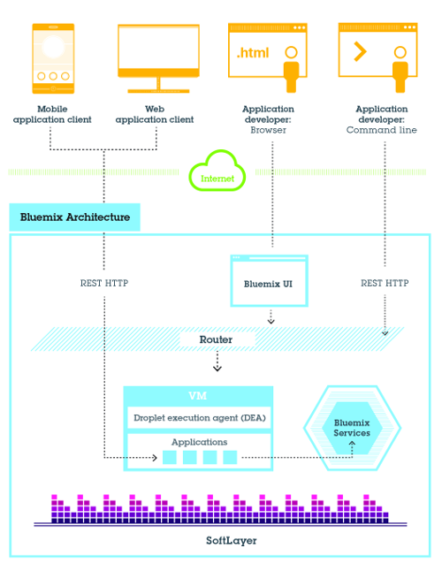

---

 

copyright:

  years: 2016

 

---

{:shortdesc: .shortdesc}
{:new_window: target="_blank"}

# {{site.data.keyword.Bluemix_notm}} Public
{: #public}
*Last updated: 19 May 2016*


{{site.data.keyword.Bluemix_notm}} abstracts and hides most of the complexities that are associated with hosting and managing cloud-based apps. As an application developer, you can focus on developing your app without having to manage the infrastructure that is required to host it.
{:shortdesc}

{{site.data.keyword.Bluemix_notm}} has cloud deployments that fit your needs. Whether you are a small business that plans to scale, or a large enterprise that requires additional isolation, you can develop in a cloud without borders, where you can connect your dedicated services to the public {{site.data.keyword.Bluemix_notm}} services available from {{site.data.keyword.IBM_notm}} and third-party providers. All service instances are managed by {{site.data.keyword.IBM_notm}}. You'll get one bill for only what you choose to use.

At its core, {{site.data.keyword.Bluemix_notm}} is an environment for you to develop apps and use services that provide ready-to-use functions. {{site.data.keyword.Bluemix_notm}} also provides an environment to host application artifacts that run on an application server such as Liberty. By using SoftLayer, {{site.data.keyword.Bluemix_notm}} deploys virtual containers that host each deployed app. In this environment, the app can use pre-built services (including third-party services) to make app assembly easy.

For both mobile and web apps, you can use the pre-built services that are provided by {{site.data.keyword.Bluemix_notm}}. You can upload your web app to {{site.data.keyword.Bluemix_notm}} and indicate how many instances that you want running. After your apps are deployed, you can easily scale them up or down when the usage or load of the apps change.

With the broad set of services and runtimes in {{site.data.keyword.Bluemix_notm}}, the developer gains control and flexibility, and has access to various data options, from predictive analytics to big data.

{{site.data.keyword.Bluemix_notm}} provides the following features:

- A range of services that enable you to build and extend web and mobile apps fast.
- Processing power for you to deliver application changes continuously.
- Fit-for-purpose programming models and services.
- Manageability of services and apps.
- Optimized and elastic workloads.
- Continuous availability.

You can use {{site.data.keyword.Bluemix_notm}} to quickly develop apps in the most popular programming languages. You can develop mobile apps in iOS, Android, and HTML with JavaScript. For web apps, you can use languages such as Ruby, PHP, Java&trade;, Go, and Python. You can also migrate existing apps to {{site.data.keyword.Bluemix_notm}} and use the runtimes that {{site.data.keyword.Bluemix_notm}} provides to run your apps.

{{site.data.keyword.Bluemix_notm}} also provides middleware services for your apps to use. {{site.data.keyword.Bluemix_notm}} acts on the app's behalf when it provisions new service instances, and then binds those services to the app. Your app can perform its real job, leaving the management of the services to the infrastructure.

## {{site.data.keyword.Bluemix_notm}} Public architecture
{: #publicarch}


In general, you don't have to worry about the operating system and infrastructure layers when running apps on {{site.data.keyword.Bluemix_notm}}. Layers such as root filesystems and middleware components are abstracted so that you can focus on your application code. However, you can learn more about these layers if you need specifics on where your app is running. See [Viewing {{site.data.keyword.Bluemix_notm}} infrastructure layers](../cli/vcapsvc.html#viewinfra) for details.

As a developer, you can interact with the {{site.data.keyword.Bluemix_notm}} infrastructure by using a browser-based user interface. You can also use a Cloud Foundry command line interface, called cf, to deploy web apps.

Clients---which can be mobile apps, apps that run externally, apps that are built on {{site.data.keyword.Bluemix_notm}}, or developers that are using browsers---interact with the {{site.data.keyword.Bluemix_notm}}-hosted apps. Clients use REST or HTTP APIs to route requests through {{site.data.keyword.Bluemix_notm}} to one of the app instances or the composite services.

The following figure shows the high-level {{site.data.keyword.Bluemix_notm}} architecture.



*Figure 1. {{site.data.keyword.Bluemix_notm}} architecture*

You can deploy your apps to different {{site.data.keyword.Bluemix_notm}} regions, for latency or security considerations. You can choose to deploy either to one region or across multiple regions. For more information, see [Regions](index.html#ov_intro_reg).


*Figure 2. Multi-region application deployment*

### How {{site.data.keyword.Bluemix_notm}} works
{: #howwork}

When you deploy an app to {{site.data.keyword.Bluemix_notm}}, you must configure {{site.data.keyword.Bluemix_notm}} with enough information to support the app.

* For a mobile app, {{site.data.keyword.Bluemix_notm}} contains an artifact that represents the mobile app's back end, such as the services that are used by the mobile app to communicate with a server.
* For a web app, you must ensure that information about the proper runtime and framework is communicated to {{site.data.keyword.Bluemix_notm}}, so that it can set up the proper execution environment to run the app.

Each execution environment, including both mobile and web, is isolated from the execution environment of other apps. The execution environments are isolated even though these apps are on the same physical machine. The following figure shows the basic flow of how {{site.data.keyword.Bluemix_notm}} manages the deployment of apps:


*Figure 5. Deploying an app*

When you create an app and deploy it to {{site.data.keyword.Bluemix_notm}}, the {{site.data.keyword.Bluemix_notm}} environment determines an appropriate virtual server to which the app or artifacts that the app represents is sent. For a mobile app, a mobile back-end projection is created on {{site.data.keyword.Bluemix_notm}}. Any code for the mobile app running in the cloud eventually runs in the {{site.data.keyword.Bluemix_notm}} environment. For a web app, the code running in the cloud is the app itself that the developer deploys to {{site.data.keyword.Bluemix_notm}}. The determination of the virtual server is based on several factors, including:

* The load already on the machine
* Runtimes or frameworks supported by that virtual server.

After a virtual server is chosen, an application manager on each virtual server installs the proper framework and runtime for the app. Then the app can be deployed into that framework. When the deployment is completed, the application artifacts are started.

The following figure shows the structure of a virtual server, also known as Droplet execution agent (DEA), that has multiple apps deployed to it:


*Figure 6. Design of a virtual server*

In each virtual server, an application manager communicates with the rest of the {{site.data.keyword.Bluemix_notm}} infrastructure, and manages the apps that are deployed to this virtual server. Each virtual server has containers to separate and protect apps. In each container, {{site.data.keyword.Bluemix_notm}} installs the appropriate framework and runtime that are required for each app.

When the app is deployed, if it has a web interface (as for a Java web app), or other REST-based services (such as mobile services exposed publicly to the mobile app), users of the app can communicate with it by using normal HTTP requests.


*Figure 7. Invoking a {{site.data.keyword.Bluemix_notm}} app*

Each app can have one or more URLs associated with it, but all of them must point to the {{site.data.keyword.Bluemix_notm}} endpoint. When a request comes in, {{site.data.keyword.Bluemix_notm}} examines the request, determines which app it is intended for, and then selects one of the instances of the app to receive the request.


## Regions
{: #ov_intro_reg}

A {{site.data.keyword.Bluemix_notm}} region is a defined geographical territory that you can deploy your apps to. You can create apps and service instances in different with the same {{site.data.keyword.Bluemix_notm}} infrastructure for application management and the same usage details view for billing. You can select the region that is nearest to your customers and deploy your apps to this region to get low application latency. You can also select the region where you want to keep the application data to address security issues. When you build apps in multiple regions, if one region goes down, the apps that are in the other regions continue to run. Your resource allowance is the same for each region that you use.

If you are using the {{site.data.keyword.Bluemix_notm}} user interface, you can switch to a different region to work with the spaces in that region. Go to the **Account and Support** icon , and expand the **Region** selector. Then, you can select a different region from the list.

If you are using the cf command line interface, you must connect to the {{site.data.keyword.Bluemix_notm}} region that you want to work with by using the cf api command and specifying the API endpoint of the region. For example, enter the following command to connect to {{site.data.keyword.Bluemix_notm}} Europe United Kingdom region:

```
cf api https://api.eu-gb.{{site.data.keyword.Bluemix_notm}}.net
```

If you are using the Eclipse tools, you must connect to the {{site.data.keyword.Bluemix_notm}} region that you want to work with by creating a {{site.data.keyword.Bluemix_notm}} server and specifying the API endpoint of the region. For more information about using the Eclipse tools, see [Deploying apps with {{site.data.keyword.IBM_notm}} Eclipse Tools for {{site.data.keyword.Bluemix_notm}}](../manageapps/eclipsetools/eclipsetools.html#toolsinstall).

A unique prefix is assigned to each region. {{site.data.keyword.Bluemix_notm}} provides the following regions and region prefixes.

<!-- PRODUCTION ONLY: Ensure that URLs are production URLs, not stage1-->

| **Region name** | **Geographic location** | **Region prefix** | **cf API endpoint** | **UI console** |       
|-----------------|-------------------------|-------------------|---------------------|----------------|
| US South region | Dallas, US | ng | api.ng.bluemix.net | console.ng.bluemix.net |
| United Kingdom region | London, England | eu-gb | api.eu-gb.bluemix.net | console.eu-gb.bluemix.net |
| Sydney region | Sydney, Australia | au-syd | api.au-syd.bluemix.net | console.au-syd.bluemix.net |

*Table 1. {{site.data.keyword.Bluemix_notm}} region list*


## {{site.data.keyword.Bluemix_notm}} resiliency
{: #resiliency}

{{site.data.keyword.Bluemix_notm}} is designed to host scalable, resilient apps and application artifacts that can both scale to meet your needs, and remain highly available and quick to recover from problems. {{site.data.keyword.Bluemix_notm}} separates those components that track the state of interactions (stateful) from those that do not (stateless). This separation allows {{site.data.keyword.Bluemix_notm}} to move apps flexibly as needed to achieve scalability and resiliency.

You can have one or more instances running for your app. When you have multiple instances for one app, the app is uploaded only once. However, {{site.data.keyword.Bluemix_notm}} deploys the number of instances of the app requested, and distributes them across as many virtual servers as possible.

You must save all persistent data in a stateful data store that is outside of your app, such as on one of the data store services that are provided by {{site.data.keyword.Bluemix_notm}}. Because anything cached in memory or on disk might not be available even after a restart, you can use the memory space or filesystem of a single {{site.data.keyword.Bluemix_notm}} instance as a brief, single-transaction cache. With a single instance setup, the request to your app might be interrupted because of the stateless nature of {{site.data.keyword.Bluemix_notm}}. A best practice is to use at least three instances for each app to ensure the availability of your app.

All {{site.data.keyword.Bluemix_notm}} infrastructure, Cloud Foundry components, and {{site.data.keyword.IBM_notm}}-specific management components are highly available. Multiple instances of the infrastructure are used to balance the load.

## Integration with systems of record
{: #sor}

{{site.data.keyword.Bluemix_notm}} can help developers by connecting two broad categories of systems in a cloud environment: systems of record and systems of engagement.

*Systems of record* include apps and databases that store business records and automate standardized processes. *Systems of engagement* are capabilities that expand the usefulness of systems of record and make them more engaging to users.
By integrating a system of record with the app that you create in {{site.data.keyword.Bluemix_notm}}, you can perform the following actions:

 * Enable secure communication between the app and the backend database by downloading and installing a secure connector on premise.
 * Invoke a database in a secure way.
 * Create APIs from integration flows with databases and backend systems, such as customer relationship management system.
 * Expose only the schemas and tables that you want to be exposed to the app.
 * As a {{site.data.keyword.Bluemix_notm}} organization manager, publish an API as a private service that is visible only to your organization members.

To integrate a system of record with the app that you create in {{site.data.keyword.Bluemix_notm}}, use the Cloud Integration service. By using the Cloud Integration service, you can create a Cloud Integration API and publish the API as a private service for your organization.

<dl>
<dt>Cloud Integration API</dt>
    <dd>A Cloud Integration API provides secured access to the systems of record that reside behind a firewall through web APIs. When you create the Cloud Integration API, you choose the resource that you want to access through the web API, specify the operations that are permitted, and include SDKs and samples to access the API. For more information about how to create a Cloud Integration API, see [Creating Cloud Integration APIs](../services/CloudIntegration/index.html#cloudint_add_service).</dd>
<dt>Private service</dt>
    <dd>A private service consists of a Cloud Integration API, SDKs, and entitlement policies. In addition, the private service might contain documentation or other items from the service provider. Only the organization manager can publish a Cloud Integration API as a private service. To see the private services that are available to you, select the Private checkbox in the {{site.data.keyword.Bluemix_notm}} catalog. You can select and bind a private service to an app without connecting to the Cloud Integration service. You bind private services to your app in the same way as you do for other {{site.data.keyword.Bluemix_notm}} services. For information about how to publish an API as a private service, see Publishing an API as a private service.</dd>
</dl>

### Scenario: Creating a rich mobile app to connect with your system of record
{: #scenario}

{{site.data.keyword.Bluemix_notm}} provides a platform where you can integrate your mobile app, cloud services, and enterprise systems of record to provide an app that interacts with your on-premises data.

For example, you can build a mobile app to interact with your customer relationship management system that resides on-premises behind a firewall. You can invoke the system of record in a secure way and leverage the mobile services in {{site.data.keyword.Bluemix_notm}} so that you can build a rich mobile app.

First, your integration developer creates the mobile back-end app in {{site.data.keyword.Bluemix_notm}}. He uses the Mobile Cloud boilerplate that uses the Node.js runtime that he is most familiar with.

Then, by using the Cloud Integration service in the {{site.data.keyword.Bluemix_notm}} user interface, he exposes an API through a secure connector. Your integration developer downloads the secure connector and installs it on-premises to enable secure communication between his API and the database. After he creates the database endpoint, he can look at all the schemas and extract the tables that he wants to expose as APIs to the app.

Your integration developer adds the Push service to deliver mobile notifications to interested consumers. He also adds a business partner service to tweet when a new customer record is created with a Twitter API.

Next, as the application developer, you can log in to {{site.data.keyword.Bluemix_notm}}, download the Android development toolkit, and develop code that invokes the APIs that your integration developer created. You can develop a mobile app that enables users to enter their information on their mobile device. The mobile app then creates a customer record in the customer management system. When the record is created, the app pushes a notification to a mobile device and initiates a tweet about the new record.

# rellinks
## general
* [What's new in {{site.data.keyword.Bluemix_notm}}](../whatsnew/index.html)
* [{{site.data.keyword.Bluemix_notm}} Prerequisites](https://developer.ibm.com/bluemix/support/#prereqs)
* [{{site.data.keyword.Bluemix_notm}} known issues](https://developer.ibm.com/bluemix/support/#issues)
* [Managing your account](../admin/adminpublic.html#mngacct)
* [{{site.data.keyword.Bluemix_notm}} glossary](../overview/glossary/index.html)
