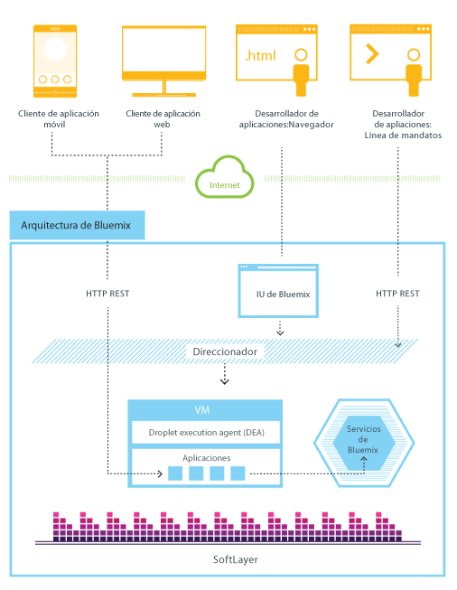
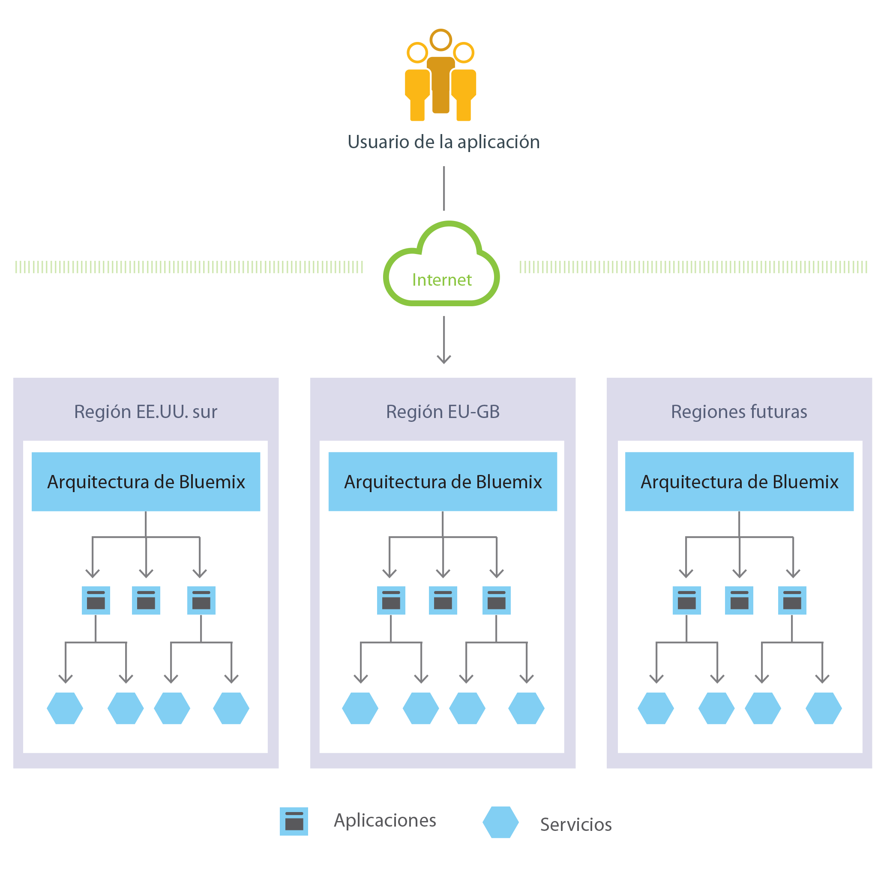
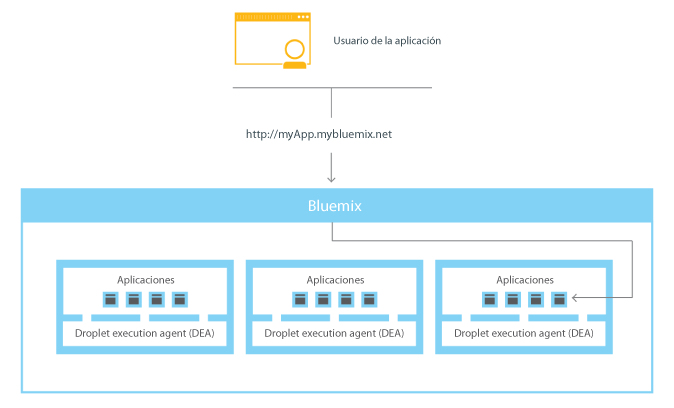

---

 

copyright:

  years: 2016

 

---

{:shortdesc: .shortdesc}
{:new_window: target="_blank"}

# {{site.data.keyword.Bluemix_notm}} público
{: #public}
*Última actualización: 22 de febrero de 2016*


{{site.data.keyword.Bluemix_notm}} abstrae y oculta la mayoría de las complejidades asociadas con el alojamiento y la gestión de apps basadas en la nube. Como desarrollador de apps, puede centrarse en desarrollar la app sin tener que gestionar la infraestructura necesaria para alojarla.
{:shortdesc}

{{site.data.keyword.Bluemix_notm}} tiene despliegues de nube que se adaptan a sus necesidades. Tanto si pertenece a una empresa pequeña con perspectivas de crecimiento como si es miembro de una gran empresa que requiere aislamiento, disponemos la oferta adecuada, desarrolle en la nube sin límites, donde puede conectar sus dispositivos dedicados a los servicios {{site.data.keyword.Bluemix_notm}} públicos que ponen a su disponibilidad {{site.data.keyword.IBM_notm}} y otros proveedores. {{site.data.keyword.IBM_notm}} gestiona todas las instancias de servicio. El usuario recibirá una factura sólo por lo que utilice.

Básicamente, {{site.data.keyword.Bluemix_notm}} es un entorno para que el usuario desarrolle apps y utilice servicios que ofrecen funciones fáciles de utilizar. {{site.data.keyword.Bluemix_notm}} también ofrece un entorno para alojar artefactos de apps que se ejecutan en un
servidor de apps, como por ejemplo Liberty. Mediante el uso de SoftLayer, {{site.data.keyword.Bluemix_notm}} despliega contenedores virtuales que contienen cada app desplegada. En este entorno, la app puede utilizar servicios incorporados (incluidos servicios de terceros) para facilitar el ensamblaje de la app.

En el caso de apps para móvil y web, puede utilizar los servicios incorporados que proporciona {{site.data.keyword.Bluemix_notm}}. Puede cargar la app en {{site.data.keyword.Bluemix_notm}} e indicar el número de instancias que desee tener en ejecución. Una vez desplegadas las apps, puede fácilmente escalarlas al alza o a la baja cuando cambie el uso o la carga de las apps.

Con la amplia gama de servicios y tiempos de ejecución que se ofrece en {{site.data.keyword.Bluemix_notm}}, el desarrollador obtiene control y flexibilidad, y tiene acceso a diversas opciones de datos, desde el análisis predictivo hasta Big Data.

{{site.data.keyword.Bluemix_notm}} proporciona las siguientes características:

- Una amplia gama de servicios que permiten crear y extender rápidamente sus apps web y para móvil.
- Potencia de proceso para que pueda distribuir cambios en la app continuamente.
- Modelos y servicios de programación adaptados a su finalidad.
- Funciones de gestión de servicios y apps.
- Cargas de trabajo optimizadas y elásticas.
- Disponibilidad continua.

Puede utilizar {{site.data.keyword.Bluemix_notm}} para desarrollar rápidamente apps en los lenguajes de programación más utilizados. Puede desarrollar apps para móvil en iOS, Android y HTML con JavaScript. Para las apps web, puede utilizar lenguajes como Ruby, PHP, Java&trade;, Go y Python. También puede migrar las apps existentes a {{site.data.keyword.Bluemix_notm}} y utilizar los tiempos de ejecución que proporciona {{site.data.keyword.Bluemix_notm}} para ejecutar sus apps.

{{site.data.keyword.Bluemix_notm}} también proporciona servicios de middleware para que los utilicen las apps. {{site.data.keyword.Bluemix_notm}} actúa en nombre de la app cuando suministra nuevas instancias de servicio y luego enlaza estos servicios a la app. La app puede llevar a cabo su trabajo real, dejando la gestión de los servicios a la infraestructura.

## Arquitectura pública de {{site.data.keyword.Bluemix_notm}}
{: #publicarch}


En general, no debe preocuparse de las capas de sistema operativo y de infraestructura cuando ejecute apps en {{site.data.keyword.Bluemix_notm}}. Las capas de tipo sistemas de archivos raíz y componentes de middleware se abstraen para que se pueda centrar en el código de la app. Sin embargo, puede obtener más información sobre estas capas y necesita datos específicos sobre dónde se ejecuta la app. Consulte [Visualización de las capas de infraestructura de {{site.data.keyword.Bluemix_notm}}](../cli/vcapsvc.html#viewinfra) para obtener más detalles.

Como desarrollador, puede interactuar con la infraestructura de {{site.data.keyword.Bluemix_notm}} mediante una interfaz de usuario basada en navegador. También puede utilizar una interfaz de línea de mandatos de Cloud Foundry, denominada cf, para desplegar apps web.

Los clientes, que pueden ser apps móviles, las apps que se ejecutan externamente, las apps creadas en {{site.data.keyword.Bluemix_notm}} o los desarrolladores que utilizan navegadores interactúan con las apps alojadas en {{site.data.keyword.Bluemix_notm}}. Los clientes utilizan las API REST o HTTP para dirigir las solicitudes a través de {{site.data.keyword.Bluemix_notm}} a una de las instancias de la app o a los servicios compuestos.

La figura siguiente muestra la arquitectura de {{site.data.keyword.Bluemix_notm}} de alto nivel.

Arquitectura de 

*Figura 1. Arquitectura de {{site.data.keyword.Bluemix_notm}}*

Puede desplegar sus apps en distintas regiones de {{site.data.keyword.Bluemix_notm}}, por motivos de latencia o de seguridad. Puede elegir desplegar en una región o a lo largo de varias regiones. Para obtener más información, consulte [Regiones](index.html#ov_intro_reg).




*Figura 2. Despliegue de apps en varias regiones*

### Funcionamiento de {{site.data.keyword.Bluemix_notm}}
{: #howwork}

Cuando despliega una app en {{site.data.keyword.Bluemix_notm}}, debe configurar {{site.data.keyword.Bluemix_notm}} con suficiente información para dar soporte a la app.

* En el caso de una app para móvil, {{site.data.keyword.Bluemix_notm}} contiene un artefacto que representa el proceso de las apps para móvil, como por ejemplo los servicios que utiliza la app para móvil para comunicarse con un servidor.
* En el caso de una app web, debe asegurarse de que esta información sobre el tiempo de ejecución y la infraestructura adecuados se comunique a {{site.data.keyword.Bluemix_notm}},
para que pueda configurar el entorno de ejecución correcto para ejecutar la app.

Cada entorno de ejecución, que incluye tanto móvil como web, se aísla del entorno de ejecución de otras apps. Los entornos de ejecución se aíslan aunque estas apps estén en la misma máquina física. La figura siguiente muestra el flujo básico de cómo {{site.data.keyword.Bluemix_notm}} gestiona el despliegue de apps:


*Figura 5. Despliegue de una app*

Cuando crea una app y la despliega en {{site.data.keyword.Bluemix_notm}}, el entorno de {{site.data.keyword.Bluemix_notm}} determina un servidor virtual adecuado al que se envía la app o los artefactos que representa la app. En el caso de una app para móvil, se crea una proyección de proceso en {{site.data.keyword.Bluemix_notm}}. Cualquier código de la app para móvil de la nube en principio se ejecuta en el entorno de {{site.data.keyword.Bluemix_notm}}. En el caso de una app web, el código que se ejecuta en la nube es la propia app que el desarrollador despliega en {{site.data.keyword.Bluemix_notm}}. La determinación del servidor virtual se basa en varios factores, que incluyen los siguientes:

* La carga que ya soporta la máquina
* Los tiempos de ejecución o infraestructuras que soporta dicho servidor virtual.

Después de seleccionar un servidor virtual, un gestor de apps de cada servidor virtual instala la infraestructura y el tiempo de ejecución adecuados para la app. A partir de entonces la app se puede desplegar en la infraestructura. Cuando se completa el despliegue, se inician los artefactos de la app.

La siguiente figura
muestra la estructura de un servidor virtual, también conocido como agente de ejecución de gotas (DEA), en el que se han desplegado varias apps:


*Figura 6. Diseño de un servidor virtual*

En cada servidor virtual, un gestor de apps se comunica con el resto de la infraestructura de {{site.data.keyword.Bluemix_notm}} y gestiona las apps que se despliegan en este servidor virtual. Cada servidor virtual dispone de contenedores para separar y proteger las apps. En cada contenedor, {{site.data.keyword.Bluemix_notm}} instala la infraestructura y el tiempo de ejecución adecuados que necesita cada app.

Cuando se despliega la app, si tiene una interfaz web (como por ejemplo una app web Java) y otros servicios basados en REST (como por ejemplo servicios móviles expuestos públicamente para la app para móvil), los usuarios de la app pueden comunicarse con la misma mediante solicitudes HTTP normales.



*Figura 7. Invocación de una app de {{site.data.keyword.Bluemix_notm}}*

Cada app puede tener uno o varios URL asociados, pero todos deben apuntar al punto final de {{site.data.keyword.Bluemix_notm}}. Cuando entra una solicitud, {{site.data.keyword.Bluemix_notm}} la examina, determina la app a la que va destinada y a continuación selecciona una de las instancias de la app para que reciba la solicitud.


## Regiones
{: #ov_intro_reg}

Una región de {{site.data.keyword.Bluemix_notm}} es un territorio geográfico definido en el que puede desplegar sus apps. Puede crear apps e instancias de servicios en distintas regiones con la misma infraestructura de {{site.data.keyword.Bluemix_notm}} para la gestión de apps y la misma vista de detalles de uso para la facturación. Puede seleccionar la región se esté más cerca de sus clientes y desplegar sus apps a esta región para obtener una latencia baja de la app. También puede seleccionar la región en la que desea conservar los datos de app para solucionar los problemas de seguridad. Cuando crea apps en varias regiones, si una región queda fuera de servicio, las apps que están en las otras regiones seguirán funcionando. Su concesión de recursos es la misma para cada región que utilice.

Si está utilizando la interfaz de usuario de {{site.data.keyword.Bluemix_notm}}, puede cambiar a una región distinta para trabajar con los espacios de esa región.

Si utiliza la interfaz de línea de mandatos cf, debe conectarse a la región {{site.data.keyword.Bluemix_notm}} con la que desea trabajar utilizando el mandato cf api y especificando el punto final API de la región. Por ejemplo, escriba el siguiente mandato para conectarse a la región de
{{site.data.keyword.Bluemix_notm}} de Europa - Reino Unido:

```
cf api https://api.eu-gb.{{site.data.keyword.Bluemix_notm}}.net
```

Si
utiliza las herramientas de Eclipse, debe conectarse a la región {{site.data.keyword.Bluemix_notm}}
con la que desea trabajar creando un servidor {{site.data.keyword.Bluemix_notm}}
y especificando el punto final API de la región. Para obtener más información
sobre el uso de las herramientas de Eclipse, consulte [Despliegue de apps con {{site.data.keyword.IBM_notm}} Eclipse Tools for {{site.data.keyword.Bluemix_notm}}](../manageapps/eclipsetools/eclipsetools.html#toolsinstall).

Cada región tienen asignado un prefijo exclusivo. {{site.data.keyword.Bluemix_notm}} proporciona las siguientes regiones y prefijos.

<!-- PRODUCTION ONLY: Ensure that URLs are production URLs, not stage1-->

| **Nombre de la región** | **Ubicación geográfica** | **Prefijo de la región** | **Punto final cf API** | **Consola de interfaz de usuario** |       
|-----------------|-------------------------|-------------------|---------------------|----------------|
| Región EE.UU. sur | Dallas, EE.UU. | ng | api.ng.bluemix.net | console.ng.bluemix.net |
| Región Reino Unido | Londres, Inglaterra | eu-gb | api.eu-gb.bluemix.net | console.eu-gb.bluemix.net |
| Región Sídney | Sídney, Australia | au-syd | api.au-syd.bluemix.net | console.au-syd.bluemix.net |

*Tabla 1. Lista de regiones de {{site.data.keyword.Bluemix_notm}}*


## Resiliencia de {{site.data.keyword.Bluemix_notm}}
{: #resiliency}

Se ha diseñado {{site.data.keyword.Bluemix_notm}}
para alojar apps y artefactos de apps resilientes y escalables
que puedan escalarse para cumplir sus necesidades, así como para ofrecer una alta disponibilidad
y una recuperación rápida de problemas. {{site.data.keyword.Bluemix_notm}} separa los componentes que realizan un seguimiento del estado de las interacciones (con estado)
de los que no (sin estado). Esta separación permite que {{site.data.keyword.Bluemix_notm}} pueda
trasladar apps de forma flexible según convenga para lograr escalabilidad y resiliencia.

Puede tener una o varias instancias en ejecución para la app. Si tiene varias instancias de una app, la app sólo se carga una vez. Sin embargo, {{site.data.keyword.Bluemix_notm}} despliega
el número de instancias de la app solicitada y las distribuye
a través del mayor número posible de servidores virtuales.

Debe guardar todos los datos persistentes
en un almacén de datos con estado que se encuentre fuera de la app,
como por ejemplo en uno de los servicios de almacenamiento de datos proporcionados por {{site.data.keyword.Bluemix_notm}}. Dado que es posible que algún elemento almacenado en la memoria caché o en el disco no esté disponible
incluso después de reiniciar, puede utilizar el espacio de memoria o sistema de archivos de una instancia
de {{site.data.keyword.Bluemix_notm}}
como caché rápida de transacción única. Con una sola configuración de instancia,
la solicitud a su app puede interrumpirse debido a la naturaleza sin estado
de {{site.data.keyword.Bluemix_notm}}. Se recomienda utilizar como mínimo tres instancias para cada app
para garantizar la disponibilidad de la app.

La infraestructura de {{site.data.keyword.Bluemix_notm}}, todos los componentes de Cloud Foundry y los componentes de gestión específicos de {{site.data.keyword.IBM_notm}} tienen una alta disponibilidad. Se utilizan varias instancias de la infraestructura
para equilibrar la carga.

## Integración con sistemas de registros
{: #sor}

{{site.data.keyword.Bluemix_notm}} puede ayudar a los desarrolladores ya que conecta dos amplias categorías de sistemas en un entorno de nube: sistemas de registros y sistemas colaborativos.

Los *sistemas de registro* incluyen apps y bases de datos que almacenan registros empresariales y automatizan los procesos estandarizados. Los *sistemas colaborativos* ofrecen prestaciones que amplían la utilidad de los sistemas de registros y facilitan la colaboración por parte de los usuarios.
Mediante la integración de un sistema de registros con la app que cree en {{site.data.keyword.Bluemix_notm}}, puede llevar a cabo estas acciones:

 * Permitir una comunicación segura entre la app y la base de datos de fondo descargando e instalando un conector seguro local.
 * Invocar una base de datos de forma segura.
 * Crear API a partir de flujos de integración con bases de datos y sistemas de fondo, como por ejemplo un sistema de gestión de relaciones con los clientes.
 * Exponer únicamente los esquemas y las tablas que desea exponer a la app.
 * Como gestor de la organización de {{site.data.keyword.Bluemix_notm}}, publicar una API como servicio privado que sea visible sólo para los miembros de su organización.

Para integrar un sistema de registros con las apps que cree en {{site.data.keyword.Bluemix_notm}}, utilice el servicio de Cloud Integration. Utilizando el servicio de Cloud Integration, puede crear una API de Cloud Integration y publicar la API como un servicio privado para su organización.

<dl>
<dt>API de Cloud Integration</dt>
    <dd>Una API de Cloud Integration proporciona un acceso seguro a los sistemas de registro que residen detrás de un cortafuegos mediante las API web. Al crear la API de Cloud Integration, debe elegir el recurso al que desea acceder mediante la API web, especificar las operaciones que se permiten e incluye los SDK y ejemplos para acceder a la API. Para obtener más información sobre cómo crear una API de Cloud Integration, consulte [Creación de API de Cloud Integration](../services/CloudIntegration/index.html#cloudint_add_service).</dd>
<dt>Servicio privado</dt>
    <dd>Un servicio privado consiste en una API de Cloud Integration, los SDK y políticas de titularidad. Además, el servicio privado puede contener documentación u otros elementos del proveedor de servicios. Sólo el gestor de la organización puede publicar una API de Cloud Integration como un servicio privado. Para ver los servicios privados que tiene disponibles, marque el recuadro de selección Privado en el catálogo de {{site.data.keyword.Bluemix_notm}}. Puede seleccionar y enlazar un servicio privado a una app sin conectarse al servicio de Cloud Integration. Los servicios privados se enlazan a su app de la misma forma en que se hace en otros servicios de {{site.data.keyword.Bluemix_notm}}. Para obtener información sobre cómo publicar una API como un servicio privado, consulte Publicación de una API como un servicio privado.</dd>
</dl>

### Caso de ejemplo: creación de una potente app móvil para conectar con su sistema de registros
{: #scenario}

{{site.data.keyword.Bluemix_notm}} ofrece una plataforma en la que puede integrar su app para móvil, servicios de nube y sistemas de registros de la empresa a fin de proporcionar una app que interactúe con los datos locales.

Por ejemplo, puede crear una app para móvil para interactuar con el sistema de gestión de relaciones con los clientes que reside de forma local detrás de un cortafuegos. Puede invocar el sistema de registros de manera segura y aprovechar los servicios móviles de {{site.data.keyword.Bluemix_notm}} para crear una potente app móvil.

En primer lugar, el desarrollador de integración crea la app móvil de fondo en {{site.data.keyword.Bluemix_notm}}. Utiliza el contenedor modelo de Mobile Cloud que usa el tiempo de ejecución Node.js con el que está más familiarizado.

A continuación, mediante el uso del servicio Cloud Integration en la interfaz de usuario de {{site.data.keyword.Bluemix_notm}}, expone una API a través de un conector seguro. El desarrollador de integración descarga el conector seguro y lo instala de forma local para permitir la comunicación segura entre su API y la base de datos. Después de crear el punto final de la base de datos, examina todos los esquemas y extrae las tablas que desea exponer como API ante la app.

El desarrollador de integración añade el servicio Push para enviar notificaciones móviles a los consumidores interesados. También añade un servicio de un business partner para iniciar un tweet cuando se crea un nuevo registro de cliente con una API
de Twitter.

A continuación, como desarrollador de la app, puede iniciar una sesión en {{site.data.keyword.Bluemix_notm}},
descargar el kit de herramientas de desarrollo de Android y desarrollar código que invoque las API que ha creado el desarrollador de integración. Puede desarrollar una app móvil que permita a los usuarios entrar la información en su dispositivo móvil. Luego la app para móvil crea un registro de cliente en el sistema de gestión de clientes. Cuando se crea el registro, la app envía una notificación a un dispositivo móvil e inicia un tweet sobre el nuevo registro.

# rellinks
## general
* [Novedades de {{site.data.keyword.Bluemix_notm}}](../whatsnew/index.html)
* Requisitos previos de [{{site.data.keyword.Bluemix_notm}}](https://developer.ibm.com/bluemix/support/#prereqs)
* Problemas conocidos de [{{site.data.keyword.Bluemix_notm}}](https://developer.ibm.com/bluemix/support/#issues)
* [Gestión de la cuenta](../admin/adminpublic.html#mngacct)
* [Glosario de {{site.data.keyword.Bluemix_notm}}](../overview/glossary/index.html)
