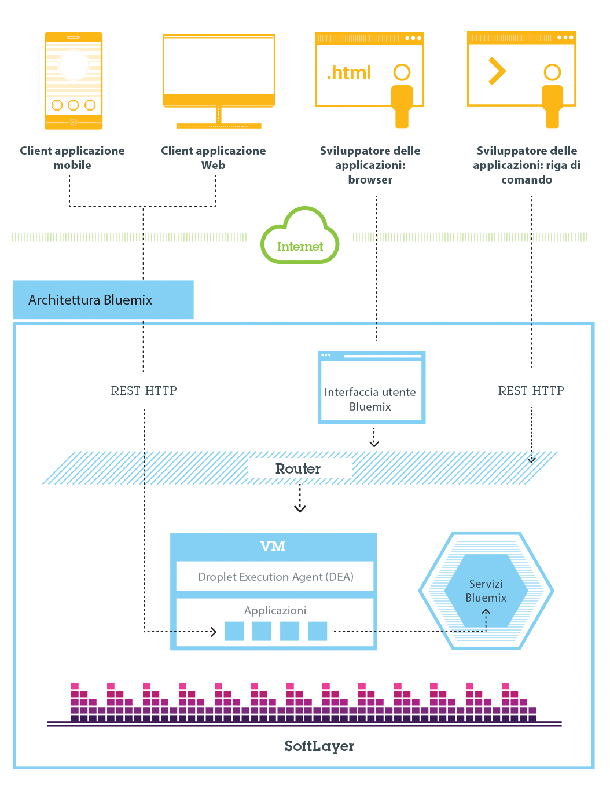
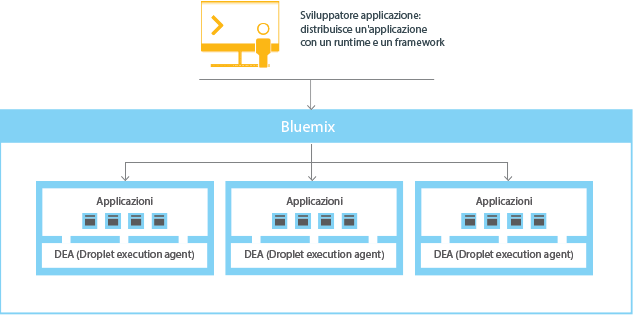
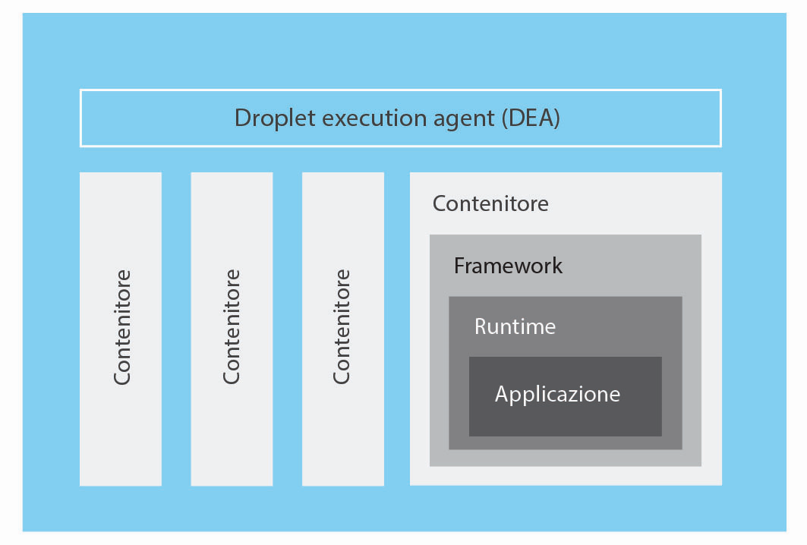
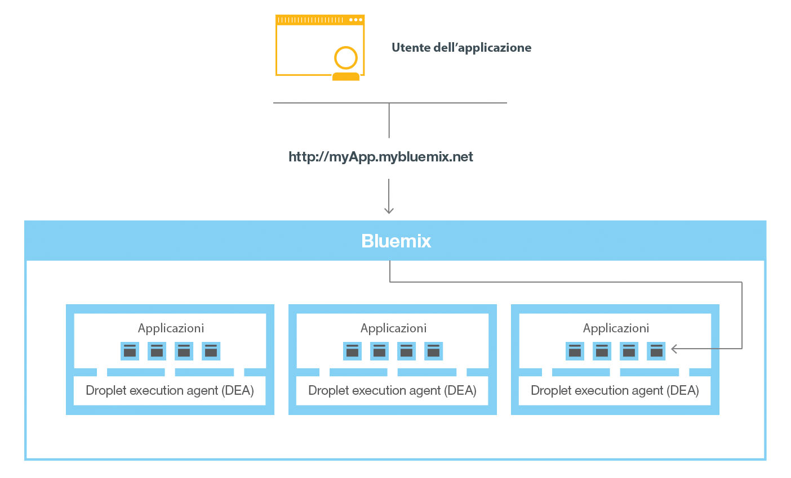

---

 

copyright:

  years: 2016

 

---

{:shortdesc: .shortdesc}
{:new_window: target="_blank"}

# {{site.data.keyword.Bluemix_notm}} pubblico
{: #public}
*Ultimo aggiornamento: 22 febbraio 2016*


{{site.data.keyword.Bluemix_notm}} astrae e nasconde la maggior parte delle complessità associate al fungere da host e al gestire applicazioni basate sul cloud. In qualità di sviluppatore dell'applicazione, puoi concentrarti sullo sviluppo dell'applicazione senza dover gestire l'infrastruttura richiesta per fungere da host per essa.
{:shortdesc}

{{site.data.keyword.Bluemix_notm}} dispone di distribuzioni cloud adatte alle tue esigenze. Non importa se rappresenti una piccola attività di business che intende ingrandirsi oppure una grande azienda che ha bisogno di un ulteriore livello di isolamento, con un cloud puoi sviluppare la tua attività senza limiti, connettendo i tuoi servizi dedicati ai servizi pubblici {{site.data.keyword.Bluemix_notm}} disponibili da {{site.data.keyword.IBM_notm}} e terzi provider. Tutte le istanze del servizio sono gestite da {{site.data.keyword.IBM_notm}}. Riceverai una singola fattura solo per quello che sceglierai di usare.

Di base,
{{site.data.keyword.Bluemix_notm}} è un ambiente che
ti consente di sviluppare applicazioni e utilizzare servizi che forniscono funzioni
pronte per l'uso. {{site.data.keyword.Bluemix_notm}} fornisce anche un ambiente per ospitare risorse utente delle applicazioni che sono eseguite su
server delle applicazioni come Liberty. Utilizzando SoftLayer, {{site.data.keyword.Bluemix_notm}} distribuisce contenitori virtuali che ospitano ciascuna applicazione distribuita. In questo ambiente, l'applicazione può utilizzare servizi pre-costruiti
(compresi i servizi di terze parti) per rendere semplice l'assemblaggio di applicazioni.

Sia per le applicazioni mobili che per quelle web, puoi
utilizzare i servizi pre-costruiti forniti da {{site.data.keyword.Bluemix_notm}}. Puoi caricare la tua applicazione web su {{site.data.keyword.Bluemix_notm}} e indicare quante istanze desideri eseguire. Una volta distribuite le tue applicazioni, puoi facilmente eseguirne il ridimensionamento,
a crescere o a decrescere, quando l'utilizzo o il carico delle applicazioni variano.

Con l'ampia gamma di servizi e runtime in {{site.data.keyword.Bluemix_notm}}, lo sviluppatore acquisisce controllo e flessibilità e ha accesso a diverse opzioni di dati, dall'analisi predittiva ai Big Data.

{{site.data.keyword.Bluemix_notm}} fornisce le
seguenti funzioni:

- Una gamma di servizi che ti consente di creare ed estendere rapidamente applicazioni mobili e web.
- Potenza di elaborazione per offrire modifiche delle applicazioni in modo continuo.
- Servizi e modelli di programmazione adatti allo scopo.
- Gestibilità di servizi e applicazioni.
- Carichi di lavoro ottimizzati e flessibili.
- Disponibilità continua.

Puoi utilizzare {{site.data.keyword.Bluemix_notm}} per sviluppare rapidamente applicazioni nei linguaggi di programmazione più diffusi. Puoi sviluppare le applicazioni mobili in iOS, Android e HTML con JavaScript. Per le applicazioni web, puoi utilizzare linguaggi quali Ruby, PHP, Java&trade;, Go e Python. Inoltre, puoi migrare le applicazioni
esistenti a {{site.data.keyword.Bluemix_notm}} e utilizzare i runtime forniti da {{site.data.keyword.Bluemix_notm}} per eseguire le tue applicazioni.

{{site.data.keyword.Bluemix_notm}} fornisce anche servizi middleware che possono essere utilizzati dalle tue applicazioni. {{site.data.keyword.Bluemix_notm}} opera per conto dell'applicazione quando esegue il provisioning di nuove istanze di servizio ed esegue quindi il bind di tali servizi all'applicazione. La tua applicazione può eseguire il suo compito effettivo, lasciando che sia l'infrastruttura a gestire i servizi.

## Architettura di {{site.data.keyword.Bluemix_notm}} pubblico
{: #publicarch}


In generale, non devi preoccuparti dei livelli di infrastruttura e sistema operativo durante l'esecuzione delle applicazioni su {{site.data.keyword.Bluemix_notm}}. I livelli
quali, ad esempio, i file system root e i componenti middleware vengono astratti e pertanto puoi concentrarti sul
codice della tua applicazione. Tuttavia, se hai bisogno di specifiche su dove è in esecuzione
la tua applicazione, puoi consultare ulteriori informazioni su questi livelli. Per i dettagli, vedi [Visualizzazione dei livelli dell'infrastruttura {{site.data.keyword.Bluemix_notm}}](../cli/vcapsvc.html#viewinfra).

In qualità di sviluppatore, puoi interagire con l'infrastruttura {{site.data.keyword.Bluemix_notm}} utilizzando un'interfaccia utente basata sul browser. Puoi anche utilizzare un'interfaccia riga di comando Cloud Foundry, denominata cf, per distribuire applicazioni
web.

I client, che possono essere applicazioni mobili, applicazioni che vengono eseguite esternamente, applicazioni basate su {{site.data.keyword.Bluemix_notm}} o sviluppatori che stanno utilizzando dei browser, interagiscono con le applicazioni ospitate da {{site.data.keyword.Bluemix_notm}}. I client utilizzano API REST o HTTP per instradare le richieste tramite {{site.data.keyword.Bluemix_notm}} a una delle istanze dell'applicazione o ai servizi compositi.

La seguente figura mostra l'architettura di alto livello di {{site.data.keyword.Bluemix_notm}}.



*Figura 1. Architettura di {{site.data.keyword.Bluemix_notm}}*

Puoi distribuire le
tue applicazioni a regioni {{site.data.keyword.Bluemix_notm}} differenti, per
considerazioni di sicurezza o di latenza. Puoi scegliere di effettuare la distribuzione su una singola regione o tra più regioni. Per ulteriori informazioni, vedi [Regioni](index.html#ov_intro_reg).


*Figura 2. Distribuzione di applicazioni a più regioni*

### Modalità di funzionamento di {{site.data.keyword.Bluemix_notm}}
{: #howwork}

Quando
distribuisci un'applicazione a {{site.data.keyword.Bluemix_notm}},
devi configurare {{site.data.keyword.Bluemix_notm}} con una quantità
sufficiente di informazioni per supportare l'applicazione.

* Per un'applicazione mobile, {{site.data.keyword.Bluemix_notm}} contiene una risorsa utente che rappresenta il back-end dell'applicazione mobile, come i servizi utilizzati dalla applicazione mobile per comunicare con un server.
* Per un'applicazione web, devi assicurarti che le informazioni sul runtime e sul framework corretti siano comunicate a {{site.data.keyword.Bluemix_notm}} in modo che possa configurare l'ambiente di esecuzione corretto per eseguire l'applicazione.

Ogni ambiente di esecuzione, compresi sia quello mobile sia quello web, è isolato dall'ambiente di esecuzione di altre applicazioni. Gli ambienti di esecuzione sono isolati anche se tali applicazioni si trovano sulla stessa macchina fisica. La seguente figura mostra il flusso di base del modo in cui {{site.data.keyword.Bluemix_notm}} gestisce la distribuzione di applicazioni:



*Figura 5. Distribuzione di un'applicazione*

Quando crei un'applicazione e la distribuisci in {{site.data.keyword.Bluemix_notm}}, l'ambiente {{site.data.keyword.Bluemix_notm}} determina un server virtuale appropriato, a cui vengono inviate l'applicazione o le risorse utente da essa rappresentate. Per un'applicazione mobile, su {{site.data.keyword.Bluemix_notm}} viene creata una proiezione di back-end mobile. Tutto il codice per l'applicazione mobile in esecuzione nel cloud alla fine viene eseguito nell'ambiente {{site.data.keyword.Bluemix_notm}}. Per un'applicazione web, il codice in esecuzione nel cloud è l'applicazione stessa che lo sviluppatore distribuisce a {{site.data.keyword.Bluemix_notm}}. La determinazione del server virtuale si basa su diversi fattori, tra cui:

* Il carico già sulla macchina
* I runtime o i framework supportati da tale server virtuale.

Una volta selezionato un server virtuale, su ciascun server virtuale un gestore dell'applicazione installa il framework e il runtime corretti per l'applicazione. L'applicazione può quindi essere distribuita in tale framework. Una volta completata la distribuzione, le risorse utente dell'applicazione vengono avviate.

La seguente figura mostra la struttura di un server virtuale, nota anche come DEA (Droplet Execution Agent), su cui sono distribuite più applicazioni:



*Figura 6. Progetto di un server virtuale*

In ciascun server virtuale, un gestore dell'applicazione comunica con il resto dell'infrastruttura {{site.data.keyword.Bluemix_notm}} e gestisce le applicazioni distribuite a tale server. Ogni server virtuale dispone di contenitori per separare e proteggere le applicazioni. In ogni contenitore, {{site.data.keyword.Bluemix_notm}} installa il framework e il runtime appropriati richiesti per ogni applicazione.

Quando l'applicazione viene distribuita, se ha un'interfaccia web (come per un'applicazione web Java), o altri servizi basati su REST (come i servizi mobili presentati pubblicamente all'applicazione mobile), gli utenti dell'applicazione possono comunicare con essa utilizzando normali richieste HTTP.



*Figura 7. Chiamata di un'applicazione {{site.data.keyword.Bluemix_notm}}*

A ogni applicazione può essere associato uno o più URL, ma tutti devono puntare all'endpoint {{site.data.keyword.Bluemix_notm}}. Quando viene ricevuta una richiesta, {{site.data.keyword.Bluemix_notm}} la esamina, determina qual è l'applicazione a cui è destinata e seleziona quindi una delle istanze dell'applicazione per la ricezione della richiesta.


## Regioni
{: #ov_intro_reg}

Una regione {{site.data.keyword.Bluemix_notm}} è un territorio geografico definito a cui puoi distribuire le applicazioni. Puoi creare applicazioni e istanze di servizio in regioni differenti con la stessa infrastruttura {{site.data.keyword.Bluemix_notm}} per la gestione di applicazioni e la stessa vista dei dettagli di utilizzo per la fatturazione. Puoi selezionare la regione più vicina ai tuoi clienti e distribuire le tue applicazioni a tale regione per ottenere una bassa latenza di applicazione. Puoi anche selezionare la regione dove desideri conservare i dati delle applicazioni per far fronte ai problemi di sicurezza. Quando crei applicazioni in più regioni, se una regione diventa
inattiva, le applicazioni che si trovano nelle altre regioni continuano a essere eseguite. La disponibilità di risorse è la stessa per ogni regione che usi.

Se stai utilizzando l'interfaccia utente {{site.data.keyword.Bluemix_notm}}, puoi passare a una regione differente per operare con gli spazi in tale regione.

Se stai utilizzando l'interfaccia riga di comando cf, devi connetterti alla regione {{site.data.keyword.Bluemix_notm}} su cui vuoi
operare utilizzando il comando cf api e specificando l'endpoint API della regione. Ad esempio, immetti il seguente comando per stabilire una connessione alla regione {{site.data.keyword.Bluemix_notm}} Europa Regno Unito:

```
cf api https://api.eu-gb.{{site.data.keyword.Bluemix_notm}}.net
```

Se stai utilizzando gli strumenti Eclipse, devi connetterti alla regione {{site.data.keyword.Bluemix_notm}} con la quale vuoi lavorare creando un server {{site.data.keyword.Bluemix_notm}} e specificando l'endpoint API della regione. Per ulteriori informazioni sull'utilizzo degli strumenti Eclipse, consulta [Distribuzione di applicazioni con {{site.data.keyword.IBM_notm}} Eclipse Tools for {{site.data.keyword.Bluemix_notm}}](../manageapps/eclipsetools/eclipsetools.html#toolsinstall).

A
ciascuna regione viene assegnato un prefisso univoco. {{site.data.keyword.Bluemix_notm}} fornisce le
seguenti regioni e i seguenti prefissi di regione.

<!-- PRODUCTION ONLY: Ensure that URLs are production URLs, not stage1-->

| **Nome della regione** | **Ubicazione geografica** | **Prefisso della regione** | **Endpoint API cf** | **Console Interfaccia grafica** |       
|-----------------|-------------------------|-------------------|---------------------|----------------|
| Regione Stati Uniti Sud | Dallas, Stati Uniti | ng | api.ng.bluemix.net | console.ng.bluemix.net |
| Regione Regno Unito | Londra, Inghilterra | eu-gb | api.eu-gb.bluemix.net | console.eu-gb.bluemix.net |
| Regione Sydney | Sydney, Australia | au-syd | api.au-syd.bluemix.net | console.au-syd.bluemix.net |

*Tabella 1. Elenco di regioni {{site.data.keyword.Bluemix_notm}}*


## Resilienza di {{site.data.keyword.Bluemix_notm}}
{: #resiliency}

{{site.data.keyword.Bluemix_notm}} è progettato per ospitare applicazioni e risorse utente dell'applicazione resilienti, con capacità di scalabilità per rispondere alle tue esigenze e in grado di rimanere altamente disponibili e di riprendere rapidamente la normale operatività dopo eventuali problemi. {{site.data.keyword.Bluemix_notm}} separa i componenti che tracciano lo stato delle interazioni (con stato) da quelli che invece non lo fanno (senza stato). Questa separazione consente a {{site.data.keyword.Bluemix_notm}} di spostare la flessibilità delle applicazioni come necessario per ottenere scalabilità e resilienza.

Puoi avere una o più istanze in esecuzione per la tua applicazione. Quando hai più istanze per una singola applicazione, l'applicazione viene caricata una sola volta. Tuttavia, {{site.data.keyword.Bluemix_notm}} distribuisce il numero di istanze dell'applicazione richieste e le distribuisce sul maggior numero possibile di server virtuali.

Devi salvare tutti i dati persistenti in un archivio dati con stato che sia esterno alla tua applicazione, come ad esempio su uno dei servizi di archivio dati forniti da {{site.data.keyword.Bluemix_notm}}. Poiché i dati contenuti nella cache in memoria o su un disco potrebbero non essere disponibili anche dopo un riavvio, puoi utilizzare lo spazio di memoria o il filesystem di una singola istanza di {{site.data.keyword.Bluemix_notm}} come una breve cache per singola transazione. Con una configurazione a istanza singola, la richiesta alla tua applicazione potrebbe essere interrotta a causa della natura senza stato di {{site.data.keyword.Bluemix_notm}}. Una procedura consigliata consiste nell'utilizzare almeno tre istanze per ciascuna applicazione per garantire la disponibilità della tua applicazione.

Tutta l'infrastruttura {{site.data.keyword.Bluemix_notm}}, i componenti Cloud Foundry e i componenti di gestione specifici per {{site.data.keyword.IBM_notm}} sono altamente disponibili. Per bilanciare il carico vengono utilizzate più istanze dell'infrastruttura.

## Integrazione con i system of record
{: #sor}

{{site.data.keyword.Bluemix_notm}}
può aiutare gli sviluppatori connettendo due ampie categorie di sistemi in un ambiente cloud: system of record e system of engagement.

I *system of record* includono le applicazioni e i database che memorizzano i record di business e automatizzano i processi standardizzati. I
*system of engagement* sono funzionalità che espandono l'utilità dei system of record e li rendono più interessanti per gli utenti.
Integrando un system of record con l'applicazione che crei in {{site.data.keyword.Bluemix_notm}}, puoi eseguire queste azioni:

 * Abilitare delle comunicazioni protette tra l'applicazione e il database di backend scaricando e installando in loco un connettore sicuro.
 * Richiamare un database in modo sicuro.
 * Creare delle API dai flussi di integrazione con i database e i
sistemi di backend, come ad esempio un sistema di gestione delle
relazioni con la clientela.
 * Presentare solo gli schemi e le tabelle che desideri siano presentati all'applicazione.
 * In qualità di gestore organizzazione di {{site.data.keyword.Bluemix_notm}},
pubblicare una API come un servizio privato visibile solo ai membri della tua organizzazione.

Per integrare un system of record con le applicazioni che hai creato in {{site.data.keyword.Bluemix_notm}}, utilizza il servizio Cloud Integration. Utilizzando il servizio Cloud Integration, puoi creare una API Cloud Integration e pubblicarla come un servizio privato per la tua organizzazione.

<dl>
<dt>API Cloud Integration</dt>
    <dd>Una API Cloud Integration fornisce un accesso protetto ai system of record che si trovano dietro un firewall tramite le API web. Quando
crei la API Cloud Integration, scegli la risorsa a cui si desideri accedere tramite la API web, specifichi le operazioni consentite e includi SDK ed esempi per accedere alla API. Per ulteriori informazioni su come creare una API Cloud Integration, consulta [Creazione delle API Cloud Integration](../services/CloudIntegration/index.html#cloudint_add_service).</dd>
<dt>Servizio privato</dt>
    <dd>Un servizio privato consiste in una API Cloud Integration, degli SDK e delle politiche di titolarità. Inoltre, il servizio privato può contenere della
documentazione o altri elementi dal provider di servizi. Solo il gestore dell'organizzazione può pubblicare una API Cloud Integration come un servizio privato. Per visualizzare i servizi privati a tua disposizione, seleziona la casella di spunta Privato nel catalogo {{site.data.keyword.Bluemix_notm}}. Puoi selezionare un servizio privato ed eseguire il bind a un'applicazione senza stabilire una connessione al servizio Cloud Integration. Puoi eseguire il bind di servizi privati alla tua applicazione nello stesso modo che adotti per altri servizi {{site.data.keyword.Bluemix_notm}}. Per informazioni su come pubblicare una API come un servizio privato, vedi Pubblicazione di una API come un servizio privato.</dd>
</dl>

### Scenario: creazione di una completa applicazione mobile per stabilire una connessione al tuo system of record
{: #scenario}

{{site.data.keyword.Bluemix_notm}} fornisce una piattaforma dove puoi integrare l'applicazione mobile, i servizi cloud e i system of record aziendali per fornire un'applicazione che interagisce con i tuoi dati in loco.

Ad esempio, puoi
creare un'applicazione mobile per interagire con il tuo sistema di gestione delle relazioni con la clientela installato in loco dietro un firewall. Puoi richiamare il system of record in modo sicuro e avvalerti dei servizi mobili in {{site.data.keyword.Bluemix_notm}} in modo da poter creare un'applicazione mobile completa.

Innanzitutto, il tuo sviluppatore dell'integrazione crea l'applicazione di back-end mobile in {{site.data.keyword.Bluemix_notm}}. Utilizza il contenitore tipo Mobile Cloud che utilizza il runtime Node.js con cui ha maggiore dimestichezza.

Quindi, utilizzando il servizio  nell'interfaccia utente {{site.data.keyword.Bluemix_notm}}, presenta una API tramite un connettore sicuro. Il tuo sviluppatore dell'integrazione scarica il
connettore sicuro e lo installa in loco per abilitare le comunicazioni protette tra la sua API e il database. Dopo che ha creato l'endpoint database, consulta tutti gli schemi ed estrae le tabelle che intende presentare
come delle API all'applicazione.

Il tuo sviluppatore dell'integrazione aggiunge il servizio Push per offrire notifiche mobili agli utenti interessati. Aggiunge anche un servizio di
business partner per generare un tweet quando viene creato un nuovo record
cliente con una API Twitter.

Quindi, in qualità di sviluppatore dell'applicazione,
puoi effettuare il login a {{site.data.keyword.Bluemix_notm}},
scaricare il toolkit di sviluppo Android e sviluppare del codice che richiama le API create
dallo sviluppatore dell'integrazione. Puoi sviluppare un'applicazione mobile che consente agli utenti di immettere le loro informazioni sul loro dispositivo mobile. L'applicazione mobile crea quindi un record cliente nel sistema di gestione dei clienti. Quando viene creato il record, l'applicazione esegue il push di una notifica a un dispositivo mobile e avvia un tweet relativo al nuovo record.

# rellinks
## generale
* [Novità in {{site.data.keyword.Bluemix_notm}}](../whatsnew/index.html)
* [Prerequisiti di {{site.data.keyword.Bluemix_notm}}](https://developer.ibm.com/bluemix/support/#prereqs)
* [Problemi noti di {{site.data.keyword.Bluemix_notm}}](https://developer.ibm.com/bluemix/support/#issues)
* [Gestione del tuo account](../admin/adminpublic.html#mngacct)
* [{{site.data.keyword.Bluemix_notm}} glossario](../overview/glossary/index.html)
