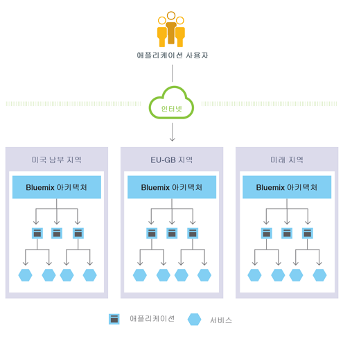
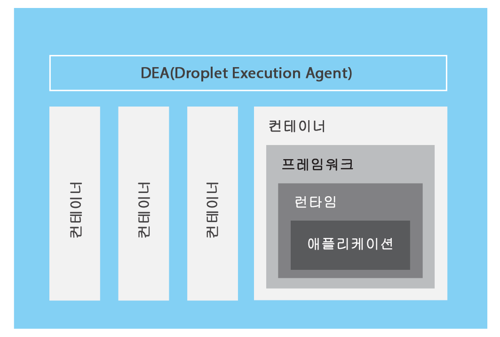

---

 

copyright:

  years: 2016

 

---

{:shortdesc: .shortdesc}
{:new_window: target="_blank"}

# {{site.data.keyword.Bluemix_notm}} Public
{: #public}
*마지막 업데이트 날짜: 2016년 2월 22일*


{{site.data.keyword.Bluemix_notm}}는 클라우드 기반 앱을 호스팅하고 관리하는 것과 연관된 대부분의 복잡성을 추상화하고 숨깁니다. 애플리케이션 개발자는 애플리케이션을 호스팅하는 데 필요한 인프라를 관리할 필요 없이 앱을 개발하는 데 집중할 수 있습니다.
{:shortdesc}

{{site.data.keyword.Bluemix_notm}}는 사용자의 요구사항에 맞는 클라우드 배치를 가지고 있습니다. 확장을 계획 중인 소기업이든 추가적인 분리가 필요한 대기업이든 규모에 관계없이 클라우드에서 경계 없이 개발을 할 수 있으며 이를 통해 사용자 전용 서비스를 {{site.data.keyword.IBM_notm}} 및 써드파티 제공자에서 제공하는 공용 {{site.data.keyword.Bluemix_notm}} 서비스에 연결할 수 있습니다. 모든 서비스 인스턴스는 {{site.data.keyword.IBM_notm}}에서 관리하고 사용하도록 선택한 서비스에 대해서만
요금이 청구됩니다. 

핵심은
{{site.data.keyword.Bluemix_notm}}는
앱을 개발하고 바로 사용 가능한 기능을 제공하는 서비스를
사용할 수 있는 환경이라는 점입니다. {{site.data.keyword.Bluemix_notm}}는
또한 Liberty와 같은 애플리케이션 서버에서 실행되는
애플리케이션 아티팩트를 호스팅하는 환경을 제공합니다. SoftLayer를 사용하여 {{site.data.keyword.Bluemix_notm}}는
배치된 각 앱을 호스팅하는 가상 컨테이너를 배치합니다. 이 환경에서
앱은 사전 빌드된 서비스(써드파티 서비스 포함)를 사용하여
앱 어셈블리를 간편하게 만들 수 있습니다. 

모바일 앱과 웹 앱의 경우,
{{site.data.keyword.Bluemix_notm}}에서 제공하는 사전 빌드된 서비스를 사용할 수 있습니다.
웹 앱을 {{site.data.keyword.Bluemix_notm}}에 업로드하고 실행할
인스턴스의 개수를 표시할 수 있습니다. 앱이 배치된 후에는 앱의 용도 또는 로드가 변경될 때
손쉽게 스케일을 확장하거나 축소할 수 있습니다. 

{{site.data.keyword.Bluemix_notm}}의 다양한 서비스 및 런타임을 사용하여
개발자는 제어권과 유연성을 확보할 수 있으며
예측 분석에서 빅데이터에 이르는 다양한 데이터 옵션에
액세스할 수 있습니다.

{{site.data.keyword.Bluemix_notm}}는 다음과 같은 기능을 제공합니다.

- 웹 및 모바일 앱을 신속하게 빌드하고 확장할 수 있는
다양한 서비스.
- 사용자가 애플리케이션 변경사항을 지속적으로 제공할 수 있는 처리 능력.
- 목적에 부합하는 프로그래밍 모델 및 서비스.
- 서비스 및 앱의 관리 능력.
- 최적화된 탄력적인 워크로드.
- 지속적인 가용성.

{{site.data.keyword.Bluemix_notm}}를 사용하면
자주 사용되는 프로그래밍 언어로 앱을 빠르게 개발할 수 있습니다. JavaScript를 사용하여 iOS, Android 및 HTML에서 모바일 앱을 개발할 수 있습니다. 웹 앱의 경우 Ruby, PHP, Java&trade;, Go, Python과 같은 언어를 사용할 수 있습니다. 기존 앱을 {{site.data.keyword.Bluemix_notm}}에 마이그레이션하고 {{site.data.keyword.Bluemix_notm}}에서 제공하는 런타임을 사용하여 앱을 실행할 수도 있습니다. 

{{site.data.keyword.Bluemix_notm}}는 또한 앱에서 사용할 미들웨어 서비스를 제공합니다. {{site.data.keyword.Bluemix_notm}}가 새 서비스 인스턴스를 프로비저닝한 다음 해당 서비스를 앱에 바인딩할 때 앱 대신 작동합니다. 앱이 실제 작업을 수행하고
서비스 관리는 인프라에서 처리하게 됩니다. 

## {{site.data.keyword.Bluemix_notm}} 공용 아키텍처
{: #publicarch}


일반적으로 {{site.data.keyword.Bluemix_notm}}에서 앱을 실행할 때 운영 체제 및 인프라 계층에 대해서는 우려할 필요가 없습니다. 사용자가 자신의 애플리케이션 코드에
집중할 수 있도록
루트 파일 시스템
및 미들웨어 컴포넌트 등의 계층은 추상화됩니다. 단,
앱이 실행되는 특정 계층에 대한 지식이 필요한 경우에는 해당 계층에 대해 자세히 볼 수 있습니다. 세부사항은 [{{site.data.keyword.Bluemix_notm}} 인프라 계층 보기](../cli/vcapsvc.html#viewinfra)를 참조하십시오.

개발자는 브라우저 기반 사용자 인터페이스를 사용하여
{{site.data.keyword.Bluemix_notm}} 인프라와 상호 작용할 수 있습니다.
또한 cf라는 Cloud Foundry 명령행 인터페이스를 사용하여 웹 앱을
배치할 수도 있습니다. 

모바일 앱, 외부에서 실행되는 앱, {{site.data.keyword.Bluemix_notm}}에서 빌드된 앱 또는 브라우저를 사용하는 개발자일 수 있는 클라이언트는 {{site.data.keyword.Bluemix_notm}}에서 호스팅되는 앱과 상호 작용합니다. 클라이언트는 REST 또는 HTTP API를 사용하여
{{site.data.keyword.Bluemix_notm}}를 통해
앱 인스턴스 또는 복합 서비스 중 하나로 요청을
라우팅합니다.

다음 그림에서는
상위 레벨 {{site.data.keyword.Bluemix_notm}} 아키텍처를 보여줍니다.


*그림 1. {{site.data.keyword.Bluemix_notm}} 아키텍처*

대기 시간이나 보안을 고려하여 앱을 다른 {{site.data.keyword.Bluemix_notm}}
지역에 배치할 수 있습니다. 한 지역에 배치하거나 여러 지역에 걸쳐 배치할지
선택할 수 있습니다. 자세한 정보는 [지역](index.html#ov_intro_reg)을 참조하십시오.




*그림 2. 다중 지역 애플리케이션 배치*

### {{site.data.keyword.Bluemix_notm}}의 작동 방식
{: #howwork}

앱을
{{site.data.keyword.Bluemix_notm}}에 배치할 때
앱을 지원하는 데 충분한 정보로 {{site.data.keyword.Bluemix_notm}}를
구성해야 합니다. 

* 모바일 앱의 경우 {{site.data.keyword.Bluemix_notm}}에는
모바일 앱의 백엔드(예: 모바일 앱이 서버와 통신하는 데 사용하는 서비스)를 나타내는
아티팩트가 포함됩니다. 
* 웹 앱의 경우 적절한 런타임 및 프레임워크 관련 정보가
{{site.data.keyword.Bluemix_notm}}에 전달되는지 확인하여
앱을 실행하기 위한 적절한 실행 환경을 설정할 수 있도록
해야 합니다. 

모바일 및 웹 모두를 포함하여, 각 실행 환경은
다른 앱의 실행 환경에서 격리됩니다. 이러한 실행 환경은 앱이 동일한 물리적 시스템에
있더라도 격리됩니다. 다음 그림에서는 {{site.data.keyword.Bluemix_notm}}가
앱의 배치를 관리하는 방법에 대한 기본 플로우를 보여줍니다. 


*그림 5. 앱 배치*

앱을 작성하고 이를 {{site.data.keyword.Bluemix_notm}}에 배치할 때 {{site.data.keyword.Bluemix_notm}} 환경에 따라 앱 및 이 앱이 나타내는 아티팩트를 보낼 적절한 가상 서버가 결정됩니다. 모바일 앱의 경우 모바일 백엔드 투영이
{{site.data.keyword.Bluemix_notm}}에 작성됩니다.
클라우드에서 실행 중인 모바일 앱의 코드는
{{site.data.keyword.Bluemix_notm}} 환경에서
실행됩니다. 웹 앱의 경우 클라우드에서 실행 중인 코드는 개발자가
{{site.data.keyword.Bluemix_notm}}에 배치하는 앱 자체입니다.
가상 서버는 다음을 포함하여 여러 요인을 기반으로 결정됩니다.

* 시스템의 기존 로드
* 해당 가상 서버에서 지원되는 런타임 또는 프레임워크

가상 서버를 선택한 후 각 가상 서버의 애플리케이션 관리자에서 앱에 적절한 프레임워크 및 런타임을 설치합니다. 그런 다음 앱이 해당 프레임워크로
배치될 수 있습니다. 배치가 완료되면
애플리케이션 아티팩트가 시작됩니다.

다음 그림에서는 여러 앱이 배치되어 있고 DEA(Droplet Execution Agent)라고도 하는 가상 서버의 구조를 보여줍니다.



*그림 6. 가상 서버 디자인*

각 가상 서버에서 애플리케이션 관리자는 {{site.data.keyword.Bluemix_notm}} 인프라의 나머지 부분과 통신하고 이 가상 서버에 배치되는 앱을 관리합니다. 각 가상 서버는 앱을 분리하고 보호하기 위한
컨테이너를 가지고 있습니다. 각 컨테이너에서 {{site.data.keyword.Bluemix_notm}}는 각 앱에
필요한 적절한 프레임워크 및 런타임을 설치합니다. 

앱을 배치할 때 웹 인터페이스(예: Java 웹 앱) 또는 다른 REST 기반 서비스(예: 모바일 앱에 공개적으로 노출된 모바일 서비스)가 있으면 앱의 사용자가 일반적인 HTTP 요청을 사용하여 앱과 통신할 수 있습니다. 


*그림 7. {{site.data.keyword.Bluemix_notm}} 앱 호출*

각 앱은 하나 이상의 URL과 연관될 수 있지만
이 URL은 모두 {{site.data.keyword.Bluemix_notm}} 엔드포인트를 가리켜야 합니다.
요청이 들어오면 {{site.data.keyword.Bluemix_notm}}는
요청을 검사하고, 이 요청이 사용되는 앱을 결정한 다음,
요청을 수신할 앱 인스턴스 중 하나를 선택합니다. 


## 지역
{: #ov_intro_reg}

{{site.data.keyword.Bluemix_notm}} 지역은 앱을 배치할 수 있는 정의된 지리적 영역입니다. 애플리케이션 관리를 위한 동일한 {{site.data.keyword.Bluemix_notm}} 인프라 및 대금 청구를 위한 동일한 사용량 세부사항을 사용하여 다른 지역에 앱 및 서비스 인스턴스를 작성할 수 있습니다. 고객과 가장 가까이에 있는 지역을 선택하고
이 지역에 앱을 배치하여 애플리케이션 대기 시간을 단축할 수 있습니다. 또한 보안 문제를 해결하기 위해
애플리케이션 데이터를 보관할 지역을
선택할 수도 있습니다. 앱을 여러 지역에서 빌드할 경우
이 중 한 지역의 작동이 중지되면 다른 지역에 있는 앱은 계속 실행됩니다.
허용되는 자원 양은 사용하는 각 지역마다 동일합니다.

{{site.data.keyword.Bluemix_notm}}
사용자 인터페이스를 사용하고 있는 경우 다른 지역으로 전환하여
해당 지역의 영역에 대해 작업할 수 있습니다.

cf 명령행 인터페이스를 사용하고 있는 경우 cf api 명령을 사용하고 지역의 API 엔드포인트를 지정하여 작업하려는 {{site.data.keyword.Bluemix_notm}} 지역에 연결해야 합니다. 예를 들어,
{{site.data.keyword.Bluemix_notm}} 유럽 영국 지역에 연결하려면 다음 명령을 입력하십시오.

```
cf api https://api.eu-gb.{{site.data.keyword.Bluemix_notm}}.net
```

Eclipse 도구를 사용하고 있는 경우
{{site.data.keyword.Bluemix_notm}} 서버를 작성하고
지역의 API 엔드포인트를 지정하여
작업하려는 {{site.data.keyword.Bluemix_notm}} 지역에 연결해야 합니다.
Eclipse 도구를 사용하는 방법에 대한 자세한 정보는 [{{site.data.keyword.IBM_notm}} Eclipse Tools for {{site.data.keyword.Bluemix_notm}}를 사용하여 앱 배치](../manageapps/eclipsetools/eclipsetools.html#toolsinstall)를 참조하십시오.

각 지역에
고유한 접두부가 지정됩니다. {{site.data.keyword.Bluemix_notm}}는
다음과 같은 지역 및 지역 접두부를 제공합니다. 

<!-- PRODUCTION ONLY: Ensure that URLs are production URLs, not stage1-->

| **지역 이름** | **지리적 위치** | **지역 접두부** | **cf API 엔드포인트** | **UI 콘솔** |       
|-----------------|-------------------------|-------------------|---------------------|----------------|
| 미국 남부 지역 | 달라스, 미국 | ng | api.ng.bluemix.net | console.ng.bluemix.net |
| 영국 지역 | 런던, 영국 | eu-gb | api.eu-gb.bluemix.net | console.eu-gb.bluemix.net |
| 시드니 지역 | 시드니, 오스트레일리아 | au-syd | api.au-syd.bluemix.net | console.au-syd.bluemix.net |

*표 1. {{site.data.keyword.Bluemix_notm}} 지역 목록*


## {{site.data.keyword.Bluemix_notm}} 복원력
{: #resiliency}

{{site.data.keyword.Bluemix_notm}}는
사용자 요구사항을 충족할 수 있도록 확장 가능하면서 고가용성을 유지하고 문제점에서 빠르게 복구할 수 있는,
확장 가능하고 복원 능력을 갖춘 앱 및 애플리케이션 아티팩트를 호스팅하도록
디자인되었습니다. {{site.data.keyword.Bluemix_notm}}는 상호작용의 상태를 추적하는 컴포넌트(stateful)를 그렇지 않은 컴포넌트(stateless)와 구분합니다. 이러한 구분을 통해 {{site.data.keyword.Bluemix_notm}}는
확장성과 복원력을 달성하는 데 필요한 만큼 앱을 유연하게 이동할 수 있습니다.

앱에 대해
실행 중인 인스턴스가 하나 이상 있을 수 있습니다. 하나의 앱에 대해
인스턴스가 여러 개인 경우 앱이 한 번만
업로드됩니다. 하지만 {{site.data.keyword.Bluemix_notm}}는 요청된 수의 앱 인스턴스를 배치하고 가능한 한 많은 가상 서버에 앱을 분배합니다.

앱 외부에 있는
Stateful 데이터 저장소(예: {{site.data.keyword.Bluemix_notm}}에서
제공하는 데이터 저장소 서비스 중 하나)에 모든 지속적 데이터를 저장해야 합니다.
다시 시작한 후에도 메모리 또는 디스크에 캐시된 항목을
사용하지 못할 수 있으므로
단일 {{site.data.keyword.Bluemix_notm}} 인스턴스의
메모리 공간 또는 파일 시스템을 간단한 단일 트랜잭션 캐시로
사용할 수 있습니다. 단일 인스턴스 설정을 사용하면
{{site.data.keyword.Bluemix_notm}}의
Stateless 특성 때문에 앱에 대한 요청이 중단될 수 있습니다.
앱의 가용성을 보장하기 위해 각 앱에 대해 3개 이상의 인스턴스를
사용하는 것이 좋습니다. 

모든 {{site.data.keyword.Bluemix_notm}} 인프라, Cloud Foundry 컴포넌트 및 {{site.data.keyword.IBM_notm}} 특정 관리 컴포넌트는 가용성이 높습니다. 인프라의 여러 인스턴스는 로드의 균형을 유지하는 데
사용됩니다.

## SOR(System of Record)과 통합
{: #sor}

{{site.data.keyword.Bluemix_notm}}는
클라우드 환경의 두 가지 광범위한 시스템 카테고리, 즉
SOR(System of Record) 및 SOE(System of Engagement)를 연결함으로써 개발자를 지원할 수 있습니다.

*SOR(System of Record)*에는 비즈니스 레코드를 저장하고 표준화된 프로세스를 자동화하는 앱 및 데이터베이스가 포함됩니다. *SOE(System of Engagement)*는 SOR(System of Record)의 유용성을 확장하고
사용자에게 보다 광범위하게 적용할 수 있도록 만드는 기능입니다. {{site.data.keyword.Bluemix_notm}}에서 작성한 앱과 SOR(System of Record)을 통합하여 다음 조치를 수행할 수 있습니다.

 * 사내 구축형 보안 커넥터를 다운로드하고 설치하여 앱과 백엔드 데이터베이스 간의 보안 통신을 사용하도록 합니다.
 * 데이터베이스를 안전한 방식으로 호출합니다.
 * 고객 관계 관리 시스템과 같이 데이터베이스 및 백엔드 시스템이 있는
통합 플로우에서 API를 작성합니다.
 * 앱에 노출할 스키마 및 테이블만 노출합니다.
 * {{site.data.keyword.Bluemix_notm}}
조직 관리자로서 조직 구성원에게만 표시되는
개인 서비스로 API를 공개합니다.

{{site.data.keyword.Bluemix_notm}}에서 작성한 앱과 SOR(System of Record)을 통합하려면 클라우드 통합 서비스를 사용합니다. 클라우드 통합 서비스를 사용하여 Cloud Integration API를 작성하고 API를 조직의 개인 서비스로 공개할 수 있습니다.

<dl>
<dt>Cloud Integration API</dt>
    <dd>Cloud Integration API는 웹 API를 통해 방화벽 뒤에 있는 SOR(System of Record)에 대한 보안 액세스를 제공합니다. Cloud Integration API를 작성할 때 웹 API를 통해 액세스하려는 자원을 선택하고 허용되는 오퍼레이션을 지정하고 API에 액세스하기 위해 SDK와 샘플을 포함합니다. Cloud Integration API를 작성하는 방법에 대한 자세한 정보는 [Cloud Integration API 작성](../services/CloudIntegration/index.html#cloudint_add_service)을 참조하십시오.</dd>
<dt>개인 서비스</dt>
    <dd>개인 서비스는 Cloud Integration API, SDK 및 자격부여 정책으로 구성됩니다. 또한 개인 서비스에는
서비스 제공업체가 제공하는 문서 또는 기타 항목이 포함될 수 있습니다.
조직 관리자만 Cloud Integration API를 개인 서비스로 공개할 수 있습니다. 사용자에게 제공되는 개인 서비스를 보려면 {{site.data.keyword.Bluemix_notm}} 카탈로그에서 개인 선택란을 선택하십시오. 클라우드 통합 서비스에 연결하지 않고 개인 서비스를 선택하고 앱에 바인딩할 수 있습니다. 다른 {{site.data.keyword.Bluemix_notm}} 서비스에서와 동일한 방식으로 개인 서비스를 앱에 바인딩합니다. API를 개인 서비스로 공개하는 방법에 대한 자세한 정보는 API를 개인 서비스로 공개를 참조하십시오. </dd>
</dl>

### 시나리오: SOR(System of Record)에 연결할 RMA(Rich Mobile Application) 작성
{: #scenario}

{{site.data.keyword.Bluemix_notm}}는 사내 구축형 데이터와 상호 작용하는 앱을 제공하기 위해 엔터프라이즈 SOR(System of Record), 모바일 앱 및 클라우드 서비스를 통합할 수 있는 플랫폼을 제공합니다.

예를 들어, 방화벽 뒤에 사내 구축형으로 있는
고객 관계 관리 시스템과 상호 작용하는 모바일 앱을
빌드할 수 있습니다. SOR(System of Record)을 안전한 방식으로 호출하고 RMA(Rich Mobile Application)를 빌드할 수 있도록 {{site.data.keyword.Bluemix_notm}}에서 모바일 서비스를 활용할 수 있습니다. 

먼저 통합 개발자가 {{site.data.keyword.Bluemix_notm}}에서 모바일 백엔드 앱을 작성합니다.
그는 가장 친숙한 Node.js 런타임을 사용하는
Mobile Cloud 표준 유형을 사용합니다.

그런 다음 {{site.data.keyword.Bluemix_notm}}사용자 인터페이스에서 클라우드 통합 서비스를 사용하여 보안 커넥터를 통해 API를 노출합니다. 통합 개발자는 보안 커넥터를 다운로드하고
이를 사내 구축형으로 설치하여 API와 데이터베이스 사이의
보안 통신을 지원합니다. 데이터베이스 엔드포인트를 작성한 후 모든 스키마를 보고 앱에 API로 노출할 테이블을 추출할 수 있습니다. 

통합 개발자는 푸시 서비스를 추가하여 모바일 알림을 관심 있는 이용자에게 제공합니다. 또한 새 고객 레코드가
Twitter API를 사용하여 작성된 경우 비즈니스 파트너 서비스도
트윗에 추가합니다.

그런 다음 애플리케이션 개발자가
{{site.data.keyword.Bluemix_notm}}에 로그인하고 Android 개발 툴킷을 다운로드하고
통합 개발자가 작성한 API를 호출하는 코드를 개발할 수 있습니다.
사용자가 모바일 디바이스에 관련 정보를 입력할 수 있는 모바일 앱을 개발할 수 있습니다. 그런 다음 모바일 앱이 고객 관리 시스템에서
고객 레코드를 작성합니다. 레코드가 작성되면 앱이 알림을 모바일 디바이스로 푸시하고 새 레코드에 대해 트윗을 시작합니다. 

# 관련 링크
## 일반
* [{{site.data.keyword.Bluemix_notm}}의 새로운 기능](../whatsnew/index.html)
* [{{site.data.keyword.Bluemix_notm}} 필수 소프트웨어](https://developer.ibm.com/bluemix/support/#prereqs)
* [{{site.data.keyword.Bluemix_notm}} 알려진 문제](https://developer.ibm.com/bluemix/support/#issues)
* [계정 관리](../admin/adminpublic.html#mngacct)
* [{{site.data.keyword.Bluemix_notm}} 용어집](../overview/glossary/index.html)
