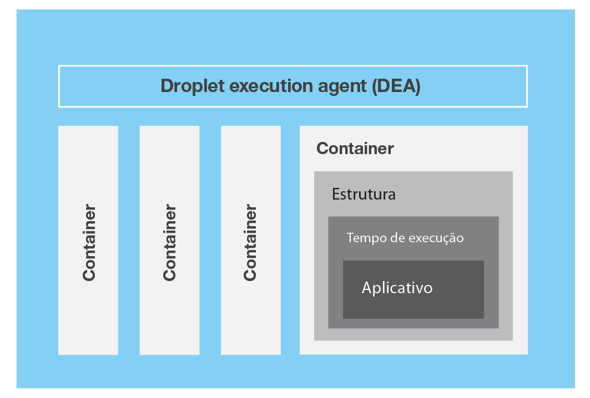
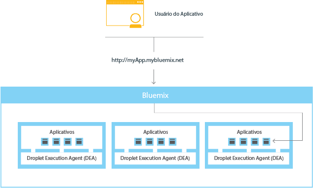

---

 

copyright:

  years: 2016

 

---

{:shortdesc: .shortdesc}
{:new_window: target="_blank"}

# {{site.data.keyword.Bluemix_notm}} Público
{: #public}
*Última atualização: 22 de fevereiro de 2016*


O {{site.data.keyword.Bluemix_notm}} sumariza e oculta
a maioria das complexidades que estão associadas à hospedagem e
ao gerenciamento de apps baseados em nuvem. Como desenvolvedor de
aplicativos, é possível concentrar-se no desenvolvimento de seu app sem precisar gerenciar a infraestrutura que é necessária para hospedá-lo.
{:shortdesc}

O {{site.data.keyword.Bluemix_notm}} tem implementações de nuvem que se ajustam às suas necessidades. Se
você é uma pequena empresa que pretende escalar ou uma grande empresa
que requer isolamento adicional, é possível o desenvolvimento
ilimitado em uma nuvem, na qual é possível conectar seus serviços
dedicados aos serviços públicos do {{site.data.keyword.Bluemix_notm}}
disponíveis a partir de fornecedores
{{site.data.keyword.IBM_notm}} e de terceiros. Todas as instâncias de serviço são gerenciadas pela {{site.data.keyword.IBM_notm}}. Você obterá uma fatura para somente o que escolher usar.

Em seu núcleo, o {{site.data.keyword.Bluemix_notm}} é
um ambiente para desenvolver apps e usar serviços que forneçam funções prontas para usar. O {{site.data.keyword.Bluemix_notm}} também
fornece um ambiente para hospedar artefatos de aplicativo que são executados em
um servidor de aplicativos, como o Liberty. Ao usar o SoftLayer, o {{site.data.keyword.Bluemix_notm}} implementa
contêineres virtuais que hospedam cada app implementado. Nesse ambiente,
o aplicativo pode usar serviços pré-integrados (incluindo serviços de
terceiros) para facilitar a montagem do app.

Para apps móveis e da web, é possível usar os serviços pré-integrados que são fornecidos pelo {{site.data.keyword.Bluemix_notm}}. É possível fazer upload do app da web para o {{site.data.keyword.Bluemix_notm}} e
indicar quantas instâncias você deseja executar. Após a implementação dos apps, é possível facilmente aumentar ou reduzir
sua capacidade quando o uso ou o carregamento dos apps mudar.

Com o amplo conjunto de serviços e tempos de execução no {{site.data.keyword.Bluemix_notm}},
o desenvolvedor obtém controle e flexibilidade, além de acesso a diversas
opções de dados, da análise preditiva a big data.

O {{site.data.keyword.Bluemix_notm}} fornece
os recursos a seguir:

- Um intervalo de serviços que permitem construir e estender apps da web
e móveis rapidamente.
- O poder de processamento para a entrega de mudanças
contínuas no aplicativo.
- Modelos de programação e serviços adequados para o propósito.
- Capacidade de gerenciamento de serviços e apps.
- Cargas de trabalho otimizadas e elásticas.
- Disponibilidade contínua.

É possível usar o {{site.data.keyword.Bluemix_notm}} para
desenvolver rapidamente apps nas linguagens de programação mais populares. É possível desenvolver apps móveis em iOS, Android e HTML com JavaScript. Para
apps da web, é possível usar linguagens como Ruby, PHP, Java&trade;,
Go e Python. Também é possível migrar apps existentes para o
{{site.data.keyword.Bluemix_notm}} e usar os tempos de
execução que o {{site.data.keyword.Bluemix_notm}}
fornece para executar seus apps.

O {{site.data.keyword.Bluemix_notm}} também fornece
serviços de middleware para uso por seus apps. O {{site.data.keyword.Bluemix_notm}}
age em nome do app quando ele fornece novas instâncias de serviço e, em
seguida, liga esses serviços ao app. O seu app pode executar sua tarefa real, deixando o gerenciamento dos serviços para a infraestrutura.

## Arquitetura do {{site.data.keyword.Bluemix_notm}} Public
{: #publicarch}


Em geral, você não precisa se preocupar com o sistema
operacional e as camadas de infraestrutura ao executar apps no {{site.data.keyword.Bluemix_notm}}. Camadas
como sistemas de arquivos raiz e componentes de middleware são abstraídas para que você possa focar em seu
código do aplicativo. No entanto, é possível saber mais sobre estas camadas se precisar de informações específicas sobre onde seu
app está sendo executado. Veja [Visualizando camadas de infraestrutura do {{site.data.keyword.Bluemix_notm}}](../cli/vcapsvc.html#viewinfra) para obter detalhes.

Como desenvolvedor, é possível interagir com a infraestrutura do {{site.data.keyword.Bluemix_notm}},
usando uma interface com o usuário baseada no navegador. Também é possível usar uma interface de linha de comandos Cloud Foundry, chamada cf, para implementar apps da web.

Os clientes---que podem ser apps móveis, apps executados
externamente, apps que são construídos no
{{site.data.keyword.Bluemix_notm}} ou desenvolvedores que
estejam usando navegadores---interagem com os apps hospedados pelo
{{site.data.keyword.Bluemix_notm}}. Os clientes usam APIs REST ou HTTP para rotear solicitações por meio do {{site.data.keyword.Bluemix_notm}} para
uma das instâncias do app ou para os serviços compostos.

A figura a seguir mostra a arquitetura de alto nível do {{site.data.keyword.Bluemix_notm}}.


*Figura 1.
Arquitetura do {{site.data.keyword.Bluemix_notm}}*

É possível implementar seus apps em diferentes regiões do {{site.data.keyword.Bluemix_notm}}, para considerações de latência ou segurança. É possível optar por implementar para uma região ou entre várias regiões. Para obter mais informações, consulte [Regiões](index.html#ov_intro_reg).


*Figura 2. Implementação do aplicativo multiregion*

### Como o {{site.data.keyword.Bluemix_notm}} funciona
{: #howwork}

Ao
implementar um aplicativo no {{site.data.keyword.Bluemix_notm}},
deve-se configurar o {{site.data.keyword.Bluemix_notm}} com
informações suficientes para suportar o app.

* Para um app móvel, o {{site.data.keyword.Bluemix_notm}} contém
um artefato que representa o backend do app móvel, tal como os serviços usados pelo app móvel para se comunicar com
um servidor.
* Para um app da web, deve-se assegurar que as informações sobre o tempo de execução
e a estrutura adequados sejam comunicadas ao {{site.data.keyword.Bluemix_notm}},
para que ele possa configurar o ambiente de execução adequado para executar o app.

Cada ambiente de execução, incluindo o ambiente móvel e
o ambiente da web, é isolado do ambiente de execução de outros apps. Os ambientes de execução são isolados embora esses apps estejam
na mesma máquina física. A figura a seguir mostra o fluxo
básico de como o {{site.data.keyword.Bluemix_notm}} gerencia
a implementação de apps:


*Figura 5. Implementando um app*

Ao criar um app e implementá-lo no {{site.data.keyword.Bluemix_notm}}, o ambiente do {{site.data.keyword.Bluemix_notm}} determina um servidor virtual apropriado para o qual o app ou os artefatos que o app representa são enviados. Para um aplicativo móvel, uma projeção de backend móvel é criada no {{site.data.keyword.Bluemix_notm}}. Qualquer código para o app móvel em execução na nuvem finalmente é executado
no ambiente do {{site.data.keyword.Bluemix_notm}}. Para um app da web, o código em execução na nuvem é o próprio app que o desenvolvedor implementa no {{site.data.keyword.Bluemix_notm}}. A determinação do servidor virtual é baseada em vários fatores, incluindo:

* A carga que já está na máquina
* Tempos de execução ou estruturas suportados por esse servidor virtual.

Após um servidor virtual ser escolhido, um gerente de aplicativos instala em cada servidor virtual a estrutura e o tempo de execução adequados para o app. Em seguida, o app pode ser implementado nessa estrutura. Quando a implementação é concluída,
os artefatos de aplicativo são iniciados.

A figura a seguir mostra a estrutura de um servidor virtual, também conhecida como Droplet Execution Agent (DEA), que possui vários apps implementados nele:



*Figura 6. Design de um servidor virtual*

Em cada servidor virtual, um gerente de aplicativos se comunica com o restante da infraestrutura do {{site.data.keyword.Bluemix_notm}} e gerencia os apps implementados nesse servidor virtual. Cada servidor virtual possui contêineres para separar e proteger os apps. Em cada contêiner, o {{site.data.keyword.Bluemix_notm}} instala
a estrutura e o tempo de execução apropriados necessários para cada app.

Quando o app for implementado, se ele tiver uma interface da web
(como um app da web Java) ou outros serviços baseados em REST (como
serviços móveis expostos publicamente para o app móvel), os usuários do app poderão se comunicar com ele usando solicitações normais de HTTP.



*Figura 7. Chamando um app do
{{site.data.keyword.Bluemix_notm}}*

Cada app pode ter uma ou mais URLs associadas
a ele, mas todas elas devem apontar para o terminal do {{site.data.keyword.Bluemix_notm}}. Quando chega uma solicitação, o {{site.data.keyword.Bluemix_notm}} a examina,
determina para qual app ela se destina e, em seguida, seleciona uma das instâncias do app para receber a solicitação.


## Regiões
{: #ov_intro_reg}

Uma região do {{site.data.keyword.Bluemix_notm}} é um
território geográfico definido no qual você pode  implementar
seus apps. É possível criar apps e instâncias de serviço em diferentes regiões com a mesma infraestrutura do {{site.data.keyword.Bluemix_notm}} para gerenciamento de aplicativos e a mesma visualização de detalhes de uso para faturamento. É possível selecionar a região mais próxima aos seus clientes e implementar seus
apps nessa região para obter baixa latência do aplicativo. Também é possível selecionar a
região em que você deseja manter os dados do aplicativo por questões de segurança de endereço. Ao construir apps em diversas regiões, se uma região ficar inativa, os apps que estão nas outras regiões continuarão a executar. A concessão de seu recurso é a mesma para cada região que você usa.

Se estiver usando a interface com o usuário do {{site.data.keyword.Bluemix_notm}},
poderá alternar para uma região diferente para trabalhar com os espaços dessa região.

Se você estiver utilizando a interface de linha de comandos do
cf, deverá se conectar à região do
{{site.data.keyword.Bluemix_notm}} com a qual deseja
trabalhar usando o comando api e especificando o terminal de API
da região. Por exemplo, insira o comando a seguir para conectar-se à região do Reino Unido na Europa
{{site.data.keyword.Bluemix_notm}}:

```
cf api https://api.eu-gb.{{site.data.keyword.Bluemix_notm}}.net
```

Se
você estiver usando as ferramentas Eclipse, deve-se conectar à região do {{site.data.keyword.Bluemix_notm}}
com a qual deseja trabalhar criando um servidor {{site.data.keyword.Bluemix_notm}}
e especificando o terminal da API da região. Para obter informações
adicionais sobre como usar as ferramentas Eclipse, consulte
[Implementando
apps com {{site.data.keyword.IBM_notm}} Eclipse Tools for {{site.data.keyword.Bluemix_notm}}](../manageapps/eclipsetools/eclipsetools.html#toolsinstall).

Um prefixo exclusivo é designado a cada região. O {{site.data.keyword.Bluemix_notm}} fornece
as regiões e os prefixos de regiões a seguir.

<!-- PRODUCTION ONLY: Ensure that URLs are production URLs, not stage1-->

| **Nome da região** | **Localização geográfica
** | **Prefixo da região** | **Terminal
de API cf** | **Console da interface com o usuário** |       
|-----------------|-------------------------|-------------------|---------------------|----------------|
| Região Sul dos EUA | Dallas, EUA | ng | api.ng.bluemix.net | console.ng.bluemix.net |
| Região do Reino Unido | Londres, Inglaterra | eu-gb | api.eu-gb.bluemix.net | console.eu-gb.bluemix.net |
| Região de Sydney | Sydney, Austrália | au-syd | api.au-syd.bluemix.net | console.au-syd.bluemix.net |

*Tabela 1. Lista
de regiões do {{site.data.keyword.Bluemix_notm}}*


## Resiliência do {{site.data.keyword.Bluemix_notm}}
{: #resiliency}

O {{site.data.keyword.Bluemix_notm}} é projetado para hospedar apps resilientes escaláveis pelo host e artefatos de aplicativos que podem ambos escalar para atender às necessidades e permanecer altamente disponíveis e rápidos para recuperar de problemas. O
{{site.data.keyword.Bluemix_notm}}
separa os componentes que controlam o estado das interações (stateful)
daqueles que não o controlam (stateless). Essa separação permite que o {{site.data.keyword.Bluemix_notm}}
mova apps flexivelmente conforme necessário, para obter escalabilidade e resiliência.

Pode haver uma ou mais
instâncias em execução para seu app. Quando há várias instâncias para um app, o app é transferido por upload somente uma vez. No entanto, o {{site.data.keyword.Bluemix_notm}} implementa o número de instâncias do app solicitadas e as distribui entre quantos servidores virtuais for possível.

Devem-se salvar todos os dados persistentes em um armazenamento de dados stateful que esteja fora de seu app, como em um dos serviços de armazenamento de dados que são fornecidos pelo {{site.data.keyword.Bluemix_notm}}. Como qualquer coisa armazenada em cache na memória ou em disco pode não estar disponível
ainda após uma reinicialização, é possível usar o espaço de memória ou sistema de arquivos de
uma única instância do {{site.data.keyword.Bluemix_notm}}
como um cache de transação única sintetizada. Com uma configuração de instância única, a solicitação para seu app pode ser interrompida por causa da
natureza stateless do {{site.data.keyword.Bluemix_notm}}. A melhor prática é usar pelo menos três instâncias para cada app para assegurar a disponibilidade de seu app.

Toda a infraestrutura do
{{site.data.keyword.Bluemix_notm}},
os componentes do Cloud Foundry e os componentes de gerenciamento
específicos da {{site.data.keyword.IBM_notm}} são altamente
disponíveis. Várias instâncias da infraestrutura são usadas
para equilibrar a carga.

## Integração com sistemas de registro
{: #sor}

O {{site.data.keyword.Bluemix_notm}} pode
ajudar os desenvolvedores conectando duas categorias amplas de sistemas em um
ambiente de nuvem: sistemas de registro e sistemas de engajamento.

*Sistemas de registro* inclui apps e bancos de dados que armazenam registros de negócios e automatizam processos padronizados. *Sistemas
de engajamento* são recursos que expandem a utilidade dos
sistemas de registro e os tornam mais envolventes para os usuários.
Ao integrar um sistema de registro ao app que você cria no
{{site.data.keyword.Bluemix_notm}}, pode executar as
seguintes ações:

 * Ativar a comunicação segura entre o app e o banco de dados
backend, fazendo o download e instalando um conector seguro no local.
 * Chamar um banco de dados de uma maneira segura.
 * Criar APIs a partir de fluxos de integração com bancos de dados e sistemas
backend, como o sistema de gerenciamento de relacionamento com o cliente.
 * Expor somente os esquemas e as tabelas que você deseja que
sejam expostos ao app.
 * Como gerente da organização {{site.data.keyword.Bluemix_notm}},
publique uma API como um serviço privado que seja visível somente aos membros de sua organização.

Para integrar um sistema de registro com o app que você cria no
{{site.data.keyword.Bluemix_notm}}, use o serviço Cloud
Integration. Com o serviço Cloud Integration, é possível criar uma API de Cloud Integration e publicar a API como um serviço privado para sua organização.

<dl>
<dt>API de Cloud Integration</dt>
    <dd>Uma API de Cloud Integration fornece acesso seguro para os sistemas de registro que residem por trás de um firewall por meio das APIs da web. Ao criar a API de Cloud Integration, escolha o recurso que deseja acessar por meio da API da web, especifique as operações que são permitidas e inclua SDKs e amostras para acessar a API. Para obter mais informações sobre como criar uma API de Cloud Integration, consulte [Criando APIs de Cloud Integration](../services/CloudIntegration/index.html#cloudint_add_service).</dd>
<dt>Serviço privado</dt>
    <dd>Um serviço privado consiste em uma API de Cloud Integration, SDKs e políticas de autorização. Além disso, o serviço privado pode conter documentação ou outros itens do
provedor de serviços. Somente o gerenciador de organização pode publicar uma API de Cloud Integration como um serviço privado. Para
ver os serviços privados que estão disponíveis para você,
marque a caixa de seção Privado no catálogo do {{site.data.keyword.Bluemix_notm}}. É
possível selecionar e ligar um serviço privado a um app sem se conectar ao serviço Cloud Integration. Você
liga serviços privados ao seu app da mesma maneira que faz com outros
serviços {{site.data.keyword.Bluemix_notm}}. Para obter informações sobre como publicar uma API como um serviço privado,
consulte Publicando uma API como um serviço privado.</dd>
</dl>

### Cenário: Criando um app móvel avançado para conexão
com o sistema de registro
{: #scenario}

O {{site.data.keyword.Bluemix_notm}} fornece uma
plataforma na qual é possível integrar seu app móvel, os serviços de
nuvem e os sistemas corporativos de registro para fornecer um app que interaja com os dados no local.

Por exemplo, é possível construir um app
móvel para interagir com o sistema de gerenciamento de relacionamento com o cliente
que reside no local protegido por um firewall. É possível chamar o
sistema de registro de uma maneira segura e alavancar os serviços móveis no {{site.data.keyword.Bluemix_notm}} para que seja possível construir um app móvel avançado.

Primeiro, seu desenvolvedor de integração cria o app de backend
móvel no {{site.data.keyword.Bluemix_notm}}. Ele usa o modelo
Nuvem para dispositivo móvel que usa o tempo de execução Node.js
com o qual ele está mais familiarizado.

Depois, usando o serviço Cloud Integration na
interface com o usuário do
{{site.data.keyword.Bluemix_notm}}, ele expõe uma API por meio de um conector seguro. Seu desenvolvedor de
integração faz o download do conector seguro e instala-o no local
para permitir uma comunicação segura entre sua API e o banco de dados. Depois
de criar o terminal de banco de dados, é possível examinar todos os esquemas e extrair as tabelas que ele deseja expor como APIs para o app.

Seu desenvolvedor de integração inclui o serviço de push para entregar notificações móveis aos consumidores interessados. Ele também inclui
um serviço de parceiro de negócios para publicar um tweet quando um novo registro de cliente for
criado com uma API do Twitter.

Em seguida, como desenvolvedor de aplicativos,
é possível efetuar login no {{site.data.keyword.Bluemix_notm}},
fazer o download do kit de ferramentas de desenvolvimento do Android e desenvolver código que chame
as APIs criadas pelo desenvolvedor de integração. É possível
desenvolver um app móvel que permita aos usuários inserir suas
informações em seus dispositivos móveis. O app móvel cria então um registro do cliente
no sistema de gerenciamento do cliente. Quando o registro é criado, o
app envia uma notificação para um dispositivo móvel e inicia
um tweet sobre o novo registro.

# rellinks
## gerais
* [O que há de novo no {{site.data.keyword.Bluemix_notm}}](../whatsnew/index.html)
* [Pré-requisitos do {{site.data.keyword.Bluemix_notm}}](https://developer.ibm.com/bluemix/support/#prereqs)
* [Problemas conhecidos do {{site.data.keyword.Bluemix_notm}}](https://developer.ibm.com/bluemix/support/#issues)
* [Gerenciando sua conta](../admin/adminpublic.html#mngacct)
* [{{site.data.keyword.Bluemix_notm}} glossário](../overview/glossary/index.html)
