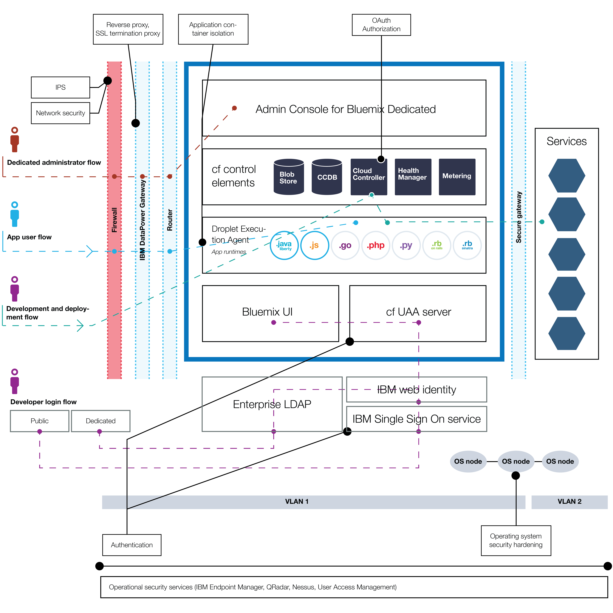

{:shortdesc: .shortdesc}

# {{site.data.keyword.Bluemix_notm}} security
{: #security}
*Last updated: 9 November 2015*

Designed with secure engineering practices, the {{site.data.keyword.Bluemix}} platform has layered security controls across network and infrastructure. {{site.data.keyword.Bluemix_notm}} also provides a suite of security services that can be used by application developers to secure their mobile and web apps. These elements combine to make {{site.data.keyword.Bluemix_notm}} a platform with clear choices for secure application development.
{:shortdesc}

{{site.data.keyword.Bluemix_notm}} ensures security readiness by adhering to security policies that are driven by best practices in IBM for systems, networking, and secure engineering. These policies include practices such as source code scanning, dynamic scanning, threat modeling, and penetration testing. {{site.data.keyword.Bluemix_notm}} follows the IBM Product Security Incident Response Team (PSIRT) process for security incident management. See the [IBM Security Vulnerability Management (PSIRT)](http://www-03.ibm.com/security/secure-engineering/process.html) site for details.

{{site.data.keyword.Bluemix_notm}} Public and Dedicated use IBM SoftLayer Infrastructure-as-a-Service (IaaS) cloud services and take full advantage of its security architecture. SoftLayer IaaS provides multiple, overlapping tiers of protection for your applications and data. For {{site.data.keyword.Bluemix_notm}} Local, you own the physical security and provide the infrastructure by hosting {{site.data.keyword.Bluemix_notm}} Local in your own data center behind a company firewall. In addition, {{site.data.keyword.Bluemix_notm}} adds security capabilities at the Platform as a Service layer in different categories: platform, data, and application.

## Security of the {{site.data.keyword.Bluemix_notm}} platform
{: #platform-security}

{{site.data.keyword.Bluemix_notm}} provides functional, infrastructure, operational, and physical security (through IBM SoftLayer) for the core platform. However, {{site.data.keyword.Bluemix_notm}} Local is unique in that the customer provides the infrastructure and data center, and owns the physical security.

The {{site.data.keyword.Bluemix_notm}} environment on SoftLayer is compliant with the most restrictive IBM information technology (IT) security standards, which meet or exceed the industry standards. These standards include the following:
Network, data encryption, and access control
 * Application ACLs, permissions, and penetration testing
 * Identification, authentication, and authorization
 * Information and data protection
 * Service integrity and availability
 * Vulnerability and fix management
 * Denial of service and systematic attacks detection
 * Security incident response

*Figure 1. {{site.data.keyword.Bluemix_notm}} platform security overview*

The security for {{site.data.keyword.Bluemix_notm}} Local differs because you own specific pieces of security by hosting Bluemix behind your company firewall and in your data center. The following image details which parts of security are customer-owned and which parts of security are managed and maintained by IBM.

*Figure 2. {{site.data.keyword.Bluemix_notm}} Local platform security overview*

### Functional security

{{site.data.keyword.Bluemix_notm}} provides various functional security capabilities, including user authentication, access authorization, auditing of critical operations, and data protection.

<dl>
<dt>Authentication</dt>
<dd>Application developers are authenticated to {{site.data.keyword.Bluemix_notm}} by using the IBM web identity.

For {{site.data.keyword.Bluemix_notm}} Dedicated and Local, authentication through LDAP is supported by default. On request, authentication through IBM web identity can be set up instead for {{site.data.keyword.Bluemix_notm}}.
</dd>

<dt>Authorization</dt>
<dd>{{site.data.keyword.Bluemix_notm}} uses Cloud Foundry mechanisms to ensure that each application developer has access only to the applications and service instances that they created. Authorization to {{site.data.keyword.Bluemix_notm}} services is based on OAuth. Access to all {{site.data.keyword.Bluemix_notm}} Platform internal endpoints are restricted to external users.</dd>

<dt>Auditing</dt>
<dd>Audit logs are created for all successful and unsuccessful authentication attempts of application developers. Audit logs are created also for privileged access to Linux systems that host the containers where {{site.data.keyword.Bluemix_notm}} applications run.</dd>

<dt>Data protection</dt>
<dd> All {{site.data.keyword.Bluemix_notm}} traffic goes through the IBM WebSphere® DataPower® SOA Appliances, which provide reverse proxy, SSL termination, and load balancing functions.
The following HTTP methods are allowed:
 * DELETE
 * GET
 * HEAD
 * OPTIONS
 * POST
 * PUT
 * TRACE

HTTP inactivity times out at 2 minutes.

The following headers are populated by DataPower:
<dl>
<dt>$wsis</dt>
<dd>Set to true if client-side connection is secure (HTTPS), set to false otherwise.</dd>
<dt>$wssc</dt>
<dd>Set to one of the following schemes of client connection: https, http, ws, or wss.</dd>
<dt>$wssn</dt>
<dd>Set to host name that is sent by client.</dd>
<dt>$wssp</dt>
<dd>Set to server port that client connects to.</dd>
<dt>x-client-ip</dt>
<dd>Set to client IP address.</dd>
<dt>x-forwarded-proto</dt>
<dd>Set to one of the following schemes of client connection: https, http, ws, or wss.</dd>
</dl>
</dd>

<dt>Secure development practices</dt>
<dd> For {{site.data.keyword.Bluemix_notm}} Public and Dedicated, periodic security vulnerability scans are performed on various {{site.data.keyword.Bluemix_notm}} components by using IBM Security AppScan® Dynamic Analyzer and static analyzer offerings. Threat modeling and penetration testing are performed to detect and address any potential vulnerabilities for all types of {{site.data.keyword.Bluemix_notm}} deployments. In addition, application developers can use the AppScan Dynamic Analyzer service to secure their web apps that are deployed on {{site.data.keyword.Bluemix_notm}}.</dd>
</dl>

### Infrastructure security

{{site.data.keyword.Bluemix_notm}} builds upon Cloud Foundry to provide a robust foundation for running your applications. Within the architecture, several components are provided for security and isolation. In addition, change management and backup and recovery procedures are implemented to ensure integrity and availability.

<dl>
<dt>Environment segregation</dt>
<dd> For {{site.data.keyword.Bluemix_notm}} Public, development and production environments are segregated from each other to improve application stability and security.</dd>

<dt>Firewalls</dt>
<dd> Firewalls are in place to restrict access to the {{site.data.keyword.Bluemix_notm}} network. For {{site.data.keyword.Bluemix_notm}} Local, your company firewall segregates the rest of your network from your {{site.data.keyword.Bluemix_notm}} instance.</dd>

<dt>Intrusion protection</dt>
<dd>{{site.data.keyword.Bluemix_notm}} Public and Dedicated enable intrusion protection to discover threats so that they can be addressed. Intrusion protection policies are enabled on firewalls.</dd>

<dt>Secure application container management</dt>
<dd>Each {{site.data.keyword.Bluemix_notm}} application is isolated and runs in its own container that has specific resource limits for processor, memory, and disk.</dd>

<dt>Operating system security hardening</dt>
<dd>IBM administrators perform network and operating system hardening regularly by using tools such as IBM Endpoint Manager.</dd>
</dl>

### Operational security

{{site.data.keyword.Bluemix_notm}} provides a robust operational security environment with the following controls.

<dl>
<dt>Vulnerability scan</dt>
<dd>{{site.data.keyword.Bluemix_notm}} uses the Tenable Network Security vulnerability scanning tool, Nessus, to detect any issues with network and host configurations so that the issues can be resolved.</dd>

<dt>Automated fix management</dt>
<dd>{{site.data.keyword.Bluemix_notm}} administrators ensure that fixes for operating systems are applied at appropriate frequencies. Automated fixes are enabled by using IBM Endpoint Manager.</dd>

<dt>Audit log consolidation and analysis</dt>
<dd>{{site.data.keyword.Bluemix_notm}} uses the IBMSecurity QRadar® tools to consolidate Linux logs to monitor privileged access on Linux systems. {{site.data.keyword.Bluemix_notm}} also uses IBM QRadar security information and event management (SIEM) to monitor successful and unsuccessful login attempts of application developers.</dd>

<dt>User access management</dt>
<dd>Within {{site.data.keyword.Bluemix_notm}}, Separation of Duties guidelines are followed to assign granular access privileges to users, and to ensure that users have only the access that is required to perform their jobs according to the principle of least privilege.

Within a {{site.data.keyword.Bluemix_notm}} Dedicated and Local environments, assigned administrators can manage roles and permissions for {{site.data.keyword.Bluemix_notm}} user in their organization by using the Admin Console. See [Managing {{site.data.keyword.Bluemix_notm}}](../admin/index.html#mng) for details.
</dd>
</dl>

### Physical security

{{site.data.keyword.Bluemix_notm}} Public and Dedicated relies on the network-within-a-network topology of SoftLayer for physical network security. This network-within-a-network architecture ensures that systems are fully accessible only to authorized personnel. For {{site.data.keyword.Bluemix_notm}} Local, you own the physical security for the local instance. Your data center is secured behind your company firewall.

In SoftLayer network-within-a-network, the public network layer handles public traffic to hosted websites or online resources. The private network layer allows for true out-of-band management through a distinct stand-alone third carrier over SSL, PPTP, or IPSec VPN gateways. The data center to data center network layer provides free and secure connectivity between servers that are housed in separate SoftLayer facilities.

Every SoftLayer data center is fully secured with controls that meet SSAE 16 and industry-recognized requirements, without exceptions. For more information, see the SoftLayer Security Compliance page.

## Data security
{: #data-security}

With {{site.data.keyword.Bluemix_notm}}, securing your data against unauthorized access is a joint effort between {{site.data.keyword.Bluemix_notm}} and you.

Data that is associated with a running application can be in one of three states: data-in-transit, data-at-rest, and data-in-use.

<dl>
<dt>Data-in-transit</dt>
<dd>Data that is being transferred between nodes on a network.</dd>

<dt>Data-at-rest</dt>
<dd>Data that is stored.</dd>

<dt>Data-in-use</dt>
<dd>Data that is not currently stored, and is being acted upon at an endpoint.</dd>
</dl>

Each type of data needs to be considered when you plan for data security.

The {{site.data.keyword.Bluemix_notm}} platform secures data-in-transit by securing the end-user access to the application by using SSL, through the network until the data reaches IBM DataPower Gateway at the boundary of the {{site.data.keyword.Bluemix_notm}} internal network. IBM DataPower Gateway acts as a reverse proxy and provides SSL termination.

Security for both data-in-use and data-at-rest is your responsibility as you develop your application. You can take advantage of several data-related services available in the {{site.data.keyword.Bluemix_notm}} Catalog to help with these concerns.

## Security of {{site.data.keyword.Bluemix_notm}} applications
{: #application-security}

As an application developer, you must enable the security configurations, including application data protection, for your applications that run on {{site.data.keyword.Bluemix_notm}}.

You can use security capabilities that are provided by several {{site.data.keyword.Bluemix_notm}} services to secure your applications. All {{site.data.keyword.Bluemix_notm}} services that are produced by IBM follow IBM secure engineering development practices.

**Note:** Some of the services described here might not apply to Bluemix Dedicated or Local instances.

### SSO service

IBM Single Sign On for {{site.data.keyword.Bluemix_notm}} is a policy-based authentication service that provides an easy to embed single sign-on capability for Node.js or Liberty for Java™ applications. To enable an application developer to embed single sign-on capability into an application, the administrator creates service instances and adds identity sources.

The Single Sign On service supports several identity sources where your users' credentials are stored:

<dl>
<dt>SAML Enterprise</dt>
<dd>A user registry with an exchange of SAML tokens that completes the authentication.</dd>

<dt>Cloud Directory</dt>
<dd>A user registry that is hosted in IBM Cloud.</dd>

<dt>Social identity sources</dt>
<dd> The user registries that are maintained by Google, Facebook, and LinkedIn.</dd>
</dl>

For more information, see [Getting started with Single Sign On](../services/SingleSignOn/index.html).

### AppScan Mobile Analyzer

This service provides a security analysis of Android mobile applications. To use this service, you must upload a compiled Android app as an APK file. When the security analysis scan is done, you can download a report.

For more information, see [Getting started with AppScan Mobile Analyzer](../services/AppScanMobileAnalyzer/index.html).

### AppScan Dynamic Analyzer

This service provides a security analysis of web applications with a dynamic analysis tool. The tool works on the deployed web app, not on the app source code, and it can scan any {{site.data.keyword.Bluemix_notm}} web app regardless of its language or technology. You can scan only applications of the organizations that you belong to. To create a scan, you must configure the web app URL and the login credentials if any. When the scan is done, you can download a report.

For more information, see [Getting started with AppScan Dynamic Analyzer](../services/AppScanDynamicAnalyzer/index.html).

### Mobile Analyzer for iOS (Beta)

The Mobile Analyzer for iOS service provides AppScan dynamic security analysis for iOS mobile applications. It helps you identify security issues in your iOS mobile apps.

For more information, see [Getting started with Mobile Analyzer for iOS](../services/AppScanIOS/index.html).

### Static Analyzer (Beta)

The Static Analyzer service enables static application security testing on the cloud. It helps you find source code vulnerabilities early in the software development lifecycle, so that they can be fixed before deployment.

Static Analyzer enables you to scan Java and Java web content by using a command-line interface (CLI) on your local disk. In addition, you can run a small installer that adds Static Analyzer plug-ins to Eclipse or Maven. You can use the client utility to scan and gather information about your files in an archive file that you then submit to the cloud for scan results.

For more information, see [Getting started with IBM Static Analyzer for Bluemix](../services/StaticAnalyzer/index.html).

### IBM UrbanCode plug-in for application security testing

The IBM Application Security Testing for {{site.data.keyword.Bluemix_notm}} plug-in enables you to run security scans on your web or Android apps that are hosted on {{site.data.keyword.Bluemix_notm}}. This plug-in is developed and supported by the IBM UrbanCode™ Deploy Community on the IBM Bluemix DevOps Services platform.

For more information, go to [IBM Application Security Testing for Bluemix](https://developer.ibm.com/urbancode/plugindoc/ibmucd/ibm-application-security-testing-bluemix/1-0/).

### SQL Database

The SQL Database service adds a fully provisioned relational database to your app. This service uses IBM Directory Server LDAP for authentication and IBM InfoSphere® Guardium® Data Activity Monitor to protect the database that is accessed by applications. The connection between applications and the database is protected by the SSL certificate that DigiCert signs.

In certain plans with this service, you can use the SQL database console in {{site.data.keyword.Bluemix_notm}}x to get reports that contain the following information:

 * Sensitive data that might exist in the database that is accessed by applications.
 * The application users who accessed the database within a specified period.
 * The application users who are accessing sensitive data that is in the database.

To mask data by using SQL, applications can call the masking user-defined functions (UDFs) that are deployed together with the database. For example, you can mask the data that you want to use elsewhere for testing. The UDFs implement the data masking algorithms from IBM Infosphere Optim™.

The premium plan for this service also includes data encryption. For more information about this service, see [Getting started with SQL Database](../services/SQLDB/index.html).

### dashDB

The dashDB service uses an embedded LDAP server for user authentication. The connection between applications and the database is protected by SSL certificates. This service uses the DB2® native encryption capability to automatically encrypt your deployed database and database backups. Master key rotation is automatic and happens every 90 days.

For more information, see [Getting started with dashDB](../services/dashDB/index.html).

### Cloud Integration

The Cloud Integration service enables you to integrate cloud and on-premises data. You can add a service to interact with backend databases such as DB2, Oracle, and SAP. Next, you can move data or create REST APIs for {{site.data.keyword.Bluemix_notm}} applications to access and use. The service enables secure communication with on-premises secure connectors, and exposes backend systems of record as REST APIs to be used by applications.

For more information, see [Getting started with Cloud Integration](../services/CloudIntegration/index.html).

### Secure Gateway

The Secure Gateway service enables you to securely connect {{site.data.keyword.Bluemix_notm}} apps to remote locations, either on premises or in the cloud. It provides secure connectivity and establishes a tunnel between your {{site.data.keyword.Bluemix_notm}} organization and the remote location that you want to connect to. You can configure and create a secure gateway by using the {{site.data.keyword.Bluemix_notm}} user interface or an API package.

For more information, see [Getting started with Secure Gateway](../services/SecureGateway/index.html).

## {{site.data.keyword.Bluemix_notm}} security deployment
{: #security-deployment}

{{site.data.keyword.Bluemix_notm}} security deployment architecture includes different information flows for app users and developers to ensure secure access.

*Figure 3. Bluemix security deployment architecture*

The information flow for {{site.data.keyword.Bluemix_notm}} *app users* is as follows:
 1. Through a firewall, with intrusion prevention and network security in place.
 2. Through the IBM DataPower Gateway with reverse proxy and SSL termination proxy.
 3. Through the network router.
 4. Reaches the application runtime in the droplet execution agent (DEA).

The {{site.data.keyword.Bluemix_notm}} *developer* follows two main flows, for login and for development and deployment.
 * The developer flow for login includes the following:
    * For developers who are logging in to {{site.data.keyword.Bluemix_notm}} Public, the flow is as follows:
      1. Through the IBM Single Sign On service.
      2. Through IBM web identity.
    * For developers who are logging in to {{site.data.keyword.Bluemix_notm}} Dedicated or Local, the flow is through the enterprise LDAP.
 * The developer flow for app development and deployment is as follows:
    1. Through a firewall, with intrusion prevention and network security in place. This applies to {{site.data.keyword.Bluemix_notm}} Dedicated only.
    2. Through the IBM DataPower Gateway with reverse proxy and SSL termination proxy.
    3. Through the network router.
    4. Through authorization by using Cloud Foundry cloud controller, to ensure access to only apps and service instances that are created by the developer.

In addition to users described in these paths, an authorized IBM security operations team performs various operational security tasks, such as the following:
 * Vulnerability scans. For {{site.data.keyword.Bluemix_notm}} Local, you own the physical security and any scans within your firewall.
 * User access management.
 * Operating system hardening by periodically applying fixes with IBM Endpoint Manager.
 * Management of risks with intrusion protection.
 * Security monitoring with QRadar.
 * Security reports available through the Admin Console.

# rellinks
## general 
* [SoftLayer Security Compliance](http://www.softlayer.com/security)
* [Getting started with Single Sign On](../services/SingleSignOn/index.html)
