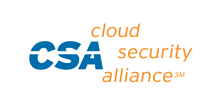

---

copyright:

  years: 2015，2016

lastupdated: "2017-01-11" 

---

{:shortdesc: .shortdesc}
{:new_window: target="_blank"}

# Einhaltung von Sicherheitsbestimmungen
{: #compliance}

{{site.data.keyword.Bluemix}} stellt eine sichere Cloudplattform bereit, der Sie vertrauen können. Die Sicherheitskonformität von {{site.data.keyword.Bluemix_notm}} ist das Ergebnis einer Kombination aus Plattform und Services, die auf den besten Sicherheitsstandards der Branche, einschließlich ISO 27001 und ISO 27002 basieren.
{:shortdesc}

 Eine **Modellklausel für die Europäische Union (EU)** ist eine Vereinbarung über den Schutz persönlicher Daten, die aus der EU oder aus dem europäischen Wirtschaftsraum (European Economic Area, EEA) in ein Drittland übertragen werden. Die EU-Modellklausel wird zwischen dem Kunden, der sich in der EU oder im EEA befindet, als Datenexporteur, und dem IBM Datenverarbeiter, der sich in dem Drittland befindet, als Datenimporteur unterzeichnet. Die [IBM SaaS-EU-Modellklausel ](http://www-01.ibm.com/common/ssi/cgi-bin/ssialias?subtype=ST&infotype=SA&htmlfid=KUJ12408USEN&attachment=KUJ12408USEN.PDF){: new_window} enthält die Rechte und Verpflichtungen des Datenexporteurs und des Datenimporteurs sowie die Rechte der Datensubjekte. Die IBM SaaS-EU-Modellklausel stellt sicher, dass persönliche Daten, wenn sie in einem Drittland verarbeitet werden, einem Schutz unterliegen, der dem in der EU bzw. im EEA verfügbaren Schutz ähnlich ist.

Für Kunden, die aus dem europäischen Wirtschaftsraum (EEA) stammende Daten in ein Land außerhalb des EEA übertragen wollen, bietet {{site.data.keyword.Bluemix}} EU-Modellklauseln in einer Form, die von den Datenschutzbehörden der Europäischen Kommission und der EU genehmigt wurde. Die EU-Modellklauseln garantieren Kunden in Europa, dass {{site.data.keyword.Bluemix_notm}} für jeden Ort auf der Welt die entsprechenden Datenschutzvorschriften unterstützt.

 Für Bankunternehmen und zugehörige Finanzinstitute in Japan müssen für Computersysteme Sicherheitsverfahren auf der Basis der FISC-Sicherheitsrichtlinien (Center for Financial Industry Information Systems) eingerichtet sein. FISC-Sicherheitsrichtlinien werden von der Japan Financial Services Agency (FSA), Bank of Japan (BOJ) und FISC zwingend vorgeschrieben.
 

  {{site.data.keyword.Bluemix_notm}} ist unter den **Standards 27001 und 27002 der International Organization for Standardization (ISO)** zertifiziert, die die bewährten Verfahren für Prozesse des Informationssicherheitsmanagements definieren. ISO 27001 ist ein weithin übernommener globaler Sicherheitsstandard, der den Anforderungen an Managementsysteme für die Informationssicherheit (ISMS, Information Security Management Systems) entspricht. Er bietet einen systematischen Ansatz für die Verwaltung von Unternehmens- und Kundeninformationen auf Grundlage regelmäßiger Risikobeurteilungen. Der aktuelle Standard, ISO/IEC 27001:2013, wurde am 25. September 2013 von der **International Organization of Standardization (ISO) und der International Electrotechnical Commission (IEC)** unter dem gemeinsamen ISO- und IEC-Unterausschuss veröffentlicht. Der ISO-Standard 27001 spezifiziert die Anforderungen für die Einrichtung, Implementierung und Dokumentation von Managementsystemen für die Informationssicherheit (ISMS, Information Security Management Systems) sowie die Anforderungen für die Implementierung von Sicherheitsmaßnahmen nach den individuellen Bedürfnissen einzelner Organisationen. Der ISO-Standard 27002 erläutert die einzelnen Sicherheitselemente des ISO-Standards 27001 ausführlich. Die Familie der ISO-Standards 27000 beinhaltet einen Prozess zur Risikoskalierung und Ressourcenbewertung mit der Zielsetzung, den Schutz der Vertraulichkeit, Integrität und Verfügbarkeit geschriebener, mündlicher und elektronischer Informationen sicherzustellen.

Um die ISO 27001:2013-Zertifizierung zu erhalten, muss ein Unternehmen seinen systematischen und kontinuierlichen Ansatz zur Verwaltung von Informationssicherheitsrisiken nachweisen, die sich auf die Vertraulichkeit, Integrität und Verfügbarkeit von Unternehmens- und Kundendaten auswirken könnten. Diese Norm beruht auf der Messung und Bewertung der Leistung des ISMS eines Unternehmens und enthält außerdem datenschutzrelevante Kontrollmechanismen auf Grundlage der Systemanforderungen und anderer Anforderungen.

{{site.data.keyword.Bluemix_notm}} wird durch eine Drittanbietersicherheitsfirma geprüft und erfüllt alle Anforderungen für den ISO-Standard 27001: [Bluemix ISO 27001:2013 Certificate of Registration ](ftp://public.dhe.ibm.com/cloud/bluemix/compliance/Bluemix_ISO27K1_WWCert_2016.pdf){: new_window}.

 Die **Payment Card Industry (PCI) Data Security Standards (DSS)** bilden eine Datensicherheitsnorm zum Schutz von Kreditkartendaten. Die PCI DSS gilt für alle Stellen, die an der Verarbeitung von Zahlungskarten beteiligt sind, darunter Händler, Verarbeiter, Aussteller und Serviceprovider. Sie gilt zudem auch für alle anderen Stellen, an denen Karteninhaberdaten oder sensible Authentifizierungsdaten gespeichert, verarbeitet oder übertragen werden.

Wenn Sie Kreditkartendaten speichern oder verarbeiten, sind die Konformität mit der PCI-Norm (Payment Card Industry) und die Netzwerksicherheit von größter Bedeutung für Ihr Unternehmen. Um konsistente Standards für Händler sicherzustellen, wurden vom PCI SSC (Payment Card Industry Security Standards Council) PCI-Normen für Datensicherheit eingerichtet. In diesen Normen sind die Best Practices für den Schutz von Karteninhaberdaten enthalten. Oft erfordern sie die Validierung durch einen dritten qualifizierten Beurteilungsdienstleister (Qualified Service Assessor, QSA). IBM hilft seinen Kunden, PCI-Konformität zu gewährleisten, indem es eine Konformitätserklärung (Attestation on Compliance) vonseiten eines unabhängigen QSA bereitstellt. Die Konformitätserklärung kann zusammen mit dem SOC 2-Report und der ISO 27001-Zertifizierung verwendet werden, um nachzuweisen, dass die Infrastruktur den PCI-Kontrollmechanismen entspricht.

{{site.data.keyword.Bluemix}} lässt eine jährliche PCI DSS-Beurteilung von einem zugelassenen Qualified Security Assessor (QSA) durchführen. {{site.data.keyword.Bluemix_notm}} ist als konform gemäß PCI DSS Version 3.1 bei Service Provider Level 1 geprüft, wie unter [Bluemix PCI DSS AOC ](ftp://public.dhe.ibm.com/cloud/bluemix/compliance/IBM_Bluemix_PCI.pdf){: new_window} ausgeführt. Informationen und Hilfe hinsichtlich der PCI DSS-Konformität für Ihre {{site.data.keyword.Bluemix_notm}}-Umgebung erhalten Sie beim Vertrieb unter [Contact Us ](https://console.ng.bluemix.net/?direct=classic/#/contactUs/cloudOEPaneId=contactUs){: new_window}.

 SOC-Berichte (**SOC - Service Organization Controls**) definieren die Bewertung der führenden internen Kontrollverfahren, die sich auf die Sicherheit, Verfügbarkeit, Verarbeitungsintegrität, Vertraulichkeit und Geheimhaltung bei einer Serviceorganisation beziehen. Die Berichte, die unter Verwendung des American Institute of Certified Public Accountants (AICPA) Guide generiert werden, enthalten die folgenden Elemente: 
  * Organisationsaufsicht
  * Anbietermanagementprogramm
  * Interne Prozesse für Corporate Governance und Risikomanagement
  * Beaufsichtigung der Einhaltung gesetzlicher Bestimmungen
 
{{site.data.keyword.Bluemix_notm}} bietet SOC 1-, SOC 2- und SOC 3-Berichte. Weitere Informationen erhalten Sie vom [{{site.data.keyword.Bluemix_notm}}-Vertriebsteam ](mailto:bmxcert1@us.ibm.com){:new_window}. 

 Der Health Insurance Portability and Accountability Act (HIPAA), erlassen vom US-Kongress im Jahr 1996, schützt die Krankenversicherungsabdeckung für Angestellte nach dem Verlust ihrer Arbeit. HIPAA wird vom Amt für Bürgerrechte ("Office of Civil Rights") und dem Gesundheits- und Sozialministerium der USA reguliert und durchgesetzt. HIPAA umfasst Bestimmungen aus dem 1996 Act sowie Datenschutzanforderungen aus dem HITECH-Act ("Health Information Technology for Economic and Clinical Health") von 2009 zur Informationstechnologie im Gesundheitswesen. {{site.data.keyword.Bluemix_notm}} erfüllt alle HIPAA-Anforderungen auf der Seite des Rechenzentrums oder des Service-Providers.

Weitere Informationen oder Hilfestellungen zur Erlangung, Zertifizierung und Aufrechterhaltung der HIPAA-Konformität für Ihre Bluemix-Umgebung erhalten Sie beim {{site.data.keyword.Bluemix_notm}}-[Vertriebsteam ](mailto:cloudplatform_compliance@us.ibm.com){:new_window}.

 ISO/IEC 27017:2015 gibt Leitlinien dazu, welche Kontrollmechanismen zur Informationssicherheit auf die Bereitstellung und Verwendung von Cloud-Services anwendbar sind. Zusätzlich liefert sie Anweisungen zur Implementierung von Cloud-Service-Providern wie auch von Cloud-Service-Kunden. ISO 27017 gibt Implementierungsanweisungen für relevante Kontrollmechanismen, die in ISO/IEC 27002 angegeben werden, sowie zusätzliche Kontrollmechanismen und Anleitungen speziell für Cloud-Services.

Die Ausrichtung von {{site.data.keyword.Bluemix_notm}} an ISO 27017:2015 belegt, dass IBM ein hoch entwickeltes System cloudspezifischer Kontrollmechanismen bereithält. Zusätzlich demonstriert sie das Bestreben, hinsichtlich IaaS eine Vorbildrolle einzunehmen, im eigenen Land wie auch weltweit.

 ISO 27018:2014 legt allgemein anerkannte Kontrollziele, Kontrollen und Leitlinien für die Umsetzung von Maßnahmen zum Schutz personenbezogener Daten fest. Diese Maßnahmen stimmen mit den Datenschutzprinzipien aus ISO 29100 für Datenverarbeitungsumgebungen in öffentlichen Clouds überein.

Insbesondere enthält ISO 27018:2014 Leitlinien, die auf ISO 27002 basieren. In diesen Leitlinien sind die gesetzlichen Bestimmungen für den Schutz personenbezogener Daten enthalten, die auf Umgebungen mit Informationssicherheitsrisiken eines Bereitstellers von öffentlichen Cloud-Services anwendbar sein könnten.

 Die Cloud Security Alliance ist eine Non-Profit-Organisation, die sich zum Ziel gesetzt hat, die Verwendung Bester Praktiken zur Gewährleistung der Sicherheit in Cloud-Umgebungen zu fördern. Einer der Mechanismen, die die Cloud Security Alliance zur Durchsetzung ihrer Ziele einsetzt, ist die "Security, Trust, and Assurance Registry" (STAR). STAR ist eine freie, öffentlich zugängliche Registrierungsdatenbank, in der die Sicherheitsmaßnahmen der verschiedenen Cloud-Computing-Angebote dokumentiert werden.

 Die "Criminal Justice Information Systems" (CJIS) sind eine Abteilung des US-Justizministeriums. Die CJIS-Abteilung hat eine Sicherheitsrichtlinie erarbeitet und veröffentlicht (CJISD-ITS-DOC-08140-5.4). Diese Sicherheitsrichtlinie enthält die Mindestanforderungen an die Informationssicherheit, Leitlinien und Vereinbarungen, die den Willen der gesetzgebenden und Strafrechtsorgane spiegeln, die Quellen, Übertragung, Speicherung und Generierung von Kriminaldaten zu schützen.

### Plattform- und Servicekonformität
Die folgende Tabelle zeigt, welche Services in {{site.data.keyword.Bluemix_notm}} mit welchem der Standards konform sind.

|{{site.data.keyword.Bluemix_notm}}-Komponenten		|FISC		|ISO 27001	|PCI |SOC 2 Typ 1		|
|:----------------------|:---------:|:---------:|:---------:|:---------:|
|{{site.data.keyword.Bluemix_notm}}-Plattform		|J			|J	|J	|J	|
|{{site.data.keyword.APIM}}			|J	|J |J	|			|
|{{site.data.keyword.autoscaling}}			|J	|J |J	|			|
|{{site.data.keyword.bigicloudst}}			|J |J |	|J |
|{{site.data.keyword.cloudant}}				|J |J |	|J	|
|{{site.data.keyword.dashdbshort}}			|J	|J	|	|J	|
|{{site.data.keyword.datacshort}}			|J	|J	|J	|			|
|{{site.data.keyword.dataworks_short}}				|	|	|	|J	 		|
|{{site.data.keyword.jazzhub_short}}					|J	|J	|	|			|
|{{site.data.keyword.containerlong}}			|J		|J	|	|			|
|{{site.data.keyword.dwl_short}}				|	|	|	|J	 		|
|{{site.data.keyword.mql}}				|J	|J	|J	|	 		|
|{{site.data.keyword.SecureGateway}}			|J	|J |	|	 		|
|{{site.data.keyword.sescashort}}     |J |J |J	|  |
{: caption="Tabelle 1. Plattform- und Servicekonformität" caption-side="top"}
