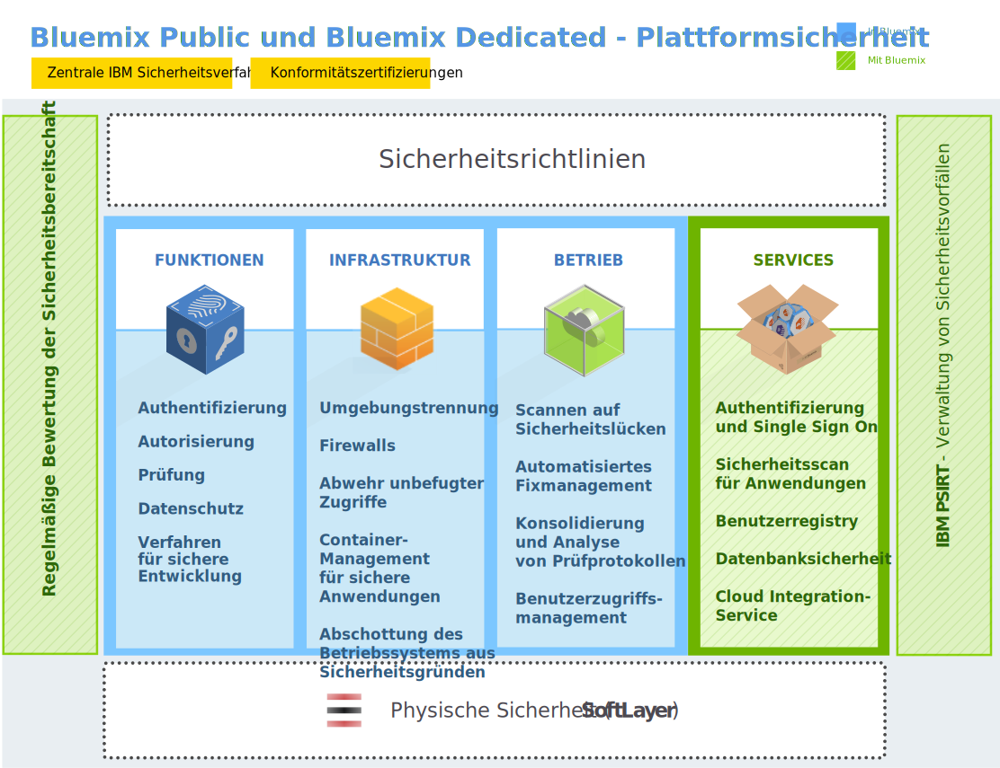
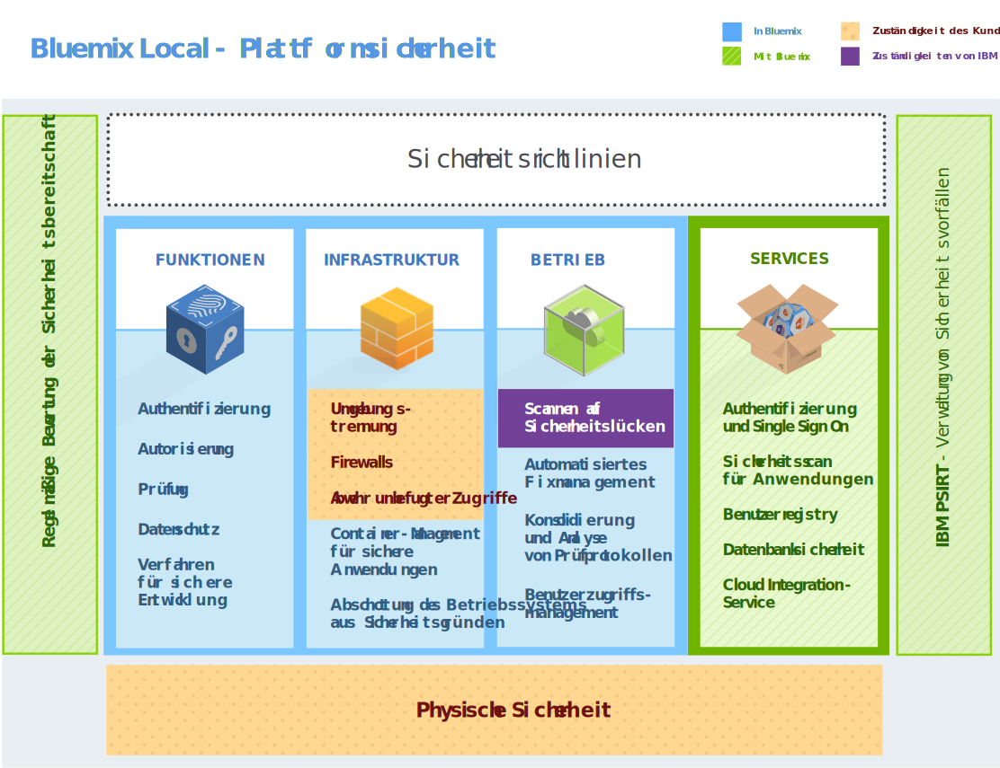

---

 

copyright:

  years: 2014, 2017

lastupdated: "2017-01-10" 

---

{:new_window: target="_blank"}
{:shortdesc: .shortdesc}

# Sicherheit in {{site.data.keyword.Bluemix_notm}}
{: #security}

Die Plattform {{site.data.keyword.Bluemix}} wurde mit Verfahren für sichere Entwicklung entwickelt und besitzt geschichtete netz- und infrastrukturweite Sicherheitsmaßnahmen. {{site.data.keyword.Bluemix_notm}} bietet eine Gruppe von Sicherheitsservices, die von Anwendungsentwicklern zum Sichern ihrer mobilen Apps und Web-Apps verwendet werden kann. Kombiniert machen diese Elemente {{site.data.keyword.Bluemix_notm}} zu einer Plattform mit klaren Auswahlmöglichkeiten für eine sichere Anwendungsentwicklung.
{:shortdesc}

In {{site.data.keyword.Bluemix_notm}} wird eine Sicherheitsbereitschaft sichergestellt, indem Sicherheitsrichtlinien mit Verfahren eingehalten werden, die sich bei IBM in Hinblick auf Systeme, den Netzbetrieb und sichere Entwicklung bewährt haben. Diese Richtlinien umfassen Verfahren wie das Scannen von Quellcode, dynamisches Scannen, Bedrohungsmodellierung und Penetrationstests. {{site.data.keyword.Bluemix_notm}} befolgt den IBM Product Security Incident Response Team-Prozess (PSIRT-Prozess) für das Management von Sicherheitsvorfällen. Einzelheiten finden Sie auf der Webseite zu [IBM Security Vulnerability Management (PSIRT) ](http://www-03.ibm.com/security/secure-engineering/process.html){: new_window}. 

{{site.data.keyword.Bluemix_notm}} Public und Dedicated verwenden die Cloud-Services der {{site.data.keyword.BluSoftlayer}} Infrastructure-as-a-Service (IaaS) und nutzen deren Sicherheitsarchitektur optimal aus. {{site.data.keyword.BluSoftlayer}} IaaS stellt mehrere überschneidende Schutzebenen für Ihre Anwendungen und Daten bereit. Bei {{site.data.keyword.Bluemix_notm}} Local entscheiden Sie über die physische Sicherheit und stellen die Infrastruktur bereit, indem Sie {{site.data.keyword.Bluemix_notm}} Local in Ihrem eigenen Rechenzentrum hinter einer Unternehmensfirewall hosten. Darüber hinaus fügt {{site.data.keyword.Bluemix_notm}} Sicherheitsfunktionen auf der Platform-as-a-Service-Ebene (PaaS) in unterschiedlichen Kategorien hinzu: Plattform, Daten und Anwendung.

## Sicherheit der {{site.data.keyword.Bluemix_notm}}-Plattform
{: #platform-security}

{{site.data.keyword.Bluemix_notm}} bietet für die zentrale Plattform funktionale, infrastrukturelle, operationale und physische Sicherheit (über {{site.data.keyword.BluSoftlayer}}). {{site.data.keyword.Bluemix_notm}} Local zeichnet sich jedoch dadurch aus, dass die Infrastruktur und das Rechenzentrum vom Kunden bereitgestellt wird und die physische Sicherheit dem Kunden obliegt.

Die auf {{site.data.keyword.BluSoftlayer}} beruhende {{site.data.keyword.Bluemix_notm}}-Umgebung ist konform mit den strengsten Sicherheitsstandards der IBM Informationstechnologie, die den Branchenstandards entsprechen oder diese auch übersteigen. Diese Standards umfassen Folgendes:
Netz-, Datenverschlüsselungs- und Zugriffskontrolle
 * Testen von Anwendungs-ACLs, Berechtigungen und unbefugtem Zugriff
 * Identifikation, Authentifizierung und Autorisierung
 * Schutz von Informationen und Daten
 * Serviceintegrität und -verfügbarkeit
 * Schwachstellen- und Fixmanagement
 * Erkennung von Denial-of-Service-Angriffen und von systematischen Attacken
 * Intervention bei Sicherheitsverstößen

Abbildung 1. Übersicht über die Sicherheit der {{site.data.keyword.Bluemix_notm}}-Plattform

Mit {{site.data.keyword.Bluemix_notm}} Local hosten Sie {{site.data.keyword.Bluemix_notm}} hinter der Firewall Ihres Unternehmens und in Ihrem Rechenzentrum. Deshalb sind Sie für bestimmte Sicherheitsaspekte verantwortlich. In der folgenden Abbildung wird erläutert, welche Teile der Sicherheit dem Kunden obliegen und welche Teile der Sicherheit von IBM verwaltet und gepflegt werden.

 {: #localplatformsecurity}

Abbildung 2. Übersicht über die Sicherheit der {{site.data.keyword.Bluemix_notm}} Local-Plattform

Mithilfe von Relay. einer in {{site.data.keyword.Bluemix_notm}} Local integrierten Zustellungsfunktion, installiert und verwaltet IBM {{site.data.keyword.Bluemix_notm}} Local in Ihrem Rechenzentrum und führt eine Fernüberwachung durch. Relay stellt eine sichere Verbindung mit Zertifikaten her, die für jede {{site.data.keyword.Bluemix_notm}} Local-Instanz spezifisch sind. Weitere Informationen zu {{site.data.keyword.Bluemix_notm}} Local und Relay finden Sie unter [Bluemix Local](/docs/local/index.html).

### Funktionelle Sicherheit

{{site.data.keyword.Bluemix_notm}} stellt verschiedene Einrichtungen für funktionale Sicherheit bereit, wie Benutzerauthentifizierung, Zugriffsberechtigung, Prüfung kritischer Operationen oder Datenschutz.

<dl>
<dt>Authentifizierung</dt>
<dd>Anwendungsentwickler authentifizieren sich bei {{site.data.keyword.Bluemix_notm}} durch Verwendung ihrer IBM Webidentität.

Bei {{site.data.keyword.Bluemix_notm}} Dedicated und Local wird die Authentifizierung über LDAP standardmäßig unterstützt. Auf Anfrage kann stattdessen die Authentifizierung über eine IBM Webidentität für {{site.data.keyword.Bluemix_notm}} eingerichtet werden.
</dd>

<dt>Autorisierung</dt>
<dd>{{site.data.keyword.Bluemix_notm}} verwendet Cloud Foundry-Mechanismen, um sicherzustellen, dass jeder Anwendungsentwickler nur Zugriff auf die von ihm eingerichteten Anwendungen und Serviceinstanzen besitzt. Die Autorisierung für {{site.data.keyword.Bluemix_notm}}-Services basiert auf OAuth. Der Zugriff auf alle internen Endpunkte der {{site.data.keyword.Bluemix_notm}}-Plattform ist auf externe Benutzer beschränkt.</dd>

<dt>Prüfung</dt>
<dd>Zu allen erfolgreichen und nicht erfolgreichen Authentifizierungsversuchen von Anwendungsentwicklern werden Prüfprotokolle erstellt. Prüfprotokolle werden auch für den berechtigten Zugriff auf Linux-Systeme erstellt, die die Container hosten, in denen die {{site.data.keyword.Bluemix_notm}}-Anwendungen ausgeführt werden.</dd>

<dt>Datenschutz</dt>
<dd> Der gesamte {{site.data.keyword.Bluemix_notm}}-Datenverkehr läuft über SOA-Einheiten von IBM WebSphere® DataPower®, die Funktionen für Reverse Proxy, SSL-Abschluss und Lastausgleich bereitstellen.
Folgende HTTP-Methoden sind zulässig:
<ul>
<li>DELETE</li>
<li>GET</li>
<li>HEAD</li>
<li>OPTIONS</li>
<li>POST</li>
<li>PUT</li>
<li>TRACE</li>
</ul>
 Bei HTTP-Inaktivität wird das Zeitlimit nach zwei Minuten überschritten.</dd>
<dd>Folgende Header werden von DataPower belegt:
<dl>
<dt>$wsis</dt>
<dd>Auf 'true' gesetzt, wenn die clientseitige Verbindung sicher ist (HTTPS), andernfalls auf 'false' gesetzt.</dd>
<dt>$wssc</dt>
<dd>Auf eines der folgenden Schemas für Clientverbindungen gesetzt: HTTPS, HTTP, WS oder WSS.</dd>
<dt>$wssn</dt>
<dd>Auf den vom Client gesendeten Hostnamen gesetzt.</dd>
<dt>$wssp</dt>
<dd>Auf den Server-Port gesetzt, zu dem der Client eine Verbindung herstellt.</dd>
<dt>x-client-ip</dt>
<dd>Auf die IP-Adresse des Clients gesetzt.</dd>
<dt>x-forwarded-proto</dt>
<dd>Auf eines der folgenden Schemas für Clientverbindungen gesetzt: HTTPS, HTTP, WS oder WSS.</dd>
</dl>
</dd>

<dt>Verfahren für sichere Entwicklung</dt>
<dd> Für {{site.data.keyword.Bluemix_notm}} Public und Dedicated werden mithilfe von IBM Security AppScan® Dynamic Analyzer regelmäßig für verschiedene {{site.data.keyword.Bluemix_notm}}-Komponenten Scans auf Sicherheitslücken durchgeführt. Es werden Bedrohungsmodelle und Tests für unbefugten Zugriff durchgeführt, um mögliche Schwachstellen für alle Typen von {{site.data.keyword.Bluemix_notm}}-Bereitstellungen zu entdecken und zu beheben. Zusätzlich können Anwendungsentwickler den Service AppScan Dynamic Analyzer zum Sichern ihrer Web-Apps verwenden, die in {{site.data.keyword.Bluemix_notm}} bereitgestellt sind.</dd>
</dl>

### Infrastruktursicherheit

{{site.data.keyword.Bluemix_notm}} baut auf Cloud Foundry auf, um eine leistungsfähige Basis für das Ausführen Ihrer Anwendungen bereitzustellen. Innerhalb der Architektur werden mehrere Komponenten für die Sicherheit und Isolation zur Verfügung gestellt. Zudem werden Änderungsmanagement und Prozeduren für die Sicherung und Wiederherstellung implementiert, um die Integrität und Verfügbarkeit sicherzustellen.

<dl>
<dt>Umgebungstrennung</dt>
<dd> Bei {{site.data.keyword.Bluemix_notm}} Public sind die Entwicklungs- und Produktionsumgebungen voneinander getrennt, um die Stabilität und Sicherheit der Anwendung zu verbessern.</dd>

<dt>Firewalls</dt>
<dd> Firewalls wurden eingerichtet, um den Zugriff auf das {{site.data.keyword.Bluemix_notm}}-Netz einzuschränken. Bei {{site.data.keyword.Bluemix_notm}} Local trennt die Firewall Ihres Unternehmens die übrigen Teile Ihres Netzes von der {{site.data.keyword.Bluemix_notm}}-Instanz.</dd>

<dt>Schutz vor Angriffen von außen</dt>
<dd>{{site.data.keyword.Bluemix_notm}} Public und Dedicated bieten einen Schutz vor Angriffen von außen, um Bedrohungen zu erkennen, damit diese abgewehrt werden können. Auf den Firewalls sind Richtlinien zum Schutz vor Angriffen von außen aktiviert.</dd>

<dt>Container-Management für sichere Anwendungen</dt>
<dd>Jede {{site.data.keyword.Bluemix_notm}}-Anwendung wird isoliert und in einem eigenen Container ausgeführt, der für Prozessor, Speicher und Festplatte spezifische Ressourcengrenzen aufweist.</dd>

<dt>Abschottung des Betriebssystems aus Sicherheitsgründen</dt>
<dd>IBM Administratoren führen regelmäßig mithilfe von Tools wie IBM Endpoint Manager eine Abschottung der Netze und Betriebssysteme durch.</dd>
</dl>

### Betriebssicherheit

{{site.data.keyword.Bluemix_notm}} bietet eine leistungsfähige Betriebssicherheitsumgebung mit den folgenden Kontrollmechanismen:

<dl>
<dt>Scan auf Sicherheitslücken</dt>
<dd>{{site.data.keyword.Bluemix_notm}} verwendet das Tool Nessus von Tenable Network Security zum Ermitteln von Sicherheitslücken, um Probleme mit Netzwerk- und Hostkonfigurationen zu entdecken und zu beheben.</dd>

<dt>Automatisiertes Fixmanagement</dt>
<dd>{{site.data.keyword.Bluemix_notm}}-Administratoren stellen sicher, dass in angemessenen Abständen Fixes für Betriebssysteme angewendet werden. Automatisierte Fixes werden mithilfe von IBM Endpoint Manager aktiviert.</dd>

<dt>Konsolidierung und Analyse von Prüfprotokollen</dt>
<dd>{{site.data.keyword.Bluemix_notm}} nutzt die IBMSecurity QRadar®-Tools, um Linux-Protokolle zu konsolidieren, um den berechtigten Zugriff auf Linux-Systeme zu überwachen. {{site.data.keyword.Bluemix_notm}} verwendet außerdem IBM QRadar SIEM (Security Information and Event Management, Sicherheitsinformations- und Ereignismanagement), um erfolgreiche und nicht erfolgreiche Anmeldeversuche von Anwendungsentwicklern zu überwachen.</dd>

<dt>Benutzerzugriffsmanagement</dt>
<dd>Innerhalb von {{site.data.keyword.Bluemix_notm}} werden die Richtlinien zur Aufgabentrennung befolgt, um Benutzern differenzierte Zugriffsberechtigungen zuzuweisen und sicherzustellen, dass Benutzer nur über den Zugriff verfügen, der entsprechend dem Prinzip der geringsten Rechte zum Ausführen ihres jeweiligen Jobs erforderlich ist.

Innerhalb einer {{site.data.keyword.Bluemix_notm}} Dedicated- und Local-Umgebung können zugewiesene Administratoren mithilfe der Administrationskonsole Rollen und Berechtigungen für {{site.data.keyword.Bluemix_notm}}-Benutzer in ihrer Organisation verwalten. Weitere Informationen finden Sie unter
[{{site.data.keyword.Bluemix_notm}}
verwalten](/docs/admin/adminpublic.html#mng).
</dd>
</dl>

### Physische Sicherheit

{{site.data.keyword.Bluemix_notm}} Public und Dedicated bauen hinsichtlich der Sicherheit der physischen Netze auf der Network-within-a-Network-Topologie von {{site.data.keyword.BluSoftlayer}} auf. Diese Network-within-a-network-Architektur stellt sicher, dass die Systeme ausschließlich berechtigten Mitarbeiten vollständig zur Verfügung stehen. Bei {{site.data.keyword.Bluemix_notm}} Local obliegt die physische Sicherheit der lokalen Instanz Ihnen. Ihr Rechenzentrum ist durch die Firewall Ihres Unternehmens geschützt.

In der Network-within-a-Network-Topologie von {{site.data.keyword.BluSoftlayer}} wird auf der Ebene des öffentlichen Netzes der öffentliche Datenverkehr zu gehosteten Websites oder Onlineressourcen abgewickelt. Die Ebene des privaten Netzes ermöglicht echtes Out-of-band-Management durch einen separaten eigenständigen Netzbetreiber über SSL-, PPTP- oder IPSec VPN-Gateways. Auf der Ebene des Netzes zwischen Rechenzentren wird freie und sichere Konnektivität zwischen Servern bereitgestellt, die sich an unterschiedlichen {{site.data.keyword.BluSoftlayer}}-Standorten befinden.

Jedes {{site.data.keyword.BluSoftlayer}}-Rechenzentrum wird vollständig durch Kontrollmechanismen gesichert, die dem Standard SSAE 16 und den branchenspezifischen Anforderungen ausnahmslos entsprechen.

## Datensicherheit
{: #data-security}

Mit {{site.data.keyword.Bluemix_notm}} ist das Sichern Ihrer Daten gegen unbefugten Zugriff eine gemeinsame Leistung von {{site.data.keyword.Bluemix_notm}} und Ihnen.

Daten, die einer aktiven Anwendung zugeordnet sind, können einen von drei Status besitzen: Daten bei der Übertragung, ruhende Daten, verwendete Daten.

<dl>
<dt>Daten bei der Übertragung</dt>
<dd>Daten, die in einem Netz zwischen Knoten übertragen werden.</dd>

<dt>Ruhende Daten</dt>
<dd>Gespeicherte Daten.</dd>

<dt>Verwendete Daten</dt>
<dd>Daten, die derzeit nicht gespeichert sind und gerade an einem Endpunkt verarbeitet werden.</dd>
</dl>

Bei der Planung der Datensicherheit muss jeder Datentyp berücksichtigt werden.

Bei der {{site.data.keyword.Bluemix_notm}}-Plattform werden die übertragenen Daten gesichert, indem der Endbenutzerzugriff auf die Anwendung mithilfe von SSL über das Netz gesichert wird, bis die Daten das IBM DataPower Gateway an der Grenze zum {{site.data.keyword.Bluemix_notm}}-internen Netz erreichen. IBM DataPower Gateway fungiert als Reverse Proxy und stellt die SSL-Terminierung bereit. Bei der Übertragung vom IBM DataPower Gateway zur Anwendung werden die Daten mit IPSEC geschützt.

Die Sicherheit für verwendete und ruhende Daten liegt beim Entwickeln Ihrer Anwendung in Ihrer Verantwortung. Sie können verschiedene datenbezogene Services nutzen, die im {{site.data.keyword.Bluemix_notm}}-Katalog verfügbar sind, um diese Problemstellungen zu lösen.

## Sicherheit von {{site.data.keyword.Bluemix_notm}}-Anwendungen
{: #application-security}

Als Anwendungsentwickler müssen Sie für Ihre unter {{site.data.keyword.Bluemix_notm}} ausgeführten Anwendungen die Sicherheitskonfigurationen, einschließlich des Schutzes von Anwendungsdaten, aktivieren.

Zum Absichern Ihrer Anwendungen können Sie die Sicherheitsfunktionalitäten verwenden, die von mehreren {{site.data.keyword.Bluemix_notm}}-Services bereitgestellt werden. Alle von IBM erstellten {{site.data.keyword.Bluemix_notm}}-Services folgen der Entwicklungspraxis von IBM für sichere Entwicklung.

**Hinweis:** Einige der hier beschriebenen Services gelten möglicherweise nicht für {{site.data.keyword.Bluemix_notm}} Dedicated- oder Local-Instanzen.

### SSO-Service

IBM Single Sign On for {{site.data.keyword.Bluemix_notm}} ist ein auf Richtlinien basierender Authentifizierungsservice, der eine einfach zu integrierende Single-Sign-on-Funktionalität für Node.js- oder Liberty for Java™-Anwendungen zur Verfügung stellt. Um Anwendungsentwicklern zu ermöglichen, die Single-Sign-on-Funktionalität in eine Anwendung zu integrieren, erstellt der Administrator Serviceinstanzen und fügt Identitätsquellen hinzu.

Der SSO-Service unterstützt mehrere Identitätsquellen, in denen die Berechtigungsnachweise Ihrer Benutzer gespeichert sind:

<dl>
<dt>SAML Enterprise</dt>
<dd>Eine Benutzerregistry mit einem Austausch von SAML-Tokens, durch den die Authentifizierung durchgeführt wird.</dd>

<dt>Cloudverzeichnis</dt>
<dd>Eine Benutzerregistry, die in IBM Cloud gehostet wird.</dd>

<dt>Quellen für die soziale Identität</dt>
<dd> Die Benutzerregistrys, die von Google, Facebook und LinkedIn verwaltet werden.</dd>
</dl>

Weitere Informationen finden Sie in [Einführung in Single Sign-On](/docs/services/SingleSignOn/index.html).

### Application Security on Cloud

Dieser Service stellt eine Sicherheitsanalyse für mobile Apps und Web-Apps bereit und ermöglicht Ihnen das Scannen von Quellcode auf Sicherheitslücken. Weitere Informationen finden Sie in der [Einführung zu Application Security on Cloud](/docs/services/ApplicationSecurityonCloud/index.html).

### IBM UrbanCode-Plug-in für das Testen der Anwendungssicherheit

Mit dem Plug-in IBM Application Security Testing for {{site.data.keyword.Bluemix_notm}} wird Ihnen das Ausführen von Sicherheitsscans für Ihre Web- oder Android-Apps ermöglicht, die in {{site.data.keyword.Bluemix_notm}} gehostet werden. Dieses Plug-in wird von der IBM UrbanCode™ Deploy Community in der IBM Bluemix DevOps Services-Plattform entwickelt und unterstützt.

Weitere Informationen finden Sie unter [IBM Application Security Testing for Bluemix ](https://developer.ibm.com/urbancode/plugindoc/ibmucd/ibm-application-security-testing-bluemix/1-0/){: new_window}.  

### dashDB

Vom Service 'dashDB' wird ein eingebetteter LDAP-Server für die Benutzerauthentifizierung verwendet. Die Verbindung zwischen Anwendungen und der Datenbank wird über SSL-Zertifikate geschützt. Dieser Service nutzt die native DB2®-Verschlüsselungsfunktion, um Ihre bereitgestellte Datenbank und die Datenbankbackups automatisch zu verschlüsseln. Die Rotation der Masterschlüssel geschieht automatisch und wird alle 90 Tage durchgeführt.

Weitere Informationen finden Sie in [Einführung in dashDB](/docs/services/dashDB/index.html).

### Secure Gateway

Mit dem Service 'Secure Gateways' können Sie lokal oder in der Cloud eine sichere Verbindung zwischen {{site.data.keyword.Bluemix_notm}}-Apps und fernen Standorten herstellen. Es wird eine sichere Verbindung bereitgestellt und ein Tunnel zwischen Ihrer {{site.data.keyword.Bluemix_notm}}-Organisation und dem fernen Standort, zu dem Sie eine Verbindung herstellen möchten, eingerichtet. Mithilfe der {{site.data.keyword.Bluemix_notm}}-Benutzerschnittstelle oder eines API-Pakets können Sie ein sicheres Gateway konfigurieren und erstellen.

Weitere Informationen finden Sie unter [Einführung in Secure Gateway](/docs/services/SecureGateway/secure_gateway.html).

### Sicherheitsinformationen und Ereignismanagement

Mit SIEM-Tools (Security Information and Event Management, Sicherheitsinformationen und Ereignismanagement) können Sie Sicherheitsalerts in Anwendungsprotokollen analysieren. Ein solches Tool ist IBM Security QRadar&reg; SIEM, das Sicherheitsdaten in Cloudumgebungen bereitstellt. Weitere Informationen finden Sie unter [IBM QRadar Security Intelligence Platform ](http://www-01.ibm.com/support/knowledgecenter/SS42VS/welcome?lang=en){: new_window}. 
