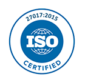

---

copyright:

  years: 2015 2016

lastupdated: "2017-01-11" 

---

{:shortdesc: .shortdesc}
{:new_window: target="_blank"}

# Conformidad de la seguridad
{: #compliance}

{{site.data.keyword.Bluemix}} proporciona una plataforma de nube segura en la que puede confiar. La conformidad de {{site.data.keyword.Bluemix_notm}} proviene de una plataforma y unos servicios que se compilan en los mejores estándares de seguridad del sector, incluidos ISO 27001 e ISO 27002.
{:shortdesc}

  Una **Cláusula modelo de la Unión Europea (EU)** es un acuerdo para proteger datos personales que se transfieren desde la EU o el Espacio Económico Europeo (EEA) a un país tercero. La Cláusula modelo de la EU se firma entre el cliente ubicado en la EU o EEA como el exportador de datos y el procesador de datos de IBM ubicado en un país tercero como el importador de datos. La [Cláusula del modelo de la Unión Europea para los IBM SaaS ](http://www-01.ibm.com/common/ssi/cgi-bin/ssialias?subtype=ST&infotype=SA&htmlfid=KUJ12408USEN&attachment=KUJ12408USEN.PDF){: new_window} contiene los derechos y las obligaciones del exportador de datos y el importador de datos, y los derechos de los sujetos de datos. La Cláusula modelo de la EU de SaaS de IBM garantiza que los datos personales, cuando se procesan en un país tercero, estén bajo protección similar a la protección disponible en la EU o la EEA.

Para los clientes que deseen transferir datos que se originan en el Espacio Económico Europeo para un país fuera del EEA, {{site.data.keyword.Bluemix}} ofrece Cláusulas de modelo europeo en el formulario aprobado por la Comisión Europea y las autoridades de protección de datos de la Unión Europea. Las Cláusulas de modelo europeo garantizan a los clientes europeos que {{site.data.keyword.Bluemix_notm}} dé soporte a las protecciones de privacidad de datos necesarias en cada ubicación del mundo.

  Para banca e instituciones relacionadas con las finanzas de Japón, los sistemas informáticos deben tener procedimientos de seguridad en su lugar basados en las directrices de seguridad del FISC (Center for Financial Industry Information Systems). Las directrices de seguridad de FISC las impone FSA (Japan Financial Services Agency), BOJ (Bank of Japan) y FISC.
 

 {{site.data.keyword.Bluemix_notm}} tiene certificación bajo los **Estándares 27001 y 27002 de ISO (International Organization for Standardization)**, que definen las mejores prácticas para los procesos de gestión de seguridad de información. ISO 27001 es un estándar de seguridad global ampliamente adoptado que describe los requisitos para los sistemas de gestión de seguridad de información. Proporciona un enfoque sistemático para gestionar la información del cliente y de la empresa en función de evaluaciones de riesgo periódicas. El estándar más reciente, ISO/IEC 27001:2013, lo publicó el 25 de septiembre de 2013 la **International Organization of Standardization (Organización Internacional de Normalización) (ISO) y la International Electrotechnical Commission (Comisión Electrotécnica Internacional) (IEC)** conjuntamente con el subcomité de ISO e IEC. El estándar ISO 27001 especifica los requisitos para establecer, implementar y documentar los ISMS (Information Security Management Systems) y los requisitos para implementar los controles de seguridad, de acuerdo con las necesidades de organizaciones individuales. El estándar ISO 27002 explica cada control de seguridad de ISO 27001 en detalle. La familia de estándares ISO 27000 incorpora un proceso de riesgo de escalado y de evaluación de activos, con el objetivo de salvaguardar la confidencialidad, la integridad y la disponibilidad de la información escrita, oral y electrónica.

Para conseguir la certificación ISO 27001:2013, una empresa debe mostrar que tiene un enfoque sistemático y continuado para gestionar riesgos de seguridad de información que afectan a la confidencialidad, integridad y disponibilidad de la información de la empresa y del cliente. Este estándar hace hincapié en la medida y en la evaluación del rendimiento del Information Security Management System (ISMS) de la organización y también incluye controles relacionados con la seguridad de la información que se basan en los requisitos del sistema y otros requisitos.

{{site.data.keyword.Bluemix_notm}} la audita una empresa de seguridad de terceros y cumple todos los requisitos para ISO 27001: [Bluemix ISO 27001:2013 Certificado de registro ](ftp://public.dhe.ibm.com/cloud/bluemix/compliance/Bluemix_ISO27K1_WWCert_2016.pdf){: new_window}.

  Los **Payment Card Industry (PCI) Data Security Standards (DSS)** son un estándar de seguridad de información que está diseñado para proteger los datos de la tarjeta de crédito. PCI DSS se aplica a todas las entidades implicadas en el procesamiento de la tarjeta de pago, incluidos los comerciantes, procesadores, emisores y proveedores de servicio. También se aplica al resto de las entidades que almacenan, procesan o transmiten los datos de los titulares de tarjetas o los datos de autenticación confidenciales.

Si almacena o procesa datos de la tarjeta de crédito, la conformidad y la seguridad de red de Payment Card Industry (PCI) será el principal problema para su negocio. Para asegurar estándares coherentes para los comerciantes, el Payment Card Industry Security Standards Council ha establecido estándares de seguridad de datos de PCI. Estas normas incorporan prácticas recomendadas para proteger los datos de titulares de tarjetas, y a menudo requieren la validación de un Asesor de Servicio Calificado (QSA) externo. IBM ayuda a los clientes a satisfacer sus necesidades de conformidad de PCI proporcionando una Certificación de conformidad (Attestation on Compliance) de un QSA independiente. La Certificación de conformidad se puede utilizar junto con el informe SOC 2 y la certificación ISO 27001 para probar que la infraestructura cumpla los controles de PCI.

{{site.data.keyword.Bluemix}} completa un asesoramiento de PCI DSS anual utilizando un Qualified Security Assessor (QSA) aprobado. {{site.data.keyword.Bluemix_notm}} se revisa como conforme en PCI DSS versión 3.1 en el Service Provider Nivel 1, tal como se describe en [Bluemix PCI DSS AOC ](ftp://public.dhe.ibm.com/cloud/bluemix/compliance/IBM_Bluemix_PCI.pdf){: new_window}. Para obtener información sobre la ayuda en el cumplimiento con PCI DSS para su entorno {{site.data.keyword.Bluemix_notm}}, póngase en contacto con el personal de ventas en [Póngase en contacto con nosotros ](https://console.ng.bluemix.net/?direct=classic/#/contactUs/cloudOEPaneId=contactUs){: new_window}.

Los informes de  **SOC (Service Organization Controls)** definen la evaluación de las principales prácticas de control interno relacionadas con la seguridad, la disponibilidad, la integridad del proceso, la confidencialidad y la privacidad en una organización de servicio. Los informes generados mediante la guía del AICPA (American Institute of Certified Public Accountants) incluyen los elementos siguientes: 
  * Supervisión de la organización
  * Programa de gestión del proveedor
  * Procesos de gobierno corporativo interno y de gestión de riesgos
  * Supervisión de la normativa
 
{{site.data.keyword.Bluemix_notm}} proporciona informes SOC 1, SOC 2 y SOC 3. Para obtener información adicional, póngase en contacto con el equipo de [ventas de {{site.data.keyword.Bluemix_notm}}](mailto:bmxcert1@us.ibm.com){:new_window}. 

 La Ley de Transferencia y Responsabilidad de Seguro Médico (Health Insurance Portability and Accountability Act, HIPAA), decretada por el Congreso de Estados Unidos en 1996, protege la cobertura de los seguros médicos para los empleados tras perder sus trabajos. HIPAA está regulada e impuesta por la Oficina de derechos civiles (Office of Civil Rights) y el Ministerio de Salud Pública y Bienestar Social (Department of Health and Human Services) de Estados Unidos. HIPAA abarca regulaciones desde la ley de 1996, así como requisitos de privacidad de la ley HITECH (Health Information Technology for Economic and Clinical Health) de 2009. {{site.data.keyword.Bluemix_notm}} cumple todos los requisitos para HIPAA del lado del centro de datos o del proveedor de servicios.

Para obtener más información o asistencia para conseguir, certificar y mantener la conformidad de HIPAA para su entorno de Bluemix, póngase en contacto con el equipo de [ventas ](mailto:cloudplatform_compliance@us.ibm.com){:new_window} de {{site.data.keyword.Bluemix_notm}}. 

 ISO/IEC 27017:2015 proporciona las directrices para los controles de seguridad de la información aplicables al suministro y uso de los servicios de nube. Además, proporciona unas instrucciones de implementación para proveedores de servicio en la nube y clientes de servicio en la nube. ISO 27017 proporciona unas instrucciones de implementación para controles relevantes que se especifican en ISO/IEC 27002, así como controles e instrucciones adicionales que se relacionan específicamente con los servicios en la nube.

La alineación de {{site.data.keyword.Bluemix_notm}} con ISO 27017:2015 demuestra que IBM tiene un sistema sofisticado de controles específicos de la nube. Además, muestra un compromiso con ser el mejor en IaaS, localmente y en todo el mundo.

 ISO 27018:2014 establece objetivos de control comúnmente aceptados, controles y directrices para implementar medidas para proteger información de identificación personal (Personally Identifiable Information, PII). Estas medidas están de acuerdo con los principios de privacidad de ISO 29100 para el entorno informático en la nube público.

En concreto, ISO 27018:2014 especifica directrices que se basan en ISO 27002. Las directrices tienen en cuenta los requisitos de la normativa para la protección de PII, que pueden ser aplicables dentro del contexto de los entornos de riesgo de seguridad de la información de un proveedor de servicios en la nube públicos.

 Cloud Security Alliance es una organización sin ánimo de lucro con una misión para promover el uso de las prácticas recomendadas para proporcionar control de seguridad en la computación en la nube. Uno de los mecanismos que utiliza la Cloud Security Alliance a la hora de cumplir su misión es el STAR (Security, Trust, and Assurance Registry). STAR es un registro gratuito al que se puede acceder de forma pública que documenta los controles de seguridad proporcionados por varias ofertas de computación en la nube.

 Los Servicios de información de la justicia penal (Criminal Justice Information Systems, CJIS) es un servicio de la Oficina Federal de Investigación del Departamento de Justicia de Estados Unidos. Los servicios de CJIS han creado y publicado una Política de seguridad (CJISD-ITS-DOC-08140-5.4). Esta Política de seguridad contiene requisitos de seguridad de información, directrices y acuerdos mínimos que reflejan el compromiso de las agencias de cumplimiento de leyes y de justicia penal para proteger las fuentes, la transmisión, el almacenamiento y la generación de Información de la justicia penal (Criminal Justice Information, CJI).

### Conformidad de plataforma y servicio
En la tabla siguiente se muestran los servicios de {{site.data.keyword.Bluemix_notm}} que son conformes
para cada uno de los estándares.

|Componentes de {{site.data.keyword.Bluemix_notm}}		|FISC		|ISO 27001	|PCI |SOC 2 Tipo 1		|
|:----------------------|:---------:|:---------:|:---------:|:---------:|
|Plataforma {{site.data.keyword.Bluemix_notm}}		|S			|S	|S	|S	|
|{{site.data.keyword.APIM}}			|S	|S |S	|			|
|{{site.data.keyword.autoscaling}}			|S	|S |S	|			|
|{{site.data.keyword.bigicloudst}}			|S |S |	|S |
|{{site.data.keyword.cloudant}}				|S |S |	|S	|
|{{site.data.keyword.dashdbshort}}			|S	|S	|	|S	|
|{{site.data.keyword.datacshort}}			|S	|S	|S	|			|
|{{site.data.keyword.dataworks_short}}				|	|	|	|S	 		|
|{{site.data.keyword.jazzhub_short}}					|S	|S	|	|			|
|{{site.data.keyword.containerlong}}			|S		|S	|	|			|
|{{site.data.keyword.dwl_short}}				|	|	|	|S	 		|
|{{site.data.keyword.mql}}				|S	|S	|S	|	 		|
|{{site.data.keyword.SecureGateway}}			|S	|S |	|	 		|
|{{site.data.keyword.sescashort}}     |S |S |S	|  |
{: caption="Tabla 1. Cumplimiento de servicio y plataforma" caption-side="top"}
