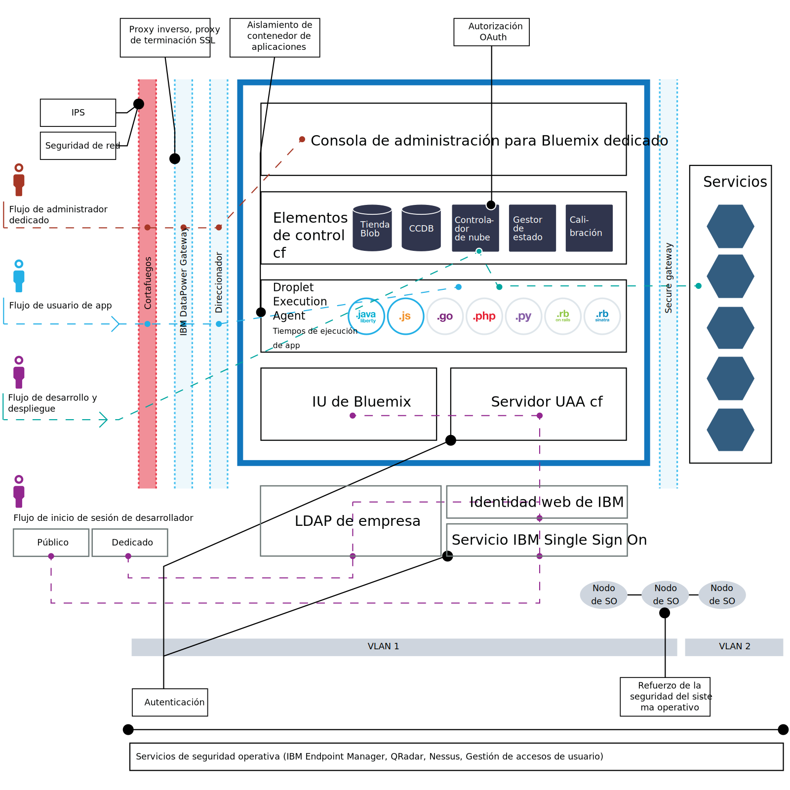

---

 

copyright:

  years: 2014, 2017

lastupdated: "2017-01-10" 

---

{:new_window: target="_blank"}
{:shortdesc: .shortdesc}

# Despliegue de la seguridad de {{site.data.keyword.Bluemix_notm}}
{: #security-deployment}

La arquitectura de despliegue de seguridad de {{site.data.keyword.Bluemix_notm}} incluye distintos flujos de información para los usuarios y desarrolladores de apps para garantizar un acceso seguro.

Figura 3. Arquitectura de despliegue de seguridad de Bluemix

Para los usuarios de la app de {{site.data.keyword.Bluemix_notm}} **, el **flujo de usuario de la app** es el siguiente:
 1. A través de un cortafuegos, con prevención de intrusiones y seguridad de la red.
 2. A través de IBM DataPower Gateway, con proxy inverso y proxy de terminación de SSL.
 3. A través del direccionador de la red.
 4. Alcanza el tiempo de ejecución de la app en el agente de ejecución de droplet (DEA).

El *desarrollador de* {{site.data.keyword.Bluemix_notm}} sigue dos flujos principales: para inicio de sesión y para desarrollo y despliegue.
 * El **flujo del desarrollador para inicio de sesión** incluye lo siguiente:
    * Para los desarrolladores que han iniciado una sesión en {{site.data.keyword.Bluemix_notm}} público, el flujo es el siguiente:
      1. A través del servicio IBM Single Sign On.
      2. A través de la identidad web de IBM.
    * Para los desarrolladores que han iniciado una sesión en {{site.data.keyword.Bluemix_notm}} dedicado o local, el flujo se realiza a través de LDAP de empresa.
 * El **flujo de desarrollo y despliegue** es el siguiente:
    1. A través de un cortafuegos, con prevención de intrusiones y seguridad de la red. Esto se aplica únicamente a {{site.data.keyword.Bluemix_notm}} dedicado.
    2. A través de IBM DataPower Gateway, con proxy inverso y proxy de terminación de SSL.
    3. A través del direccionador de la red.
    4. A través de autorización mediante el controlador de nube de Cloud Foundry, para garantizar el acceso solo a las apps e instancias de servicio que ha creado el desarrollador.

Para los *administradores* de {{site.data.keyword.Bluemix_notm}} dedicado y {{site.data.keyword.Bluemix_notm}} local, el **flujo del administrador** es el siguiente:
 1. A través de un cortafuegos, con prevención de intrusiones y seguridad de la red.
 2. A través de IBM DataPower Gateway, con proxy inverso y proxy de terminación de SSL.
 3. A través del direccionador de la red.
 4. Va a la página Administración de la interfaz de usuario de {{site.data.keyword.Bluemix_notm}}.

Además de los usuarios suscritos a estos métodos, un equipo de operaciones de seguridad de IBM autorizado realiza diversas tareas de seguridad operativa, como las siguientes:
 * Exploraciones de vulnerabilidad. En {{site.data.keyword.Bluemix_notm}} local, usted es el propietario de la seguridad física y de las exploraciones que se realicen en el cortafuegos.
 * Gestión de accesos de usuario.
 * Refuerzo del sistema operativo mediante la app periódica de arreglos con IBM Endpoint Manager.
 * Gestión de riesgos con protección frente a intrusiones.
 * Supervisión de la seguridad con QRadar.
 * Informes de seguridad disponibles en la página de administración.
