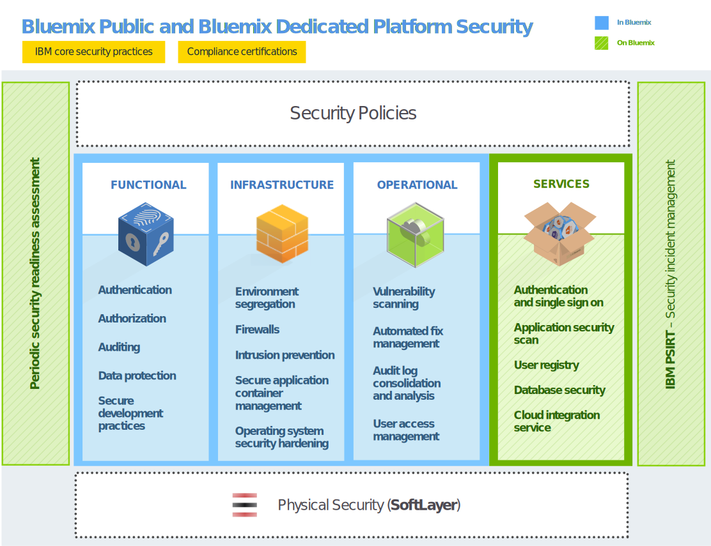
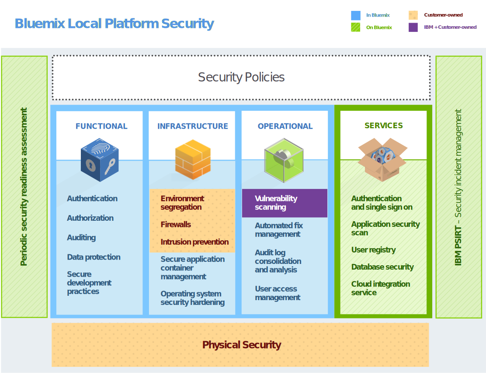

---

 

copyright:

  2014, 2016

 

---

{:new_window: target="_blank"}
{:shortdesc: .shortdesc}

# Sécurité {{site.data.keyword.Bluemix_notm}}
{: #security}
*Dernière mise à jour : 9 mai 2016*

Conçue selon les pratiques d'ingénierie sécurisée, la plateforme {{site.data.keyword.Bluemix}}
possède des contrôles de sécurité répartis dans des couches sur le réseau et dans l'infrastructure. {{site.data.keyword.Bluemix_notm}}
fournit un groupe de services de sécurité qui peuvent être utilisés par les développeurs d'applications afin de sécuriser leurs applications
mobiles et Web. La combinaison de ces éléments permet de faire d'{{site.data.keyword.Bluemix_notm}} une plateforme
proposant des choix clairs pour le développement d'applications sécurisé.
{:shortdesc}

{{site.data.keyword.Bluemix_notm}} assure la sécurité en appliquant des règles de sécurité respectant les meilleurs pratiques d'IBM en matière de systèmes, de réseau et d'ingénierie
sécurisée. Ces règles incluent des pratiques telles que l'analyse du code source, l'analyse dynamique, la modélisation des menaces et des tests de pénétration. {{site.data.keyword.Bluemix_notm}} suit le processus IBM Product Security Incident Response Team (PSIRT) pour la gestion des incidents de sécurité. Pour plus de détails, voir le site [IBM Security Vulnerability Management
(PSIRT)](http://www-03.ibm.com/security/secure-engineering/process.html){: new_window}.

Les environnements {{site.data.keyword.Bluemix_notm}} public et dédié utilisent les services cloud d'infrastructure sous forme de service
(IaaS) IBM SoftLayer et profitent pleinement de son architecture sécurisée. SoftLayer IaaS fournit des
niveaux de protection multiples qui se chevauchent pour vos applications et vos
données. Pour l'environnement {{site.data.keyword.Bluemix_notm}} local, vous êtes en charge de la sécurité physique et
fournissez l'infrastructure en hébergeant l'environnement {{site.data.keyword.Bluemix_notm}} local dans votre
propre centre de données situé derrière le pare-feu de la société. De plus,
{{site.data.keyword.Bluemix_notm}} ajoute des fonctions de sécurité au niveau de la couche plateforme sous forme
de service (PaaS) dans différentes catégories : plateforme, données et application.

## Sécurité de la plateforme {{site.data.keyword.Bluemix_notm}}
{: #platform-security}

{{site.data.keyword.Bluemix_notm}} offre une sécurité fonctionnelle, d'infrastructure, opérationnelle et physique (via IBM SoftLayer) pour la plateforme de base. Toutefois, l'environnement
{{site.data.keyword.Bluemix_notm}} local est unique car le client fournit l'infrastructure et le centre de
données, et est en charge de la sécurité physique.

L'environnement {{site.data.keyword.Bluemix_notm}} sur SoftLayer est conforme aux normes IBM de sécurité en matière de technologie de l'information, qui répondent et dépassent les
valeurs standard de l'industrie. Ces normes incluent les éléments suivants : Réseau, chiffrement de données et contrôle d'accès
 * Listes de contrôle d'accès, droits et tests de pénétration
 * Identification, authentification et autorisation
 * Protection des informations et des données
 * Intégrité et disponibilité des services
 * Gestion des vulnérabilités et des correctifs
 * Détection d'attaques systématiques et par déni de service
 * Réponse aux incidents de sécurité

*Figure 1. Présentation de la sécurité de la plateforme {{site.data.keyword.Bluemix_notm}}*

Avec l'environnement {{site.data.keyword.Bluemix_notm}} local, vous hébergez {{site.data.keyword.Bluemix_notm}} derrière le pare-feu
de votre société et dans votre centre de données. Par conséquent, vous êtes responsable de certains aspects de la sécurité. L'image ci-dessous indique quelles sont les parties
de la sécurité qui appartiennent au client et quelles sont celles qui sont gérées et mises à jour par IBM.

*Figure 2. Présentation de la sécurité de la plateforme {{site.data.keyword.Bluemix_notm}} locale*

IBM installe, surveille à distance et gère l'environnement {{site.data.keyword.Bluemix_notm}} local dans votre centre de données par le biais
d'un relais, une fonction de distribution incluse dans l'environnement {{site.data.keyword.Bluemix_notm}} local. Le relais se connecte de façon
sécurisée avec des certificats propres à chaque instance {{site.data.keyword.Bluemix_notm}} locale. Pour plus d'informations sur l'environnement
{{site.data.keyword.Bluemix_notm}} local et le relais, voir [Environnement Bluemix local](../local/index.html).

### Sécurité fonctionnelle

{{site.data.keyword.Bluemix_notm}} dispose de plusieurs fonctions en matière de sécurité fonctionnelle, telles que l'authentification d'utilisateur, l'autorisation d'accès, les opérations critiques et de contrôle, et la protection de données.

<dl>
<dt>Authentification</dt>
<dd>Les développeurs d'applications sont authentifiés auprès de {{site.data.keyword.Bluemix_notm}} via l'identité Web IBM.

Pour
les environnements {{site.data.keyword.Bluemix_notm}} dédié et local, l'authentification via LDAP est
prise en charge par défaut. A la demande, l'authentification via l'identité Web IBM peut être configurée à la place pour
{{site.data.keyword.Bluemix_notm}}.
</dd>

<dt>Autorisation</dt>
<dd>{{site.data.keyword.Bluemix_notm}} utilise les mécanismes Cloud Foundry pour s'assurer que chaque développeur a accès uniquement aux applications et aux instances de service qu'il a créées. L'autorisation d'accès aux services {{site.data.keyword.Bluemix_notm}} est basée sur OAuth. L'accès à l'ensemble des noeuds finaux internes de la plateforme {{site.data.keyword.Bluemix_notm}} est restreint pour les utilisateurs externes.</dd>

<dt>Audit</dt>
<dd>Des journaux d'audit sont créés pour toutes les tentatives d'authentification, réussies ou non, des développeurs d'application. Des journaux d'audit
sont également créés pour les accès privilégiés aux systèmes Linux qui hébergent les conteneurs où sont exécutées les applications
{{site.data.keyword.Bluemix_notm}}.</dd>

<dt>Protection des données</dt>
<dd> L'ensemble du trafic {{site.data.keyword.Bluemix_notm}} passe par les produits IBM WebSphere® DataPower® SOA Appliances, qui offrent des fonctions de proxy inverse, de terminaison SSL et
d'équilibrage de charge.
Les méthodes HTTP suivantes sont autorisées :
 * DELETE
 * GET
 * HEAD
 * OPTIONS
 * POST
 * PUT
 * TRACE

Le délai d'attente d'inactivité HTTP est de 2 minutes.

Les en-têtes suivants sont remplis par DataPower :
<dl>
<dt>$wsis</dt>
<dd>true si la connexion côté client est sécurisée (HTTPS) ; false dans le cas contraire.</dd>
<dt>$wssc</dt>
<dd>Un des schémas de connexion client suivants : https, http, ws ou wss.</dd>
<dt>$wssn</dt>
<dd>Nom d'hôte envoyé par le client.</dd>
<dt>$wssp</dt>
<dd>Port du serveur sur lequel le client se connecte.</dd>
<dt>x-client-ip</dt>
<dd>Adresse IP du client.</dd>
<dt>x-forwarded-proto</dt>
<dd>Un des schémas de connexion client suivants : https, http, ws ou wss.</dd>
</dl>
</dd>

<dt>Pratiques de développement sécurisé</dt>
<dd> Pour les environnements {{site.data.keyword.Bluemix_notm}} public et dédié, des analyses régulières permettant de détecter les vulnérabilités
en matière de sécurité sont effectuées sur divers composants {{site.data.keyword.Bluemix_notm}} avec IBM Security AppScan® Dynamic
Analyzer. La modélisation des
menaces et des tests de pénétration sont effectués pour détecter et traiter les vulnérabilités potentielles pour tous les types de déploiement
{{site.data.keyword.Bluemix_notm}}. De plus, les développeurs d'applications peuvent utiliser le service AppScan Dynamic Analyzer afin de sécuriser
leurs applications Web qui sont déployées dans {{site.data.keyword.Bluemix_notm}}.</dd>
</dl>

### Sécurité de l'infrastructure

{{site.data.keyword.Bluemix_notm}} s'appuie sur Cloud Foundry et fournit une base robuste pour l'exécution de vos applications. Dans cette architecture, plusieurs composants gèrent la sécurité et l'isolement. De
plus, la gestion des modifications ainsi que des procédures de sauvegarde et de restauration sont implémentées pour assurer l'intégrité et la disponibilité.

<dl>
<dt>Séparation des environnements</dt>
<dd> Pour l'environnement {{site.data.keyword.Bluemix_notm}} public, les environnements de développement et de production sont séparés afin d'améliorer la stabilité et la sécurité des applications.</dd>

<dt>Pare-feux</dt>
<dd> Des pare-feux sont en place pour restreindre l'accès au réseau {{site.data.keyword.Bluemix_notm}}. Pour l'environnement
{{site.data.keyword.Bluemix_notm}} local, le pare-feu de votre société sépare le reste de votre réseau de votre
instance {{site.data.keyword.Bluemix_notm}}.</dd>

<dt>Protection contre les intrusions</dt>
<dd>Les environnements {{site.data.keyword.Bluemix_notm}} public et dédié assurent la protection contre les intrusions pour détecter les menaces afin
qu'elles
puissent être traitées. Des règles de protection contre les intrusions sont activées dans les pare-feux.</dd>

<dt>Gestion des conteneurs d'applications sécurisée</dt>
<dd>Chaque application {{site.data.keyword.Bluemix_notm}} est isolée et s'exécute dans son propre conteneur, qui
possède des limites de ressources spécifiques pour le processeur, la mémoire et le disque.</dd>

<dt>Renforcement de la sécurité du système d'exploitation</dt>
<dd>Les administrateurs IBM renforcent le système d'exploitation et le réseau régulièrement à l'aide d'outils tels qu'IBM Endpoint Manager.</dd>
</dl>

### Sécurité opérationnelle

{{site.data.keyword.Bluemix_notm}} offre un environnement de sécurité opérationnelle robuste avec les contrôles suivants.

<dl>
<dt>Analyse de vulnérabilité</dt>
<dd>{{site.data.keyword.Bluemix_notm}} utilise Nessus, outil d'analyse de vulnérabilité de Tenable Network
Security, pour détecter les anomalies liées au réseau et aux configurations hôte.</dd>

<dt>Gestion des correctifs automatisés</dt>
<dd>Les administrateurs {{site.data.keyword.Bluemix_notm}} garantissent que les correctifs des
systèmes d'exploitation sont appliqués à une fréquence appropriée. Les correctifs automatisés sont activés avec IBM Endpoint Manager.</dd>

<dt>Analyse et consolidation des journaux d'audit</dt>
<dd>{{site.data.keyword.Bluemix_notm}} utilise les outils IBM Security QRadar® pour consolider les journaux Linux afin de surveiller l'accès privilégié sur les systèmes Linux. {{site.data.keyword.Bluemix_notm}}
utilise également les outils SIEM (gestion des événements et des informations de sécurité) d'IBM QRadar pour surveiller les tentatives de connexion,
réussies ou
non, des développeurs d'applications.</dd>

<dt>Gestion de l'accès utilisateur</dt>
<dd>Dans {{site.data.keyword.Bluemix_notm}}, les instructions de répartition des tâches sont suivies pour affecter des privilèges d'accès
granulaire aux utilisateurs et pour assurer que les utilisateurs n'ont accès qu'aux éléments dont ils ont besoin pour accomplir leurs tâches selon le
principe du moindre privilège.

Dans les environnements {{site.data.keyword.Bluemix_notm}} dédié et local, les administrateurs désignés
peuvent
gérer les rôles et les droits pour les utilisateurs {{site.data.keyword.Bluemix_notm}} dans leur organisation dans la console d'administration. Voir
[Gestion des environnements {{site.data.keyword.Bluemix_notm}} local et dédié](../admin/index.html#mng) pour des détails.
</dd>
</dl>

### Sécurité physique

Les environnements {{site.data.keyword.Bluemix_notm}} public et dédié s'appuie sur la topologie "un réseau dans le réseau" de SoftLayer en
matière de sécurité de réseau
physique. Cette architecture permet de s'assurer que les systèmes sont accessibles uniquement au personnel autorisé. Pour l'environnement {{site.data.keyword.Bluemix_notm}} local, vous êtes en charge de la sécurité physique de
l'instance locale. Votre centre de données est sécurisé derrière le pare-feu de votre société.

Dans le réseau dans le réseau SoftLayer, la couche réseau public gère le trafic public vers les sites Web hébergés ou les ressources en ligne. La
couche réseau privé permet une véritable gestion externe par un opérateur tiers autonome via des passerelles de réseau privé virtuel SSL, PPTP ou IPSec. La
couche réseau centre de données à centre de données offre une connectivité gratuite et sécurisée entre les serveurs hébergés dans des installations
SoftLayer distinctes.

Chaque centre de données SoftLayer est totalement sécurisé grâce à des contrôles qui répondent aux exigences standard de l'industrie et de la
norme SSAE 16, sans exception. Pour plus d'informations, voir la page SoftLayer Security Compliance.

## Sécurité des données
{: #data-security}

Avec {{site.data.keyword.Bluemix_notm}},
la sécurisation des données contre l'accès non autorisé est le fruit d'une
collaboration entre {{site.data.keyword.Bluemix_notm}} et vous.

Les données qui sont associées à une application en cours d'exécution peuvent être dans l'un des trois états suivants : en transit, au repos et en cours d'utilisation. 

<dl>
<dt>Données en transit</dt>
<dd>Il s'agit des données transférées entre des noeuds sur un réseau.</dd>

<dt>Données au repos</dt>
<dd>Il s'agit des données qui sont stockées.</dd>

<dt>Données en cours d'utilisation</dt>
<dd>Il s'agit des données qui ne sont pas stockées et qui sont utilisées sur un noeud final.</dd>
</dl>

Vous devez prendre en compte chaque type de données lorsque vous planifiez la sécurité des données.

La plateforme {{site.data.keyword.Bluemix_notm}} sécurise les données transférées en sécurisant l'accès de l'utilisateur final à l'application via SSL sur le réseau, jusqu'à ce que
les données atteignent IBM DataPower Gateway à la frontière du réseau interne de {{site.data.keyword.Bluemix_notm}}. IBM DataPower Gateway sert de
proxy inverse et fournit la terminaison SSL.

La sécurité des données utilisées et des données au repos vous incombe lorsque vous développez votre application. Vous pouvez tirer profit de
plusieurs services liés aux données qui sont disponibles dans le catalogue {{site.data.keyword.Bluemix_notm}} pour traiter ces questions.

## Sécurité des applications {{site.data.keyword.Bluemix_notm}}
{: #application-security}

En tant que développeur, vous devez activer la configuration des paramètres de sécurité, y compris la protection des données d'application, pour vos applications exécutées sur {{site.data.keyword.Bluemix_notm}}.

Vous pouvez utiliser les fonctions de sécurité fournies par plusieurs services {{site.data.keyword.Bluemix_notm}} pour sécuriser vos applications. Tous les services {{site.data.keyword.Bluemix_notm}} qui sont produits par IBM suivent les pratiques de développement d'ingénierie sécurisée d'IBM.

**Remarque :** il se peut que certains services décrits ici ne soient pas applicables dans les instances Bluemix
dédiées ou locales.

### Service SSO

IBM Single Sign On for {{site.data.keyword.Bluemix_notm}} est un service d'authentification reposant sur des règles qui fournit une fonction de connexion unique facile à intégrer pour les applications Node.js ou
Liberty for Java.. Pour permettre à
un développeur d'applications d'intégrer la fonction de connexion unique à une application, l'administrateur crée des instances de service et ajoute des
sources d'identité.

Le service Single Sign On prend en charge plusieurs sources d'identité dans lesquelles vos données d'identification utilisateur sont stockées :

<dl>
<dt>Entreprise SAML</dt>
<dd>Il s'agit d'un registre d'utilisateurs qui procède à un échange de jetons pour l'authentification.</dd>

<dt>Répertoire cloud</dt>
<dd>Il s'agit d'un registre d'utilisateurs qui est hébergé dans le cloud IBM.</dd>

<dt>Sources d'identité sociales</dt>
<dd> Il s'agit des registres d'utilisateurs qui sont gérés par Google, Facebook et LinkedIn.</dd>
</dl>

Pour plus d'informations, voir [Initiation à Single Sign On](../services/SingleSignOn/index.html).

### Application Security on Cloud

Ce service fournit une analyse de sécurité des applications mobiles et Web et vous permet d'analyser le code source afin d'identifier d'éventuelles
vulnérabilités en matière de sécurité. Pour plus d'informations, voir [Initiation à Application Security on Cloud](../services/ApplicationSecurityonCloud/index.html).

### Plug-in IBM UrbanCode pour le test de la sécurité des applications

Le plug-in IBM Application Security Testing for {{site.data.keyword.Bluemix_notm}} vous permet d'exécuter des analyses de sécurité pour vos
applications Web ou Android qui sont hébergées dans {{site.data.keyword.Bluemix_notm}}. Il est développé par la communauté IBM UrbanCode. Deploy Community, qui assure son support, sur la plateforme IBM Bluemix DevOps Services.

Pour plus d'informations, voir [IBM
Application Security Testing for Bluemix](https://developer.ibm.com/urbancode/plugindoc/ibmucd/ibm-application-security-testing-bluemix/1-0/){: new_window}.

### dashDB

Le service dashDB utilise un serveur LDAP imbriqué pour l'authentification d'utilisateur. La connexion entre les applications et la base de données est protégée par des certificats SSL. Ce service utilise la capacité de chiffrement native de DB2® pour chiffrer automatiquement votre base de données déployée et vos sauvegardes de base de
données. La rotation de clé principale automatique a lieu tous les 90 jours.

Pour plus d'informations, voir [Initiation à dashDB](../services/dashDB/index.html).

### Cloud Integration

Le service Cloud Integration permet d'intégrer des données de cloud et sur site. Vous pouvez ajouter un service pour interagir avec des bases de
données
dorsales telles que DB2, Oracle et SAP. Ensuite, vous pouvez déplacer des données ou créer des API REST pour des applications
{{site.data.keyword.Bluemix_notm}} en vue de leur accès et de leur utilisation. Le service assure la
communication sécurisée avec les connecteurs sécurisés sur site et expose des systèmes de back end d'enregistrement sous forme d'API REST que les
applications peuvent utiliser.

Pour plus d'informations, voir [Initiation à Cloud Integration](../services/CloudIntegration/index.html).

### Secure Gateway

Le service Secure Gateway permet de connecter les applications {{site.data.keyword.Bluemix_notm}} de façon sécurisée à des emplacements
distants, sur site ou dans le cloud. Il assure la connectivité et établit un tunnel entre votre organisation {{site.data.keyword.Bluemix_notm}} et
l'emplacement distant auquel vous voulez vous connecter. Vous pouvez configurer et créer une passerelle sécurisée en utilisant l'interface utilisateur
{{site.data.keyword.Bluemix_notm}} ou un package d'API.

Pour plus d'informations, voir [Initiation à Secure Gateway](../services/SecureGateway/secure_gateway.html).

### SQL Database

Le service SQL Database ajoute une base de données relationnelle complète à votre application. Il utilise le protocole LDAP d'IBM Directory Server
pour l'authentification et IBM InfoSphere® Guardium® Data Activity Monitor pour protéger la base de données à laquelle accèdent des applications. La connexion entre les applications et la base de données est
protégée par le certificat SSL que DigiCert signe.

Dans certains plans incluant ce service, vous pouvez utiliser la console de base de données
SQL dans {{site.data.keyword.Bluemix_notm}} afin d'obtenir des rapports contenant les informations suivantes :

 * Les données sensibles qui peuvent exister dans la base de données à laquelle des applications accèdent.
 * Les utilisateurs de l'application qui ont accédé à la base de données au cours d'une période spécifique.
 * Les utilisateurs de l'application qui accèdent à des données sensibles se trouvant dans la base de données.

Pour masquer les données via SQL, les applications peuvent appeler les fonctions de masquage
définies par l'utilisateur (UDF)
qui sont déployées avec la base de données. Par exemple, vous pouvez masquer les données que vous voulez utiliser pour effectuer des tests dans un autre
contexte. Les fonctions définies par l'utilisateur implémentent les algorithmes de masquage des données depuis IBM Infosphere Optim.

Le plan premium pour ce service inclut également le chiffrement de données. Pour plus d'informations, voir
[Initiation à SQL Database](../services/SQLDB/index.html).

### Gestion des événements et des informations de sécurité

Vous pouvez utiliser les outils SIEM (gestion des événements et des informations de sécurité) pour analyser les alertes de sécurité dans les
journaux d'application. L'un de ces outils est IBM Security QRadar&reg; SIEM, qui fournit la sécurité intérieure dans les environnements de cloud. Pour des informations, voir [IBM QRadar Security Intelligence Platform](http://www-01.ibm.com/support/knowledgecenter/SS42VS/welcome?lang=en){: new_window}.

## Déploiement de la sécurité {{site.data.keyword.Bluemix_notm}}
{: #security-deployment}

L'architecture de déploiement de la sécurité {{site.data.keyword.Bluemix_notm}} inclut différents
flux d'informations pour les utilisateurs et les développeurs d'applications afin d'assurer un accès sécurisé.

*Figure 3. Architecture de déploiement de la sécurité Bluemix*

Pour les *utilisateurs d'application* {{site.data.keyword.Bluemix_notm}}, le **flux d'un utilisateur
d'application** est le suivant :
 1. Via un pare-feu, avec prévention contre les intrusions et sécurité du réseau.
 2. Via IBM DataPower Gateway avec proxy inverse et proxy de terminaison SSL.
 3. Via le routeur réseau.
 4. Atteint le contexte d'exécution d'application dans l'agent DEA (Droplet Execution Agent).

Le *développeur* {{site.data.keyword.Bluemix_notm}} suit les deux flux principaux, pour la connexion et pour le développement et le déploiement.
 * Le **flux de connexion d'un développeur** est le suivant :
    * Pour les développeurs qui se connectent à l'environnement {{site.data.keyword.Bluemix_notm}} public, le flux
est le suivant :
      1. Via le service IBM Single Sign On.
      2. Via l'identité Web IBM.
    * Pour les développeurs qui se connectent à l'environnement {{site.data.keyword.Bluemix_notm}} dédié ou local, le flux utilise le
protocole LDAP
de l'entreprise.
 * Le **flux de développement et de déploiement** est le suivant :
    1. Via un pare-feu, avec prévention contre les intrusions et sécurité du réseau. Applicable à l'environnement
{{site.data.keyword.Bluemix_notm}} dédié seulement.
    2. Via IBM DataPower Gateway avec proxy inverse et proxy de terminaison SSL.
    3. Via le routeur réseau.
    4. Via l'autorisation avec le contrôleur de cloud Cloud Foundry, pour assurer l'accès uniquement aux applications et aux instances de service qui sont
créées par le développeur.

Pour les *administrateurs* de l'environnement {{site.data.keyword.Bluemix_notm}} dédié et de l'environnement
{{site.data.keyword.Bluemix_notm}} local, le **flux d'un administrateur** est le suivant :
 1. Via un pare-feu, avec prévention contre les intrusions et sécurité du réseau.
 2. Via IBM DataPower Gateway avec proxy inverse et proxy de terminaison SSL.
 3. Via le routeur réseau.
 4. Atteint la page Administration dans l'interface utilisateur {{site.data.keyword.Bluemix_notm}}.

En plus des utilisateurs décrits dans ces scénarios, une équipe autorisée en charge des opérations de sécurité IBM effectue diverses tâches de
sécurité opérationnelles, par exemple :
 * Des analyses de vulnérabilités. Pour l'environnement {{site.data.keyword.Bluemix_notm}} local, vous êtes en charge de la sécurité
physique et des analyses au sein de votre pare-feu.
 * La gestion de l'accès utilisateur.
 * Le renforcement du système d'exploitation en appliquant des correctifs régulièrement avec IBM Endpoint Manager.
 * La gestion des risques avec protection contre les intrusions.
 * La surveillance de la sécurité avec QRadar.
 * La génération de rapports de sécurité disponibles dans la page Administration.

## Conformité en matière de sécurité
{: #compliance}

{{site.data.keyword.Bluemix}} fournit une plateforme cloud sécurisée, digne de confiance. La conformité {{site.data.keyword.Bluemix_notm}} résulte d'une plateforme et de services générés avec les meilleures normes de sécurité de l'industrie, notamment ISO 27001 et ISO 27002.
{:shortdesc}

  Une **clause contractuelle de l'Union européenne (UE)** est un accord conçu pour protéger les données personnelles transférées de l'Union européenne ou de l'Espace économique européen (EEE) vers un pays tiers. La clause contractuelle de l'Union européenne (UE) est signée entre le client situé dans l'UE ou l'EEE (l'exportateur de données) et le processeur de données IBM situé dans le pays tiers (l'importateur de données). La clause [IBM
SaaS EU Model Clause](http://www-01.ibm.com/common/ssi/cgi-bin/ssialias?subtype=ST&infotype=SA&htmlfid=KUJ12408USEN&attachment=KUJ12408USEN.PDF){: new_window} comprend les droits et les obligations de l'exportateur de données et de l'importateur de données, ainsi que les droits des personnes concernées. La clause IBM SaaS EU Model Clause garantit que les données personnelles, lorsqu'elles sont traitées dans un pays tiers, sont protégées de la même manière que dans l'UE ou l'EEE.

 Pour les institutions bancaires et financières au Japon, les systèmes informatiques doivent avoir mis en place des procédures de sécurité, en accord avec les directives de sécurité établies par le FISC (Center for Financial Industry Information Systems). Les directives de sécurité du **FISC** sont imposées par l'agence japonaise FSA (Financial Services Agency), la banque BOJ (Bank of Japan) et le FISC.

Vous pourrez trouver un document d'auto-évaluation {{site.data.keyword.Bluemix_notm}} correspondant aux directives en matière de sécurité du FISC, écrit en langue japonaise, sur le site [IBM Bluemix risk survey results](https://www.ibm.com/cloud-computing/jp/ja/bluemix_fisc.html){: new_window}. 

  {{site.data.keyword.Bluemix_notm}} est certifié aux **normes ISO (International Organization for Standardization) 27001 et 27002**, qui définissent le code de bonne pratique pour les processus de management de la sécurité de l'information. La norme ISO 27001 spécifie les exigences en matière d'établissement, de mise en oeuvre et de documentation des systèmes de management de la sécurité de l'information (SMSI) et les exigences relatives à la mise en oeuvre des contrôles de sécurité, en fonction des besoins des organisations individuelles. La norme ISO 27002 explique en détail chaque contrôle de sécurité de la norme ISO 27001. La famille de normes ISO 27000 intègre un processus d'évaluation des risques et d'estimation des ressources, dans le but de protéger la confidentialité, l'intégrité et l'accessibilité des informations écrites, orales et électroniques.

{{site.data.keyword.Bluemix_notm}} fait l'objet d'un audit par une firme indépendante et répond à toutes les exigences de la norme ISO 27001 : [Bluemix ISO 27001:2013 Certificate of Registration](ftp://public.dhe.ibm.com/cloud/bluemix/compliance/Bluemix_ISO27K1_WWCert_2016.pdf){: new_window}.

 Les rapports **Service Organization Controls (SOC)** définissent l'évaluation des pratiques de contrôle interne exemplaires liées à la sécurité, l'accessibilité, l'intégrité du traitement, la confidentialité et la protection des données personnelles au sein d'une organisation de services. Ces rapports générés à partir du guide de l'AICPA (American Institute of Certified Public Accountants) comprennent les éléments suivants : 
  * Supervision de l'organisation
  * Programme de gestion des fournisseurs
  * Processus internes de gouvernance d'entreprise et de gestion des risques
  * Régime réglementaire de surveillance

{{site.data.keyword.Bluemix_notm}} utilise les services cloud d'IBM SoftLayer Infrastructure-as-a-Service (IaaS) et bénéficie de tous les avantages de leur architecture de sécurité. Pour plus d'informations, prenez contact avec l'[équipe commerciale {{site.data.keyword.Bluemix_notm}}](mailto:bmxcert1@us.ibm.com){:new_window}.

### Conformité de la plateforme et des services
Le tableau ci-dessous indique quels sont les services dans {{site.data.keyword.Bluemix_notm}} qui sont conformes à chaque norme.

|Composants {{site.data.keyword.Bluemix_notm}}		|FISC		|ISO 27001	|SOC 2 Type 1		|
|:----------------------|:---------:|:---------:|:---------:|
|Plateforme {{site.data.keyword.Bluemix_notm}}		|O			|O	|O	|
|{{site.data.keyword.APIM}}			|O	|O |			|
|{{site.data.keyword.autoscaling}}			|O	|O |			|
|{{site.data.keyword.bigicloudst}}			|O |O |O |
|{{site.data.keyword.cloudant}}				|O |O |O	|
|{{site.data.keyword.dashdbshort}}			|O	|O	|O	|
|{{site.data.keyword.datacshort}}			|O	|O	|			|
|{{site.data.keyword.jazzhub_short}}					|O	|O	|			|
|{{site.data.keyword.containerlong}}			|O		|O	|			|
|{{site.data.keyword.mql}}				|O	|O	|	 		|
|{{site.data.keyword.SecureGateway}}			|O	|O |	 		|
|{{site.data.keyword.sescashort}}     |O |O | |

*Tableau 1. Conformité de la plateforme et des services*

# Liens connexes
{: #rellinks}

## Liens connexes
{: #general}

* [SoftLayer Security Compliance](http://www.softlayer.com/security)
* [Initiation à Single Sign On](../services/SingleSignOn/index.html)
