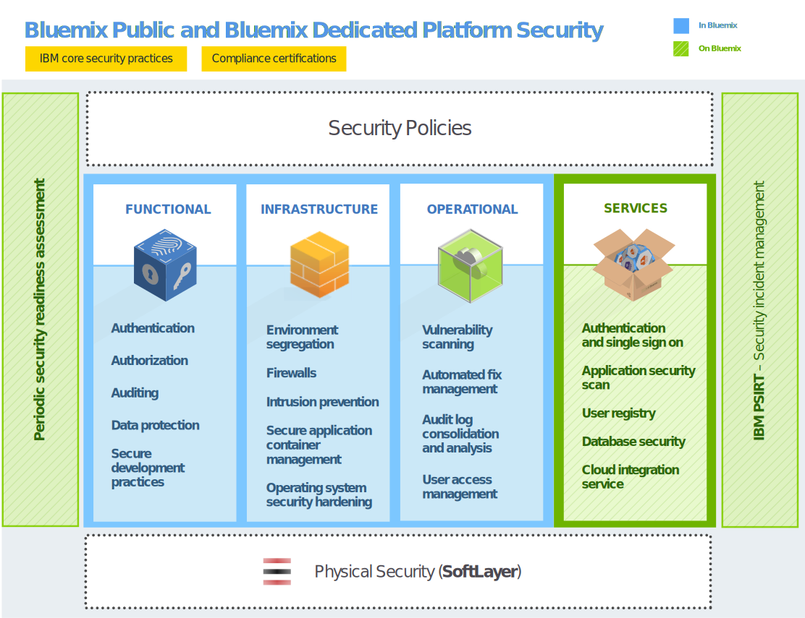

---

 

copyright:

  years: 2014, 2016

 

---

{:new_window: target="_blank"}
{:shortdesc: .shortdesc}

# Sicurezza {{site.data.keyword.Bluemix_notm}}
{: #security}
*Ultimo aggiornamento: 9 maggio 2016*

Sviluppata con procedure di progettazione sicura, la piattaforma {{site.data.keyword.Bluemix}} offre diversi livelli di controlli di sicurezza tra
la rete e l'infrastruttura. {{site.data.keyword.Bluemix_notm}} fornisce un gruppo di servizi di sicurezza che possono essere utilizzati dagli sviluppatori di applicazioni per proteggere le proprie applicazioni mobili e Web. Questi elementi si combinano per rendere {{site.data.keyword.Bluemix_notm}} una piattaforma con scelte chiare
per lo sviluppo di applicazioni sicure.
{:shortdesc}

{{site.data.keyword.Bluemix_notm}} garantisce disponibilità immediata della sicurezza aderendo alle politiche di sicurezza basate sulle procedure ottimali in IBM per i sistemi, la rete e la progettazione sicura. Tali politiche includono
procedure quali, ad esempio, scansione del codice sorgente, scansione dinamica, modellazione dei rischi e test di penetrazione. {{site.data.keyword.Bluemix_notm}} segue il processo IBM PSIRT (Product Security Incident Response Team) per la gestione degli
incidenti di sicurezza. Per i dettagli, consulta il sito [IBM Security Vulnerability Management (PSIRT)](http://www-03.ibm.com/security/secure-engineering/process.html){: new_window}.

{{site.data.keyword.Bluemix_notm}} pubblico e privato utilizzano i servizi cloud IBM SoftLayer IaaS (Infrastructure-as-a-Service) e sfruttano appieno la sua architettura di sicurezza. Per le tue applicazioni e i tuoi dati, SoftLayer IaaS fornisce molteplici livelli di
protezione che si sovrappongono tra di loro. Per {{site.data.keyword.Bluemix_notm}} locale, la sicurezza fisica è di tua competenza e fornisci l'infrastruttura
ospitando {{site.data.keyword.Bluemix_notm}} locale nel tuo data center dietro un firewall aziendale. Inoltre, {{site.data.keyword.Bluemix_notm}} aggiunge funzionalità di sicurezza a livello
PaaS (Platform as a Service) in diverse categorie: piattaforma, dati e applicazione.

## Sicurezza della piattaforma
   {{site.data.keyword.Bluemix_notm}}
{: #platform-security}

{{site.data.keyword.Bluemix_notm}} fornisce sicurezza funzionale, di infrastruttura, operativa e fisica (tramite IBM SoftLayer) per la piattaforma di base. Tuttavia, {{site.data.keyword.Bluemix_notm}} locale è unico per il fatto che il cliente fornisce l'infrastruttura e il data center ed è di sua competenza la sicurezza fisica.

L'ambiente {{site.data.keyword.Bluemix_notm}} su SoftLayer è conforme ai più severi standard di sicurezza IT (information technology) IBM, che soddisfano o superano gli standard del settore. Tali standard includono:
rete, crittografia di dati e controllo dell'accesso
 * ACL applicazione, autorizzazioni e test di penetrazione
 * Identificazione, autenticazione e autorizzazione
 * Protezione di informazioni e dati
 * Integrità e disponibilità dei servizi
 * Vulnerabilità e gestione delle correzioni
 * Rilevamento di attacchi Denial of Service e sistematici
 * Risposta agli incidenti di sicurezza

*Figura 1. Panoramica della sicurezza della piattaforma {{site.data.keyword.Bluemix_notm}}*

Con {{site.data.keyword.Bluemix_notm}} locale, ospiti {{site.data.keyword.Bluemix_notm}} dietro il tuo firewall aziendale e nel tuo data center. Pertanto, sei responsabile di determinati aspetti legati alla sicurezza. La seguente immagine illustra in modo dettagliato quali parti della sicurezza sono di competenza del cliente e quali sono invece gestite da IBM.

*Figura 2. Panoramica della sicurezza della piattaforma {{site.data.keyword.Bluemix_notm}} locale*

IBM installa, esegue il monitoraggio in remoto e gestisce {{site.data.keyword.Bluemix_notm}} locale nel tuo data center attraverso Relay, una funzionalità di consegna inclusa in {{site.data.keyword.Bluemix_notm}} locale. Relay si connette in modo sicuro con i certificati specifici di ciascuna istanza {{site.data.keyword.Bluemix_notm}} locale. Per ulteriori informazioni su {{site.data.keyword.Bluemix_notm}} locale e Relay, vedi [Bluemix locale](../local/index.html).

### Sicurezza funzionale

{{site.data.keyword.Bluemix_notm}} fornisce diverse capacità di sicurezza funzionali,
tra cui l'autenticazione degli utenti, l'autorizzazione degli accessi, il controllo delle operazioni critiche e la protezione dei dati.

<dl>
<dt>Autenticazione</dt>
<dd>Gli sviluppatori di applicazioni sono autenticati presso {{site.data.keyword.Bluemix_notm}} utilizzando l'identità web IBM.

Per {{site.data.keyword.Bluemix_notm}} dedicato e locale, l'autenticazione tramite LDAP è supportata per impostazione predefinita. Altrimenti, su richiesta, per {{site.data.keyword.Bluemix_notm}} è possibile configurare l'autenticazione tramite l'identità Web IBM.
</dd>

<dt>Autorizzazione</dt>
<dd>{{site.data.keyword.Bluemix_notm}} utilizza i meccanismi Cloud Foundry per assicurare che ogni sviluppatore di applicazioni abbia accesso solo alle applicazioni e alle istanze di servizio da essi create. L'autorizzazione ai servizi {{site.data.keyword.Bluemix_notm}} è basata su OAuth. L'accesso a tutti gli endpoint interni della piattaforma {{site.data.keyword.Bluemix_notm}} è limitato per gli utenti esterni.</dd>

<dt>Controllo</dt>
<dd>I log di controllo vengono creati per tutti i tentativi di autenticazione riusciti e non riusciti degli sviluppatori di applicazioni. I log di controllo vengono creati anche per l'accesso privilegiato ai sistemi Linux che ospitano i contenitori dove vengono eseguite le applicazioni {{site.data.keyword.Bluemix_notm}}.</dd>

<dt>Protezione dei dati</dt>
<dd> Tutto il traffico {{site.data.keyword.Bluemix_notm}} transita per i prodotti IBM WebSphere® DataPower® SOA Appliances, che forniscono funzioni di proxy inverso, terminazione SSL e
bilanciamento del carico
Sono consentiti i seguenti
  metodi HTTP:
 * DELETE
 * GET
 * HEAD
 * OPTIONS
 * POST
 * PUT
 * TRACE

Il timeout per inattività HTTP è fissato a 2 minuti.

Le seguenti intestazioni sono compilate da DataPower:
<dl>
<dt>$wsis</dt>
<dd>Impostala su true se la connessione lato client è protetta (HTTPS), altrimenti impostala su false.</dd>
<dt>$wssc</dt>
<dd>Impostala su uno dei seguenti schemi di connessione client: https, http, ws o wss.</dd>
<dt>$wssn</dt>
<dd>Impostala sul nome host inviato dal client.</dd>
<dt>$wssp</dt>
<dd>Impostala sulla porta server a cui si connette il client.</dd>
<dt>x-client-ip</dt>
<dd>Impostala sull'indirizzo IP del client.</dd>
<dt>x-forwarded-proto</dt>
<dd>Impostala su uno dei seguenti schemi di connessione client: https, http, ws o wss.</dd>
</dl>
</dd>

<dt>Procedure di sviluppo sicuro</dt>
<dd> Per {{site.data.keyword.Bluemix_notm}} pubblico e dedicato, vengono eseguite delle scansioni di vulnerabilità della sicurezza periodiche su diversi componenti di {{site.data.keyword.Bluemix_notm}} tramite IBM Security AppScan® Dynamic Analyzer. Vengono eseguite le procedure di modellazione dei rischi e test di penetrazione per individuare e risolvere eventuali possibili vulnerabilità per tutti i tipi di distribuzioni {{site.data.keyword.Bluemix_notm}}. Inoltre, gli sviluppatori di applicazioni possono utilizzare il servizio AppScan Dynamic Analyzer per proteggere le proprie applicazioni web distribuite su {{site.data.keyword.Bluemix_notm}}.</dd>
</dl>

### Sicurezza dell'infrastruttura

{{site.data.keyword.Bluemix_notm}} si sviluppa su Cloud Foundry per fornire una solida base per l'esecuzione delle tue applicazioni. All'interno dell'architettura, vengono forniti diversi componenti per la sicurezza e l'isolamento. Inoltre, vengono implementate procedure di gestione delle modifiche e di backup
e ripristino per garantire l'integrità e la disponibilità.

<dl>
<dt>Separazione degli ambienti</dt>
<dd> Per {{site.data.keyword.Bluemix_notm}} pubblico, gli ambienti di sviluppo e di produzione vengono separati tra loro per migliorare la stabilità e la sicurezza
dell'applicazione.</dd>

<dt>Firewall</dt>
<dd> I firewall vengono implementati per limitare l'accesso alla rete {{site.data.keyword.Bluemix_notm}}. Per {{site.data.keyword.Bluemix_notm}} locale, il tuo firewall aziendale separa il resto della tua rete dalla tua istanza {{site.data.keyword.Bluemix_notm}}.</dd>

<dt>Protezione intrusioni</dt>
<dd>{{site.data.keyword.Bluemix_notm}} pubblico e dedicato abilitano la protezione dalle intrusioni per il rilevamento di minacce in modo che sia possibile risolverle. Le politiche di protezione intrusioni sono
abilitate sui firewall.</dd>

<dt>Gestione del contenitore applicazioni sicuro</dt>
<dd>Ciascuna applicazione {{site.data.keyword.Bluemix_notm}} è
isolata e viene eseguita nel suo proprio contenitore che ha specifici limiti di risorsa per processore, memoria e
disco.</dd>

<dt>Protezione avanzata del sistema operativo</dt>
<dd>Gli amministratori IBM eseguono regolarmente la protezione avanzata del sistema operativo e della rete, utilizzando strumenti come IBM Endpoint Manager.</dd>
</dl>

### Sicurezza operativa

{{site.data.keyword.Bluemix_notm}} fornisce un solido ambiente di sicurezza operativa con i seguenti controlli.

<dl>
<dt>Scansione delle vulnerabilità</dt>
<dd>{{site.data.keyword.Bluemix_notm}} utilizza lo strumento di scansione delle vulnerabilità Tenable Network Security, Nessus, per rilevare eventuali problemi con le configurazioni di rete e host in modo da consentire di occuparsene.</dd>

<dt>Gestione delle correzioni automatizzate</dt>
<dd>Gli amministratori di {{site.data.keyword.Bluemix_notm}} garantiscono che
le correzioni per i sistemi operativi vengano applicate con frequenza adeguata. Le correzioni automatizzate vengono abilitate utilizzando IBM Endpoint Manager.</dd>

<dt>Consolidamento e analisi dei log di controllo</dt>
<dd>{{site.data.keyword.Bluemix_notm}} utilizza gli strumenti IBMSecurity QRadar® per accorpare i log Linux per monitorare l'accesso privilegiato sui sistemi Linux. {{site.data.keyword.Bluemix_notm}} utilizza inoltre IBM QRadar SIEM (security information and event management) per
monitorare i tentativi di accesso riusciti e non riusciti degli sviluppatori di applicazioni.</dd>

<dt>Gestione degli accessi utente</dt>
<dd>All'interno di {{site.data.keyword.Bluemix_notm}}, vengono seguite le linee guida di Separazione dei compiti per assegnare agli utenti dei privilegi di accesso granulari e per garantire che gli utenti dispongano soltanto dell'accesso richiesto per eseguire i propri lavori in base al principio del
minimo privilegio.

In ambienti {{site.data.keyword.Bluemix_notm}} dedicato e locale, gli amministratori assegnati possono gestire i ruoli e le autorizzazioni per l'utente {{site.data.keyword.Bluemix_notm}} nella propria organizzazione utilizzando la Console di gestione. Per i dettagli, vedi [Gestione di {{site.data.keyword.Bluemix_notm}} locale e dedicato](../admin/index.html#mng).
</dd>
</dl>

### Sicurezza fisica

{{site.data.keyword.Bluemix_notm}} pubblico e dedicato si avvalgono della topologia di rete all'interno di una rete di SoftLayer per la sicurezza della rete fisica. Questa architettura di rete all'interno di una rete garantisce
che i sistemi siano pienamente accessibili solo al personale autorizzato. Per {{site.data.keyword.Bluemix_notm}} locale, è di tua competenza la sicurezza fisica per l'istanza locale. Il tuo data center è protetto dietro il tuo firewall aziendale.

Nella rete all'interno di una rete SoftLayer, il livello di rete pubblico gestisce il traffico pubblico a siti Web su host o risorse in linea. Il livello di rete privato consente una
effettiva gestione fuori banda mediante un terzo vettore autonomo e distinto su gateway SSL, PPTP o IPSec VPN. Il livello di rete data center-data center fornisce una
connettività gratuita e protetta tra server alloggiati in strutture SoftLayer separate.

Ogni data center SoftLayer è pienamente protetto, con controlli che soddisfano i requisiti SSAE 16 e
quelli riconosciuti dal settore, senza alcuna eccezione. Per ulteriori informazioni, consultare la pagina Conformità di sicurezza SoftLayer.

## Sicurezza dei dati
{: #data-security}

Con {{site.data.keyword.Bluemix_notm}},
la protezione dei dati da accessi non autorizzati è uno sforzo congiunto tra te e {{site.data.keyword.Bluemix_notm}}.

I dati associati a un'applicazione in esecuzione possono trovarsi in uno di tre stati:
data-in-transit, data-at-rest e data-in-use.

<dl>
<dt>Data-in-transit</dt>
<dd>Dati che vengono trasferiti tra i nodi su una rete.</dd>

<dt>Data-at-rest</dt>
<dd>Dati che vengono memorizzati.</dd>

<dt>Data-in-use</dt>
<dd>Dati che non sono attualmente memorizzati a cui verrà applicata un'azione in un endpoint.</dd>
</dl>

Quando pianifichi la sicurezza dei dati, è necessario considerare ciascun tipo di dati.

La piattaforma {{site.data.keyword.Bluemix_notm}} protegge i data-in-transit proteggendo l'accesso dell'utente finale all'applicazione utilizzando SSL, per tutta la rete,
finché i dati non raggiungono l'IBM DataPower Gateway al limite della rete interna {{site.data.keyword.Bluemix_notm}}. IBM
DataPower Gateway funge da proxy inverso e fornisce la terminazione SSL.

Come sviluppatore della tua applicazione, sei responsabile della sicurezza sia dei data-in-use
che dei data-at-rest. Puoi usufruire dei diversi servizi correlati ai dati disponibili nel catalogo {{site.data.keyword.Bluemix_notm}} per informazioni a tale riguardo.

## Sicurezza delle applicazioni
               {{site.data.keyword.Bluemix_notm}}
{: #application-security}

In quanto sviluppatore di applicazioni, è tuo compito abilitare le configurazioni di sicurezza, compresa la
protezione dei dati applicativi, per le tue applicazioni che vengono eseguite su {{site.data.keyword.Bluemix_notm}}.

Per proteggere le tue applicazioni puoi servirti delle funzionalità di sicurezza fornite da diversi servizi {{site.data.keyword.Bluemix_notm}}. Tutti i servizi {{site.data.keyword.Bluemix_notm}} prodotti da IBM seguono le procedure di sviluppo di IBM Secure Engineering.

**Nota:** alcuni dei servizi qui descritti potrebbero non essere validi per le istanze Bluemix dedicato o locale.

### Servizio SSO

IBM Single Sign On per {{site.data.keyword.Bluemix_notm}} è
un servizio di autenticazione basato sulle politiche che fornisce una funzionalità SSO
(single sign-on) facile da incorporare per le applicazioni Node.js o Liberty for Java™. Per consentire a uno sviluppatore
applicazioni di incorporare la funzionalità SSO in un'applicazione,
l'amministratore crea istanze del servizio e aggiunge origini di identità.

Il servizio Single Sign On supporta diverse origini di identità in cui vengono memorizzate le credenziali dei tuoi utenti:

<dl>
<dt>SAML Enterprise</dt>
<dd>Un registro utenti con uno scambio di token SAML che completa
l'autenticazione.</dd>

<dt>Cloud Directory</dt>
<dd>Un registro utenti ospitato in IBM Cloud.</dd>

<dt>Origini di identità sociale</dt>
<dd> I registri utenti gestiti da Google, Facebook e
LinkedIn.</dd>
</dl>

Per ulteriori informazioni, vedi [Introduzione a Single Sign On](../services/SingleSignOn/index.html).

### Application Security on Cloud

Questo servizio fornisce un'analisi della sicurezza delle applicazioni Web e mobili e ti consente di scansionare il codice sorgente alla ricerca di vulnerabilità di sicurezza. Per ulteriori informazioni, vedi [Introduzione a Application Security on Cloud](../services/ApplicationSecurityonCloud/index.html).

### Plug-in IBM UrbanCode per il test di sicurezza delle applicazioni

Il plug-in IBM Application Security Testing for {{site.data.keyword.Bluemix_notm}} ti consente di eseguire la scansione sulle tue applicazioni Web o Android ospitate su {{site.data.keyword.Bluemix_notm}}. Questo plug-in è sviluppato e supportato dalla IBM UrbanCode™ Deploy Community sulla piattaforma IBM Bluemix DevOps Services.

Per ulteriori informazioni, vai a [IBM Application Security Testing for Bluemix](https://developer.ibm.com/urbancode/plugindoc/ibmucd/ibm-application-security-testing-bluemix/1-0/){: new_window}.

### dashDB

Il servizio dashDB utilizza un server LDAP integrato per l'autenticazione utente. La connessione tra le applicazioni e il database è protetta da certificati SSL. Questo servizio utilizza la capacità di crittografia nativa di DB2® per crittografare automaticamente il tuo database distribuito e i tuoi backup di database. La rotazione della chiave master è automatica e si verifica ogni 90 giorni.

Per ulteriori informazioni, vedi [Introduzione a dashDB](../services/dashDB/index.html).

### Cloud Integration

Il servizio Cloud Integration ti consente di integrare i dati cloud e installati in loco. Puoi aggiungere un servizio per interagire con i database di backend, quali DB2, Oracle e SAP. Inoltre, puoi spostare i dati
o creare API REST per l'accesso e utilizzo da parte delle applicazioni
{{site.data.keyword.Bluemix_notm}}. Il servizio abilita la comunicazione protetta con i connettori sicuri
installati in loco ed espone i system of record di backend come API REST
che verranno utilizzate dalle applicazioni.

Per ulteriori informazioni, vedi [Introduzione a Cloud Integration](../services/CloudIntegration/index.html).

### Secure Gateway

Il servizio Secure Gateway ti consente di connettere in modo sicuro le applicazioni {{site.data.keyword.Bluemix_notm}} a posizione remote, siano essere installate in loco o nel cloud. Fornisce
una connettività sicura e stabilisce un tunnel tra la tua organizzazione {{site.data.keyword.Bluemix_notm}}
e la posizione remota a cui vuoi connetterti. Puoi configurare
e creare un gateway sicuro utilizzando l'interfaccia utente {{site.data.keyword.Bluemix_notm}}
o un pacchetto API.

Per ulteriori informazioni, vedi [Introduzione a Secure Gateway](../services/SecureGateway/secure_gateway.html).

### SQL Database

Il servizio SQL Database aggiunge alla tua applicazione un database relazionale con provisioning completo. Questo servizio utilizza LDAP IBM Directory Server per l'autenticazione
e IBM InfoSphere® Guardium® Data Activity Monitor per proteggere il database a cui accedono le applicazioni. La connessione tra le applicazioni e il database è protetta dal certificato SSL firmato da DigiCert.

In alcuni piani disponibili con questo servizio, puoi
utilizzare la console del database SQL in {{site.data.keyword.Bluemix_notm}} per
ottenere i report che contengono le seguenti informazioni:

 * I dati sensibili che possono essere presenti nel database a cui accedono le applicazioni.
 * Gli utenti dell'applicazione che hanno eseguito un accesso al database in uno specifico periodo.
 * Gli utenti dell'applicazione che stanno accedendo a dati sensibili presenti nel database.

Per mascherare i dati utilizzando SQL, le applicazioni possono richiamare le UDF (user-defined function) di mascheramento distribuite insieme al database. Puoi ad esempio mascherare i dati che intendi utilizzare altrove per
attività di test. Le UDF implementano gli algoritmi di mascheramento dei dati da IBM Infosphere Optim™.

Il piano Premium per questo servizio include anche la crittografia dei dati. Per ulteriori informazioni su questo servizio, vedi [Introduzione a SQL Database](../services/SQLDB/index.html).

### SIEM (Security Information and Event Management)

Puoi utilizzare gli strumenti SIEM (Security Information and Event Management) per analizzare gli avvisi di sicurezza nei log dell'applicazione. Uno di questi strumenti è IBM Security QRadar&reg; SIEM, che fornisce servizi di sicurezza in ambienti cloud. Per informazioni, vedi [IBM QRadar Security Intelligence Platform](http://www-01.ibm.com/support/knowledgecenter/SS42VS/welcome?lang=en){: new_window}.

## Distribuzione della sicurezza
{{site.data.keyword.Bluemix_notm}}
{: #security-deployment}

L'architettura della distribuzione della sicurezza {{site.data.keyword.Bluemix_notm}}
include flussi di informazioni differenti per gli utenti dell'applicazione e gli sviluppatori al fine di garantire un accesso
sicuro.

*Figura 3. Architettura della distribuzione della sicurezza Bluemix*

Per gli *utenti dell'applicazione* {{site.data.keyword.Bluemix_notm}}, il **flusso utente applicazione** è il seguente:
 1. Tramite firewall, con il rilevamento delle intrusioni e la sicurezza di rete attivi.
 2. Tramite IBM DataPower Gateway con proxy inverso e proxy di terminazione SSL.
 3. Tramite il router di rete.
 4. Raggiunge il runtime dell'applicazione nel DEA (Droplet Execution Agent).

Lo {{site.data.keyword.Bluemix_notm}} *sviluppatore* segue due flussi principali, per l'accesso e per lo sviluppo e la distribuzione.
 * Il **flusso di accesso degli sviluppatori** include quanto segue:
    * Per gli sviluppatori che accedono a {{site.data.keyword.Bluemix_notm}} pubblico, il flusso avviene come segue:
      1. Tramite il servizio IBM Single Sign On.
      2. Tramite l'identità Web IBM.
    * Per gli sviluppatori che accedono a {{site.data.keyword.Bluemix_notm}} dedicato o locale, il flusso passa attraverso il protocollo LDAP aziendale.
 * Il **flusso di sviluppo e distribuzione** è il seguente:
    1. Tramite firewall, con il rilevamento delle intrusioni e la sicurezza di rete attivi. Ciò vale solo per {{site.data.keyword.Bluemix_notm}} dedicato.
    2. Tramite IBM DataPower Gateway con proxy inverso e proxy di terminazione SSL.
    3. Tramite il router di rete.
    4. Tramite autorizzazione utilizzando il controller Cloud Foundry, per garantire l'accesso alle sole applicazioni
e istanze del servizio create dallo sviluppatore.

Per gli *amministratori* di {{site.data.keyword.Bluemix_notm}} dedicato e {{site.data.keyword.Bluemix_notm}} locale, il **flusso amministratore** è il seguente:
 1. Tramite firewall, con il rilevamento delle intrusioni e la sicurezza di rete attivi.
 2. Tramite IBM DataPower Gateway con proxy inverso e proxy di terminazione SSL.
 3. Tramite il router di rete.
 4. Raggiunge la pagina Amministrazione nell'interfaccia utente {{site.data.keyword.Bluemix_notm}}.

Oltre agli utenti descritti in questi percorsi, un team per le operazioni di sicurezza IBM svolge diverse attività di sicurezza operativa, tra cui:
 * Scansioni delle vulnerabilità. Per {{site.data.keyword.Bluemix_notm}} locale, sono di tua competenza la sicurezza fisica e le eventuali scansioni all'interno del tuo firewall.
 * Gestione degli accessi utente.
 * Protezione avanzata del sistema operativo mediante l'applicazione periodica di correzioni con IBM Endpoint Manager.
 * Gestione dei rischi con protezione intrusioni.
 * Monitoraggio della sicurezza con QRadar.
 * Report di sicurezza disponibili sulla pagina Amministrazione.

## Conformità di sicurezza
{: #compliance}

{{site.data.keyword.Bluemix}} fornisce una piattaforma cloud sicura di cui ti puoi fidare. La conformità {{site.data.keyword.Bluemix_notm}} deriva da una piattaforma e da servizi basati sui migliori standard di sicurezza, tra cui ISO 27001 e ISO 27002.
{:shortdesc}

  una **Clausola del modello dell'Unione Europea (UE)** è un accordo studiato per proteggere i dati personali che vengono trasferiti dall'Unione Europea (UE) o dallo Spazio economico europeo (SEE) verso un terzo paese. La Clausola del modello UE viene firmato tra il client ubicato nell'UE o SEE come esportatore di dati e il processore di dati IBM ubicato nel paese terzo come importatore dei dati. La [IBM SaaS EU Model Clause](http://www-01.ibm.com/common/ssi/cgi-bin/ssialias?subtype=ST&infotype=SA&htmlfid=KUJ12408USEN&attachment=KUJ12408USEN.PDF){: new_window} contiene i diritti e gli obblighi dell'esportatore e dell'importatore dei dati nonché i diritti dei soggetti interessati. La Clausola del modello UE IBM SaaS garantisce che i dati personali, quando elaborati in un paese terzo, siano posti sotto una protezione analoga a quella disponibile all'interno dell'UE o SEE.

  Per le istituzioni bancarie e finanziarie correlate in Giappone, i sistemi informatici devono disporre di procedure di sicurezza in vigore basate sulle linee guida di sicurezza FICS (Center for Financial Industry Information Systems). Le linee guida di sicurezza **FISC** vengono fatte rispettare dal Japan Financial Services Agency (FSA), Bank of Japan (BOJ) e FISC.

Puoi trovare un documento di autovalutazione {{site.data.keyword.Bluemix_notm}} per le linee guida di sicurezza FISC, scritto in giapponese, in [IBM Bluemix risk survey results](https://www.ibm.com/cloud-computing/jp/ja/bluemix_fisc.html){: new_window}. 

  {{site.data.keyword.Bluemix_notm}} è certificato secondo gli **standard ISO (International Organization for Standardization) 27001 e 27002**, che definiscono le procedure ottimali per i processi di gestione della sicurezza informatica. Lo standard ISO 27001 specifica i requisiti per stabilire, implementare e documentare i sistemi di gestione della sicurezza delle informazioni (ISMS) e i requisiti per applicare dei controlli di sicurezza in base alle esigenze delle singole organizzazioni. Lo standard ISO 27002 illustra in dettaglio ciascun controllo di sicurezza dell'ISO 27001. L'insieme di standard ISO 27000 incorpora un processo di ridimensionamento del rischio e valutazione delle risorse, con l'obiettivo di salvaguardare la riservatezza, l'integrità e la disponibilità delle informazioni scritte, orali ed elettroniche.

{{site.data.keyword.Bluemix_notm}} è controllato da una società di sicurezza di terze parti e rispetta tutti i requisiti per l'ISO 27001: [Bluemix ISO 27001:2013 Certificate of Registration](ftp://public.dhe.ibm.com/cloud/bluemix/compliance/Bluemix_ISO27K1_WWCert_2016.pdf){: new_window}.

 I report **Service Organization Controls (SOC)** definiscono la valutazione delle principali pratiche di controllo interno che riguardano la sicurezza, la disponibilità, l'integrità di elaborazione, la riservatezza e la privacy in un'organizzazione di servizi. I report generati mediante la Guida AICPA (American Institute of Certified Public Accountant) includono i seguenti elementi: 
  * Controllo dell'organizzazione
  * Programma di gestione dei fornitori
  * Processi interni del governo di impresa e della gestione dei rischi
  * Controllo regolamentare

{{site.data.keyword.Bluemix_notm}} utilizza i servizi cloud IBM SoftLayer IaaS (Infrastructure-as-a-Service) e si avvale appieno della sua architettura di sicurezza. Per ulteriori informazioni, contatta il team delle [vendite {{site.data.keyword.Bluemix_notm}}](mailto:bmxcert1@us.ibm.com){:new_window}.

### Conformità di servizi e piattaforme
La seguente tabella mostra quali servizi {{site.data.keyword.Bluemix_notm}} sono conformi a ciascuno standard.

|Componenti {{site.data.keyword.Bluemix_notm}}		|FISC		|ISO 27001	|SOC 2 Type 1		|
|:----------------------|:---------:|:---------:|:---------:|
|Piattaforma {{site.data.keyword.Bluemix_notm}}		|S			|S	|S	|
|{{site.data.keyword.APIM}}			|S	|S |			|
|{{site.data.keyword.autoscaling}}			|S	|S |			|
|{{site.data.keyword.bigicloudst}}			|S |S |S |
|{{site.data.keyword.cloudant}}				|S |S |S	|
|{{site.data.keyword.dashdbshort}}			|S	|S	|S	|
|{{site.data.keyword.datacshort}}			|S	|S	|			|
|{{site.data.keyword.jazzhub_short}}					|S	|S	|			|
|{{site.data.keyword.containerlong}}			|S		|S	|			|
|{{site.data.keyword.mql}}				|S	|S	|	 		|
|{{site.data.keyword.SecureGateway}}			|S	|S |	 		|
|{{site.data.keyword.sescashort}}     |S |S | |

*Tabella 1. Conformità di servizi e piattaforme*

# Link correlati
{: #rellinks}

## Link correlati
{: #general}

* [Conformità di sicurezza SoftLayer](http://www.softlayer.com/security)
* [Introduzione a Single Sign On](../services/SingleSignOn/index.html)
