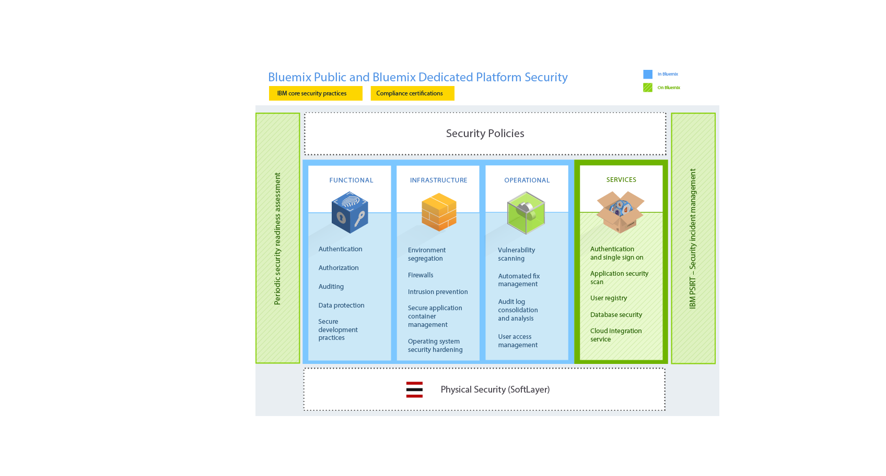

{:shortdesc: .shortdesc}

# Sicurezza di {{site.data.keyword.Bluemix_notm}}
{: #security}
*Ultimo aggiornamento: 15 ottobre 2015*

Sviluppata con procedure di progettazione sicura, la piattaforma {{site.data.keyword.Bluemix}} offre diversi livelli di controlli di sicurezza tra
la rete e l'infrastruttura. {{site.data.keyword.Bluemix_notm}}
fornisce inoltre una suite di servizi di sicurezza che possono essere utilizzati dagli sviluppatori di applicazioni per proteggere
le proprie applicazioni mobili e Web. Questi elementi si combinano per rendere {{site.data.keyword.Bluemix_notm}} una piattaforma con scelte chiare
per lo sviluppo di applicazioni sicure.
{:shortdesc}

{{site.data.keyword.Bluemix_notm}} garantisce disponibilità immediata della sicurezza aderendo alle politiche basate sulle procedure ottimali in IBM per i sistemi, la rete e la progettazione sicura. Tali politiche includono
procedure quali, ad esempio, scansione del codice sorgente, scansione dinamica, modellazione dei rischi e test di penetrazione. {{site.data.keyword.Bluemix_notm}} segue il processo IBM PSIRT (Product Security Incident Response Team) per la gestione dei problemi di sicurezza. Per i dettagli, consulta il sito [IBM Security Vulnerability Management (PSIRT)](http://www-03.ibm.com/security/secure-engineering/process.html).

{{site.data.keyword.Bluemix_notm}} pubblico e privato utilizzano i servizi cloud IBM SoftLayer IaaS (Infrastructure-as-a-Service) e sfruttano appieno la sua architettura di sicurezza. Per le tue applicazioni e i tuoi dati, SoftLayer IaaS fornisce molteplici livelli di
protezione che si sovrappongono tra di loro. Per {{site.data.keyword.Bluemix_notm}} locale, disponi della sicurezza fisica e
fornisci l'infrastruttura ospitando {{site.data.keyword.Bluemix_notm}} locale nel tuo data center protetto dal
firewall aziendale. Inoltre, {{site.data.keyword.Bluemix_notm}} aggiunge funzionalità di sicurezza a livello
PaaS (Platform as a Service) in diverse categorie: piattaforma, dati e applicazione.

## Sicurezza della piattaforma
   {{site.data.keyword.Bluemix_notm}}
{: #platform-security}

{{site.data.keyword.Bluemix_notm}} fornisce sicurezza funzionale, di infrastruttura, operativa e fisica (tramite IBM SoftLayer) per la piattaforma di base. Tuttavia, {{site.data.keyword.Bluemix_notm}} locale è univoco in quanto il cliente
fornisce l'infrastruttura e il data center e dispone della sicurezza fisica.

L'ambiente {{site.data.keyword.Bluemix_notm}} su SoftLayer è conforme ai più severi standard di sicurezza IT (information technology) IBM, che soddisfano o superano gli standard del settore. Questi standard includono quanto segue:
Rete, crittografia di dati e controllo dell'accesso
 * ACL applicazione, autorizzazioni e test di penetrazione
 * Identificazione, autenticazione e autorizzazione
 * Protezione di informazioni e dati
 * Integrità e disponibilità dei servizi
 * Vulnerabilità e gestione delle correzioni
 * Rilevamento di attacchi Denial of Service e sistematici
 * Risposta agli incidenti di sicurezza

*Figura 1. Panoramica della sicurezza della piattaforma {{site.data.keyword.Bluemix_notm}}*

La sicurezza per {{site.data.keyword.Bluemix_notm}} locale è diversa perché disponi di specifici aspetti della sicurezza ospitando Bluemix dietro il firewall della tua azienda e nel tuo data center. La seguente immagine mostra in dettaglio quali parti della sicurezza appartengono al cliente e quali sono gestite e mantenute da IBM.

*Figura 2. Panoramica della sicurezza della piattaforma {{site.data.keyword.Bluemix_notm}} locale*

### Sicurezza funzionale

{{site.data.keyword.Bluemix_notm}} fornisce diverse capacità di sicurezza funzionali,
tra cui l'autenticazione degli utenti, l'autorizzazione degli accessi, il controllo delle operazioni critiche e la protezione dei dati.

<dl>
<dt>Autenticazione</dt>
<dd>Gli sviluppatori di applicazioni sono autenticati presso {{site.data.keyword.Bluemix_notm}} utilizzando l'identità Web IBM

Per {{site.data.keyword.Bluemix_notm}} dedicato e locale, l'autenticazione
tramite LDAP è supportata per impostazione predefinita. Su richiesta, per {{site.data.keyword.Bluemix_notm}}, è possibile configurare l'autenticazione tramite l'identità Web IBM.
</dd>

<dt>Autorizzazione</dt>
<dd>{{site.data.keyword.Bluemix_notm}} utilizza i meccanismi Cloud Foundry per assicurare che ogni sviluppatore di applicazioni abbia accesso solo alle applicazioni e alle istanze di servizio da essi create. L'autorizzazione ai servizi {{site.data.keyword.Bluemix_notm}} è basata su OAuth. L'accesso a tutti gli endpoint interni della piattaforma {{site.data.keyword.Bluemix_notm}} è limitato per gli utenti esterni.</dd>

<dt>Controllo</dt>
<dd>I log di controllo vengono creati per tutti i tentativi di autenticazione riusciti e non riusciti degli sviluppatori di applicazioni. I log di controllo vengono creati anche per l'accesso privilegiato ai sistemi Linux che ospitano i contenitori dove vengono eseguite le applicazioni {{site.data.keyword.Bluemix_notm}}.</dd>

<dt>Protezione dei dati</dt>
<dd> Tutto il traffico {{site.data.keyword.Bluemix_notm}} transita per i prodotti IBM WebSphere® DataPower® SOA Appliances, che forniscono funzioni di proxy inverso, terminazione SSL e bilanciamento del carico.
Sono consentiti i seguenti metodi HTTP:
 * DELETE
 * GET
 * HEAD
 * OPTIONS
 * POST
 * PUT
 * TRACE

Il timeout per inattività HTTP è fissato a 2 minuti.

Le seguenti intestazioni sono compilate da DataPower:
<dl>
<dt>$wsis</dt>
<dd>Impostala su true se la connessione lato client è protetta (HTTPS), altrimenti impostala su false.</dd>
<dt>$wssc</dt>
<dd>Impostala su uno dei seguenti schemi di connessione client: https, http, ws o wss.</dd>
<dt>$wssn</dt>
<dd>Impostala sul nome host inviato dal client.</dd>
<dt>$wssp</dt>
<dd>Impostala sulla porta server a cui si connette il client.</dd>
<dt>x-client-ip</dt>
<dd>Impostala sull'indirizzo IP del client.</dd>
<dt>x-forwarded-proto</dt>
<dd>Impostala su uno dei seguenti schemi di connessione client: https, http, ws o wss.</dd>
</dl>
</dd>

<dt>Procedure di sviluppo sicuro</dt>
<dd> Per {{site.data.keyword.Bluemix_notm}} pubblico e dedicato, vengono seguite delle periodiche scansioni di vulnerabilità della sicurezza sui vari componenti {{site.data.keyword.Bluemix_notm}} utilizzando le offerte IBM Security AppScan® Dynamic Analyzer e Static Analyzer. Vengono eseguite le procedure di modellazione dei rischi e test di penetrazione per individuare e risolvere eventuali possibili vulnerabilità per tutti i tipi di distribuzioni {{site.data.keyword.Bluemix_notm}}. Inoltre, gli sviluppatori di applicazioni possono utilizzare il servizio AppScan Dynamic Analyzer per proteggere le proprie applicazioni Web distribuite su {{site.data.keyword.Bluemix_notm}}.</dd>
</dl>

### Sicurezza dell'infrastruttura

{{site.data.keyword.Bluemix_notm}} si sviluppa su Cloud Foundry per fornire una solida base per l'esecuzione delle tue applicazioni. All'interno dell'architettura, vengono forniti diversi componenti per la sicurezza e l'isolamento. Inoltre, vengono implementate procedure di gestione delle modifiche e di backup
e ripristino per garantire l'integrità e la disponibilità.

<dl>
<dt>Separazione degli ambienti</dt>
<dd> Per {{site.data.keyword.Bluemix_notm}} pubblico, gli ambienti di sviluppo e di produzione vengono separati tra loro per migliorare la stabilità e la sicurezza dell'applicazione.</dd>

<dt>Firewall</dt>
<dd> I firewall vengono attivati per limitare l'accesso alla rete {{site.data.keyword.Bluemix_notm}}. Per {{site.data.keyword.Bluemix_notm}}
locale, il firewall dell'azienda isola il resto della rete dalla tua istanza {{site.data.keyword.Bluemix_notm}}.</dd>

<dt>Protezione intrusioni</dt>
<dd>{{site.data.keyword.Bluemix_notm}} pubblico e privato abilitano la protezione dalle intrusioni per il rilevamento di minacce in modo che sia possibile risolverle. Le politiche di protezione intrusioni sono
abilitate sui firewall.</dd>

<dt>Gestione del contenitore applicazioni sicuro</dt>
<dd>Ciascuna applicazione {{site.data.keyword.Bluemix_notm}} è
isolata e viene eseguita nel suo proprio contenitore che ha specifici limiti di risorsa per processore, memoria e
disco.</dd>

<dt>Protezione avanzata del sistema operativo</dt>
<dd>Gli amministratori IBM eseguono regolarmente la protezione avanzata del sistema operativo e della rete, utilizzando strumenti come IBM Endpoint Manager.</dd>
</dl>

### Sicurezza operativa

{{site.data.keyword.Bluemix_notm}} fornisce un solido ambiente di sicurezza operativa con i seguenti controlli.

<dl>
<dt>Scansione delle vulnerabilità</dt>
<dd>{{site.data.keyword.Bluemix_notm}} utilizza lo strumento di scansione delle vulnerabilità Tenable Network Security, Nessus, per rilevare eventuali problemi con le configurazioni di rete e host in modo da consentire di occuparsene.</dd>

<dt>Gestione delle correzioni automatizzate</dt>
<dd>Gli amministratori di {{site.data.keyword.Bluemix_notm}} garantiscono che
le correzioni per i sistemi operativi vengano applicate con frequenza adeguata. Le correzioni automatizzate vengono abilitate utilizzando IBM Endpoint Manager.</dd>

<dt>Consolidamento e analisi dei log di controllo</dt>
<dd>{{site.data.keyword.Bluemix_notm}} utilizza gli strumenti IBMSecurity QRadar® per consolidare i log Linux al fine di monitorare l'accesso privilegiato sui sistemi Linux. {{site.data.keyword.Bluemix_notm}} utilizza inoltre IBM QRadar SIEM (security information and event management) per monitorare i tentativi di accesso riusciti e non riusciti degli sviluppatori di applicazioni.</dd>

<dt>Gestione degli accessi utente</dt>
<dd>All'interno di {{site.data.keyword.Bluemix_notm}}, vengono seguite le linee guida di Separazione dei compiti per assegnare agli utenti dei privilegi di accesso granulari e per garantire che gli utenti dispongano soltanto dell'accesso richiesto per eseguire i propri lavori in base al principio del minimo privilegio.

All'interno degli ambienti {{site.data.keyword.Bluemix_notm}} dedicato e locale, gli amministratori assegnati possono gestire ruoli e autorizzazioni per l'utente {{site.data.keyword.Bluemix_notm}} nella propria organizzazione utilizzando la Console di gestione. Per i dettagli, vedi [Gestione di {{site.data.keyword.Bluemix_notm}}](../admin/index.html#mng).
</dd>
</dl>

### Sicurezza fisica

{{site.data.keyword.Bluemix_notm}} pubblico e dedicato si avvalgono della topologia rete all'interno di una rete di SoftLayer per la sicurezza della rete fisica. Questa architettura di rete all'interno di una rete garantisce
che i sistemi siano pienamente accessibili solo al personale autorizzato. Per {{site.data.keyword.Bluemix_notm}} locale, disponi
della sicurezza fisica per l'istanza locale. Il tuo data center viene protetto mediante il firewall
aziendale.

Nella rete all'interno di una rete SoftLayer, il livello di rete pubblico gestisce il traffico pubblico a siti Web su host o risorse in linea. Il livello di rete privato consente un'effettiva gestione fuori banda mediante un terzo vettore autonomo e distinto su gateway VPN SSL, PPTP o IPSec. Il livello di rete da data center a data center fornisce una connettività gratuita e protetta tra server ospitati in strutture SoftLayer separate.

Ogni data center SoftLayer è pienamente protetto, con controlli che soddisfano i requisiti SSAE 16 e
quelli riconosciuti dal settore, senza alcuna eccezione. Per ulteriori informazioni, vedi la pagina Conformità di sicurezza SoftLayer.

## Sicurezza dei dati
{: #data-security}

Con {{site.data.keyword.Bluemix_notm}},
la protezione dei dati da accessi non autorizzati è uno sforzo congiunto tra te e {{site.data.keyword.Bluemix_notm}}.

I dati associati a un'applicazione in esecuzione possono trovarsi in uno di tre stati:
data-in-transit, data-at-rest e data-in-use.

<dl>
<dt>Data-in-transit</dt>
<dd>Dati che vengono trasferiti tra i nodi su una rete.</dd>

<dt>Data-at-rest</dt>
<dd>Dati che vengono memorizzati.</dd>

<dt>Data-in-use</dt>
<dd>Dati che non sono attualmente memorizzati a cui verrà applicata un'azione in un endpoint.</dd>
</dl>

Quando pianifichi la sicurezza dei dati, è necessario considerare ciascun tipo di dati.

La piattaforma {{site.data.keyword.Bluemix_notm}} protegge i data-in-transit proteggendo l'accesso dell'utente finale all'applicazione utilizzando SSL, per tutta la rete, finché i dati non raggiungono l'IBM DataPower Gateway al limite della rete interna {{site.data.keyword.Bluemix_notm}}. IBM DataPower Gateway funge da proxy inverso e fornisce la terminazione SSL.

Come sviluppatore della tua applicazione, sei responsabile della sicurezza sia dei data-in-use
che dei data-at-rest. Puoi usufruire dei diversi servizi correlati ai dati disponibili nel Catalogo {{site.data.keyword.Bluemix_notm}} per informazioni a tale riguardo.

## Sicurezza delle applicazioni
               {{site.data.keyword.Bluemix_notm}}
{: #application-security}

In quando sviluppatore di applicazioni, è tuo compito abilitare le configurazioni di sicurezza, compresa la
protezione dei dati applicativi, per le tue applicazioni che vengono eseguite su {{site.data.keyword.Bluemix_notm}}.

Per proteggere le tue applicazioni puoi servirti delle funzionalità di sicurezza fornite da diversi servizi {{site.data.keyword.Bluemix_notm}}. Tutti i servizi {{site.data.keyword.Bluemix_notm}} prodotti da IBM seguono le procedure di sviluppo di IBM Secure Engineering.

**Nota:** alcuni dei servizi menzionati potrebbero non essere applicabili alle istanze di Bluemix dedicato o locale.

### Servizio SSO

IBM Single Sign On for {{site.data.keyword.Bluemix_notm}} è un servizio di autenticazione basato sulle politiche che fornisce una funzionalità SSO (single sign-on) facile da incorporare per le applicazioni Node.js o Liberty for Java™. Per consentire a uno sviluppatore
applicazioni di incorporare la funzionalità SSO in un'applicazione,
l'amministratore crea istanze del servizio e aggiunge origini di identità.

Il servizio Single Sign On supporta diverse origini di identità in cui vengono memorizzate le credenziali degli utenti:

<dl>
<dt>SAML Enterprise</dt>
<dd>Un registro utenti con uno scambio di token SAML che completa
l'autenticazione.</dd>

<dt>Cloud Directory</dt>
<dd>Un registro utenti ospitato in IBM Cloud.</dd>

<dt>Origini di identità sociale</dt>
<dd> I registri utenti gestiti da Google, Facebook e
LinkedIn.</dd>
</dl>

Per ulteriori informazioni, vedi [Introduzione a Single Sign On](../services/SingleSignOn/index.html).

### AppScan Mobile Analyzer

Questo servizio fornisce un'analisi della sicurezza delle applicazioni mobili Android. Per
utilizzare questo servizio, devi caricare un'applicazione Android compilata come un file APK. Una volta eseguita la scansione
dell'analisi di sicurezza, puoi scaricare un report.

Per ulteriori informazioni, vedi [Introduzione ad AppScan Mobile Analyzer](../services/AppScanMobileAnalyzer/index.html).

### AppScan Dynamic Analyzer

Questo servizio fornisce un'analisi della sicurezza delle applicazioni web con uno strumento di analisi dinamica. Lo strumento opera sull'applicazione web distribuita, non sul codice sorgente dell'applicazione, e può eseguire la scansione di qualsiasi applicazione web {{site.data.keyword.Bluemix_notm}} indipendentemente dal suo linguaggio o dalla sua tecnologia. Puoi eseguire la scansione esclusivamente delle applicazioni delle organizzazioni a cui appartieni. Per creare
una scansione, devi configurare l'URL dell'applicazione web e le eventuali credenziali di accesso. Una volta eseguita la scansione,
puoi scaricare un report.

Per ulteriori informazioni, vedi [Introduzione ad AppScan Dynamic Analyzer](../services/AppScanDynamicAnalyzer/index.html).

### Mobile Analyzer for iOS (Beta)

Il servizio Mobile Analyzer for iOS fornisce l'analisi di sicurezza dinamica AppScan per le applicazioni mobili iOS. Ti aiuta a identificare i
problemi legati alla sicurezza nelle tue applicazioni mobili iOS.

Per ulteriori informazioni, vedi [Introduzione a Mobile Analyzer for iOS](../services/AppScanIOS/index.html).

### Static Analyzer (Beta)

Il servizio Static Analyzer abilita i test di sicurezza delle applicazioni statici sul cloud. Ti aiuta a
rilevare eventuali vulnerabilità nel codice sorgente nelle prime fasi del ciclo di vita dello
sviluppo software, in modo da apportare tutte le adeguate correzioni prima della distribuzione.

Static Analyzer ti consente di scansionare Java e il contenuto Web Java utilizzando l'interfaccia riga di comando (CLI) sul tuo disco locale. Inoltre, puoi eseguire un piccolo
programma di installazione che aggiunge i plug-in Static Analyzer in Eclipse o Maven. Puoi utilizzare il programma di utilità client per scansionare e raccogliere informazioni
sui tuoi file in un file di archivio che potrai quindi inoltrare nel cloud per i
risultati della scansione.

Per ulteriori informazioni, vedi [Introduzione a IBM Static Analyzer for Bluemix](../services/StaticAnalyzer/index.html).

### Plug-in IBM UrbanCode per il test di sicurezza delle applicazioni

Il plug-in IBM Application Security Testing for {{site.data.keyword.Bluemix_notm}} ti consente di eseguire la scansione sulle tue applicazioni Web o Android ospitate su {{site.data.keyword.Bluemix_notm}}. Questo plug-in è sviluppato e supportato dalla IBM UrbanCode™ Deploy Community sulla piattaforma IBM Bluemix DevOps Services.

Per ulteriori informazioni, vai a [IBM Application Security Testing for Bluemix](https://developer.ibm.com/urbancode/plugindoc/ibmucd/ibm-application-security-testing-bluemix/1-0/).

### SQL Database

Il servizio SQL Database aggiunge alla tua applicazione un database relazione con provisioning completo. Questo servizio utilizza LDAP IBM Directory Server per l'autenticazione e IBM InfoSphere® Guardium® Data Activity Monitor per proteggere il database a cui accedono le applicazioni. La connessione tra le applicazioni e il database è protetta dal certificato SSL firmato da DigiCert.

In alcuni piani disponibili con questo servizio, puoi utilizzare la console del database SQL in {{site.data.keyword.Bluemix_notm}} per ottenere i report che contengono le seguenti informazioni:

 * I dati sensibili che possono essere presenti nel database a cui accedono le applicazioni.
 * Gli utenti dell'applicazione che hanno eseguito un accesso al database in uno specifico periodo.
 * Gli utenti dell'applicazione che stanno accedendo a dati sensibili presenti nel database.

Per mascherare i dati utilizzando SQL, le applicazioni possono richiamare le UDF (user-defined function) di mascheramento distribuite insieme al database. Puoi ad esempio mascherare i dati che intendi utilizzare altrove per
attività di test. Le UDF implementano gli algoritmi di mascheramento dei dati da IBM Infosphere Optim™.

Il piano Premium per questo servizio include anche la crittografia dei dati. Per ulteriori informazioni su questo servizio, vedi [Introduzione a SQL Database](../services/SQLDB/index.html).

### dashDB

Il servizio dashDB utilizza LDAP IBM Directory Server per l'autenticazione utente e IBM InfoSphere Guardium Data Activity Monitor per proteggere il database a cui accedono le applicazioni. La connessione tra le applicazioni e il database è protetta da certificati SSL. Questo servizio utilizza la capacità di crittografia nativa di DB2® per crittografare automaticamente il tuo database distribuito e i tuoi backup di database. La rotazione della chiave master è automatica e si verifica ogni 90 giorni.

Per ulteriori informazioni, vedi [Introduzione a dashDB](services/dashDB/index.html).

### Cloud Integration

Il servizio Cloud Integration ti consente di integrare i dati cloud e installati in loco. Puoi aggiungere un servizio per interagire con i database di backend, quali DB2, Oracle e SAP. Inoltre, puoi spostare i dati
o creare API REST per l'accesso e utilizzo da parte delle applicazioni
{{site.data.keyword.Bluemix_notm}}. Il servizio abilita la comunicazione protetta con i connettori sicuri
installati in loco ed espone i system of record di backend come API REST
che verranno utilizzate dalle applicazioni.

Per ulteriori informazioni, vedi [Introduzione a Cloud Integration](../services/CloudIntegration/index.html).

### Secure Gateway

Il servizio Secure Gateway ti consente di connettere in modo sicuro le applicazioni {{site.data.keyword.Bluemix_notm}} a posizione remote, siano essere installate in loco o nel cloud. Fornisce
una connettività sicura e stabilisce un tunnel tra la tua organizzazione {{site.data.keyword.Bluemix_notm}}
e la posizione remota a cui vuoi connetterti. Puoi configurare
e creare un gateway sicuro utilizzando l'interfaccia utente {{site.data.keyword.Bluemix_notm}}
o un pacchetto API.

Per ulteriori informazioni, vedi [Introduzione a Secure Gateway](../services/SecureGateway/index.html).

## Distribuzione della sicurezza
{{site.data.keyword.Bluemix_notm}}
{: #security-deployment}

L'architettura della distribuzione della sicurezza {{site.data.keyword.Bluemix_notm}}
include flussi di informazioni differenti per gli utenti dell'applicazione e gli sviluppatori al fine di garantire un accesso
sicuro.

*Figura 3. Architettura della distribuzione della sicurezza Bluemix*

Il flusso di informazioni per gli *utenti dell'applicazione* {{site.data.keyword.Bluemix_notm}} avviene come segue:
 1. Tramite firewall, con il rilevamento delle intrusioni e la sicurezza di rete attivi.
 2. Tramite IBM DataPower Gateway con proxy inverso e proxy di terminazione SSL.
 3. Tramite il router di rete.
 4. Raggiunge il runtime dell'applicazione nel DEA (Droplet Execution Agent).

Lo *sviluppatore* {{site.data.keyword.Bluemix_notm}} segue due flussi principali, per l'accesso e per lo sviluppo e distribuzione.
 * Il flusso dello sviluppatore per l'accesso comprende:
    * Per gli sviluppatori che accedono a {{site.data.keyword.Bluemix_notm}} pubblico, il flusso avviene come segue:
      1. Tramite il servizio IBM Single Sign On.
      2. Tramite l'identità Web IBM.
    * Per gli sviluppatori che accedono a {{site.data.keyword.Bluemix_notm}} dedicato o locale, il flusso passa attraverso il protocollo LDAP aziendale.
 * Il flusso dello sviluppatore per lo sviluppo e distribuzione di applicazioni avviene come segue:
    1. Tramite firewall, con il rilevamento delle intrusioni e la sicurezza di rete attivi. Ciò si applica solo a {{site.data.keyword.Bluemix_notm}} dedicato.
    2. Tramite IBM DataPower Gateway con proxy inverso e proxy di terminazione SSL.
    3. Tramite il router di rete.
    4. Tramite autorizzazione utilizzando il controller Cloud Foundry, per garantire l'accesso alle sole applicazioni
e istanze del servizio create dallo sviluppatore.

Oltre agli utenti descritti in questi percorsi, un team per le operazioni di sicurezza IBM svolge diverse attività di sicurezza operativa, tra cui:
 * Scansioni delle vulnerabilità. Per {{site.data.keyword.Bluemix_notm}} locale, disponi della sicurezza fisica e di qualsiasi scansione all'interno del tuo firewall.
 * Gestione degli accessi utente.
 * Protezione avanzata del sistema operativo mediante l'applicazione periodica di correzioni con IBM Endpoint Manager.
 * Gestione dei rischi con protezione intrusioni.
 * Monitoraggio della sicurezza con QRadar.
 * Disponibilità dei report di sicurezza tramite la Console di gestione.

# rellinks
## general 
* [Conformità di sicurezza SoftLayer](http://www.softlayer.com/security)
* [Introduzione a Single Sign On](../services/SingleSignOn/index.html)
