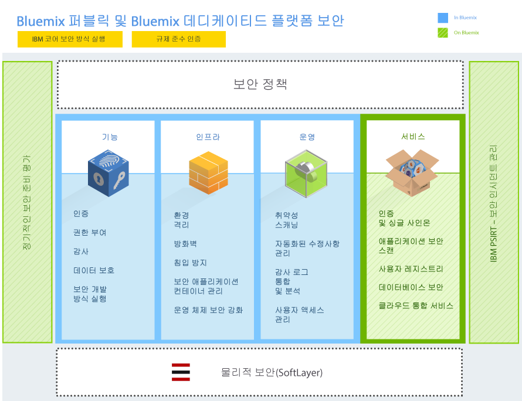
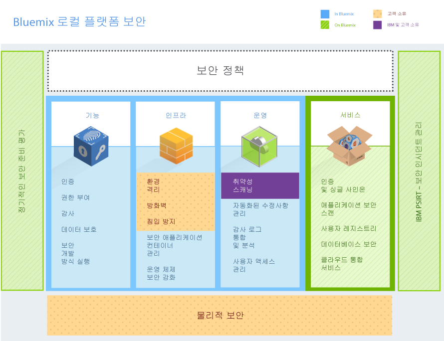
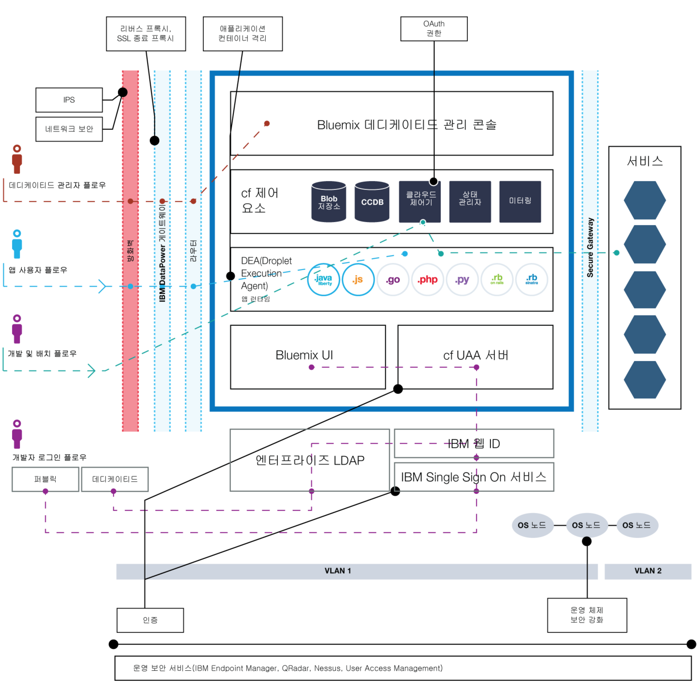

---

 

copyright:

  years: 2014, 2016

 

---

{:new_window: target="_blank"}
{:shortdesc: .shortdesc}

# {{site.data.keyword.Bluemix_notm}} 보안
{: #security}
*마지막 업데이트 날짜: 2016년 5월 9일*

보안 엔지니어링 방식으로 디자인된
{{site.data.keyword.Bluemix}} 플랫폼에는
네트워크 및 인프라에서 계층화된 보안 제어가 있습니다. {{site.data.keyword.Bluemix_notm}}에서는 자체 모바일 및 웹 앱을 보호하기 위해
애플리케이션 개발자가 사용할 수 있는 보안 서비스 그룹을 제공합니다. 이러한 요소가 결합되어 {{site.data.keyword.Bluemix_notm}}는
보안 애플리케이션 개발을 위한 명확한 선택사항을 보유한 플랫폼이 됩니다.
{:shortdesc}

{{site.data.keyword.Bluemix_notm}}는 시스템, 네트워킹 및 보안 엔지니어링과 관련한 IBM의 우수 사례에 의해 구동되는 보안 정책을 고수함으로써 보안 준비성을 보장합니다. 이러한 정책에는 소스 코드 스캔, 동적 스캔, 위협 모델링 및 침입 테스트 등의 실행이 포함됩니다. {{site.data.keyword.Bluemix_notm}}는 보안 인시던트 관리를 위해 IBM PSIRT(Product Security Incident Response Team) 프로세스를 따릅니다. 세부사항은 [IBM Security Vulnerability Management(PSIRT)](http://www-03.ibm.com/security/secure-engineering/process.html){: new_window} 사이트를 참조하십시오.

{{site.data.keyword.Bluemix_notm}} Public 및 Dedicated는 IBM SoftLayer IaaS(Infrastructure-as-a-Service) 클라우드 서비스를 사용하고
해당 보안 아키텍처를 완전히 활용합니다. SoftLayer IaaS는 애플리케이션 및 데이터에 대한 다중의 중첩된 보안 계층을 제공합니다. {{site.data.keyword.Bluemix_notm}} Local의 경우
사용자는 회사 방화벽 뒤의 사용자 소유 데이터 센터에서 {{site.data.keyword.Bluemix_notm}} Local을
호스트하여 물리적 보안을 소유하고 인프라를 제공합니다. 또한 {{site.data.keyword.Bluemix_notm}}는
다양한 카테고리(플랫폼, 데이터 및 애플리케이션)의 PaaS(Platform as a Service) 계층에서 보안 기능을 추가합니다.

## {{site.data.keyword.Bluemix_notm}} 플랫폼 보안
{: #platform-security}

{{site.data.keyword.Bluemix_notm}}는 코어 플랫폼에 대해 (IBM SoftLayer를 통한) 기능, 인프라, 운영 및 물리적 보안을 제공합니다. 그러나
{{site.data.keyword.Bluemix_notm}} Local은 고객이 제공하는 인프라와 데이터 센터에서
고유하며 물리적 보안을 소유합니다.

{{site.data.keyword.Bluemix_notm}} 환경은 산업 표준을 충족하거나 그 이상을 충족하는 가장 제한적인 IBM 정보 기술(IT) 보안 표준을 준수합니다. 표준에는 네트워크, 데이터 암호화 및
액세스 제어가 포함되어 있습니다.
 * 애플리케이션 ACL, 권한 및 침투 테스트
 * 식별, 인증 및 권한 부여
 * 정보 및 데이터 보호
 * 서비스 무결성 및 가용성
 * 취약성 및 수정사항 관리
 * 서비스 거부(DoS) 및 조직적 공격 발견
 * 보안 인시던트 대응

*그림 1. {{site.data.keyword.Bluemix_notm}} 플랫폼 보안 개요*

{{site.data.keyword.Bluemix_notm}} Local에서는 회사의 방화벽 뒤 및 데이터 센터 내에 {{site.data.keyword.Bluemix_notm}}를 호스팅합니다. 따라서 특정 보안 사안에 대해서는 사용자에게 책임이 있습니다. 다음 보안 파트 이미지 세부사항은 고객 소유이며 보안 파트는 IBM에서 관리하고 유지보수합니다.

*그림 2. {{site.data.keyword.Bluemix_notm}} Local 플랫폼 보안 개요*

IBM은 {{site.data.keyword.Bluemix_notm}} Local에 포함된 전달 기능인 Relay를 통해 데이터 센터에 {{site.data.keyword.Bluemix_notm}} Local을 설치하고
원격으로 모니터하고 관리합니다. Relay는 각 {{site.data.keyword.Bluemix_notm}} Local 인스턴스에 고유한 인증서를 안전하게 연결합니다. {{site.data.keyword.Bluemix_notm}} Local 및 Relay에 대한 자세한 정보는 [Bluemix Local](../local/index.html)을 참조하십시오. 

### 기능적 보안

{{site.data.keyword.Bluemix_notm}}는
사용자 인증, 액세스 권한 부여, 중요 오퍼레이션 감사, 데이터 보호 등
다양한 기능적 보안 기능을 제공합니다.

<dl>
<dt>인증</dt>
<dd>애플리케이션 개발자는 IBM 웹 ID를 사용하여 {{site.data.keyword.Bluemix_notm}}에 인증됩니다.

{{site.data.keyword.Bluemix_notm}} Dedicated
및 Local의 경우 LDAP을 통한 인증이 기본적으로 지원됩니다. 요청 시 {{site.data.keyword.Bluemix_notm}} 대신 IBM 웹 ID를 통한 인증을 설정할 수 있습니다.
</dd>

<dt>권한 부여</dt>
<dd>{{site.data.keyword.Bluemix_notm}}는
Cloud Foundry 메커니즘을 사용하여 각 애플리케이션 개발자가
자신이 작성한 애플리케이션 및 서비스 인스턴스에만 액세스하도록 합니다. {{site.data.keyword.Bluemix_notm}} 서비스에
대한 권한 부여는 OAuth를 기반으로 합니다. 모든 {{site.data.keyword.Bluemix_notm}} 플랫폼 내부 엔드포인트에 대한 액세스는
외부 사용자로 제한됩니다.</dd>

<dt>감사</dt>
<dd>애플리케이션 개발자의 모든 성공 및 실패 인증 시도에 대해
감사 로그가 작성됩니다. 감사 로그는 {{site.data.keyword.Bluemix_notm}} 애플리케이션이 실행되는 컨테이너를 호스팅하는 Linux 시스템에 대한 권한 부여된 액세스에 대해서도 작성됩니다.</dd>

<dt>데이터 보호</dt>
<dd> 모든 {{site.data.keyword.Bluemix_notm}} 트랙픽은 리버스 프록시, SSL 종료 및 로드 밸런싱 기능을 제공하는 IBM WebSphere® DataPower® SOA 어플라이언스를 통과합니다.
다음과 같은 HTTP 메소드를
사용할 수 있습니다.
 * DELETE
 * GET
 * HEAD
 * OPTIONS
 * POST
 * PUT
 * TRACE

HTTP 비활성 제한시간은 2분입니다.

다음 헤더는 DataPower로 채워집니다.
<dl>
<dt>$wsis</dt>
<dd>클라이언트 측 연결이 안전(HTTPS)하면 true로 설정합니다.
그렇지 않으면 false로 설정합니다.</dd>
<dt>$wssc</dt>
<dd>클라이언트 연결 스킴(https, http, ws, wss) 중 하나로
설정합니다.</dd>
<dt>$wssn</dt>
<dd>클라이언트가 보내는 호스트 이름으로 설정합니다.</dd>
<dt>$wssp</dt>
<dd>클라이언트가 연결할 서버 포트로 설정합니다.</dd>
<dt>x-client-ip</dt>
<dd>클라이언트 IP 주소로 설정합니다.</dd>
<dt>x-forwarded-proto</dt>
<dd>클라이언트 연결 스킴(https, http, ws, wss) 중 하나로
설정합니다.</dd>
</dl>
</dd>

<dt>보안 개발 방식 실행</dt>
<dd> {{site.data.keyword.Bluemix_notm}} Public 및 Dedicated의 경우 주기적 보안 취약성 스캔은 IBM Security AppScan® Dynamic Analyzer를 사용하여 다양한 {{site.data.keyword.Bluemix_notm}} 컴포넌트에서 수행됩니다. 위협 모델링 및 침입 테스트는 모든 {{site.data.keyword.Bluemix_notm}} 배치 유형에 대해 잠재적 취약점을 발견하고 해결하기 위해 사용됩니다. 또한 애플리케이션 개발자는 AppScan Dynamic Analyzer 서비스를 사용하여 {{site.data.keyword.Bluemix_notm}}에 배치된 자체 웹 앱을 보호할 수 있습니다.</dd>
</dl>

### 인프라 보안

{{site.data.keyword.Bluemix_notm}}는
애플리케이션 실행을 위한 강력한 토대를 제공하기 위해
Cloud Foundry를 기반으로 빌드됩니다. 아키텍처 내에서 보안 및 격리를 위한 여러 컴포넌트가
제공됩니다. 또한 변경 관리 및 백업 및 복구 프로시저가 무결성 및 가용성을 보장하기 위해 구현됩니다.

<dl>
<dt>환경 격리</dt>
<dd> {{site.data.keyword.Bluemix_notm}} Public의 경우 개발 및 프로덕션 환경은 애플리케이션 안정성 및 보안성을 높이기 위해 서로 격리됩니다.</dd>

<dt>방화벽</dt>
<dd> 방화벽은 {{site.data.keyword.Bluemix_notm}} 네트워크에 대한 액세스를 제한하기 위해 적절히 갖춰져 있습니다. {{site.data.keyword.Bluemix_notm}}
Local의 경우 사용자의 회사 방화벽은 사용자의 나머지 네트워크를
{{site.data.keyword.Bluemix_notm}} 인스턴스에서 분리합니다.</dd>

<dt>침입 방지</dt>
<dd>{{site.data.keyword.Bluemix_notm}} Public 및 Dedicated에서는 위협을 발견하여 이를 처리할 수 있도록 침입 방지를 사용합니다. 침입 방지 정책은 방화벽에서 사용됩니다.</dd>

<dt>보안 애플리케이션 컨테이너 관리</dt>
<dd>각 {{site.data.keyword.Bluemix_notm}} 애플리케이션은
격리되어 있으며 프로세서, 메모리 및 디스크에 대한 특정 자원 한계가 있는 자체 컨테이너에서 실행됩니다.</dd>

<dt>운영 체제 보안 강화</dt>
<dd>IBM 관리자는 IBM Endpoint Manager 등의 도구를 사용하여 네트워크 및 운영 체제 강화를 주기적으로 수행합니다.</dd>
</dl>

### 운영 보안

{{site.data.keyword.Bluemix_notm}}에서는
다음과 같은 제어 권한이 있는 강력한 운영 보안 환경을 제공합니다.

<dl>
<dt>취약성 스캔</dt>
<dd>{{site.data.keyword.Bluemix_notm}}는
Tenable Network Security 취약성 스캔 도구 Nessus를 사용하여
네트워크 및 호스트 구성 문제를 발견하여 해결할 수 있도록 합니다.</dd>

<dt>자동화된 수정사항 관리</dt>
<dd>{{site.data.keyword.Bluemix_notm}} 관리자는
운영 체제의 수정사항이 적합한 빈도로 적용되도록 보장합니다. 자동화된 수정사항은 IBM Endpoint Manager를 사용하여 적용됩니다.</dd>

<dt>감사 로그 통합 및 분석</dt>
<dd>{{site.data.keyword.Bluemix_notm}}에서는 IBMSecurity QRadar® 도구를 사용하여 Linux 로그를 통합함으로써 Linux 시스템에서 권한 부여된 액세스를 모니터링합니다. 또한 {{site.data.keyword.Bluemix_notm}}는 IBM QRadar 보안 정보 및 이벤트 관리(SIEM)를 사용하여 애플리케이션 개발자의 성공 및 실패한 로그인 시도를 모니터링합니다.</dd>

<dt>사용자 액세스 관리</dt>
<dd>{{site.data.keyword.Bluemix_notm}} 내에서는 업무 분리 가이드라인에 따라 사용자에게 세부 단위의 액세스 권한을 지정하며 사용자가 최소 권한 원칙에 따라 자체 작업의 수행에 필요한 액세스 권한만 갖도록 보장합니다.

{{site.data.keyword.Bluemix_notm}} Dedicated 및 Local 환경 내에서는 지정된 관리자가 관리 콘솔을 사용하여 조직 내 {{site.data.keyword.Bluemix_notm}} 사용자의 역할 및 권한을 관리할 수 있습니다. 세부사항은 [{{site.data.keyword.Bluemix_notm}} 로컬 및 전용 관리](../admin/index.html#mng)를 참조하십시오.
</dd>
</dl>

### 물리적 보안

{{site.data.keyword.Bluemix_notm}} Public 및 Dedicated에서는 실제 네트워크 보안을 위해 SoftLayer의 네트워크 내 네트워크(network-within-a-network) 토폴로지에 의존합니다. 이러한 네트워크 내 네트워크 아키텍처를 사용하여
권한 있는 사용자만 시스템에 완전히 액세스할 수 있도록
할 수 있습니다. {{site.data.keyword.Bluemix_notm}} Local에 대해 사용자는 로컬 인스턴스에 대한
물리적 보안을 소유합니다. 데이터 센터는 회사 방화벽 뒤에서 보호됩니다.

SoftLayer 네트워크 내 네트워크(network-within-a-network)에서 공용 네트워크 계층은 호스팅된 웹 사이트 또는 온라인 자원에 대한 공용 트래픽을 처리합니다. 사설 네트워크 계층을 사용하면 SSL, PPTP 또는 IPSec VPN 게이트웨이에서 개별 독립형 써드파티 업체를 통해 진정한 대역 외 관리를 수행할 수 있습니다. 데이터 센터 간 네트워크 계층은 개별 SoftLayer 설비에 포함된 서버 간의 무료 보안 연결을 제공합니다.

모든 SoftLayer 데이터 센터는 예외 없이 SSAE 16 및 업계에서 인정하는 요구사항을 충족하는 제어에 따라 완벽하게 보호됩니다. 자세한 정보는 SoftLayer 보안 규제 준수 페이지를 참조하십시오.

## 데이터 보안
{: #data-security}

{{site.data.keyword.Bluemix_notm}}에서는
비인가 액세스에 대한 데이터 보안이
{{site.data.keyword.Bluemix_notm}}와 사용자 간의 공동 노력으로 이루어집니다.

실행 중인 애플리케이션과 연관된 데이터는 전송 중 데이터(data-in-transit),
저장 데이터(data-at-rest) 및 사용 중 데이터(data-in-use)의 세 가지 상태 중 하나일 수 있습니다.

<dl>
<dt>전송 중 데이터(data-in-transit)</dt>
<dd>네트워크의 노드 간에 전송 중인 데이터입니다.</dd>

<dt>저장 데이터(data-at-rest)</dt>
<dd>저장된 데이터입니다.</dd>

<dt>사용 중 데이터(data-in-use)</dt>
<dd>현재 저장 중이 아니며 엔드포인트에서 실행 중인 데이터입니다.</dd>
</dl>

각각의 데이터 유형은 데이터 보안을 계획할 때 고려되어야 합니다.

{{site.data.keyword.Bluemix_notm}} 플랫폼은 {{site.data.keyword.Bluemix_notm}} 내부 네트워크의 경계에서 데이터가 IBM DataPower Gateway에 도달할 때까지 네트워크를 통해 SSL을 사용하여 애플리케이션에 대한 일반 사용자 액세스를 보호함으로써 전송 중 데이터를 보호합니다. IBM DataPower Gateway는 리버스 프록시 역할을 하며 SSL 종료를 제공합니다.

사용 중 데이터 및 저장 데이터 둘 다에 대한 보안은 애플리케이션 개발 중에 사용자의 책임입니다. {{site.data.keyword.Bluemix_notm}} 카탈로그에서 사용 가능한 다수의 데이터 관련 서비스를 활용하면 이와 관련하여 도움을 받을 수 있습니다.

## {{site.data.keyword.Bluemix_notm}} 애플리케이션 보안
{: #application-security}

애플리케이션 개발자는
{{site.data.keyword.Bluemix_notm}}에서 실행되는
애플리케이션에 대해 애플리케이션 데이터 보호를 포함하여
보안 구성을 사용하도록 설정해야 합니다.

여러 {{site.data.keyword.Bluemix_notm}} 서비스에서 제공하는 보안 기능을 사용하여
애플리케이션을 보호할 수 있습니다. IBM에서 생성하는 모든 {{site.data.keyword.Bluemix_notm}} 서비스는 IBM 보안 엔지니어링 개발 방식을 따릅니다.

**참고:** 여기에 설명된 서비스 중 일부는 Bluemix Dedicated 또는 Local 인스턴스에 적용되지 않을 수 있습니다.

### SSO 서비스

{{site.data.keyword.Bluemix_notm}}용 IBM Single Sign-On은 Node.js 또는 Liberty for Java™ 애플리케이션의 임베드 용이한 싱글 사인온 기능을 제공하는 정책 기반 인증 서비스입니다. 애플리케이션 개발자가 애플리케이션으로 싱글 사인온 기능을 임베드할 수 있도록 하기 위해
관리자는 서비스 인스턴스를 작성하고 ID 소스를 추가합니다.

Single Sign On 서비스는 사용자의 신임 정보가 저장된 다수의 ID 소스를 지원합니다.

<dl>
<dt>SAML Enterprise</dt>
<dd>인증을 수행하며 SAML 토큰 교환을 사용하는 사용자 레지스트리입니다.</dd>

<dt>클라우드 디렉토리</dt>
<dd>IBM Cloud에서 호스팅되는 사용자 레지스트리입니다.</dd>

<dt>소셜 ID 소스</dt>
<dd> Google, Facebook 및 LinkedIn에서 유지보수하는 사용자 레지스트리입니다.</dd>
</dl>

자세한 정보는 [Single Sign-On 시작하기](../services/SingleSignOn/index.html)를 참조하십시오.

### Application Security on Cloud

이 서비스는 모바일 및 웹 앱에 대한 보안 분석을 제공하며 사용자가 보안 취약점에 대한 소스 코드를 스캔할 수 있도록 허용합니다. 자세한 정보는 [Application Security on Cloud 시작하기](../services/ApplicationSecurityonCloud/index.html)를 참조하십시오.

### 애플리케이션 보안 테스트를 위한 IBM UrbanCode 플러그인

IBM Application Security Testing for {{site.data.keyword.Bluemix_notm}} 플러그인을 사용하면 {{site.data.keyword.Bluemix_notm}}에서 호스팅되는 사용자 웹 또는 Android 앱에서 보안 스캔을 실행할 수 있습니다. 이 플러그인은 IBM Bluemix DevOps 서비스 플랫폼에서 IBM UrbanCode™ Deploy 커뮤니티에 의해 개발되고 지원됩니다.

자세한 정보는 [IBM Application Security Testing for Bluemix](https://developer.ibm.com/urbancode/plugindoc/ibmucd/ibm-application-security-testing-bluemix/1-0/){: new_window}로 이동하십시오.

### dashDB

dashDB 서비스는 사용자 인증을 위한 내장된 LDAP 서버를 사용합니다. 애플리케이션 및 데이터베이스 사이의 연결은
SSL 인증서에 의해 보호됩니다. 이 서비스는 배치된 데이터베이스와 데이터베이스 백업을 자동으로 암호화하기 위해 DB2® 원시 암호화 기능을 사용합니다. 마스터 키 회전은 자동이고 90일마다
수행됩니다.

자세한 정보는 [dashDB 시작하기](../services/dashDB/index.html)를 참조하십시오.

### Cloud Integration

클라우드 통합 서비스를 사용하면 클라우드 및 사내 구축형 데이터를 통합할 수 있습니다. 백엔드 데이터베이스(예: DB2, Oracle 및 SAP)와 상호작용하기 위한 서비스를 추가할 수 있습니다. 그리고 데이터를 이동하거나 액세스하고 사용할
{{site.data.keyword.Bluemix_notm}}
애플리케이션의 REST API를 작성할 수 있습니다. 서비스는 사내 구축형 보안 커넥터와의 보안 통신이 가능하도록 하며,
애플리케이션이 사용하는 REST API로서 백엔드 SOR(System of Record)을 노출합니다.

자세한 정보는 [Cloud Integration 시작하기](../services/CloudIntegration/index.html)를 참조하십시오.

### Secure Gateway

Secure Gateway 서비스를 사용하면 사내 구축형 또는 클라우드에서 원격 위치에 {{site.data.keyword.Bluemix_notm}} 앱을 안전하게 연결할 수 있습니다. 이는 보안 연결을 제공하며 {{site.data.keyword.Bluemix_notm}} 조직 및
연결하고자 하는 원격 위치 간에 터널을 설정합니다. {{site.data.keyword.Bluemix_notm}} 사용자 인터페이스 또는
API 패키지를 사용하여 보안 게이트웨이를 구성하고 작성할 수 있습니다.

자세한 정보는 [Secure Gateway 시작하기](../services/SecureGateway/secure_gateway.html)를 참조하십시오.

### SQL Database

SQL Database 서비스는 완전히 프로비저닝된 관계형 데이터베이스를 앱에 추가합니다. 이 서비스는 애플리케이션에서 액세스하는 데이터베이스를 보호하기 위해 인증용 IBM Directory Server LDAP 및 IBM InfoSphere® Guardium® Data Activity Monitor를 사용합니다. 애플리케이션 및 데이터베이스 사이의 연결은
DigiCert가 서명하는 SSL 인증서에 의해 보호됩니다.

이 서비스의 특정 플랜에서, {{site.data.keyword.Bluemix_notm}}의
SQL 데이터베이스 콘솔을 사용하여 다음 정보가 포함된 보고서를 가져올 수 있습니다. 

 * 애플리케이션이 액세스하는 데이터베이스에 있을 수 있는
민감한 데이터
 * 지정된 기간 내에 데이터베이스에 액세스한
애플리케이션 사용자
 * 데이터베이스에 있는 민감한 데이터에 액세스하는
애플리케이션 사용자

SQL을 사용하여 데이터를 마스킹하기 위해
애플리케이션은 데이터베이스와 함께 배치되는
마스킹 사용자 정의 기능(UDF)을 호출할 수 있습니다. 예를 들어, 테스트를 위해 다른 곳에 사용하려는
데이터를 마스킹할 수 있습니다. UDF는 IBM Infosphere Optim™에서 데이터 마스킹 알고리즘을 구현합니다.

이 서비스의 프리미엄 플랜에는 데이터 암호화도 포함됩니다. 이 서비스에 대한 자세한 정보는 [SQL Database 시작하기](../services/SQLDB/index.html)를 참조하십시오.

### 보안 정보 및 이벤트 관리

You can use security information and event management (SIEM) 도구를 사용하여 애플리케이션 로그의 보안 경보를 분석할 수 있습니다. 이러한 도구 중 하나가 클라우드 환경에서 지능형 보안을 제공하는 IBM Security QRadar&reg; SIEM입니다. 자세한 정보는 [IBM QRadar Security Intelligence Platform](http://www-01.ibm.com/support/knowledgecenter/SS42VS/welcome?lang=en){: new_window}을 참조하십시오. 

## {{site.data.keyword.Bluemix_notm}} 보안 배치
{: #security-deployment}

{{site.data.keyword.Bluemix_notm}} 보안 배치 아키텍처에는
보안 액세스를 보장할 수 있도록 앱 사용자 및 개발자용 다양한 정보 플로우가 포함되어 있습니다.

*그림 3. Bluemix 보안 배치 아키텍처*

{{site.data.keyword.Bluemix_notm}} *앱 사용자*의 경우, **앱 사용자 플로우**는 다음과 같습니다.
 1. 방화벽을 통해(침입 방지 및 네트워크 보안이 적절히 갖춰져 있음).
 2. IBM DataPower Gateway를 통해(리버스 프록시 및 SSL 종료 프록시 포함).
 3. 네트워크 라우터를 통해.
 4. DEA(Droplet Execution Agent)에서 애플리케이션 런타임에 도달합니다.

{{site.data.keyword.Bluemix_notm}} *개발자*는 두 개의 기본 플로우(로그인용과 개발 및 배치용)를 따릅니다.
 * **개발자 로그인 플로우**에는 다음이 포함됩니다.
    * {{site.data.keyword.Bluemix_notm}} Public에 로그인한 개발자의 경우
플로우는 다음과 같습니다.
      1. IBM Single Sign On 서비스를 통해.
      2. IBM 웹 ID를 통해.
    * {{site.data.keyword.Bluemix_notm}} Dedicated 또는 Local에 로그인한 개발자의 경우 플로우는 엔터프라이즈 LDAP를 통합니다.
 * **개발 및 배치 플로우**는 다음과 같습니다.
    1. 방화벽을 통해(침입 방지 및 네트워크 보안이 적절히 갖춰져 있음). {{site.data.keyword.Bluemix_notm}} Dedicated에만 적용됩니다.
    2. IBM DataPower Gateway를 통해(리버스 프록시 및 SSL 종료 프록시 포함).
    3. 네트워크 라우터를 통해.
    4. Cloud Foundry 클라우드 제어기를 사용한 권한 부여를 통해(개발자가 작성한 앱 및 서비스 인스턴스에 대한 액세스만 보장할 수 있도록).

{{site.data.keyword.Bluemix_notm}} Dedicated 및 {{site.data.keyword.Bluemix_notm}} Local *관리자*의 경우,
**관리자 플로우**는 다음과 같습니다.
 1. 방화벽을 통해(침입 방지 및 네트워크 보안이 적절히 갖춰져 있음).
 2. IBM DataPower Gateway를 통해(리버스 프록시 및 SSL 종료 프록시 포함).
 3. 네트워크 라우터를 통해.
 4. {{site.data.keyword.Bluemix_notm}} 사용자 인터페이스에서 관리 페이지에 도달합니다.

이 경로에서 기술된 사용자와 더불어 인가된 IBM 보안 운영 팀은 다음과 같은 다양한 운영 보안 태스크를 수행합니다.
 * 취약성 스캔. {{site.data.keyword.Bluemix_notm}} Local에 대해 사용자는 방화벽 내 물리적 보안 및 스캔을 소유합니다.
 * 사용자 액세스 관리.
 * IBM Endpoint Manager로 수정사항을 주기적으로 적용하여 운영 체제 강화.
 * 침입 방지로 위험성 관리.
 * QRadar로 보안 모니터링.
 * 관리 페이지에서 사용 가능한 보안 보고서

## 보안 준수
{: #compliance}

{{site.data.keyword.Bluemix}}는 신뢰할 수 있는 보안 클라우드 플랫폼을 제공합니다. {{site.data.keyword.Bluemix_notm}} 준수는 ISO 27001과 ISO 27002 등 업계 최고 보안 표준을 기반으로 빌드된 플랫폼 및 서비스를 사용할 때 보장됩니다.
{:shortdesc}

  **유럽 연합(EU) 모델 조항**은 EU 또는 유럽 경제 지역(EEA)에서 제3의 국가로 전송되는 개인 데이터 보호에 관한 협약입니다. EU 모델 조항은 EU 또는 EEA에 위치한 데이터 반출자 역할의 고객과 제3의 국가에 위치한 데이터 반입자 역할의 IBM 데이터 처리자가 체결합니다. [IBM SaaS EU 모델 조항](http://www-01.ibm.com/common/ssi/cgi-bin/ssialias?subtype=ST&infotype=SA&htmlfid=KUJ12408USEN&attachment=KUJ12408USEN.PDF){: new_window}에는 데이터 반출자와 데이터 반입자의 권리와 의무, 데이터 대상의 권리가 규정되어 있습니다. IBM SaaS EU 모델 조항을 준수하면 제3의 국가에서 개인 데이터를 처리할 때 EU 또는 EEA에서와 비슷한 보호 조치가 적용됩니다.

  일본의 은행 및 관련 금융 기관에 구축된 컴퓨터 시스템에는 FISC(Center for Financial Industry Information Systems) 보안 지침을 기반으로 하는 보안 절차가 마련되어 있어야 합니다. **FISC** 보안 지침은 일본 금융 기관(FSA), 일본 은행(BOJ) 및 FISC에서 적용됩니다.

[IBM Bluemix 위험성 설문조사 결과](https://www.ibm.com/cloud-computing/jp/ja/bluemix_fisc.html){: new_window}에서 FISC 보안 지침과 관련된 {{site.data.keyword.Bluemix_notm}} 자가 진단 문서(일본어로 작성됨)를 확인할 수 있습니다.  

  {{site.data.keyword.Bluemix_notm}}는 최상의 정보 보안 관리 프로세스 방안을 정의하는 **국제 표준화 기구(ISO) 27001 및 27002 표준**에 의거하여 인증되었습니다. ISO 27001 표준은 개별 조직의 요구에 따라 정보 보안 관리 시스템(ISMS)의 설정, 구현 및 문서화를 위한 요구사항과 보안 제어 구현을 위한 요구사항을 지정합니다. ISO 27002 표준은 ISO 27001의 각 보안 제어를 상세히 설명합니다. ISO 27000 표준 모음은 서면, 구두 또는 전자식 정보의 신뢰성, 무결성 및 가용성 보호를 목적으로 자산의 가치와 위험을 척도화하는 프로세스를 통합한 것입니다.

{{site.data.keyword.Bluemix_notm}}는 제3의 보안 회사에 의한 감사를 거치며 ISO 27001의 모든 요구사항을 충족합니다([Bluemix ISO 27001:2013 등록 인증서](ftp://public.dhe.ibm.com/cloud/bluemix/compliance/Bluemix_ISO27K1_WWCert_2016.pdf){: new_window}).

 **서비스 조직 제어(SOC)** 보고서에는 서비스 조직에서 보안, 가용성, 처리 무결성, 신뢰성, 개인정보 보호정책과 관련된 주요 내부 제어 정책의 평가를 정의되어 있습니다. AICPA(American Institute of Certified Public Accountants) 가이드를 사용하여 생성하는 이 보고서는 다음 항목을 제공합니다. 
  * 조직 감시
  * 공급업체 관리 프로그램
  * 내부 기업 통제 및 위험 관리 프로세스
  * 규제 감시

{{site.data.keyword.Bluemix_notm}}는 IBM SoftLayer IaaS(Infrastructure-as-a-Service) 클라우드 서비스를 사용하고 해당 보안 아키텍처를 최대한 활용합니다. 자세한 정보는 [{{site.data.keyword.Bluemix_notm}} 영업](mailto:bmxcert1@us.ibm.com){:new_window} 팀에 문의하십시오.

### 플랫폼 및 서비스 준수
다음은 각 표준을 준수하는 {{site.data.keyword.Bluemix_notm}} 서비스를 표시하는 표입니다.

|{{site.data.keyword.Bluemix_notm}} 컴포넌트		|FISC		|ISO 27001	|SOC 2 유형 1		|
|:----------------------|:---------:|:---------:|:---------:|
|{{site.data.keyword.Bluemix_notm}} 플랫폼		|Y			|Y	|Y	|
|{{site.data.keyword.APIM}}			|Y	|Y |			|
|{{site.data.keyword.autoscaling}}			|Y	|Y |			|
|{{site.data.keyword.bigicloudst}}			|Y |Y |Y |
|{{site.data.keyword.cloudant}}				|Y |Y |Y	|
|{{site.data.keyword.dashdbshort}}			|Y	|Y	|Y	|
|{{site.data.keyword.datacshort}}			|Y	|Y	|			|
|{{site.data.keyword.jazzhub_short}}					|Y	|Y	|			|
|{{site.data.keyword.containerlong}}			|Y		|Y	|			|
|{{site.data.keyword.mql}}				|Y	|Y	|	 		|
|{{site.data.keyword.SecureGateway}}			|Y	|Y |	 		|
|{{site.data.keyword.sescashort}}     |Y |Y | |

*표 1. 플랫폼 및 서비스 준수*

# 관련 링크
{: #rellinks}

## 관련 링크
{: #general}

* [SoftLayer 보안 규제 준수](http://www.softlayer.com/security)
* [Single Sign On 시작하기](../services/SingleSignOn/index.html)
