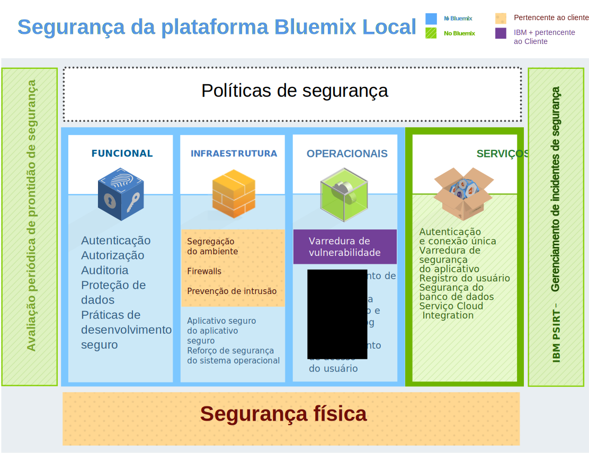

---

 

copyright:

  years: 2014, 2016

 

---

{:new_window: target="_blank"}
{:shortdesc: .shortdesc}

# Segurança do {{site.data.keyword.Bluemix_notm}}
{: #security}
*Última atualização: 9 de maio de 2016*

Projetada com práticas seguras de engenharia, a plataforma do {{site.data.keyword.Bluemix}} possui controles de segurança em camadas na rede e na infraestrutura. O {{site.data.keyword.Bluemix_notm}} fornece um grupo de serviços de segurança que podem ser usados por desenvolvedores de aplicativos para proteger seus apps móveis e da web. Esses elementos são combinados para fazer do {{site.data.keyword.Bluemix_notm}} uma plataforma com opções claras para desenvolvimento seguro do aplicativo.
{:shortdesc}

O {{site.data.keyword.Bluemix_notm}} garante disponibilidade de segurança ao seguir as políticas de segurança que são orientadas por melhores práticas na IBM para sistemas, rede e engenharia segura. Essas políticas incluem práticas, como varredura do código-fonte, varredura dinâmica, modelagem de ameaça e teste de penetração. O {{site.data.keyword.Bluemix_notm}} segue o processo IBM Product Security Incident Response Team (PSIRT) para gerenciamento de incidentes de segurança. Consulte o site [IBM Security Vulnerability Management (PSIRT)](http://www-03.ibm.com/security/secure-engineering/process.html){: new_window} para obter detalhes.

Os {{site.data.keyword.Bluemix_notm}} Public e Dedicated usam o serviço de nuvem IBM SoftLayer Infrastructure-as-a-Service (IaaS) e aproveita ao máximo sua arquitetura de segurança. O SoftLayer IaaS fornece várias camadas de sobreposição de proteção para aplicativos e dados. Para {{site.data.keyword.Bluemix_notm}} Local, você possui a segurança física e fornece a infraestrutura hospedando o {{site.data.keyword.Bluemix_notm}} Local em seu próprio datacenter sob um firewall da empresa. Além disso, o {{site.data.keyword.Bluemix_notm}} inclui recursos de segurança na camada Plataforma como serviço em diferentes categorias: plataforma, dados e aplicativo.

## Segurança da plataforma do {{site.data.keyword.Bluemix_notm}}
{: #platform-security}

O {{site.data.keyword.Bluemix_notm}} fornece infraestrutura funcional e segurança operacional e física (por meio do IBM SoftLayer) para a plataforma principal. No entanto, o {{site.data.keyword.Bluemix_notm}} Local é exclusivo porque o cliente fornece a infraestrutura e o datacenter e possui segurança física.

O ambiente do {{site.data.keyword.Bluemix_notm}} no SoftLayer é compatível com as normas de segurança mais restritivas da tecnologia de informação (TI) da IBM, que atendem ou excedem os padrões de mercado. Esses padrões incluem o seguinte: rede, criptografia de dados e controle de acesso
 * ACLs do aplicativo, permissões e teste de penetração
 * Identificação, autenticação e autorização
 * Informações e proteção de dados
 * Integridade de serviço e disponibilidade
 * Vulnerabilidade e gerenciamento de correção
 * Negação de serviço e detecção de ataques sistemáticos
 * Resposta a incidentes de segurança

*Figura 1. Visão geral de segurança da plataforma {{site.data.keyword.Bluemix_notm}}*

Com o {{site.data.keyword.Bluemix_notm}} Local, você hospeda o {{site.data.keyword.Bluemix_notm}} atrás do firewall de sua empresa e em seu datacenter. Portanto, você é responsável por determinados aspectos de segurança. A seguinte imagem detalha quais partes da segurança são de propriedade do cliente e quais partes de segurança são gerenciadas e mantidas pela IBM.

*Figura 2. Visão geral de segurança da plataforma {{site.data.keyword.Bluemix_notm}} Local*

A IBM instala, monitora remotamente e gerencia o {{site.data.keyword.Bluemix_notm}} Local em seu datacenter por meio de Retransmissão, um recurso de entrega incluído com o {{site.data.keyword.Bluemix_notm}} Local. A Retransmissão se conecta com segurança a certificados específicos de cada instância do {{site.data.keyword.Bluemix_notm}} Local. Para obter mais informações sobre o {{site.data.keyword.Bluemix_notm}} Local e Retransmissão, consulte [Bluemix Local](../local/index.html).

### Segurança funcional

O {{site.data.keyword.Bluemix_notm}} fornece vários recursos de segurança funcional, incluindo autenticação do usuário, autorização de acesso, auditoria de operações críticas e proteção de dados.

<dl>
<dt>Autenticação</dt>
<dd>Os desenvolvedores de aplicativos são autenticados no {{site.data.keyword.Bluemix_notm}} usando o IBM Web identity.

Para {{site.data.keyword.Bluemix_notm}} Dedicated e Local, a autenticação por meio de LDAP é suportada por padrão. Sob solicitação, a autenticação por meio do IBM Web identity pode ser configurada em vez de {{site.data.keyword.Bluemix_notm}}.
</dd>

<dt>Autorização</dt>
<dd>O {{site.data.keyword.Bluemix_notm}} usa os mecanismos do Cloud Foundry para assegurar que cada desenvolvedor de aplicativos tenha acesso somente aos aplicativos e instâncias de serviço que criaram. A autorização para serviços do {{site.data.keyword.Bluemix_notm}} baseia-se em OAuth. O acesso a todos os terminais internos da Plataforma do {{site.data.keyword.Bluemix_notm}} é restrito aos usuários externos.</dd>

<dt>Auditoria</dt>
<dd>São criados logs de auditoria para todas as tentativas de autenticação bem-sucedidas e malsucedidas dos desenvolvedores de aplicativos. Logs de auditoria são criados também para acesso privilegiado a sistemas Linux que hospedam os contêineres nos quais os aplicativos {{site.data.keyword.Bluemix_notm}} são executados.</dd>

<dt>Proteção de dados</dt>
<dd> Todo o tráfego do {{site.data.keyword.Bluemix_notm}} passa pelo IBM WebSphere® DataPower® SOA Appliances, que fornece funções de proxy reverso, rescisão de SSL e balanceamento de carga.
Os métodos de HTTP a seguir são permitidos:
 * DELETE
 * GET
 * HEAD
 * OPTIONS
 * POST
 * PUT
 * TRACE

A inatividade de HTTP atinge o tempo limite em 2 minutos.

Os cabeçalhos a seguir são preenchidos pelo DataPower:
<dl>
<dt>$wsis</dt>
<dd>Configurado como true se a conexão do lado do cliente for segura (HTTPS) e como false, caso contrário.</dd>
<dt>$wssc</dt>
<dd>Configurado com um dos esquemas de conexão de cliente a seguir: https, http, ws ou wss.</dd>
<dt>$wssn</dt>
<dd>Configurado com o nome do host que é enviado pelo cliente.</dd>
<dt>$wssp</dt>
<dd>Configurado com a porta do servidor à qual o cliente se conecta.</dd>
<dt>x-client-ip</dt>
<dd>Configurado com o endereço IP do cliente.</dd>
<dt>x-forwarded-proto</dt>
<dd>Configurado com um dos esquemas de conexão de cliente a seguir: https, http, ws ou wss.</dd>
</dl>
</dd>

<dt>Práticas seguras de desenvolvimento</dt>
<dd> Para {{site.data.keyword.Bluemix_notm}} Public e Dedicated, varreduras de vulnerabilidade de segurança periódicas são executadas em vários componentes do {{site.data.keyword.Bluemix_notm}} usando o IBM Security AppScan® Dynamic Analyzer. A modelagem de ameaça e teste de penetração são executadas para detectar e tratar possíveis vulnerabilidades em todos os tipos de implementações do {{site.data.keyword.Bluemix_notm}}. Além disso, os desenvolvedores de aplicativos podem usar o serviço AppScan Dynamic Analyzer para proteger seus apps da web que são implementados no {{site.data.keyword.Bluemix_notm}}.</dd>
</dl>

### Segurança da infraestrutura

O {{site.data.keyword.Bluemix_notm}} baseia-se no Cloud Foundry para fornecer uma base robusta para executar seus aplicativos. Na arquitetura, vários componentes são fornecidos para segurança e isolamento. Além disso, gerenciamento de mudanças e procedimentos de recuperação e backup são implementados para assegurar integridade e disponibilidade.

<dl>
<dt>Segregação do ambiente</dt>
<dd> Para {{site.data.keyword.Bluemix_notm}} Public, os ambientes de desenvolvimento e de produção são segregados entre si para melhorar a estabilidade e a segurança do aplicativo.</dd>

<dt>Firewalls</dt>
<dd> Firewalls são adequados para restringir o acesso à rede do {{site.data.keyword.Bluemix_notm}}. Para {{site.data.keyword.Bluemix_notm}} Local, o firewall da sua empresa segrega o resto de sua rede de sua instância do {{site.data.keyword.Bluemix_notm}}.</dd>

<dt>Proteção contra intrusão</dt>
<dd>Os {{site.data.keyword.Bluemix_notm}} Public e Dedicated permitem proteção contra intrusão para descobrir ameaças, para que elas possam ser tratadas. As políticas de proteção contra intrusão são ativadas nos firewalls.</dd>

<dt>Gerenciamento de contêiner do aplicativo seguro</dt>
<dd>Cada aplicativo do {{site.data.keyword.Bluemix_notm}} é isolado e executado em seu próprio contêiner, que possui limites de recurso específicos para processador, memória e disco.</dd>

<dt>Reforço de segurança do sistema operacional</dt>
<dd>Os administradores IBM executam o reforço da rede e do sistema operacional regularmente, usando ferramentas tais como o IBM Endpoint Manager.</dd>
</dl>

### Segurança operacional

O {{site.data.keyword.Bluemix_notm}} fornece um ambiente de segurança operacional robusto com os controles a seguir.

<dl>
<dt>Varredura de vulnerabilidade</dt>
<dd>O {{site.data.keyword.Bluemix_notm}} usa a ferramenta de varredura de vulnerabilidade Tenable Network Security, Nessus, para detectar problemas com configurações da rede e do host, para que os problemas possam ser resolvidos.</dd>

<dt>Gerenciamento de correção automatizada</dt>
<dd>Os administradores do {{site.data.keyword.Bluemix_notm}} asseguram que as correções para sistemas operacionais sejam aplicadas em frequências apropriadas. As correções automatizadas são ativadas usando o IBM Endpoint Manager.</dd>

<dt>Consolidação e análise do log de auditoria</dt>
<dd>{{site.data.keyword.Bluemix_notm}} usa as ferramentas IBMSecurity QRadar® para consolidar logs do Linux para monitorar o acesso privilegiado em sistemas Linux. O {{site.data.keyword.Bluemix_notm}} também utiliza informações
de segurança e gerenciamento de eventos (SIEM) do IBM QRadar para monitorar tentativas de login bem-sucedidas e malsucedidas dos desenvolvedores de aplicativos.</dd>

<dt>Gerenciamento de acesso do usuário</dt>
<dd>No {{site.data.keyword.Bluemix_notm}}, as diretrizes de separação de obrigações são seguidas para designar privilégios de acesso granular aos usuários e para assegurar que os usuários tenham somente o acesso que é necessário para executar suas tarefas de acordo com o princípio do menor privilégio.

Em ambientes dos {{site.data.keyword.Bluemix_notm}} Dedicated e Local, administradores designados podem gerenciar funções e permissões para o usuário do {{site.data.keyword.Bluemix_notm}} em suas organizações usando o Console administrativo. Consulte [Gerenciando {{site.data.keyword.Bluemix_notm}} Local e Dedicated](../admin/index.html#mng) para obter detalhes.
</dd>
</dl>

### Segurança física

Os {{site.data.keyword.Bluemix_notm}} Public e Dedicated dependem da topologia de rede dentro de uma rede do SoftLayer para segurança de rede física. Essa arquitetura de rede dentro de uma rede assegura que os sistemas sejam totalmente acessíveis somente à equipe autorizada. Para {{site.data.keyword.Bluemix_notm}} Local, você possui a segurança física para a instância local. Seu datacenter está assegurado sob o firewall da sua empresa.

Na rede dentro de uma rede do SoftLayer, a camada de rede pública manipula o tráfego público para websites hospedados ou recursos online. A camada de rede privada permite o gerenciamento fora da banda verdadeiro por meio de uma terceira operadora distinta sobre gateways SSL, PPTP ou IPSec VPN. A camada de rede datacenter para datacenter fornece conectividade livre e segura entre servidores que estão hospedados em instalações separadas do SoftLayer.

Todo datacenter do SoftLayer é totalmente protegido com controles que atendem aos requisitos do SSAE 16 e reconhecidos pela indústria, sem exceções. Para obter informações adicionais, consulte a página Conformidade de segurança do SoftLayer.

## Segurança de dados
{: #data-security}

Com o {{site.data.keyword.Bluemix_notm}}, proteger seus dados contra acesso não autorizado é um trabalho em conjunto entre o {{site.data.keyword.Bluemix_notm}} e você.

Os dados associados a um aplicativo em execução podem estar em um de três estados: dados em trânsito, dados em repouso e dados em uso.

<dl>
<dt>Dados em trânsito</dt>
<dd>Dados que estão sendo transferidos entre nós em uma rede.</dd>

<dt>Dados em repouso</dt>
<dd>Dados que estão armazenados.</dd>

<dt>Dados em uso</dt>
<dd>Dados que não estão armazenados atualmente e que estão sendo aplicados em um terminal.</dd>
</dl>

Cada tipo de dados precisa ser considerado quando você planeja segurança de dados.

A plataforma {{site.data.keyword.Bluemix_notm}} protege dados em trânsito assegurando o acesso do usuário final ao aplicativo usando SSL, por meio da rede, até que os dados atinjam o IBM DataPower Gateway no limite da rede interna do {{site.data.keyword.Bluemix_notm}}. O IBM DataPower Gateway age como um proxy reverso e fornece rescisão de SSL.

A segurança para dados em uso e dados em repouso é sua responsabilidade ao desenvolver o aplicativo. É possível usufruir das vantagens de vários serviços relacionados aos dados, disponíveis no catálogo do {{site.data.keyword.Bluemix_notm}} para auxiliar nessas questões.

## Segurança de aplicativos do {{site.data.keyword.Bluemix_notm}}
{: #application-security}

Como desenvolvedor de aplicativos, deve-se ativar as configurações de segurança, incluindo proteção de dados do aplicativo, para os aplicativos executados no {{site.data.keyword.Bluemix_notm}}.

É possível usar recursos de segurança que são fornecidos por vários serviços do {{site.data.keyword.Bluemix_notm}} para assegurar seus aplicativos. Todos os serviços {{site.data.keyword.Bluemix_notm}} que são produzidos pela IBM seguem as práticas de desenvolvimento de engenharia segura da IBM.

**Nota:** Alguns dos serviços descritos aqui podem não se aplicar às instâncias do Bluemix Dedicated ou Local.

### Serviço de SSO

IBM Single Sign On for {{site.data.keyword.Bluemix_notm}} é um serviço de autenticação baseado em política que fornece uma maneira fácil de integrar o recurso de conexão única aos aplicativos Node.js ou Liberty for Java. Para que um desenvolvedor de aplicativos integre o recurso de conexão única a um aplicativo, o administrador cria instâncias de serviço e inclui fontes de identidade.

O serviço de Single Sign On suporta várias fontes de identidade em que as credenciais dos usuários são armazenadas:

<dl>
<dt>SAML corporativo</dt>
<dd>Um registro de usuário com uma troca de tokens SAML que conclui a autenticação.</dd>

<dt>Diretório de nuvem</dt>
<dd>Um registro de usuário que é hospedado no IBM Cloud.</dd>

<dt>Fontes de identidade sociais</dt>
<dd> Os registros de usuário que são mantidos pelo Google, Facebook e LinkedIn.</dd>
</dl>

Para obter mais informações, consulte [Introdução à conexão única](../services/SingleSignOn/index.html).

### Segurança do aplicativo em nuvem

Esse serviço fornece uma análise de segurança de apps móveis e da web e permite varrer o código-fonte para vulnerabilidades de segurança. Para obter mais informações, consulte [Introdução à segurança do aplicativo na nuvem](../services/ApplicationSecurityonCloud/index.html).

### Plug-in do IBM UrbanCode para teste de segurança do aplicativo

O plug-in do IBM Application Security Testing for {{site.data.keyword.Bluemix_notm}} permite executar varreduras de segurança nos apps da web ou Android que estão hospedados no {{site.data.keyword.Bluemix_notm}}. Esse plug-in é desenvolvido e suportado pela Comunidade do IBM UrbanCode™ Deploy na plataforma do IBM Bluemix DevOps Services.

Para obter mais informações, acesse [IBM Application Security Testing for Bluemix](https://developer.ibm.com/urbancode/plugindoc/ibmucd/ibm-application-security-testing-bluemix/1-0/){: new_window}.

### dashDB

O serviço dashDB usa um servidor LDAP integrado para autenticação do usuário. A conexão entre os aplicativos e o banco de dados é protegida pelos certificados SSL. Esse serviço usa o recurso de criptografia nativa do DB2® para criptografar automaticamente seu banco de dados implementado e os backups de banco de dados. A rotação da chave mestra é automática e acontece a cada 90 dias.

Para obter mais informações, consulte [Introdução ao dashDB](../services/dashDB/index.html).

### Cloud Integration

O serviço Cloud Integration permite integrar dados da nuvem e no local. É possível incluir um serviço para interagir com bancos de dados backend, tais como DB2, Oracle e SAP. Em seguida, é possível mover dados ou criar APIs REST para que os aplicativos do {{site.data.keyword.Bluemix_notm}} acessem e usem. O serviço permite a comunicação segura com conectores seguros no local e expõe sistemas backend de registro, como APIs REST, a serem usadas pelos aplicativos.

Para obter mais informações, consulte [Introdução ao Cloud Integration](../services/CloudIntegration/index.html).

### Secure Gateway

O serviço Secure Gateway permite que você conecte de forma segura apps {{site.data.keyword.Bluemix_notm}} em locais remotos, no local ou na nuvem. Ele fornece conectividade segura e estabelece um túnel entre a organização do {{site.data.keyword.Bluemix_notm}} e o local remoto ao qual você deseja se conectar. É possível configurar e criar um gateway seguro usando a interface com o usuário do {{site.data.keyword.Bluemix_notm}} ou um pacote de API.

Para obter mais informações, consulte [Introdução ao Secure Gateway](../services/SecureGateway/secure_gateway.html).

### SQL Database

O serviço SQL Database inclui um banco de dados relacional totalmente provisionado para seu app. Esse serviço usa o IBM Directory Server LDAP para autenticação e o IBM InfoSphere® Guardium® Data Activity Monitor para proteger o banco de dados que é acessado por aplicativos. A conexão entre os aplicativos e o banco de dados é protegida pelo certificado SSL que o DigiCert assina.

Em determinados planos com esse serviço, é possível usar o console do banco de dados SQL no {{site.data.keyword.Bluemix_notm}} para obter relatórios que contêm as informações a seguir:

 * Dados sensíveis que podem existir no banco de dados que é acessado pelos aplicativos.
 * Os usuários do aplicativo que acessaram o banco de dados dentro de um período especificado.
 * Os usuários do aplicativo que estão acessando dados sensíveis que estão no banco de dados.

Para mascarar dados usando SQL, os aplicativos podem chamar as funções definidas pelo usuário (UDFs) de mascaramento que são implementadas junto com o banco de dados. Por exemplo, é possível mascarar os dados que você deseja usar em qualquer lugar para teste. As UDFs implementam os algoritmos de mascaramento de dados do IBM Infosphere Optim™.

O plano completo para esse serviço também inclui criptografia de dados. Para obter mais informações sobre este serviço, consulte [Introdução ao SQL Database](../services/SQLDB/index.html).

### Security information and event management

É possível usar ferramentas do security information and event management (SIEM) para analisar alertas de segurança em logs de aplicativos. Uma dessas ferramentas é o IBM Security QRadar&reg; SIEM, que fornece inteligência de segurança em ambientes de nuvem. Para obter informações, consulte [IBM QRadar Security Intelligence Platform](http://www-01.ibm.com/support/knowledgecenter/SS42VS/welcome?lang=en){: new_window}.

## Implementação de segurança do {{site.data.keyword.Bluemix_notm}}
{: #security-deployment}

A arquitetura de implementação de segurança do {{site.data.keyword.Bluemix_notm}} inclui diferentes fluxos de informações para usuários de app e desenvolvedores para assegurar acesso seguro.

*Figura 3. Arquitetura de implementação de segurança do Bluemix*

Para *usuários do app* do {{site.data.keyword.Bluemix_notm}}, o **fluxo de usuário do app** é como a seguir:
 1. Por meio de um firewall, com prevenção de intrusão e segurança de rede adequados.
 2. Por meio do IBM DataPower Gateway com proxy reverso e proxy de rescisão de SSL.
 3. Por meio do roteador de rede.
 4. Atinge o tempo de execução do aplicativo no droplet execution agent (DEA).

O desenvolvedor do {{site.data.keyword.Bluemix_notm}} ** segue dois fluxos principais, para login e para desenvolvimento e implementação.
 * O **fluxo de login do desenvolvedor** inclui os itens a seguir:
    * Para desenvolvedores que estejam efetuando login no {{site.data.keyword.Bluemix_notm}} Public, o fluxo é como a seguir:
      1. Por meio do serviço IBM Single Sign On.
      2. Por meio do IBM web identity.
    * Para desenvolvedores que estejam efetuando login no {{site.data.keyword.Bluemix_notm}} Dedicated ou Local, o fluxo é por meio do LDAP corporativo.
 * O **fluxo de desenvolvimento e implementação** é como a seguir:
    1. Por meio de um firewall, com prevenção de intrusão e segurança de rede adequados. Isso se aplica somente ao {{site.data.keyword.Bluemix_notm}} Dedicated.
    2. Por meio do IBM DataPower Gateway com proxy reverso e proxy de rescisão de SSL.
    3. Por meio do roteador de rede.
    4. Por meio de autorização, usando o controlador de nuvem Cloud Foundry para assegurar acesso somente a apps e instâncias de serviço criadas pelo desenvolvedor.

Para *administradores* do {{site.data.keyword.Bluemix_notm}} Dedicated e do {{site.data.keyword.Bluemix_notm}} Local, o **fluxo do administrador** é como a seguir:
 1. Por meio de um firewall, com prevenção de intrusão e segurança de rede adequados.
 2. Por meio do IBM DataPower Gateway com proxy reverso e proxy de rescisão de SSL.
 3. Por meio do roteador de rede.
 4. Atinge a página Administração na interface com o usuário do {{site.data.keyword.Bluemix_notm}}.

Além dos usuários descritos nesses caminhos, uma equipe de operações de segurança autorizada da IBM executa várias tarefas de segurança operacionais, como as descritas a seguir:
 * Varreduras de vulnerabilidade. Para
{{site.data.keyword.Bluemix_notm}} Local, você possui a segurança física e quaisquer varreduras dentro do firewall.
 * Gerenciamento de acesso do usuário.
 * Reforço do sistema operacional pela aplicação periódica de correções com o IBM Endpoint Manager.
 * Gerenciamento de riscos com proteção contra intrusão.
 * Monitoramento de segurança com QRadar.
 * Relatórios de segurança disponíveis na página Administração.

## Conformidade de segurança
{: #compliance}

O {{site.data.keyword.Bluemix}} fornece uma plataforma de nuvem segura que você pode confiar. A conformidade do {{site.data.keyword.Bluemix_notm}} resulta de uma plataforma e de serviços que são construídos sobre os melhores padrões de segurança do setor, incluindo ISO 27001 e ISO 27002.
{:shortdesc}

 Uma **Cláusula de modelo da União Europeia (UE)** é um acordo para proteger dados pessoais que são transferidos da União Europeia ou do Espaço econômico europeu (EEE) para um país terceiro. A Cláusula de modelo da União Europeia é assinada entre o cliente localizado na União Europeia ou no EEE como o exportador de dados, e o processador de dados da IBM localizado no país terceiro como o importador de dados. A [Cláusula de modelo IBM SaaS da União Europeia](http://www-01.ibm.com/common/ssi/cgi-bin/ssialias?subtype=ST&infotype=SA&htmlfid=KUJ12408USEN&attachment=KUJ12408USEN.PDF){: new_window} contém os direitos e obrigações do exportador de dados e do importador de dados, e os direitos dos titulares dos dados. A Cláusula de modelo IBM SaaS da União Europeia assegura que os dados pessoais, quando processados em um país terceiro, estão sob proteção que é semelhante à proteção disponível dentro da União Europeia ou do Espaço econômico europeu.

 Para instituições financeiras e relacionadas a finanças no Japão, os sistemas de computador devem ter procedimentos de segurança locais que sejam baseados nas diretrizes de segurança do Centro para Financial Industry Information Systems (FISC). As diretrizes de segurança do  **FISC** são impingindas pela Japan Financial Services Agency (FSA), pelo Bank of Japan (BOJ) e pelo FISC.

É possível localizar um documento de auto-avaliação do {{site.data.keyword.Bluemix_notm}} para obter as diretrizes de segurança do FISC, escrito em japonês, em [Resultados da pesquisa de opinião de risco do IBM Bluemix](https://www.ibm.com/cloud-computing/jp/ja/bluemix_fisc.html){: new_window}. 

 O {{site.data.keyword.Bluemix_notm}} está certificado sob as **Normas da Organização internacional para normatização (ISO) 27001 e 27002**, que definem as melhores práticas para processos de gerenciamento de segurança da informação. A norma ISO 27001 especifica os requisitos para estabelecer, implementar e documentar Information Security Management Systems (ISMS) e os requisitos para implementar controles de segurança, de acordo com as necessidades de organizações individuais. A norma ISO 27002 explica cada controle de segurança de ISO 27001 em detalhes. A família de normas ISO 27000 incorpora um processo de ajuste de escala de risco e avaliação de ativos, com o objetivo de proteger a confidencialidade, a integridade e a disponibilidade das informações nas formas escrita, oral e eletrônica.

O {{site.data.keyword.Bluemix_notm}} é auditado por uma empresa de segurança de terceiros e atende a todos os requisitos do ISO 27001: [Certificado de registro ISO 27001:2013 do Bluemix](ftp://public.dhe.ibm.com/cloud/bluemix/compliance/Bluemix_ISO27K1_WWCert_2016.pdf){: new_window}.

Os relatórios  **Service Organization Controls (SOC)** definem a avaliação das principais práticas de controle interno que estão relacionados à segurança, disponibilidade, integridade do processamento, confidencialidade e privacidade em uma organização de serviços. Os relatórios que são gerados usando o Guia American Institute of Certified Public Accountants (AICPA) incluem os itens a seguir: 
  * Supervisão da organização
  * Programa de gerenciamento de fornecedores
  * Governança corporativa interna e processos de gerenciamento de riscos
  * Supervisão regulamentar

O {{site.data.keyword.Bluemix_notm}} usa serviços de nuvem do IBM SoftLayer Infrastructure-as-a-Service (IaaS) e aproveita ao máximo sua arquitetura de segurança. Para obter informações adicionais, entre em contato com a equipe de vendas do [{{site.data.keyword.Bluemix_notm}} ](mailto:bmxcert1@us.ibm.com){:new_window}.

### Conformidade de plataforma e serviço
A tabela a seguir exibe quais serviços do {{site.data.keyword.Bluemix_notm}} são compatíveis com cada uma das normas.

|Componentes do {{site.data.keyword.Bluemix_notm}}		|FISC		|ISO 27001	|SOC 2 Tipo 1		|
|:----------------------|:---------:|:---------:|:---------:|
|Plataforma {{site.data.keyword.Bluemix_notm}}		|A			|A	|A	|
|{{site.data.keyword.APIM}}			|A	|A |			|
|{{site.data.keyword.autoscaling}}			|A	|A |			|
|{{site.data.keyword.bigicloudst}}			|A |A |A |
|{{site.data.keyword.cloudant}}				|A |A |A	|
|{{site.data.keyword.dashdbshort}}			|A	|A	|A	|
|{{site.data.keyword.datacshort}}			|A	|A	|			|
|{{site.data.keyword.jazzhub_short}}					|A	|A	|			|
|{{site.data.keyword.containerlong}}			|A		|A	|			|
|{{site.data.keyword.mql}}				|A	|A	|	 		|
|{{site.data.keyword.SecureGateway}}			|A	|A |	 		|
|{{site.data.keyword.sescashort}}     |A |A | |

*Tabela 1. Conformidade de plataforma e serviço*

# Links Relacionados
{: #rellinks}

## Links Relacionados
{: #general}

* [Conformidade de segurança do SoftLayer](http://www.softlayer.com/security)
* [Introdução ao Single Sign On](../services/SingleSignOn/index.html)
