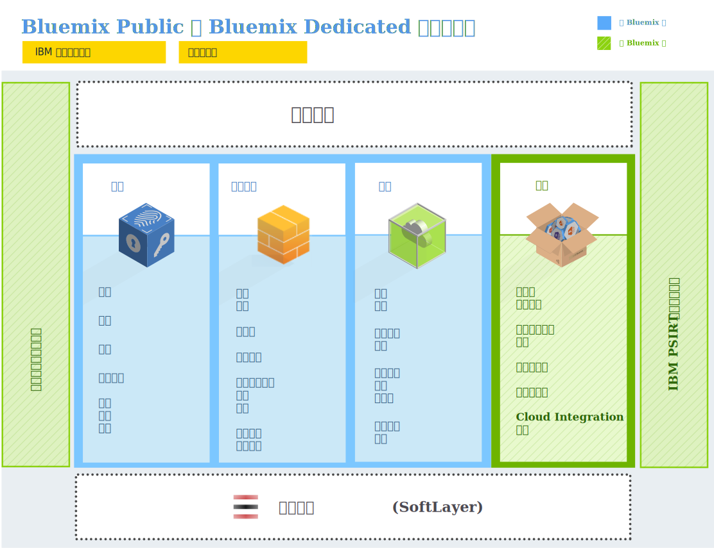
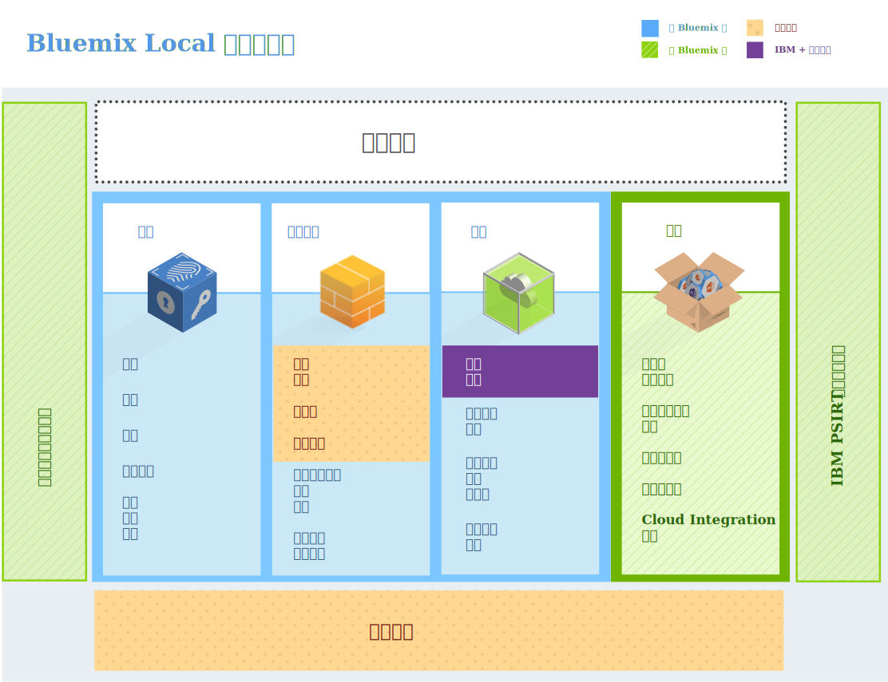

---

 

copyright:

  years: 2014, 2016

 

---

{:new_window: target="_blank"}
{:shortdesc: .shortdesc}

# {{site.data.keyword.Bluemix_notm}} 安全
{: #security}
*上次更新时间：2016 年 5 月 9 日*

{{site.data.keyword.Bluemix}} 平台是使用安全工程实践进行设计的，通过不同的层对整个网络和基础架构中的安全进行控制。{{site.data.keyword.Bluemix_notm}} 提供了一组安全性服务，应用程序开发者可以使用这些服务来保护自己的移动和 Web 应用程序。这些优势组合在一起，使 {{site.data.keyword.Bluemix_notm}} 平台成为安全应用程序开发的不二选择。
{:shortdesc}

{{site.data.keyword.Bluemix_notm}} 遵循由 IBM 中的最佳做法驱动的系统、网络和安全工程方面的安全策略，从而确保安全就绪性。这些策略包括源代码扫描、动态扫描、威胁建模和渗透测试等做法。{{site.data.keyword.Bluemix_notm}} 遵循 IBM 产品安全事件响应小组 (PSIRT) 的安全事件管理流程。有关详细信息，请参阅 [IBM Security Vulnerability Management (PSIRT)](http://www-03.ibm.com/security/secure-engineering/process.html){: new_window} 站点。

{{site.data.keyword.Bluemix_notm}} Public 和 Dedicated 使用 IBM SoftLayer 基础架构即服务 (IaaS) 云服务，并充分利用了其安全体系结构。SoftLayer IaaS 提供了多个重叠层来保护应用程序和数据。对于 {{site.data.keyword.Bluemix_notm}} Local，通过在位于公司防火墙后您自己的数据中心托管 {{site.data.keyword.Bluemix_notm}} Local，您可以拥有物理安全并提供基础架构。此外，{{site.data.keyword.Bluemix_notm}} 还在“平台即服务”层添加了不同类别（平台、数据和应用程序）的安全功能。

## {{site.data.keyword.Bluemix_notm}} 平台安全
{: #platform-security}

{{site.data.keyword.Bluemix_notm}} 为核心平台提供了功能性、基础架构、操作和物理安全（通过 IBM SoftLayer）。但是，{{site.data.keyword.Bluemix_notm}} Local 的独特之处在于客户会提供基础架构和数据中心，并拥有物理安全。

基于 SoftLayer 的 {{site.data.keyword.Bluemix_notm}} 环境符合最严格的 IBM 信息技术 (IT) 安全标准，该标准已达到或超过业界标准。这些标准包括以下方面：网络、数据加密和访问控制
 * 应用程序 ACL、许可权和渗透测试
 * 识别、认证和授权
 * 信息和数据保护
 * 服务完整性和可用性
 * 漏洞和修订管理
 * 拒绝服务和系统化攻击检测
 * 安全事件响应

*图 1. {{site.data.keyword.Bluemix_notm}} 平台安全概况*

通过 {{site.data.keyword.Bluemix_notm}} Local，可在公司防火墙后和数据中心内托管 {{site.data.keyword.Bluemix_notm}}。因此，某些方面的安全性将由您来负责。下图详细描述了哪些安全机制是客户拥有的，哪些是由 IBM 管理和维护的。

*图 2. {{site.data.keyword.Bluemix_notm}} Local 平台安全概况*

IBM 通过中继（{{site.data.keyword.Bluemix_notm}} Local 随附的一种交付功能）对您数据中心内的 {{site.data.keyword.Bluemix_notm}} Local 进行安装、远程监视和管理。中继通过特定于每个 {{site.data.keyword.Bluemix_notm}} Local 实例的证书进行安全连接。有关 {{site.data.keyword.Bluemix_notm}} Local 和中继的更多信息，请参阅 [Bluemix Local](../local/index.html)。

### 功能性安全

{{site.data.keyword.Bluemix_notm}} 提供了各种功能性安全功能，包括用户认证、访问授权、审计关键操作以及数据保护。

<dl>
<dt>认证</dt>
<dd>应用程序开发者使用 IBM Web 身份向 {{site.data.keyword.Bluemix_notm}} 进行认证。对于 {{site.data.keyword.Bluemix_notm}} Dedicated 和 Local，缺省情况下支持通过 LDAP 进行认证。根据请求，对于 {{site.data.keyword.Bluemix_notm}}，可以改为设置通过 IBM Web 身份进行认证。
</dd>

<dt>授权</dt>
<dd>{{site.data.keyword.Bluemix_notm}} 使用 Cloud Foundry 机制来确保每个应用程序开发者都只有权访问自己创建的应用程序和服务实例。对 {{site.data.keyword.Bluemix_notm}} 服务的授权基于 OAuth。对所有 {{site.data.keyword.Bluemix_notm}} 平台内部端点的访问对于外部用户是受限的。</dd>

<dt>审计</dt>
<dd>对应用程序开发者的所有成功和不成功认证尝试，都会创建审计日志。对运行 {{site.data.keyword.Bluemix_notm}} 应用程序的容器进行托管的 Linux 系统的特权访问，也会创建审计日志。</dd>

<dt>数据保护</dt>
<dd> 所有 {{site.data.keyword.Bluemix_notm}} 流量均通过 IBM WebSphere® DataPower® SOA Appliances 传输，该产品提供逆向代理、SSL 终止和负载均衡功能。下面是允许使用的 HTTP 方法：
 * DELETE
 * GET
 * HEAD
 * OPTIONS
 * POST
 * PUT
 * TRACE

HTTP 不活动超时为 2 分钟。

以下头由 DataPower 来填充：
<dl>
<dt>$wsis</dt>
<dd>如果客户端连接为安全连接 (HTTPS)，将设置为 true；否则设置为 false。</dd>
<dt>$wssc</dt>
<dd>设置为以下某个客户机连接方案：https、http、ws 或 wss。</dd>
<dt>$wssn</dt>
<dd>设置为客户机所发送的主机名。</dd>
<dt>$wssp</dt>
<dd>设置为客户机连接到的服务器端口。</dd>
<dt>x-client-ip</dt>
<dd>设置为客户机 IP 地址。</dd>
<dt>x-forwarded-proto</dt>
<dd>设置为以下某个客户机连接方案：https、http、ws 或 wss。</dd>
</dl>
</dd>

<dt>安全开发实践</dt>
<dd> 对于 {{site.data.keyword.Bluemix_notm}} Public 和 Dedicated，将通过使用 IBM Security AppScan® Dynamic Analyzer，对各种 {{site.data.keyword.Bluemix_notm}} 组件定期执行安全漏洞扫描。执行威胁建模和渗透测试来检测和解决所有类型 {{site.data.keyword.Bluemix_notm}} 部署的任何潜在漏洞。此外，应用程序开发者还可以使用 AppScan Dynamic Analyzer 服务来保护自己在 {{site.data.keyword.Bluemix_notm}} 上部署的 Web 应用程序。</dd>
</dl>

### 基础架构安全

{{site.data.keyword.Bluemix_notm}} 基于 Cloud Foundry 构建，可为应用程序的运行提供稳健的基础。在该体系结构内，提供了多个组件用于安全保护和隔离。此外，还实施了变更管理以及备份和恢复过程来确保完整性和可用性。

<dl>
<dt>环境隔离</dt>
<dd> 对于 {{site.data.keyword.Bluemix_notm}} Public，开发环境和生产环境彼此隔离，可提高应用程序稳定性和安全。</dd>

<dt>防火墙</dt>
<dd> 防火墙已落实到位，可限制对 {{site.data.keyword.Bluemix_notm}} 网络的访问。对于 {{site.data.keyword.Bluemix_notm}} Local，公司防火墙会将您的 {{site.data.keyword.Bluemix_notm}} 实例与网络中的其余部分隔离开。</dd>

<dt>入侵防御</dt>
<dd>{{site.data.keyword.Bluemix_notm}} Public 和 Dedicated 支持通过入侵防御来发现威胁，以便解决这些威胁。入侵防御策略在防火墙上已启用。</dd>

<dt>安全应用程序容器管理</dt>
<dd>{{site.data.keyword.Bluemix_notm}} 应用程序彼此是隔开的，每个应用程序都在其自己的容器中运行，而每个容器都具有特定的处理器、内存和磁盘资源限制。</dd>

<dt>加强操作系统安全</dt>
<dd>IBM 管理员使用多种工具（例如 IBM Endpoint Manager）定期加强网络和操作系统安全。</dd>
</dl>

### 操作安全

{{site.data.keyword.Bluemix_notm}} 通过以下控件提供稳健的操作安全环境。

<dl>
<dt>漏洞扫描</dt>
<dd>{{site.data.keyword.Bluemix_notm}} 使用 Tenable Network Security 漏洞扫描工具 Nessus 来检测网络和主机配置中的任何问题，以便解决这些问题。</dd>

<dt>自动修订管理</dt>
<dd>{{site.data.keyword.Bluemix_notm}} 管理员会确保以适当的频率应用操作系统的修订。自动修订通过 IBM Endpoint Manager 启用。</dd>

<dt>审计日志整合和分析</dt>
<dd>{{site.data.keyword.Bluemix_notm}} 使用 IBM Security QRadar® 工具来整合 Linux 日志，从而监视对 Linux 系统的特权访问。{{site.data.keyword.Bluemix_notm}} 还使用 IBM QRadar 安全信息和事件管理 (SIEM) 来监视应用程序开发者的成功和不成功登录尝试。</dd>

<dt>用户访问管理</dt>
<dd>在 {{site.data.keyword.Bluemix_notm}} 中，按照职责分离准则来为用户分配精细的访问特权，并根据最低特权原则，确保用户只拥有执行其作业所需的访问权。在 {{site.data.keyword.Bluemix_notm}} Dedicated 和 Local 环境中，指派的管理员可以使用管理控制台来管理 {{site.data.keyword.Bluemix_notm}} 用户在其组织中的角色和许可权。有关详细信息，请参阅[管理 {{site.data.keyword.Bluemix_notm}} Local 和 Dedicated](../admin/index.html#mng)。
</dd>
</dl>

### 物理安全

{{site.data.keyword.Bluemix_notm}} Public 和 Dedicated 依赖 SoftLayer 的网中网拓扑来确保物理网络安全。此网中网体系结构可确保只有经过授权的人员才能对系统进行完全访问。对于 {{site.data.keyword.Bluemix_notm}} Local，您拥有本地实例的物理安全。您的数据中心位于公司防火墙后，受到防火墙的保护。

在 SoftLayer 网中网内，公用网络层会处理受托管 Web 站点或联机资源的公共流量。专用网络层允许通过不同的独立第三方运营商经由 SSL、PPTP 或 IPSec VPN 网关进行真正的带外管理。数据中心到数据中心网络层会为位于不同 SoftLayer 设施中的服务器提供免费、安全的连接。

每个 SoftLayer 数据中心都通过符合 SSAE 16 和业界公认要求的控件进行全面保护，无一例外。有关更多信息，请参阅“SoftLayer 安全合规性”页面。

## 数据安全
{: #data-security}

使用 {{site.data.keyword.Bluemix_notm}} 时，需要您与 {{site.data.keyword.Bluemix_notm}} 共同努力来保护数据，以防止未经授权的访问。

与运行中应用程序关联的数据的状态有以下三种：传输中的数据、静态数据和使用中的数据。

<dl>
<dt>传输中的数据</dt>
<dd>正在网络上的节点之间传输的数据。</dd>

<dt>静态数据</dt>
<dd>存储的数据。</dd>

<dt>使用中的数据</dt>
<dd>当前未存储但在某个端点上正在使用的数据。</dd>
</dl>

在规划数据安全时，每种类型的数据都需要考虑到。

{{site.data.keyword.Bluemix_notm}} 平台使用 SSL 来确保最终用户能够以安全方式访问应用程序，从而确保传输中的数据能够经由网络安全地到达位于 {{site.data.keyword.Bluemix_notm}} 内部网络边界上的 IBM DataPower Gateway。IBM DataPower Gateway 起到逆向代理的作用，可提供 SSL 终止功能。

对于使用中的数据和静态数据，其安全由您负责，因为应用程序由您开发。您可以利用 {{site.data.keyword.Bluemix_notm}}“目录”中提供的几个数据相关服务来帮助您解决这些问题。

## {{site.data.keyword.Bluemix_notm}} 应用程序安全
{: #application-security}

作为应用程序开发者，您必须为 {{site.data.keyword.Bluemix_notm}} 上运行的应用程序启用安全配置，包括应用程序数据保护。

可以使用多个 {{site.data.keyword.Bluemix_notm}} 服务提供的安全功能来保护应用程序。IBM 提供的所有 {{site.data.keyword.Bluemix_notm}} 服务均遵循 IBM 安全工程开发实践。

**注：**此处描述的其中一些服务可能不适用于 Bluemix Dedicated 或 Local 实例。

### SSO 服务

IBM Single Sign On for {{site.data.keyword.Bluemix_notm}} 是一种基于策略的认证服务，用于为 Node.js 或 Liberty for Java™ 应用程序提供易于嵌入的单点登录功能。为了使应用程序开发者能够将单点登录功能嵌入到应用程序中，管理员会创建服务实例并添加身份源。

Single Sign On 服务支持多个存储用户凭证的身份源：

<dl>
<dt>SAML Enterprise</dt>
<dd>通过交换 SAML 令牌完成认证的用户注册表。</dd>

<dt>Cloud Directory</dt>
<dd>在 IBM Cloud 中托管的用户注册表。</dd>

<dt>社交身份源</dt>
<dd> 由 Google、Facebook 和 LinkedIn 维护的用户注册表。</dd>
</dl>

有关更多信息，请参阅 [Single Sign On 入门](../services/SingleSignOn/index.html)。

### Application Security on Cloud

此服务提供对移动和 Web 应用程序的安全性分析，并允许您扫描源代码来查找安全漏洞。有关更多信息，请参阅 [Application Security on Cloud 入门](../services/ApplicationSecurityonCloud/index.html)。

### 用于应用程序安全测试的 IBM UrbanCode 插件

通过 IBM Application Security Testing for {{site.data.keyword.Bluemix_notm}} 插件，可以对在 {{site.data.keyword.Bluemix_notm}} 上托管的 Web 或 Android 应用程序运行安全扫描。此插件由 IBM UrbanCode™ Deploy Community 在 IBM Bluemix DevOps Services 平台上开发并提供支持。

有关更多信息，请转至 [IBM Application Security Testing for Bluemix](https://developer.ibm.com/urbancode/plugindoc/ibmucd/ibm-application-security-testing-bluemix/1-0/){: new_window}。

### dashDB

dashDB 服务使用嵌入的 LDAP 服务器进行用户认证。应用程序和数据库之间的连接由 SSL 证书保护。此服务使用 DB2® 本机加密功能，以自动加密已部署的数据库和数据库备份。主密钥轮替每 90 天自动执行一次。

有关更多信息，请参阅 [dashDB 入门](../services/dashDB/index.html)。

### Cloud Integration

通过 Cloud Integration 服务，可以集成云和内部部署数据。您可以添加服务来与后端数据库（例如 DB2、Oracle 和 SAP）进行交互。然后，可以移动数据或创建 REST API 来供 {{site.data.keyword.Bluemix_notm}} 应用程序访问和使用。通过该服务，可以安全地与内部部署安全连接器进行通信，并将后端记录系统公开为 REST API 来供应用程序使用。

有关更多信息，请参阅 [Cloud Integration 入门](../services/CloudIntegration/index.html)。

### Secure Gateway

通过 Secure Gateway 服务，可以将 {{site.data.keyword.Bluemix_notm}} 应用程序安全地连接到内部部署或云中的远程位置。该服务可提供安全连接，并在您的 {{site.data.keyword.Bluemix_notm}} 组织与要连接到的远程位置之间建立隧道。可以使用 {{site.data.keyword.Bluemix_notm}} 用户界面或 API 软件包来配置和创建安全网关。

有关更多信息，请参阅 [Secure Gateway 入门](../services/SecureGateway/secure_gateway.html)。

### SQL Database

SQL Database 服务会将完整配置的关系数据库添加到您的应用程序。此服务使用 IBM Directory Server LDAP 进行认证，并使用 IBM InfoSphere® Guardium® Data Activity Monitor 来保护应用程序所访问的数据库。应用程序和数据库之间的连接由 DigiCert 签署的 SSL 证书保护。

在包含此服务的某些套餐中，可以使用 {{site.data.keyword.Bluemix_notm}} 中的 SQL 数据库控制台来获取包含以下信息的报告：

 * 应用程序所访问的数据库中可能存在的敏感数据。
 * 指定时间段内访问过数据库的应用程序用户。
 * 正在访问数据库中敏感数据的应用程序用户。

要使用 SQL 来掩蔽数据，应用程序可以调用与数据库一起部署的掩蔽用户定义的函数 (UDF)。例如，可以掩蔽要在其他地方用于测试的数据。UDF 从 IBM Infosphere Optim™ 实施数据掩蔽算法。

此服务的高级套餐还包含数据加密。有关此服务的更多信息，请参阅 [SQL Database 入门](../services/SQLDB/index.html)。

### 安全信息和事件管理

您可以使用安全信息和事件管理 (SIEM) 工具来分析应用程序日志中的安全警报。其中一个此类工具是 IBM Security QRadar&reg; SIEM，该工具在云环境中提供安全智能。有关信息，请参阅 [IBM QRadar Security Intelligence Platform](http://www-01.ibm.com/support/knowledgecenter/SS42VS/welcome?lang=en){: new_window}。

## {{site.data.keyword.Bluemix_notm}} 安全部署
{: #security-deployment}

{{site.data.keyword.Bluemix_notm}} 安全部署体系结构包含适用于应用程序用户和开发者的不同信息流，可确保访问安全。

*图 3. Bluemix 安全部署体系结构*

对于 {{site.data.keyword.Bluemix_notm}} *应用程序用户*，**应用程序用户流**如下所示：
 1. 经过具有适当入侵防御功能和网络安全的防火墙。
 2. 经过具有逆向代理和 SSL 终止代理功能的 IBM DataPower Gateway。
 3. 经过网络路由器。
 4. 到达 Droplet Execution Agent (DEA) 中的应用程序运行时。

适用于 {{site.data.keyword.Bluemix_notm}} *开发者*的信息流主要有两个，一个用于登录，一个用于开发和部署。
 * **开发者登录流**包含以下内容：
    * 对于要登录到 {{site.data.keyword.Bluemix_notm}} Public 的开发者，信息流如下所示：
      1. 经过 IBM Single Sign On 服务。
      2. 经过 IBM Web 身份。
    * 对于要登录到 {{site.data.keyword.Bluemix_notm}} Dedicated 或 Local 的开发者，信息流将经过企业 LDAP。
 * **开发和部署流**如下所示：
    1. 经过具有适当入侵防御功能和网络安全的防火墙。这仅适用于 {{site.data.keyword.Bluemix_notm}} Dedicated。
    2. 经过具有逆向代理和 SSL 终止代理功能的 IBM DataPower Gateway。
    3. 经过网络路由器。
    4. 经过授权（通过使用 Cloud Foundry 云控制器），以确保仅访问开发者创建的应用程序和服务实例。

对于 {{site.data.keyword.Bluemix_notm}} Dedicated 和 {{site.data.keyword.Bluemix_notm}} Local *管理员*，**管理员流**如下所示：
 1. 经过具有适当入侵防御功能和网络安全的防火墙。
 2. 经过具有逆向代理和 SSL 终止代理功能的 IBM DataPower Gateway。
 3. 经过网络路由器。
 4. 在 {{site.data.keyword.Bluemix_notm}} 用户界面中访问“管理”页面。

除了这些方法中描述的用户，经过授权的 IBM 安全操作团队还会执行各种操作安全任务，例如：
 * 漏洞扫描。对于 {{site.data.keyword.Bluemix_notm}} Local，您拥有防火墙内的物理安全和任何扫描。
 * 用户访问管理。
 * 通过使用 IBM Endpoint Manager 定期应用修订，加强操作系统安全。
 * 通过入侵防御来管理风险。
 * 使用 QRadar 监视安全。
 * 在“管理”页面上提供有安全报告。

## 安全合规性
{: #compliance}

{{site.data.keyword.Bluemix}} 提供了一个您可以信任的安全云平台。{{site.data.keyword.Bluemix_notm}} 合规性是通过基于业界最佳安全标准（包括 ISO 27001 和 ISO 27002）构建的平台和服务来实现的。
{:shortdesc}

 **欧盟 (EU) 示范条款**是一种协议，用于保护从欧盟 (EU) 或欧洲经济区 (EEA) 传输到第三方国家或地区的个人数据。“欧盟 (EU) 示范条款”是由位于 EU 或 EEA 的客户（数据导出方）与位于第三方国家或地区的 IBM 数据处理方（数据导入方）之间签订的。[IBM SaaS 欧盟 (EU) 示范条款](http://www-01.ibm.com/common/ssi/cgi-bin/ssialias?subtype=ST&infotype=SA&htmlfid=KUJ12408USEN&attachment=KUJ12408USEN.PDF){: new_window}包含数据导出方和数据导入方的权利和责任，以及数据主体的权利。“IBM SaaS 欧盟示范条款”可确保个人数据在第三方国家或地区处理时仍能受到像在 EU 或 EEA 中一样的保护。

 对于日本的银行和相关金融机构，计算机系统必须具有适当的安全程序，这些程序应基于金融行业信息系统中心 (FISC) 安全准则。**FISC** 安全准则由日本金融厅 (FSA)、日本央行 (BOJ) 和 FISC 贯彻实施。

在 [IBM Bluemix 风险调查结果](https://www.ibm.com/cloud-computing/jp/ja/bluemix_fisc.html){: new_window}上，可以找到 FISC 安全准则的 {{site.data.keyword.Bluemix_notm}} 自我评估文档（日语）。 

 {{site.data.keyword.Bluemix_notm}} 已通过**国际标准化组织 (ISO) 27001 和 27002 标准**的认证，这两个标准定义了信息安全管理过程的最佳做法。ISO 27001 标准根据不同组织的需求规定了应如何建立、实施和记录信息安全管理系统 (ISMS) ，以及应如何实施安全性控制。ISO 27002 标准对 ISO 27001 中的每种安全性控制进行了详细的说明。ISO 27000 系列标准中包含了一个确定风险规模和评估资产价值的过程，旨在保护书面、口头和电子信息的机密性、完整性和可用性。

{{site.data.keyword.Bluemix_notm}} 经第三方安全公司审计，满足 ISO 27001 的所有要求：[Bluemix ISO 27001:2013 Certificate of Registration](ftp://public.dhe.ibm.com/cloud/bluemix/compliance/Bluemix_ISO27K1_WWCert_2016.pdf){: new_window}。

 **服务组织控制 (SOC)** 报告定义了如何对服务组织评估与安全性、可用性、处理完整性、机密性和隐私性相关的主要内部控制做法。这些报告是使用美国注册会计师协会 (AICPA) 指南生成的，包含以下各项： 
  * 组织监督
  * 供应商管理程序
  * 内部公司治理和风险管理流程
  * 法规监督

{{site.data.keyword.Bluemix_notm}} 使用 IBM SoftLayer 基础架构即服务 (IaaS) 云服务，并充分利用了其安全体系结构。有关其他信息，请联系 [{{site.data.keyword.Bluemix_notm}} 销售](mailto:bmxcert1@us.ibm.com){:new_window}团队。

### 平台和服务合规性
下表显示了 {{site.data.keyword.Bluemix_notm}} 中符合每种标准的服务。

|{{site.data.keyword.Bluemix_notm}} 组件		|FISC		|ISO 27001	|SOC 2 第 1 类		|
|:----------------------|:---------:|:---------:|:---------:|
|{{site.data.keyword.Bluemix_notm}} 平台		|是			|是	|是	|
|{{site.data.keyword.APIM}}			|是	|是 |			|
|{{site.data.keyword.autoscaling}}			|是	|是 |			|
|{{site.data.keyword.bigicloudst}}			|是 |是 |是 |
|{{site.data.keyword.cloudant}}				|是 |是 |是	|
|{{site.data.keyword.dashdbshort}}			|是	|是	|是	|
|{{site.data.keyword.datacshort}}			|是	|是	|			|
|{{site.data.keyword.jazzhub_short}}					|是	|是	|			|
|{{site.data.keyword.containerlong}}			|是		|是	|			|
|{{site.data.keyword.mql}}				|是	|是	|	 		|
|{{site.data.keyword.SecureGateway}}			|是	|是 |	 		|
|{{site.data.keyword.sescashort}}     |是 |是 | |

*表 1. 平台和服务合规性*

# 相关链接
{: #rellinks}

## 相关链接
{: #general}

* [SoftLayer 安全合规性](http://www.softlayer.com/security)
* [Single Sign On 入门](../services/SingleSignOn/index.html)
