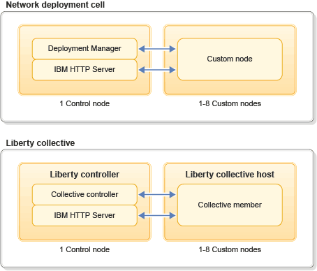

---

copyright:
  years: 2015, 2016
lastupdated: "2017-02-24"
---

{:shortdesc: .shortdesc}
{:new_window: target="_blank"}
{:codeblock: .codeblock}

# IBM WebSphere Application Server in {{site.data.keyword.Bluemix_notm}} 시작하기
{: #getting_started}

{{site.data.keyword.IBM}} WebSphere Application Server in {{site.data.keyword.Bluemix}}는 {{site.data.keyword.Bluemix_notm}}의 호스팅된 클라우드 환경에서 사전 구성된 WebSphere Application Server Liberty, Traditional Network Deployment 또는 Traditional WebSphere Java EE 인스턴스의 빠른 설정을 용이하게 하는 서비스입니다.
{: shortdesc}

## WebSphere Application Server in {{site.data.keyword.Bluemix_notm}} 개요
{: #overview}

WebSphere Application Server in {{site.data.keyword.Bluemix_notm}}는 사전 구성된 Traditional WebSphere 및 Liberty Profile 서버를 이용자에게 제공합니다. 이는 게스트 운영 체제에 대한 루트 액세스 권한이 있는 가상 머신 게스트에서 호스팅됩니다. 서비스를 작성할 때는 *Liberty*, *Traditional ND* 또는 *Traditional WebSphere* 중에서 선택하십시오. 

**참고:** 이제 이용자는 새 *Traditional ND* 또는 *Traditional WebSphere* 인스턴스를 작성할 때 V8.5 및 V9.0 중에 선택할 수 있습니다. 

사용자에게 비슷한 WebSphere 관리 환경이 제공되며 기본 운영 체제에 대한
전체 액세스 권한이 있습니다. 기존 스크립트를 재사용하고 자체 프레임워크 또는 써드파티
프레임워크에서 작업하도록 필요에 따라 시스템을 약간 수정할 수 있습니다. 온프레미스 WebSphere 구성과 마찬가지로 WebSphere Application Server Liberty, ND 또는 Traditional 서비스를 관리하도록 Admin Center와 Admin Console이 제공됩니다.

WebSphere Application Server in {{site.data.keyword.Bluemix_notm}} Network Deployment 플랜은 둘 이상의 가상 머신이 있는 WebSphere Application Server Network Deployment 셀 환경으로 구성됩니다. 첫 번째 가상 머신에는 배치 관리자와 IBM HTTP Server가 포함되어 있고, 나머지 가상 머신에는 배치 관리자에 연합된 사용자 정의 노드(노드 에이전트)가 포함되어 있습니다. 기존 wsadmin 스크립트를 사용하여 WebSphere 구성을 작성하거나
WebSphere Admin Console을 사용하여 수동으로 환경을 구성하십시오. 해당 새 기능은
사용자가 클러스터형 환경을 설정할 수 있으며, 이는 미들웨어 엔터프라이즈 애플리케이션의 중요한 측면입니다. 이제 클라이언트에서 두 개 이상의
인스턴스에 있는 로드 밸런스 요청으로 토폴로지를 클러스터링하도록 선택할 수 있습니다.

WebSphere Application Server in {{site.data.keyword.Bluemix_notm}} Liberty Core 플랜에는 Liberty Collective의 사용이 포함되어 있습니다. Liberty Collective는 Liberty Profile 그룹에 대한 관리 도메인이며 둘 이상의 가상 머신으로 구성되어 있습니다. 첫 번째
가상 머신에는 Liberty Collective의 제어점인 Collective Controller Liberty 서버를
포함합니다. Liberty Collective 외에도 이 가상 머신에는 웹 브라우저에서
애플리케이션에 액세스할 수 있는 IBM HTTP Server도 포함됩니다. 나머지
가상 머신은 통합 멤버가 있는(Liberty Profile 서버) 통합
호스트입니다. Liberty 제어기 서버에서는 Liberty Admin Center 기능도 사용됩니다.

다음 그림은 WebSphere Application Server in {{site.data.keyword.Bluemix_notm}} Network Deployment 셀과 Liberty Collective 환경의 아키텍처를 보여줍니다. 

그림 1. Network Deployment 셀 및 Liberty Collective 아키텍처

**참고**: 위의 *그림 1*에서 IBM HTTP Server와 함께 Collective Controller 또는 배치 관리자의 배치를 표현하는 패턴은 개발 및 테스트 목적입니다. 또한 온프레미스에서와 마찬가지로 사용자는 WebSphere Application Server in {{site.data.keyword.Bluemix_notm}}를 사용하여 프로덕션 애플리케이션 및 운영상의 요구사항을 충족할 수 있도록 사전 설치된 소프트웨어를 자유롭게 재구성할 수도 있습니다. 또한 가장 엄격한 프로덕션 요구사항에 대해서는 격리된 네트워킹 및 컴퓨팅 리소스를 제공하는 단일 테넌트 IBM WebSphere Application Server in {{site.data.keyword.Bluemix_notm}} 오퍼링에 전달할 수 있는 IBM 영업 담당자에게 문의하십시오. 

## 운영 환경
{: #operational_environment}

IBM WebSphere Application Server in {{site.data.keyword.Bluemix_notm}}는 이용자가 애플리케이션을 배치할 수 있도록 공유 환경에서 게스트(가상 머신)를 리턴하는 서비스입니다. VPN은
일반 포트 스캔 및 기타 원치 않는 네트워크 기반 공격으로부터 공용 서비스를 보호합니다.
하지만 서비스 인스턴스에 액세스하는 데 사용하는 서비스 VPN은 여러 {{site.data.keyword.Bluemix_notm}} 조직 및 사용자 간에 공유될 수 있음을 유의하십시오. 가상 머신은 IaaS 리소스의 공유 풀에서 오는 컴퓨팅, 메모리 및 I/O 리소스를 제공합니다. 

공유 환경에서 가상 머신이 특정 컴퓨팅, 메모리 및 I/O 리소스를 실행하므로
서비스 구성이 다를 수 있습니다. 각각의 특정 서비스 인스턴스의 구성은 IBM WebSphere Application Server in {{site.data.keyword.Bluemix_notm}} 서비스 대시보드 및 포털을 통한 보기가 가능합니다. 

IBM WebSphere Application Server in {{site.data.keyword.Bluemix_notm}}는 가상 머신 인스턴스를 제공합니다. 이러한 인스턴스로 클라이언트는 단순 포털을 사용하여 애플리케이션 조정에 중요한 유연성이 있으며 일관성 있고, 반복 가능한 방식으로 엔터프라이즈 WebSphere Application Server 배치를 작성하고 관리합니다. 사용자는 호스팅된 클라우드 환경에서 사전 구성된 WebSphere Application Server Liberty, ND 또는 Traditional 가상 머신에서 시작해서 실행할 수 있습니다. 사용자는 기존 WebSphere Application Server 애플리케이션을 {{site.data.keyword.Bluemix_notm}}로 마이그레이션하고 기본 OS 및 미들웨어의 전체 제어를 수행할 수 있습니다. 

## 가격 책정 전략
{: #pricing_strategy}

IBM WebSphere Application Server in {{site.data.keyword.Bluemix_notm}}는 대형 가상 머신의 자체 환경이 "적정 크기"를 유지할 수 있도록 메모리 집약적인 애플리케이션의 클라이언트에 대해 티셔츠 크기의 인스턴스를 제공합니다.
 클라이언트는 최대 32GB RAM 가상 머신의 프로비저닝된 WebSphere Application Server 컴포넌트 또는 단일 시스템의 특정 리소스 크기를 선택할 수 있습니다.

다음 표는 2016년 4월 1일 기준으로 IBM WebSphere Application Server in {{site.data.keyword.Bluemix_notm}} 플랜 가격을 표시하며, 단위는 미국 달러(USD)로 표시됩니다. 

*표 1. Liberty Core 플랜*

| **T-Shirt** | **vCPU** | **RAM(GB)** | **HD(GB)** | **가격/시간** |       
|:-------------:|:----------:|:--------------:|:-------------:|:--------------:|
| S | 1 | 2 | 12 | $0.21 |
| M | 2 | 4 | 25 | $0.42 |
| L | 4 | 8 | 50 | $0.84 |
| XL | 8 | 16 | 100 | $1.68 |
| XXL | 16 | 32 | 200 | $3.36 |

*표 2. WebSphere Application Server Base 플랜*

| **T-Shirt** | **vCPU** | **RAM(GB)** | **HD(GB)** | **가격/시간** |       
|:-------------:|:----------:|:--------------:|:-------------:|:--------------:|
| S | 1 | 2 | 12 | $0.30 |
| M | 2 | 4 | 25 | $0.60 |
| L | 4 | 8 | 50 | $1.20 |
| XL | 8 | 16 | 100 | $2.40 |
| XXL | 16 | 32 | 200 | $4.80 |

*표 3. WebSphere Application Server ND 플랜*

| **T-Shirt** | **vCPU** | **RAM(GB)** | **HD(GB)** | **가격/시간** |       
|:-------------:|:----------:|:--------------:|:-------------:|:--------------:|
| S | 1 | 2 | 12 | $0.70 |
| M | 2 | 4 | 25 | $1.40 |
| L | 4 | 8 | 50 | $2.80 |
| XL | 8 | 16 | 100 | $5.60 |
| XXL | 16 | 32 | 200 | $11.20 |

IBM WebSphere Application Server in {{site.data.keyword.Bluemix_notm}}는 다음의 비용 메트릭에 따라 제공됩니다. 

*  *인스턴스-시간*: 인스턴스는 IBM WebSphere Application Server in {{site.data.keyword.Bluemix_notm}} 서비스의 특정 구성에 대한 액세스로서 정의됩니다. 클라이언트는 비용 청구 기간 중에 배치된 서비스의 각 인스턴스에 대한 각각의 전체 또는 부분 시간에 대해 청구됩니다. 각 인스턴스 시간은 매월 청구되며 인스턴스가 그 달의 일부만 사용된 경우에는 사용 비율로 비례 계산됩니다. 

예를 들어, ND 플랜을 사용하는 경우 하나의 인스턴스는 2GB RAM 및 12GB HD의 1vCPU와 동일합니다. 따라서 한 개의 제어 노드와 여덟 개의 사용자 정의 노드로 셀을 구성하려고 선택한 경우 아홉 개의 노드(인스턴스)에 대해 비용 청구됩니다.

**참고**: 사용자 정의 노드 또는 Liberty 호스트당 최소 비용 청구가 0.25 인스턴스 시간으로 설정됩니다. 위의 예제에서 최소 15분에 대해 구성된 하나의 제어 노드와 하나의 사용자 정의 노드가 (.25 * 인스턴스의 #)의 최소 비용 청구와 동일하게 됩니다.

**참고**: 특정 양의 컴퓨팅, 메모리 및 입출력 리소스로 인해, 클라이언트가 5% 감소 비율로 중지된 상태의 누적 인스턴스에 대해 청구됩니다. 클라이언트는 10개 이하의 IP 주소 또는 64GB 이하 메모리를 사용하는 고정된 수의 중지된 인스턴스에 관리됩니다. 

# 관련 링크
{: #rellinks}
## 일반
{: #general}
* [WASdev](https://developer.ibm.com/wasdev/){: new_window}
* [WebSphere Application Server V9 문서](http://www.ibm.com/support/knowledgecenter/SSEQTP_9.0.0/as_ditamaps/was900_welcome_base.html){: new_window}
