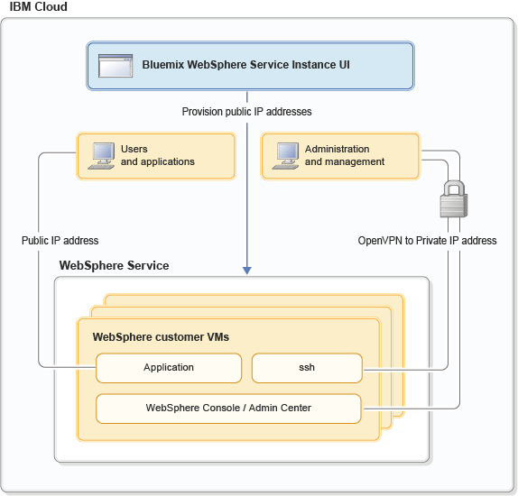

---

copyright:
  years: 2015, 2016
lastupdated: "2017-02-24"

---

{:shortdesc: .shortdesc}
{:new_window: target="_blank"}
{:codeblock: .codeblock}

# Ambiente de rede
{: #networkEnvironment}

Após sua instância de serviço do WebSphere Application Server no {{site.data.keyword.Bluemix_notm}} ser provisionada, será possível acessar sua VM de várias maneiras. É possível se conectar por meio de uma VPN segura para obter o SSH, o WebSphere Admin Console tradicional e o acesso do aplicativo à sua VM. Também
é possível conectar sua VM à Internet com um endereço IP público.

O diagrama a seguir mostrar esses caminhos de rede:

Figura 1. Visualização do cliente de rede de diversos locatários com IP Público



## Acesso VPN
{: #vpnAccess}

Após provisionar uma instância de serviço do WebSphere Application Server no {{site.data.keyword.Bluemix_notm}} por meio do Painel de serviço na UI do {{site.data.keyword.Bluemix_notm}}, será possível fazer download das credenciais de VPN e estabelecer uma conexão OpenVPN. É possível acessar sua VM por meio do SSH. Também
é possível acessar o Liberty Admin Center, o WebSphere Admin Console tradicional e aplicativos.

## Acesso à Internet pública
{: #publicInternetAccess}

Opcionalmente, é possível solicitar um endereço IP público para sua VM do servidor WebSphere, clicando em **Gerenciar IP público** no Painel de Serviço na UI do {{site.data.keyword.Bluemix_notm}} e solicitando um IP público. Esse processo reserva o endereço IP para esse servidor. Em
seguida, clique em **Abrir IP** para abrir a conexão por meio da Internet com sua instância de serviço do WebSphere Application
Server no {{site.data.keyword.Bluemix_notm}}.

## Portas IP Públicas
{: #publicIPports}

Ao abrir acesso ao seu IP público, o endereço IP será associado à sua VM, e as portas 80 e 443 serão abertas no gateway. No entanto, por padrão, os servidores Liberty Core e WebSphere Base tradicionais não abrem as portas 80 e 443. Pelo contrário, as portas 80 e 443 são abertas por padrão no IBM HTTP Server. Portanto, pode ser necessário configurar seus servidores Liberty Core e WebSphere Base tradicional para atender ao tráfego de aplicativo na porta 80/443 ao usar um IP público.
* Para configurar seu servidor Liberty Core, consulte [Configurar Servidor Liberty Core para acesso público](networkEnvironment.html#configureLibertyForPublicAccess).
* Para configurar seu servidor WebSphere Base tradicional, inclua uma cadeia de transporte de contêiner de web que atenda à porta 80/443, conforme descrito em [Configurando cadeias de transporte](http://www.ibm.com/support/knowledgecenter/SSEQTP_8.5.5//com.ibm.websphere.nd.doc/ae/trun_chain_transport.html){: new_window}.

## Portas IP privadas da VPN
{: #privateIPports}

Você se conecta ao endereço IP privado da VM por meio da conexão VPN. O Liberty Admin Center (9080, 9443), o WebSphere Admin Console tradicional (9060, 9043), o SSH (22) e as portas
diferentes de 80/443 são acessíveis somente por meio da conexão VPN, conforme ilustrado na Figura 1. Consulte os arquivos **server.xml** e **ibm-web-bnd.xml** de amostra do Liberty Core para obter detalhes sobre separar o Liberty Admin Center das portas do seu aplicativo.

**Evite problemas:** para servidores Liberty Core e WebSphere Base tradicional, as portas do Firewall são pré-configuradas quando sua VM é provisionada. No entanto, para configurações do Network Deployment nas quais o Gerenciador de Implementação ou o Controlador Coletivo estão instalados com o IBM HTTP Server, pode ser necessário abrir portas no firewall. Consulte [Portas de firewall](systemAccess.html#firewall_ports) para detalhes.

## Configure o servidor Liberty Core para acesso de IP Público
{: #configureLibertyForPublicAccess}

É necessário configurar o Liberty Core para atender ao tráfego de aplicativo na porta 80/443 ao usar o IP público.

Por padrão, o Liberty é configurado com o Liberty Admin Center e aplicativos disponíveis no host virtual **default_host**, associado ao **defaultHttpEndpoint** nas portas 9080 e 9443. Reconfigure seu servidor para separar o Liberty Admin Center do host virtual do aplicativo e do terminal e disponibilize-os em portas separadas.

O snippet a seguir é um exemplo dos ajustes da configuração de server.xml:

```    
    <!-- open port 9080/9443 for incoming http connections -->
    <httpEndpoint id="defaultHttpEndpoint"
        host="*"
        httpPort="9080"
        httpsPort="9443">
        <tcpOptions soReuseAddr="true"/>
    </httpEndpoint>

    <!-- define a new endpoint for public app traffic -->
    <httpEndpoint id="publicHttpEndpoint"
        host="*"
        httpPort="80"
        httpsPort="443">
        <tcpOptions soReuseAddr="true"/>
    </httpEndpoint>

    <!– restrict default_host to vpn so the Liberty Admin Center is not public -->
    <virtualHost id="default_host" allowFromEndpointRef="defaultHttpEndpoint">
      <hostAlias>*:9080</hostAlias>
      <hostAlias>*:9443</hostAlias>
    </virtualHost>

    <virtualHost id="external_host">
      <hostAlias>*:80</hostAlias>
      <hostAlias>*:443</hostAlias>
    </virtualHost>
```
{: codeblock}

Agora associe seu aplicativo ao host virtual **external_host**, incluindo o snippet a seguir no arquivo **META-INF/ibm-web-bnd.xml** do aplicativo:

```
    <?xml version="1.0" encoding="UTF-8"?>
    <web-bnd
        xmlns="http://websphere.ibm.com/xml/ns/javaee"
        xmlns:xsi="http://www.w3.org/2001/XMLSchema-instance"
        xsi:schemaLocation="http://websphere.ibm.com/xml/ns/javaee   
        http://websphere.ibm.com/xml/ns/javaee/ibm-web-bnd_1_0.xsd"
        version="1.0">

        <virtual-host name="external_host" />
    </web-bnd>
```
{: codeblock}
