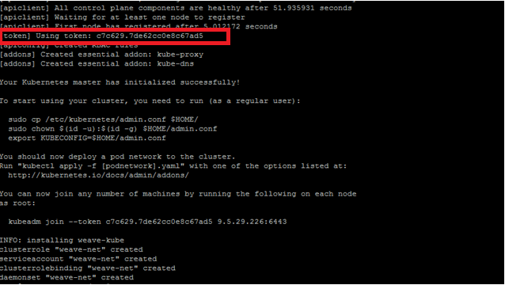

---

copyright:
  years: 2016, 2017
lastupdated: "2017-06-08"

---
<!-- Copyright info and last updated date at top of file: REQUIRED
    The copyright and lastupdated info is YAML content that must occur at the top of the MD file, before attributes are listed.
    It must be --- surrounded by 3 dashes ---
    The value "years" can contain just one year or a two years separated by a comma. (years: 2014, 2016)
    The value "lastupdated" must be followed by a machine date in quotes in the following format: "YYYY-MM-DD"
    The value for "years" must be indented 2 spaces under "copyright", followed by "lastupdated" which should start on its own non-indented line.

-->

<!-- Common attributes used in the template are defined as follows: -->
{:new_window: target="_blank"}
{:shortdesc: .shortdesc}
{:screen:.screen}
{:codeblock:.codeblock}

<!-- Additional task topic: OPTIONAL
This is the template for additional task topics that are needed beyond the basic tasks in the getting started index.md.  As needed, other task topics can be included, with titles such as "Configuring x", "Administering y", "Managing z", etc. This topic is a peer of the getting started index.md in the <servicename>.ditamap. This topic can have one level of children and they also can be referenced in <servicename>.ditamap -->

# Installing Kubernetes on a multi-node topology
<!-- for example, Uploading your data -->
{: #cam_install_k8}
<!-- Provide an appropriate ID above -->

<!-- The short description section should include a sentence describing why this task is needed. For search engine optimization, include the service long name and "Bluemix". For example: -->
Install Kubernetes V1.6.4-00 on master and worker nodes before installing Cloud Automation Manager. 
{:shortdesc}

If you want to deploy Cloud Automation Manager as a non root, then download and extract the file as that user. In addition, run the following command to give permissions to docker:

`sudo usermod -aG docker $(whoami)`

To install Kubernetes on a multi-node topology, run the following steps:

1. Install Kubernetes on the master nodes:
    1. Log in to the master node and download the `IBM_CAM_1.1.0.0_beta.tar.gz` file from IBM Beta website. 
    2. Run the following command to extract the contents of the compressed file:
        ```
        tar -zxvf IBM_CAM_1.1.0.0_beta.tar.gz -C IBM_CAM_1.1.0.0
        ```
        The extracted contents include the clone of the github repository where the necessary installation script files for both  Kubernetes and Cloud Automation Manager are available.
    3. Go to `IBM_CAM_1.1.0.0` folder and run the following commands to install Kubernetes master node:
        ```   
        bash K8_install-master.sh
        ```          
    4. Copy the token value that is displayed during installation. It is required whenever you add worker nodes to the Kubernetes master.
    
        
2. Install Kubernetes on all the worker nodes:

    1. SSH to the worker node and copy the `IBM_CAM_1.1.0.0_beta.tar.gz` compressed file from the master to the worker node.     
    2. From the `IBM_CAM_1.1.0.0` directory, run the following command to install Kubernetes on the worker node:
        ```     
        bash K8_install-worker.sh
        ```
    3. Run the following command to join this worker node with the master node: 
        ``` 
        kubeadm join --token <token_ID>
        ```
        where `<token_ID>` is the token value that you noted down during the installation on the master node. 
3. Go to master node and run the following commands to get access to connect to cluster:
    ```
    sudo cp /etc/kubernetes/admin.conf $HOME/
    sudo chown $(id -u):$(id -g) $HOME/admin.conf
    export KUBECONFIG=$HOME/admin.conf
    ```
4. From the master node, run the following command to verify whether all the worker nodes are ready to use:
    ```
    kubectl get nodes 
    ``` 
    The command lists all worker nodes along with their status and details. Check whether the status is `ready`. 
5. Run the following command to access the Kubenetes dashboard:
   ```
   kubectl create -f CAM-K8s-Yamls/kube-dashboard.yaml
   ```
   After you run the command, login to the Kubernetes dashboard at `http://<master ip>:30001`. 
   
   <strong>Note:</strong>For security reasons, it is not recommended to use the Kubernetes dashboard.
