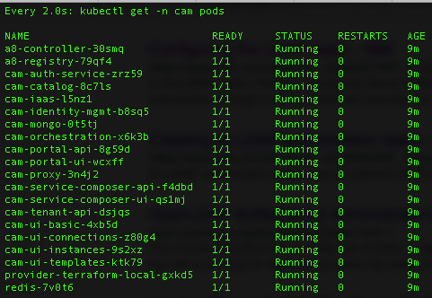

---

copyright:
  years: 2016, 2017
lastupdated: "2017-06-23"

---
<!-- Copyright info and last updated date at top of file: REQUIRED
    The copyright and lastupdated info is YAML content that must occur at the top of the MD file, before attributes are listed.
    It must be --- surrounded by 3 dashes ---
    The value "years" can contain just one year or a two years separated by a comma. (years: 2014, 2016)
    The value "lastupdated" must be followed by a machine date in quotes in the following format: "YYYY-MM-DD"
    The value for "years" must be indented 2 spaces under "copyright", followed by "lastupdated" which should start on its own non-indented line.

-->

<!-- Common attributes used in the template are defined as follows: -->
{:new_window: target="_blank"}
{:shortdesc: .shortdesc}
{:screen:.screen}
{:codeblock:.codeblock}

<!-- Additional task topic: OPTIONAL
This is the template for additional task topics that are needed beyond the basic tasks in the getting started index.md.  As needed, other task topics can be included, with titles such as "Configuring x", "Administering y", "Managing z", etc. This topic is a peer of the getting started index.md in the <servicename>.ditamap. This topic can have one level of children and they also can be referenced in <servicename>.ditamap -->

# Troubleshooting installation and login
<!-- for example, Uploading your data -->
{: #cam_local_troubleshoot}
<!-- Provide an appropriate ID above -->

<!-- The short description section should include a sentence describing why this task is needed. For search engine optimization, include the service long name and "Bluemix". For example: -->

Troubleshoot problems that you might find when you install or configure IBM Cloud Automation Manager. 
{:shortdesc}

##Installation issues

- Use the log information to troubleshoot issues or errors in Cloud Automation Manager.
  	* For Cloud Automation Manager microservices log, go to `/<extracted_dir>/log/microservice`
  	* For CAM-install log, go to `/<extracted_dir>/log/CAM-install`
  	* For Cam-delete log, go to `/<extracted_dir>/log/CAM-delete`
  
- If your containers are not in `running` status, run the `CAM-delete.sh` command to delete the entire deployment and retry the installation. 

- If a microservice takes more than 45 minutes to get to running state, then run the following commands to check the status of its pod:
  	* Run the following commands to list pods and services:
	
		`kubectl get pods -n <namespace_name>` or `kubectl get svc,pods -n <namespace_name>`   
  	* Run the following command to check the status of non-running microservice: 
	
		`kubectl describe -n  po/<pod name> <namespace_name>` . 
  	* Run the following command to delete the pods whenever they are in dead or inactive state:
	
		`kubectl delete -n cam po/<pod name>` 
  	* Run the following command to view the log information associated with a pod of a microservice:
	
		`kubectl logs po/<pod_name> -n <namespace_name>`  
  

##Login issues

If you are unable to log in to Cloud Automation Manager, try the following suggestions:

- Ensure that all the nodes in your setup can access all ports and hosts. For a list of ports, see [Ports used in Cloud Automation Manager](cam_local_ports.html#ports-used-in-cloud-automation-manager). 
- Delete the browser cache and try to log in again. 
- Ensure that the LDAP parameters properly configured. Verify that you set the parameters as defined in your LDAP directory. You can also use any LDAP search tool to verify the parameters.

## LDAP and onboarding issues

If the onboarding process fails, you might see the following error messages.

###"The LDAP directory already exists." (422) 

**Possible reason:** The earlier LDAP configuration is not deleted from the database. 

**Resolution:**

1. Run the offboarding script as follows:

	```
	bash offboard_cam.sh <master_node_IP>
	```
2. Run the onboarding script as follows:

    ```
    bash onboard_cam.sh <master_node_IP> <tenant_name> <openLdap_config_file>  
    ```

###"Error: Failed to onboard the LDAP directory." (502)

**Possible reasons:** LDAP parameters are not correct; A microservice might not be running.

**Resolution:**

* Ensure that your LDAP configuration parameters are correct.

* Check whether all the microservices are running. You can use the following command:

	```
	kubectl get -n cam pods 
	```

    If all the microservices are running, you see the status similar to the following one:

	

