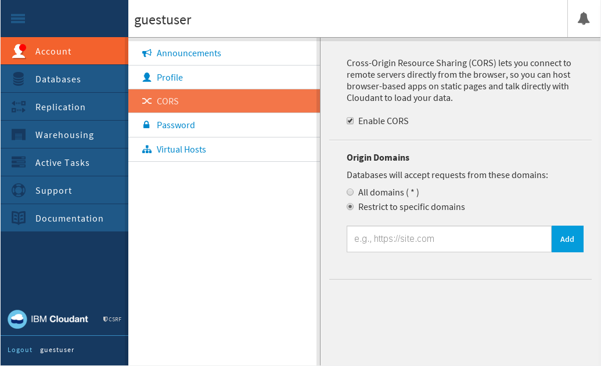

---

copyright:
  years: 2015, 2017
lastupdated: "2017-01-06"

---

{:new_window: target="_blank"}
{:shortdesc: .shortdesc}
{:screen: .screen}
{:codeblock: .codeblock}
{:pre: .pre}

# CORS

[Cross-origin resource sharing (CORS) ](http://www.w3.org/TR/cors/){:new_window} is a mechanism that allows resources
such as JSON documents in a Cloudant database to be requested
from Javascript running on a website loaded from another domain.
{:shortdesc}

These "cross-domain" requests would normally be forbidden by web browsers,
due to the [same origin security policy ](http://en.wikipedia.org/wiki/Same-origin_policy){:new_window}.

CORS defines a way in which the browser and the server interact to determine whether or not to allow the request.
For Cloudant,
there are two use cases in which CORS might be a good solution.

1.	You have a website on `https://www.example.com`
	and you want scripts on this website to be able to access data from `https://example.cloudant.com`.
	To do this,
	add `https://www.example.com` to your list of allowed origins.
	The effect is that scripts loaded from this domain are then
	allowed to make AJAX requests to your Cloudant databases.
	By using HTTP authorization with CORS requests,
	users of your application are able to access their database only.
2.	You want to allow third parties access to your database.
	An example might be where you have a database that contains product information,
	and you want to give sales partners access to the information from Javascript running on their own domain.
	To do this,
	add their domain to your list of allowed origins.
	The effect is that scripts running on their website are able to access your Cloudant database.

## Browser support

CORS is supported by all current versions of commonly used browsers.

>	**Note**: Versions of Microsoft Internet Explorer prior to version 10 offer partial support for CORS.
Versions of Microsoft Internet Explorer prior to version 8 do not support CORS.

## Security

Storing sensitive data in databases that can be accessed using CORS is a potential security risk.
When you place a domain in the list of allowed origins,
you are trusting any of the Javascript from the domain.
If the web application running on the domain is running malicious code or has security vulnerabilities,
sensitive data in your database might be exposed.

In addition,
allowing scripts to be loaded using HTTP rather than HTTPS,
and then accessing data using CORS,
introduces the risk that a man in the middle attack might modify the scripts.

To reduce the risk:

-	Don't allow CORS requests from all origins.
	In other words,
	do not set `"origins": ["*"]` unless you are certain that:
	-	You want to allow all data in your databases to be publicly accessible.
	-	User credentials that give permission to modify data are never used in a browser.
-	Allow CORS requests only from HTTPS origins, not HTTP.
-	Ensure that web applications running on allowed origin domains are trusted
	and do not have security vulnerabilities.

## Configuration endpoints

Method | Path                        | Description
-------|-----------------------------|------------
`GET`  | `/_api/v2/user/config/cors` | Returns the current CORS configuration.
`PUT`  | `/_api/v2/user/config/cors` | Changes the CORS configuration.

## JSON format

-	**enable_cors**: boolean value to turn CORS on or off.
-	**allow_credentials**: boolean value to allow authentication credentials.
	If set to true,
	browser requests must be done using `withCredentials = true`.
-	**origins**: An array of strings containing allowed origin domains.
	You have to specify the full URL including the protocol.
	It is recommended that only the HTTPS protocol is used.
	Subdomains count as seperate domains,
	so you have to specify all subdomains used. See the following example request.

## Setting the CORS configuration

`PUT`ting a JSON document with the example structure to `/_api/v2/user/config/cors` sets the CORS configuration.
The configuration applies to all databases and all account level endpoints in your account.

_Example request, using HTTP:_

```http
PUT /_api/v2/user/config/cors HTTP/1.1
Host: $ACCOUNT.cloudant.com
Content-Type: application/json
```
{:codeblock}

_Example request, using the command line:_ 

```sh
curl https://$ACCOUNT.cloudant.com/_api/v2/user/config/cors \
	-H 'Content-Type: application/json' \
	-X PUT \
	-T cors.json
```
{:codeblock}

_Example JSON file for setting the CORS configuration:_

```json
{
	"enable_cors": true,
	"allow_credentials": true,
	"origins": [
		"https://example.com",
		"https://www.example.com"
	]
}
```
{:codeblock}

The response tells you whether the configuration has been updated successfully.

_Example response:_

```json
{
	"ok": true
}
```
{:codeblock}

## Reading the CORS configuration

You can find out the current CORS configuration by sending a `GET` to the `/_api/v2/user/config/cors` endpoint.

_Example request to `GET` the current CORS configuration, using HTTP:_

```http
GET /_api/v2/user/config/cors HTTP/1.1
Host: username.cloudant.com
```
{:codeblock}

_Example request to `GET` the current CORS configuration, using the command line:_

```sh
curl https://$ACCOUNT.cloudant.com/_api/v2/user/config/cors
```
{:codeblock}

The response is the current CORS configuration in a JSON document.

_Example response:_

```json
{
	"enable_cors": true,
	"allow_credentials": true,
	"origins": [
		"https://example.com",
		"https://www.example.com"
	]
}
```
{:codeblock}

## Dashboard

CORS support is available in the Cloudant dashboard.

You can update your CORS settings using the CORS tab within the dashboard:



To see the current CORS configuration,
simply open the CORS tab in the dashboard.

You can enable or disable CORS using the `Enable CORS` checkbox.
This corresponds to the [`enable_cors` option](#configuration-endpoints)
when changing the CORS configuration from within an application.

To specify that CORS is enabled for all domains,
select the `All domains (*)` option.

To specify that CORS is enabled only for exact origin domains,
list each of the domains or subdomains using the `Restrict to specific domains` option.
For each domain,
provide a full URL,
preferably using the `https` prefix for additional security.
