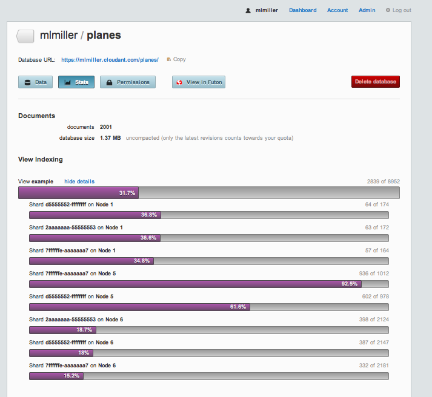
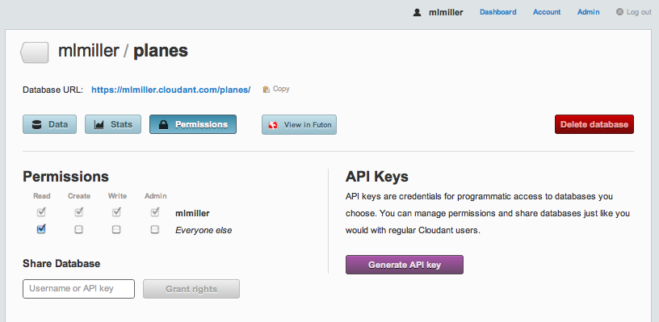
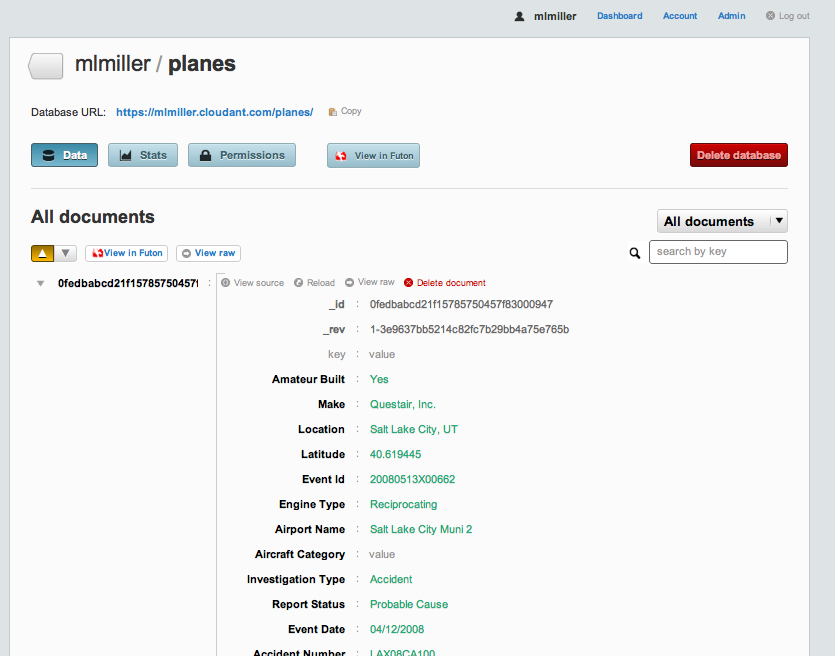
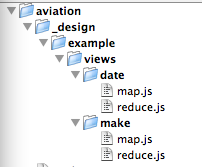

---

copyright:
  years: 2011, 2017
lastupdated: "2017-01-16"

---

{:new_window: target="_blank"}
{:shortdesc: .shortdesc}
{:screen: .screen}
{:codeblock: .codeblock}
{:pre: .pre}

# MapReduce

_(This is a republication of a Blog article by Mike Miller:
"MapReduce: From the basics to the actually useful (in under 30 minutes)",
originally published January 13, 2011.)_
{:shortdesc}

## From the basics to the actually useful (in under 30 minutes)

Recently,
Tim Anglade culminated his NOSQL World Tour with the release of
[the NOSQL Tapes ](http://nosqltapes.com/){:new_window},
a collection of live interviews collected globally.
Not only do I find that site aesthetically pleasing (courtesy of our own
[Steadicat ](http://twitter.com/steadicat){:new_window}),
but there is a tremendous amount of solid content,
from technical discussions to opinions and conjectures from many of the young leaders in the field.
I was fortunate to get a bit of Tim's time when he stopped in Seattle and we recorded a
[longish video ](http://nosqltap.es/8){:new_window}
on MapReduce in my lab at UW.
While I love the old school feel of a chalk-talk,
I must admit I'm pretty embarrassed at how rambling and fragmented my explanations are,
not to mention my shoddy use of available board space.
Therefore the Physics Professor in me feels obligated to try again,
albeit offline this time.

## Brief NOSQL Taxonomy

To set the MapReduce stage,
I'm going to offer a very naive taxonomy of NoSQL data stores (apologies to the experts).
I have yet to meet a database that isn't a key/value store,
so let's focus on some higher level distinction.
In particular,
let's focus on the difference between _big tables_
(BigTable,
HBase,
Cassandra,
etc.)
and _document stores_
(CouchDB,
MongoDB).
All of these solutions are finding solid acceptance in the wild,
so what - if any - difference is there?
My one-word answer is _flexibility_.
Huh,
isn't all NoSQL flexible?
Well...
yes and no.
In my eyes,
BigTable and its derivatives excel at one thing in particular:
structuring your data for the efficient I/O access that is necessary to get blazing read speeds for large data sets.
Somewhat orthogonal,
document stores,
especially CouchDB,
prioritize flexibility.
In particular,
there is no requirement to define columns,
column families,
or super columns up front.
You simply encapsulate your data as documents and push them into the store.
How then,
you may ask,
can you get efficient queries?
MongoDB treats the problem with blazingly fast in-memory table scans and document introspection for index builds,
whereas CouchDB takes a different approach with something called incremental MapReduce.
I'm going to briefly explain the latter and then show you how it works in action.

## MapReduce Primer

MapReduce is an old design pattern that was recently made famous by Google.
There are many different implementations,
and I won't even try to address them all.
It suffices to say that MapReduce is all about giving programmers an efficient way to consume data
without needing to know how or where it is actually stored.
Further,
MapReduce excels at traversing datasets that live on more than one machine.
It is simple,
a bit restrictive,
but extremely powerful.
I'm going to show you how it works in CouchDB
(well,
actually in BigCouch hosted on Cloudant.com).

Broadly speaking,
CouchDB (and Cloudant's BigCouch) use MapReduce as a tool to let you introspect your data
and build persistent 'views' (indices) for fast query responses.
And,
oh yeah,
it does it incrementally.
Let's examine the pieces in detail:
-   **View builds.**
    The process of scanning over your data to create indices that make queries fast.
    This step also often performs data normalization.
-   **MapReduce.**
    The framework by which user code gets executed for index builds.
-   **View queries.**
    How you get the information out of your indices.
-   **Incremental.**
    When new documents are added or existing documents are modified/removed,
    you don't need to rescan your entire dataset.
    Instead the view engine only rescans the new/modified documents,
    and deletes the contributions from the deleted/modified documents.
    It's a complex implementation,
    but one that really separates the Couch MapReduce model from,
    e.g.,
    Hadoop's or Riak's implementations.

For full details on Cloudant's implementation of MapReduce,
take a look at [Dynamo and CouchDB Clusters](dynamo.html) and
[Adam's O'Reilly Webcast ](http://oreillynet.com/pub/e/1760){:new_window}.
So what do you actually have to do?
Well,
you simply need to write one or two functions.
The 'map' function is required,
and the 'reduce' is optional.
For simple sorting problems
(e.g.
building a SEO reverse index)
map alone suffices.
For data aggregation,
reduce comes into the picture.
CouchDB allows you to write these functions in any language you choose,
although JavaScript is the most common.
Let's put some meat on the bones with examples.
Below I'm going to show you how to do three of the most common things people do with CouchDB's MapReduce:

1.  Sort documents based on arbitrary information.
2.  Calculate aggregate statistics.
3.  Perform a time-series analysis.

## Our Example Problem

We are going to load and analyze FAA plane crash data from
[data.gov ](http://data.gov/){:new_window}
using Cloudant.
If you want to follow along at home, you have two choices.

1.  Use CouchDB replication to copy my db into yours via:
    ```sh
    curl 'http://$ACCOUNT.cloudant.com/_replicate' -Hcontent-type:application/json -d '{"source":"http://mlmiller.cloudant.com/planes","target":"http://$ACCOUNT:$PASSWORD@$ACCOUNT.cloudant.com/planes","create_target":true}'
    ```
    {:pre}
2.  Repeat from scratch by
    [getting the code ](http://github.com/mlmiller/examples/tree/master/aviation){:new_window}
    from Github.

(1) is simpler and _doesn't require any special software installed on your machine_.
All you need is to have a free account on
[Cloudant ](http://cloudant.com/){:new_window}.
(2) is a bit more effort but should work with any CouchDB server.
If you go with (1),
the best way to check the progress is to
[login to your account ](http://cloudant.com/){:new_window},
click on your user dashboard (top right) and then click on the newly created 'planes' database.
If you examine the Stats tab and refresh periodically,
you will see the db size increasing,
as well as some MapReduce 'views' running as the data imports:<br/>


That bar that registers 31.7% is telling you that
MapReduce is being used to index your documents in real time
without you having to write any code at all.
The '2839 of 8952' on the right represents the fraction of freshly added/updated documents
that is processed in this current pass,
and if you click on 'show details' you can see the results of the MapReduce processes
on each of the cluster nodes that contain any chunk of your data.
That's just how easy it is to get your code running,
in parallel,
in realtime!

## Data Import

I've chosen to import the FAA crash data using my favorite tools:
Python and Benoit's
[Couchdbkit ](http://couchdbkit.org/){:new_window} library.
If you use the Python
[Boto ](https://code.google.com/p/boto/){:new_window} module for AWS,
you will feel right at home.
In [upload.py ](https://github.com/mlmiller/examples/blob/master/aviation/upload.py){:new_window},
I use the very handy `DictReader` class from Python's `csv` module to parse the `AviationData.txt.gz`.
`DictReader` slurps a line of a CSV (or similarly structured text file) with column headings and gives you back a dictionary.
It's a one-liner to serialize that Python dictionary and push it into Cloudant.
If you want to try this yourself the `README` file has instructions on installing
the Couchdbkit module and executing the `upload.py` script, but it just boils down to:
```sh
python upload.py AviationData.txt.gz 'http://$ACCOUNT:$PASSWORD@$ACCOUNT.cloudant.com' planes
```
{:pre}

My imported data lives at
[http://mlmiller.cloudant.com/planes ](http://mlmiller.cloudant.com/planes){:new_window}.

One thing to note:
you can see that I don't take any steps to discover the type of the data on import.
Instead,
we just throw it all into Cloudant and we can sort it out later using MapReduce (\_flexible\_).
Once the data is fully imported,
I can login into
[cloudant.com ](https://cloudant.com/){:new_window}
and view the 'planes' database in the dashboard:<br/>


I've also gone into the Permissions tab and granted read access to the data:<br/>


Each document contains quite a bit of data,
too much to fit onto a single screen shot,
in fact:<br/>


But the important thing to note is that we have data for nearly 70,000 domestic accidents,
spanning the range 1988–2010.
If you want to look at a single document from your command line,
you can via:
```sh
curl -X GET 'http://$ACCOUNT:$PASSWORD@$ACCOUNT.cloudant.com/planes/_all_docs?limit=1&include_docs=true'
```
{:pre}
and if you want it pretty printed,
my favorite is:
```sh
curl -X GET 'http://$ACCOUNT:$PASSWORD@$ACCOUNT.cloudant.com/planes/_all_docs?limit=1&include_docs=true' | python -m json.tool
```
{:pre}
Since I've granted read permissions on mlmiller/planes, you can execute this yourself via:
```sh
curl -X GET 'http://mlmiller.cloudant.com/planes/_all_docs?limit=1&include_docs=true' | python -m json.tool
{
    "offset": 0,
    "rows": [
        {
            "doc": {
                "": "",
                "Accident Number": "LAX08CA100",
                "Air Carrier": "",
                "Aircraft Category": "",
                "Aircraft Damage": "Substantial",
                "Airport Code": "U42",
                "Airport Name": "Salt Lake City Muni 2",
                "Amateur Built": "Yes",
                "Broad Phase of Flight": "",
                "Country": "United States",
                "Engine Type": "Reciprocating",
                "Event Date": "04/12/2008",
                "Event Id": "20080513X00662",
                "FAR Description": "",
                "Injury Severity": "Non-Fatal",
                "Investigation Type": "Accident",
                "Latitude": "40.619445",
                "Location": "Salt Lake City, UT",
                "Longitude": "-111.992777",
                "Make": "Questair, Inc.",
                "Model": "Venture",
                "Number of Engines": "1",
                "Publication Date": "05/28/2008",
                "Purpose of Flight": "Personal",
                "Registration Number": "N36V",
                "Report Status": "Probable Cause",
                "Schedule": "",
                "Total Fatal Injuries": "",
                "Total Minor Injuries": "2",
                "Total Serious Injuries": "",
                "Total Uninjured": "",
                "Weather Condition": "VMC",
                "_id": "0fedbabcd21f15785750457f83000947",
                "_rev": "1-3e9637bb5214c82fc7b29bb4a75e765b"
            },
            "id": "0fedbabcd21f15785750457f83000947",
            "key": "0fedbabcd21f15785750457f83000947",
            "value": {
                "rev": "1-3e9637bb5214c82fc7b29bb4a75e765b"
            }
        }
    ],
    "total_rows": 68388
}
```
{:pre}

## Example 1: Sort

Now that we have the data,
let's get down to business.
Key/Value is great,
but I want to be able get find all the documents for a given brand of plane,
say Cessna.
This is really an inverted index,
and is in the absolute sweet spot for MapReduce.
We can accomplish this with a 'map-only' view that looks like:
```javascript
function(doc) {
    emit(doc.Make, null);
}
```
{:codeblock}

The MapReduce code is actually stored in the database as part of a view in a design document
(see the
[CouchDB ](http://guide.couchdb.org/editions/1/en/views.html){:new_window}
Book for more details).
My favorite method is to use a client-side tool such as `couchapp` or `couchdbkit`
that allows me to organize `map.js` and `reduce.js` files according to a filesystem hierarchy
and then automatically upload them to the database as a design document.
I actually snuck that two-liner into
[`upload.py` ](https://github.com/mlmiller/examples/blob/master/aviation/upload.py#L20){:new_window},
where I have:
```python
loader = FileSystemDocsLoader('_design/')
loader.sync(db, verbose=True)
```
{:codeblock}
Those two lines unpack the contents of the `_design directory` and build a design document.
That directory looks like:<br/>


This gives me a design document with the name `example`;
that contains two views,
one called `date` and one called `make`.
You can see the entire design document from the command line via:
```sh
curl -X GET http://mlmiller.cloudant.com/planes/_design/example
```
{:pre}

or you can just browse the '`_design`' code in the file `_design/example/views/make/map.js`.
The code looks like this:
```javascript
function(doc) {
    emit(doc.Make, 1);
}
```
{:codeblock}

The `emit()` function generates a key/value pair that gets sorted according to CouchDB's deterministic
[collation order ](http://wiki.apache.org/couchdb/View_collation#Collation_Specification){:new_window}.
These key/value pairs are either stored directly in the view index,
or passed through the reducer first (see below).
Don't worry about the second argument to the emit method,
that's for the the reduce phase and we don't need that for a basic sort.
The moment that we upload that design document to Cloudant,
the index is kept up to date automatically.
That's quite different than the default CouchDB behavior,
but it's a nice optimization to make sure that the query response is snappy.

Query (finally!).
Let's find all of the documents ('rows') that have `doc.Make=="Cessna"`.
Since we emitted `doc.Make` in our map code,
`doc.Make` is therefore the 'key' for this index,
and that means we get snappy responses to queries like:
```sh
curl -X GET 'http://mlmiller.cloudant.com/planes/_design/example/_view/make?reduce=false&key="Cessna"&limit=10'
{"total_rows":68387,"offset":13905,"rows":[
{"id":"0fedbabcd21f15785750457f8300324c","key":"Cessna","value":1},
{"id":"0fedbabcd21f15785750457f83003a2f","key":"Cessna","value":1},
{"id":"0fedbabcd21f15785750457f830060ec","key":"Cessna","value":1},
{"id":"0fedbabcd21f15785750457f83006bfb","key":"Cessna","value":1},
{"id":"0fedbabcd21f15785750457f8300a5ae","key":"Cessna","value":1},
{"id":"0fedbabcd21f15785750457f8300e15d","key":"Cessna","value":1},
{"id":"0fedbabcd21f15785750457f830162b7","key":"Cessna","value":1},
{"id":"0fedbabcd21f15785750457f8301a3a4","key":"Cessna","value":1},
{"id":"0fedbabcd21f15785750457f8301a54e","key":"Cessna","value":1},
{"id":"0fedbabcd21f15785750457f83058740","key":"Cessna","value":1}
]}
```
{:pre}

The full list of query options is
[given here ](http://wiki.apache.org/couchdb/HTTP_view_API#Querying_Options){:new_window},
but really there are only a handful of options I typically use.
For this query,
if you remove the `limit` argument you will get the entire list of crashes with a Cessna involved.
If you want to do some fun statistics,
you can try:
```sh
curl -X GET 'http://mlmiller.cloudant.com/planes/_design/example/_view/make?reduce=false&key="Airbus"' | wc -l 15
```
{:pre}
```sh
curl -X GET 'http://mlmiller.cloudant.com/planes/_design/example/_view/make?reduce=false&key="Boeing"' | wc -l 773
```
{:pre}

Well that's interesting!
But wait,
isn't there a more efficient way to calculate statistics than slurping the entire set of
Boeing lines to the client and doing a client-side count? 
You bet, and that's where reduce comes in.

## Example 2: Data Aggregation

Now we want to go beyond simple sorts and aggregate to find the total number of crashes for different types of planes.
Reduce is perfect for this,
and that's why we did `emit(doc.Make,1)` in `map.js`.
If you look at the corresponding
[`reduce.js` ](https://github.com/mlmiller/examples/blob/master/aviation/_design/example/views/make/reduce.js){:new_window}
file for that view you'll see nothing more than: `_sum`.

What is that?
Well there are certain aggregation tasks that are simply so common
(count,
sum,
average,
min,
max,
etc.)
that we have coded them up in erlang and pushed them into the database.
Cloudant has an ever growing number of built-in reduces,
and using a builtin is always faster and less error prone than writing it yourself.
As an avid user,
I can admit that I haven't used a non-builtin reduce in at least 9 months.
So the `_sum` that we use here is simply going to add up the numbers
that we emitted as the 2nd argument to `emit()` in the `map.js` function.
Now we can answer the Boeing vs.
Airbus question without any client side work via:
```sh
curl -X GET 'http://mlmiller.cloudant.com/planes/_design/example/_view/make?key="Boeing"'
{"rows":[
{"key":null,"value":771}
]}
```
{:pre}
```sh
curl -X GET 'http://mlmiller.cloudant.com/planes/_design/example/_view/make?key="Airbus"'
{"rows":[
{"key":null,"value":13}
]}
```
{:pre}
Check that out!
Hmm,
now suppose I want to find the total number of accidents,
I can then just do:
```sh
curl -X GET 'http://mlmiller.cloudant.com/planes/_design/example/_view/make'
{"rows":[
{"key":null,"value":68387}
]}
```
{:pre}
Very cool,
and if I want to make a graph of how they plot out vs manufacture I can add the `group=true` option:
```sh
curl -X GET 'http://mlmiller.cloudant.com/planes/_design/example/_view/make?group=true'
{"rows":[
{"key":"","value":53},
{"key":"107.5 Flying Corporation","value":1},
{"key":"1200","value":1},
{"key":"1977 COLFER-CHAN","value":1},
{"key":"1ST FTR GP","value":1},
{"key":"2000 McCoy","value":1},
{"key":"2001 MCGIRL","value":1},
{"key":"2003 Nash","value":1},
{"key":"2007 Savage Air LLC","value":1},
{"key":"67 FLYING DUTCHMAN","value":1},
{"key":"85 MANISTA","value":1},
{"key":"A Pair of Jacks","value":1},
{"key":"A. H. GETTINGS","value":1},
{"key":"A. LE FRANCOIS","value":1},
...
```
{:pre}
(truncated because it's a looong list!)

Ok,
so aggregation seems pretty straightforward.
Now let's go the last step to time-series.

## Example 3: Time Series Analysis

Let's get a bit more numerical and ask,
what's the distribution of crashes and fatalities vs time.
That's what the `date` view is for.
If you inspect any of our crash documents you will see that they have a two other important fields:
`Event Date` and `Total Fatal Injuries`.
Let's create an index that allows us to answer time-based queries
about both the number of accidents and the number of fatalities.
While a bit morbid,
it's good to know what the odds are!
This example is a bit more complex because we are going to use an array for both arguments of `emit()`.
Take a look at the code in the
[`map.js` ](https://github.com/mlmiller/examples/blob/master/aviation/_design/example/views/date/map.js){:new_window}:
```javascript
function(doc) {
    var then = new Date(Date.parse(doc['Event Date']));
    var fatalities = 0;
    if (doc['Total Fatal Injuries']!="") {
        fatalities = parseInt(doc['Total Fatal Injuries']);
    }
    emit([then.getFullYear(), then.getMonth()], [1, fatalities]);
}
```
{:codeblock}
This is a bit more complex because we do some processing of the data.
In line #2 we unpack the `Event Date` variable into a JavaScript Date object,
very handy.
I find myself using `new Date(Date.parse(some_weird_timestamp))` all the time.
Line #6 simply casts our fatalities info into an integer.
The magic is in `emit`,
where we use JavaScript arrays `[]` for both the key and the value.
Then,
for reduce we use good ol' `_sum`.
One of Cloudant's additional builtins is a `_sum` that works on arrays,
very handy.
Now to query this index we get rows that are sorted by year,
then month.
The index looks like:
```sh
curl -X GET 'http://mlmiller.cloudant.com/planes/_design/example/_view/date?group_level=2' | more
{"rows":[
{"key":[1982,0],"value":[207,185]},
{"key":[1982,1],"value":[232,96]},
{"key":[1982,2],"value":[280,95]},
{"key":[1982,3],"value":[303,113]},
{"key":[1982,4],"value":[387,133]},
{"key":[1982,5],"value":[349,106]},
{"key":[1982,6],"value":[433,283]},
{"key":[1982,7],"value":[399,96]},
{"key":[1982,8],"value":[332,119]},
{"key":[1982,9],"value":[239,129]},
{"key":[1982,10],"value":[224,134]},
{"key":[1982,11],"value":[208,96]},
{"key":[1983,0],"value":[199,102]},
{"key":[1983,1],"value":[210,72]},
{"key":[1983,2],"value":[264,91]},
...
```
{:pre}
So,
e.g.,
1982 month 0 (January) had 207 crashes and 185 fatalities.
What was that group_level command?
Let's try changing it:
```sh
curl -X GET 'http://mlmiller.cloudant.com/planes/_design/example/_view/date?group_level=1' | more
{"rows":[
{"key":[1982],"value":[3593,1585]},
{"key":[1983],"value":[3556,1273]},
{"key":[1984],"value":[3457,1229]},
{"key":[1985],"value":[3096,1648]},
{"key":[1986],"value":[2880,1180]},
{"key":[1987],"value":[2828,1237]},
...
```
{:pre}
Well that's interesting!
`group_level=1` vs `2` has a big effect:
with `group_level=2` we get the full granularity/dimensionality of the array we used for the key (first argument to emit).
But we can,
at query time,
reduce even further by integrating over month!
Very cool,
and the gory details are few:
`group_level` runs between `0` and `length(key)`,
so in this case valid values are 0, 1, 2.
If we specify `group_level=0`,
we'll get sum statistics over the entire date range:
```sh
curl -X GET 'http://mlmiller.cloudant.com/planes/_design/example/_view/date?group_level=0'
{"rows":[
{"key":null,"value":[68387,38652]}
]}
```
{:pre}
Awesome.
And therein lies the power of using MapReduce for an efficient index build.
With Cloudant you don't need to install any software,
you simply use the cloud hosted cluster to run your code.
If you think about it,
all we really had to do was write 9 lines of javascript for the map method,
and no original code for the reduce method.
We can use this same exact index to query for a given date range,
say 1994:
```sh
curl -X GET 'http://mlmiller.cloudant.com/planes/_design/example/_view/date?group_level=2&startkey=\[1994\]&endkey=\[1995\]'
{"rows":[
{"key":[1994,0],"value":[116,60]},
{"key":[1994,1],"value":[142,42]},
{"key":[1994,2],"value":[191,67]},
{"key":[1994,3],"value":[179,72]},
{"key":[1994,4],"value":[224,74]},
{"key":[1994,5],"value":[223,98]},
{"key":[1994,6],"value":[267,131]},
{"key":[1994,7],"value":[260,101]},
{"key":[1994,8],"value":[212,200]},
{"key":[1994,9],"value":[169,129]},
{"key":[1994,10],"value":[131,79]},
{"key":[1994,11],"value":[143,130]}
]}
```
{:pre}
or if we want to do can turn off the reduce in the query and get all of the crashes from a given year/month combo:
```sh
curl -X GET 'http://mlmiller.cloudant.com/planes/_design/example/_view/date?key=\[1994,4\]&reduce=false' | more
{"total_rows":68387,"offset":34959,"rows":[
{"id":"88601d815897032516f87f0c510c7c60","key":[1994,4],"value":[1,1]},
{"id":"88601d815897032516f87f0c510c87b7","key":[1994,4],"value":[1,0]},
{"id":"88601d815897032516f87f0c510c951a","key":[1994,4],"value":[1,2]},
{"id":"88601d815897032516f87f0c510c9b0a","key":[1994,4],"value":[1,0]},
{"id":"88601d815897032516f87f0c510c9bbb","key":[1994,4],"value":[1,0]},
{"id":"88601d815897032516f87f0c510c9c15","key":[1994,4],"value":[1,1]},
{"id":"88601d815897032516f87f0c510c9d6d","key":[1994,4],"value":[1,0]},
{"id":"88601d815897032516f87f0c510ca925","key":[1994,4],"value":[1,0]},
...
```
{:pre}
Wow,
handy!
And if you want to really blow your mind,
add the query-string parameter `?include_docs=true` to get the full documents themselves.

## Summary

There's a lot of power in MapReduce,
and I hope I've given you enough to get your hands dirty running it an an extremely simple way using a hosted service.
If you have more questions,
there are lots of examples on the
[CouchDB wiki ](http://wiki.apache.org/couchdb/){:new_window}
or in the [Cloudant documentation](../index.html).
But the rule of thumb is:
-   **sort:** map only
-   **aggregate:** use a `_sum` reduce + `group_level`
-   **time-series:** use an array of `[year, month, day, ...]` + `group_level`
