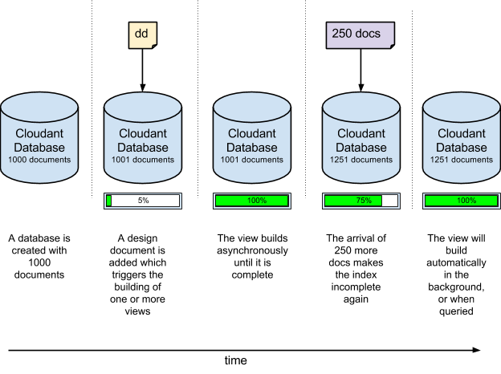
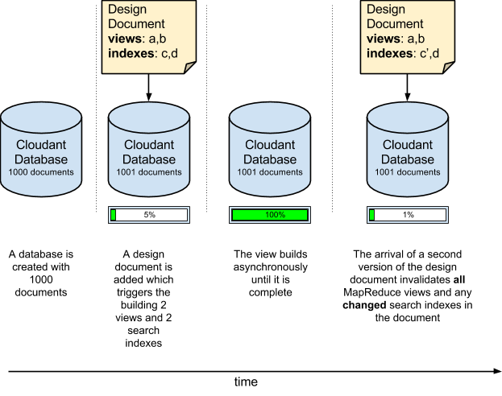
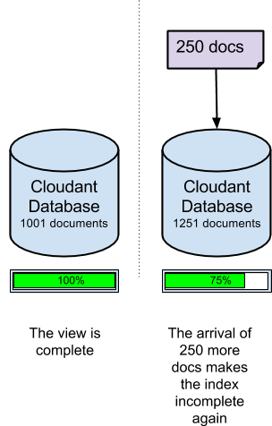

---

copyright:
  years: 2015, 2017
lastupdated: "2017-01-06"

---

{:new_window: target="_blank"}
{:shortdesc: .shortdesc}
{:screen: .screen}
{:codeblock: .codeblock}
{:pre: .pre}

# Design Document Management

*Article contributed by Glynn Bird, Developer Advocate at IBM Cloudant,
[glynn@cloudant.com ](mailto:glynn@cloudant.com){:new_window}*

Cloudant's scalable JSON data store has several querying mechanisms,
all of which generate indices that are created and maintained separately to the core data.
Indexing is not performed immediately when a document is saved.
Instead,
it is scheduled to happen later giving a faster,
non-blocking write throughput.

-   MapReduce views are indexes into the dataset
    with key value pairs stored in a BTree for efficient retrieval by key or range of keys
-   Search Indexes are constructed using Apache Lucene to allow free-text search,
    faceting and complex ad-hoc queries

Cloudant's [search indexes](../api/search.html) and [MapReduce views](../api/creating_views.html)
are configured by adding Design Documents to a database.
Design Documents are JSON documents which contain the instructions on how the view or index is to be built.
Let's take a simple example.
Assume we have a simple collection of data documents,
similar to the following example.

_Example of a simple data document:_

```json
{
    "_id": "23966717-5A6F-E581-AF79-BB55D6BBB613",
    "_rev": "1-96daf2e7c7c0c277d0a63c49b57919bc",
    "doc_name": "Markdown Reference",
    "body": "Lorem Ipsum",
    "ts": 1422358827
}
```
{:codeblock}

Each data document includes a name,
a body,
and a timestamp.
We want to create a [MapReduce view](../api/creating_views.html) to sort our documents by timestamp.

We can do this by creating a Map function,
similar to the following example.

_Example map function returning a document's timestamp field, if present:_

```javascript
function(doc) {
    if (doc.ts) {
        emit( doc.ts, null);
    }
}
```
{:codeblock}

The function emits the document's timestamp so that we can use it as the key to the index;
as we are not interested in the value in the index,
`null` is emitted.
The effect is to provide a time-ordered index into the document set.

We are going to call this view "`by_ts`"
and put it into a Design Document called "`fetch`",
like the following example.

_Example design document that defines a view using a map function:_

```json
{
    "_id": "_design/fetch",
    "views": {
      "by_ts": {
        "map": "function(doc) {
          if (doc.ts) {
            emit( doc.ts, null);
          }
        }"
      }
    },
    "language": "javascript"
}
```
{:codeblock}

The result is that our map code has been turned into a JSON-compatible string,
and included in a Design Document.

Once the Design Document is saved,
Cloudant triggers server-side processes to build the `fetch/by_ts` view.
It does this by iterating over every document in the database,
and sending each one to the Javascript map function.
The function returns the emitted key/value pair.
As the iteration continues,
each key/value pair is stored in a B-Tree index.
After the index is built for the first time,
subsequent re-indexing is performed only against new and updated documents.
Deleted documents are de-indexed.
This time-saving process is known as *incremental MapReduce*,
as shown in the following diagram:



It's worth remembering at this point that:

-   The construction of an index happens asynchronously.
    Cloudant confirms that our Design Document has been saved,
    but to check on the progress on the construction of our index,
    we have to poll Cloudant's [`_active_tasks`](../api/active_tasks.html) endpoint.
-   The more data we have,
    the longer it takes before the index is ready.
-   While the initial index build is in progress,
    _any queries made against that index will block_.
-   Querying a view triggers the 'mapping' of any documents that haven't yet been incrementally indexed.
    This ensures we get an up-to-date view of the data.
    See the following ['`stale`' parameter](#stale) discussion,
    for exceptions to this rule.

## Multiple views in the same design document

If we define several views in the same design document,
then they are built efficiently at the same time.
Each document is only read once,
and passed through each view's Map function.
The downside of this approach is that modifying a design document
_invalidates all of the existing MapReduce views_ defined in that document,
even if some of the views remain unaltered. 

If MapReduce views must be altered independently of each other,
place their definitions in separate design documents. 

>   **Note**: This behaviour does not apply to Lucene search indexes.
    They can be altered within the same design document
    without invalidating other unchanged indexes in the same document.



## Managing changes to a design document

Imagine at some point in the future we decide to change the design of our view.
Now,
instead of returning the actual timestamp result,
we are only interested in the count of how many documents match the criteria.
To achieve this,
the map function remains the same,
but we now use a _reduce_ of "`_count`".
The effect is that our design document looks like the following example.

_Example design document that uses a reduce function:_

```json
{
    "_id": "_design/fetch",
    "_rev": "2-a2324c9e74a76d2a16179c56f5315dba",
    "views": {
        "by_ts": {
            "map": "function(doc) {
                if (doc.ts) {
                  emit( doc.ts, null);
                }
            }
        }",
        "reduce": "_count"
    },
    "language": "javascript"
}
```
{:codeblock}

When this design document is saved,
Cloudant completely invalidates the old index and begins building the new index from scratch,
iterating over every document in turn.
As with the original build,
the time taken depends on how many documents are in the database,
and blocks incoming queries on that view until it is complete.

But there's a problem...

If we have an application that is accessing this view _in real-time_,
then we might well encounter a deployment dilemma:

-   Version 1 of our code,
    which relied on the original Design Document,
    might no longer work because the old view has been invalidated.
-   Version 2 of our code,
    which uses the new Design Document,
    can't be released immediately,
    because the new view will not have finished building yet,
    especially if there are many documents in the database.
-   A more subtle problem affecting our code is that versions 1 and 2 expect different result data from the view:
    version 1 expects a list of matching documents,
    while version 2 expects a 'reduced' count of results.

## Coordinating changes to Design Documents

There are two ways of dealing with this change control problem.

### Versioned design documents 

One solution is to use versioned design document names:

-   Our code is initially written to use a view called `_design/fetchv1`.
-   When we come to release a new version,
    we create a new view called `_design/fetchv2`,
    and query the view to ensure that it begins to build.
-   We poll `_active_tasks` until the work of building the new index is complete.
-   We are now ready to release the code that depends on the second view.
-   Delete `_design/fetchv1` when we are sure it is no longer needed.

Using versioned design documents is a simple way to manage change control in your Design Documents,
as long as you remember to remove the older versions at a later date!

### 'Move and switch' design documents

Another approach,
documented [here ](http://wiki.apache.org/couchdb/How_to_deploy_view_changes_in_a_live_environment){:new_window},
relies on the fact that Cloudant recognises when it has two identical design documents,
and won't waste time and resources rebuilding views it already has.
In other words,
if we take our design document `_design/fetch` and create an exact duplicate `_design/fetch_OLD`,
then both endpoints would work interchangeably without triggering any reindexing.

The procedure to switch to the new view is this:

1.  Create a duplicate copy of the design document that we want to change,
    for example by adding `_OLD` to its name:
    `_design/fetch_OLD`.
2.  Put the new or 'incoming' design document into the database,
    using a name with the suffix `_NEW`: `_design/fetch_NEW`.
3.  Query the `fetch_NEW` view,
    to ensure that it starts to build.
4.  Poll the `_active_tasks` endpoint and wait until the index has finished building.
5.  Put a duplicate copy of the new design document into `_design/fetch`.
6.  Delete Design Document `_design/fetch_NEW`.
7.  Delete Design Document `_design/fetch_OLD`.

## Move and Switch tooling

There is a command-line Node.js script that automates the 'move and switch' procedure,
called '`couchmigrate`'.
It can be installed as follows.

_Command to install the Node.js `couchmigrate` script:_

```sh
npm install -g couchmigrate
```
{:codeblock}

To use the `couchmigrate` script,
first define the URL of the CouchDB/Cloudant instance by setting an environment variable called `COUCH_URL`.

_Defining the URL of the a Cloudant instance:_

```sh
export COUCH_URL=http://127.0.0.1:5984
```
{:codeblock}

The URL can be HTTP or HTTPS,
and can include authentication credentials.

_Defining the URL of the Cloudant instance with authentication credentials:_

```sh
export COUCH_URL=https://$ACCOUNT:$PASSWORD@$HOST.cloudant.com
```
{:codeblock}

Assuming we have a design document in JSON format,
stored in a file,
we can then run the migrate command.

In this example,
`db` specifies the name of the database to change,
and `dd` specifies the path to our Design Document file.

_Running the `couchmigrate` command:_

```sh
couchmigrate --db mydb --dd /path/to/my/dd.json
```
{:pre}

The script coordinates the 'move and switch' procedure,
waiting until the view is built before returning.
If the incoming design document is the same as the incumbent one,
then the script returns almost immediately.

The source code for the script is available here:
[https://github.com/glynnbird/couchmigrate ](https://github.com/glynnbird/couchmigrate){:new_window}.

<div id="stale"></div>

## The '`stale`' parameter

If an index is complete,
but new records are added into the database,
then the index is scheduled to be updated in the background.
This is the state of the database shown in the following diagram:



When querying the view, we have three choices:

-   The default behaviour is to ensure that the index is up-to-date,
    with the latest documents in the database,
    before returning the answer.
    When we query the view,
    Cloudant first indexes the 250 new documents,
    and then returns the answer.
-   An alternative is adding the "`stale=ok`" parameter to the API call.
    The parameter means "return me the data that is already indexed,
    I don't care about the latest updates".
    In other words,
    when you query the view with "`stale=ok`",
    Cloudant returns the answer immediately,
    without any additional reindexing.
-   A second alternative is to add the "`stale=update_after`" parameter to the API call.
    The parameter means "return me the data that is already indexed,
    _and_ then reindex any new documents".
    In other words,
    when you query the view with "`stale=update_after`",
    Cloudant returns the answer immediately,
    and then schedules a background task to index the new data.

Adding "`stale=ok`" or "`stale=update_after`" can be a good way getting answers more quickly from a view,
but at the expense of freshness. 

>   **Note**: The default behaviour distributes load evenly across nodes in the Cloudant cluster.
    If you use the alternative `stale=ok` or `stale=update_after` options,
    this might favor a subset of cluster nodes,
    in order to return consistent results from across the eventually consistent set.
    This means that the '`stale`' parameter isn't a perfect solution for all use-cases.
    However,
    it can be useful for providing timely responses on fast-changing data sets
    if your application is happy to accept stale results.
    If the rate of change of your data is small,
    adding "`stale=ok`" or "`stale=update_after`" will not bring a performance benefit,
    and might unevenly distribute the load on larger clusters.

Avoid using `stale=ok` or `stale=update_after` whenever possible.
The reason is that the default behavior provides the freshest data,
and distributes data within the cluster.
If it is possible to make a client app aware that there is a large data processing task is in progress
(during a regular bulk data update, for example),
then the app could switch to `stale=ok` temporarily during these times,
then revert to the default behaviour afterwards.

>   **Note**: The `stale` option is still available,
    but the more useful options `stable` and `update` are available and should be used instead.
    For more details,
    see [Accessing a stale view](../api/using_views.html#accessing-a-stale-view).