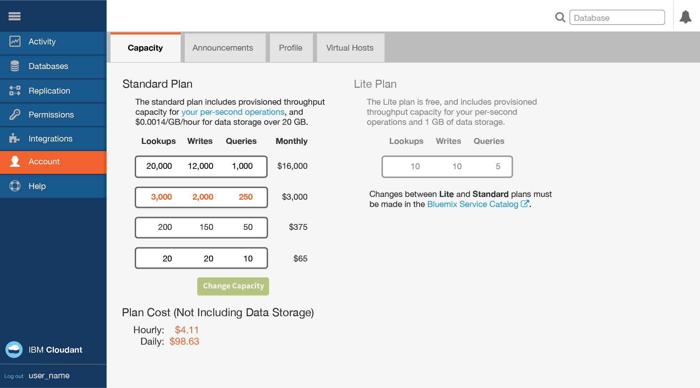
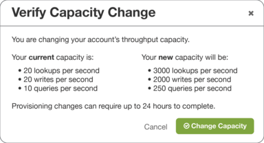
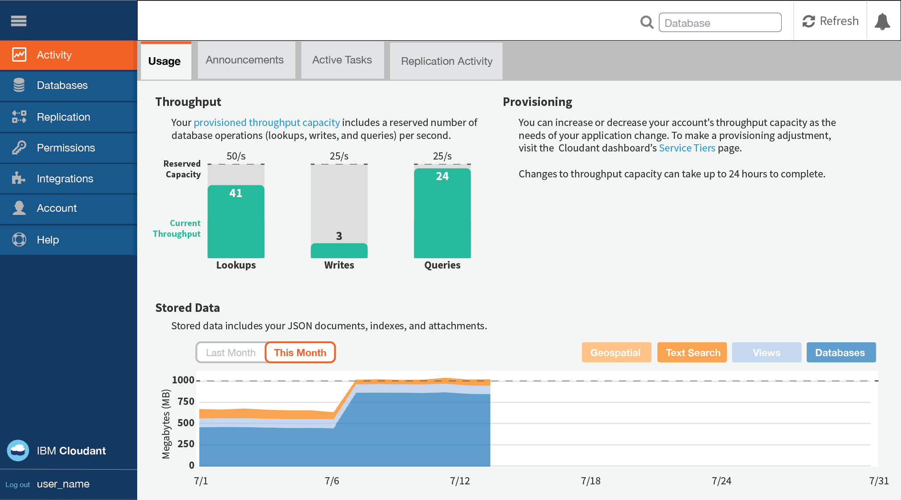

---

copyright:
  years: 2015, 2017
lastupdated: "2017-01-31"

---

{:new_window: target="_blank"}
{:shortdesc: .shortdesc}
{:screen: .screen}
{:codeblock: .codeblock}
{:pre: .pre}

<!-- Acrolinx: 2017-01-26 -->

# IBM Bluemix

Cloudant is also available as an
[IBM Bluemix service ](https://console.ng.bluemix.net/catalog/services/cloudant-nosql-db/){:new_window}.
{:shortdesc}

Bluemix is an open-standard,
cloud platform for building,
running,
and managing applications.
Find out more about Bluemix,
and start using it,
at the [home page ](https://console.ng.bluemix.net/){:new_window}.

## Bluemix Public

Cloudant on Bluemix is available as a free [Lite plan](#lite-plan),
and as several configurations within the paid [Standard plan](#standard-plan).

The following table summarizes the performance measures for each of the plans.

>   **Note**: The details in the table are indicative as at September 2016.
    For current values,
    contact [Cloudant Support ](mailto:support@cloudant.com){:new_window}.

>   **Note**: All currency values in this document are in US dollars ($).

<table border='1'>

<tr>
<th>Plans</th><th>Lite</th><th colspan='4'>Standard</th>
</tr>
<tr>
<td>Base Price (per hour)</td>
<td>$0.00</td>
<td colspan='4'>See <a href="http://cloudant.com/bluemix" target="_blank">Pricing details </a>.</td>
</tr>
<tr>
<td>Provisioned Throughput Capacity (Lookups per second)</td>
<td>20</td>
<td>100</td>
<td>1,000</td>
<td>5,000</td>
<td>20,000</td>
</tr>
<tr>
<td>Provisioned Throughput Capacity (Writes per second)</td>
<td>10</td>
<td>50</td>
<td>500</td>
<td>2,500</td>
<td>10,000</td>
</tr>
<tr>
<td>Provisioned Throughput Capacity (Queries per second)</td>
<td>5</td>
<td>5</td>
<td>50</td>
<td>250</td>
<td>1,000</td>
</tr>
<tr>
<td>Maximum individual document size</td>
<td>1 MB</td>
<td colspan='4'>1 MB</td>
</tr>
<tr>
<td>Disk Space Included</td>
<td>1 GB</td>
<td colspan='4'>20 GB</td>
</tr>
<tr>
<td>Disk Overage (per GB/hour)</td>
<td>Not available</td>
<td colspan='4'>See <a href="http://cloudant.com/bluemix" target="_blank">Pricing details </a>.</td>
</tr>

</table>

### Lite plan

The Lite plan is free,
but limits you to a maximum of 1 GB of data storage.
Limits also apply to the provisioned throughput capacity for lookups,
writes,
and queries.

If you would like to store more than one GB of data,
or to have a greater throughput capacity,
move to the [Standard plan](#standard-plan).

### Standard plan

The Standard plan includes 20 GB of data storage.
Above 20 GB,
you are charged a defined cost per GB per hour.
See the [Pricing ](http://cloudant.com/bluemix){:new_window} information for the current cost.
On the Standard plan,
you can also change the amount of provisioned throughput capacity for lookups,
writes,
and queries.

You can see details of the throughput capacity within the plans available for your account.
You can select the level of provisioning that you want to use,
through the Account tab of your Cloudant account Dashboard.

To move to a different throughput capacity,
select the provisioning you want,
then click the `Change Capacity` option button.
You are asked to confirm the change,
and reminded that the provisioning change can take up to 24 hours to complete.

#### Provisioned throughput capacity

Throughput provision is identified and measured as one of three kinds of events:

1.	A lookup,
    which is a read of a specific document,
    based on the `_id` of the document.
2.	A write,
    which is the creation or modification of an individual document,
    or any update due to an index build.
3.	A query,
    which is a request made to one of the Cloudant query endpoints,
    including the following types:
	-	Primary Index ([`_all_docs`](../api/database.html#get-documents))
	-	MapReduce View ([`_view`](../api/creating_views.html#using-views))
	-	Search Index ([`_search`](../api/search.html#queries))
	-	Geospatial Index ([`_geo`](../api/cloudant-geo.html#querying-a-cloudant-geo-index))
	-	Cloudant Query ([`_find`](../api/cloudant_query.html#finding-documents-using-an-index))
	-	Changes ([`_changes`](../api/database.html#get-changes))

The measurement of throughput is a simple count of the number of events of each type,
per second,
where the second is a _sliding_ window.
If your account exceeds the number of throughput events that are provisioned for the plan,
requests are rejected until the number of events within the sliding window
no longer exceeds the number that is provisioned.
It might help to think of the sliding 1-second window as being any consecutive period of 1,000 milliseconds.

For example,
if you are on the Standard plan with provision for 200 lookups per second,
your account might make a maximum of 200 lookup requests during a consecutive period of 1,000 milliseconds (1 second).
Subsequent lookup requests made during the sliding 1,000-millisecond period
are rejected until the number of lookup requests in that period drops below 200 again.

When a request is rejected because the number of events is exceeded,
applications receive a [`429` Too Many Requests](../api/http.html#429).
response.

Recent versions of the supported client libraries (for [Java](../libraries/supported.html#java),
[Node.js](../libraries/supported.html#node-js),
and [Python](../libraries/supported.html#python) languages) help you handle a `429` response.
For example,
the Java library throws a
[`TooManyRequestsException` ](http://static.javadoc.io/com.cloudant/cloudant-client/2.5.1/com/cloudant/client/org/lightcouch/TooManyRequestsException.html){:new_window}.

By default,
the supported client libraries do not automatically attempt to retry
a request when a `429` response is received.

It is better to ensure that your application handles `429` responses correctly.
The reason is that the number of retries is limited;
regularly transgressing the number of requests is a strong indicator
for moving to a different plan configuration.

>   **Note**: If you are porting an existing application,
    it might not be able to handle a `429` response.
    As part of your migration verification,
    check that your application handles `429` responses correctly.

In summary,
you must ensure that your application is able to handle a [`429`](../api/http.html#429) response correctly.

#### Maximum individual document size

Data is stored within Cloudant as [JSON documents](../api/document.html).
For documents in a Cloudant service on IBM Bluemix,
the maximum size for an individual document is 1 MB.
Exceeding this limit causes a [`413` error](../api/http.html#413).

#### Disk Space Included

This value is the storage capacity included in the plan.
It is used for both data and index storage.

#### Disk Overage

All Standard and Lite plan service instances are monitored for disk space used.
If the account uses more than the amount of storage that is provided in your plan configuration,
it is considered to 'overflow'.
Overflow causes the account to be billed at the indicated price for each extra GB used beyond the plan allocation.

The extra amount of money that you must pay for using more disk space than is provided in the plan is called an 'overage'.
Overage is calculated on an hourly basis.
It is not possible to overflow the disk space available in the Lite plan.

For example,
assume that your Standard plan instance increases disk usage to 107 GB for half a day (12 hours).
This change means that your instance caused overflow of 87 GB more than the 20 GB plan allocation,
for 12 hours.
Therefore,
you would be billed an overage charge based on 87 GB x 12 hours = 1044 GB hours for that extra space.

Overage is calculated by using the maximum number of GB above the plan allocation during a particular hour within the billing cycle.

#### A worked overage example

Assume that you start a month of 30 days with a Standard plan service instance that uses 9 GB of storage.
Next,
your storage increases to 21.5 GB for 15 minutes during the hour beginning at 02:00 of day 3.
The instance drops back to 9.5 GB for the next 10 minutes of hour 02:00,
then increases to 108 GB for the next 25 minutes of hour 02:00.
Finally,
your instance finishes the hour and indeed the rest of month by dropping down to 28 GB.

This pattern means the maximum number of GB above the plan allocation was 88 GB during hour 2 of day 3.
For hour 03:00 of day 3,
and for the rest of the month,
your instance was 8 GB above the plan allocation.

Therefore,
for hour 02:00 of day 3,
you would be billed an overage based on 88 GB x 1 hour = 88 GB hours.

For hour 03:00 of day 3 to the end of day 3,
you would be billed an overage based on 8 GB x 21 hours = 168 GB hours.

For hour 00:00 of day 4 to the end of the month (of 30 days),
you would be billed an overage based on 8 GB x 24 hours x 27 days = 5184 GB hours.

The total overage bill for the month would be based on a total of 88 + 168 + 5184 = 5440 GB hours.

#### Locations

By default,
all plans are based on multi-tenant clusters.
As part of your plan selection,
you can choose from the following Bluemix Public regions:

-   US South
-   United Kingdom
-   Sydney

#### Security, Encryption, and Compliance

All plans are provided on servers with
[at-rest ](https://en.wikipedia.org/wiki/Data_at_rest){:new_window} disk encryption.
Access is encrypted over a network connection by using HTTPS.
For more detail,
see [DBaaS Security ](https://cloudant.com/product/cloudant-features/dbaas-security/){:new_window}.

The plans also offer
[Security Compliance Certification ](https://cloudant.com/product/cloudant-features/cloudant-compliance/){:new_window}.
[HIPAA ](https://en.wikipedia.org/wiki/Health_Insurance_Portability_and_Accountability_Act){:new_window}
compliance requires a [single-tenant environment](#locations),
so request this environment before provisioning.

#### High Availability, Disaster Recovery, and Backup

To provide High Availability (HA) and Disaster Recovery (DR) within a data center,
all data is stored in triplicate across three separate physical servers in a cluster.
You can provision accounts in multiple data centers,
then use continuous data replication to provide HA/DR across data centers.

Cloudant data is not automatically backed up.
You can request enablement of an [incremental backup feature](../guides/backup-guide.html),
or alternatively implement your own solution by using one of several possible techniques that are described
[here ](https://developer.ibm.com/clouddataservices/2016/03/22/simple-couchdb-and-cloudant-backup/){:new_window}.  

### Monitoring usage

Information about your usage is available in the Usage pane of the Activity tab within your Cloudant Dashboard.

.

Details are provided there,
illustrating your current [throughput](#throughput),
and quantity of [stored data](#disk-space-included).

Monitoring helps you recognize that a change to the provisioning in your plan might be advisable.
For example,
if you frequently approach the maximum number of database lookups,
then you can modify the provisioning through the [Service pane](#servicetier) on the Account tab of the Dashboard.

### Hardware specification

All plans are implemented on multi-tenant clusters.
All data is stored in triplicate,
across three separate physical nodes for High Availability and Data Recovery.

### Support

Support for Standard plan service instances is optional.
It is provided by purchasing "Bluemix Standard Support".
Support is not available for the Lite plan.

A pricing calculator for Bluemix Standard Support is available
[here ](https://console.ng.bluemix.net/?direct=classic/#/pricing/cloudOEPaneId=pricing&paneId=pricingSheet){:new_window}.
Information about the details of the Support Service Level Agreement (SLA) is available
[here ](http://www-03.ibm.com/software/sla/sladb.nsf/pdf/6606-08/$file/i126-6606-08_05-2016_en_US.pdf){:new_window}.

## Bluemix Dedicated

Cloudant DBaaS Enterprise on single tenant dedicated hardware is available in a
[Bluemix Dedicated ](http://www.ibm.com/cloud-computing/bluemix/dedicated/){:new_window} configuration.
