---

copyright:
  years: 2017
lastupdated: "2017-01-10"

---

{:new_window: target="_blank"}
{:shortdesc: .shortdesc}
{:screen: .screen}
{:codeblock: .codeblock}
{:pre: .pre}

<!-- Acrolinx: 2017-01-10 -->

# Creating a simple Bluemix application to access a Cloudant database: the application environment

This section of the tutorial describes how to set up the application environment you must have
for creating an {{site.data.keyword.Bluemix}} application.
{:shortdesc}

<div id="creating"></div>

## Creating a {{site.data.keyword.Bluemix_notm}} application environment

1.  Log in to your {{site.data.keyword.Bluemix_notm}} account.
    The {{site.data.keyword.Bluemix_notm}} dashboard can be found at:
    [http://bluemix.net ](http://bluemix.net){:new_window}.
    After you authenticate with your user name and password,
    the {{site.data.keyword.Bluemix_notm}} dashboard appears:<br/>
    

2.  Click the '`Catalog`' link:<br/>
    <br/>
    A list of the services available on {{site.data.keyword.Bluemix_notm}} appears.

3.  Click the '`Cloud Foundry Apps`' entry under the `Apps` heading:<br/>
    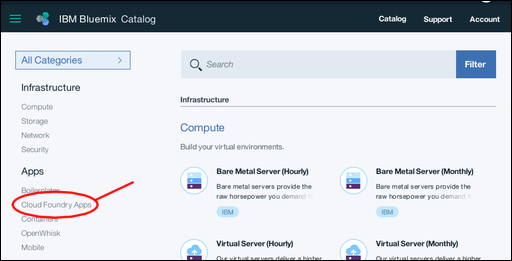<br/>
    A list of the Cloud Foundry Applications
    available on {{site.data.keyword.Bluemix_notm}} appears.

4.  Click the '`Python`' entry:<br/>
    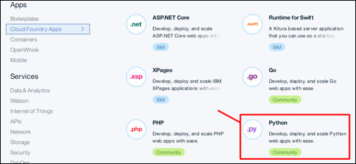<br/>
    A '`Create a Cloud Foundry App`' form appears.

5.  Use the '`Create a Cloud Foundry App`' form to specify and create the environment
    for your Python Cloud Foundry application.
    Enter a name for your application,
    for example '`Cloudant Python`'.
    The host name is generated for you automatically,
    although you can customize it:<br/>
    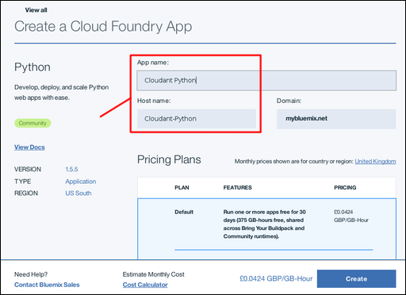<br/>
    >   **Note**: The host name must be unique within the {{site.data.keyword.Bluemix_notm}} domain. In this example, the domain is '`mybluemix.net`', giving a full host name of '`Cloudant-Python.mybluemix.net`'.

6.  Click '`Create`' to create the application environment:<br/>
    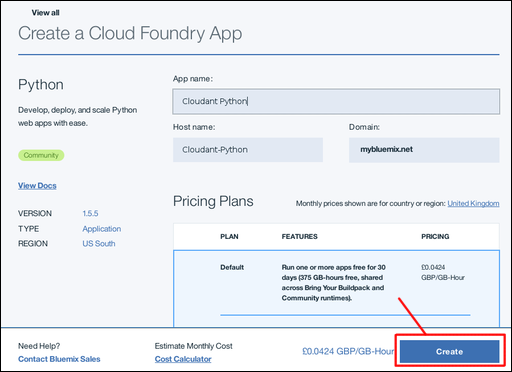

7.  After a short pause,
    the '`Getting Started`' window for your new application environment appears.
    A test application is automatically created within the environment.
    The application is started automatically,
    as shown by the green icon and `Your app is running` status.
    The application is a 'heartbeat' program,
    sufficient to show that the new application environment is ready for you to use.
    Click the `Dashboard`' link to return to your {{site.data.keyword.Bluemix_notm}} account dashboard.<br/>
    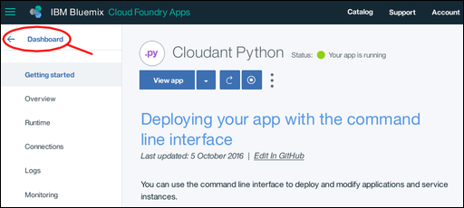

8.  Your dashboard now includes the newly created application environment:<br/>
    

You now have a {{site.data.keyword.Bluemix_notm}} Python application environment,
ready to use.

To work with a {{site.data.keyword.cloudant_short_notm}} database instance,
the next step is to create a 'connection' between the application environment and the database instance.

<div id="connecting"></div>

## Connecting {{site.data.keyword.Bluemix_notm}} applications and services

This section of the tutorial explains how you connect
{{site.data.keyword.Bluemix_notm}} application environments and services by using
the configuration and management area of your application.

1.  From your {{site.data.keyword.Bluemix_notm}} dashboard,
    click the entry for your application.<br/>
    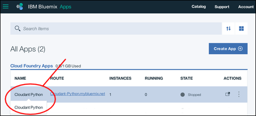<br/>
    >   **Note**: Avoid the '`Route`' column, as clicking the link that is associated with your application invokes the application rather than taking you to the configuration area. A better place to click is on the name of your application.

    The configuration and management overview area for your application appears.

2.  To connect the application environment to another service,
    click the '`Connections`' link:<br/>
    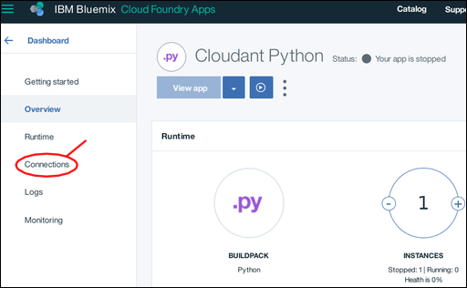<br/>
    An area appears for configuring a connection between your application and any other services available within your account.

3.  A [prerequisite](create_bmxapp_prereq.html#prerequisites) for this tutorial is an
    existing {{site.data.keyword.cloudant_short_notm}} database instance.
    Click '`Connect existing`' to establish a connection between that database instance and your application:<br/>
    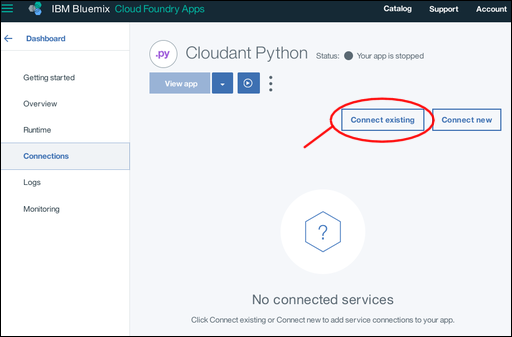<br/>
    A list of the existing service instances in your account appears.

4.  Click the {{site.data.keyword.cloudant_short_notm}} database instance that you want to use.
    This tutorial uses the '`Cloudant Service 2017`' instance:<br/>
    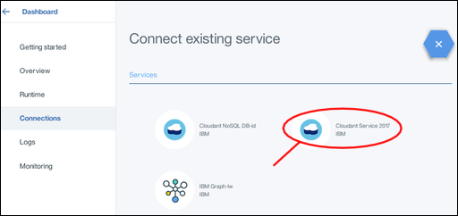

5.  You are asked to confirm that you really want to connect the database instance to your application.
    Click '`Connect`' to confirm the connection:<br>
    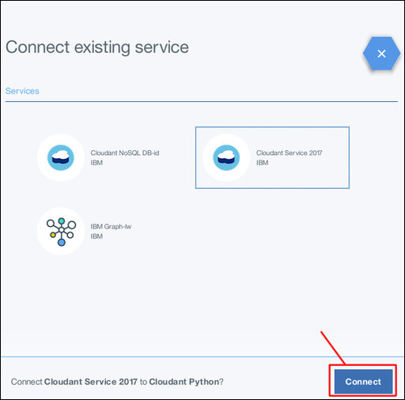

6.  Modifying the service connections for an application affects its overall configuration.
    The modification requires a 'restaging' of the application,
    which also forces a running application to stop.
    A window appears for you to confirm that you are ready for the 'restaging' to proceed.
    Click '`Restage`' to continue:<br/>
    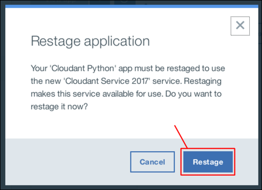

7.  The service connections page reappears.
    It now includes the newly connected database instance:<br/>
    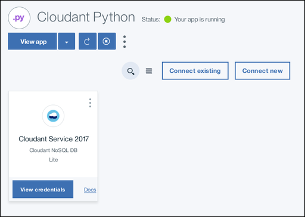

The application environment and the database instance are now connected.
The next step is to ensure that the necessary tools are installed for you to
work with {{site.data.keyword.Bluemix_notm}} applications.

<div id="toolkits"></div>

## The Cloud Foundry and Bluemix command toolkits

This section of the tutorial describes the toolkits that must be installed to work with
your {{site.data.keyword.Bluemix_notm}} environment,
applications,
and services.

The [Cloud Foundry ](https://en.wikipedia.org/wiki/Cloud_Foundry){:new_window}
toolkit is a collection of tools for working with applications that are
deployed in a Cloud Foundry-compatible environment.
Use these tools for tasks such as updating a deployed application,
or to start and stop a running application.

The {{site.data.keyword.Bluemix_notm}} toolkit provides extra capabilities,
which are required for working with applications hosted and running within a {{site.data.keyword.Bluemix_notm}} environment.

Downloading and installing the toolkits is a one-off task.
If the toolkits are already installed and working on your system,
you do not need to download them again,
unless they are updated.

General information about the toolkits is available
[here ](https://console.ng.bluemix.net/docs/cli/index.html){:new_window}.

### Installing the Cloud Foundry toolkit

Some operating system distributions have a version of the Cloud Foundry toolkit available already.
If the version supported is 6.11 or better,
it is compatible with {{site.data.keyword.Bluemix_notm}} and can be used.
You can check what version is installed by running [this test](#checkCFversion).

Alternatively,
use the following steps to download and install the Cloud Foundry toolkit on your system: 

1.  A link to download the Cloud Foundry toolkit is available on the '`Getting started`' window of
    your application environment:<br/>
    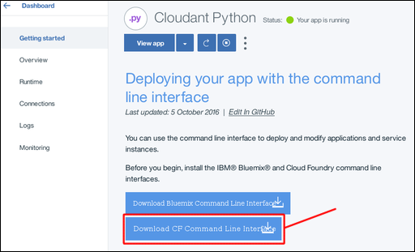

2.  Clicking the link takes you to a
    [download page on GitHub ](https://github.com/cloudfoundry/cli/releases){:new_window}:<br/>
    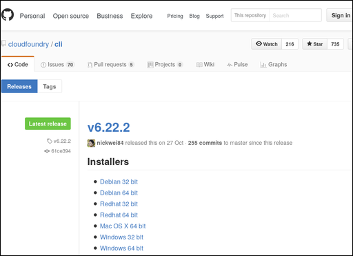

3.  Download and run the most recent version of the installer for your system.

4.  <div id='checkCFversion'></div>To check that you have a working Cloud Foundry toolkit,
    run the following command at a prompt:

    ```sh
    cf --version
    ```
    {:pre}
    
    Expect a result similar to the following output:
    
    ```
    cf version 6.20.0+25b1961-2016-06-29
    ```
    {:codeblock}
    
    >   **Note**: The Cloud Foundry toolkit version must be 6.11 or more recent for compatibility with {{site.data.keyword.Bluemix_notm}}.

### Installing the Bluemix toolkit

Use the following steps to download and install the {{site.data.keyword.Bluemix_notm}} toolkit on your system.

1.  A link to download the {{site.data.keyword.Bluemix_notm}} toolkit is available
    on the '`Getting started`' window of your application:<br/>
    

2.  Clicking the link takes you to a
    [download page ](http://clis.ng.bluemix.net/ui/home.html){:new_window}:<br/>
    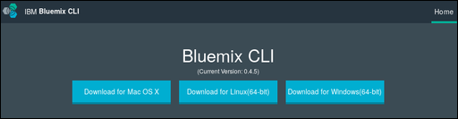

3.  Download and run the appropriate installer for your system.

    The installer checks to ensure that you have a suitable version of the Cloud Foundry toolkit installed.
    If everything is correct,
    the {{site.data.keyword.Bluemix_notm}} toolkit installs on your system.

4.  To check that you have a working {{site.data.keyword.Bluemix_notm}} toolkit,
    run the following command at a prompt:
    
    ```sh
    bluemix --version
    ```
    {:pre}
    
    Expect a result similar to the following output:
    
    ```
    bluemix version 0.4.5+03c29de-2016-12-08T07:01:01+00:00
    ```
    {:codeblock}
    
The tools to work with {{site.data.keyword.Bluemix_notm}} applications are now available.
The next step is to obtain the 'starter' materials to help you create
a {{site.data.keyword.Bluemix_notm}} application.

<div id="starter"></div>

## The 'starter' application

This section of the tutorial describes a {{site.data.keyword.Bluemix_notm}}
starter application,
and explains how you customize it to access
a {{site.data.keyword.cloudant_short_notm}} database instance.

A {{site.data.keyword.Bluemix_notm}} starter application is the minimum possible collection
of source and configuration files
necessary to create a working {{site.data.keyword.Bluemix_notm}} application.
In some regards,
it is similar to a ['Hello World' application ](https://en.wikipedia.org/wiki/%22Hello,_World!%22_program){:new_window};
sufficient only to show that the basic system and configuration is working correctly.

A {{site.data.keyword.Bluemix_notm}} starter application is an archive of example files that
you must modify or extend as you develop your {{site.data.keyword.Bluemix_notm}} application.

Three files in particular are essential:

-   ['`Procfile`'](#procfile)
-   ['`manifest.yml`'](#manifest)
-   ['`requirements.txt`'](#requirements)

<div id="procfile"></div>

### The '`Procfile`' file

The '`Procfile`' contains the details
that {{site.data.keyword.Bluemix_notm}} needs to run your application.

More specifically,
a '`Procfile`' is a Cloud Foundry artifact that
defines an application process type,
and the command to run the application.
More information about '`Procfile`' is available
[here ](https://docs.cloudfoundry.org/buildpacks/prod-server.html#procfile){:new_window}.

The '`Procfile`' for a {{site.data.keyword.Bluemix_notm}} Python starter application
looks similar to the following example:

```
web: python server.py
```
{:codeblock}

This example indicates that the application is a Python web application,
and that it is started by running the command:

```sh
python server.py
```
{:codeblock}

A starter '`server.py`' Python source file is included in the starter application archive.
The '`server.py`' file is modified for your application.
Alternatively,
create an entirely new Python source file.
Then,
update the '`Procfile`' so that the new file is used when your application starts.

<div id="manifest"></div>

### The '`manifest.yml`' file

The '`manifest.yml`' file is a full description of the application,
and of the environment it requires to run.

The file for a {{site.data.keyword.Bluemix_notm}} Python starter application looks similar to the following example:

```
applications:
- path: .
  memory: 128M
  instances: 1
  domain: mybluemix.net
  name: Cloudant Python
  host: Cloudant-Python
  disk_quota: 1024M
  services:
  - Cloudant Service 2017
```
{:codeblock}

Three points are worth noting:

-   The '`domain`',
    '`name`',
    and '`host`' values correspond to the values entered when
    your {{site.data.keyword.Bluemix_notm}} application was [created](#creating).
-   The '`name`' value is used by the Cloud Foundry toolkit to identify the application you are administering.
-   The '`services`' value confirms that the '`Cloudant Service 2017`'
    {{site.data.keyword.cloudant_short_notm}} database instance is connected to the application environment.

You do not normally need to modify the '`manifest.yml`' file,
however it is helpful to understand why it must be present for your application to work.

<div id="requirements"></div>

### The '`requirements.txt`' file

The '`requirements.txt`' file specifies any additional components that are required for your application to work.

In the starter application,
the '`requirements.txt`' file is empty.

However,
in this tutorial the Python application accesses a
{{site.data.keyword.cloudant_short_notm}} database instance.
Therefore,
the application must be able to use the
[{{site.data.keyword.cloudant_short_notm}} client library for Python applications](../libraries/supported.html#python).

To enable the Python client library,
modify the '`requirements.txt`' file to read:
```
cloudant==2.3.1
```
{:codeblock}

## The next step

The next step in the tutorial is to [create the application](create_bmxapp_createapp.html).
