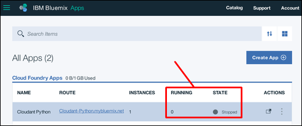
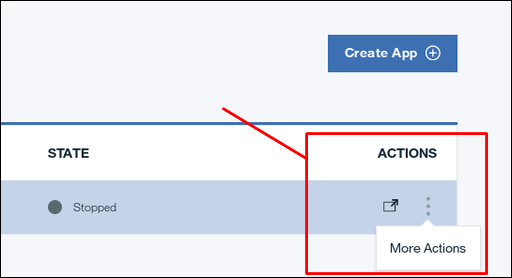
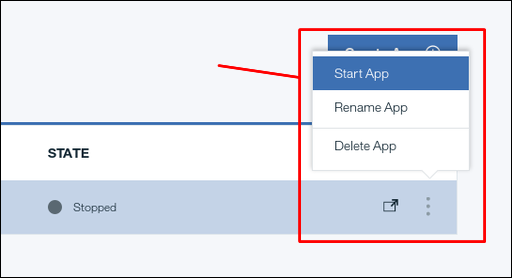
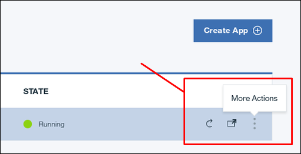
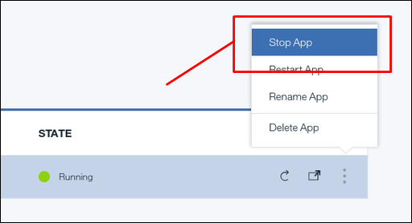
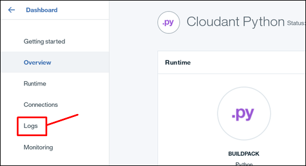
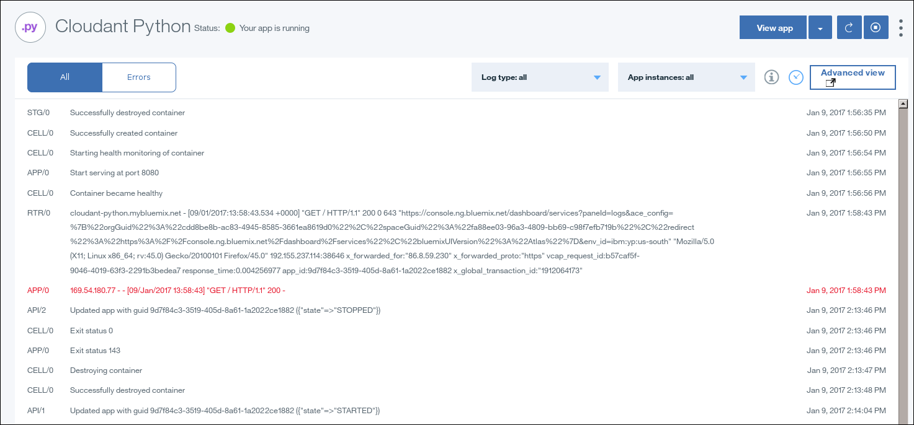
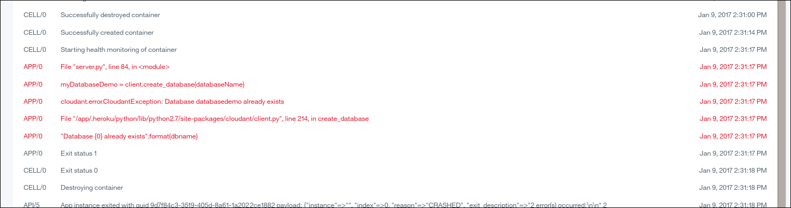

---

copyright:
  years: 2017
lastupdated: "2017-01-11"

---

{:new_window: target="_blank"}
{:shortdesc: .shortdesc}
{:screen: .screen}
{:codeblock: .codeblock}
{:pre: .pre}

<!-- Acrolinx: 2017-01-11 -->

# Creating a simple Bluemix application to access a Cloudant database: maintaining and troubleshooting

This tutorial shows you how to maintain an
{{site.data.keyword.Bluemix}} application,
hosted in your {{site.data.keyword.Bluemix_notm}} service instance.
{:shortdesc}

## Performing basic application maintenance tasks

This section of the tutorial explains how to refresh,
start,
and stop,
your Python applications on {{site.data.keyword.Bluemix_notm}}.

### Finding the status of your application

The status of applications within your
{{site.data.keyword.Bluemix_notm}} service instance is displayed on the dashboard.

In the following example,
The `Cloudant Python` application is not running,
and has a `Stopped` state: 

### Starting your application

>   **Note**: If you attempt to start the tutorial application
    without first deleting the tutorial demonstration database,
    the application cannot work correctly.
    The application enters a cycle of attempting to start,
    failing because the database exists,
    stopping,
    then attempting to start again.
    To solve the problem,
    [stop the application](#stopping-your-application),
    then delete the tutorial demonstration database.
    The application can then start successfully.

To start a stopped application,
first click the application menu icon on the dashboard: 

Next,
click the `Start App` option in the menu: 

### Stopping your application

To stop a running application,
first click the application menu icon on the dashboard: 

Next,
click the `Stop App` option in the menu: 

### Uploading a fresh version of your application

To upload a fresh version of your application,
simply follow the [upload process](create_bmxapp_upload.html).
The new version overwrites the older version of the application.

>   **Note**: If the older version of the application is already running when you start the upload,
    {{site.data.keyword.Bluemix_notm}} automatically stops the application first.

## Diagnosing and resolving problems

This section of the tutorial provides some basic troubleshooting tips to help
you identify,
diagnose,
and resolve some problems that you might encounter when you develop and deploy
your first {{site.data.keyword.Bluemix_notm}} applications.

A good source of advice on best practice for creating {{site.data.keyword.Bluemix_notm}} or
Cloud Foundry applications is
[here ](https://docs.cloudfoundry.org/devguide/deploy-apps/prepare-to-deploy.html){:new_window}.

In particular,
the advice on
[avoiding writes to the local file system ](https://docs.cloudfoundry.org/devguide/deploy-apps/prepare-to-deploy.html#filesystem){:new_window}
is prudent.

>   **Note**: For reasons of simplicity,
    this tutorial does write content to the local file system.
    However,
    the quantity of material is small.
    It is not expected to persist,
    and it is not 'mission critical'.

### Using the application log

The most useful resource for diagnosing and resolving problems with
{{site.data.keyword.Bluemix_notm}} application is the log file.

The log file for a {{site.data.keyword.Bluemix_notm}} application can be found on the `Logs` information page: 

Like most log files,
a {{site.data.keyword.Bluemix_notm}} application log contains details about what events occurred,
and when.

The log also identifies which component was involved in the recorded event.
The following table identifies key components:

Component label | Component
----------------|----------
`API`           | The Cloud Foundry system.
`APP`           | Your application.
`CELL`          | The container that holds your application within {{site.data.keyword.Bluemix_notm}}.
`RTR`           | The networking components carry messages to or from your application.

For example,
the following screen capture includes a number of typical events: 

Note the events at the following times:

-   At 1:56:56 PM, the application started successfully.
-   At 1:58:43 PM, the network received a simple HTTP request, to `GET /`.
-   Moments later, the application received the HTTP request, and replied to it.
-   At 2:13:46 PM, a request was received to stop the application.
-   At 2:13:48 PM, the application completed the process of halting.

The application that is described in this tutorial is deliberately minimal.
As a specific example,
no attempt is made to determine whether the target database exists,
and,
if it does exist,
to avoid attempting to create it again.
The effect is that if you try to run the tutorial application more than once,
without removing the database beforehand,
the application repeatedly fails and restarts.

You can see this effect in the following screen capture: 

At 2:31:23 PM,
the application detected a problem: 
`"Database {0} already exists".format(dbname)`

The remaining messages are what you expect from any Python application that encounters a problem.

In effect,
the log shows you what component encountered a problem,
and provides as much detail as possible.
You must then apply normal application troubleshooting procedures to resolve the problem.

## End of tutorial

The tutorial is complete.